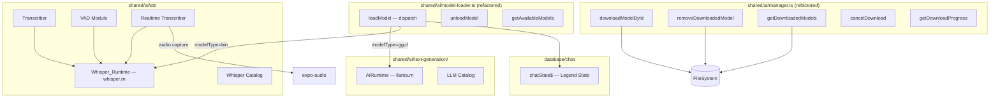

# Design Document — ai-model-manager-stt

## Overview

This feature extends the existing AI infrastructure in two directions:

1. **Refactor `shared/ai/manager.ts` and `shared/ai/model-loader.ts`** into a unified, multi-type model manager that handles both GGUF (LLM) and `.bin` (Whisper/STT) files, with concurrent download support.
2. **Introduce `shared/ai/stt/`** — a new module powered by `whisper.rn` that provides on-device speech-to-text transcription, Voice Activity Detection (VAD), and real-time microphone transcription.

The design preserves all existing LLM behaviour while adding a parallel Whisper path. Both paths share the same download/storage layer, the same `Result<T>` error-handling pattern, and the same Legend State persistence mechanism.

### Key Decisions

| Decision | Choice | Rationale |
|---|---|---|
| Whisper models | whisper-tiny-pt, whisper-base-pt, whisper-small-pt (`.bin`) | pt-BR optimised, hosted on HuggingFace |
| Audio capture | `expo-audio` only | Already in the project; avoids `expo-av` / `react-native-audio-record` |
| Error messages | Brazilian Portuguese | Consistent with existing codebase |
| VAD | `whisper.rn` built-in VAD | No extra library; `initWhisperVad` + `detectSpeech` |
| Model storage | `{documentDirectory}models/{modelId}.gguf` / `.bin` | Extends current convention |
| Error handling | `Result<T>` / `ok` / `err` | Already used throughout |
| State persistence | Legend State (`chatState$`) | Already used for LLM model ID |

---

## Architecture



### Module Responsibilities

- **`manager.ts`** — pure storage layer: download, cache, remove, progress tracking. No runtime knowledge.
- **`model-loader.ts`** — dispatch layer: reads catalog to determine model type, delegates to the correct runtime, persists state.
- **`stt/runtime.ts`** — Whisper_Runtime singleton: lifecycle (load/unload), exposes the `whisper.rn` context.
- **`stt/catalog.ts`** — Whisper model entries (mirrors the LLM catalog pattern).
- **`stt/transcribe.ts`** — file/buffer transcription via the loaded Whisper context.
- **`stt/vad.ts`** — speech segment detection using `whisper.rn`'s built-in VAD.
- **`stt/realtime.ts`** — microphone capture via `expo-audio` + chunked transcription.
- **`stt/types.ts`** — shared STT types.

---

## Components and Interfaces

### 1. Refactored `shared/ai/manager.ts`

```typescript
// Model type discriminator
export type ModelType = "gguf" | "bin";

// Extended download info
export interface DownloadedModelInfo {
  modelId: string;
  localPath: string;
  modelType: ModelType;
}

// Active download task tracked in-memory
interface DownloadTask {
  promise: Promise<Result<string>>;
  progress: number;
  abortController: AbortController;
}

// Public API
export function getModelUri(modelId: string, modelType: ModelType): string;
export async function downloadModelById(
  modelId: string,
  link: string,
  modelType: ModelType,
  onProgress?: OnDownloadProgress,
): Promise<Result<string>>;
export async function cancelDownload(modelId: string): Promise<void>;
export function getDownloadProgress(modelId: string): number | null;
export async function getDownloadedModels(): Promise<Record<string, DownloadedModelInfo>>;
export async function isModelDownloaded(modelId: string): Promise<boolean>;
export async function getModelLocalPath(modelId: string): Promise<string | null>;
export async function removeDownloadedModel(modelId: string): Promise<Result<void>>;
export function invalidateDownloadedModelsCache(): void;
```

Key changes from current implementation:
- `getModelUri` now accepts `modelType` to produce `.gguf` or `.bin` paths.
- An in-memory `Map<string, DownloadTask>` replaces the single-download pattern, enabling concurrent downloads.
- `cancelDownload` aborts the `DownloadResumable` and deletes any partial file.
- `getDownloadProgress` reads from the in-memory task map.
- `getDownloadedModels` scans for both `.gguf` and `.bin` files and returns `DownloadedModelInfo` per entry.

### 2. Refactored `shared/ai/model-loader.ts`

```typescript
export async function loadModel(modelId: string): Promise<ModelLoadResult>;
export async function unloadModel(modelId: string): Promise<ModelLoadResult>;
export function getSelectedModelId(modelType: ModelType): string | null;
export async function autoLoadLastModel(modelType: ModelType): Promise<ModelLoadResult>;
export async function getAvailableModels(): Promise<AvailableModel[]>;
```

Dispatch logic in `loadModel`:
1. Look up `modelId` in the unified catalog (LLM + Whisper).
2. If `modelType === "gguf"` → delegate to `getAIRuntime().loadModel(...)`.
3. If `modelType === "bin"` → delegate to `getWhisperRuntime().loadModel(...)`.
4. Persist to `chatState$.lastModelId` (LLM) or `chatState$.lastWhisperModelId` (Whisper).

### 3. `shared/ai/stt/runtime.ts` — Whisper_Runtime

```typescript
import { initWhisper, WhisperContext } from "whisper.rn";

export class WhisperRuntime {
  private context: WhisperContext | null = null;
  private modelId: string | null = null;
  private loadingPromise: Promise<Result<{ id: string }>> | null = null;

  isModelLoaded(id?: string): boolean;
  getCurrentModel(): { id: string; isLoaded: true } | null;
  async loadModel(modelId: string, path: string): Promise<Result<{ id: string }>>;
  async unloadModel(): Promise<Result<void>>;
  getContext(): WhisperContext | null;
}

export function getWhisperRuntime(): WhisperRuntime;
```

- `loadModel` calls `initWhisper({ filePath: path })` and stores the returned context.
- Concurrent load calls queue behind the existing `loadingPromise`.
- `unloadModel` calls `context.release()`.

### 4. `shared/ai/stt/catalog.ts` — Whisper Catalog

```typescript
import { WhisperModel } from "./types";

export const WHISPER_CATALOG: WhisperModel[] = [
  {
    id: "whisper-tiny-pt",
    displayName: "Whisper Tiny (pt-BR)",
    description: "Modelo mais leve, ideal para dispositivos com pouca memória.",
    downloadLink: "https://huggingface.co/ggerganov/whisper.cpp/resolve/main/ggml-tiny.bin",
    fileSizeBytes: 77704715,
    estimatedRamBytes: 125000000,
    modelType: "bin",
  },
  {
    id: "whisper-base-pt",
    displayName: "Whisper Base (pt-BR)",
    description: "Equilíbrio entre velocidade e precisão para português brasileiro.",
    downloadLink: "https://huggingface.co/ggerganov/whisper.cpp/resolve/main/ggml-base.bin",
    fileSizeBytes: 147951465,
    estimatedRamBytes: 210000000,
    modelType: "bin",
  },
  {
    id: "whisper-small-pt",
    displayName: "Whisper Small (pt-BR)",
    description: "Maior precisão para português brasileiro, requer mais memória.",
    downloadLink: "https://huggingface.co/ggerganov/whisper.cpp/resolve/main/ggml-small.bin",
    fileSizeBytes: 487601967,
    estimatedRamBytes: 600000000,
    modelType: "bin",
  },
];

export function findWhisperModelById(id: string): WhisperModel | undefined;
export function getAllWhisperModels(): WhisperModel[];
```

### 5. `shared/ai/stt/transcribe.ts` — Transcriber

```typescript
export interface TranscribeOptions {
  language?: string;
  abortSignal?: AbortSignal;
  onProgress?: (progress: number) => void;
}

export async function transcribe(
  audioPath: string,
  options?: TranscribeOptions,
): Promise<Result<TranscriptionResult>>;
```

Implementation notes:
- Checks file existence via `FileSystem.getInfoAsync` before calling `whisperContext.transcribe`.
- Passes `language` hint to `whisper.rn` options.
- Hooks `abortSignal` to the `stop()` function returned by `whisperContext.transcribe`.
- Maps `whisper.rn` result `{ result, segments }` to `TranscriptionResult`.

### 6. `shared/ai/stt/vad.ts` — VAD Module

```typescript
export interface VADOptions {
  silenceThresholdMs?: number; // default 300
}

export async function detectSpeechSegments(
  audioPath: string,
  options?: VADOptions,
): Promise<Result<SpeechSegment[]>>;

export function isSpeaking(audioChunk: Float32Array): boolean;
```

Implementation notes:
- Uses `whisper.rn`'s built-in `whisperContext.transcribe` with VAD-related options (`no_speech_thold`, `vad_thold`) rather than a separate VAD library.
- `detectSpeechSegments` extracts `segments` from the transcription result and maps them to `SpeechSegment[]` with `startMs`/`endMs`.
- `isSpeaking` performs a lightweight energy-threshold check on the raw PCM chunk.

### 7. `shared/ai/stt/realtime.ts` — Realtime Transcriber

```typescript
export interface RealtimeOptions {
  language?: string;
  onPartialResult: (text: string) => void;
  onFinalResult: (text: string) => void;
}

export async function startRealtimeTranscription(
  options: RealtimeOptions,
): Promise<Result<void>>;

export async function stopRealtimeTranscription(): Promise<Result<void>>;
```

Implementation notes:
- Uses `AudioModule.requestRecordingPermissionsAsync()` from `expo-audio` before starting.
- Creates an `AudioRecorder` with a 16 kHz, mono, PCM-like preset suitable for Whisper.
- Polls `audioRecorder.uri` on a 500 ms interval, feeds accumulated audio to `whisperContext.transcribe`, and emits partial results via `onPartialResult`.
- On `stopRealtimeTranscription`, stops the recorder, runs a final transcription pass, emits via `onFinalResult`, and releases the recorder.
- Guards against concurrent sessions with an `isActive` flag.

---

## Data Models

### `shared/ai/types/model.ts` (extended)

```typescript
export type ModelType = "gguf" | "bin";

export interface Model {
  id: string;
  displayName: string;
  bytes?: string;           // LLM only
  description: string;
  huggingFaceId?: string;   // LLM only
  downloadLink: string;
  fileSizeBytes: number;
  estimatedRamBytes: number;
  tags?: string[];
  supportsReasoning?: boolean; // LLM only
  modelType: ModelType;     // NEW — discriminator
}
```

### `shared/ai/stt/types.ts`

```typescript
export interface WhisperModel {
  id: string;
  displayName: string;
  description: string;
  downloadLink: string;
  fileSizeBytes: number;
  estimatedRamBytes: number;
  modelType: "bin";
}

export interface TranscriptionResult {
  text: string;
  language: string;
  segments: TranscriptionSegment[];
}

export interface TranscriptionSegment {
  text: string;
  startMs: number;
  endMs: number;
}

export interface SpeechSegment {
  startMs: number;
  endMs: number;
}
```

### `database/chat/index.ts` (extended)

```typescript
interface IChatState {
  conversations: Record<string, ChatConversation>;
  lastModelId: string | null;           // existing — LLM
  lastWhisperModelId: string | null;    // NEW — Whisper
  isReasoningEnabled?: boolean;
}
```

### `shared/ai/types/manager.ts` (extended)

```typescript
export type ModelType = "gguf" | "bin";

export interface DownloadProgressInfo {
  modelId: string;
  progress: number;
}

export type OnDownloadProgress = (info: DownloadProgressInfo) => void;

export interface DownloadedModelInfo {
  modelId: string;
  localPath: string;
  modelType: ModelType;
}
```

### `shared/ai/types/model-loader.ts` (extended)

```typescript
export interface ModelLoadResult {
  success: boolean;
  error?: string;
}

export interface AvailableModel {
  id: string;
  displayName: string;
  bytes: string;
  isLoaded: boolean;
  supportsReasoning: boolean;
  modelType: ModelType;   // NEW
}
```

---

## Correctness Properties

*A property is a characteristic or behavior that should hold true across all valid executions of a system — essentially, a formal statement about what the system should do. Properties serve as the bridge between human-readable specifications and machine-verifiable correctness guarantees.*

### Property 1: Concurrent downloads are independent

*For any* two distinct model IDs downloaded concurrently, the completion of one download SHALL NOT affect the progress or outcome of the other.

**Validates: Requirements 2.1**

### Property 2: Duplicate download deduplication

*For any* model ID, calling `downloadModelById` N times concurrently SHALL result in exactly one network request and all N callers receiving the same resolved `Result`.

**Validates: Requirements 2.2**

### Property 3: Download progress monotonicity

*For any* active download, the sequence of progress values reported via `onProgress` SHALL be non-decreasing and SHALL end at 100 upon success.

**Validates: Requirements 2.3**

### Property 4: Model type routing

*For any* model ID present in the unified catalog, `loadModel(modelId)` SHALL dispatch to the LLM_Runtime if and only if `modelType === "gguf"`, and to the Whisper_Runtime if and only if `modelType === "bin"`.

**Validates: Requirements 4.1, 4.2**

### Property 5: Transcription result round-trip

*For any* valid `TranscriptionResult` object, `JSON.parse(JSON.stringify(result))` SHALL produce an object that is structurally equivalent to the original (same `text`, `language`, and `segments` array).

**Validates: Requirements 10.2, 10.3**

### Property 6: VAD empty-audio safety

*For any* audio input containing no speech, `detectSpeechSegments` SHALL return `ok([])` and SHALL NOT return an error.

**Validates: Requirements 8.2**

### Property 7: Cache invalidation consistency

*For any* sequence of download, remove, and `invalidateDownloadedModelsCache` operations, a subsequent call to `getDownloadedModels` SHALL reflect the true on-disk state.

**Validates: Requirements 1.6, 1.7**

### Property 8: Realtime throttle

*For any* realtime transcription session of duration T seconds, the number of `onPartialResult` invocations SHALL be at most ⌈T / 0.5⌉.

**Validates: Requirements 9.3**

---

## Error Handling

All public functions return `Result<T>`. Error codes used:

| Code | Where | Meaning |
|---|---|---|
| `STORAGE_ERROR` | manager | Download failed, file deletion failed |
| `NOT_READY` | transcribe, VAD, realtime | No Whisper model loaded |
| `FILE_NOT_FOUND` | transcribe | Audio file does not exist |
| `ABORTED` | transcribe | AbortSignal fired |
| `ALREADY_ACTIVE` | realtime | Session already running |
| `PERMISSION_DENIED` | realtime | Microphone permission not granted |
| `OUT_OF_MEMORY` | realtime | OOM during active session |
| `NOT_FOUND` | model-loader | Model not in catalog |
| `UNKNOWN_ERROR` | all | Unexpected native exception |

All user-facing `message` strings are in Brazilian Portuguese, e.g.:
- `"Modelo não encontrado"`
- `"Modelo não baixado"`
- `"Permissão de microfone negada"`
- `"Sessão de transcrição já ativa"`
- `"Arquivo de áudio não encontrado"`
- `"Transcrição cancelada"`
- `"Memória insuficiente durante transcrição em tempo real"`

### Partial-file cleanup

When a download fails or is cancelled, the manager deletes any partial `.gguf` / `.bin` file before returning the error, preventing corrupt entries from appearing in `getDownloadedModels`.

### Whisper context guard

Every function in `stt/transcribe.ts`, `stt/vad.ts`, and `stt/realtime.ts` checks `getWhisperRuntime().isModelLoaded()` as its first step and returns `err(createError("NOT_READY", "Nenhum modelo Whisper carregado."))` if false.

---

## Testing Strategy

### Unit Tests (example-based)

- `manager.ts`: verify `.gguf` and `.bin` URI generation, cache TTL expiry, cache invalidation, deduplication logic (mock `FileSystem`).
- `model-loader.ts`: verify dispatch to correct runtime based on `modelType`, verify state persistence calls.
- `stt/catalog.ts`: verify all three Whisper entries are present with correct fields.
- `stt/transcribe.ts`: verify `FILE_NOT_FOUND` when file absent, `NOT_READY` when no model loaded, `ABORTED` when signal fires.
- `stt/vad.ts`: verify `ok([])` on silent audio, `NOT_READY` guard.
- `stt/realtime.ts`: verify `ALREADY_ACTIVE` guard, `PERMISSION_DENIED` guard, `NOT_READY` guard.

### Property-Based Tests

Using **fast-check** (already available in the JS ecosystem; consistent with the TypeScript/React Native stack). Each test runs a minimum of **100 iterations**.

**Property 1 — Concurrent downloads are independent**
Tag: `Feature: ai-model-manager-stt, Property 1: concurrent downloads are independent`
Generate: two distinct model IDs and mock download durations; assert neither result is affected by the other.

**Property 2 — Duplicate download deduplication**
Tag: `Feature: ai-model-manager-stt, Property 2: duplicate download deduplication`
Generate: a model ID and a count N (2–10); assert exactly one `FileSystem.createDownloadResumable` call and all N promises resolve to the same value.

**Property 3 — Download progress monotonicity**
Tag: `Feature: ai-model-manager-stt, Property 3: download progress monotonicity`
Generate: a sequence of `totalBytesWritten` values; assert the reported progress sequence is non-decreasing and ends at 100.

**Property 4 — Model type routing**
Tag: `Feature: ai-model-manager-stt, Property 4: model type routing`
Generate: a model ID from the unified catalog; assert `loadModel` calls the correct runtime method.

**Property 5 — Transcription result round-trip**
Tag: `Feature: ai-model-manager-stt, Property 5: transcription result round-trip`
Generate: arbitrary `TranscriptionResult` objects (random text, language codes, segment arrays); assert `JSON.parse(JSON.stringify(r))` deep-equals `r`.

**Property 6 — VAD empty-audio safety**
Tag: `Feature: ai-model-manager-stt, Property 6: VAD empty-audio safety`
Generate: audio paths that mock a silent audio file; assert result is `ok([])`.

**Property 7 — Cache invalidation consistency**
Tag: `Feature: ai-model-manager-stt, Property 7: cache invalidation consistency`
Generate: random sequences of download/remove/invalidate operations on a mocked filesystem; assert `getDownloadedModels` always reflects the true disk state after invalidation.

**Property 8 — Realtime throttle**
Tag: `Feature: ai-model-manager-stt, Property 8: realtime throttle`
Generate: session durations (1–60 s) with a mocked clock; assert `onPartialResult` call count ≤ ⌈duration / 0.5⌉.

### Integration Tests

- End-to-end download of a real Whisper `.bin` model on a device/emulator.
- Load → transcribe → unload cycle with a sample `.wav` file.
- Realtime session start/stop with microphone permission granted.
