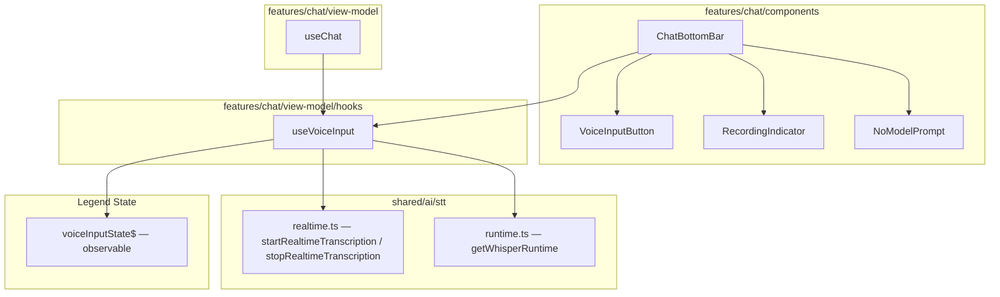

# Design Document — voice-message-chat

## Overview

This feature adds a voice message input to the existing chat UI. Users can press-and-hold or tap-to-toggle a microphone button to record speech, see live partial transcription in the text field, and have the final transcript automatically submitted as a chat message.

The implementation integrates with the already-shipped `ai-model-manager-stt` spec:
- `shared/ai/stt/realtime.ts` — `startRealtimeTranscription` / `stopRealtimeTranscription`
- `shared/ai/stt/runtime.ts` — `getWhisperRuntime()` singleton

All user-facing strings are in Brazilian Portuguese. State management uses Legend State observables, consistent with the rest of the app. Error handling follows the `Result<T>` / `ok` / `err` pattern.

### Key Design Decisions

| Decision | Choice | Rationale |
|---|---|---|
| State machine location | `features/chat/view-model/hooks/useVoiceInput.ts` | Keeps voice logic isolated from the existing `useChat` hook; composable |
| Gesture handling | React Native `Pressable` with `onLongPress` + `PanResponder` for swipe | `react-native-gesture-handler` is available but `Pressable` + `PanResponder` avoids wrapping the entire bottom bar in a `GestureHandlerRootView` |
| Animation | `react-native-reanimated` (already in project) | Consistent with `SendButton` animation pattern |
| Partial transcript display | Italic + reduced opacity via NativeWind class | Matches the existing `AutoResizingInput` styling approach |
| Permission check | Before calling `startRealtimeTranscription` | The STT module already handles `PERMISSION_DENIED`; we add a pre-check to show the settings button |
| No-model prompt | Bottom sheet using existing `Dialog` / `AlertDialog` primitives | Consistent with `react-native-reusables` patterns already in the project |
| Duration timer | `setInterval` inside the hook, cleared on state exit | Simple and self-contained |

---

## Architecture



### Module Responsibilities

- **`VoiceInputButton`** — renders the mic icon, handles long-press / tap / swipe-left gestures, delegates all logic to `useVoiceInput`.
- **`RecordingIndicator`** — pulsing animated dot shown only while `state === "recording"`.
- **`NoModelPrompt`** — `AlertDialog` shown when `startRealtimeTranscription` returns `NOT_READY`.
- **`useVoiceInput`** — the single source of truth for voice state; owns the Legend State observable, the timer, and all STT calls.
- **`ChatBottomBar`** — extended to accept `useVoiceInput` output and conditionally render `VoiceInputButton` vs `SendButton`.

---

## Components and Interfaces

### `useVoiceInput` hook

```typescript
// features/chat/view-model/hooks/useVoiceInput.ts

export type VoiceInputStatus = "idle" | "recording" | "processing";

export interface UseVoiceInputOptions {
  /** Called when a non-empty final transcript is ready to be sent */
  onTranscriptReady: (text: string) => void;
  /** Called to navigate to the model download screen */
  onNavigateToModelDownload: () => void;
}

export interface UseVoiceInputResult {
  status: VoiceInputStatus;
  partialTranscript: string;
  recordingDurationSeconds: number;
  isCancelPreview: boolean;       // true when swipe > 40 pts but < 80 pts
  permissionDenied: boolean;
  permissionPermanentlyDenied: boolean;
  noModelPromptVisible: boolean;
  errorMessage: string | null;

  // Gesture handlers for VoiceInputButton
  onPressIn: () => void;          // long-press start
  onPressOut: () => void;         // long-press release
  onTap: () => void;              // short tap toggle
  onSwipeUpdate: (dx: number) => void;
  onSwipeEnd: (dx: number) => void;

  // Actions
  openSettings: () => void;
  dismissNoModelPrompt: () => void;
  confirmModelDownload: () => void;
}

export function useVoiceInput(options: UseVoiceInputOptions): UseVoiceInputResult;
```

### `VoiceInputButton` component

```typescript
// features/chat/components/voice-input-button.tsx

interface VoiceInputButtonProps {
  status: VoiceInputStatus;
  isCancelPreview: boolean;
  onPressIn: () => void;
  onPressOut: () => void;
  onTap: () => void;
  onSwipeUpdate: (dx: number) => void;
  onSwipeEnd: (dx: number) => void;
}
```

### `RecordingIndicator` component

```typescript
// features/chat/components/recording-indicator.tsx

interface RecordingIndicatorProps {
  visible: boolean;
  cancelPreview: boolean;   // reduces opacity to 0.5 when true
}
```

### `NoModelPrompt` component

```typescript
// features/chat/components/no-model-prompt.tsx

interface NoModelPromptProps {
  visible: boolean;
  onConfirm: () => void;
  onDismiss: () => void;
}
```

### Extended `ChatBottomBarProps`

```typescript
// Added to existing ChatBottomBarProps interface
voiceInput: UseVoiceInputResult;
```

---

## Data Models

### Voice Input State Observable

The voice input state is kept in a local (non-persisted) Legend State observable inside `useVoiceInput`. It does **not** need to survive app restarts.

```typescript
// Inside useVoiceInput.ts
import { observable } from "@legendapp/state";

const voiceState$ = observable<{
  status: VoiceInputStatus;
  partialTranscript: string;
  durationSeconds: number;
  isCancelPreview: boolean;
  permissionDenied: boolean;
  permissionPermanentlyDenied: boolean;
  noModelPromptVisible: boolean;
  errorMessage: string | null;
}>({
  status: "idle",
  partialTranscript: "",
  durationSeconds: 0,
  isCancelPreview: false,
  permissionDenied: false,
  permissionPermanentlyDenied: false,
  noModelPromptVisible: false,
  errorMessage: null,
});
```

### State Machine Transitions

```
idle ──(tap / long-press)──► recording ──(release / tap)──► processing ──(final transcript)──► idle
  ▲                              │                               │
  │                              │ (cancel gesture)              │ (error / empty transcript)
  └──────────────────────────────┴───────────────────────────────┘
```

Valid transitions:
- `idle` → `recording`: tap or long-press, after permission check and STT start succeeds
- `recording` → `processing`: release or second tap (no cancel)
- `recording` → `idle`: cancel gesture, or any error
- `processing` → `idle`: final transcript received (empty or non-empty), or any error

Invalid transitions (must never occur):
- `idle` → `processing` (direct)
- `processing` → `recording` (direct)

### Permission State

Microphone permission is checked via `expo-audio`'s `AudioModule.getRecordingPermissionsAsync()` before each activation. The result is stored in the observable:
- `permissionDenied: true` — permission was denied (show inline error)
- `permissionPermanentlyDenied: true` — permission is permanently denied (show "Abrir Configurações" button)

### Error Recovery

All errors reset `status` to `"idle"` within 500 ms. The `errorMessage` field is set and cleared after a 3-second display timeout.

---

## Correctness Properties

*A property is a characteristic or behavior that should hold true across all valid executions of a system — essentially, a formal statement about what the system should do. Properties serve as the bridge between human-readable specifications and machine-verifiable correctness guarantees.*

### Property 1: Button visibility is determined by text content

*For any* string value in the chat input field, the `VoiceInputButton` is visible if and only if the string is empty (length === 0 after trim), and the `SendButton` is visible if and only if the string is non-empty.

**Validates: Requirements 1.2, 1.3**

### Property 2: Idle → Recording transition is the only way to start recording

*For any* `VoiceInputStatus` value, the state can only transition to `"recording"` from `"idle"`. No other source state can produce `"recording"`.

**Validates: Requirements 2.1, 3.1, 10.6**

### Property 3: Recording → Processing is the only path to processing

*For any* `VoiceInputStatus` value, the state can only transition to `"processing"` from `"recording"`. No other source state can produce `"processing"`.

**Validates: Requirements 2.2, 3.2, 10.6**

### Property 4: All errors reset state to idle

*For any* error code returned by `startRealtimeTranscription` or `stopRealtimeTranscription`, or emitted during an active session, the resulting `VoiceInputStatus` SHALL be `"idle"`.

**Validates: Requirements 7.2, 9.1, 9.2, 9.3**

### Property 5: Cancel gesture always discards and resets to idle

*For any* `"recording"` state, when a cancel gesture (swipe-left ≥ 80 pts) is completed, the `VoiceInputStatus` SHALL transition to `"idle"` and no message SHALL be submitted.

**Validates: Requirements 6.2**

### Property 6: Non-empty final transcript always triggers message submission

*For any* string returned as the final transcript whose trimmed length is greater than zero, `onTranscriptReady` SHALL be called exactly once with that trimmed string, and the state SHALL transition to `"idle"`.

**Validates: Requirements 2.4, 3.3**

### Property 7: Empty final transcript never triggers message submission

*For any* string composed entirely of whitespace (including the empty string) returned as the final transcript, `onTranscriptReady` SHALL NOT be called, and the state SHALL transition to `"idle"`.

**Validates: Requirements 2.5, 3.3**

### Property 8: Permission denied always blocks STT start

*For any* activation attempt (tap or long-press) when microphone permission is known to be denied, `startRealtimeTranscription` SHALL NOT be called.

**Validates: Requirements 7.4**

### Property 9: Processing state disables the voice button

*For any* `"processing"` state, the `VoiceInputButton` SHALL be disabled (non-interactive), preventing a new recording session from starting.

**Validates: Requirements 10.3**

### Property 10: AccessibilityLabel reflects current state

*For any* valid `VoiceInputStatus` value, the `accessibilityLabel` of the `VoiceInputButton` SHALL be the correct Brazilian Portuguese string for that state:
- `"idle"` → `"Gravar mensagem de voz"`
- `"recording"` → `"Parar gravação"`
- `"processing"` → `"Processando gravação"`

**Validates: Requirements 11.1**

### Property 11: Duration label format is correct for all durations

*For any* non-negative integer `n` representing recording duration in seconds, the duration label SHALL contain the string formatted as `"Gravando… M:SS"` where `M` is minutes and `SS` is zero-padded seconds.

**Validates: Requirements 5.5**

---

## Error Handling

### Error Code Mapping

| Error Code | Source | UI Response |
|---|---|---|
| `PERMISSION_DENIED` | `startRealtimeTranscription` | Inline error: "Permissão de microfone negada. Habilite nas configurações." + "Abrir Configurações" button if permanent |
| `NOT_READY` | `startRealtimeTranscription` | `NoModelPrompt` bottom sheet: "Nenhum modelo de voz carregado. Deseja baixar um agora?" |
| `ALREADY_ACTIVE` | `startRealtimeTranscription` | Generic error: "Erro ao iniciar gravação. Tente novamente." → idle |
| `OUT_OF_MEMORY` | During active session | Error: "Memória insuficiente. Gravação encerrada." → idle |
| `UNKNOWN_ERROR` | Any | Generic error: "Erro ao iniciar gravação. Tente novamente." → idle |
| Stop error | `stopRealtimeTranscription` | Generic error: "Erro ao processar gravação. Tente novamente." → idle, discard partial |

### Error Recovery Flow

```
error received
  └─► set errorMessage
  └─► transition status → "idle" (within 500 ms)
  └─► clear errorMessage after 3 seconds
```

### Permission Flow

```
user activates button
  └─► getRecordingPermissionsAsync()
        ├─► granted → proceed to startRealtimeTranscription
        ├─► denied (not permanent) → show inline error, stay idle
        └─► denied (permanent) → show inline error + "Abrir Configurações" button
```

### No-Model Flow

```
startRealtimeTranscription returns NOT_READY
  └─► show NoModelPrompt (once per session attempt)
        ├─► user confirms → navigate to model download screen → idle
        └─► user dismisses → idle
```

---

## Testing Strategy

### Unit Tests (example-based)

- `useVoiceInput`: verify initial state is `idle`, verify `onTranscriptReady` is not called for empty transcripts, verify `startRealtimeTranscription` is not called when permission is denied, verify `noModelPromptVisible` is set on `NOT_READY`, verify state resets to `idle` on unmount.
- `VoiceInputButton`: verify `accessibilityLabel` changes per state, verify button is disabled in `processing` state.
- `RecordingIndicator`: verify `accessibilityRole="none"`, verify hidden when `visible=false`.
- `formatDuration(n)`: verify `0` → `"0:00"`, `65` → `"1:05"`, `3600` → `"60:00"`.
- `ChatBottomBar`: verify `VoiceInputButton` shown when `value=""`, verify `SendButton` shown when `value="hello"`.

### Property-Based Tests

Using **fast-check** (already in the project). Each test runs a minimum of **100 iterations**.

**Property 1 — Button visibility is determined by text content**
Tag: `Feature: voice-message-chat, Property 1: button visibility is determined by text content`
Generate: arbitrary strings; assert VoiceInputButton visible ↔ trimmed length === 0.

**Property 2 & 3 — Valid state machine transitions only**
Tag: `Feature: voice-message-chat, Property 2: idle is the only source of recording; Property 3: recording is the only source of processing`
Generate: random sequences of events (tap, longPressStart, longPressEnd, cancel, finalTranscript, errorCode); apply to the state machine reducer; assert no invalid transitions occur (idle→processing, processing→recording).

**Property 4 — All errors reset state to idle**
Tag: `Feature: voice-message-chat, Property 4: all errors reset state to idle`
Generate: arbitrary `AppErrorCode` values; apply to the state machine in any non-idle state; assert resulting state is `"idle"`.

**Property 5 — Cancel gesture always discards and resets to idle**
Tag: `Feature: voice-message-chat, Property 5: cancel gesture always discards and resets to idle`
Generate: arbitrary recording state + swipe displacement ≥ 80; assert state → idle and `onTranscriptReady` not called.

**Property 6 & 7 — Final transcript handling**
Tag: `Feature: voice-message-chat, Property 6: non-empty transcript triggers submission; Property 7: empty transcript never triggers submission`
Generate: arbitrary strings; assert `onTranscriptReady` called ↔ trimmed length > 0.

**Property 8 — Permission denied blocks STT**
Tag: `Feature: voice-message-chat, Property 8: permission denied always blocks STT start`
Generate: arbitrary activation events when permission is denied; assert `startRealtimeTranscription` never called.

**Property 9 — Processing state disables button**
Tag: `Feature: voice-message-chat, Property 9: processing state disables the voice button`
Generate: arbitrary `"processing"` state; assert button `disabled` prop is `true`.

**Property 10 — AccessibilityLabel reflects state**
Tag: `Feature: voice-message-chat, Property 10: accessibilityLabel reflects current state`
Generate: arbitrary `VoiceInputStatus` values; assert label matches expected Portuguese string.

**Property 11 — Duration label format**
Tag: `Feature: voice-message-chat, Property 11: duration label format is correct for all durations`
Generate: arbitrary non-negative integers (0–3600); assert `formatDuration(n)` matches `M:SS` pattern and round-trips correctly.

### Integration Tests

- End-to-end: grant microphone permission, start recording, speak, stop, verify message appears in chat.
- Permission denied: deny permission, activate button, verify error message and no STT call.
- No model: unload Whisper model, activate button, verify `NoModelPrompt` appears.
- Cancel gesture: start recording, swipe left ≥ 80 pts, verify no message sent and state is idle.
