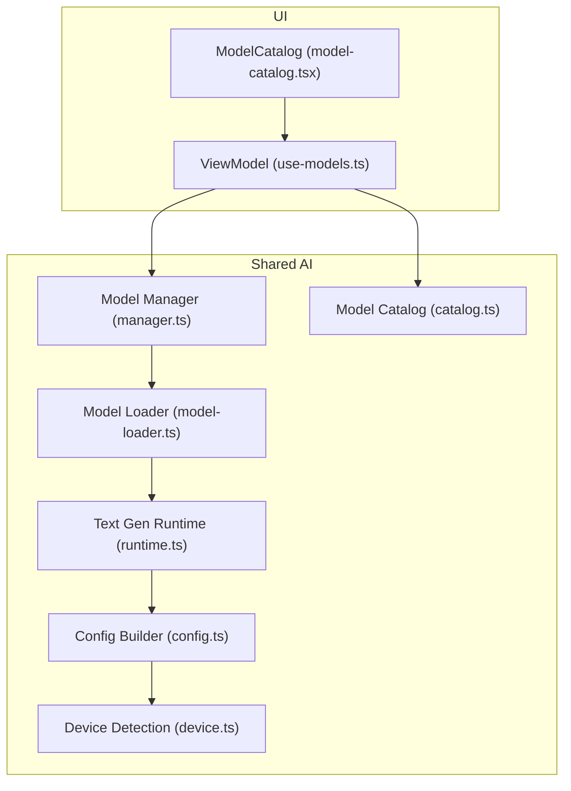
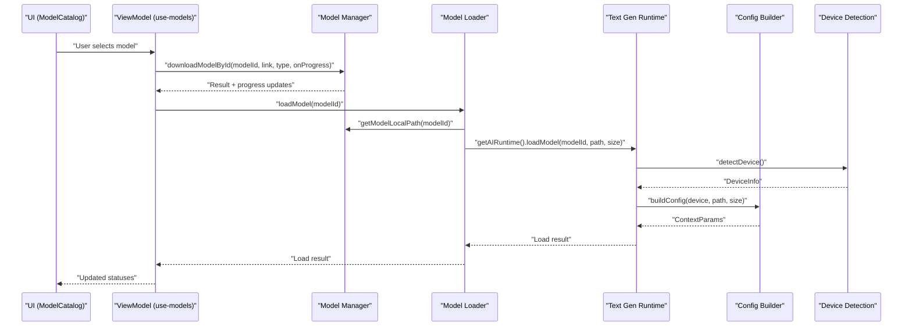
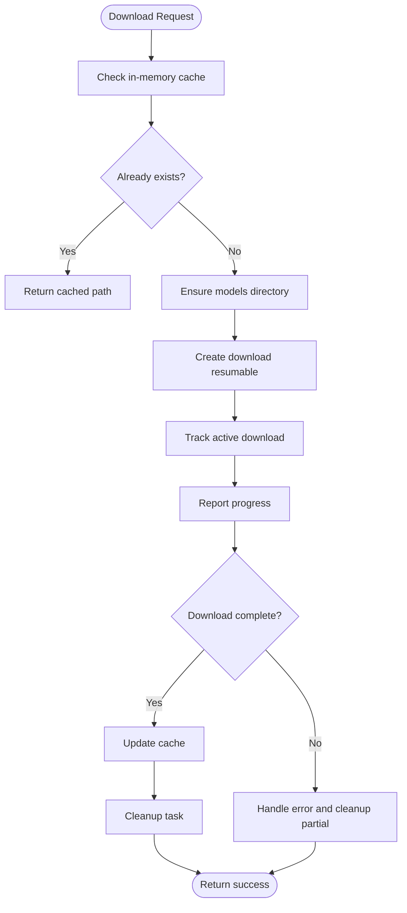
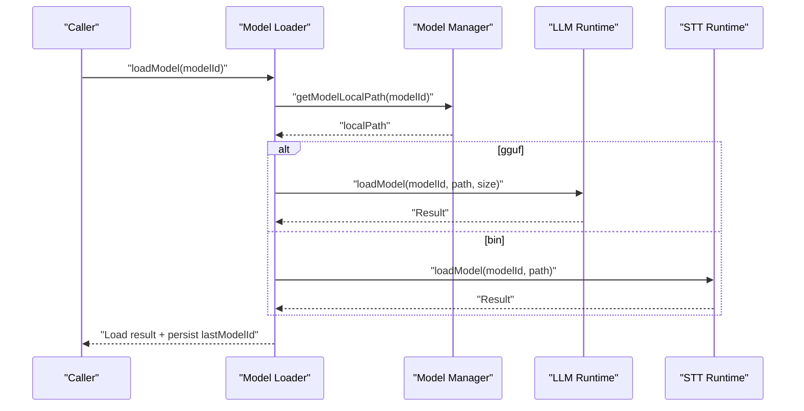
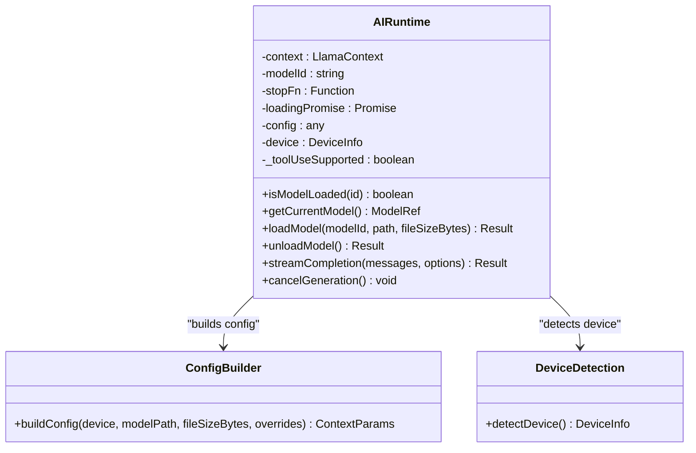
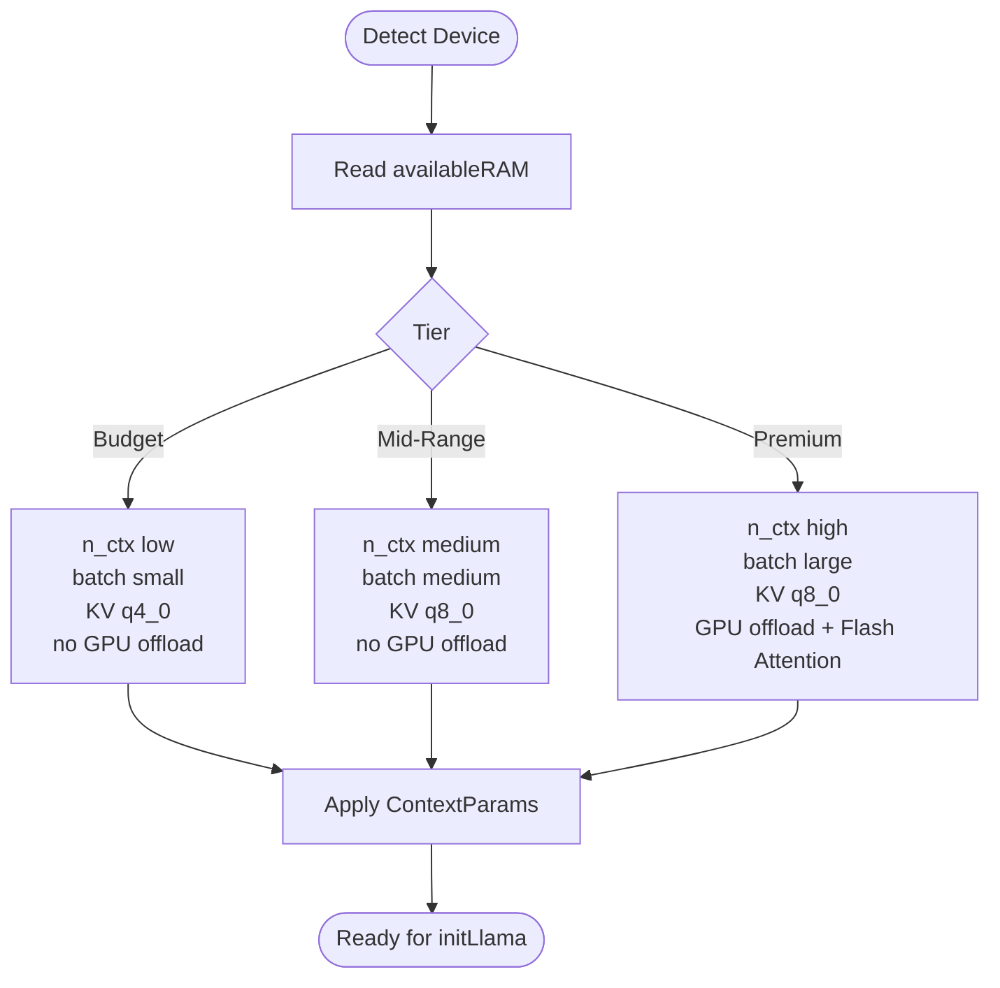
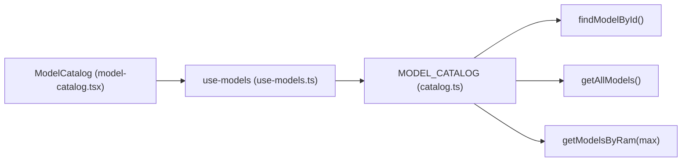
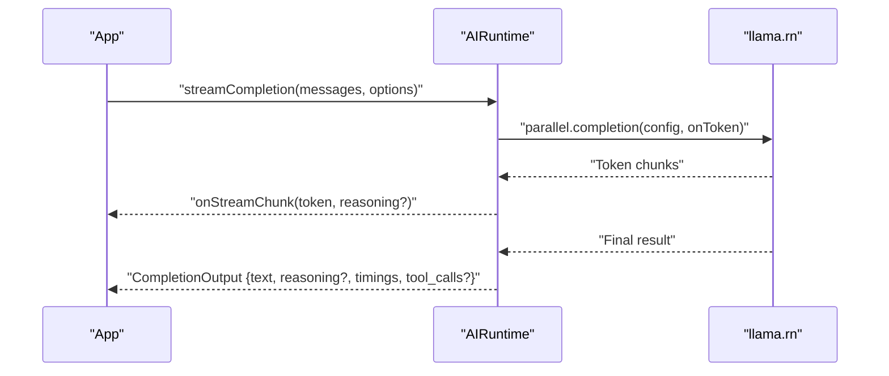
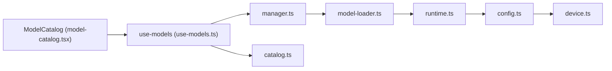

# AI Runtime System

<cite>
**Referenced Files in This Document**
- [manager.ts](file://shared/ai/manager.ts)
- [model-loader.ts](file://shared/ai/model-loader.ts)
- [runtime.ts](file://shared/ai/text-generation/runtime.ts)
- [config.ts](file://shared/ai/text-generation/config.ts)
- [constants.ts](file://shared/ai/text-generation/constants.ts)
- [oom-detection.ts](file://shared/ai/text-generation/oom-detection.ts)
- [catalog.ts](file://shared/ai/text-generation/catalog.ts)
- [types.ts](file://shared/ai/text-generation/types.ts)
- [device.ts](file://shared/device.ts)
- [use-models.ts](file://features/model-management/view-model/use-models.ts)
- [model-catalog.tsx](file://features/model-management/components/model-catalog.tsx)
</cite>

## Table of Contents
1. [Introduction](#introduction)
2. [Project Structure](#project-structure)
3. [Core Components](#core-components)
4. [Architecture Overview](#architecture-overview)
5. [Detailed Component Analysis](#detailed-component-analysis)
6. [Dependency Analysis](#dependency-analysis)
7. [Performance Considerations](#performance-considerations)
8. [Troubleshooting Guide](#troubleshooting-guide)
9. [Conclusion](#conclusion)
10. [Appendices](#appendices)

## Introduction
This document explains the AI runtime system powering local AI processing in My Shadow. It focuses on the llama.rn integration for GGUF model inference, covering model discovery and management, runtime configuration and optimization, memory management and streaming generation, and unified model usage across LLM inference and vector embeddings. It also documents the automatic device optimization system, the three-tier device support model, and practical guidance for advanced users.

## Project Structure
The AI runtime spans shared libraries for model management and text generation, and feature modules for model catalog UI and selection. The most relevant areas are:
- Model management and storage: shared/ai/manager.ts and shared/ai/model-loader.ts
- Text generation runtime and configuration: shared/ai/text-generation/*
- Device detection and optimization: shared/device.ts
- Model catalog and UI: shared/ai/text-generation/catalog.ts and features/model-management/*

**Diagram sources**
- [model-catalog.tsx:1-96](file://features/model-management/components/model-catalog.tsx#L1-L96)
- [use-models.ts:1-208](file://features/model-management/view-model/use-models.ts#L1-L208)
- [manager.ts:1-422](file://shared/ai/manager.ts#L1-L422)
- [model-loader.ts:1-172](file://shared/ai/model-loader.ts#L1-L172)
- [runtime.ts:1-489](file://shared/ai/text-generation/runtime.ts#L1-L489)
- [config.ts:1-32](file://shared/ai/text-generation/config.ts#L1-L32)
- [catalog.ts:1-330](file://shared/ai/text-generation/catalog.ts#L1-L330)
- [device.ts:1-172](file://shared/device.ts#L1-L172)

**Section sources**
- [manager.ts:1-422](file://shared/ai/manager.ts#L1-L422)
- [model-loader.ts:1-172](file://shared/ai/model-loader.ts#L1-L172)
- [runtime.ts:1-489](file://shared/ai/text-generation/runtime.ts#L1-L489)
- [config.ts:1-32](file://shared/ai/text-generation/config.ts#L1-L32)
- [catalog.ts:1-330](file://shared/ai/text-generation/catalog.ts#L1-L330)
- [device.ts:1-172](file://shared/device.ts#L1-L172)
- [use-models.ts:1-208](file://features/model-management/view-model/use-models.ts#L1-L208)
- [model-catalog.tsx:1-96](file://features/model-management/components/model-catalog.tsx#L1-L96)

## Core Components
- Model Manager: Handles model downloads, caching, listing, removal, and progress reporting. It ensures safe concurrency and deduplicates downloads.
- Model Loader: Routes model loads/unloads to the appropriate runtime (text generation or speech-to-text) and persists selection state.
- Text Generation Runtime (AIRuntime): Wraps llama.rn, manages model lifecycle, builds optimized configurations per device, streams tokens, and recovers from out-of-memory conditions.
- Device Detection: Provides device capabilities (RAM, CPU cores, GPU availability and backend) to drive automatic configuration.
- Model Catalog: Defines supported GGUF models with metadata, including recommended RAM and reasoning support.
- Streaming Types: Defines completion options and output shape for progressive rendering.

**Section sources**
- [manager.ts:1-422](file://shared/ai/manager.ts#L1-L422)
- [model-loader.ts:1-172](file://shared/ai/model-loader.ts#L1-L172)
- [runtime.ts:1-489](file://shared/ai/text-generation/runtime.ts#L1-L489)
- [device.ts:1-172](file://shared/device.ts#L1-L172)
- [catalog.ts:1-330](file://shared/ai/text-generation/catalog.ts#L1-L330)
- [types.ts:1-22](file://shared/ai/text-generation/types.ts#L1-L22)

## Architecture Overview
The system unifies model discovery and management with a device-aware runtime that automatically selects optimal parameters for GGUF models. The UI exposes a searchable catalog and allows users to download, remove, and manage models. The runtime integrates with llama.rn to perform efficient local inference with streaming and memory-conscious defaults.

**Diagram sources**
- [model-catalog.tsx:1-96](file://features/model-management/components/model-catalog.tsx#L1-L96)
- [use-models.ts:1-208](file://features/model-management/view-model/use-models.ts#L1-L208)
- [manager.ts:59-192](file://shared/ai/manager.ts#L59-L192)
- [model-loader.ts:11-63](file://shared/ai/model-loader.ts#L11-L63)
- [runtime.ts:34-157](file://shared/ai/text-generation/runtime.ts#L34-L157)
- [config.ts:4-31](file://shared/ai/text-generation/config.ts#L4-L31)
- [device.ts:122-171](file://shared/device.ts#L122-L171)

## Detailed Component Analysis

### Model Management and Storage
- Directory layout: Models are stored under a dedicated document directory with .gguf/.bin extensions.
- Caching: A short-lived in-memory cache avoids frequent filesystem scans.
- Downloads: Concurrent-safe, deduplicated via active downloads map; supports progress callbacks and cancellation.
- Listing and lookup: Reads directory entries, merges cache and filesystem, and resolves model paths for both types.
- Removal: Unloads from active runtimes when needed and deletes files.

**Diagram sources**
- [manager.ts:59-192](file://shared/ai/manager.ts#L59-L192)
- [manager.ts:253-304](file://shared/ai/manager.ts#L253-L304)

**Section sources**
- [manager.ts:11-46](file://shared/ai/manager.ts#L11-L46)
- [manager.ts:59-192](file://shared/ai/manager.ts#L59-L192)
- [manager.ts:253-304](file://shared/ai/manager.ts#L253-L304)
- [manager.ts:349-421](file://shared/ai/manager.ts#L349-L421)

### Model Loader and Unified Runtime Dispatch
- Loads or unloads models based on type (gguf/bin) and dispatches to the appropriate runtime.
- Persists last selected model IDs per type to support auto-load on startup.
- Aggregates available models from both LLM and Whisper catalogs and marks loaded state.

**Diagram sources**
- [model-loader.ts:11-63](file://shared/ai/model-loader.ts#L11-L63)
- [model-loader.ts:65-112](file://shared/ai/model-loader.ts#L65-L112)
- [model-loader.ts:139-171](file://shared/ai/model-loader.ts#L139-L171)

**Section sources**
- [model-loader.ts:11-63](file://shared/ai/model-loader.ts#L11-L63)
- [model-loader.ts:65-112](file://shared/ai/model-loader.ts#L65-L112)
- [model-loader.ts:139-171](file://shared/ai/model-loader.ts#L139-L171)

### Text Generation Runtime (AIRuntime) and llama.rn Integration
- Lifecycle: unload previous model, detect device, validate memory requirements, build config, initialize llama.rn context, warm up, and expose streaming completion.
- Streaming: Progressive token delivery with optional reasoning chunks, tool-call extraction, and abort support.
- Recovery: Automatic OOM fallback by halving context size and retrying once.
- Tool use: Detects tool-use capability from model templates and injects tools into the prompt when supported.

**Diagram sources**
- [runtime.ts:16-484](file://shared/ai/text-generation/runtime.ts#L16-L484)
- [config.ts:4-31](file://shared/ai/text-generation/config.ts#L4-L31)
- [device.ts:122-171](file://shared/device.ts#L122-L171)

**Section sources**
- [runtime.ts:34-157](file://shared/ai/text-generation/runtime.ts#L34-L157)
- [runtime.ts:256-477](file://shared/ai/text-generation/runtime.ts#L256-L477)
- [runtime.ts:479-484](file://shared/ai/text-generation/runtime.ts#L479-L484)

### Automatic Device Optimization and Three-Tier Support
- Device detection reports total/available RAM, CPU cores, GPU presence, and backend.
- Configuration builder selects:
  - Context size (n_ctx) and batch sizes (n_batch/n_ubatch) based on RAM tiers.
  - Thread count capped to CPU cores minus one.
  - GPU offload (n_gpu_layers) when available.
  - KV cache quantization (cache_type_k/cache_type_v) tuned per tier.
  - Memory-mapped loading (use_mmap) and Flash Attention activation for capable GPUs and larger models.
- Three-tier device support:
  - Budget: Low RAM (< 4GB), smaller context and KV cache quantization.
  - Mid-Range: Moderate RAM (4–7GB), balanced context and batch sizes.
  - Premium: Higher RAM (> 7GB), larger context and higher batch sizes.

**Diagram sources**
- [device.ts:122-171](file://shared/device.ts#L122-L171)
- [config.ts:4-31](file://shared/ai/text-generation/config.ts#L4-L31)

**Section sources**
- [device.ts:122-171](file://shared/device.ts#L122-L171)
- [config.ts:4-31](file://shared/ai/text-generation/config.ts#L4-L31)

### Model Catalog and Discovery
- Centralized catalog enumerates supported GGUF models with metadata (display name, size, tags, reasoning support).
- Utilities to find models by ID and filter by estimated RAM footprint.
- UI aggregates LLM and Whisper catalogs and displays model statuses.

**Diagram sources**
- [catalog.ts:317-330](file://shared/ai/text-generation/catalog.ts#L317-L330)
- [model-catalog.tsx:1-96](file://features/model-management/components/model-catalog.tsx#L1-L96)
- [use-models.ts:31-46](file://features/model-management/view-model/use-models.ts#L31-L46)

**Section sources**
- [catalog.ts:3-315](file://shared/ai/text-generation/catalog.ts#L3-L315)
- [catalog.ts:317-330](file://shared/ai/text-generation/catalog.ts#L317-L315)
- [use-models.ts:31-46](file://features/model-management/view-model/use-models.ts#L31-L46)
- [model-catalog.tsx:20-42](file://features/model-management/components/model-catalog.tsx#L20-L42)

### Streaming Generation Pipeline
- Streams tokens progressively, optionally extracting reasoning segments and tool calls.
- Tracks first-token time and final timings.
- Supports abort signals and returns structured output including optional reasoning and tool calls.

**Diagram sources**
- [runtime.ts:256-477](file://shared/ai/text-generation/runtime.ts#L256-L477)
- [types.ts:4-19](file://shared/ai/text-generation/types.ts#L4-L19)

**Section sources**
- [runtime.ts:256-477](file://shared/ai/text-generation/runtime.ts#L256-L477)
- [types.ts:4-19](file://shared/ai/text-generation/types.ts#L4-L19)

### Memory Optimization Techniques
- KV cache quantization: q4_0 for budget, q8_0 for mid/premium tiers.
- Memory-mapped loading (mmap) enabled by default for efficient I/O.
- Automatic OOM fallback: halves context size and retries once when OOM is detected.
- Stop words and streaming reduce latency and memory pressure.

**Section sources**
- [config.ts:23-26](file://shared/ai/text-generation/config.ts#L23-L26)
- [oom-detection.ts:1-37](file://shared/ai/text-generation/oom-detection.ts#L1-L37)
- [constants.ts:1-8](file://shared/ai/text-generation/constants.ts#L1-L8)

### Unified Architecture for GGUF Models
- The same GGUF models are used for both LLM inference and vector embeddings (via unified catalog and loader), enabling consistent model management across modalities.

**Section sources**
- [model-loader.ts:11-63](file://shared/ai/model-loader.ts#L11-L63)

## Dependency Analysis
- UI depends on ViewModel, which depends on Model Manager and Catalog.
- Model Manager depends on filesystem APIs and caches.
- Model Loader depends on Model Manager and routes to runtimes.
- Text Generation Runtime depends on Device Detection and Config Builder.
- Config Builder depends on Device Detection and model size.

**Diagram sources**
- [model-catalog.tsx:1-96](file://features/model-management/components/model-catalog.tsx#L1-L96)
- [use-models.ts:1-208](file://features/model-management/view-model/use-models.ts#L1-L208)
- [manager.ts:1-422](file://shared/ai/manager.ts#L1-L422)
- [model-loader.ts:1-172](file://shared/ai/model-loader.ts#L1-L172)
- [runtime.ts:1-489](file://shared/ai/text-generation/runtime.ts#L1-L489)
- [config.ts:1-32](file://shared/ai/text-generation/config.ts#L1-L32)
- [device.ts:1-172](file://shared/device.ts#L1-L172)

**Section sources**
- [use-models.ts:1-208](file://features/model-management/view-model/use-models.ts#L1-L208)
- [manager.ts:1-422](file://shared/ai/manager.ts#L1-L422)
- [model-loader.ts:1-172](file://shared/ai/model-loader.ts#L1-L172)
- [runtime.ts:1-489](file://shared/ai/text-generation/runtime.ts#L1-L489)
- [config.ts:1-32](file://shared/ai/text-generation/config.ts#L1-L32)
- [device.ts:1-172](file://shared/device.ts#L1-L172)

## Performance Considerations
- Prefer Premium tier models on devices with sufficient RAM and GPU for best throughput.
- Enable reasoning only when the model supports it to avoid unnecessary overhead.
- Use streaming to improve perceived latency; limit max tokens for shorter responses.
- Keep models sized appropriately for available RAM to avoid OOM fallbacks.
- Monitor first-token time and total timings from completion output to tune parameters.

[No sources needed since this section provides general guidance]

## Troubleshooting Guide
- Download fails or progress stalls:
  - Check connectivity and retry; progress callbacks can help diagnose pauses.
  - Cancel and retry using the provided cancellation mechanism.
- Load fails with insufficient memory:
  - Verify device RAM estimate and choose a smaller model or lower-tier device profile.
- Out-of-memory during generation:
  - The runtime attempts an automatic OOM fallback by reducing context size; if repeated failures occur, reduce max tokens or disable reasoning.
- Model appears but cannot be loaded:
  - Ensure the model was downloaded and is present locally; check file extension (.gguf or .bin) and path resolution.

**Section sources**
- [manager.ts:59-192](file://shared/ai/manager.ts#L59-L192)
- [runtime.ts:451-477](file://shared/ai/text-generation/runtime.ts#L451-L477)
- [oom-detection.ts:1-37](file://shared/ai/text-generation/oom-detection.ts#L1-L37)

## Conclusion
My Shadow’s AI runtime system provides a robust, device-aware, and memory-conscious framework for local GGUF inference using llama.rn. It unifies model discovery, management, and loading, while offering automatic optimization across three device tiers, streaming generation, and resilient OOM handling. The same GGUF models power both LLM inference and embeddings, simplifying deployment and maintenance.

[No sources needed since this section summarizes without analyzing specific files]

## Appendices

### Configuration Options for Advanced Users
- ContextParams overrides can be passed to the config builder to fine-tune behavior.
- Streaming options include max tokens, temperature, enable reasoning, abort signals, and tool definitions.
- Stop words are predefined to align with GGUF chat templates.

**Section sources**
- [config.ts:8](file://shared/ai/text-generation/config.ts#L8)
- [types.ts:11-19](file://shared/ai/text-generation/types.ts#L11-L19)
- [constants.ts:1-8](file://shared/ai/text-generation/constants.ts#L1-L8)