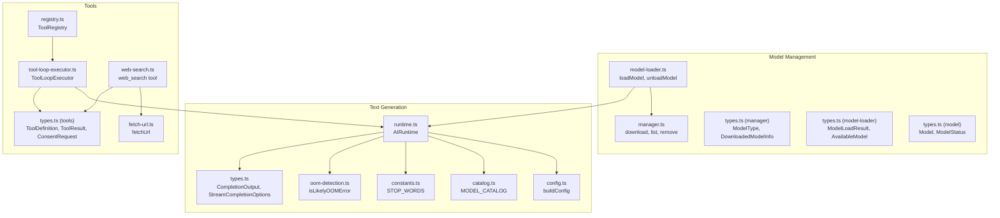
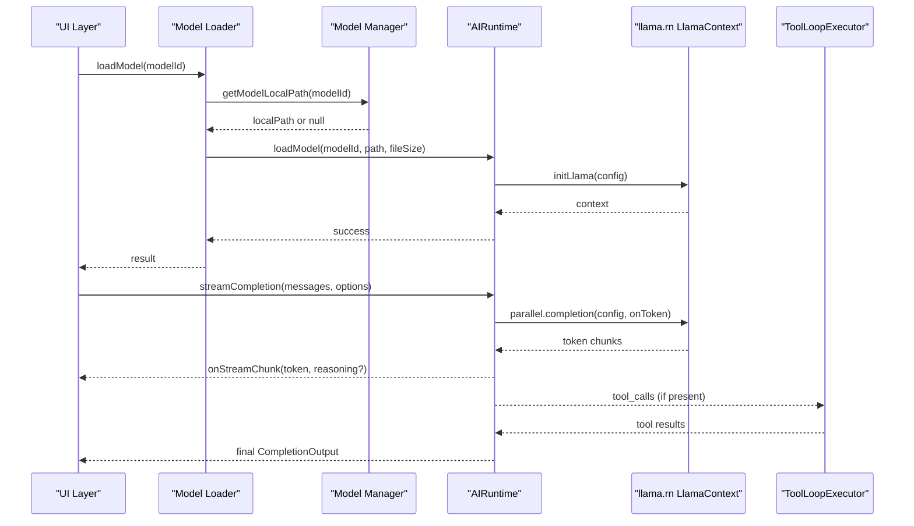
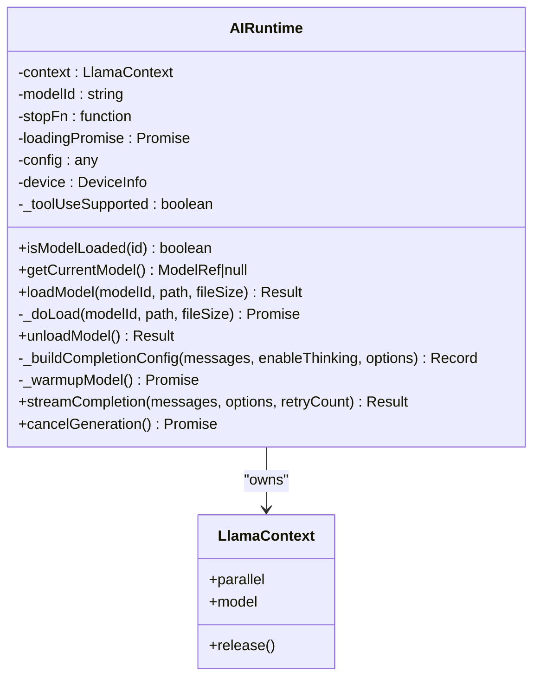
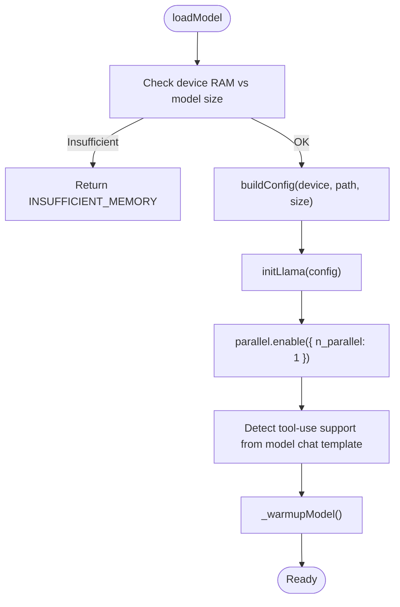
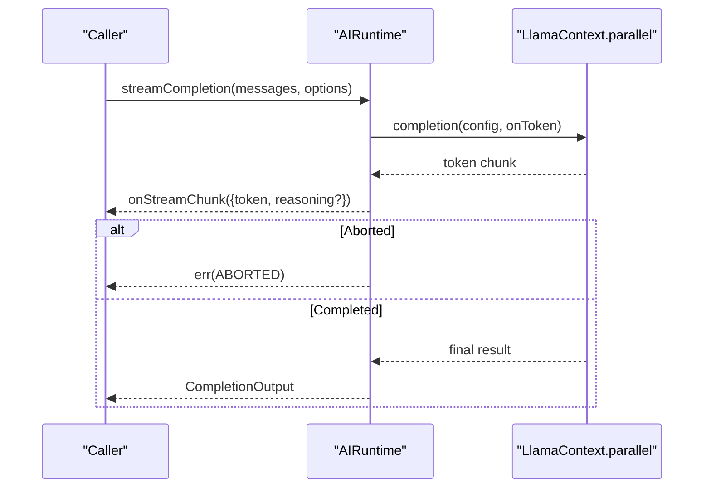
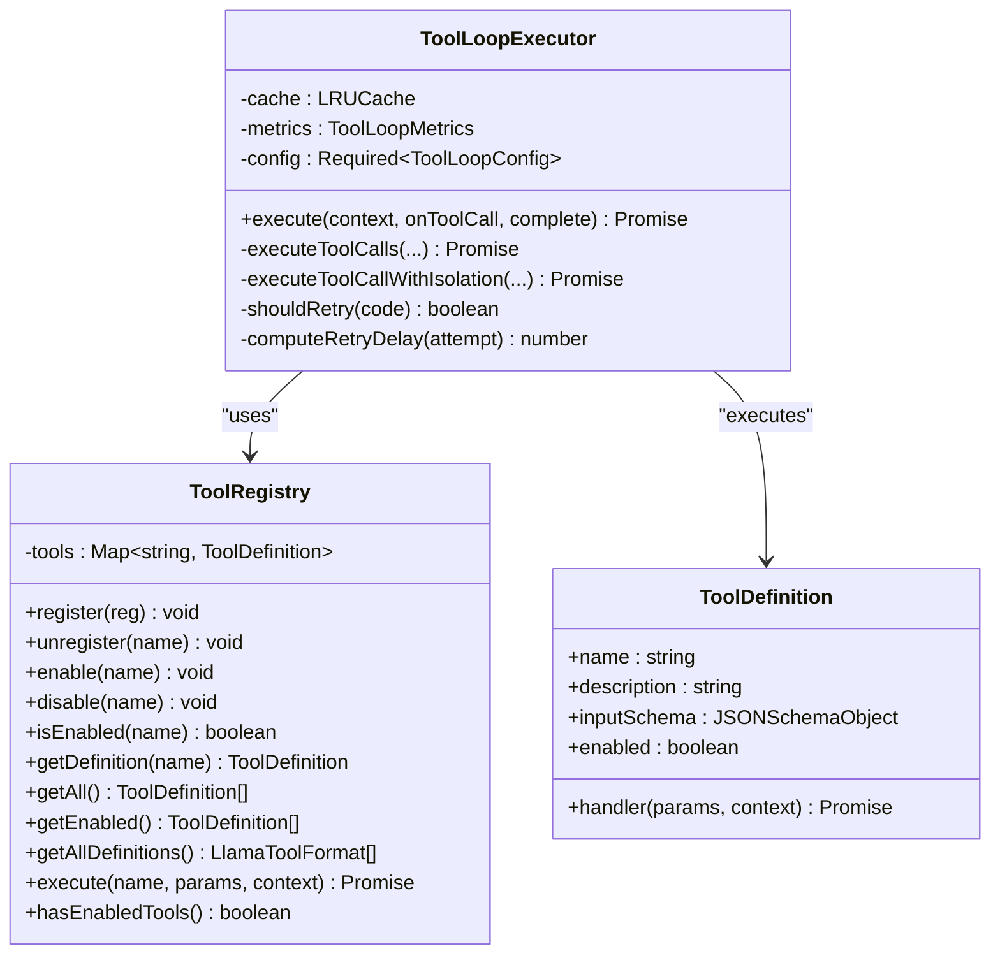
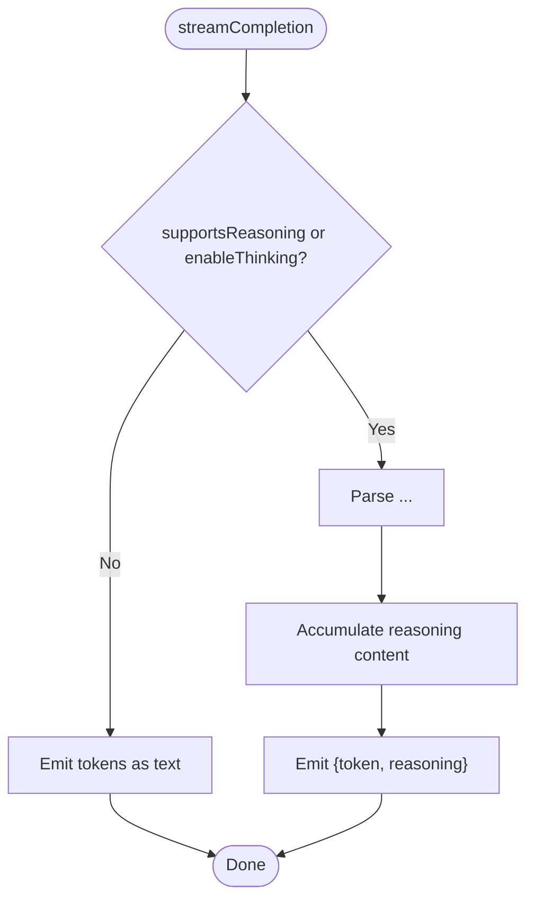
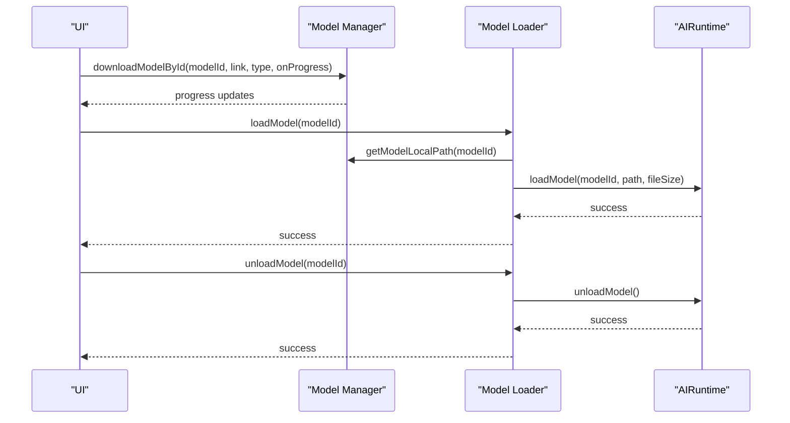
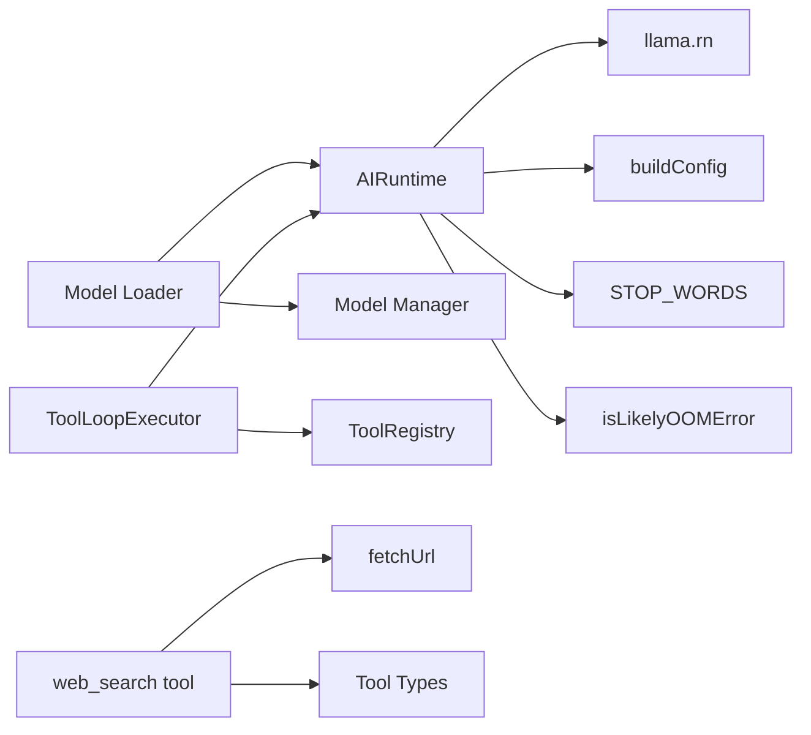

# Core AI Engine

<cite>
**Referenced Files in This Document**
- [runtime.ts](file://shared/ai/text-generation/runtime.ts)
- [catalog.ts](file://shared/ai/text-generation/catalog.ts)
- [config.ts](file://shared/ai/text-generation/config.ts)
- [constants.ts](file://shared/ai/text-generation/constants.ts)
- [oom-detection.ts](file://shared/ai/text-generation/oom-detection.ts)
- [types.ts](file://shared/ai/text-generation/types.ts)
- [manager.ts](file://shared/ai/manager.ts)
- [model-loader.ts](file://shared/ai/model-loader.ts)
- [types.ts (manager)](file://shared/ai/types/manager.ts)
- [types.ts (model-loader)](file://shared/ai/types/model-loader.ts)
- [types.ts (model)](file://shared/ai/types/model.ts)
- [registry.ts](file://shared/ai/tools/registry.ts)
- [types.ts (tools)](file://shared/ai/tools/types.ts)
- [tool-loop-executor.ts](file://shared/ai/tools/tool-loop-executor.ts)
- [web-search.ts](file://shared/ai/tools/web-search.ts)
- [fetch-url.ts](file://shared/ai/tools/fetch-url.ts)
</cite>

## Table of Contents
1. [Introduction](#introduction)
2. [Project Structure](#project-structure)
3. [Core Components](#core-components)
4. [Architecture Overview](#architecture-overview)
5. [Detailed Component Analysis](#detailed-component-analysis)
6. [Dependency Analysis](#dependency-analysis)
7. [Performance Considerations](#performance-considerations)
8. [Troubleshooting Guide](#troubleshooting-guide)
9. [Conclusion](#conclusion)
10. [Appendices](#appendices)

## Introduction
This document describes the core AI engine powering My Shadow’s local text generation. It covers the AIRuntime class architecture, model lifecycle management, context and configuration handling, streaming completion with token-by-token callbacks, tool integration and execution loops, reasoning mode with think-tag parsing, and robust error handling with abort/cancel mechanisms. Practical examples illustrate model loading/unloading, streaming generation, and tool usage integration.

## Project Structure
The AI engine is organized around:
- Text generation runtime and configuration
- Model catalog and loader orchestration
- Tools registry and execution loop
- Storage and model management utilities
- Type definitions for models, loaders, and runtime options

**Diagram sources**
- [runtime.ts:1-489](file://shared/ai/text-generation/runtime.ts#L1-L489)
- [config.ts:1-32](file://shared/ai/text-generation/config.ts#L1-L32)
- [catalog.ts:1-330](file://shared/ai/text-generation/catalog.ts#L1-L330)
- [constants.ts:1-8](file://shared/ai/text-generation/constants.ts#L1-L8)
- [oom-detection.ts:1-37](file://shared/ai/text-generation/oom-detection.ts#L1-L37)
- [types.ts:1-22](file://shared/ai/text-generation/types.ts#L1-L22)
- [manager.ts:1-422](file://shared/ai/manager.ts#L1-L422)
- [model-loader.ts:1-172](file://shared/ai/model-loader.ts#L1-L172)
- [types.ts (manager):1-15](file://shared/ai/types/manager.ts#L1-L15)
- [types.ts (model-loader):1-16](file://shared/ai/types/model-loader.ts#L1-L16)
- [types.ts (model):1-24](file://shared/ai/types/model.ts#L1-L24)
- [registry.ts:1-127](file://shared/ai/tools/registry.ts#L1-L127)
- [tool-loop-executor.ts:1-800](file://shared/ai/tools/tool-loop-executor.ts#L1-L800)
- [web-search.ts:1-235](file://shared/ai/tools/web-search.ts#L1-L235)
- [fetch-url.ts:1-330](file://shared/ai/tools/fetch-url.ts#L1-L330)

**Section sources**
- [runtime.ts:1-489](file://shared/ai/text-generation/runtime.ts#L1-L489)
- [model-loader.ts:1-172](file://shared/ai/model-loader.ts#L1-L172)
- [manager.ts:1-422](file://shared/ai/manager.ts#L1-L422)

## Core Components
- AIRuntime: Singleton runtime managing GGUF model loading/unloading, parallel inference, streaming, tool injection, and reasoning parsing.
- Model Catalog: Centralized list of supported GGUF models with metadata and tags.
- Runtime Config: Device-aware configuration builder for context parameters.
- Stop Words and OOM Detection: Stop word filtering and automatic OOM recovery.
- Model Manager: Download, list, remove, and cache models; coordinate runtime unload on removal.
- Model Loader: Unified entry to load/unload models for either LLM or STT runtimes.
- Tools Registry and Loop Executor: Register tools, inject into LLM, execute in loops with parallelism, caching, and error strategies.
- Web Search Tool and Fetch Utilities: Robust HTTP fetching with retries, timeouts, and blocking detection.

**Section sources**
- [runtime.ts:14-489](file://shared/ai/text-generation/runtime.ts#L14-L489)
- [catalog.ts:1-330](file://shared/ai/text-generation/catalog.ts#L1-L330)
- [config.ts:1-32](file://shared/ai/text-generation/config.ts#L1-L32)
- [constants.ts:1-8](file://shared/ai/text-generation/constants.ts#L1-L8)
- [oom-detection.ts:1-37](file://shared/ai/text-generation/oom-detection.ts#L1-L37)
- [manager.ts:1-422](file://shared/ai/manager.ts#L1-L422)
- [model-loader.ts:1-172](file://shared/ai/model-loader.ts#L1-L172)
- [registry.ts:1-127](file://shared/ai/tools/registry.ts#L1-L127)
- [tool-loop-executor.ts:1-800](file://shared/ai/tools/tool-loop-executor.ts#L1-L800)
- [web-search.ts:1-235](file://shared/ai/tools/web-search.ts#L1-L235)
- [fetch-url.ts:1-330](file://shared/ai/tools/fetch-url.ts#L1-L330)

## Architecture Overview
The AI engine integrates storage, runtime, and tooling layers. The runtime encapsulates llama.rn’s LlamaContext, enabling parallel inference and streaming. The model loader delegates to the runtime for GGUF models and to STT runtime for binary models. Tools are injected via the runtime and executed in a loop with configurable policies.

**Diagram sources**
- [model-loader.ts:11-63](file://shared/ai/model-loader.ts#L11-L63)
- [manager.ts:320-344](file://shared/ai/manager.ts#L320-L344)
- [runtime.ts:34-157](file://shared/ai/text-generation/runtime.ts#L34-L157)
- [tool-loop-executor.ts:232-459](file://shared/ai/tools/tool-loop-executor.ts#L232-L459)

## Detailed Component Analysis

### AIRuntime Class and Singleton Pattern
- Singleton creation ensures a single LlamaContext instance per process.
- Model lifecycle:
  - loadModel validates device memory, builds config, initializes llama.rn context, enables parallel processing, detects tool-use capability, warms up the model, and records timings.
  - unloadModel cancels in-flight generation, disables parallelism, releases context, and clears state.
- Streaming:
  - streamCompletion builds a configuration including stop words, reasoning toggles, and optional tools.
  - Token callbacks emit token and reasoning chunks; it tracks first-token latency and collects tool calls.
  - Supports abort via AbortSignal and cancellation via stop function.
  - OOM recovery: if an OOM-like error occurs, it halves context size and retries once.
- Reasoning:
  - Parses think tags to extract structured reasoning content and emits it separately from text tokens.
- Tool integration:
  - Detects tool-use support from model chat templates and injects enabled tools into the completion config.
  - Aggregates and deduplicates tool calls from streaming and final results.

**Diagram sources**
- [runtime.ts:16-489](file://shared/ai/text-generation/runtime.ts#L16-L489)

**Section sources**
- [runtime.ts:14-489](file://shared/ai/text-generation/runtime.ts#L14-L489)
- [oom-detection.ts:1-37](file://shared/ai/text-generation/oom-detection.ts#L1-L37)
- [types.ts:1-22](file://shared/ai/text-generation/types.ts#L1-L22)

### llama.rn Integration and Parallel Processing
- Initialization:
  - Device detection and memory checks determine required GPU layers and context sizes.
  - buildConfig sets context length, batch sizes, threads, cache types, and Flash Attention based on device and model size.
- Parallel processing:
  - parallel.enable is called with a fixed concurrency of 1 in the current implementation.
- Memory context handling:
  - Context parameters include mmap usage, cache types, and GPU layers.
  - OOM detection heuristics trigger a single retry with halved context size.

**Diagram sources**
- [runtime.ts:47-157](file://shared/ai/text-generation/runtime.ts#L47-L157)
- [config.ts:4-31](file://shared/ai/text-generation/config.ts#L4-L31)

**Section sources**
- [runtime.ts:47-157](file://shared/ai/text-generation/runtime.ts#L47-L157)
- [config.ts:1-32](file://shared/ai/text-generation/config.ts#L1-L32)
- [oom-detection.ts:1-37](file://shared/ai/text-generation/oom-detection.ts#L1-L37)

### Streaming Completion and Token-by-Token Callbacks
- The runtime wraps llama.rn’s parallel.completion and streams token chunks to the caller.
- It normalizes tool calls from both streaming and final results, ensuring each has a non-null ID for tracing.
- Abort handling:
  - An internal AbortController mirrors the provided AbortSignal.
  - If aborted, the stop function is invoked and an ABORTED error is returned.
- Timings and metrics:
  - First-token timing is captured and logged.
  - Final timings are included in the CompletionOutput.

**Diagram sources**
- [runtime.ts:256-477](file://shared/ai/text-generation/runtime.ts#L256-L477)
- [types.ts:4-19](file://shared/ai/text-generation/types.ts#L4-L19)

**Section sources**
- [runtime.ts:256-477](file://shared/ai/text-generation/runtime.ts#L256-L477)
- [types.ts:1-22](file://shared/ai/text-generation/types.ts#L1-L22)

### Tool Integration Framework
- Tool Registry:
  - Registers tools with strict naming rules, enables/disables, and exposes enabled definitions in llama.rn-compatible format.
- Tool Loop Executor:
  - Orchestrates tool-call loops: completion -> tool execution -> inject results -> repeat up to max iterations.
  - Supports parallel execution, dependency ordering, caching, retries, timeouts, and error strategies.
  - Emits events for observability and metrics collection.
- Web Search Tool:
  - Implements a DuckDuckGo search tool with HTML parsing, result formatting, and robust error handling.
- HTTP Fetch Utility:
  - Provides retry/backoff, timeout, size limits, and blocking detection with randomized user agents.

**Diagram sources**
- [registry.ts:12-127](file://shared/ai/tools/registry.ts#L12-L127)
- [tool-loop-executor.ts:199-800](file://shared/ai/tools/tool-loop-executor.ts#L199-L800)
- [types.ts (tools):8-34](file://shared/ai/tools/types.ts#L8-L34)

**Section sources**
- [registry.ts:1-127](file://shared/ai/tools/registry.ts#L1-L127)
- [tool-loop-executor.ts:1-800](file://shared/ai/tools/tool-loop-executor.ts#L1-L800)
- [types.ts (tools):1-95](file://shared/ai/tools/types.ts#L1-L95)
- [web-search.ts:1-235](file://shared/ai/tools/web-search.ts#L1-L235)
- [fetch-url.ts:1-330](file://shared/ai/tools/fetch-url.ts#L1-L330)

### Reasoning Mode Implementation (Think Tags)
- The runtime conditionally enables reasoning based on model metadata or explicit options.
- It parses tokens for opening and closing think tags, buffering reasoning content and emitting it separately.
- The final CompletionOutput includes a reasoning field when applicable.

**Diagram sources**
- [runtime.ts:265-376](file://shared/ai/text-generation/runtime.ts#L265-L376)

**Section sources**
- [runtime.ts:265-376](file://shared/ai/text-generation/runtime.ts#L265-L376)

### Model Lifecycle Management
- Download:
  - Ensures models directory, deduplicates concurrent downloads, reports progress, and cleans partial files on abort.
- List and Select:
  - Maintains an in-memory cache with TTL, lists both .gguf and .bin models, and resolves current model IDs.
- Remove:
  - Unloads model from LLM runtime if loaded, removes file, updates cache, and logs outcomes.
- Load/Unload:
  - Unified loader dispatches to the correct runtime based on model type and persists selection state.

**Diagram sources**
- [manager.ts:59-192](file://shared/ai/manager.ts#L59-L192)
- [model-loader.ts:11-112](file://shared/ai/model-loader.ts#L11-L112)

**Section sources**
- [manager.ts:1-422](file://shared/ai/manager.ts#L1-L422)
- [model-loader.ts:1-172](file://shared/ai/model-loader.ts#L1-L172)
- [types.ts (manager):1-15](file://shared/ai/types/manager.ts#L1-L15)
- [types.ts (model-loader):1-16](file://shared/ai/types/model-loader.ts#L1-L16)
- [types.ts (model):1-24](file://shared/ai/types/model.ts#L1-L24)

## Dependency Analysis
- Runtime depends on:
  - Device detection, config builder, stop words, OOM detection, and llama.rn.
- Loader depends on:
  - Manager for paths and model metadata, and runtime for GGUF loading.
- Tools depend on:
  - Registry for definitions, ToolLoopExecutor for orchestration, and fetch utilities for HTTP operations.

**Diagram sources**
- [runtime.ts:1-13](file://shared/ai/text-generation/runtime.ts#L1-L13)
- [config.ts:1-32](file://shared/ai/text-generation/config.ts#L1-L32)
- [constants.ts:1-8](file://shared/ai/text-generation/constants.ts#L1-L8)
- [oom-detection.ts:1-37](file://shared/ai/text-generation/oom-detection.ts#L1-L37)
- [model-loader.ts:1-10](file://shared/ai/model-loader.ts#L1-L10)
- [manager.ts:1-10](file://shared/ai/manager.ts#L1-L10)
- [registry.ts:1-8](file://shared/ai/tools/registry.ts#L1-L8)
- [tool-loop-executor.ts:1-6](file://shared/ai/tools/tool-loop-executor.ts#L1-L6)
- [web-search.ts:1-3](file://shared/ai/tools/web-search.ts#L1-L3)
- [fetch-url.ts:1-3](file://shared/ai/tools/fetch-url.ts#L1-L3)

**Section sources**
- [runtime.ts:1-13](file://shared/ai/text-generation/runtime.ts#L1-L13)
- [model-loader.ts:1-10](file://shared/ai/model-loader.ts#L1-L10)
- [registry.ts:1-8](file://shared/ai/tools/registry.ts#L1-L8)
- [tool-loop-executor.ts:1-6](file://shared/ai/tools/tool-loop-executor.ts#L1-L6)
- [web-search.ts:1-3](file://shared/ai/tools/web-search.ts#L1-L3)
- [fetch-url.ts:1-3](file://shared/ai/tools/fetch-url.ts#L1-L3)

## Performance Considerations
- Context sizing:
  - Larger contexts improve recall but increase memory pressure; the config builder selects sizes based on device RAM.
- Parallelism:
  - Current parallelism is set to 1; evaluate increasing n_parallel cautiously and monitor memory.
- Cache types:
  - Lower precision caches reduce VRAM usage; adjust cache_type_k/v according to device constraints.
- OOM resilience:
  - Automatic context halving on suspected OOM errors improves reliability at the cost of reduced context.
- Streaming:
  - Emitting tokens immediately reduces perceived latency; ensure UI renders incrementally.

[No sources needed since this section provides general guidance]

## Troubleshooting Guide
- Model load failures:
  - Insufficient memory: The runtime checks required GB against device RAM and returns an error if insufficient.
  - Unknown errors: Wrapped with a generic UNKNOWN_ERROR; inspect logs for stack traces.
- Generation failures:
  - ABORTED: Occurs when the provided AbortSignal triggers or cancelGeneration is called.
  - GENERATION_FAILED: Generic inference failure; check logs for underlying causes.
  - EMPTY: Returned when no text or reasoning is produced.
- OOM recovery:
  - If an OOM-like error is detected, the runtime retries once with half the context size.
- Tool execution:
  - Fail-fast vs continue-on-error strategies influence loop termination.
  - Retries use exponential backoff with jitter; timeouts are enforced per tool.
  - Blocking detection (CAPTCHA, rate-limits) surfaces specific error codes.

**Section sources**
- [runtime.ts:141-156](file://shared/ai/text-generation/runtime.ts#L141-L156)
- [runtime.ts:443-477](file://shared/ai/text-generation/runtime.ts#L443-L477)
- [oom-detection.ts:1-37](file://shared/ai/text-generation/oom-detection.ts#L1-L37)
- [tool-loop-executor.ts:711-731](file://shared/ai/tools/tool-loop-executor.ts#L711-L731)
- [fetch-url.ts:273-311](file://shared/ai/tools/fetch-url.ts#L273-L311)

## Conclusion
The Core AI Engine provides a robust, device-aware runtime for GGUF models with streaming inference, tool integration, and reasoning support. Its singleton AIRuntime encapsulates llama.rn, manages lifecycle and memory carefully, and offers resilient error handling with abort/cancel capabilities. The model and tool frameworks integrate seamlessly to deliver a production-grade local AI experience.

[No sources needed since this section summarizes without analyzing specific files]

## Appendices

### Practical Examples

- Model lifecycle management
  - Download a model and track progress:
    - Use [downloadModelById:59-85](file://shared/ai/manager.ts#L59-L85) with an onProgress callback.
  - Auto-load last model:
    - Use [autoLoadLastModel:123-137](file://shared/ai/model-loader.ts#L123-L137) to restore previous selection.
  - Remove a model safely:
    - Use [removeDownloadedModel:349-421](file://shared/ai/manager.ts#L349-L421) to unload from runtime and delete file.

- Streaming generation patterns
  - Start streaming with token callbacks:
    - Call [streamCompletion:256-477](file://shared/ai/text-generation/runtime.ts#L256-L477) with onStreamChunk to render incremental text and reasoning.
  - Cancel generation:
    - Trigger [cancelGeneration:479-483](file://shared/ai/text-generation/runtime.ts#L479-L483) or pass an AbortSignal.

- Tool usage integration
  - Register tools and inject into model:
    - Use [ToolRegistry.register:15-33](file://shared/ai/tools/registry.ts#L15-L33) and pass enabled tools via [StreamCompletionOptions.tools:17-17](file://shared/ai/text-generation/types.ts#L17-L17).
  - Execute tool loop:
    - Use [ToolLoopExecutor.execute:232-459](file://shared/ai/tools/tool-loop-executor.ts#L232-L459) to orchestrate tool calls with parallelism, caching, and retries.

**Section sources**
- [manager.ts:59-85](file://shared/ai/manager.ts#L59-L85)
- [model-loader.ts:123-137](file://shared/ai/model-loader.ts#L123-L137)
- [runtime.ts:256-483](file://shared/ai/text-generation/runtime.ts#L256-L483)
- [registry.ts:15-33](file://shared/ai/tools/registry.ts#L15-L33)
- [tool-loop-executor.ts:232-459](file://shared/ai/tools/tool-loop-executor.ts#L232-L459)