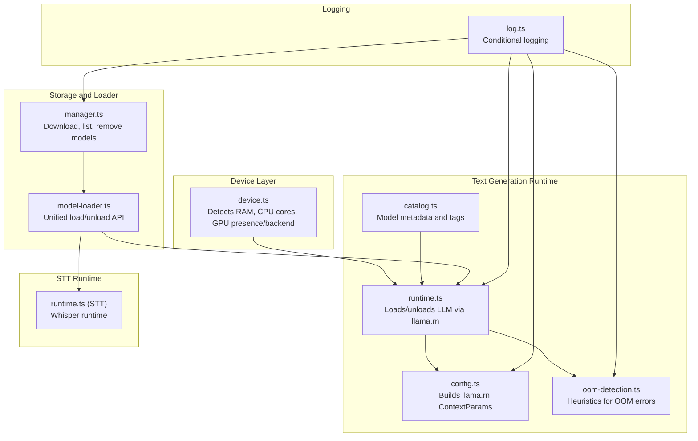
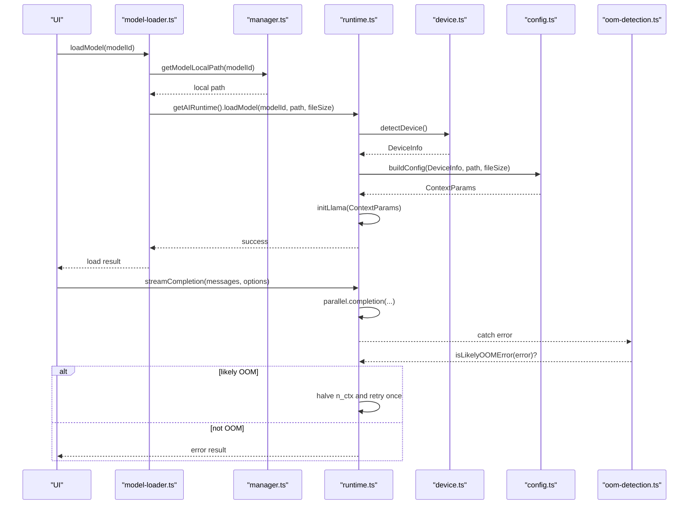
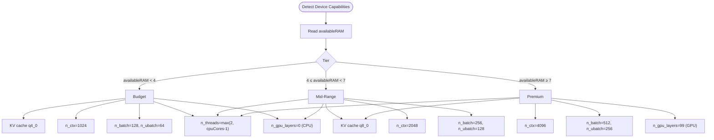
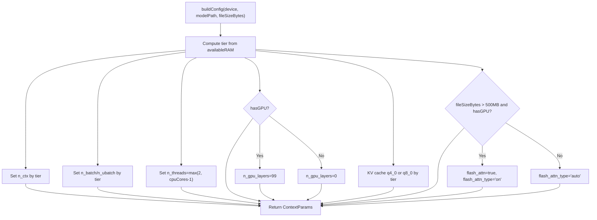
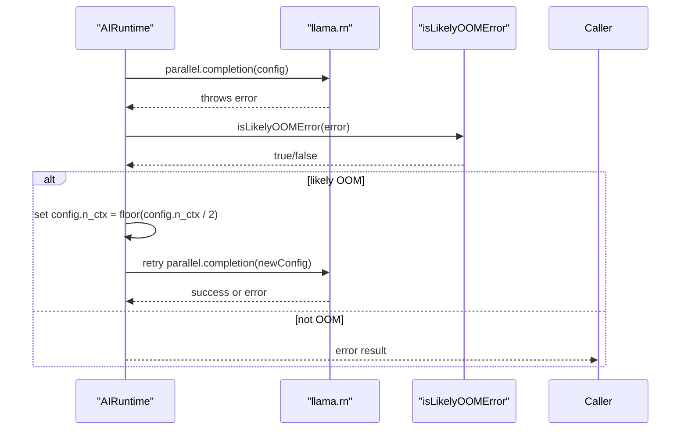
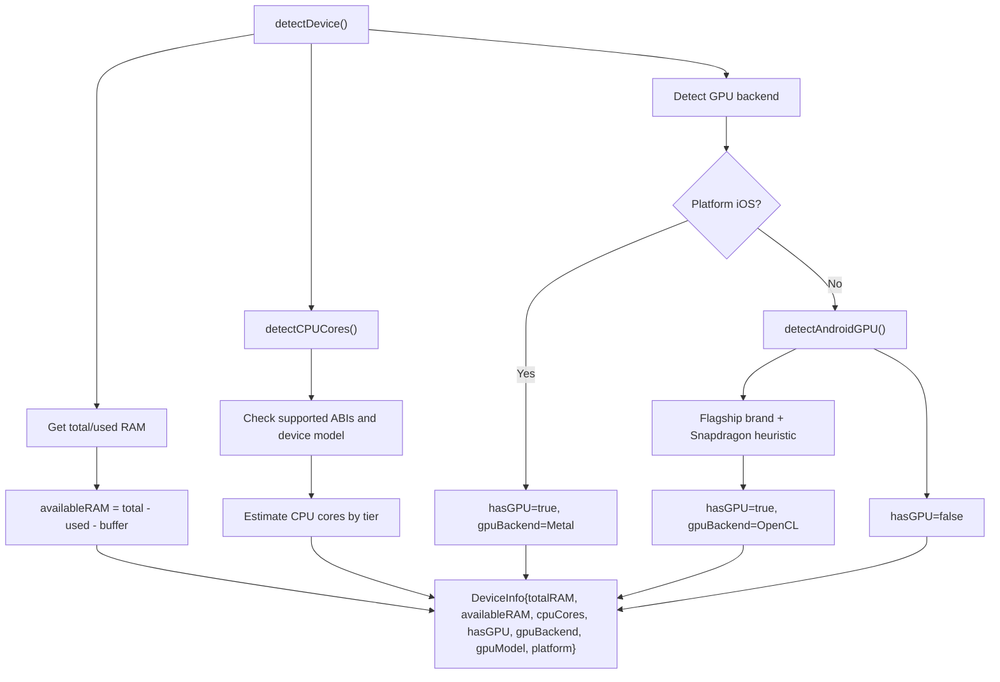
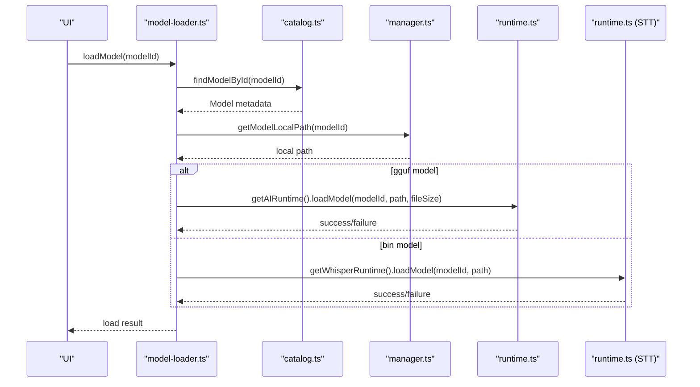
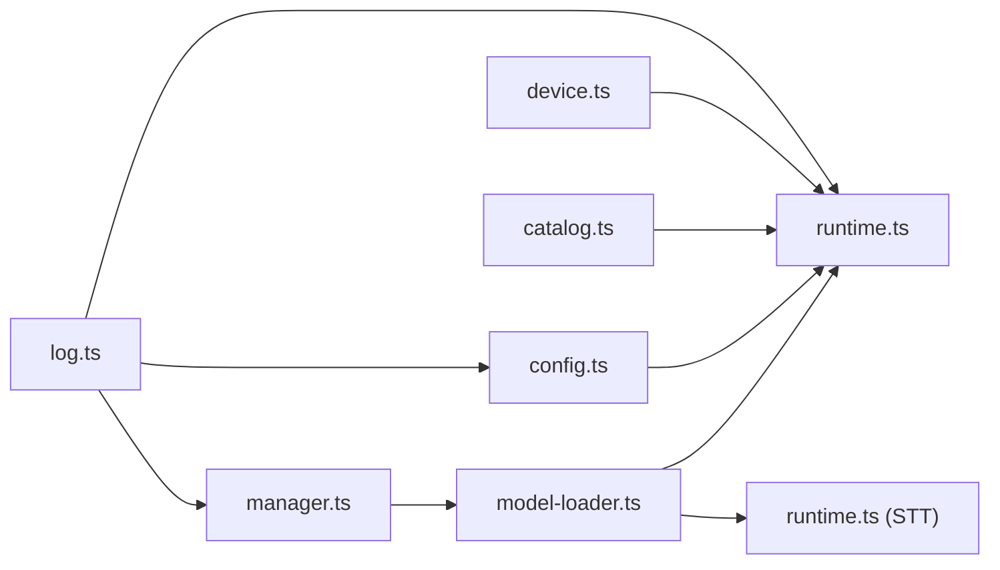

# Device Optimization and Adaptation

<cite>
**Referenced Files in This Document**
- [device.ts](file://shared/device.ts)
- [config.ts](file://shared/ai/text-generation/config.ts)
- [runtime.ts](file://shared/ai/text-generation/runtime.ts)
- [oom-detection.ts](file://shared/ai/text-generation/oom-detection.ts)
- [catalog.ts](file://shared/ai/text-generation/catalog.ts)
- [manager.ts](file://shared/ai/manager.ts)
- [model-loader.ts](file://shared/ai/model-loader.ts)
- [log.ts](file://shared/ai/log.ts)
- [runtime.ts (STT)](file://shared/ai/stt/runtime.ts)
</cite>

## Table of Contents
1. [Introduction](#introduction)
2. [Project Structure](#project-structure)
3. [Core Components](#core-components)
4. [Architecture Overview](#architecture-overview)
5. [Detailed Component Analysis](#detailed-component-analysis)
6. [Dependency Analysis](#dependency-analysis)
7. [Performance Considerations](#performance-considerations)
8. [Troubleshooting Guide](#troubleshooting-guide)
9. [Conclusion](#conclusion)
10. [Appendices](#appendices)

## Introduction
This document explains the device optimization and adaptation system in My Shadow’s AI runtime. It covers the three-tier device support model (Budget, Mid-Range, Premium), the automatic configuration builder that adapts llama.rn parameters based on available GPU, CPU cores, RAM capacity, and model size, memory optimization techniques (KV cache quantization, context size, batching, and GPU layer allocation), the out-of-memory (OOM) detection and recovery mechanism, and the device capability detection pipeline that influences model loading decisions. It also includes configuration examples, troubleshooting tips, and performance tuning recommendations.

## Project Structure
The AI runtime spans several modules:
- Device capability detection and logging
- Text generation runtime and configuration builder
- OOM detection utilities
- Model catalog and storage manager
- Unified model loader and STT runtime

**Diagram sources**
- [device.ts:122-171](file://shared/device.ts#L122-L171)
- [runtime.ts:16-488](file://shared/ai/text-generation/runtime.ts#L16-L488)
- [config.ts:4-31](file://shared/ai/text-generation/config.ts#L4-L31)
- [oom-detection.ts:1-37](file://shared/ai/text-generation/oom-detection.ts#L1-L37)
- [catalog.ts:317-330](file://shared/ai/text-generation/catalog.ts#L317-L330)
- [manager.ts:59-192](file://shared/ai/manager.ts#L59-L192)
- [model-loader.ts:11-63](file://shared/ai/model-loader.ts#L11-L63)
- [log.ts:1-36](file://shared/ai/log.ts#L1-L36)
- [runtime.ts (STT):5-99](file://shared/ai/stt/runtime.ts#L5-L99)

**Section sources**
- [device.ts:122-171](file://shared/device.ts#L122-L171)
- [runtime.ts:16-488](file://shared/ai/text-generation/runtime.ts#L16-L488)
- [config.ts:4-31](file://shared/ai/text-generation/config.ts#L4-L31)
- [oom-detection.ts:1-37](file://shared/ai/text-generation/oom-detection.ts#L1-L37)
- [catalog.ts:317-330](file://shared/ai/text-generation/catalog.ts#L317-L330)
- [manager.ts:59-192](file://shared/ai/manager.ts#L59-L192)
- [model-loader.ts:11-63](file://shared/ai/model-loader.ts#L11-L63)
- [log.ts:1-36](file://shared/ai/log.ts#L1-L36)
- [runtime.ts (STT):5-99](file://shared/ai/stt/runtime.ts#L5-L99)

## Core Components
- Device capability detection: Provides total RAM, available RAM, CPU cores, GPU presence, backend, and platform.
- Configuration builder: Translates device capabilities and model metadata into llama.rn ContextParams with tuned KV cache quantization, context size, batch sizes, thread count, and GPU layer allocation.
- Runtime: Loads/unloads models, warms up, streams completions, and recovers from OOM by halving context size.
- OOM detection: Heuristics to identify OOM conditions from error names/messages/codes.
- Catalog: Defines models with file size, estimated RAM usage, tags, and reasoning support.
- Storage manager: Handles model downloads, caching, listing, and removal.
- Unified model loader: Routes to the appropriate runtime (LLM or STT) and persists last-used model.

**Section sources**
- [device.ts:5-171](file://shared/device.ts#L5-L171)
- [config.ts:4-31](file://shared/ai/text-generation/config.ts#L4-L31)
- [runtime.ts:16-488](file://shared/ai/text-generation/runtime.ts#L16-L488)
- [oom-detection.ts:1-37](file://shared/ai/text-generation/oom-detection.ts#L1-L37)
- [catalog.ts:3-330](file://shared/ai/text-generation/catalog.ts#L3-L330)
- [manager.ts:59-422](file://shared/ai/manager.ts#L59-L422)
- [model-loader.ts:11-172](file://shared/ai/model-loader.ts#L11-L172)

## Architecture Overview
The system follows a layered approach:
- Device layer detects capabilities and logs diagnostics.
- Runtime orchestrates model loading and inference, applying adaptive configurations.
- OOM detection enables safe degradation during inference.
- Storage and loader manage model lifecycle and persistence.

**Diagram sources**
- [model-loader.ts:11-63](file://shared/ai/model-loader.ts#L11-L63)
- [manager.ts:320-344](file://shared/ai/manager.ts#L320-L344)
- [runtime.ts:34-157](file://shared/ai/text-generation/runtime.ts#L34-L157)
- [device.ts:122-171](file://shared/device.ts#L122-L171)
- [config.ts:4-31](file://shared/ai/text-generation/config.ts#L4-L31)
- [oom-detection.ts:1-37](file://shared/ai/text-generation/oom-detection.ts#L1-L37)

## Detailed Component Analysis

### Three-Tier Device Support Model
The system classifies devices into three tiers based on available RAM:
- Budget: available RAM < 4 GB
- Mid-Range: 4 GB ≤ available RAM < 7 GB
- Premium: available RAM ≥ 7 GB

These tiers drive KV cache quantization, context size, batch sizes, and GPU layer allocation.

**Diagram sources**
- [config.ts:10-31](file://shared/ai/text-generation/config.ts#L10-L31)
- [device.ts:122-171](file://shared/device.ts#L122-L171)

**Section sources**
- [config.ts:10-31](file://shared/ai/text-generation/config.ts#L10-L31)
- [device.ts:122-171](file://shared/device.ts#L122-L171)

### Automatic Configuration Builder
The configuration builder adapts llama.rn parameters:
- Context size (n_ctx): 1024 (Budget), 2048 (Mid-Range), 4096 (Premium)
- Batch sizes (n_batch, n_ubatch): tuned per tier
- Thread count (n_threads): derived from CPU cores with a minimum
- KV cache quantization (cache_type_k, cache_type_v): q4_0 (Budget), q8_0 (Mid/Premium)
- GPU layers (n_gpu_layers): 99 (Premium/Mid with GPU), 0 (Budget/CPU)
- Flash Attention: enabled for larger models on capable GPUs
- Memory mapping: mmap enabled, mlock disabled

**Diagram sources**
- [config.ts:4-31](file://shared/ai/text-generation/config.ts#L4-L31)

**Section sources**
- [config.ts:4-31](file://shared/ai/text-generation/config.ts#L4-L31)

### Out-of-Memory (OOM) Detection and Recovery
During inference, the runtime catches errors and checks whether they are likely OOM using heuristics:
- Error name/message/code patterns indicating OOM
- Known errno and code values

If OOM is detected, the runtime retries once with a degraded configuration:
- Halve the context size (n_ctx)
- Retain other parameters unchanged

**Diagram sources**
- [runtime.ts:451-459](file://shared/ai/text-generation/runtime.ts#L451-L459)
- [oom-detection.ts:1-37](file://shared/ai/text-generation/oom-detection.ts#L1-L37)

**Section sources**
- [runtime.ts:451-459](file://shared/ai/text-generation/runtime.ts#L451-L459)
- [oom-detection.ts:1-37](file://shared/ai/text-generation/oom-detection.ts#L1-L37)

### Device Capability Detection
The detector:
- Estimates CPU cores heuristically using ABI and RAM tiers
- Computes available RAM with a platform-appropriate buffer
- Detects GPU presence and backend:
  - iOS: Metal assumed
  - Android: heuristic detection for flagship brands and Snapdragon GPUs
- Returns a DeviceInfo object consumed by the configuration builder

**Diagram sources**
- [device.ts:122-171](file://shared/device.ts#L122-L171)
- [device.ts:22-69](file://shared/device.ts#L22-L69)
- [device.ts:75-120](file://shared/device.ts#L75-L120)

**Section sources**
- [device.ts:122-171](file://shared/device.ts#L122-L171)
- [device.ts:22-69](file://shared/device.ts#L22-L69)
- [device.ts:75-120](file://shared/device.ts#L75-L120)

### Model Loading Decisions and Storage Integration
The unified loader:
- Resolves model metadata from catalogs
- Ensures model is downloaded and retrievable locally
- Routes to the correct runtime (LLM or STT)
- Persists last used model IDs per type

**Diagram sources**
- [model-loader.ts:11-63](file://shared/ai/model-loader.ts#L11-L63)
- [catalog.ts:321-323](file://shared/ai/text-generation/catalog.ts#L321-L323)
- [manager.ts:320-344](file://shared/ai/manager.ts#L320-L344)
- [runtime.ts:34-157](file://shared/ai/text-generation/runtime.ts#L34-L157)
- [runtime.ts (STT):20-54](file://shared/ai/stt/runtime.ts#L20-L54)

**Section sources**
- [model-loader.ts:11-63](file://shared/ai/model-loader.ts#L11-L63)
- [catalog.ts:321-323](file://shared/ai/text-generation/catalog.ts#L321-L323)
- [manager.ts:320-344](file://shared/ai/manager.ts#L320-L344)
- [runtime.ts:34-157](file://shared/ai/text-generation/runtime.ts#L34-L157)
- [runtime.ts (STT):20-54](file://shared/ai/stt/runtime.ts#L20-L54)

### Memory Optimization Techniques
- KV cache quantization:
  - Budget: q4_0 reduces memory footprint
  - Mid/Premium: q8_0 balances quality and memory
- Context size adjustment:
  - Smaller contexts reduce peak memory and improve responsiveness on low-RAM devices
- Batch sizing:
  - Larger batches improve throughput on capable devices; smaller batches prevent OOM on budget devices
- GPU layer allocation:
  - Offloading layers to GPU accelerates inference on Premium/Mid-tier devices with GPUs
- Flash Attention:
  - Enabled for larger models on capable GPUs to optimize attention compute

**Section sources**
- [config.ts:10-31](file://shared/ai/text-generation/config.ts#L10-L31)

### Device Category Profiles and Configuration Examples
Note: The following examples describe parameter ranges inferred from the configuration builder and device tiers. They are illustrative and intended for guidance.

- Budget device (available RAM < 4 GB):
  - KV cache: q4_0
  - Context size: 1024
  - Batch sizes: n_batch=128, n_ubatch=64
  - Threads: max(2, cpuCores-1)
  - GPU layers: 0
  - Flash Attention: disabled

- Mid-Range device (4 GB ≤ available RAM < 7 GB):
  - KV cache: q8_0
  - Context size: 2048
  - Batch sizes: n_batch=256, n_ubatch=128
  - Threads: max(2, cpuCores-1)
  - GPU layers: 99 (if GPU present)
  - Flash Attention: enabled for larger models

- Premium device (available RAM ≥ 7 GB):
  - KV cache: q8_0
  - Context size: 4096
  - Batch sizes: n_batch=512, n_ubatch=256
  - Threads: max(2, cpuCores-1)
  - GPU layers: 99
  - Flash Attention: enabled for larger models

**Section sources**
- [config.ts:10-31](file://shared/ai/text-generation/config.ts#L10-L31)

## Dependency Analysis
The runtime depends on:
- Device detection for capability-aware configuration
- Catalog for model metadata and tags
- Storage manager for model lifecycle
- Logging for observability

**Diagram sources**
- [config.ts:4-31](file://shared/ai/text-generation/config.ts#L4-L31)
- [runtime.ts:16-488](file://shared/ai/text-generation/runtime.ts#L16-L488)
- [device.ts:122-171](file://shared/device.ts#L122-L171)
- [catalog.ts:317-330](file://shared/ai/text-generation/catalog.ts#L317-L330)
- [manager.ts:59-192](file://shared/ai/manager.ts#L59-L192)
- [model-loader.ts:11-63](file://shared/ai/model-loader.ts#L11-L63)
- [log.ts:1-36](file://shared/ai/log.ts#L1-L36)

**Section sources**
- [config.ts:4-31](file://shared/ai/text-generation/config.ts#L4-L31)
- [runtime.ts:16-488](file://shared/ai/text-generation/runtime.ts#L16-L488)
- [device.ts:122-171](file://shared/device.ts#L122-L171)
- [catalog.ts:317-330](file://shared/ai/text-generation/catalog.ts#L317-L330)
- [manager.ts:59-192](file://shared/ai/manager.ts#L59-L192)
- [model-loader.ts:11-63](file://shared/ai/model-loader.ts#L11-L63)
- [log.ts:1-36](file://shared/ai/log.ts#L1-L36)

## Performance Considerations
- Prefer Mid-Range or Premium devices for larger models and higher context sizes.
- Enable Flash Attention on capable GPUs for improved throughput with larger models.
- Reduce context size and batch sizes on Budget devices to avoid OOM.
- Monitor available RAM and adjust model selection accordingly.
- Warm-up the model after loading to stabilize first-token latency.

[No sources needed since this section provides general guidance]

## Troubleshooting Guide
Common issues and resolutions:
- Model fails to load due to insufficient memory:
  - Verify available RAM and model file size; ensure required RAM is less than available RAM multiplied by a safety factor.
  - Consider selecting a smaller model or a model optimized for lower RAM usage.
- Frequent OOM during inference:
  - The runtime attempts a single retry with halved context size; if repeated OOM occurs, reduce context size further or switch to a lighter model.
  - Disable Flash Attention or reduce batch sizes.
- GPU not utilized:
  - Confirm device tier and GPU presence; ensure model file size exceeds the threshold for Flash Attention activation.
  - On Android, verify flagship brand and Snapdragon detection heuristics.
- Logging and diagnostics:
  - Enable runtime logs to inspect device detection, configuration, and inference timing.

**Section sources**
- [runtime.ts:69-76](file://shared/ai/text-generation/runtime.ts#L69-L76)
- [runtime.ts:451-459](file://shared/ai/text-generation/runtime.ts#L451-L459)
- [log.ts:1-36](file://shared/ai/log.ts#L1-L36)

## Conclusion
My Shadow’s AI runtime provides a robust, device-aware optimization system. By combining device capability detection, a tiered configuration builder, and adaptive inference with OOM recovery, it ensures reliable operation across a wide range of hardware. Users benefit from automatic tuning and resilience, while developers gain clear extension points for models, storage, and runtime behavior.

[No sources needed since this section summarizes without analyzing specific files]

## Appendices

### Appendix A: Model Metadata and Tags Reference
- Models include file size, estimated RAM usage, tags, and reasoning support.
- Use tags to filter models suitable for specific RAM tiers.

**Section sources**
- [catalog.ts:3-330](file://shared/ai/text-generation/catalog.ts#L3-L330)

### Appendix B: Logging Controls
- Conditional logging is controlled by development mode or environment variable.
- Logs include device detection, configuration, inference timings, and errors.

**Section sources**
- [log.ts:1-36](file://shared/ai/log.ts#L1-L36)