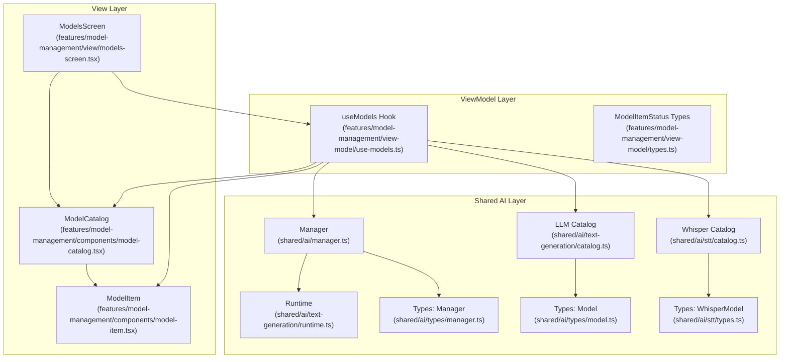
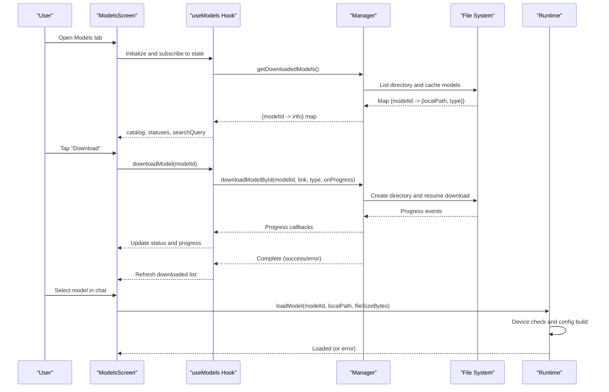
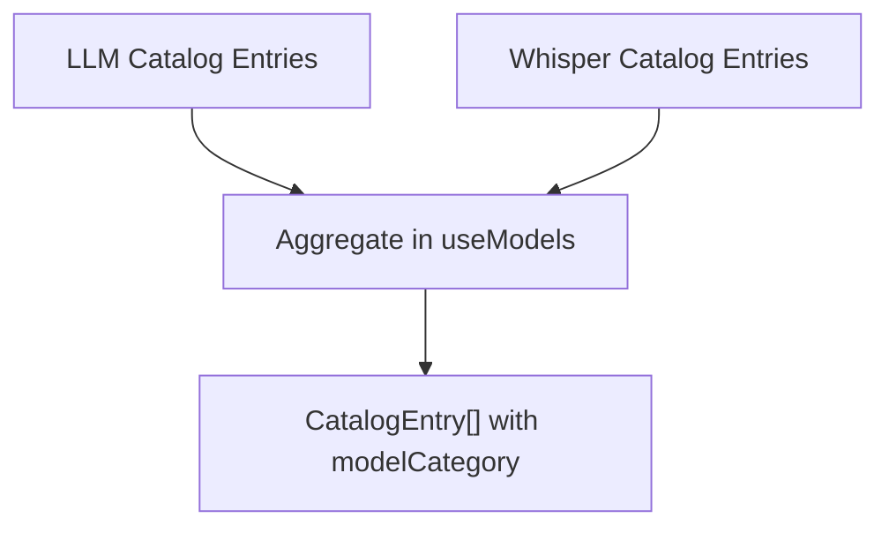
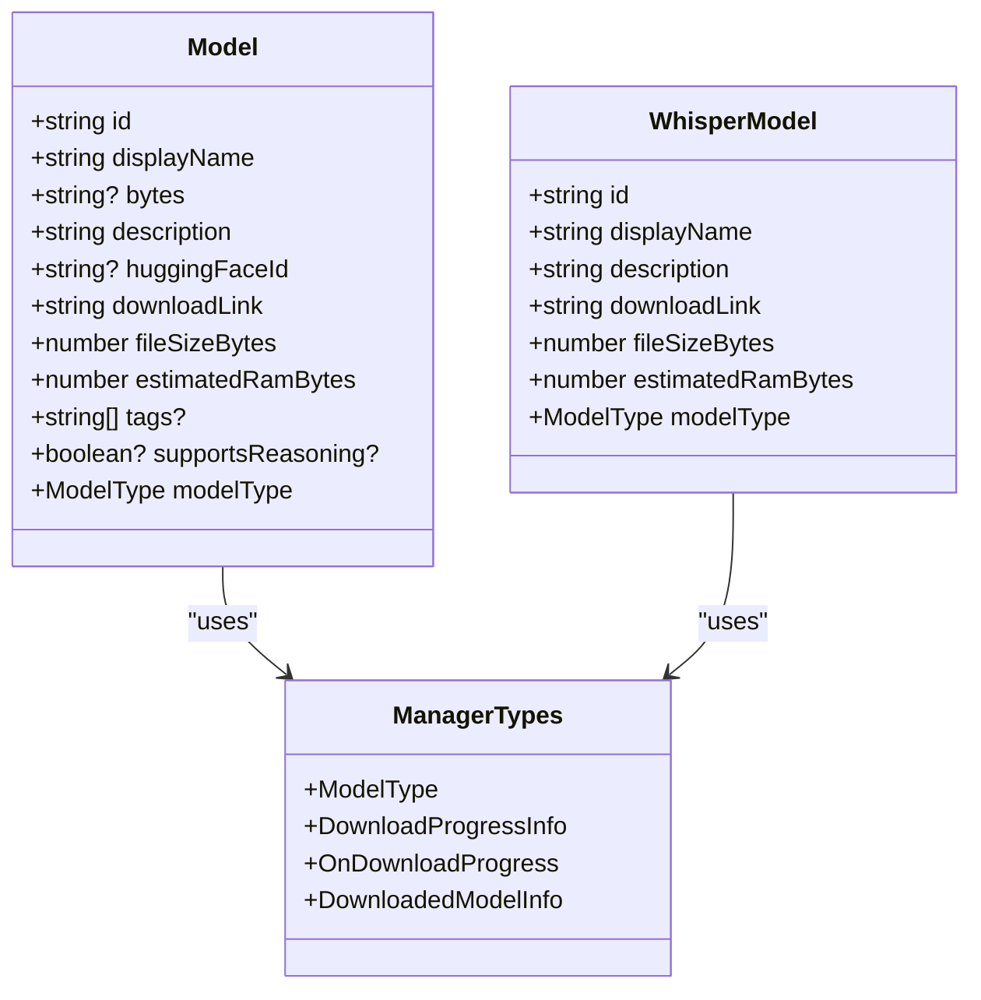
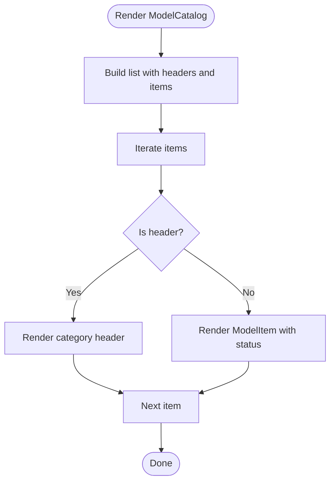
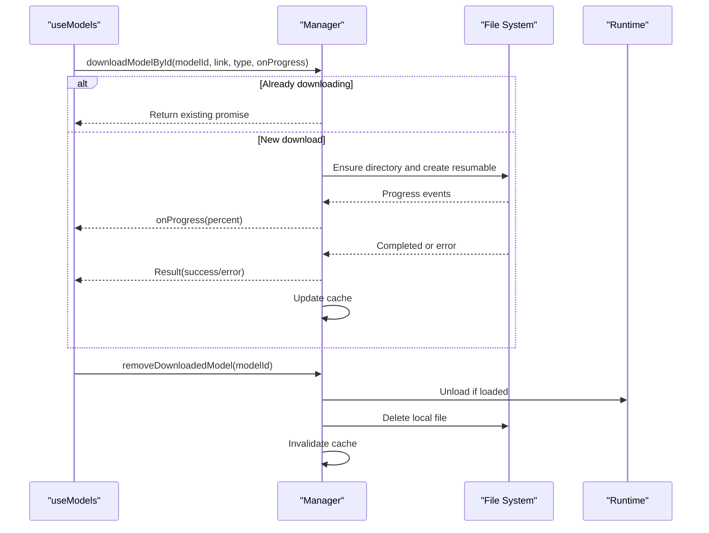
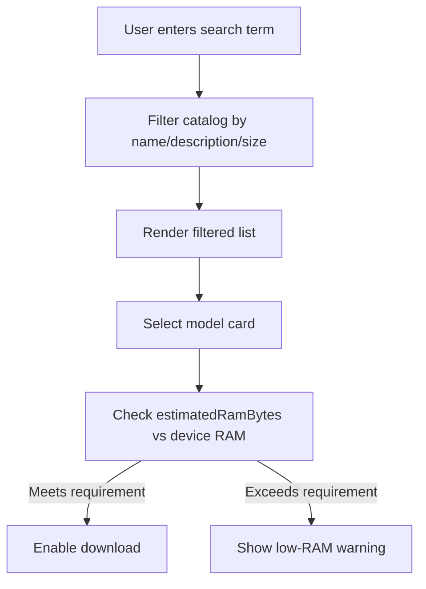
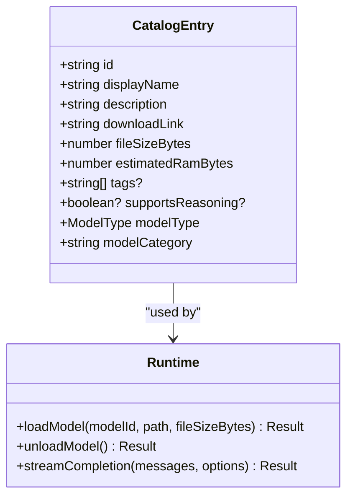
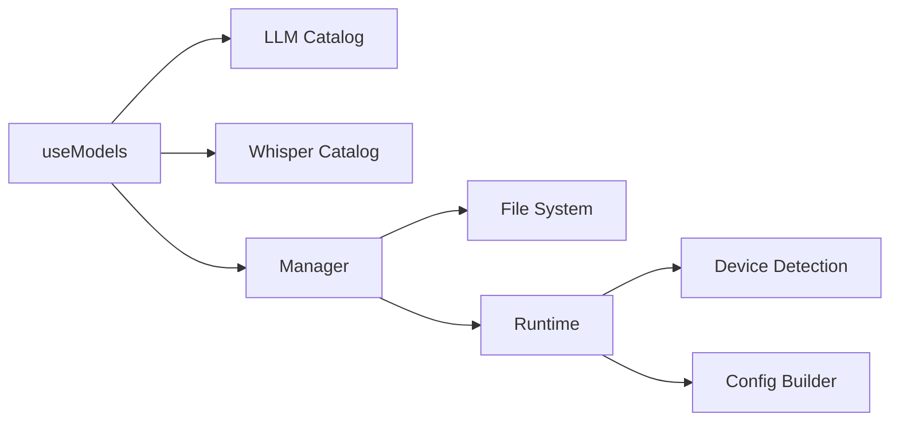

# Model Management and Catalog

<cite>
**Referenced Files in This Document**
- [app/models.tsx](file://app/models.tsx)
- [features/model-management/view/models-screen.tsx](file://features/model-management/view/models-screen.tsx)
- [features/model-management/view-model/use-models.ts](file://features/model-management/view-model/use-models.ts)
- [features/model-management/view-model/types.ts](file://features/model-management/view-model/types.ts)
- [features/model-management/components/model-catalog.tsx](file://features/model-management/components/model-catalog.tsx)
- [features/model-management/components/model-item.tsx](file://features/model-management/components/model-item.tsx)
- [shared/ai/manager.ts](file://shared/ai/manager.ts)
- [shared/ai/types/manager.ts](file://shared/ai/types/manager.ts)
- [shared/ai/types/model.ts](file://shared/ai/types/model.ts)
- [shared/ai/stt/types.ts](file://shared/ai/stt/types.ts)
- [shared/ai/text-generation/catalog.ts](file://shared/ai/text-generation/catalog.ts)
- [shared/ai/stt/catalog.ts](file://shared/ai/stt/catalog.ts)
- [shared/ai/text-generation/runtime.ts](file://shared/ai/text-generation/runtime.ts)
</cite>

## Table of Contents
1. [Introduction](#introduction)
2. [Project Structure](#project-structure)
3. [Core Components](#core-components)
4. [Architecture Overview](#architecture-overview)
5. [Detailed Component Analysis](#detailed-component-analysis)
6. [Dependency Analysis](#dependency-analysis)
7. [Performance Considerations](#performance-considerations)
8. [Troubleshooting Guide](#troubleshooting-guide)
9. [Conclusion](#conclusion)
10. [Appendices](#appendices)

## Introduction
This document explains the model management and catalog system in My Shadow. It covers how models are discovered and registered, supported formats (GGUF and Whisper binaries), metadata extraction and organization, lifecycle management (download, progress tracking, installation verification, removal), and how the UI presents models categorized by type and attributes. It also documents the runtime integration for loading and using models, including memory safety checks and error handling.

## Project Structure
The model management feature is organized into three layers:
- View: the screen and UI components that render the catalog and actions
- ViewModel: state and logic for catalog aggregation, filtering, and lifecycle actions
- Shared AI: storage, download, and runtime integration for models

**Diagram sources**
- [features/model-management/view/models-screen.tsx:1-78](file://features/model-management/view/models-screen.tsx#L1-L78)
- [features/model-management/components/model-catalog.tsx:1-96](file://features/model-management/components/model-catalog.tsx#L1-L96)
- [features/model-management/components/model-item.tsx:1-143](file://features/model-management/components/model-item.tsx#L1-L143)
- [features/model-management/view-model/use-models.ts:1-208](file://features/model-management/view-model/use-models.ts#L1-L208)
- [features/model-management/view-model/types.ts:1-12](file://features/model-management/view-model/types.ts#L1-L12)
- [shared/ai/manager.ts:1-422](file://shared/ai/manager.ts#L1-L422)
- [shared/ai/text-generation/catalog.ts:1-330](file://shared/ai/text-generation/catalog.ts#L1-L330)
- [shared/ai/stt/catalog.ts:1-41](file://shared/ai/stt/catalog.ts#L1-L41)
- [shared/ai/text-generation/runtime.ts:1-489](file://shared/ai/text-generation/runtime.ts#L1-L489)
- [shared/ai/types/manager.ts:1-15](file://shared/ai/types/manager.ts#L1-L15)
- [shared/ai/types/model.ts:1-24](file://shared/ai/types/model.ts#L1-L24)
- [shared/ai/stt/types.ts:1-29](file://shared/ai/stt/types.ts#L1-L29)

**Section sources**
- [app/models.tsx:1-6](file://app/models.tsx#L1-L6)
- [features/model-management/view/models-screen.tsx:1-78](file://features/model-management/view/models-screen.tsx#L1-L78)
- [features/model-management/view-model/use-models.ts:1-208](file://features/model-management/view-model/use-models.ts#L1-L208)
- [shared/ai/manager.ts:1-422](file://shared/ai/manager.ts#L1-L422)
- [shared/ai/text-generation/catalog.ts:1-330](file://shared/ai/text-generation/catalog.ts#L1-L330)
- [shared/ai/stt/catalog.ts:1-41](file://shared/ai/stt/catalog.ts#L1-L41)
- [shared/ai/text-generation/runtime.ts:1-489](file://shared/ai/text-generation/runtime.ts#L1-L489)

## Core Components
- Model Catalogs
  - LLM catalog: curated list of GGUF models with metadata such as display name, description, file size, RAM estimate, tags, optional reasoning support, and Hugging Face identifiers.
  - Whisper catalog: curated list of binary models for speech-to-text with similar metadata.
- ViewModel
  - Aggregates LLM and Whisper catalogs into a unified list with a category discriminator.
  - Filters models by search query across display name, description, and human-readable size.
  - Tracks download progress and status per model.
  - Exposes actions to download and remove models.
- Manager
  - Provides download, progress reporting, listing, existence checks, and removal of models.
  - Manages a short-lived in-memory cache of downloaded models and active download tasks.
  - Ensures a single download task per model ID and deduplicates concurrent requests.
- Runtime
  - Loads models into memory with device-aware checks and GPU acceleration where available.
  - Streams generation, tracks timing, and handles tool-use and reasoning content.
  - Implements out-of-memory (OOM) degradation and cancellation.

**Section sources**
- [shared/ai/text-generation/catalog.ts:1-330](file://shared/ai/text-generation/catalog.ts#L1-L330)
- [shared/ai/stt/catalog.ts:1-41](file://shared/ai/stt/catalog.ts#L1-L41)
- [features/model-management/view-model/use-models.ts:16-46](file://features/model-management/view-model/use-models.ts#L16-L46)
- [features/model-management/view-model/use-models.ts:72-90](file://features/model-management/view-model/use-models.ts#L72-L90)
- [shared/ai/manager.ts:59-85](file://shared/ai/manager.ts#L59-L85)
- [shared/ai/manager.ts:253-304](file://shared/ai/manager.ts#L253-L304)
- [shared/ai/manager.ts:349-421](file://shared/ai/manager.ts#L349-L421)
- [shared/ai/text-generation/runtime.ts:34-45](file://shared/ai/text-generation/runtime.ts#L34-L45)
- [shared/ai/text-generation/runtime.ts:64-76](file://shared/ai/text-generation/runtime.ts#L64-L76)
- [shared/ai/text-generation/runtime.ts:256-477](file://shared/ai/text-generation/runtime.ts#L256-L477)

## Architecture Overview
The system integrates UI, state management, storage, and runtime into a cohesive model management pipeline.

**Diagram sources**
- [features/model-management/view/models-screen.tsx:21-40](file://features/model-management/view/models-screen.tsx#L21-L40)
- [features/model-management/view-model/use-models.ts:97-130](file://features/model-management/view-model/use-models.ts#L97-L130)
- [shared/ai/manager.ts:59-85](file://shared/ai/manager.ts#L59-L85)
- [shared/ai/manager.ts:108-173](file://shared/ai/manager.ts#L108-L173)
- [shared/ai/text-generation/runtime.ts:34-45](file://shared/ai/text-generation/runtime.ts#L34-L45)
- [shared/ai/text-generation/runtime.ts:64-76](file://shared/ai/text-generation/runtime.ts#L64-L76)

## Detailed Component Analysis

### Model Discovery and Registration
- LLM models are defined in a centralized catalog with fields for display name, description, file size, RAM estimate, tags, optional reasoning support, and Hugging Face identifiers. Each entry specifies a GGUF download link and type.
- Whisper models are defined in a separate catalog with similar metadata and a binary model type.
- The ViewModel aggregates both catalogs into a unified list and adds a category discriminator for UI grouping.

**Diagram sources**
- [shared/ai/text-generation/catalog.ts:3-315](file://shared/ai/text-generation/catalog.ts#L3-L315)
- [shared/ai/stt/catalog.ts:3-40](file://shared/ai/stt/catalog.ts#L3-L40)
- [features/model-management/view-model/use-models.ts:31-46](file://features/model-management/view-model/use-models.ts#L31-L46)

**Section sources**
- [shared/ai/text-generation/catalog.ts:1-330](file://shared/ai/text-generation/catalog.ts#L1-L330)
- [shared/ai/stt/catalog.ts:1-41](file://shared/ai/stt/catalog.ts#L1-L41)
- [features/model-management/view-model/use-models.ts:31-46](file://features/model-management/view-model/use-models.ts#L31-L46)

### Supported Formats and Metadata Extraction
- Supported model types:
  - GGUF: general-purpose LLMs
  - bin: Whisper speech-to-text models
- Metadata fields:
  - Display name, description, file size in bytes, estimated RAM in bytes, tags, optional reasoning support, and model type discriminator.
- Size calculation:
  - UI converts bytes to megabytes for display.
- Hardware compatibility:
  - Runtime performs a device-aware memory check before loading to prevent OOM.

**Diagram sources**
- [shared/ai/types/model.ts:11-23](file://shared/ai/types/model.ts#L11-L23)
- [shared/ai/stt/types.ts:14-22](file://shared/ai/stt/types.ts#L14-L22)
- [shared/ai/types/manager.ts:1-15](file://shared/ai/types/manager.ts#L1-L15)

**Section sources**
- [shared/ai/types/model.ts:1-24](file://shared/ai/types/model.ts#L1-L24)
- [shared/ai/stt/types.ts:1-29](file://shared/ai/stt/types.ts#L1-L29)
- [shared/ai/types/manager.ts:1-15](file://shared/ai/types/manager.ts#L1-L15)
- [features/model-management/components/model-item.tsx:44-45](file://features/model-management/components/model-item.tsx#L44-L45)
- [shared/ai/text-generation/runtime.ts:64-76](file://shared/ai/text-generation/runtime.ts#L64-L76)

### Model Catalog Architecture
- The catalog is grouped by category in the UI:
  - LLM models
  - Whisper models
- Filtering:
  - Search across display name, description, and human-readable size.
- Status tracking:
  - not-downloaded, downloading, downloaded, failed.
- UI rendering:
  - Model cards show name, description, size, RAM estimate, tags, and reasoning support badges.

**Diagram sources**
- [features/model-management/components/model-catalog.tsx:20-42](file://features/model-management/components/model-catalog.tsx#L20-L42)
- [features/model-management/components/model-item.tsx:89-138](file://features/model-management/components/model-item.tsx#L89-L138)

**Section sources**
- [features/model-management/components/model-catalog.tsx:1-96](file://features/model-management/components/model-catalog.tsx#L1-L96)
- [features/model-management/components/model-item.tsx:1-143](file://features/model-management/components/model-item.tsx#L1-L143)
- [features/model-management/view-model/types.ts:1-12](file://features/model-management/view-model/types.ts#L1-L12)

### Model Lifecycle Management
- Download initiation:
  - Deduplicate concurrent downloads by model ID.
  - Create destination URI based on model type (.gguf or .bin).
  - Resume download with progress callbacks.
- Progress tracking:
  - Percentage reported via callback and stored in hook state.
- Installation verification:
  - Cache updated after successful download.
  - Listing function scans directory and builds a map of downloaded models.
- Removal:
  - Unloads model from runtime if currently loaded.
  - Deletes local file and updates cache.

**Diagram sources**
- [features/model-management/view-model/use-models.ts:97-130](file://features/model-management/view-model/use-models.ts#L97-L130)
- [shared/ai/manager.ts:59-85](file://shared/ai/manager.ts#L59-L85)
- [shared/ai/manager.ts:108-173](file://shared/ai/manager.ts#L108-L173)
- [shared/ai/manager.ts:253-304](file://shared/ai/manager.ts#L253-L304)
- [shared/ai/manager.ts:349-421](file://shared/ai/manager.ts#L349-L421)

**Section sources**
- [shared/ai/manager.ts:11-19](file://shared/ai/manager.ts#L11-L19)
- [shared/ai/manager.ts:59-85](file://shared/ai/manager.ts#L59-L85)
- [shared/ai/manager.ts:108-173](file://shared/ai/manager.ts#L108-L173)
- [shared/ai/manager.ts:253-304](file://shared/ai/manager.ts#L253-L304)
- [shared/ai/manager.ts:349-421](file://shared/ai/manager.ts#L349-L421)
- [features/model-management/view-model/use-models.ts:97-145](file://features/model-management/view-model/use-models.ts#L97-L145)

### Model Selection Criteria and Recommendations
- Built-in filters:
  - Search by display name, description, and human-readable size.
- RAM-aware recommendations:
  - The LLM catalog includes tags indicating RAM profiles (e.g., ultra-light, balanced, high-quality).
  - The runtime enforces a device-aware memory check before loading to prevent OOM.
- UI indicators:
  - RAM estimate badges on model cards.
  - Optional low-RAM warning state in statuses.

**Diagram sources**
- [features/model-management/view-model/use-models.ts:72-90](file://features/model-management/view-model/use-models.ts#L72-L90)
- [features/model-management/components/model-item.tsx:120-127](file://features/model-management/components/model-item.tsx#L120-L127)
- [shared/ai/text-generation/runtime.ts:64-76](file://shared/ai/text-generation/runtime.ts#L64-L76)

**Section sources**
- [features/model-management/view-model/use-models.ts:72-90](file://features/model-management/view-model/use-models.ts#L72-L90)
- [features/model-management/components/model-item.tsx:120-127](file://features/model-management/components/model-item.tsx#L120-L127)
- [shared/ai/text-generation/runtime.ts:64-76](file://shared/ai/text-generation/runtime.ts#L64-L76)

### Model Metadata System
- LLM metadata includes:
  - Human-readable parameter size (e.g., 0.5B, 1.5B, 3B, 4B, 7B)
  - Tags for quality and RAM profile
  - Optional reasoning support flag
- Whisper metadata includes:
  - Size and RAM estimates for tiny/base/small variants
- Runtime metadata:
  - Device detection and GPU backend selection
  - Config building and warm-up

**Diagram sources**
- [features/model-management/view-model/use-models.ts:16-18](file://features/model-management/view-model/use-models.ts#L16-L18)
- [shared/ai/types/model.ts:11-23](file://shared/ai/types/model.ts#L11-L23)
- [shared/ai/text-generation/runtime.ts:34-45](file://shared/ai/text-generation/runtime.ts#L34-L45)

**Section sources**
- [shared/ai/text-generation/catalog.ts:3-315](file://shared/ai/text-generation/catalog.ts#L3-L315)
- [shared/ai/stt/catalog.ts:3-40](file://shared/ai/stt/catalog.ts#L3-L40)
- [shared/ai/types/model.ts:1-24](file://shared/ai/types/model.ts#L1-L24)
- [shared/ai/text-generation/runtime.ts:34-45](file://shared/ai/text-generation/runtime.ts#L34-L45)

### Practical Examples
- Integrating a new GGUF model:
  - Add an entry to the LLM catalog with display name, description, file size, RAM estimate, tags, and download link.
  - Ensure the download link resolves to a valid GGUF file.
  - Verify the model loads by selecting it in the chat and confirming generation works.
- Removing a model:
  - From the models screen, tap the remove action on a downloaded model.
  - Confirm the file is deleted and the cache is invalidated.

**Section sources**
- [shared/ai/text-generation/catalog.ts:3-315](file://shared/ai/text-generation/catalog.ts#L3-L315)
- [shared/ai/manager.ts:349-421](file://shared/ai/manager.ts#L349-L421)

## Dependency Analysis
- ViewModel depends on:
  - Catalogs for model definitions
  - Manager for storage and lifecycle operations
- Manager depends on:
  - File system for persistence
  - Runtime for unload operations during removal
- Runtime depends on:
  - Device detection and configuration
  - Llama bindings for inference

**Diagram sources**
- [features/model-management/view-model/use-models.ts:1-15](file://features/model-management/view-model/use-models.ts#L1-L15)
- [shared/ai/manager.ts:1-10](file://shared/ai/manager.ts#L1-L10)
- [shared/ai/text-generation/runtime.ts:6-12](file://shared/ai/text-generation/runtime.ts#L6-L12)

**Section sources**
- [features/model-management/view-model/use-models.ts:1-15](file://features/model-management/view-model/use-models.ts#L1-L15)
- [shared/ai/manager.ts:1-10](file://shared/ai/manager.ts#L1-L10)
- [shared/ai/text-generation/runtime.ts:6-12](file://shared/ai/text-generation/runtime.ts#L6-L12)

## Performance Considerations
- Download concurrency:
  - Single active download per model ID prevents redundant work and reduces bandwidth.
- Cache:
  - Short-lived cache for downloaded models avoids repeated filesystem scans.
- Memory safety:
  - Runtime checks device RAM against model RAM estimate to prevent OOM.
- Warm-up:
  - First inference warm-up improves perceived latency.
- Retry on OOM:
  - Automatic context size reduction on suspected OOM errors.

[No sources needed since this section provides general guidance]

## Troubleshooting Guide
- Download fails or progress stalls:
  - Check connectivity and storage permissions.
  - Cancel and retry the download; the system deduplicates concurrent tasks.
- Model appears but cannot be loaded:
  - Verify device RAM meets the model’s estimated RAM requirement.
  - Ensure the correct model type (.gguf vs .bin) matches the model definition.
- Remove model fails:
  - Confirm the model is not currently loaded in the runtime.
  - Retry removal after unloading.

**Section sources**
- [shared/ai/manager.ts:218-240](file://shared/ai/manager.ts#L218-L240)
- [shared/ai/manager.ts:349-421](file://shared/ai/manager.ts#L349-L421)
- [shared/ai/text-generation/runtime.ts:64-76](file://shared/ai/text-generation/runtime.ts#L64-L76)

## Conclusion
My Shadow’s model management system provides a robust, user-friendly way to discover, download, and manage local GGUF and Whisper models. The ViewModel centralizes state and actions, the Manager handles reliable downloads and persistence, and the Runtime ensures safe and efficient model loading. The UI clearly communicates model metadata and status, enabling informed decisions about model selection and resource allocation.

## Appendices
- Entry point for the Models tab:
  - The Models tab routes to the Models screen component.

**Section sources**
- [app/models.tsx:1-6](file://app/models.tsx#L1-L6)