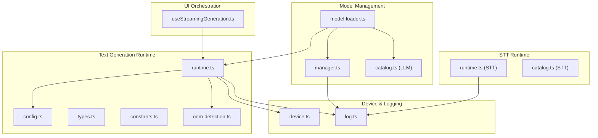
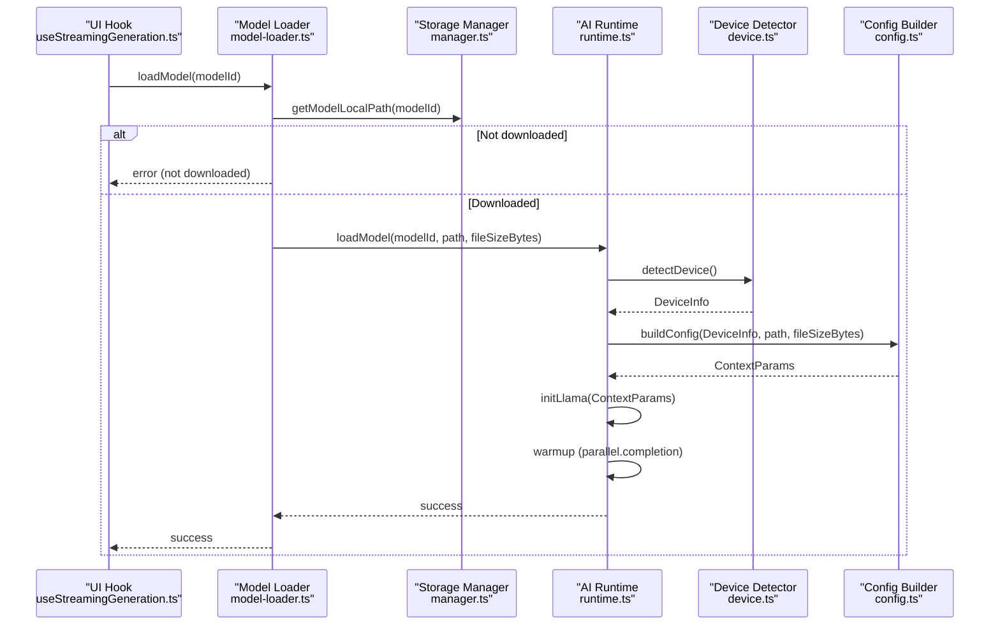
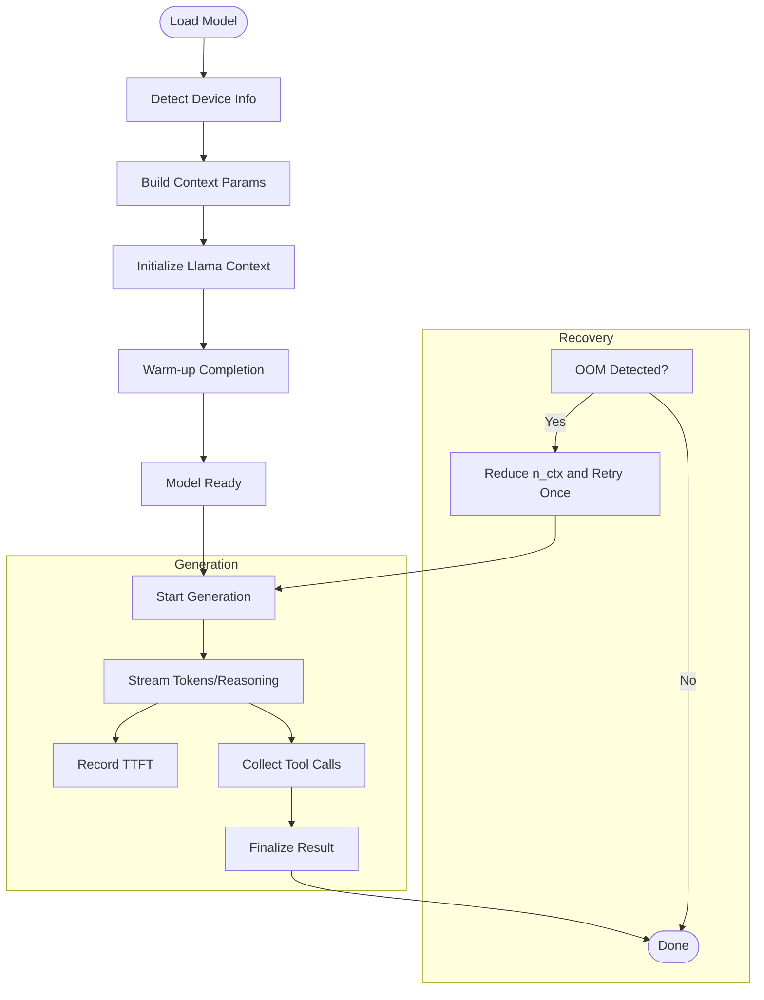
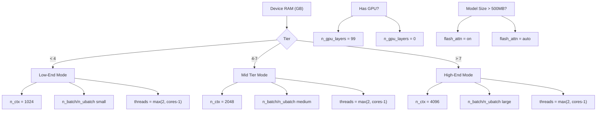
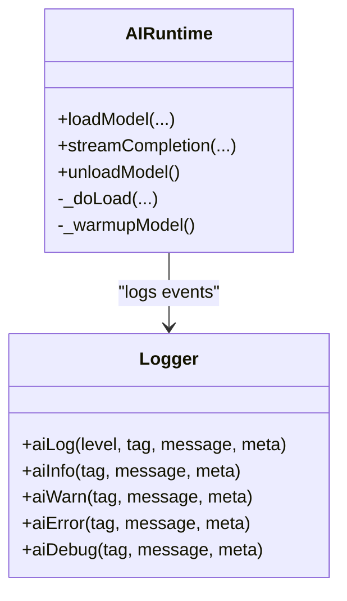
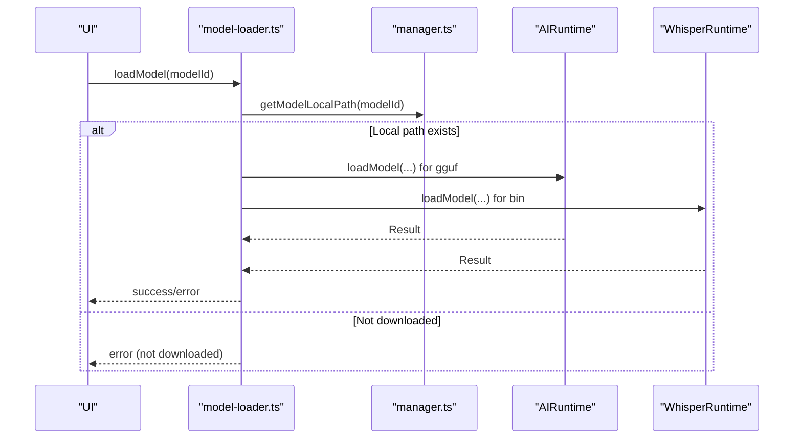
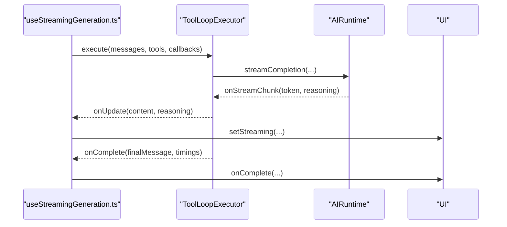
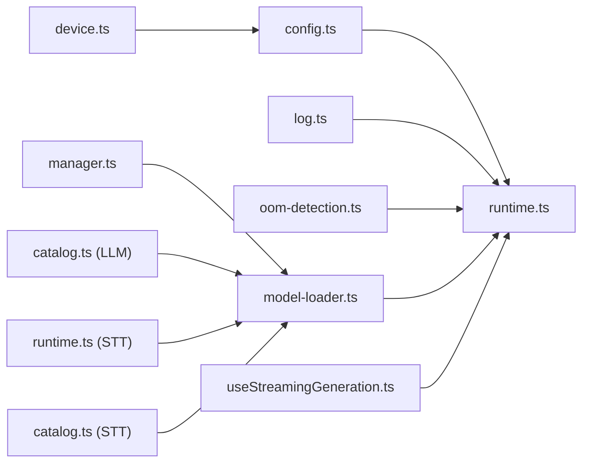

# Performance Tuning and Troubleshooting

<cite>
**Referenced Files in This Document**
- [runtime.ts](file://shared/ai/text-generation/runtime.ts)
- [config.ts](file://shared/ai/text-generation/config.ts)
- [log.ts](file://shared/ai/log.ts)
- [model-loader.ts](file://shared/ai/model-loader.ts)
- [manager.ts](file://shared/ai/manager.ts)
- [oom-detection.ts](file://shared/ai/text-generation/oom-detection.ts)
- [device.ts](file://shared/device.ts)
- [types.ts](file://shared/ai/text-generation/types.ts)
- [constants.ts](file://shared/ai/text-generation/constants.ts)
- [useStreamingGeneration.ts](file://features/chat/view-model/hooks/useStreamingGeneration.ts)
- [runtime.ts (STT)](file://shared/ai/stt/runtime.ts)
- [catalog.ts (LLM)](file://shared/ai/text-generation/catalog.ts)
- [catalog.ts (STT)](file://shared/ai/stt/catalog.ts)
</cite>

## Table of Contents
1. [Introduction](#introduction)
2. [Project Structure](#project-structure)
3. [Core Components](#core-components)
4. [Architecture Overview](#architecture-overview)
5. [Detailed Component Analysis](#detailed-component-analysis)
6. [Dependency Analysis](#dependency-analysis)
7. [Performance Considerations](#performance-considerations)
8. [Troubleshooting Guide](#troubleshooting-guide)
9. [Conclusion](#conclusion)
10. [Appendices](#appendices)

## Introduction
This document provides comprehensive performance tuning and troubleshooting guidance for My Shadow’s AI runtime system. It explains how inference times, memory usage, and generation quality are monitored and optimized, outlines configuration strategies for speed, quality, and memory conservation, and details diagnostics, error recovery, and best practices for different deployment environments.

## Project Structure
The AI runtime spans several modules:
- Text generation runtime and configuration
- Logging and metrics
- Model lifecycle management (download, load, unload)
- Device capability detection
- Streaming generation orchestration with tool execution
- STT runtime for speech-to-text

**Diagram sources**
- [runtime.ts:1-489](file://shared/ai/text-generation/runtime.ts#L1-L489)
- [config.ts:1-32](file://shared/ai/text-generation/config.ts#L1-L32)
- [types.ts:1-22](file://shared/ai/text-generation/types.ts#L1-L22)
- [constants.ts:1-8](file://shared/ai/text-generation/constants.ts#L1-L8)
- [oom-detection.ts:1-37](file://shared/ai/text-generation/oom-detection.ts#L1-L37)
- [model-loader.ts:1-172](file://shared/ai/model-loader.ts#L1-L172)
- [manager.ts:1-422](file://shared/ai/manager.ts#L1-L422)
- [catalog.ts (LLM):1-330](file://shared/ai/text-generation/catalog.ts#L1-L330)
- [device.ts:1-172](file://shared/device.ts#L1-L172)
- [log.ts:1-36](file://shared/ai/log.ts#L1-L36)
- [useStreamingGeneration.ts:1-275](file://features/chat/view-model/hooks/useStreamingGeneration.ts#L1-L275)
- [runtime.ts (STT):1-99](file://shared/ai/stt/runtime.ts#L1-L99)
- [catalog.ts (STT):1-41](file://shared/ai/stt/catalog.ts#L1-L41)

**Section sources**
- [runtime.ts:1-489](file://shared/ai/text-generation/runtime.ts#L1-L489)
- [config.ts:1-32](file://shared/ai/text-generation/config.ts#L1-L32)
- [log.ts:1-36](file://shared/ai/log.ts#L1-L36)
- [model-loader.ts:1-172](file://shared/ai/model-loader.ts#L1-L172)
- [manager.ts:1-422](file://shared/ai/manager.ts#L1-L422)
- [device.ts:1-172](file://shared/device.ts#L1-L172)
- [useStreamingGeneration.ts:1-275](file://features/chat/view-model/hooks/useStreamingGeneration.ts#L1-L275)
- [runtime.ts (STT):1-99](file://shared/ai/stt/runtime.ts#L1-L99)
- [catalog.ts (LLM):1-330](file://shared/ai/text-generation/catalog.ts#L1-L330)
- [catalog.ts (STT):1-41](file://shared/ai/stt/catalog.ts#L1-L41)

## Core Components
- AIRuntime: Manages model loading/unloading, warm-up, streaming completion, and error recovery via OOM degradation.
- Configuration builder: Generates runtime parameters based on device capabilities and model size.
- Logging: Centralized logging with levels and structured metadata for performance diagnostics.
- Model loader and manager: Unified orchestration for model discovery, download, load, unload, and availability queries.
- Device detector: Estimates RAM, CPU cores, and GPU capability to tune runtime parameters.
- Streaming orchestration: Integrates tool execution loops with streaming generation and real-time UI updates.
- STT runtime: Speech-to-text runtime for audio processing.

Key performance metrics captured:
- Load/unload durations
- First token time-to-first-token (TTFT)
- Total inference duration
- Timings from native completion results
- Download progress and durations

**Section sources**
- [runtime.ts:16-489](file://shared/ai/text-generation/runtime.ts#L16-L489)
- [config.ts:4-31](file://shared/ai/text-generation/config.ts#L4-L31)
- [log.ts:7-36](file://shared/ai/log.ts#L7-L36)
- [model-loader.ts:11-172](file://shared/ai/model-loader.ts#L11-L172)
- [manager.ts:59-192](file://shared/ai/manager.ts#L59-L192)
- [device.ts:122-171](file://shared/device.ts#L122-L171)
- [useStreamingGeneration.ts:39-164](file://features/chat/view-model/hooks/useStreamingGeneration.ts#L39-L164)
- [runtime.ts (STT):5-99](file://shared/ai/stt/runtime.ts#L5-L99)

## Architecture Overview
The runtime architecture integrates device detection, configuration selection, model lifecycle management, and streaming inference with tool execution.

**Diagram sources**
- [useStreamingGeneration.ts:52-146](file://features/chat/view-model/hooks/useStreamingGeneration.ts#L52-L146)
- [model-loader.ts:11-63](file://shared/ai/model-loader.ts#L11-L63)
- [manager.ts:320-344](file://shared/ai/manager.ts#L320-L344)
- [runtime.ts:34-157](file://shared/ai/text-generation/runtime.ts#L34-L157)
- [device.ts:122-171](file://shared/device.ts#L122-L171)
- [config.ts:4-31](file://shared/ai/text-generation/config.ts#L4-L31)

## Detailed Component Analysis

### AIRuntime: Loading, Warm-up, Streaming, and Recovery
- Device-aware configuration: Uses detected RAM, CPU cores, and GPU backend to set context parameters.
- Memory safety: Pre-checks required RAM against available RAM and logs insufficient memory conditions.
- Warm-up: Runs a minimal completion to prime the engine before user generation.
- Streaming: Tracks TTFT, streams tokens and reasoning chunks, aggregates tool calls, and normalizes IDs for tracing.
- Error recovery: Detects out-of-memory conditions and retries once with reduced context size.

**Diagram sources**
- [runtime.ts:47-157](file://shared/ai/text-generation/runtime.ts#L47-L157)
- [runtime.ts:256-477](file://shared/ai/text-generation/runtime.ts#L256-L477)
- [oom-detection.ts:1-37](file://shared/ai/text-generation/oom-detection.ts#L1-L37)
- [config.ts:4-31](file://shared/ai/text-generation/config.ts#L4-L31)

**Section sources**
- [runtime.ts:34-157](file://shared/ai/text-generation/runtime.ts#L34-L157)
- [runtime.ts:256-477](file://shared/ai/text-generation/runtime.ts#L256-L477)
- [oom-detection.ts:1-37](file://shared/ai/text-generation/oom-detection.ts#L1-L37)
- [config.ts:4-31](file://shared/ai/text-generation/config.ts#L4-L31)

### Configuration Builder: Speed, Quality, and Memory Modes
- Context size (n_ctx): Scaled by device RAM tier (low-end vs mid vs high-end).
- Batch sizes (n_batch, n_ubatch): Adjusted for throughput vs memory trade-offs.
- Threads: Uses CPU cores minus a small offset to keep host responsive.
- GPU layers: Full offload on devices with GPU; otherwise CPU-only.
- Quantization caches: q4_0 on low RAM; q8_0 elsewhere.
- Flash Attention: Enabled for larger models on capable GPUs.

**Diagram sources**
- [config.ts:4-31](file://shared/ai/text-generation/config.ts#L4-L31)

**Section sources**
- [config.ts:4-31](file://shared/ai/text-generation/config.ts#L4-L31)

### Logging and Metrics: Performance Monitoring
- Centralized logging with levels and structured metadata.
- Tags for load/unload, inference phases, warm-up, tool usage, and errors.
- Metrics include durations, device info, batch sizes, and timings from native results.

**Diagram sources**
- [log.ts:7-36](file://shared/ai/log.ts#L7-L36)
- [runtime.ts:47-157](file://shared/ai/text-generation/runtime.ts#L47-L157)
- [runtime.ts:256-477](file://shared/ai/text-generation/runtime.ts#L256-L477)

**Section sources**
- [log.ts:1-36](file://shared/ai/log.ts#L1-L36)
- [runtime.ts:52-156](file://shared/ai/text-generation/runtime.ts#L52-L156)
- [runtime.ts:290-436](file://shared/ai/text-generation/runtime.ts#L290-L436)

### Model Lifecycle: Download, Load, Unload, Availability
- Unified model loader dispatches to the appropriate runtime based on model type.
- Storage manager handles deduplicated downloads, progress callbacks, caching, and removal.
- Availability listing merges LLM and STT catalogs and reflects loaded state.

**Diagram sources**
- [model-loader.ts:11-63](file://shared/ai/model-loader.ts#L11-L63)
- [manager.ts:59-192](file://shared/ai/manager.ts#L59-L192)
- [runtime.ts (STT):20-54](file://shared/ai/stt/runtime.ts#L20-L54)
- [runtime.ts:34-157](file://shared/ai/text-generation/runtime.ts#L34-L157)

**Section sources**
- [model-loader.ts:11-172](file://shared/ai/model-loader.ts#L11-L172)
- [manager.ts:59-192](file://shared/ai/manager.ts#L59-L192)

### Streaming Generation and Tool Execution
- Orchestrates tool loop execution with configurable concurrency and timeouts.
- Streams tokens and reasoning to the UI while preserving partial content on errors.
- Integrates with AIRuntime for completions and supports cancellation.

**Diagram sources**
- [useStreamingGeneration.ts:166-275](file://features/chat/view-model/hooks/useStreamingGeneration.ts#L166-L275)
- [runtime.ts:256-477](file://shared/ai/text-generation/runtime.ts#L256-L477)

**Section sources**
- [useStreamingGeneration.ts:39-164](file://features/chat/view-model/hooks/useStreamingGeneration.ts#L39-L164)
- [useStreamingGeneration.ts:166-275](file://features/chat/view-model/hooks/useStreamingGeneration.ts#L166-L275)

## Dependency Analysis
- AIRuntime depends on device detection, configuration builder, logging, and OOM detection.
- Model loader depends on storage manager and catalogs to resolve model metadata and paths.
- UI hook depends on AIRuntime and tool loop executor for streaming and tool execution.

**Diagram sources**
- [device.ts:122-171](file://shared/device.ts#L122-L171)
- [config.ts:4-31](file://shared/ai/text-generation/config.ts#L4-L31)
- [runtime.ts:16-489](file://shared/ai/text-generation/runtime.ts#L16-L489)
- [log.ts:1-36](file://shared/ai/log.ts#L1-L36)
- [oom-detection.ts:1-37](file://shared/ai/text-generation/oom-detection.ts#L1-L37)
- [manager.ts:1-422](file://shared/ai/manager.ts#L1-L422)
- [model-loader.ts:1-172](file://shared/ai/model-loader.ts#L1-L172)
- [catalog.ts (LLM):1-330](file://shared/ai/text-generation/catalog.ts#L1-L330)
- [useStreamingGeneration.ts:1-275](file://features/chat/view-model/hooks/useStreamingGeneration.ts#L1-L275)
- [runtime.ts (STT):1-99](file://shared/ai/stt/runtime.ts#L1-L99)
- [catalog.ts (STT):1-41](file://shared/ai/stt/catalog.ts#L1-L41)

**Section sources**
- [runtime.ts:16-489](file://shared/ai/text-generation/runtime.ts#L16-L489)
- [model-loader.ts:1-172](file://shared/ai/model-loader.ts#L1-L172)
- [useStreamingGeneration.ts:1-275](file://features/chat/view-model/hooks/useStreamingGeneration.ts#L1-L275)

## Performance Considerations
- Tune context size (n_ctx) according to device RAM tiers to balance quality and memory footprint.
- Prefer GPU offload when available; enable Flash Attention for larger models to improve throughput.
- Reduce batch sizes on constrained devices to prevent memory pressure.
- Use quantization caches (q4_0 vs q8_0) to optimize memory usage on low-RAM devices.
- Keep CPU threads reasonable to avoid saturating the host during generation.
- Warm-up the model after load to reduce first-token latency.
- Monitor TTFT and total inference duration for responsiveness feedback.
- Use streaming to deliver perceived performance improvements and incremental content.

[No sources needed since this section provides general guidance]

## Troubleshooting Guide

### Step-by-Step: Insufficient Memory During Load
1. Confirm available RAM and required memory estimates.
2. Verify model file size and device tier thresholds.
3. Reduce model choice to a smaller variant or lower-tier device.
4. Check logs for memory-related warnings and device info.

**Section sources**
- [runtime.ts:64-76](file://shared/ai/text-generation/runtime.ts#L64-L76)
- [device.ts:132-133](file://shared/device.ts#L132-L133)
- [log.ts:1-36](file://shared/ai/log.ts#L1-L36)

### Step-by-Step: Generation Errors or Empty Responses
1. Check for AbortError or ABORTED signals; ensure cancellation is handled gracefully.
2. Validate that a model is loaded before generating.
3. Inspect logs for INFERENCE:error and error metadata.
4. If empty response, confirm prompt formatting and stop words.

**Section sources**
- [runtime.ts:261-263](file://shared/ai/text-generation/runtime.ts#L261-L263)
- [runtime.ts:443-476](file://shared/ai/text-generation/runtime.ts#L443-L476)
- [log.ts:1-36](file://shared/ai/log.ts#L1-L36)

### Step-by-Step: Out-of-Memory During Generation
1. Detect OOM using pattern matching and known error codes.
2. Automatically degrade context size (n_ctx) by half and retry once.
3. If still failing, reduce batch sizes or disable GPU offload.
4. Consider switching to a smaller model variant.

**Section sources**
- [oom-detection.ts:1-37](file://shared/ai/text-generation/oom-detection.ts#L1-L37)
- [runtime.ts:451-459](file://shared/ai/text-generation/runtime.ts#L451-L459)
- [config.ts:18-20](file://shared/ai/text-generation/config.ts#L18-L20)

### Step-by-Step: Slow Inference or High Latency
1. Measure TTFT and total duration from logs.
2. Increase batch sizes and enable Flash Attention if supported.
3. Reduce temperature and top-k/top-p for faster deterministic decoding.
4. Warm-up the model post-load to prime caches.

**Section sources**
- [runtime.ts:340-348](file://shared/ai/text-generation/runtime.ts#L340-L348)
- [runtime.ts:431-436](file://shared/ai/text-generation/runtime.ts#L431-L436)
- [config.ts:17-29](file://shared/ai/text-generation/config.ts#L17-L29)

### Step-by-Step: Download Failures or Interrupted Transfers
1. Check active download tasks and progress callbacks.
2. Cancel and resume downloads; ensure partial files are cleaned up.
3. Verify connectivity and storage permissions.
4. Invalidate cache if stale entries cause confusion.

**Section sources**
- [manager.ts:59-192](file://shared/ai/manager.ts#L59-L192)
- [manager.ts:218-240](file://shared/ai/manager.ts#L218-L240)
- [manager.ts:320-344](file://shared/ai/manager.ts#L320-L344)

### Step-by-Step: Tool Call Issues
1. Confirm model supports tool use and templates are detected.
2. Validate tool definitions and enablement flags.
3. Inspect logs for tool call collection and normalization.
4. Ensure tool execution timeouts and retries are configured appropriately.

**Section sources**
- [runtime.ts:109-121](file://shared/ai/text-generation/runtime.ts#L109-L121)
- [runtime.ts:211-229](file://shared/ai/text-generation/runtime.ts#L211-L229)
- [useStreamingGeneration.ts:178-209](file://features/chat/view-model/hooks/useStreamingGeneration.ts#L178-L209)

### Step-by-Step: STT Model Loading Problems
1. Verify model path and file type (.bin).
2. Ensure Whisper runtime is initialized with the correct file path.
3. Check for release and unload sequences when swapping models.

**Section sources**
- [runtime.ts (STT):20-54](file://shared/ai/stt/runtime.ts#L20-L54)

## Conclusion
My Shadow’s AI runtime provides robust performance monitoring, device-aware configuration, and resilient error recovery. By tuning context size, batch parameters, and quantization, and by leveraging streaming and warm-up, users can achieve optimal performance across diverse devices. The logging and metrics infrastructure enables targeted troubleshooting and continuous optimization.

[No sources needed since this section summarizes without analyzing specific files]

## Appendices

### Diagnostic Checklist
- Confirm device RAM and GPU capability.
- Review load/unload durations and warm-up logs.
- Measure TTFT and total inference time.
- Validate batch sizes and Flash Attention settings.
- Inspect OOM detection and automatic degradation behavior.
- Verify download progress and storage health.

**Section sources**
- [device.ts:122-171](file://shared/device.ts#L122-L171)
- [log.ts:1-36](file://shared/ai/log.ts#L1-L36)
- [runtime.ts:52-156](file://shared/ai/text-generation/runtime.ts#L52-L156)
- [manager.ts:108-192](file://shared/ai/manager.ts#L108-L192)

### Best Practices by Deployment Environment
- Low-RAM devices (< 4 GB): Prefer q4_0 cache, smaller n_ctx, moderate threads, CPU-only.
- Mid-range devices (4–8 GB): Balanced n_ctx and batch sizes, enable GPU offload when available.
- High-end devices (> 8 GB): Larger n_ctx and batches, Flash Attention, higher thread counts.
- Mobile networks: Monitor download progress, handle interruptions, and leverage resume.

**Section sources**
- [config.ts:10-31](file://shared/ai/text-generation/config.ts#L10-L31)
- [manager.ts:59-192](file://shared/ai/manager.ts#L59-L192)