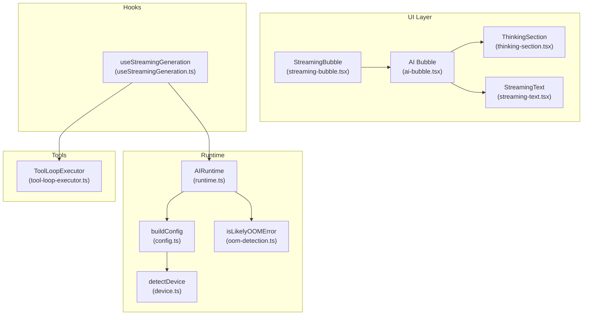
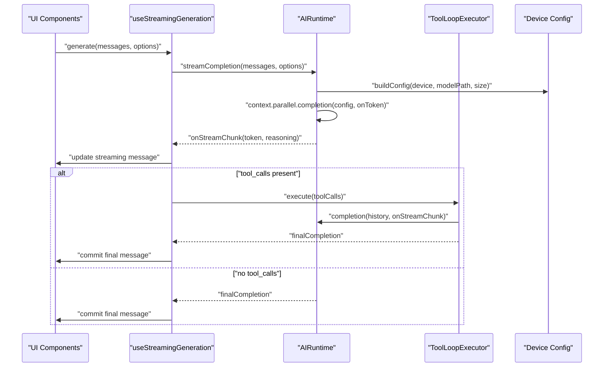
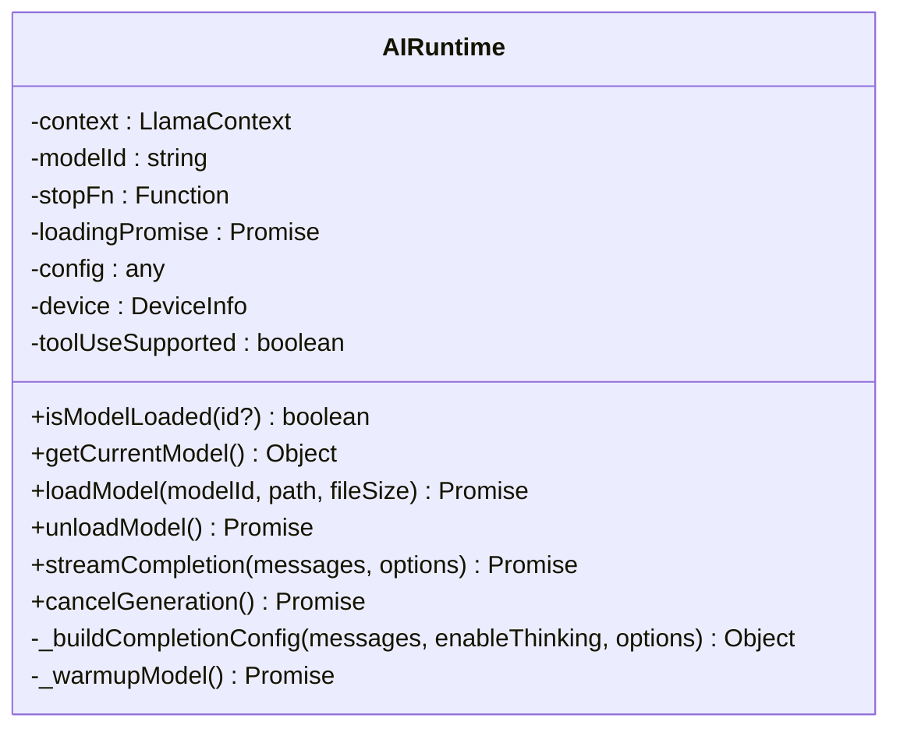
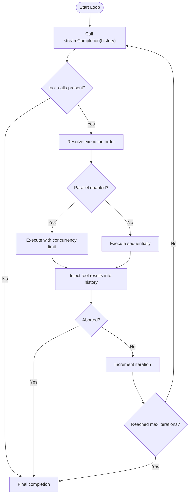
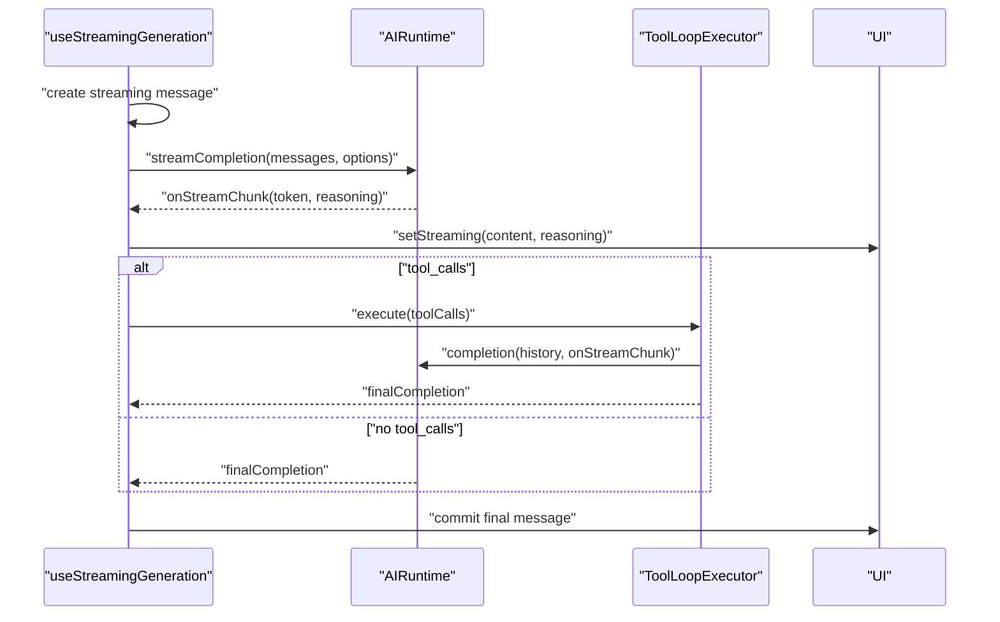
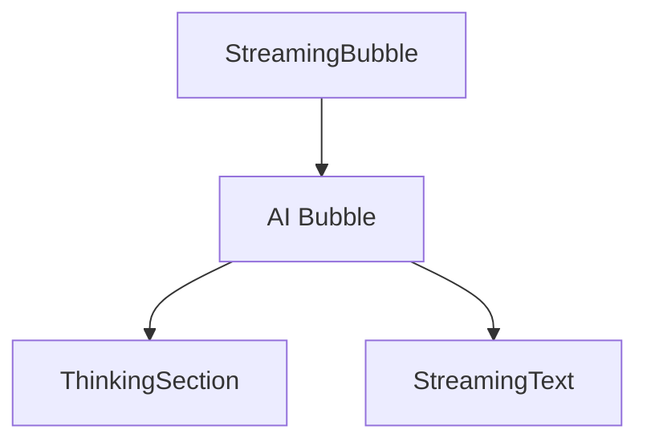
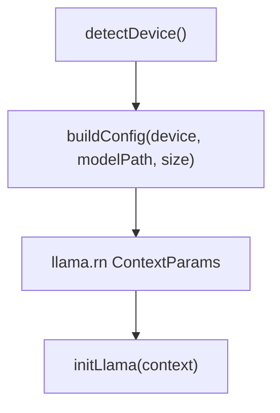
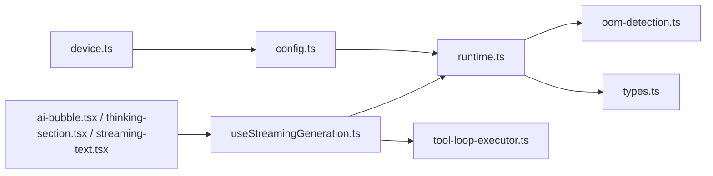

# Streaming Generation and Memory Optimization

<cite>
**Referenced Files in This Document**
- [runtime.ts](file://shared/ai/text-generation/runtime.ts)
- [types.ts](file://shared/ai/text-generation/types.ts)
- [constants.ts](file://shared/ai/text-generation/constants.ts)
- [oom-detection.ts](file://shared/ai/text-generation/oom-detection.ts)
- [useStreamingGeneration.ts](file://features/chat/view-model/hooks/useStreamingGeneration.ts)
- [tool-loop-executor.ts](file://shared/ai/tools/tool-loop-executor.ts)
- [streaming-bubble.tsx](file://features/chat/components/streaming-bubble.tsx)
- [streaming-text.tsx](file://features/chat/components/streaming-text.tsx)
- [thinking-section.tsx](file://features/chat/components/thinking-section.tsx)
- [ai-bubble.tsx](file://features/chat/components/ai-bubble.tsx)
- [ram-warning.tsx](file://features/model-management/components/ram-warning.tsx)
- [device.ts](file://shared/device.ts)
- [config.ts](file://shared/ai/text-generation/config.ts)
- [README.md](file://README.md)
</cite>

## Table of Contents
1. [Introduction](#introduction)
2. [Project Structure](#project-structure)
3. [Core Components](#core-components)
4. [Architecture Overview](#architecture-overview)
5. [Detailed Component Analysis](#detailed-component-analysis)
6. [Dependency Analysis](#dependency-analysis)
7. [Performance Considerations](#performance-considerations)
8. [Troubleshooting Guide](#troubleshooting-guide)
9. [Conclusion](#conclusion)
10. [Appendices](#appendices)

## Introduction
This document explains the streaming generation and memory optimization system in My Shadow’s AI runtime. It covers:
- Progressive text generation with token-by-token streaming and real-time UI updates
- Memory optimization strategies: KV cache management, context window tuning, and adaptive allocation
- Streaming callbacks for immediate feedback and reasoning separation
- Tool call streaming and execution orchestration
- Memory pressure detection and automatic degradation to avoid out-of-memory conditions
- Performance monitoring and device-aware tuning

## Project Structure
The streaming and memory optimization pipeline spans runtime, UI, and device modules:
- Runtime: model loading, configuration, streaming inference, and OOM recovery
- Tools: tool loop orchestration, caching, parallelism, and retries
- UI: streaming bubbles, thinking sections, and typing-style text rendering
- Device: device capability detection and runtime configuration builder

**Diagram sources**
- [runtime.ts:16-488](file://shared/ai/text-generation/runtime.ts#L16-L488)
- [config.ts:4-31](file://shared/ai/text-generation/config.ts#L4-L31)
- [device.ts:122-171](file://shared/device.ts#L122-L171)
- [oom-detection.ts:1-37](file://shared/ai/text-generation/oom-detection.ts#L1-L37)
- [useStreamingGeneration.ts:39-275](file://features/chat/view-model/hooks/useStreamingGeneration.ts#L39-L275)
- [tool-loop-executor.ts:199-459](file://shared/ai/tools/tool-loop-executor.ts#L199-L459)
- [streaming-bubble.tsx:18-25](file://features/chat/components/streaming-bubble.tsx#L18-L25)
- [ai-bubble.tsx:20-118](file://features/chat/components/ai-bubble.tsx#L20-L118)
- [thinking-section.tsx:21-115](file://features/chat/components/thinking-section.tsx#L21-L115)
- [streaming-text.tsx:28-113](file://features/chat/components/streaming-text.tsx#L28-L113)

**Section sources**
- [runtime.ts:16-488](file://shared/ai/text-generation/runtime.ts#L16-L488)
- [config.ts:4-31](file://shared/ai/text-generation/config.ts#L4-L31)
- [device.ts:122-171](file://shared/device.ts#L122-L171)
- [oom-detection.ts:1-37](file://shared/ai/text-generation/oom-detection.ts#L1-L37)
- [useStreamingGeneration.ts:39-275](file://features/chat/view-model/hooks/useStreamingGeneration.ts#L39-L275)
- [tool-loop-executor.ts:199-459](file://shared/ai/tools/tool-loop-executor.ts#L199-L459)
- [streaming-bubble.tsx:18-25](file://features/chat/components/streaming-bubble.tsx#L18-L25)
- [ai-bubble.tsx:20-118](file://features/chat/components/ai-bubble.tsx#L20-L118)
- [thinking-section.tsx:21-115](file://features/chat/components/thinking-section.tsx#L21-L115)
- [streaming-text.tsx:28-113](file://features/chat/components/streaming-text.tsx#L28-L113)

## Core Components
- AIRuntime: orchestrates model loading, configuration, streaming inference, and OOM recovery
- ToolLoopExecutor: manages tool call loops, parallel execution, caching, timeouts, and retries
- useStreamingGeneration: coordinates UI streaming, cancellation, and tool loop integration
- UI components: render streaming content, reasoning, and typing-style text
- Device detection and config builder: adapt runtime parameters to device capabilities

Key responsibilities:
- Streaming: progressive token delivery with onStreamChunk callbacks
- Reasoning: separate “thinking” tokens from final response
- Tool calls: detect, deduplicate, and stream tool invocation updates
- Memory: KV cache quantization, context window scaling, and automatic degradation

**Section sources**
- [runtime.ts:16-488](file://shared/ai/text-generation/runtime.ts#L16-L488)
- [types.ts:4-19](file://shared/ai/text-generation/types.ts#L4-L19)
- [useStreamingGeneration.ts:39-275](file://features/chat/view-model/hooks/useStreamingGeneration.ts#L39-L275)
- [tool-loop-executor.ts:199-459](file://shared/ai/tools/tool-loop-executor.ts#L199-L459)

## Architecture Overview
The system integrates UI, runtime, and tools into a cohesive streaming pipeline:
- UI triggers generation via a hook that sets up streaming state and cancellation
- Hook invokes AIRuntime to stream tokens and optionally inject tool results
- ToolLoopExecutor handles tool call discovery, execution, and injection back into the conversation
- Device detection and config builder ensure optimal runtime parameters per device tier

**Diagram sources**
- [useStreamingGeneration.ts:52-146](file://features/chat/view-model/hooks/useStreamingGeneration.ts#L52-L146)
- [runtime.ts:256-477](file://shared/ai/text-generation/runtime.ts#L256-L477)
- [tool-loop-executor.ts:232-459](file://shared/ai/tools/tool-loop-executor.ts#L232-L459)
- [config.ts:4-31](file://shared/ai/text-generation/config.ts#L4-L31)

## Detailed Component Analysis

### AIRuntime: Streaming and Memory Management
- Model lifecycle: load/unload with device-aware configuration and warm-up
- Streaming: progressive token delivery with onStreamChunk, reasoning extraction, and tool call aggregation
- Memory safety: OOM detection and automatic context window halving with single retry
- Stop control: cancellation via stop function and AbortSignal propagation

**Diagram sources**
- [runtime.ts:16-488](file://shared/ai/text-generation/runtime.ts#L16-L488)

Key behaviors:
- Token streaming: on each token, optionally extract reasoning and forward chunks to UI
- Tool call streaming: collect and deduplicate tool calls across tokens
- First-token timing: measure time-to-first-token for UX metrics
- OOM recovery: halve context window and retry once if likely OOM detected

**Section sources**
- [runtime.ts:256-477](file://shared/ai/text-generation/runtime.ts#L256-L477)
- [oom-detection.ts:1-37](file://shared/ai/text-generation/oom-detection.ts#L1-L37)
- [constants.ts:1-8](file://shared/ai/text-generation/constants.ts#L1-L8)
- [types.ts:4-19](file://shared/ai/text-generation/types.ts#L4-L19)

### ToolLoopExecutor: Tool Call Streaming and Orchestration
- Iterative loop: completion -> tool calls -> execution -> inject results -> repeat
- Parallel execution: concurrency-limited batches with dependency awareness
- Caching: LRU cache with TTL to reduce repeated tool calls
- Retries: exponential backoff with jitter for transient failures
- Metrics: track iterations, tool calls, cache hits/misses, parallel executions, errors, and retries

**Diagram sources**
- [tool-loop-executor.ts:232-459](file://shared/ai/tools/tool-loop-executor.ts#L232-L459)

**Section sources**
- [tool-loop-executor.ts:199-459](file://shared/ai/tools/tool-loop-executor.ts#L199-L459)

### useStreamingGeneration: UI Integration and Cancellation
- Initializes a streaming message and manages AbortController
- Streams tokens to UI via onStreamChunk and updates content/reasoning refs
- Integrates ToolLoopExecutor to handle tool calls and inject results
- Commits final message on completion and notifies UI callbacks

**Diagram sources**
- [useStreamingGeneration.ts:52-146](file://features/chat/view-model/hooks/useStreamingGeneration.ts#L52-L146)
- [runtime.ts:256-477](file://shared/ai/text-generation/runtime.ts#L256-L477)
- [tool-loop-executor.ts:232-459](file://shared/ai/tools/tool-loop-executor.ts#L232-L459)

**Section sources**
- [useStreamingGeneration.ts:39-275](file://features/chat/view-model/hooks/useStreamingGeneration.ts#L39-L275)

### UI Components: Real-Time Rendering and Reasoning
- StreamingBubble: wraps AI bubble for streaming state
- AI Bubble: renders markdown content, optional thinking section, and footer with timings
- ThinkingSection: expandable/collapsible reasoning panel with auto-scroll behavior
- StreamingText: typing-style character-by-character reveal with line-height constraints

**Diagram sources**
- [streaming-bubble.tsx:18-25](file://features/chat/components/streaming-bubble.tsx#L18-L25)
- [ai-bubble.tsx:20-118](file://features/chat/components/ai-bubble.tsx#L20-L118)
- [thinking-section.tsx:21-115](file://features/chat/components/thinking-section.tsx#L21-L115)
- [streaming-text.tsx:28-113](file://features/chat/components/streaming-text.tsx#L28-L113)

**Section sources**
- [streaming-bubble.tsx:18-25](file://features/chat/components/streaming-bubble.tsx#L18-L25)
- [ai-bubble.tsx:20-118](file://features/chat/components/ai-bubble.tsx#L20-L118)
- [thinking-section.tsx:21-115](file://features/chat/components/thinking-section.tsx#L21-L115)
- [streaming-text.tsx:28-113](file://features/chat/components/streaming-text.tsx#L28-L113)

### Device Detection and Adaptive Configuration
- Device detection: total/available RAM, CPU cores, GPU availability and backend
- Config builder: context size, batch sizes, threads, GPU layers, KV cache quantization, flash attention
- RAM warning component: informs users when device RAM is insufficient for a model

**Diagram sources**
- [device.ts:122-171](file://shared/device.ts#L122-L171)
- [config.ts:4-31](file://shared/ai/text-generation/config.ts#L4-L31)

**Section sources**
- [device.ts:122-171](file://shared/device.ts#L122-L171)
- [config.ts:4-31](file://shared/ai/text-generation/config.ts#L4-L31)
- [ram-warning.tsx:15-31](file://features/model-management/components/ram-warning.tsx#L15-L31)

## Dependency Analysis
- AIRuntime depends on device detection and config builder to initialize llama.rn with optimized parameters
- ToolLoopExecutor depends on AIRuntime for completions and on tool registries for execution
- UI components depend on AIRuntime via hooks and on ToolLoopExecutor for tool-driven flows
- OOM detection is used by AIRuntime to trigger automatic degradation

**Diagram sources**
- [device.ts:122-171](file://shared/device.ts#L122-L171)
- [config.ts:4-31](file://shared/ai/text-generation/config.ts#L4-L31)
- [runtime.ts:16-488](file://shared/ai/text-generation/runtime.ts#L16-L488)
- [oom-detection.ts:1-37](file://shared/ai/text-generation/oom-detection.ts#L1-L37)
- [types.ts:4-19](file://shared/ai/text-generation/types.ts#L4-L19)
- [useStreamingGeneration.ts:39-275](file://features/chat/view-model/hooks/useStreamingGeneration.ts#L39-L275)
- [tool-loop-executor.ts:199-459](file://shared/ai/tools/tool-loop-executor.ts#L199-L459)
- [ai-bubble.tsx:20-118](file://features/chat/components/ai-bubble.tsx#L20-L118)
- [thinking-section.tsx:21-115](file://features/chat/components/thinking-section.tsx#L21-L115)
- [streaming-text.tsx:28-113](file://features/chat/components/streaming-text.tsx#L28-L113)

**Section sources**
- [runtime.ts:16-488](file://shared/ai/text-generation/runtime.ts#L16-L488)
- [useStreamingGeneration.ts:39-275](file://features/chat/view-model/hooks/useStreamingGeneration.ts#L39-L275)
- [tool-loop-executor.ts:199-459](file://shared/ai/tools/tool-loop-executor.ts#L199-L459)

## Performance Considerations
- Device tiers and KV cache quantization:
  - Budget (< 5 GB): q4_0 KV cache, smaller context, CPU-only
  - Mid-range (5–7 GB): q8_0 KV cache, moderate context, partial GPU offload
  - Premium (≥ 7 GB): q8_0 or f16 KV cache, larger context, full GPU offload
- Flash attention: enabled for large models on capable GPUs
- Batch sizes and threads: tuned per device tier for throughput and stability
- Warm-up: pre-run a short completion to prime caches and reduce first-token latency
- Typing-style rendering: minimal layout thrashing by appending characters incrementally

Practical tips:
- Prefer q8_0 on low-RAM devices; reserve f16 for high-RAM devices
- Reduce n_ctx on OOM symptoms; the runtime halves it automatically once
- Monitor first-token timing and total generation duration via CompletionOutput timings
- Use parallel tool execution judiciously; adjust maxConcurrency based on device capabilities

**Section sources**
- [README.md:86-119](file://README.md#L86-L119)
- [config.ts:4-31](file://shared/ai/text-generation/config.ts#L4-L31)
- [runtime.ts:234-254](file://shared/ai/text-generation/runtime.ts#L234-L254)

## Troubleshooting Guide
Common issues and remedies:
- Out-of-memory during generation:
  - The runtime detects likely OOM and halves n_ctx automatically once; retry succeeds with reduced memory footprint
  - If still failing, reduce model size or disable GPU offload
- Empty or truncated responses:
  - Verify stop words and ensure the model supports reasoning if enabled
  - Check AbortSignal propagation and cancellation
- Tool call failures:
  - Inspect error strategy and retry behavior; adjust timeouts and concurrency
  - Use caching to avoid repeated calls for identical parameters
- UI not updating:
  - Confirm onStreamChunk is wired to update state and trigger re-render
  - Ensure streaming message is updated atomically (content + reasoning)

**Section sources**
- [oom-detection.ts:1-37](file://shared/ai/text-generation/oom-detection.ts#L1-L37)
- [runtime.ts:451-477](file://shared/ai/text-generation/runtime.ts#L451-L477)
- [tool-loop-executor.ts:711-731](file://shared/ai/tools/tool-loop-executor.ts#L711-L731)
- [useStreamingGeneration.ts:210-231](file://features/chat/view-model/hooks/useStreamingGeneration.ts#L210-L231)

## Conclusion
My Shadow’s streaming and memory optimization system delivers responsive, real-time AI responses with robust memory safety. By combining device-aware configuration, KV cache quantization, adaptive context sizing, and automatic OOM recovery, it ensures reliable performance across a wide range of devices. The tool loop executor further enhances capability by orchestrating tool calls with parallelism, caching, and retries. Together, these components provide a smooth user experience with immediate UI updates, reasoning visibility, and resilient operation under memory pressure.

## Appendices

### Practical UI Implementation Examples
- Streaming UI component:
  - Use StreamingBubble to wrap AI messages during generation
  - Render content with AI Bubble and ThinkingSection for reasoning
  - Apply StreamingText for typing-style character-by-character reveal
- Handling memory optimization:
  - Show RamWarning when device RAM is below model requirement
  - Allow users to choose smaller models or reduce context size
  - Observe timings from CompletionOutput to inform UX decisions

**Section sources**
- [streaming-bubble.tsx:18-25](file://features/chat/components/streaming-bubble.tsx#L18-L25)
- [ai-bubble.tsx:20-118](file://features/chat/components/ai-bubble.tsx#L20-L118)
- [thinking-section.tsx:21-115](file://features/chat/components/thinking-section.tsx#L21-L115)
- [streaming-text.tsx:28-113](file://features/chat/components/streaming-text.tsx#L28-L113)
- [ram-warning.tsx:15-31](file://features/model-management/components/ram-warning.tsx#L15-L31)