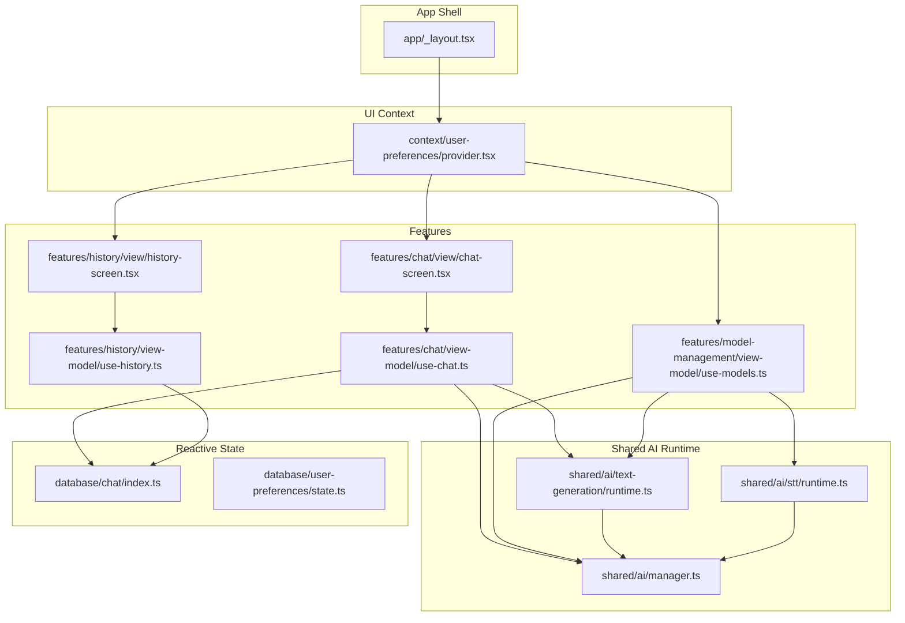
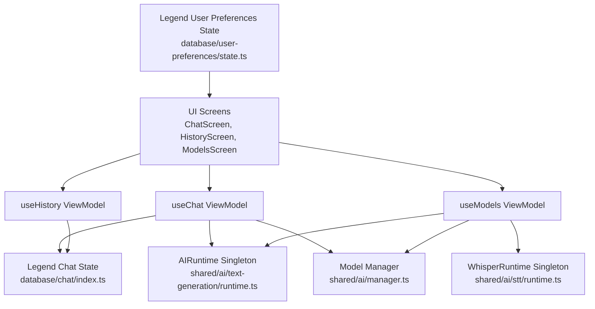
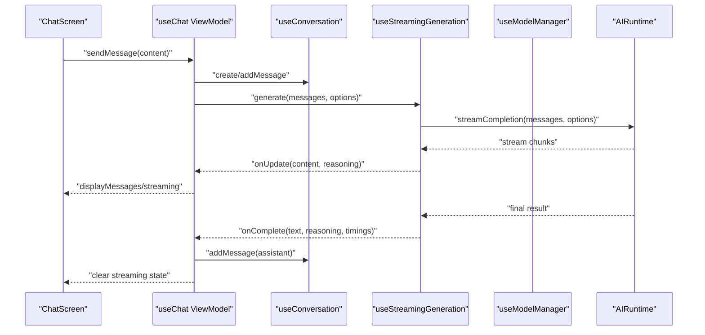
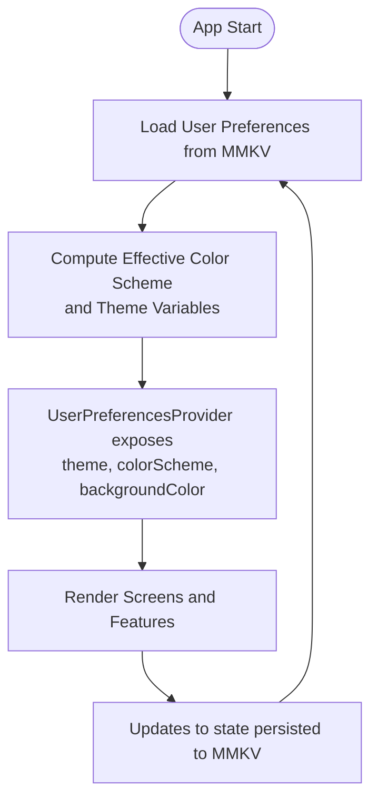
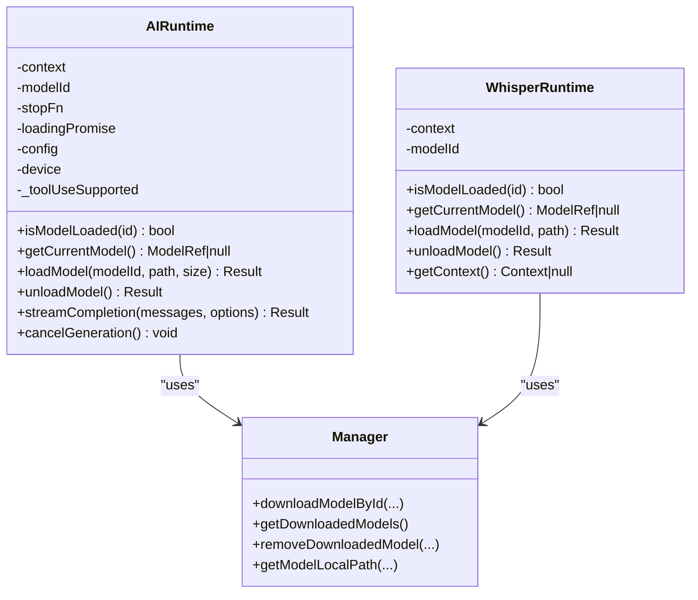
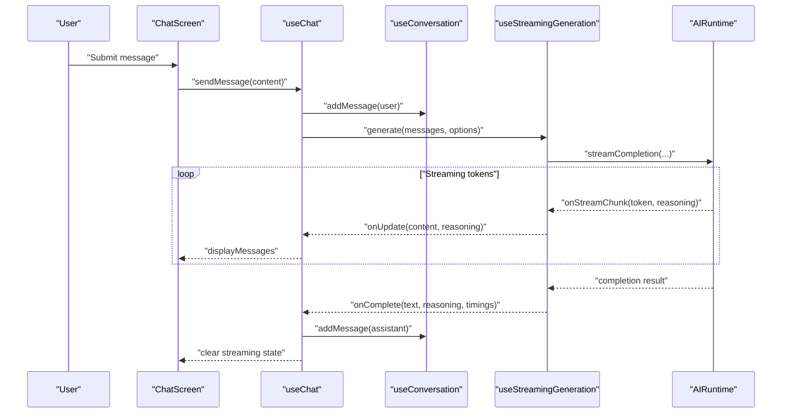
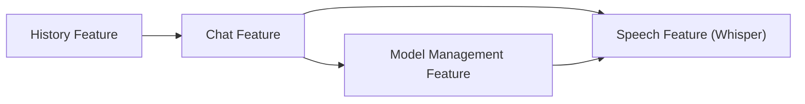
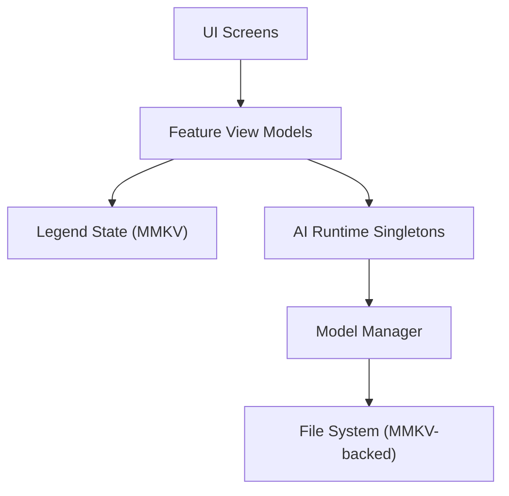

# Application Architecture

<cite>
**Referenced Files in This Document**
- [README.md](file://README.md)
- [_layout.tsx](file://app/_layout.tsx)
- [provider.tsx](file://context/user-preferences/provider.tsx)
- [state.ts](file://database/user-preferences/state.ts)
- [chat/index.ts](file://database/chat/index.ts)
- [manager.ts](file://shared/ai/manager.ts)
- [runtime.ts (text-generation)](file://shared/ai/text-generation/runtime.ts)
- [runtime.ts (stt)](file://shared/ai/stt/runtime.ts)
- [use-chat.ts](file://features/chat/view-model/use-chat.ts)
- [useConversation.ts](file://features/chat/view-model/hooks/useConversation.ts)
- [useStreamingGeneration.ts](file://features/chat/view-model/hooks/useStreamingGeneration.ts)
- [useModelManager.ts](file://features/chat/view-model/hooks/useModelManager.ts)
- [chat-screen.tsx](file://features/chat/view/chat-screen.tsx)
- [use-history.ts](file://features/history/view-model/use-history.ts)
- [history-screen.tsx](file://features/history/view/history-screen.tsx)
- [use-models.ts](file://features/model-management/view-model/use-models.ts)
</cite>

## Table of Contents
1. [Introduction](#introduction)
2. [Project Structure](#project-structure)
3. [Core Components](#core-components)
4. [Architecture Overview](#architecture-overview)
5. [Detailed Component Analysis](#detailed-component-analysis)
6. [Dependency Analysis](#dependency-analysis)
7. [Performance Considerations](#performance-considerations)
8. [Troubleshooting Guide](#troubleshooting-guide)
9. [Conclusion](#conclusion)
10. [Appendices](#appendices)

## Introduction
This document describes the architecture of My Shadow, a local-first, privacy-preserving reflection journal built with React Native and Expo. The application performs all AI inference locally using llama.rn and whisper.rn, stores data encrypted via MMKV, and avoids external APIs. The architecture emphasizes:
- Separation of concerns across UI, features, shared AI runtime, and data persistence
- MVVM-style View Models orchestrating business logic while keeping UI components declarative
- Reactive state via LegendAppState and React Context providers for cross-component communication
- Dependency Injection across shared AI modules for testability and modularity
- Modular feature boundaries for chat, model management, speech processing, and history
- Privacy-first design ensuring all processing stays on device and data remains encrypted

## Project Structure
The repository follows a feature-based, layered organization:
- app/: Routing and root layout with providers
- features/: Feature modules (chat, history, model-management)
- shared/: Shared AI runtime, STT, tools, and types
- database/: Reactive state for chat and user preferences
- context/: React Context providers for user preferences
- components/: Reusable UI primitives
- tests/: Unit and property-based tests

**Diagram sources**
- [_layout.tsx:12-50](file://app/_layout.tsx#L12-L50)
- [provider.tsx:19-156](file://context/user-preferences/provider.tsx#L19-L156)
- [use-chat.ts:22-370](file://features/chat/view-model/use-chat.ts#L22-L370)
- [chat-screen.tsx:14-147](file://features/chat/view/chat-screen.tsx#L14-L147)
- [use-history.ts:7-93](file://features/history/view-model/use-history.ts#L7-L93)
- [history-screen.tsx:23-152](file://features/history/view/history-screen.tsx#L23-L152)
- [use-models.ts:20-207](file://features/model-management/view-model/use-models.ts#L20-L207)
- [runtime.ts (text-generation):14-488](file://shared/ai/text-generation/runtime.ts#L14-L488)
- [runtime.ts (stt):5-98](file://shared/ai/stt/runtime.ts#L5-L98)
- [manager.ts:55-320](file://shared/ai/manager.ts#L55-L320)
- [chat/index.ts:14-30](file://database/chat/index.ts#L14-L30)
- [state.ts:6-19](file://database/user-preferences/state.ts#L6-L19)

**Section sources**
- [README.md:1-207](file://README.md#L1-L207)
- [_layout.tsx:12-50](file://app/_layout.tsx#L12-L50)
- [provider.tsx:19-156](file://context/user-preferences/provider.tsx#L19-L156)

## Core Components
- Root layout and providers: Establishes the app shell, gesture/keyboard/safe area providers, and the user preferences provider that supplies theme and color scheme to the UI.
- Feature View Models: Encapsulate business logic for chat, history, and model management. They coordinate reactive state, AI runtime, and persistence.
- Shared AI Runtime: Provides singletons for text-generation and STT, with dependency injection and device-aware configuration.
- Reactive State: Uses LegendAppState with MMKV persistence for chat conversations and user preferences.
- UI Components: Declarative React components driven by View Models and reactive state.

Key responsibilities:
- MVVM orchestration: View Models own state transitions and orchestrate AI calls; Views remain declarative.
- DI: Runtime instances are lazily created and reused, enabling testability by swapping implementations.
- Privacy-first: All models and data are stored locally; encrypted via MMKV; no cloud calls.

**Section sources**
- [_layout.tsx:12-50](file://app/_layout.tsx#L12-L50)
- [provider.tsx:19-156](file://context/user-preferences/provider.tsx#L19-L156)
- [use-chat.ts:22-370](file://features/chat/view-model/use-chat.ts#L22-L370)
- [use-models.ts:20-207](file://features/model-management/view-model/use-models.ts#L20-L207)
- [use-history.ts:7-93](file://features/history/view-model/use-history.ts#L7-L93)
- [runtime.ts (text-generation):14-488](file://shared/ai/text-generation/runtime.ts#L14-L488)
- [runtime.ts (stt):5-98](file://shared/ai/stt/runtime.ts#L5-L98)
- [manager.ts:55-320](file://shared/ai/manager.ts#L55-L320)
- [chat/index.ts:14-30](file://database/chat/index.ts#L14-L30)
- [state.ts:6-19](file://database/user-preferences/state.ts#L6-L19)

## Architecture Overview
The system enforces a clean separation of concerns:
- UI Layer: Screens and components consume View Models and reactive state.
- Feature Layer: Feature-specific View Models encapsulate domain logic.
- Shared AI Layer: AI runtime singletons manage model lifecycle and inference.
- Persistence Layer: LegendAppState with MMKV persists chat and user preferences.

**Diagram sources**
- [chat-screen.tsx:14-147](file://features/chat/view/chat-screen.tsx#L14-L147)
- [history-screen.tsx:23-152](file://features/history/view/history-screen.tsx#L23-L152)
- [use-models.ts:20-207](file://features/model-management/view-model/use-models.ts#L20-L207)
- [use-chat.ts:22-370](file://features/chat/view-model/use-chat.ts#L22-L370)
- [use-history.ts:7-93](file://features/history/view-model/use-history.ts#L7-L93)
- [chat/index.ts:14-30](file://database/chat/index.ts#L14-L30)
- [state.ts:6-19](file://database/user-preferences/state.ts#L6-L19)
- [runtime.ts (text-generation):14-488](file://shared/ai/text-generation/runtime.ts#L14-L488)
- [runtime.ts (stt):5-98](file://shared/ai/stt/runtime.ts#L5-L98)
- [manager.ts:55-320](file://shared/ai/manager.ts#L55-L320)

## Detailed Component Analysis

### MVVM Pattern Implementation
- View: Screens and components are thin and declarative, subscribing to reactive state and receiving callbacks from View Models.
- ViewModel: Encapsulates orchestration of state updates, AI runtime calls, and persistence operations.
- Model: Reactive state observables and runtime singletons.

**Diagram sources**
- [chat-screen.tsx:55-139](file://features/chat/view/chat-screen.tsx#L55-L139)
- [use-chat.ts:101-183](file://features/chat/view-model/use-chat.ts#L101-L183)
- [useConversation.ts:34-120](file://features/chat/view-model/hooks/useConversation.ts#L34-L120)
- [useStreamingGeneration.ts:52-146](file://features/chat/view-model/hooks/useStreamingGeneration.ts#L52-L146)
- [runtime.ts (text-generation):256-477](file://shared/ai/text-generation/runtime.ts#L256-L477)

**Section sources**
- [chat-screen.tsx:14-147](file://features/chat/view/chat-screen.tsx#L14-L147)
- [use-chat.ts:22-370](file://features/chat/view-model/use-chat.ts#L22-L370)
- [useConversation.ts:11-236](file://features/chat/view-model/hooks/useConversation.ts#L11-L236)
- [useStreamingGeneration.ts:39-275](file://features/chat/view-model/hooks/useStreamingGeneration.ts#L39-L275)
- [runtime.ts (text-generation):14-488](file://shared/ai/text-generation/runtime.ts#L14-L488)

### Reactive State Management with LegendAppState and React Context
- Chat state: Observable persisted via MMKV, keyed by conversation ID, with last model and reasoning flag.
- User preferences: Observable persisted via MMKV, providing theme, color scheme, and background color.
- Provider: Wraps the app with theme and color scheme derived from system and user preferences, exposing setters.

**Diagram sources**
- [provider.tsx:19-156](file://context/user-preferences/provider.tsx#L19-L156)
- [state.ts:6-19](file://database/user-preferences/state.ts#L6-L19)
- [_layout.tsx:12-50](file://app/_layout.tsx#L12-L50)

**Section sources**
- [chat/index.ts:14-30](file://database/chat/index.ts#L14-L30)
- [state.ts:6-19](file://database/user-preferences/state.ts#L6-L19)
- [provider.tsx:19-156](file://context/user-preferences/provider.tsx#L19-L156)
- [_layout.tsx:12-50](file://app/_layout.tsx#L12-L50)

### Dependency Injection Pattern in Shared AI Modules
- Singletons: AIRuntime and WhisperRuntime are lazily instantiated and reused.
- Device-aware configuration: Runtime builds llama.rn and whisper configurations based on device capabilities.
- Testability: Because runtimes are accessed via getters, tests can swap implementations or inject mocks.

**Diagram sources**
- [runtime.ts (text-generation):14-488](file://shared/ai/text-generation/runtime.ts#L14-L488)
- [runtime.ts (stt):5-98](file://shared/ai/stt/runtime.ts#L5-L98)
- [manager.ts:55-320](file://shared/ai/manager.ts#L55-L320)

**Section sources**
- [runtime.ts (text-generation):14-488](file://shared/ai/text-generation/runtime.ts#L14-L488)
- [runtime.ts (stt):5-98](file://shared/ai/stt/runtime.ts#L5-L98)
- [manager.ts:55-320](file://shared/ai/manager.ts#L55-L320)

### Data Flow: Conversation from Input to Streaming Response
End-to-end flow:
- UI collects user input and invokes the chat ViewModel.
- ViewModel validates input, creates or appends messages, and starts streaming generation.
- Streaming generator orchestrates tool loops and delegates to the AI runtime for token streams.
- Final assistant message is appended to the conversation.

**Diagram sources**
- [chat-screen.tsx:117-139](file://features/chat/view/chat-screen.tsx#L117-L139)
- [use-chat.ts:101-183](file://features/chat/view-model/use-chat.ts#L101-L183)
- [useConversation.ts:53-120](file://features/chat/view-model/hooks/useConversation.ts#L53-L120)
- [useStreamingGeneration.ts:52-146](file://features/chat/view-model/hooks/useStreamingGeneration.ts#L52-L146)
- [runtime.ts (text-generation):256-477](file://shared/ai/text-generation/runtime.ts#L256-L477)

**Section sources**
- [use-chat.ts:22-370](file://features/chat/view-model/use-chat.ts#L22-L370)
- [useStreamingGeneration.ts:39-275](file://features/chat/view-model/hooks/useStreamingGeneration.ts#L39-L275)
- [runtime.ts (text-generation):14-488](file://shared/ai/text-generation/runtime.ts#L14-L488)

### Modular Architecture: Chat, Model Management, Speech, History
- Chat feature: Orchestration of conversation lifecycle, streaming generation, tool execution, and reasoning toggles.
- Model management: Discovery, download, removal, and status tracking for LLM and Whisper models.
- Speech feature: Whisper runtime for voice-to-text, integrated with model management.
- History feature: Listing, renaming, and deleting conversations backed by reactive state.

**Diagram sources**
- [use-chat.ts:22-370](file://features/chat/view-model/use-chat.ts#L22-L370)
- [use-models.ts:20-207](file://features/model-management/view-model/use-models.ts#L20-L207)
- [use-history.ts:7-93](file://features/history/view-model/use-history.ts#L7-L93)
- [runtime.ts (stt):5-98](file://shared/ai/stt/runtime.ts#L5-L98)

**Section sources**
- [use-chat.ts:22-370](file://features/chat/view-model/use-chat.ts#L22-L370)
- [use-models.ts:20-207](file://features/model-management/view-model/use-models.ts#L20-L207)
- [use-history.ts:7-93](file://features/history/view-model/use-history.ts#L7-L93)
- [runtime.ts (stt):5-98](file://shared/ai/stt/runtime.ts#L5-L98)

## Dependency Analysis
- UI depends on View Models and reactive state.
- View Models depend on reactive state and shared AI runtime.
- Shared AI runtime depends on model manager and device detection.
- Persistence is centralized via LegendAppState with MMKV.

**Diagram sources**
- [chat-screen.tsx:14-147](file://features/chat/view/chat-screen.tsx#L14-L147)
- [use-chat.ts:22-370](file://features/chat/view-model/use-chat.ts#L22-L370)
- [chat/index.ts:14-30](file://database/chat/index.ts#L14-L30)
- [runtime.ts (text-generation):14-488](file://shared/ai/text-generation/runtime.ts#L14-L488)
- [manager.ts:55-320](file://shared/ai/manager.ts#L55-L320)

**Section sources**
- [use-chat.ts:22-370](file://features/chat/view-model/use-chat.ts#L22-L370)
- [chat/index.ts:14-30](file://database/chat/index.ts#L14-L30)
- [runtime.ts (text-generation):14-488](file://shared/ai/text-generation/runtime.ts#L14-L488)
- [manager.ts:55-320](file://shared/ai/manager.ts#L55-L320)

## Performance Considerations
- Adaptive runtime configuration: The AI runtime selects device-appropriate parameters (context size, GPU layers, KV cache quantization) to balance throughput and stability.
- Automatic OOM fallback: If inference fails due to memory pressure, the runtime retries with a smaller context size.
- Streaming UI responsiveness: UI updates incrementally as tokens arrive, minimizing perceived latency.
- Model warm-up: First inference warms the model to reduce cold-start delays.

[No sources needed since this section provides general guidance]

## Troubleshooting Guide
Common issues and diagnostics:
- Model load failures: Inspect runtime logs for insufficient memory or unknown errors; verify available RAM and model size.
- Generation errors: Check for ABORTED or EMPTY responses; confirm the model is loaded and the device has sufficient resources.
- Storage errors: Verify model directory creation and file deletion; ensure MMKV persistence is initialized.
- Whisper runtime readiness: Confirm a Whisper model is loaded before attempting transcription.

**Section sources**
- [runtime.ts (text-generation):48-157](file://shared/ai/text-generation/runtime.ts#L48-L157)
- [runtime.ts (text-generation):444-477](file://shared/ai/text-generation/runtime.ts#L444-L477)
- [manager.ts:174-191](file://shared/ai/manager.ts#L174-L191)
- [manager.ts:350-421](file://shared/ai/manager.ts#L350-L421)
- [runtime.ts (stt):20-54](file://shared/ai/stt/runtime.ts#L20-L54)

## Conclusion
My Shadow’s architecture cleanly separates UI, features, shared AI runtime, and persistence. The MVVM-style View Models centralize orchestration, while LegendAppState and React Context providers deliver reactive, cross-component state. The shared AI modules employ a DI pattern for testability and modularity. The result is a privacy-first, local-first application that keeps all processing on-device and data encrypted.

[No sources needed since this section summarizes without analyzing specific files]

## Appendices

### Privacy-First Design Notes
- All AI inference runs locally via llama.rn and whisper.rn.
- Models and chat histories are stored encrypted using MMKV.
- No cloud APIs are invoked; downloads occur locally and are managed by the model manager.

**Section sources**
- [README.md:1-207](file://README.md#L1-L207)
- [manager.ts:55-320](file://shared/ai/manager.ts#L55-L320)
- [chat/index.ts:22-26](file://database/chat/index.ts#L22-L26)