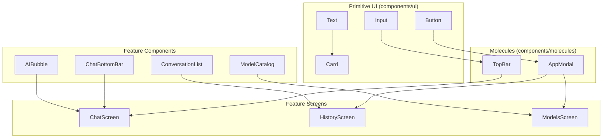
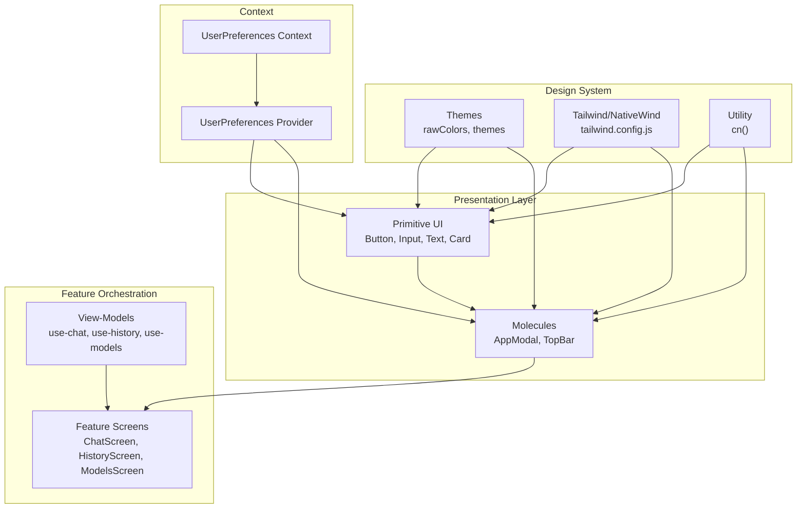
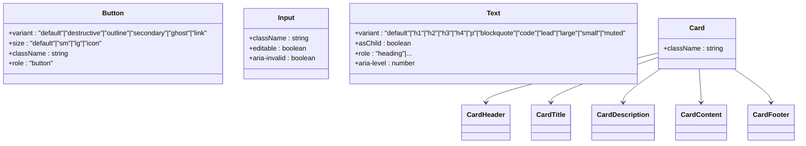
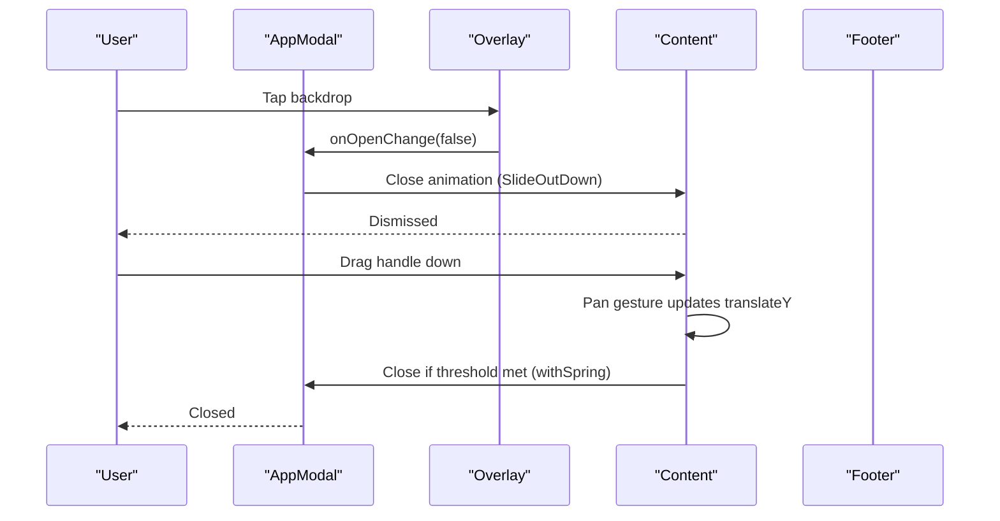
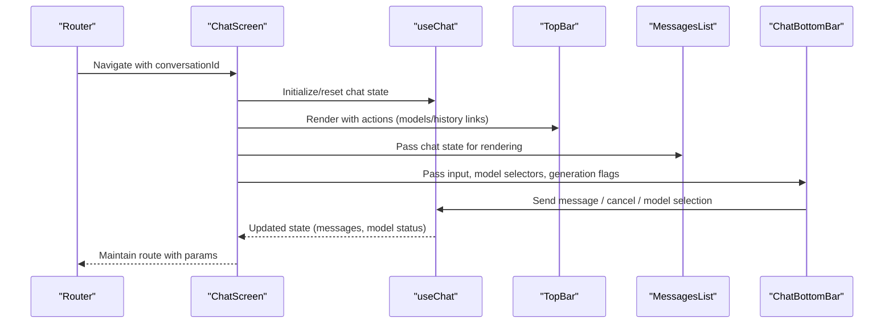
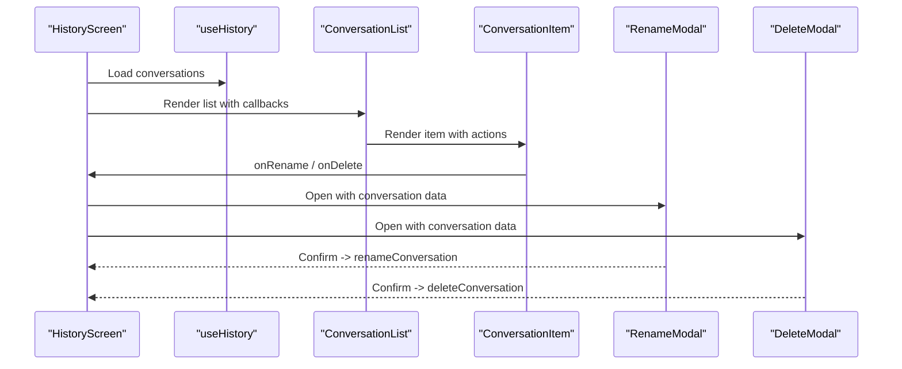
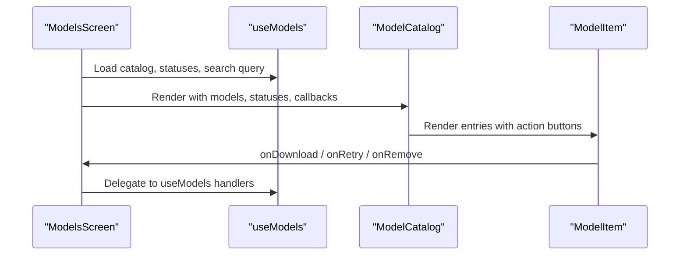
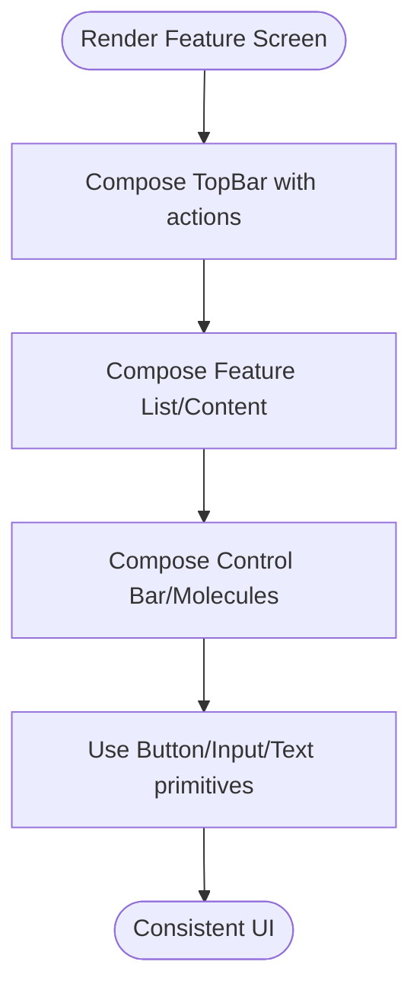
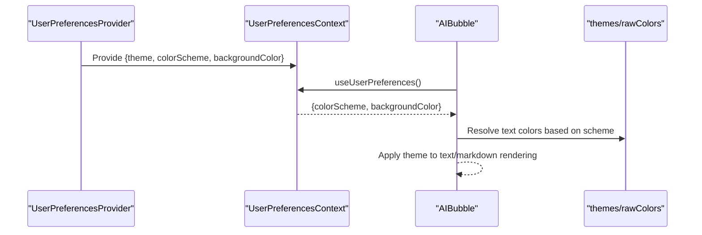
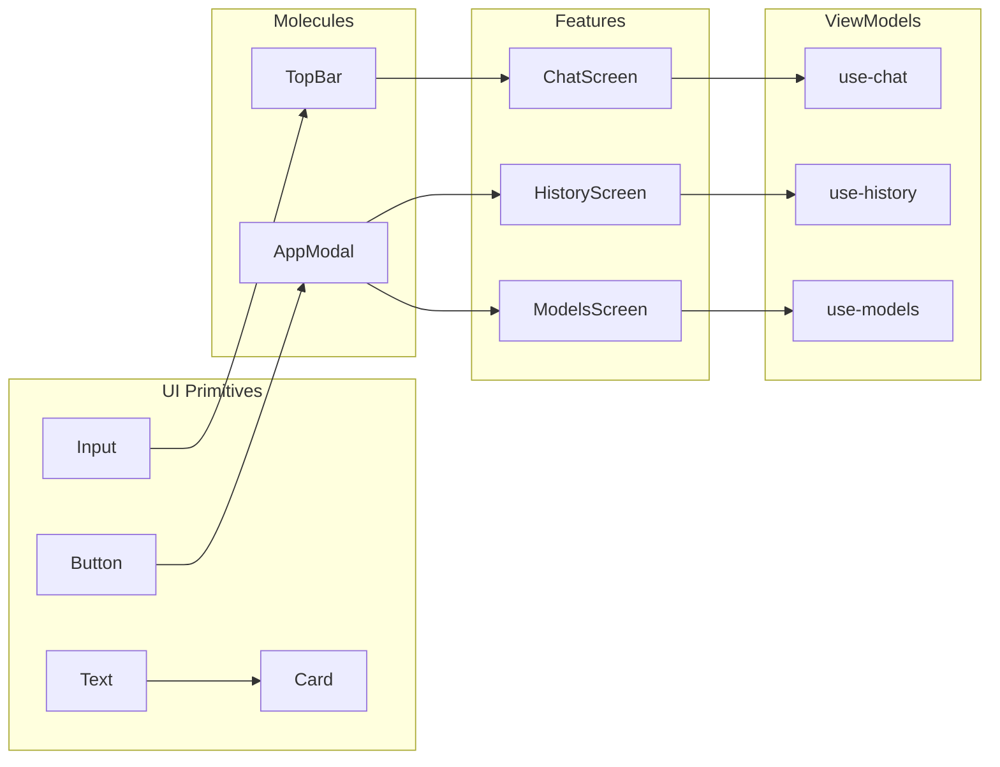

# Component Architecture and Layering

<cite>
**Referenced Files in This Document**
- [button.tsx](file://components/ui/button.tsx)
- [input.tsx](file://components/ui/input.tsx)
- [card.tsx](file://components/ui/card.tsx)
- [text.tsx](file://components/ui/text.tsx)
- [index.tsx](file://components/molecules/app-modal/index.tsx)
- [top-bar/index.tsx](file://components/top-bar/index.tsx)
- [chat-screen.tsx](file://features/chat/view/chat-screen.tsx)
- [history-screen.tsx](file://features/history/view/history-screen.tsx)
- [models-screen.tsx](file://features/model-management/view/models-screen.tsx)
- [ai-bubble.tsx](file://features/chat/components/ai-bubble.tsx)
- [chat-bottom-bar.tsx](file://features/chat/components/chat-bottom-bar.tsx)
- [conversation-list.tsx](file://features/history/components/conversation-list.tsx)
- [model-catalog.tsx](file://features/model-management/components/model-catalog.tsx)
- [context.tsx](file://context/user-preferences/context.tsx)
- [provider.tsx](file://context/user-preferences/provider.tsx)
- [themes.ts](file://lib/themes.ts)
- [tailwind.config.js](file://tailwind.config.js)
- [utils.ts](file://lib/utils.ts)
</cite>

## Table of Contents
1. [Introduction](#introduction)
2. [Project Structure](#project-structure)
3. [Core Components](#core-components)
4. [Architecture Overview](#architecture-overview)
5. [Detailed Component Analysis](#detailed-component-analysis)
6. [Dependency Analysis](#dependency-analysis)
7. [Performance Considerations](#performance-considerations)
8. [Troubleshooting Guide](#troubleshooting-guide)
9. [Conclusion](#conclusion)

## Introduction
This document explains My Shadow’s component architecture and layering strategy. The system follows a three-tier hierarchy:
- Primitive components: atomic UI elements such as buttons, inputs, and text.
- Molecule components: composed UI elements built from primitives (e.g., modals, top bars).
- Feature screens: complete application views that orchestrate molecules and domain logic.

The design system is implemented with TailwindCSS via NativeWind, ensuring consistent styling across platforms. Components are structured to separate presentation (UI) from business logic (features), using well-defined interfaces, context providers, and composition patterns. Accessibility is integrated through semantic roles and ARIA attributes where appropriate.

## Project Structure
The repository organizes components by layer and feature:
- components/ui: primitive components (button, input, card, text, etc.)
- components/molecules: molecule components (e.g., app-modal)
- components/top-bar: reusable header bar with search and actions
- features/<feature>/components: molecule-level UI for each feature
- features/<feature>/view: feature screens (complete views)
- features/<feature>/view-model: state/logic for each feature
- context/user-preferences: theme and user preference context/provider
- lib: design system utilities (themes, cn merging)

**Diagram sources**
- [button.tsx](file://components/ui/button.tsx)
- [input.tsx](file://components/ui/input.tsx)
- [text.tsx](file://components/ui/text.tsx)
- [card.tsx](file://components/ui/card.tsx)
- [index.tsx](file://components/molecules/app-modal/index.tsx)
- [top-bar/index.tsx](file://components/top-bar/index.tsx)
- [chat-screen.tsx](file://features/chat/view/chat-screen.tsx)
- [history-screen.tsx](file://features/history/view/history-screen.tsx)
- [models-screen.tsx](file://features/model-management/view/models-screen.tsx)
- [chat-bottom-bar.tsx](file://features/chat/components/chat-bottom-bar.tsx)
- [ai-bubble.tsx](file://features/chat/components/ai-bubble.tsx)
- [conversation-list.tsx](file://features/history/components/conversation-list.tsx)
- [model-catalog.tsx](file://features/model-management/components/model-catalog.tsx)

**Section sources**
- [tailwind.config.js](file://tailwind.config.js)
- [themes.ts](file://lib/themes.ts)
- [utils.ts](file://lib/utils.ts)

## Core Components
This section documents the primitive and molecule components that form the foundation of the UI layer.

- Button
  - Purpose: Base interactive element with variants and sizes.
  - Props interface: Extends Pressable props plus variant and size from CVA.
  - Accessibility: Uses role="button" and manages focus-visible rings.
  - Composition: Provides text class context for descendant text elements.

- Input
  - Purpose: Text input with platform-aware focus styles and aria-invalid support.
  - Props interface: Extends TextInput with className passthrough.
  - Accessibility: Focus-visible rings, placeholder contrast, aria-invalid borders.

- Text
  - Purpose: Semantic text with variant-based styling and role mapping.
  - Props interface: Variant props and optional asChild slot support.
  - Accessibility: Maps headings to role="heading" with aria-level.

- Card
  - Purpose: Surface container with header/title/description/content/footer slots.
  - Props interface: Extends View; provides TextClassContext for inner text.
  - Accessibility: CardTitle uses role="heading" and aria-level.

- AppModal
  - Purpose: Reusable bottom-sheet modal with overlay, drag handle, and footer controls.
  - Props interface: Root open/onOpenChange; Content portalHost; Header title; Footer cancel/confirm handlers.
  - Composition: Uses DialogPrimitive, Animated, and gesture handler for drag-to-dismiss.

- TopBar
  - Purpose: Header with title, back/search actions, and animated transitions.
  - Props interface: Title, optional back/search toggles, left/right actions, search query/change.
  - Composition: Integrates Button, Icon, Input; animates between title and search modes.

**Section sources**
- [button.tsx](file://components/ui/button.tsx)
- [input.tsx](file://components/ui/input.tsx)
- [text.tsx](file://components/ui/text.tsx)
- [card.tsx](file://components/ui/card.tsx)
- [index.tsx](file://components/molecules/app-modal/index.tsx)
- [top-bar/index.tsx](file://components/top-bar/index.tsx)

## Architecture Overview
The system enforces separation of concerns:
- UI components (primitive and molecule) handle presentation and basic interactions.
- Feature screens own navigation, routing, and lifecycle.
- View-models encapsulate business logic and state for each feature.
- Context providers supply theme and user preferences to the UI tree.

**Diagram sources**
- [button.tsx](file://components/ui/button.tsx)
- [input.tsx](file://components/ui/input.tsx)
- [text.tsx](file://components/ui/text.tsx)
- [card.tsx](file://components/ui/card.tsx)
- [index.tsx](file://components/molecules/app-modal/index.tsx)
- [top-bar/index.tsx](file://components/top-bar/index.tsx)
- [chat-screen.tsx](file://features/chat/view/chat-screen.tsx)
- [history-screen.tsx](file://features/history/view/history-screen.tsx)
- [models-screen.tsx](file://features/model-management/view/models-screen.tsx)
- [context.tsx](file://context/user-preferences/context.tsx)
- [provider.tsx](file://context/user-preferences/provider.tsx)
- [themes.ts](file://lib/themes.ts)
- [tailwind.config.js](file://tailwind.config.js)
- [utils.ts](file://lib/utils.ts)

## Detailed Component Analysis

### Primitive Components: Button, Input, Text, Card
These components define the foundational building blocks with consistent styling and behavior.

**Diagram sources**
- [button.tsx](file://components/ui/button.tsx)
- [input.tsx](file://components/ui/input.tsx)
- [text.tsx](file://components/ui/text.tsx)
- [card.tsx](file://components/ui/card.tsx)

**Section sources**
- [button.tsx](file://components/ui/button.tsx)
- [input.tsx](file://components/ui/input.tsx)
- [text.tsx](file://components/ui/text.tsx)
- [card.tsx](file://components/ui/card.tsx)

### Molecule Component: AppModal
AppModal composes primitive components into a cohesive, animated bottom sheet with drag-to-dismiss and standardized footer controls.

**Diagram sources**
- [index.tsx](file://components/molecules/app-modal/index.tsx)

**Section sources**
- [index.tsx](file://components/molecules/app-modal/index.tsx)

### Feature Screen: ChatScreen
ChatScreen orchestrates the chat UI, wiring TopBar, MessagesList, and ChatBottomBar with view-model logic.

**Diagram sources**
- [chat-screen.tsx](file://features/chat/view/chat-screen.tsx)
- [top-bar/index.tsx](file://components/top-bar/index.tsx)
- [chat-bottom-bar.tsx](file://features/chat/components/chat-bottom-bar.tsx)

**Section sources**
- [chat-screen.tsx](file://features/chat/view/chat-screen.tsx)
- [top-bar/index.tsx](file://components/top-bar/index.tsx)
- [chat-bottom-bar.tsx](file://features/chat/components/chat-bottom-bar.tsx)

### Feature Screen: HistoryScreen
HistoryScreen renders a list of conversations with inline actions and dialogs.

**Diagram sources**
- [history-screen.tsx](file://features/history/view/history-screen.tsx)
- [conversation-list.tsx](file://features/history/components/conversation-list.tsx)

**Section sources**
- [history-screen.tsx](file://features/history/view/history-screen.tsx)
- [conversation-list.tsx](file://features/history/components/conversation-list.tsx)

### Feature Screen: ModelsScreen
ModelsScreen displays a categorized model catalog and handles downloads/removal.

**Diagram sources**
- [models-screen.tsx](file://features/model-management/view/models-screen.tsx)
- [model-catalog.tsx](file://features/model-management/components/model-catalog.tsx)

**Section sources**
- [models-screen.tsx](file://features/model-management/view/models-screen.tsx)
- [model-catalog.tsx](file://features/model-management/components/model-catalog.tsx)

### Component Composition Patterns
- Primitive-to-Molecule: Button and Icon compose into TopBar actions; Input composes into TopBar search.
- Molecule-to-Feature: AppModal composes Button/Footer; ChatBottomBar composes Input, Buttons, and Selector components.
- Feature-to-Feature: ChatScreen composes TopBar, MessagesList, and ChatBottomBar; HistoryScreen composes ConversationList and Modals.

[No sources needed since this diagram shows conceptual workflow, not actual code structure]

### Accessibility Implementations
- Semantic roles and ARIA:
  - Text variant headings map to role="heading" with aria-level.
  - CardTitle uses role="heading" and aria-level for screen readers.
  - Button uses role="button" and focus-visible rings for keyboard navigation.
- Focus and gestures:
  - AppModal overlay and content manage focus and dismissal.
  - TopBar animations coordinate title and search visibility for assistive tech.

**Section sources**
- [text.tsx](file://components/ui/text.tsx)
- [card.tsx](file://components/ui/card.tsx)
- [button.tsx](file://components/ui/button.tsx)
- [index.tsx](file://components/molecules/app-modal/index.tsx)
- [top-bar/index.tsx](file://components/top-bar/index.tsx)

### Design System and Consistency
- Theme variables:
  - Centralized rawColors define HSL variables for light/dark palettes.
  - themes map rawColors to NativeWind vars for Tailwind usage.
- Tailwind configuration:
  - Tailwind scans app, components, features, and context directories.
  - Variables mapped to hsl(--color-*) tokens for consistent theming.
- Utility:
  - cn() merges classes safely using clsx and tailwind-merge.

**Section sources**
- [themes.ts](file://lib/themes.ts)
- [tailwind.config.js](file://tailwind.config.js)
- [utils.ts](file://lib/utils.ts)

### Context Providers and Loose Coupling
- UserPreferencesProvider supplies theme, color scheme, and background color to the app.
- useUserPreferences hook exposes theme-aware values to components like AIBubble for dynamic theming.
- Context enables decoupled UI components that depend only on theme tokens and preferences.

**Diagram sources**
- [provider.tsx](file://context/user-preferences/provider.tsx)
- [context.tsx](file://context/user-preferences/context.tsx)
- [themes.ts](file://lib/themes.ts)
- [ai-bubble.tsx](file://features/chat/components/ai-bubble.tsx)

**Section sources**
- [provider.tsx](file://context/user-preferences/provider.tsx)
- [context.tsx](file://context/user-preferences/context.tsx)
- [ai-bubble.tsx](file://features/chat/components/ai-bubble.tsx)

## Dependency Analysis
The following diagram highlights how feature screens depend on molecules and primitives, and how view-models integrate with UI.

**Diagram sources**
- [button.tsx](file://components/ui/button.tsx)
- [input.tsx](file://components/ui/input.tsx)
- [text.tsx](file://components/ui/text.tsx)
- [card.tsx](file://components/ui/card.tsx)
- [index.tsx](file://components/molecules/app-modal/index.tsx)
- [top-bar/index.tsx](file://components/top-bar/index.tsx)
- [chat-screen.tsx](file://features/chat/view/chat-screen.tsx)
- [history-screen.tsx](file://features/history/view/history-screen.tsx)
- [models-screen.tsx](file://features/model-management/view/models-screen.tsx)

**Section sources**
- [chat-screen.tsx](file://features/chat/view/chat-screen.tsx)
- [history-screen.tsx](file://features/history/view/history-screen.tsx)
- [models-screen.tsx](file://features/model-management/view/models-screen.tsx)

## Performance Considerations
- Memoization:
  - Feature screens wrap inner renderers in memo to prevent unnecessary re-renders.
  - ChatScreen memoizes the inner observer component.
- Animations:
  - AppModal uses react-native-reanimated for smooth drag and overlay animations.
  - TopBar uses shared values and animated styles for fluid transitions.
- Rendering lists:
  - ConversationList and ModelCatalog use FlatList for efficient virtualized rendering.
- Styling:
  - cn() merges classes efficiently; avoid excessive conditional classes in hot paths.

[No sources needed since this section provides general guidance]

## Troubleshooting Guide
- Modal does not dismiss:
  - Verify overlay press handler triggers onOpenChange and that Portal host is configured.
- Search mode not closing:
  - Ensure BackHandler clears search state and resets opacity values.
- Button focus rings not visible:
  - Confirm platform-specific focus-visible classes and role="button".
- Theme mismatch:
  - Check that NativeWind vars are applied at the root and theme names exist in themes.ts.
- Context not available:
  - Ensure UserPreferencesProvider wraps the app; useUserPreferences throws if used outside provider.

**Section sources**
- [index.tsx](file://components/molecules/app-modal/index.tsx)
- [top-bar/index.tsx](file://components/top-bar/index.tsx)
- [button.tsx](file://components/ui/button.tsx)
- [themes.ts](file://lib/themes.ts)
- [context.tsx](file://context/user-preferences/context.tsx)

## Conclusion
My Shadow’s component architecture cleanly separates presentation from business logic through a three-tier layering strategy. Primitive components provide consistent, accessible building blocks; molecules compose these primitives into reusable UI; and feature screens orchestrate molecules with view-models. The design system, powered by TailwindCSS and NativeWind, ensures visual consistency across features and platforms. Well-defined interfaces, context providers, and composition patterns foster loose coupling and strong reusability, enabling scalable development across diverse feature modules.