# Data Flow and Communication Patterns

<cite>
**Referenced Files in This Document**
- [README.md](file://README.md)
- [use-chat.ts](file://features/chat/view-model/use-chat.ts)
- [useStreamingGeneration.ts](file://features/chat/view-model/hooks/useStreamingGeneration.ts)
- [useConversation.ts](file://features/chat/view-model/hooks/useConversation.ts)
- [useModelManager.ts](file://features/chat/view-model/hooks/useModelManager.ts)
- [useVoiceInput.ts](file://features/chat/view-model/hooks/useVoiceInput.ts)
- [runtime.ts (AI)](file://shared/ai/text-generation/runtime.ts)
- [runtime.ts (Whisper)](file://shared/ai/stt/runtime.ts)
- [realtime.ts](file://shared/ai/stt/realtime.ts)
- [manager.ts](file://shared/ai/manager.ts)
- [model-loader.ts](file://shared/ai/model-loader.ts)
- [index.ts (chat db)](file://database/chat/index.ts)
- [tool-loop-executor.ts](file://shared/ai/tools/tool-loop-executor.ts)
- [registry.ts](file://shared/ai/tools/registry.ts)
- [types.ts (text-generation)](file://shared/ai/text-generation/types.ts)
</cite>

## Table of Contents
1. [Introduction](#introduction)
2. [Project Structure](#project-structure)
3. [Core Components](#core-components)
4. [Architecture Overview](#architecture-overview)
5. [Detailed Component Analysis](#detailed-component-analysis)
6. [Dependency Analysis](#dependency-analysis)
7. [Performance Considerations](#performance-considerations)
8. [Troubleshooting Guide](#troubleshooting-guide)
9. [Conclusion](#conclusion)

## Introduction
This document explains how My Shadow orchestrates user input through AI processing and response streaming, and how data flows across components and services. It covers:
- Conversation flow from user input to streamed AI responses
- Observer pattern for real-time state synchronization
- Dependency injection for shared AI modules
- Event-driven ViewModel subscriptions and reactive UI updates
- Cross-feature communication patterns
- Data persistence from ViewModels to local storage and back
- Error propagation and failure handling across component boundaries
- Streaming patterns for text generation and voice processing

## Project Structure
The application follows a layered, feature-based structure with clear separation of concerns:
- Features encapsulate domain logic (chat, history, model management)
- Shared AI modules provide runtime abstractions and tooling
- Database layer persists state with observable synchronization
- ViewModels coordinate UI state and orchestrate cross-cutting concerns

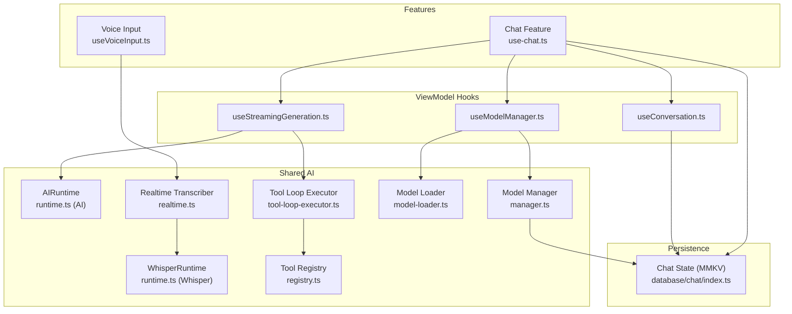

**Diagram sources**
- [use-chat.ts:1-371](file://features/chat/view-model/use-chat.ts#L1-L371)
- [useConversation.ts:1-236](file://features/chat/view-model/hooks/useConversation.ts#L1-L236)
- [useModelManager.ts:1-217](file://features/chat/view-model/hooks/useModelManager.ts#L1-L217)
- [useStreamingGeneration.ts:1-275](file://features/chat/view-model/hooks/useStreamingGeneration.ts#L1-L275)
- [useVoiceInput.ts:1-358](file://features/chat/view-model/hooks/useVoiceInput.ts#L1-L358)
- [runtime.ts (AI):1-489](file://shared/ai/text-generation/runtime.ts#L1-L489)
- [runtime.ts (Whisper):1-99](file://shared/ai/stt/runtime.ts#L1-L99)
- [realtime.ts:1-145](file://shared/ai/stt/realtime.ts#L1-L145)
- [manager.ts:1-422](file://shared/ai/manager.ts#L1-L422)
- [model-loader.ts:1-172](file://shared/ai/model-loader.ts#L1-L172)
- [index.ts (chat db):1-31](file://database/chat/index.ts#L1-L31)

**Section sources**
- [README.md:120-151](file://README.md#L120-L151)

## Core Components
- ViewModels and Hooks: Orchestrate UI state and cross-feature coordination
  - use-chat.ts: Central coordinator for chat lifecycle, error handling, and streaming
  - useConversation.ts: Manages conversation creation, message append, and titles
  - useModelManager.ts: Loads/unloads models, auto-loads last used model, exposes availability
  - useStreamingGeneration.ts: Streams tokens and reasoning chunks, manages tool loops
  - useVoiceInput.ts: Handles voice input lifecycle and integrates with STT
- Shared AI Services:
  - AIRuntime: Local GGUF inference with streaming, tool-call support, OOM fallback
  - WhisperRuntime: Local speech-to-text runtime
  - Realtime Transcriber: Starts/stops real-time transcription and emits partial/final results
  - Model Manager: Downloads, lists, removes models; tracks progress and caches
  - Model Loader: Loads/unloads models into respective runtimes; persists selection
  - Tool Loop Executor: Iterative tool execution with caching, timeouts, retries, and parallelism
  - Tool Registry: Registers tools and executes them safely
- Persistence:
  - Chat State: Observable persisted to MMKV; synchronized across UI and storage

**Section sources**
- [use-chat.ts:22-371](file://features/chat/view-model/use-chat.ts#L22-L371)
- [useConversation.ts:11-236](file://features/chat/view-model/hooks/useConversation.ts#L11-L236)
- [useModelManager.ts:14-217](file://features/chat/view-model/hooks/useModelManager.ts#L14-L217)
- [useStreamingGeneration.ts:39-164](file://features/chat/view-model/hooks/useStreamingGeneration.ts#L39-L164)
- [useVoiceInput.ts:59-358](file://features/chat/view-model/hooks/useVoiceInput.ts#L59-L358)
- [runtime.ts (AI):16-489](file://shared/ai/text-generation/runtime.ts#L16-L489)
- [runtime.ts (Whisper):5-99](file://shared/ai/stt/runtime.ts#L5-L99)
- [realtime.ts:20-145](file://shared/ai/stt/realtime.ts#L20-L145)
- [manager.ts:59-422](file://shared/ai/manager.ts#L59-L422)
- [model-loader.ts:11-172](file://shared/ai/model-loader.ts#L11-L172)
- [tool-loop-executor.ts:199-459](file://shared/ai/tools/tool-loop-executor.ts#L199-L459)
- [registry.ts:12-127](file://shared/ai/tools/registry.ts#L12-L127)
- [index.ts (chat db):7-31](file://database/chat/index.ts#L7-L31)

## Architecture Overview
The system uses a hybrid event-driven and observer-based architecture:
- ViewModels expose derived state and actions; UI subscribes via React hooks
- Observable state (LegendApp State + MMKV) propagates changes to UI and persistence
- Shared AI modules are accessed via dependency-injected singletons (getAIRuntime/getWhisperRuntime)
- Tool loop integrates model streaming with tool execution and message augmentation

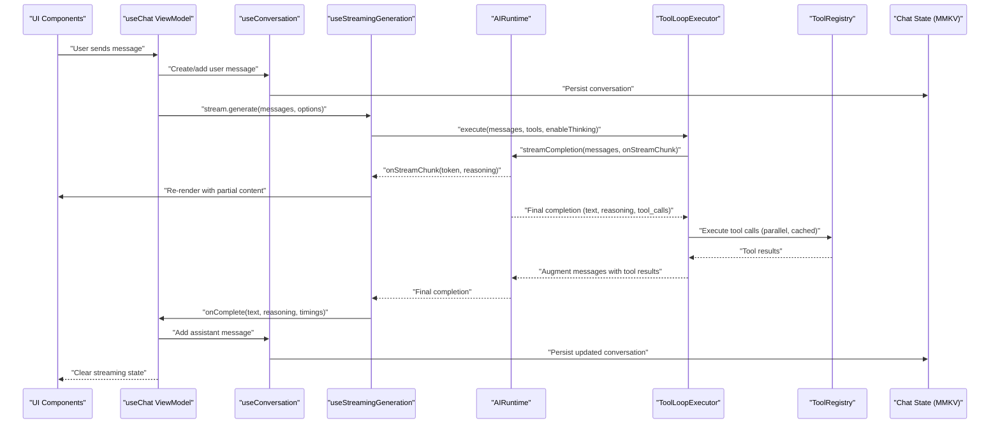

**Diagram sources**
- [use-chat.ts:101-183](file://features/chat/view-model/use-chat.ts#L101-L183)
- [useStreamingGeneration.ts:52-146](file://features/chat/view-model/hooks/useStreamingGeneration.ts#L52-L146)
- [tool-loop-executor.ts:232-459](file://shared/ai/tools/tool-loop-executor.ts#L232-L459)
- [runtime.ts (AI):256-477](file://shared/ai/text-generation/runtime.ts#L256-L477)
- [useConversation.ts:53-120](file://features/chat/view-model/hooks/useConversation.ts#L53-L120)
- [index.ts (chat db):14-31](file://database/chat/index.ts#L14-L31)

## Detailed Component Analysis

### Conversation Flow: From User Input to Streamed Response
- User input enters via the chat ViewModel, which validates content and ensures a model is ready
- The ViewModel creates or retrieves a conversation and appends the user message
- The streaming hook initiates generation, passing messages, tools, and callbacks
- The AI runtime streams tokens and reasoning, updating the streaming bubble in real time
- The tool loop executor may request tool calls; results are injected back into the conversation
- On completion, the assistant message is appended and the streaming state cleared

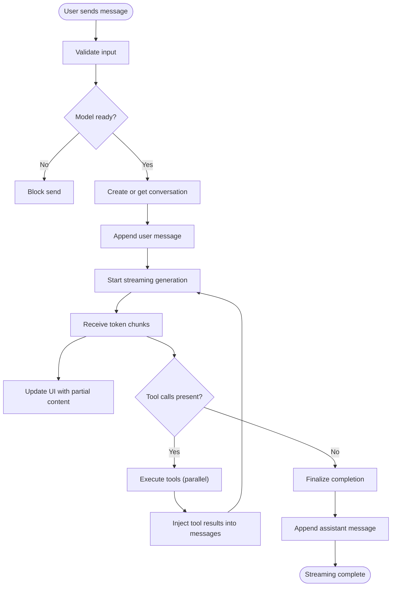

**Diagram sources**
- [use-chat.ts:101-183](file://features/chat/view-model/use-chat.ts#L101-L183)
- [useStreamingGeneration.ts:166-275](file://features/chat/view-model/hooks/useStreamingGeneration.ts#L166-L275)
- [tool-loop-executor.ts:232-459](file://shared/ai/tools/tool-loop-executor.ts#L232-L459)
- [runtime.ts (AI):256-477](file://shared/ai/text-generation/runtime.ts#L256-L477)

**Section sources**
- [use-chat.ts:101-183](file://features/chat/view-model/use-chat.ts#L101-L183)
- [useStreamingGeneration.ts:52-146](file://features/chat/view-model/hooks/useStreamingGeneration.ts#L52-L146)
- [runtime.ts (AI):256-477](file://shared/ai/text-generation/runtime.ts#L256-L477)

### Observer Pattern and State Synchronization
- Chat state is an observable persisted to MMKV, enabling reactive UI updates and persistence
- ViewModels derive computed state (e.g., displayMessages) and expose actions
- UI components subscribe to observable fields; changes propagate automatically

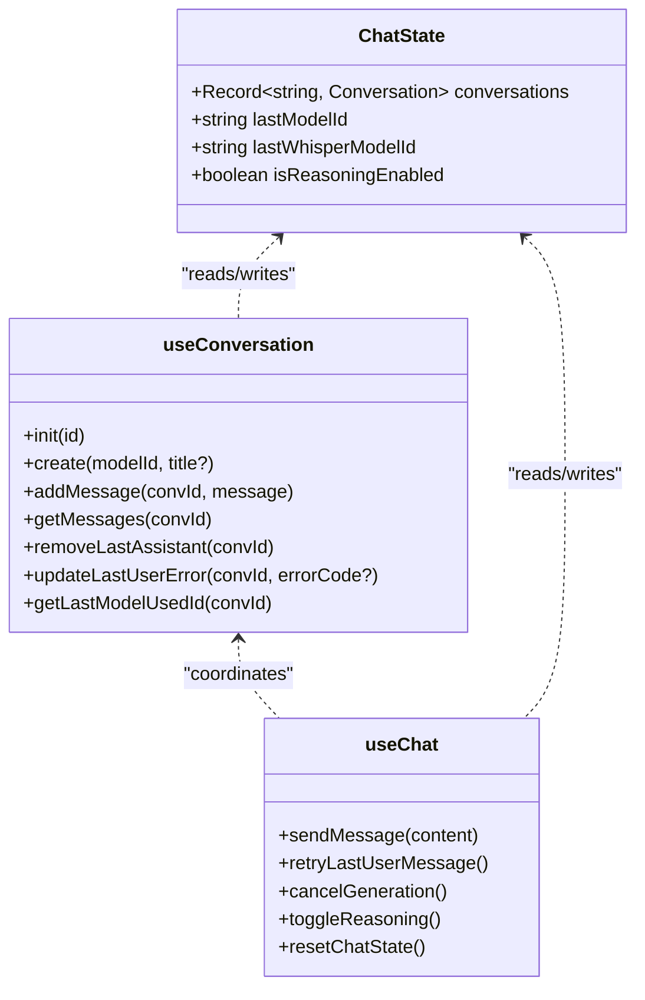

**Diagram sources**
- [index.ts (chat db):7-31](file://database/chat/index.ts#L7-L31)
- [useConversation.ts:11-236](file://features/chat/view-model/hooks/useConversation.ts#L11-L236)
- [use-chat.ts:22-371](file://features/chat/view-model/use-chat.ts#L22-L371)

**Section sources**
- [index.ts (chat db):14-31](file://database/chat/index.ts#L14-L31)
- [useConversation.ts:11-236](file://features/chat/view-model/hooks/useConversation.ts#L11-L236)
- [use-chat.ts:287-298](file://features/chat/view-model/use-chat.ts#L287-L298)

### Dependency Injection Pattern in Shared AI Modules
- Singletons provide access to AI runtimes without exposing internal implementations
- Model loader and manager abstract filesystem and runtime interactions
- This enables testability by swapping implementations behind interfaces

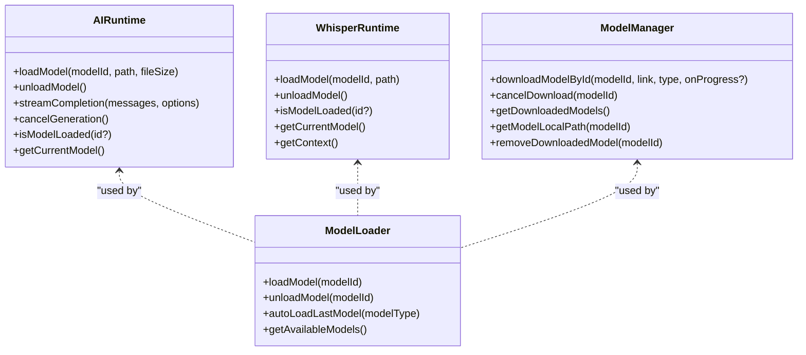

**Diagram sources**
- [runtime.ts (AI):16-489](file://shared/ai/text-generation/runtime.ts#L16-L489)
- [runtime.ts (Whisper):5-99](file://shared/ai/stt/runtime.ts#L5-L99)
- [model-loader.ts:11-172](file://shared/ai/model-loader.ts#L11-L172)
- [manager.ts:59-422](file://shared/ai/manager.ts#L59-L422)

**Section sources**
- [runtime.ts (AI):486-489](file://shared/ai/text-generation/runtime.ts#L486-L489)
- [runtime.ts (Whisper):83-99](file://shared/ai/stt/runtime.ts#L83-L99)
- [model-loader.ts:11-172](file://shared/ai/model-loader.ts#L11-L172)
- [manager.ts:59-422](file://shared/ai/manager.ts#L59-L422)

### Event-Driven Architecture and Reactive UI Updates
- ViewModels subscribe to observable state and expose derived props/actions
- UI components render based on observable snapshots and re-render on changes
- Events flow from AI runtime callbacks to streaming hook to ViewModel to persistence

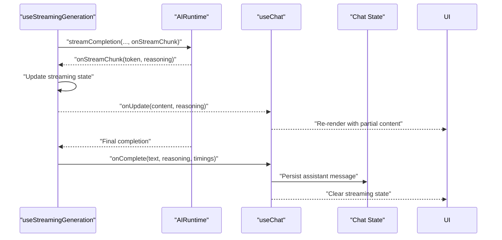

**Diagram sources**
- [useStreamingGeneration.ts:210-232](file://features/chat/view-model/hooks/useStreamingGeneration.ts#L210-L232)
- [runtime.ts (AI):300-378](file://shared/ai/text-generation/runtime.ts#L300-L378)
- [use-chat.ts:133-156](file://features/chat/view-model/use-chat.ts#L133-L156)
- [index.ts (chat db):14-31](file://database/chat/index.ts#L14-L31)

**Section sources**
- [useStreamingGeneration.ts:166-275](file://features/chat/view-model/hooks/useStreamingGeneration.ts#L166-L275)
- [use-chat.ts:133-156](file://features/chat/view-model/use-chat.ts#L133-L156)

### Cross-Feature Communication Patterns
- Chat ViewModel coordinates with Model Manager and Conversation Store
- Voice input integrates with STT runtime and can feed text into chat
- Tool registry is shared globally to enable tool use across generations

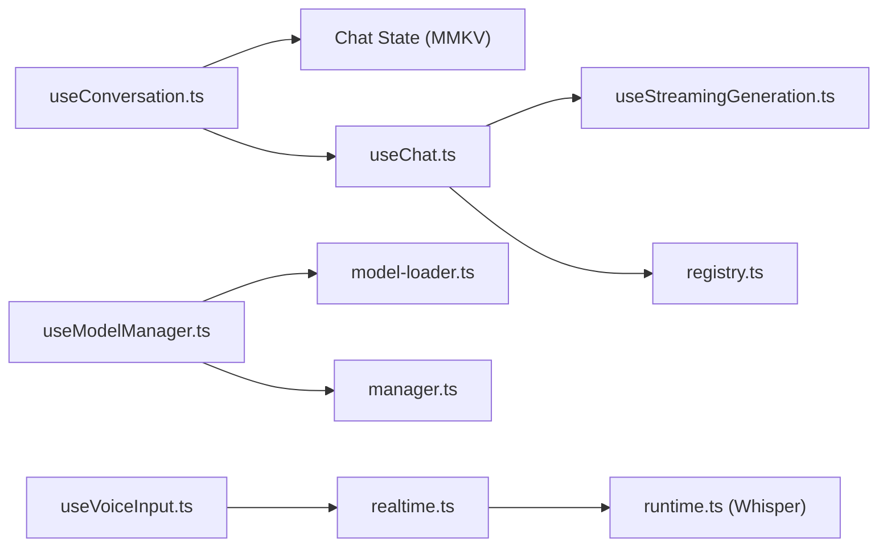

**Diagram sources**
- [useConversation.ts:11-236](file://features/chat/view-model/hooks/useConversation.ts#L11-L236)
- [useModelManager.ts:14-217](file://features/chat/view-model/hooks/useModelManager.ts#L14-L217)
- [model-loader.ts:11-172](file://shared/ai/model-loader.ts#L11-L172)
- [manager.ts:59-422](file://shared/ai/manager.ts#L59-L422)
- [use-chat.ts:22-371](file://features/chat/view-model/use-chat.ts#L22-L371)
- [useStreamingGeneration.ts:39-164](file://features/chat/view-model/hooks/useStreamingGeneration.ts#L39-L164)
- [registry.ts:12-127](file://shared/ai/tools/registry.ts#L12-L127)
- [useVoiceInput.ts:59-358](file://features/chat/view-model/hooks/useVoiceInput.ts#L59-L358)
- [realtime.ts:20-145](file://shared/ai/stt/realtime.ts#L20-L145)
- [runtime.ts (Whisper):5-99](file://shared/ai/stt/runtime.ts#L5-L99)

**Section sources**
- [use-chat.ts:14-15](file://features/chat/view-model/use-chat.ts#L14-L15)
- [useVoiceInput.ts:207-228](file://features/chat/view-model/hooks/useVoiceInput.ts#L207-L228)

### Data Persistence Flow: ViewModels → Local Database → UI
- Conversations and model selections are stored in an observable persisted to MMKV
- UI reacts to changes in observable state; persistence is transparent

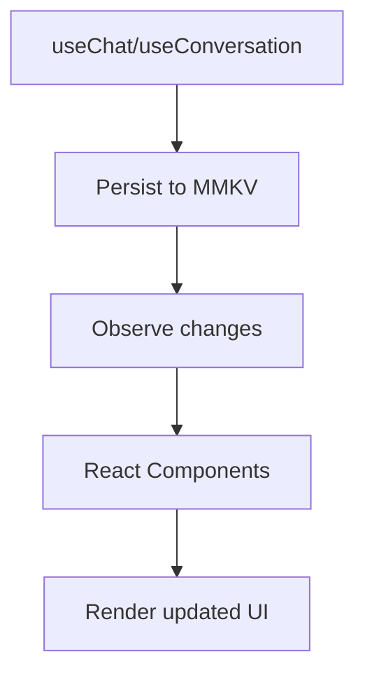

**Diagram sources**
- [index.ts (chat db):14-31](file://database/chat/index.ts#L14-L31)
- [useConversation.ts:53-120](file://features/chat/view-model/hooks/useConversation.ts#L53-L120)
- [use-chat.ts:138-156](file://features/chat/view-model/use-chat.ts#L138-L156)

**Section sources**
- [index.ts (chat db):14-31](file://database/chat/index.ts#L14-L31)

### Error Propagation and Failure Handling
- Generation errors are captured and surfaced to the ViewModel; partial content may be saved for ABORTED or error cases
- Tool loop handles transient vs non-transient errors with retries and caching
- Memory-related failures trigger OOM detection and automatic fallback

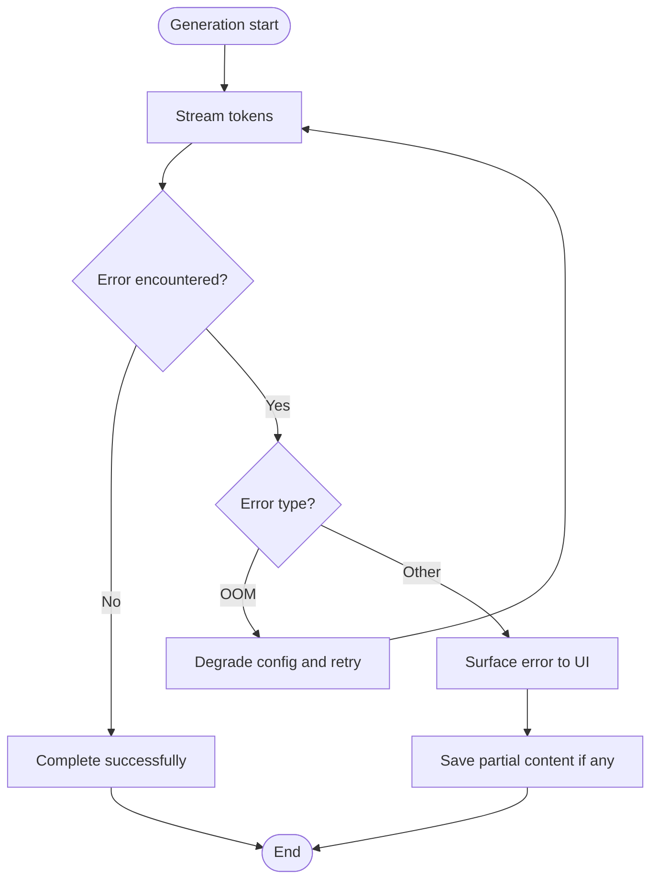

**Diagram sources**
- [use-chat.ts:34-83](file://features/chat/view-model/use-chat.ts#L34-L83)
- [runtime.ts (AI):444-477](file://shared/ai/text-generation/runtime.ts#L444-L477)
- [tool-loop-executor.ts:712-731](file://shared/ai/tools/tool-loop-executor.ts#L712-L731)

**Section sources**
- [use-chat.ts:34-83](file://features/chat/view-model/use-chat.ts#L34-L83)
- [runtime.ts (AI):444-477](file://shared/ai/text-generation/runtime.ts#L444-L477)

### Streaming Data Patterns: Text Generation and Voice Processing
- Text generation streams token and reasoning chunks; UI updates incrementally
- Voice input streams partial transcripts and transitions to final result; optional model download prompt appears when no model is loaded

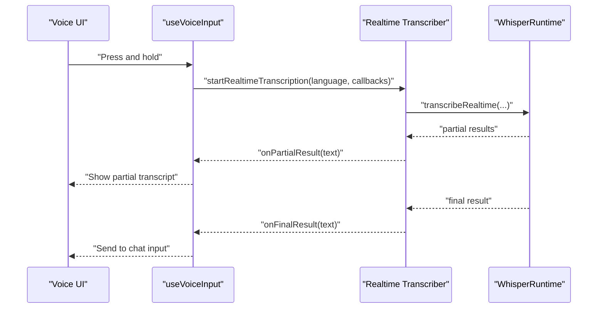

**Diagram sources**
- [useVoiceInput.ts:185-247](file://features/chat/view-model/hooks/useVoiceInput.ts#L185-L247)
- [realtime.ts:24-99](file://shared/ai/stt/realtime.ts#L24-L99)
- [runtime.ts (Whisper):20-54](file://shared/ai/stt/runtime.ts#L20-L54)

**Section sources**
- [useVoiceInput.ts:185-247](file://features/chat/view-model/hooks/useVoiceInput.ts#L185-L247)
- [realtime.ts:24-99](file://shared/ai/stt/realtime.ts#L24-L99)

## Dependency Analysis
- Coupling and Cohesion
  - ViewModels encapsulate feature logic and minimize coupling to runtime internals
  - Shared AI modules are accessed via singletons, enabling loose coupling and testability
- External Dependencies
  - llama.rn and whisper.rn provide native inference and STT
  - MMKV persists observable state
- Potential Circular Dependencies
  - None observed; dependencies flow from ViewModels → Shared AI → Persistence

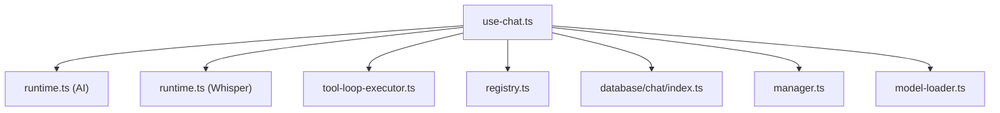

**Diagram sources**
- [use-chat.ts:1-12](file://features/chat/view-model/use-chat.ts#L1-L12)
- [runtime.ts (AI):1-12](file://shared/ai/text-generation/runtime.ts#L1-L12)
- [runtime.ts (Whisper):1-3](file://shared/ai/stt/runtime.ts#L1-L3)
- [tool-loop-executor.ts:1-6](file://shared/ai/tools/tool-loop-executor.ts#L1-L6)
- [registry.ts:1-8](file://shared/ai/tools/registry.ts#L1-L8)
- [index.ts (chat db):1-6](file://database/chat/index.ts#L1-L6)
- [manager.ts:1-9](file://shared/ai/manager.ts#L1-L9)
- [model-loader.ts:1-9](file://shared/ai/model-loader.ts#L1-L9)

**Section sources**
- [use-chat.ts:1-12](file://features/chat/view-model/use-chat.ts#L1-L12)
- [runtime.ts (AI):1-12](file://shared/ai/text-generation/runtime.ts#L1-L12)
- [runtime.ts (Whisper):1-3](file://shared/ai/stt/runtime.ts#L1-L3)
- [tool-loop-executor.ts:1-6](file://shared/ai/tools/tool-loop-executor.ts#L1-L6)
- [registry.ts:1-8](file://shared/ai/tools/registry.ts#L1-L8)
- [index.ts (chat db):1-6](file://database/chat/index.ts#L1-L6)
- [manager.ts:1-9](file://shared/ai/manager.ts#L1-L9)
- [model-loader.ts:1-9](file://shared/ai/model-loader.ts#L1-L9)

## Performance Considerations
- Streaming minimizes perceived latency by rendering incremental tokens and reasoning
- Tool loop parallelism and caching reduce repeated computation cost
- OOM detection and automatic context degradation improve reliability
- Model auto-load optimizes startup by resuming last-used model

[No sources needed since this section provides general guidance]

## Troubleshooting Guide
- Generation errors
  - ABORTED: Partial content may be saved; UI clears streaming state
  - OTHER: Error propagated to ViewModel; UI displays error bubble if partial content exists
- Tool execution errors
  - Retries and caching mitigate transient failures; non-transient errors halt loop based on strategy
- Memory pressure
  - OOM detection halves context size and retries once automatically
- Voice input
  - Permission denied or NOT_READY triggers appropriate prompts and error messaging

**Section sources**
- [use-chat.ts:34-83](file://features/chat/view-model/use-chat.ts#L34-L83)
- [tool-loop-executor.ts:712-731](file://shared/ai/tools/tool-loop-executor.ts#L712-L731)
- [runtime.ts (AI):444-477](file://shared/ai/text-generation/runtime.ts#L444-L477)
- [useVoiceInput.ts:101-131](file://features/chat/view-model/hooks/useVoiceInput.ts#L101-L131)

## Conclusion
My Shadow’s architecture cleanly separates concerns across ViewModels, shared AI services, and persistence. The observer pattern and dependency injection enable modular, testable code and reactive UI updates. The streaming and tool loop patterns deliver responsive, reliable AI experiences, while robust error handling and memory safeguards improve resilience.