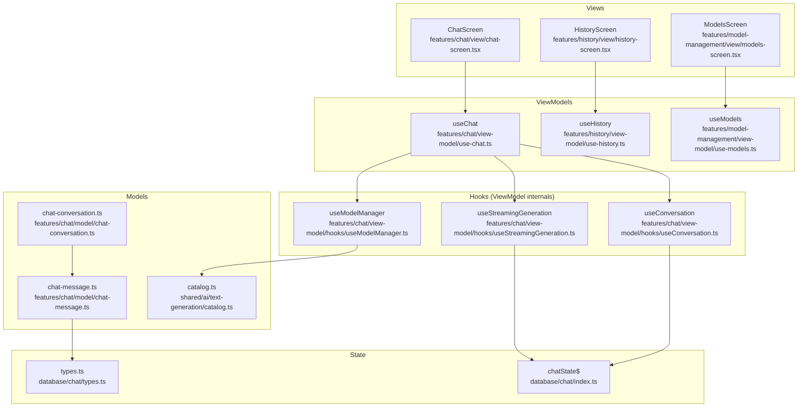
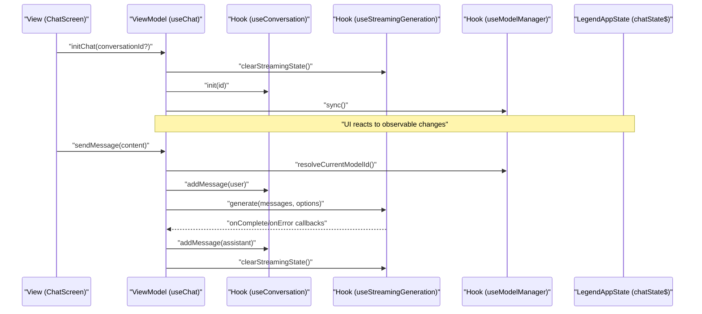
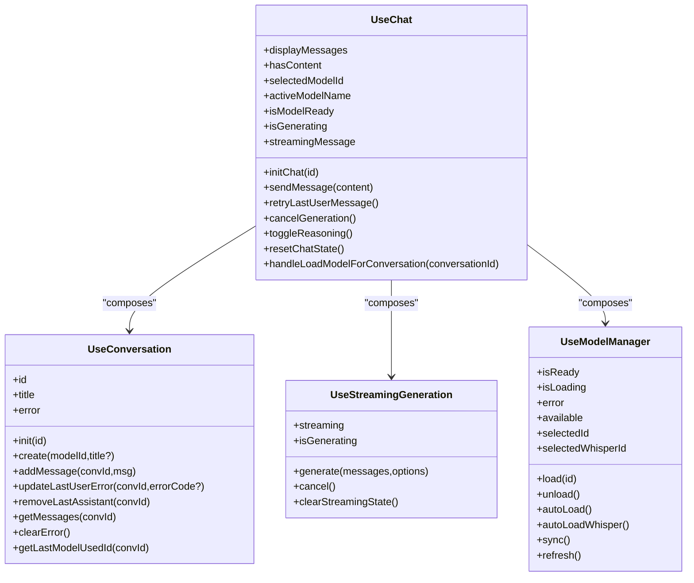
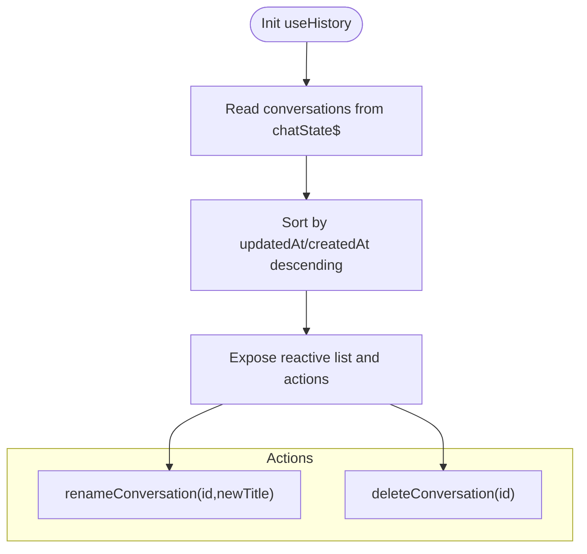
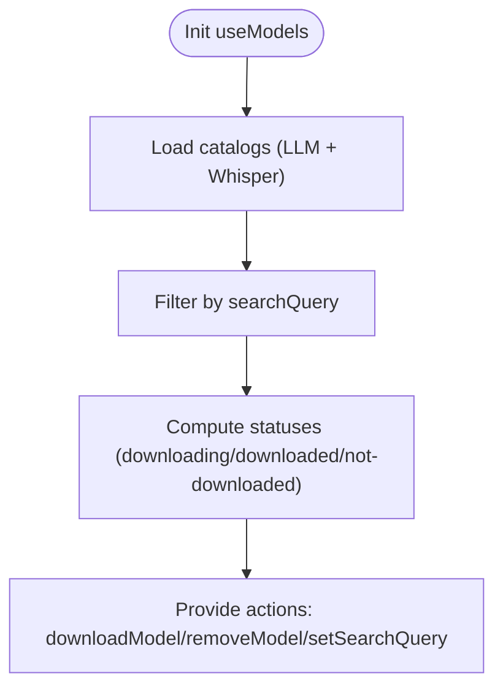
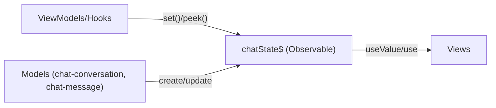
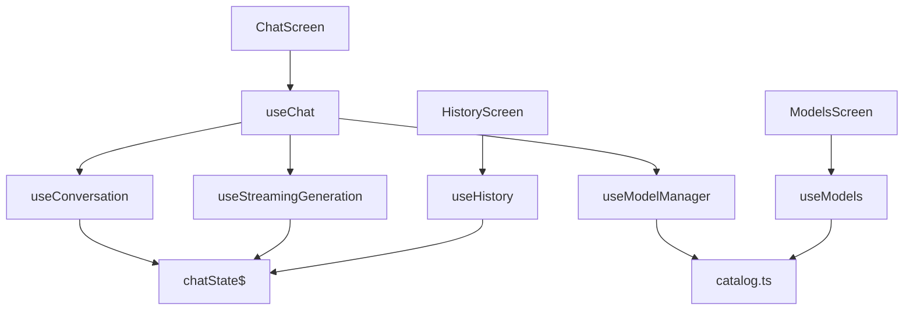

# Design Patterns and MVVM Implementation

<cite>
**Referenced Files in This Document**
- [use-chat.ts](file://features/chat/view-model/use-chat.ts)
- [use-history.ts](file://features/history/view-model/use-history.ts)
- [use-models.ts](file://features/model-management/view-model/use-models.ts)
- [useConversation.ts](file://features/chat/view-model/hooks/useConversation.ts)
- [useStreamingGeneration.ts](file://features/chat/view-model/hooks/useStreamingGeneration.ts)
- [useModelManager.ts](file://features/chat/view-model/hooks/useModelManager.ts)
- [chat-screen.tsx](file://features/chat/view/chat-screen.tsx)
- [history-screen.tsx](file://features/history/view/history-screen.tsx)
- [models-screen.tsx](file://features/model-management/view/models-screen.tsx)
- [index.ts](file://database/chat/index.ts)
- [types.ts](file://database/chat/types.ts)
- [chat-conversation.ts](file://features/chat/model/chat-conversation.ts)
- [chat-message.ts](file://features/chat/model/chat-message.ts)
- [catalog.ts](file://shared/ai/text-generation/catalog.ts)
</cite>

## Table of Contents
1. [Introduction](#introduction)
2. [Project Structure](#project-structure)
3. [Core Components](#core-components)
4. [Architecture Overview](#architecture-overview)
5. [Detailed Component Analysis](#detailed-component-analysis)
6. [Dependency Analysis](#dependency-analysis)
7. [Performance Considerations](#performance-considerations)
8. [Troubleshooting Guide](#troubleshooting-guide)
9. [Conclusion](#conclusion)

## Introduction
This document explains My Shadow’s MVVM (Model-View-ViewModel) pattern implementation. It details how the architecture separates concerns:
- Views (React components) render UI and delegate user actions to ViewModels.
- ViewModels orchestrate state, coordinate business logic, and expose reactive bindings to Views.
- Models encapsulate business logic and data structures, often interacting with shared services.

We focus on three key ViewModels:
- Chat ViewModel: manages conversation lifecycle, streaming generation, and model selection.
- History ViewModel: manages conversation listing and metadata mutations.
- Models ViewModel: manages model catalog, downloads, and statuses.

We also explain how LegendAppState observables power reactive UI updates, how business logic is separated from presentation, and how the MVVM pattern supports feature-driven encapsulation.

## Project Structure
The MVVM implementation is organized by feature:
- features/chat/view-model: Chat ViewModel and supporting hooks.
- features/history/view-model: History ViewModel.
- features/model-management/view-model: Models ViewModel.
- database/chat: Shared observable state for conversations and preferences.
- features/chat/model: Business logic for conversation/message creation.
- shared/ai: Shared services for model catalogs, runtime, and tooling.

**Diagram sources**
- [chat-screen.tsx:14-147](file://features/chat/view/chat-screen.tsx#L14-L147)
- [history-screen.tsx:23-152](file://features/history/view/history-screen.tsx#L23-L152)
- [models-screen.tsx:8-77](file://features/model-management/view/models-screen.tsx#L8-L77)
- [use-chat.ts:22-370](file://features/chat/view-model/use-chat.ts#L22-L370)
- [use-history.ts:7-93](file://features/history/view-model/use-history.ts#L7-L93)
- [use-models.ts:20-207](file://features/model-management/view-model/use-models.ts#L20-L207)
- [useConversation.ts:11-235](file://features/chat/view-model/hooks/useConversation.ts#L11-L235)
- [useStreamingGeneration.ts:39-164](file://features/chat/view-model/hooks/useStreamingGeneration.ts#L39-L164)
- [useModelManager.ts:14-216](file://features/chat/view-model/hooks/useModelManager.ts#L14-L216)
- [chat-conversation.ts:12-44](file://features/chat/model/chat-conversation.ts#L12-L44)
- [chat-message.ts:5-37](file://features/chat/model/chat-message.ts#L5-L37)
- [catalog.ts:317-329](file://shared/ai/text-generation/catalog.ts#L317-L329)
- [index.ts:14-30](file://database/chat/index.ts#L14-L30)
- [types.ts:5-30](file://database/chat/types.ts#L5-L30)

**Section sources**
- [use-chat.ts:22-370](file://features/chat/view-model/use-chat.ts#L22-L370)
- [use-history.ts:7-93](file://features/history/view-model/use-history.ts#L7-L93)
- [use-models.ts:20-207](file://features/model-management/view-model/use-models.ts#L20-L207)
- [chat-screen.tsx:14-147](file://features/chat/view/chat-screen.tsx#L14-L147)
- [history-screen.tsx:23-152](file://features/history/view/history-screen.tsx#L23-L152)
- [models-screen.tsx:8-77](file://features/model-management/view/models-screen.tsx#L8-L77)
- [index.ts:14-30](file://database/chat/index.ts#L14-L30)
- [types.ts:5-30](file://database/chat/types.ts#L5-L30)
- [chat-conversation.ts:12-44](file://features/chat/model/chat-conversation.ts#L12-L44)
- [chat-message.ts:5-37](file://features/chat/model/chat-message.ts#L5-L37)
- [catalog.ts:317-329](file://shared/ai/text-generation/catalog.ts#L317-L329)

## Core Components
- Chat ViewModel (useChat): Composes useConversation, useStreamingGeneration, and useModelManager to coordinate sending messages, managing streaming, and controlling model readiness. It exposes reactive bindings for UI and orchestrates tool execution via a shared registry.
- History ViewModel (useHistory): Provides a reactive, sorted list of conversations and mutation actions (rename, delete) backed by LegendAppState observables.
- Models ViewModel (useModels): Manages model catalog filtering, download/remove operations, and status computation for UI rendering.

These ViewModels isolate presentation logic from business logic and shared services, enabling testability and feature encapsulation.

**Section sources**
- [use-chat.ts:22-370](file://features/chat/view-model/use-chat.ts#L22-L370)
- [use-history.ts:7-93](file://features/history/view-model/use-history.ts#L7-L93)
- [use-models.ts:20-207](file://features/model-management/view-model/use-models.ts#L20-L207)

## Architecture Overview
The MVVM architecture in My Shadow follows a clear separation:
- Views depend on ViewModels via React hooks.
- ViewModels depend on hooks (internal ViewModels) and shared services.
- Hooks manage observable state and encapsulate domain-specific logic.
- Shared services provide catalogs, runtime, and tool registries.

**Diagram sources**
- [chat-screen.tsx:24-53](file://features/chat/view/chat-screen.tsx#L24-L53)
- [use-chat.ts:85-183](file://features/chat/view-model/use-chat.ts#L85-L183)
- [useConversation.ts:16-51](file://features/chat/view-model/hooks/useConversation.ts#L16-L51)
- [useStreamingGeneration.ts:52-146](file://features/chat/view-model/hooks/useStreamingGeneration.ts#L52-L146)
- [useModelManager.ts:152-170](file://features/chat/view-model/hooks/useModelManager.ts#L152-L170)
- [index.ts:14-30](file://database/chat/index.ts#L14-L30)

## Detailed Component Analysis

### Chat ViewModel (useChat)
Responsibilities:
- Compose child hooks: conversation, streaming generation, and model manager.
- Validate input, create messages, and manage conversation lifecycle.
- Coordinate streaming generation with tool execution and partial results.
- Expose reactive UI bindings: conversationId, title, messages, model readiness, and streaming state.
- Toggle reasoning mode and reset chat state.

Key behaviors:
- Conversation management: create, add messages, update last user error, retry last user message, remove last assistant response.
- Streaming generation: initialize a streaming assistant message, update content progressively, finalize on completion, and handle errors.
- Model management: resolve current model, auto-load models, and sync with runtime.
- Tool execution: register tools globally and forward tool calls to the registry.

**Diagram sources**
- [use-chat.ts:22-370](file://features/chat/view-model/use-chat.ts#L22-L370)
- [useConversation.ts:11-235](file://features/chat/view-model/hooks/useConversation.ts#L11-L235)
- [useStreamingGeneration.ts:39-164](file://features/chat/view-model/hooks/useStreamingGeneration.ts#L39-L164)
- [useModelManager.ts:14-216](file://features/chat/view-model/hooks/useModelManager.ts#L14-L216)

**Section sources**
- [use-chat.ts:22-370](file://features/chat/view-model/use-chat.ts#L22-L370)
- [useConversation.ts:11-235](file://features/chat/view-model/hooks/useConversation.ts#L11-L235)
- [useStreamingGeneration.ts:39-164](file://features/chat/view-model/hooks/useStreamingGeneration.ts#L39-L164)
- [useModelManager.ts:14-216](file://features/chat/view-model/hooks/useModelManager.ts#L14-L216)

### History ViewModel (useHistory)
Responsibilities:
- Provide a reactive, sorted list of conversations based on updatedAt/createdAt.
- Support renaming and deleting conversations with user feedback.
- Mutate the shared observable state safely and reactively.

**Diagram sources**
- [use-history.ts:7-93](file://features/history/view-model/use-history.ts#L7-L93)
- [index.ts:14-30](file://database/chat/index.ts#L14-L30)

**Section sources**
- [use-history.ts:7-93](file://features/history/view-model/use-history.ts#L7-L93)
- [index.ts:14-30](file://database/chat/index.ts#L14-L30)

### Models ViewModel (useModels)
Responsibilities:
- Build a unified catalog from LLM and Whisper models.
- Filter models by search query.
- Track download/remove progress and compute per-item statuses.
- Trigger reloads after operations.

**Diagram sources**
- [use-models.ts:20-207](file://features/model-management/view-model/use-models.ts#L20-L207)
- [catalog.ts:317-329](file://shared/ai/text-generation/catalog.ts#L317-L329)

**Section sources**
- [use-models.ts:20-207](file://features/model-management/view-model/use-models.ts#L20-L207)
- [catalog.ts:317-329](file://shared/ai/text-generation/catalog.ts#L317-L329)

### Reactive State with LegendAppState
- chatState$ is an observable containing conversations, last model IDs, and reasoning flag persisted to storage.
- Views subscribe to reactive values via @legendapp/state/react and update automatically when state changes.
- Hooks mutate chatState$ immutably to trigger UI updates.

**Diagram sources**
- [index.ts:14-30](file://database/chat/index.ts#L14-L30)
- [types.ts:5-30](file://database/chat/types.ts#L5-L30)
- [chat-conversation.ts:12-23](file://features/chat/model/chat-conversation.ts#L12-L23)
- [chat-message.ts:5-21](file://features/chat/model/chat-message.ts#L5-L21)

**Section sources**
- [index.ts:14-30](file://database/chat/index.ts#L14-L30)
- [types.ts:5-30](file://database/chat/types.ts#L5-L30)
- [chat-conversation.ts:12-23](file://features/chat/model/chat-conversation.ts#L12-L23)
- [chat-message.ts:5-21](file://features/chat/model/chat-message.ts#L5-L21)

### Feature Encapsulation and Testability
- Each feature’s state and logic are encapsulated within its ViewModel and hooks.
- Business logic is separated from presentation:
  - useConversation handles conversation persistence and mutation.
  - useStreamingGeneration coordinates streaming and tool loops.
  - useModelManager interacts with runtime and catalogs.
- Mocking is facilitated by isolating shared service dependencies behind small, focused APIs exposed by hooks.

**Section sources**
- [use-chat.ts:22-370](file://features/chat/view-model/use-chat.ts#L22-L370)
- [useConversation.ts:11-235](file://features/chat/view-model/hooks/useConversation.ts#L11-L235)
- [useStreamingGeneration.ts:39-164](file://features/chat/view-model/hooks/useStreamingGeneration.ts#L39-L164)
- [useModelManager.ts:14-216](file://features/chat/view-model/hooks/useModelManager.ts#L14-L216)

## Dependency Analysis
- Views depend on ViewModels via React hooks.
- ViewModels depend on internal hooks and shared services.
- Internal hooks depend on LegendAppState and model factories.
- Shared services provide catalogs and runtime integrations.

**Diagram sources**
- [chat-screen.tsx:14-147](file://features/chat/view/chat-screen.tsx#L14-L147)
- [history-screen.tsx:23-152](file://features/history/view/history-screen.tsx#L23-L152)
- [models-screen.tsx:8-77](file://features/model-management/view/models-screen.tsx#L8-L77)
- [use-chat.ts:22-370](file://features/chat/view-model/use-chat.ts#L22-L370)
- [use-history.ts:7-93](file://features/history/view-model/use-history.ts#L7-L93)
- [use-models.ts:20-207](file://features/model-management/view-model/use-models.ts#L20-L207)
- [useConversation.ts:11-235](file://features/chat/view-model/hooks/useConversation.ts#L11-L235)
- [useStreamingGeneration.ts:39-164](file://features/chat/view-model/hooks/useStreamingGeneration.ts#L39-L164)
- [useModelManager.ts:14-216](file://features/chat/view-model/hooks/useModelManager.ts#L14-L216)
- [index.ts:14-30](file://database/chat/index.ts#L14-L30)
- [catalog.ts:317-329](file://shared/ai/text-generation/catalog.ts#L317-L329)

**Section sources**
- [chat-screen.tsx:14-147](file://features/chat/view/chat-screen.tsx#L14-L147)
- [history-screen.tsx:23-152](file://features/history/view/history-screen.tsx#L23-L152)
- [models-screen.tsx:8-77](file://features/model-management/view/models-screen.tsx#L8-L77)
- [use-chat.ts:22-370](file://features/chat/view-model/use-chat.ts#L22-L370)
- [use-history.ts:7-93](file://features/history/view-model/use-history.ts#L7-L93)
- [use-models.ts:20-207](file://features/model-management/view-model/use-models.ts#L20-L207)
- [useConversation.ts:11-235](file://features/chat/view-model/hooks/useConversation.ts#L11-L235)
- [useStreamingGeneration.ts:39-164](file://features/chat/view-model/hooks/useStreamingGeneration.ts#L39-L164)
- [useModelManager.ts:14-216](file://features/chat/view-model/hooks/useModelManager.ts#L14-L216)
- [index.ts:14-30](file://database/chat/index.ts#L14-L30)
- [catalog.ts:317-329](file://shared/ai/text-generation/catalog.ts#L317-L329)

## Performance Considerations
- Streaming updates are incremental and avoid unnecessary re-renders by updating only the streaming message reference.
- Memoization is used extensively in ViewModels to prevent recomputation and to stabilize prop references for child components.
- Filtering and status computations are optimized via useMemo and derived state.
- Tool loop execution limits concurrency and caching to balance responsiveness and resource usage.

[No sources needed since this section provides general guidance]

## Troubleshooting Guide
Common scenarios and where to look:
- Generation errors during streaming: handled in the Chat ViewModel’s error handler, which decides whether to append partial content or update the last user error.
- Model loading failures: surfaced via the Model Manager hook and exposed to the UI through error state.
- Conversation mutations: ensure mutations occur via the Conversation hook to preserve immutability and observable updates.

**Section sources**
- [use-chat.ts:34-83](file://features/chat/view-model/use-chat.ts#L34-L83)
- [useModelManager.ts:32-95](file://features/chat/view-model/hooks/useModelManager.ts#L32-L95)
- [useConversation.ts:53-120](file://features/chat/view-model/hooks/useConversation.ts#L53-L120)

## Conclusion
My Shadow’s MVVM implementation cleanly separates concerns:
- Views remain presentation-focused and declarative.
- ViewModels orchestrate state and business logic while exposing reactive bindings.
- Hooks encapsulate domain-specific logic and observable mutations.
- Shared services provide reusable capabilities for catalogs, runtime, and tooling.

This design improves testability, maintainability, and feature encapsulation, enabling robust, reactive UIs powered by LegendAppState observables.