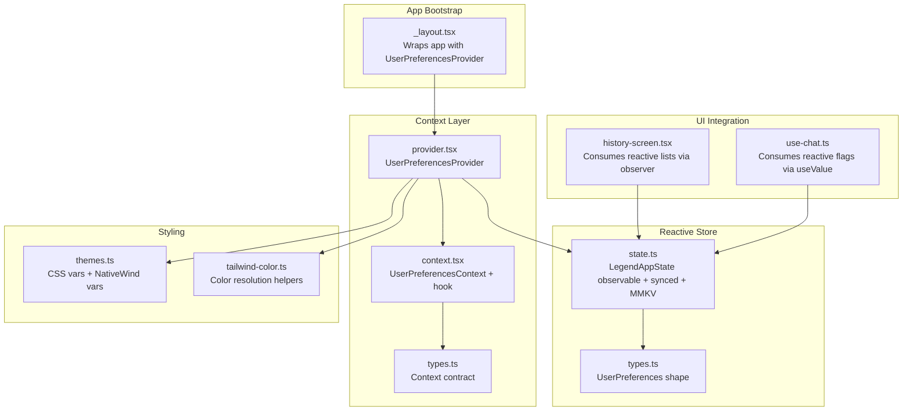
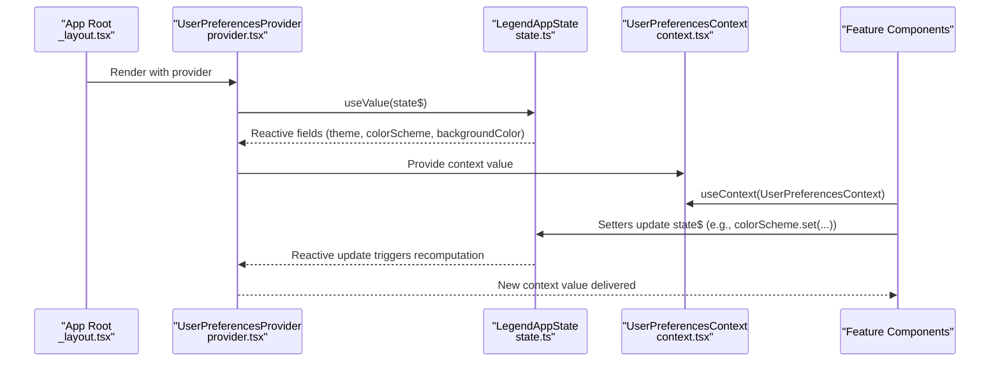
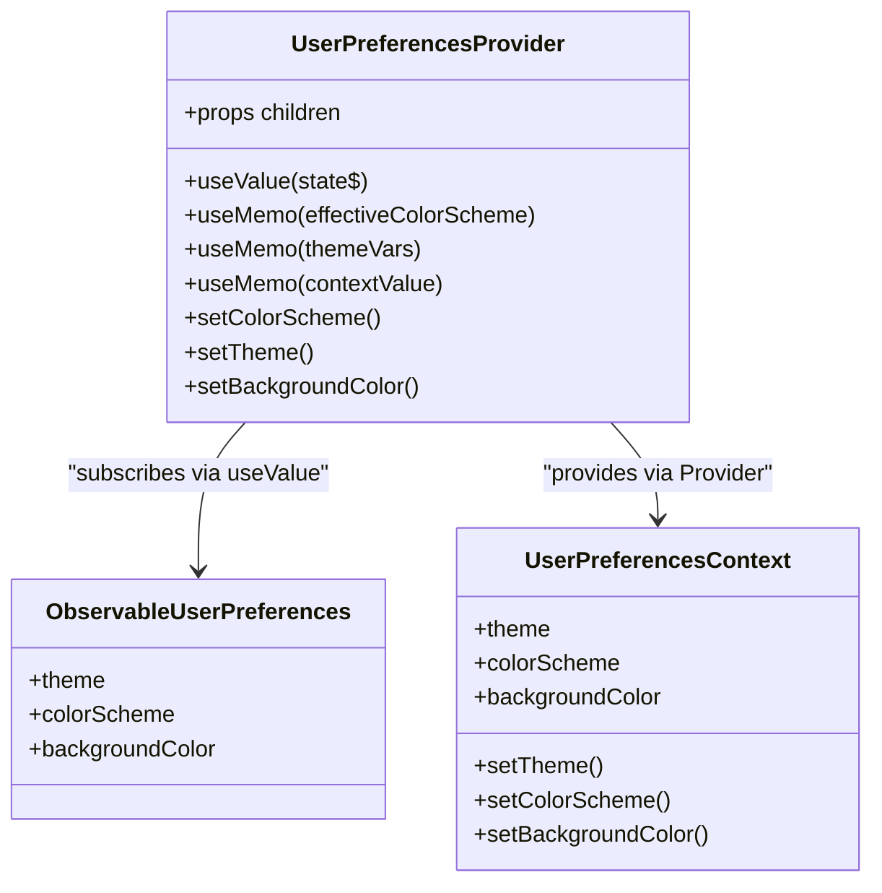
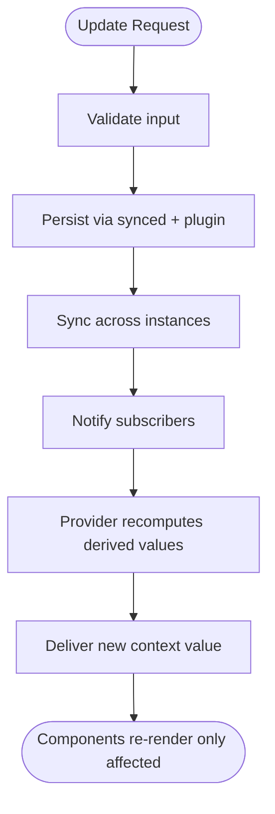
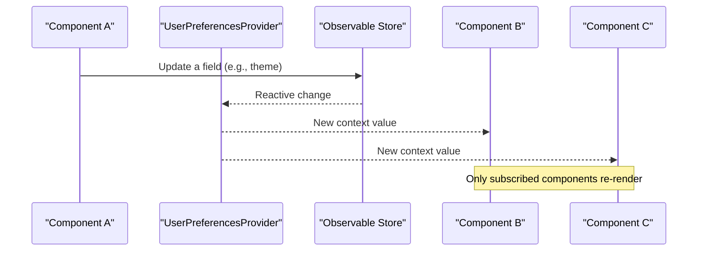
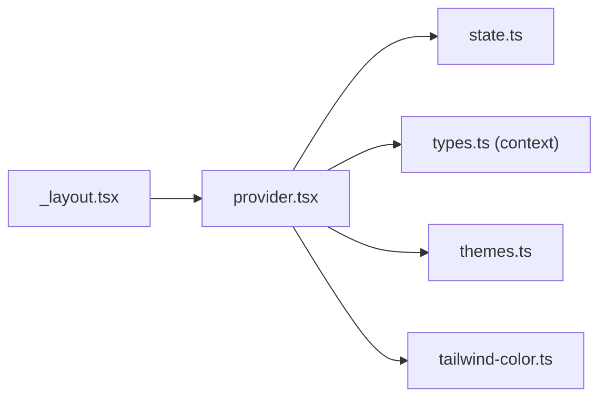

# Reactive State Management

<cite>
**Referenced Files in This Document**
- [_layout.tsx](file://app/_layout.tsx)
- [context.tsx](file://context/user-preferences/context.tsx)
- [provider.tsx](file://context/user-preferences/provider.tsx)
- [types.ts](file://context/user-preferences/types.ts)
- [state.ts](file://database/user-preferences/state.ts)
- [types.ts](file://database/user-preferences/types.ts)
- [themes.ts](file://lib/themes.ts)
- [tailwind-color.ts](file://lib/tailwind-color.ts)
- [use-chat.ts](file://features/chat/view-model/use-chat.ts)
- [history-screen.tsx](file://features/history/view/history-screen.tsx)
</cite>

## Table of Contents
1. [Introduction](#introduction)
2. [Project Structure](#project-structure)
3. [Core Components](#core-components)
4. [Architecture Overview](#architecture-overview)
5. [Detailed Component Analysis](#detailed-component-analysis)
6. [Dependency Analysis](#dependency-analysis)
7. [Performance Considerations](#performance-considerations)
8. [Troubleshooting Guide](#troubleshooting-guide)
9. [Conclusion](#conclusion)

## Introduction
This document explains My Shadow’s reactive state management architecture centered on LegendAppState and React Context. It details the dual-layer approach that combines reactive observables with traditional React state patterns, demonstrates how UserPreferencesProvider wraps the application with reactive state context, and shows how the observable pattern enables cross-component communication and synchronization. It also covers persistence via local storage, dependency injection through context providers, immutability principles, and practical subscription, update, and cleanup patterns. Examples are provided via file references and diagrams mapped to actual source code.

## Project Structure
The state management spans three layers:
- Application bootstrap and provider wiring in the root layout
- A user preferences provider that exposes theme and color scheme state via React Context
- A reactive observable store persisted locally, feeding the provider and enabling cross-feature synchronization

**Diagram sources**
- [_layout.tsx:12-50](file://app/_layout.tsx#L12-L50)
- [context.tsx:1-22](file://context/user-preferences/context.tsx#L1-L22)
- [provider.tsx:1-157](file://context/user-preferences/provider.tsx#L1-L157)
- [types.ts:1-15](file://context/user-preferences/types.ts#L1-L15)
- [state.ts:1-22](file://database/user-preferences/state.ts#L1-L22)
- [types.ts:1-8](file://database/user-preferences/types.ts#L1-L8)
- [themes.ts:1-141](file://lib/themes.ts#L1-L141)
- [tailwind-color.ts:1-250](file://lib/tailwind-color.ts#L1-L250)
- [history-screen.tsx:1-153](file://features/history/view/history-screen.tsx#L1-L153)
- [use-chat.ts:1-371](file://features/chat/view-model/use-chat.ts#L1-L371)

**Section sources**
- [_layout.tsx:12-50](file://app/_layout.tsx#L12-L50)
- [provider.tsx:1-157](file://context/user-preferences/provider.tsx#L1-L157)

## Core Components
- LegendAppState observable store: Provides reactive, persisted state for user preferences with automatic synchronization and local persistence.
- UserPreferencesProvider: React Context provider that subscribes to the observable, computes derived values (effective color scheme, theme variables, background color), and exposes setters to update the observable.
- UserPreferencesContext and hook: Standard React Context API for dependency injection and consumption across feature boundaries.
- Theme system: Centralized CSS variables and NativeWind integration for consistent theming across the app.

Key responsibilities:
- Reactive updates: Components subscribe to observable fields and re-render only when those fields change.
- Persistence: Updates are persisted automatically via the configured plugin and synchronized across app sessions.
- Cross-component communication: Updates made in one part of the app propagate instantly to all subscribers.

**Section sources**
- [state.ts:1-22](file://database/user-preferences/state.ts#L1-L22)
- [provider.tsx:1-157](file://context/user-preferences/provider.tsx#L1-L157)
- [context.tsx:1-22](file://context/user-preferences/context.tsx#L1-L22)
- [types.ts:1-15](file://context/user-preferences/types.ts#L1-L15)
- [themes.ts:1-141](file://lib/themes.ts#L1-L141)

## Architecture Overview
The architecture blends reactive observables with React’s imperative patterns:
- Observables drive state and persistence
- React Context injects computed values and setters
- Components consume either:
  - useValue/useObserver for reactive subscriptions
  - Traditional useState/useEffect for local UI state
- Derived values (effective color scheme, theme vars, background color) are computed in the provider and passed down via context

**Diagram sources**
- [_layout.tsx:17-45](file://app/_layout.tsx#L17-L45)
- [provider.tsx:27-133](file://context/user-preferences/provider.tsx#L27-L133)
- [state.ts:6-19](file://database/user-preferences/state.ts#L6-L19)
- [context.tsx:4-21](file://context/user-preferences/context.tsx#L4-L21)

## Detailed Component Analysis

### UserPreferencesProvider and Context
- Provider subscribes to the observable via a React integration hook, mapping reactive fields to local derived values.
- Computed values include effective color scheme (respecting “system” preference), theme name, and background color converted to a concrete HSL string.
- Exposes setters to update the observable, which persist automatically and synchronize across the app.

**Diagram sources**
- [provider.tsx:19-153](file://context/user-preferences/provider.tsx#L19-L153)
- [context.tsx:4-21](file://context/user-preferences/context.tsx#L4-L21)
- [state.ts:6-19](file://database/user-preferences/state.ts#L6-L19)

**Section sources**
- [provider.tsx:1-157](file://context/user-preferences/provider.tsx#L1-L157)
- [context.tsx:1-22](file://context/user-preferences/context.tsx#L1-L22)
- [types.ts:1-15](file://context/user-preferences/types.ts#L1-L15)

### Observable Pattern and Persistence
- The observable store is initialized with synced configuration and persisted via a plugin, ensuring state survives app restarts.
- Updates are atomic and immutable at the observable level; downstream consumers receive updated snapshots without manual re-render triggers.

**Diagram sources**
- [state.ts:6-19](file://database/user-preferences/state.ts#L6-L19)
- [provider.tsx:38-99](file://context/user-preferences/provider.tsx#L38-L99)

**Section sources**
- [state.ts:1-22](file://database/user-preferences/state.ts#L1-L22)
- [provider.tsx:38-99](file://context/user-preferences/provider.tsx#L38-L99)

### Cross-Component Communication and Synchronization
- Components across features subscribe to the same observable fields. When one component updates a field, all subscribers observe the change and re-render efficiently.
- Example integrations:
  - Feature screens consuming reactive lists or flags via observer/useValue
  - Provider-derived values applied to styles and layout

**Diagram sources**
- [provider.tsx:27-133](file://context/user-preferences/provider.tsx#L27-L133)
- [history-screen.tsx:23-25](file://features/history/view/history-screen.tsx#L23-L25)
- [use-chat.ts:26-26](file://features/chat/view-model/use-chat.ts#L26-L26)

**Section sources**
- [history-screen.tsx:1-153](file://features/history/view/history-screen.tsx#L1-L153)
- [use-chat.ts:1-371](file://features/chat/view-model/use-chat.ts#L1-L371)

### Practical Subscription Patterns
- Subscribe to single fields: use a hook to subscribe to a specific observable field and derive dependent values.
- Subscribe to whole objects: subscribe to a nested observable slice and compute derived values.
- Cleanup: rely on the provider’s lifecycle to manage subscriptions; avoid manual unsubscribe when using the provided hooks.

Examples (paths only):
- Subscribe to a boolean flag: [use-chat.ts:26-26](file://features/chat/view-model/use-chat.ts#L26-L26)
- Subscribe to a list inside an observable: [history-screen.tsx:24-25](file://features/history/view/history-screen.tsx#L24-L25)

**Section sources**
- [use-chat.ts:22-371](file://features/chat/view-model/use-chat.ts#L22-L371)
- [history-screen.tsx:23-25](file://features/history/view/history-screen.tsx#L23-L25)

### State Updates and Error Handling
- Setters in the provider validate inputs and wrap updates in try/catch blocks, logging errors and returning booleans to indicate success.
- Observable updates are atomic; partial failures are contained to the setter scope.

Example (paths only):
- Color scheme setter with validation and persistence: [provider.tsx:38-63](file://context/user-preferences/provider.tsx#L38-L63)
- Theme setter with validation: [provider.tsx:65-79](file://context/user-preferences/provider.tsx#L65-L79)
- Background color setter with default handling: [provider.tsx:81-99](file://context/user-preferences/provider.tsx#L81-L99)

**Section sources**
- [provider.tsx:38-99](file://context/user-preferences/provider.tsx#L38-L99)

### Local Database Persistence for User Preferences
- The observable store is configured with a persistence plugin and a unique store name, enabling seamless persistence and synchronization across app sessions.
- Retry logic ensures resilience against transient storage issues.

Example (paths only):
- Persistence configuration: [state.ts:13-17](file://database/user-preferences/state.ts#L13-L17)

**Section sources**
- [state.ts:13-17](file://database/user-preferences/state.ts#L13-L17)

### Context Provider Pattern for Dependency Injection
- The provider exposes a minimal, typed context contract, enabling dependency injection across feature boundaries.
- Consumers access theme, color scheme, and setters through a single hook, simplifying cross-feature state sharing.

Example (paths only):
- Context definition and hook: [context.tsx:4-21](file://context/user-preferences/context.tsx#L4-L21)
- Provider exports context value: [provider.tsx:117-133](file://context/user-preferences/provider.tsx#L117-L133)
- Contract shape: [types.ts:7-14](file://context/user-preferences/types.ts#L7-L14)

**Section sources**
- [context.tsx:1-22](file://context/user-preferences/context.tsx#L1-L22)
- [provider.tsx:117-133](file://context/user-preferences/provider.tsx#L117-L133)
- [types.ts:1-15](file://context/user-preferences/types.ts#L1-L15)

### State Immutability Principles and Efficient Re-renders
- Updates are performed on the observable store; consumers receive immutable snapshots reflecting the latest state.
- React integration ensures re-renders occur only for components that depend on changed fields, minimizing unnecessary work.

Example (paths only):
- Toggle a boolean flag: [use-chat.ts:251-254](file://features/chat/view-model/use-chat.ts#L251-L254)

**Section sources**
- [use-chat.ts:251-254](file://features/chat/view-model/use-chat.ts#L251-L254)

## Dependency Analysis
The provider depends on:
- The observable store for reactive state
- Theme utilities for CSS variable resolution
- NativeWind for color scheme and style propagation

**Diagram sources**
- [provider.tsx:1-12](file://context/user-preferences/provider.tsx#L1-L12)
- [state.ts:1-4](file://database/user-preferences/state.ts#L1-L4)
- [types.ts:1-1](file://context/user-preferences/types.ts#L1-L1)
- [themes.ts:1-141](file://lib/themes.ts#L1-L141)
- [tailwind-color.ts:1-250](file://lib/tailwind-color.ts#L1-L250)
- [_layout.tsx:17-45](file://app/_layout.tsx#L17-L45)

**Section sources**
- [provider.tsx:1-12](file://context/user-preferences/provider.tsx#L1-L12)
- [state.ts:1-4](file://database/user-preferences/state.ts#L1-L4)
- [themes.ts:1-141](file://lib/themes.ts#L1-L141)
- [tailwind-color.ts:1-250](file://lib/tailwind-color.ts#L1-L250)
- [_layout.tsx:17-45](file://app/_layout.tsx#L17-L45)

## Performance Considerations
- Prefer subscribing to only the fields you need to minimize re-renders.
- Memoize derived values in the provider to avoid recomputation on every render.
- Use the observer wrapper for components that render large lists or frequently updating data to keep renders efficient.
- Keep updates batched when possible to reduce thrashing.

## Troubleshooting Guide
Common issues and resolutions:
- Using the context hook outside the provider: The hook throws an error if used without a provider. Ensure the provider wraps the app root.
  - Reference: [context.tsx:13-21](file://context/user-preferences/context.tsx#L13-L21)
- Persisted state not applying: Verify the store name and persistence plugin configuration.
  - Reference: [state.ts:13-17](file://database/user-preferences/state.ts#L13-L17)
- Theme or color scheme not updating: Confirm the setter is invoked with a valid value and that the provider’s effective color scheme logic resolves as expected.
  - References: [provider.tsx:31-34](file://context/user-preferences/provider.tsx#L31-L34), [provider.tsx:38-63](file://context/user-preferences/provider.tsx#L38-L63)
- Background color not rendering: Ensure the CSS variable name is valid and resolvable via theme utilities.
  - Reference: [tailwind-color.ts:139-154](file://lib/tailwind-color.ts#L139-L154)

**Section sources**
- [context.tsx:13-21](file://context/user-preferences/context.tsx#L13-L21)
- [state.ts:13-17](file://database/user-preferences/state.ts#L13-L17)
- [provider.tsx:31-34](file://context/user-preferences/provider.tsx#L31-L34)
- [provider.tsx:38-63](file://context/user-preferences/provider.tsx#L38-L63)
- [tailwind-color.ts:139-154](file://lib/tailwind-color.ts#L139-L154)

## Conclusion
My Shadow’s state management combines the strengths of reactive observables and React’s imperative patterns. The UserPreferencesProvider demonstrates a clean, scalable approach to dependency injection and cross-component synchronization, while the observable store ensures persistence and efficient updates. By following the subscription, update, and cleanup patterns outlined here, developers can build responsive, maintainable features that share state seamlessly across the application.