# Build & Deployment

<cite>
**Referenced Files in This Document**
- [app.json](file://app.json)
- [eas.json](file://eas.json)
- [metro.config.js](file://metro.config.js)
- [babel.config.js](file://babel.config.js)
- [tsconfig.json](file://tsconfig.json)
- [package.json](file://package.json)
- [nativewind-env.d.ts](file://nativewind-env.d.ts)
- [declarations.d.ts](file://declarations.d.ts)
- [README.md](file://README.md)
</cite>

## Table of Contents
1. [Introduction](#introduction)
2. [Project Structure](#project-structure)
3. [Core Components](#core-components)
4. [Architecture Overview](#architecture-overview)
5. [Detailed Component Analysis](#detailed-component-analysis)
6. [Dependency Analysis](#dependency-analysis)
7. [Performance Considerations](#performance-considerations)
8. [Troubleshooting Guide](#troubleshooting-guide)
9. [Conclusion](#conclusion)
10. [Appendices](#appendices)

## Introduction
This document explains the build and deployment workflow for My Shadow, an Expo-based React Native application. It covers app metadata and platform-specific configuration, Metro bundler customization for asset processing, EAS Build configuration for cloud builds, Babel transpilation for TypeScript and JSX, TypeScript configuration including path aliases, development deployment via npx expo run:android, production build strategies, platform-specific requirements for Android (SDK/NDK/CMake), ProGuard rules, optimization strategies for bundle size and runtime performance, and debugging techniques for build and native module issues.

## Project Structure
The build system is driven by a small set of configuration files at the repository root:
- app.json defines app metadata, platform-specific identifiers, plugins, experiments, and EAS project metadata.
- eas.json configures EAS build profiles (development, preview, production) and submission settings.
- metro.config.js extends Expo’s Metro defaults, adds SVG transformer, enables package exports, and integrates NativeWind.
- babel.config.js sets up Babel with Expo preset and NativeWind.
- tsconfig.json extends Expo’s base TS config, enforces strictness, defines path aliases, and overrides compiler options for tests and UI layers.
- package.json lists scripts, dependencies, dev dependencies, and trusted native dependencies.
- nativewind-env.d.ts and declarations.d.ts provide type definitions for NativeWind and SVG modules.

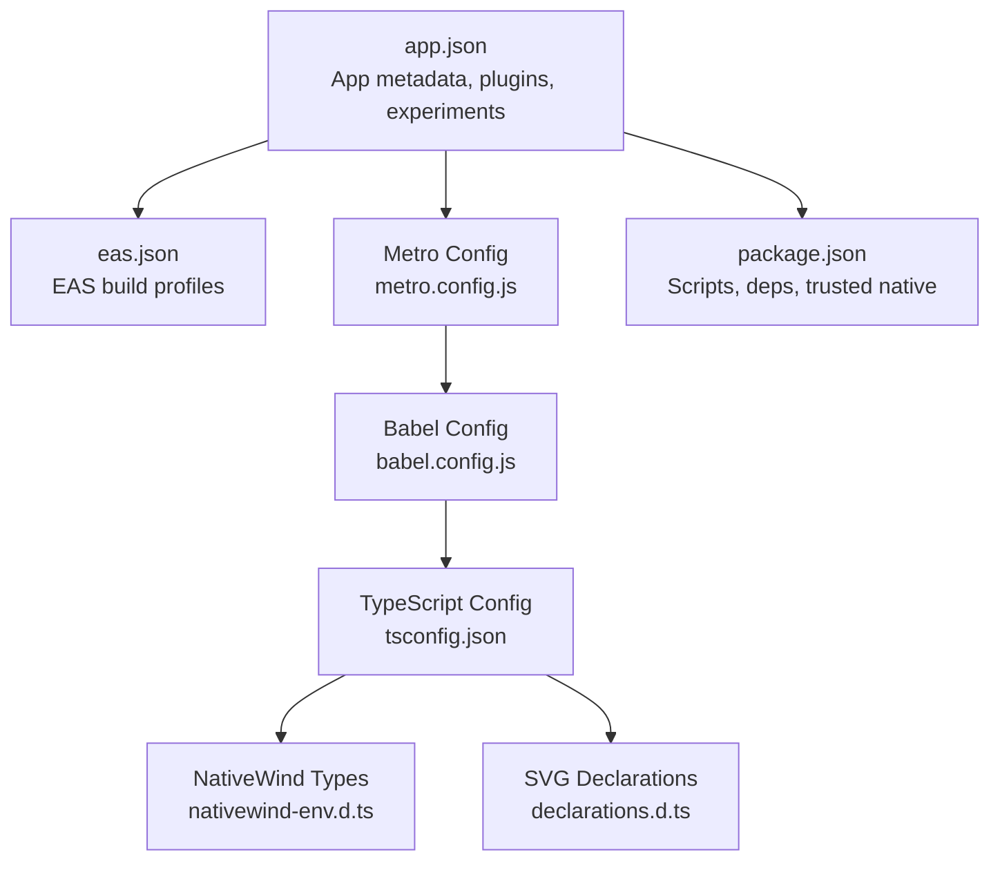

**Diagram sources**
- [app.json:1-82](file://app.json#L1-L82)
- [eas.json:1-23](file://eas.json#L1-L23)
- [metro.config.js:1-19](file://metro.config.js#L1-L19)
- [babel.config.js:1-11](file://babel.config.js#L1-L11)
- [tsconfig.json:1-68](file://tsconfig.json#L1-L68)
- [nativewind-env.d.ts:1-2](file://nativewind-env.d.ts#L1-L2)
- [declarations.d.ts:1-6](file://declarations.d.ts#L1-L6)
- [package.json:1-128](file://package.json#L1-L128)

**Section sources**
- [app.json:1-82](file://app.json#L1-L82)
- [eas.json:1-23](file://eas.json#L1-L23)
- [metro.config.js:1-19](file://metro.config.js#L1-L19)
- [babel.config.js:1-11](file://babel.config.js#L1-L11)
- [tsconfig.json:1-68](file://tsconfig.json#L1-L68)
- [package.json:1-128](file://package.json#L1-L128)
- [nativewind-env.d.ts:1-2](file://nativewind-env.d.ts#L1-L2)
- [declarations.d.ts:1-6](file://declarations.d.ts#L1-L6)

## Core Components
- App metadata and platform configuration: app.json centralizes app name, slug, version, orientation, icons, scheme, UI style, iOS bundle identifier, Android package and adaptive icon assets, web bundler, plugins, experiments, and EAS project ID.
- EAS Build profiles: eas.json defines development (internal distribution, dev client), preview (internal), and production (auto-increment version) profiles, and submission configuration.
- Metro bundler: metro.config.js extends Expo defaults, registers react-native-svg-transformer, adjusts resolver extensions, enables unstable package exports, and integrates NativeWind with a global CSS input and rem scaling.
- Babel transpilation: babel.config.js applies babel-preset-expo with JSX import source pointing to nativewind and includes nativewind/babel for Tailwind JIT on the JS side.
- TypeScript configuration: tsconfig.json extends Expo’s base, enforces strict compiler options, defines path alias @/*, and relaxes strictness for tests and UI layers.
- Scripts and dependencies: package.json provides scripts for development and testing, lists production dependencies (including llama.rn and whisper.rn), dev dependencies, and marks trusted native dependencies.

**Section sources**
- [app.json:1-82](file://app.json#L1-L82)
- [eas.json:1-23](file://eas.json#L1-L23)
- [metro.config.js:1-19](file://metro.config.js#L1-L19)
- [babel.config.js:1-11](file://babel.config.js#L1-L11)
- [tsconfig.json:1-68](file://tsconfig.json#L1-L68)
- [package.json:1-128](file://package.json#L1-L128)

## Architecture Overview
The build pipeline integrates Expo tooling, EAS Build, Metro bundler, Babel, and TypeScript. Native modules (llama.rn, whisper.rn) are integrated via app.json plugins and configured for Android with C++20, OpenCL/Hexagon, and entitlements. Metro handles asset resolution and SVG transformation, while Babel and TypeScript compile source to JavaScript. EAS orchestrates cloud builds and submissions.

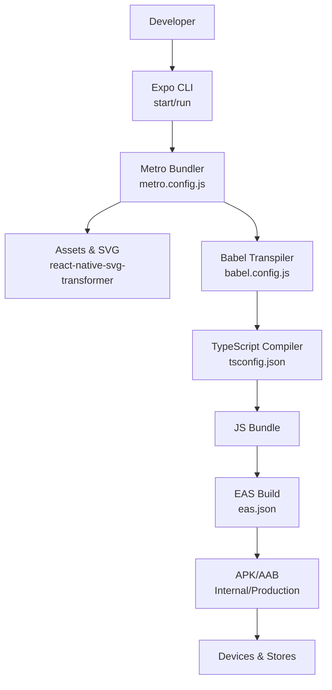

**Diagram sources**
- [metro.config.js:1-19](file://metro.config.js#L1-L19)
- [babel.config.js:1-11](file://babel.config.js#L1-L11)
- [tsconfig.json:1-68](file://tsconfig.json#L1-L68)
- [eas.json:1-23](file://eas.json#L1-L23)
- [app.json:1-82](file://app.json#L1-L82)

## Detailed Component Analysis

### Expo App Configuration (app.json)
- Metadata: name, slug, version, orientation, icon, scheme, user interface style.
- Platform identifiers: iOS bundle identifier and Android package.
- Adaptive icon configuration for Android with foreground/background images and monochrome asset.
- Web bundler set to Metro with static output and favicon.
- Plugins:
  - expo-router for file-based routing.
  - expo-splash-screen with image, resize mode, background color, and dark mode background.
  - expo-sqlite, react-native-edge-to-edge, expo-secure-store.
  - llama.rn plugin with enableEntitlements, forceCxx20, enableOpenCLAndHexagon, and entitlementsProfile.
  - expo-build-properties with Android proguardRules for llama.rn and Apache Commons classes.
  - Additional plugins: expo-font, expo-image, expo-web-browser, expo-file-system, expo-audio, expo-asset.
- Experiments: typedRoutes and reactCompiler enabled.
- Extra: router and EAS project ID.

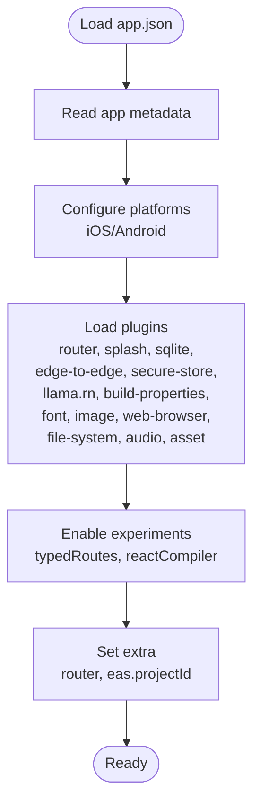

**Diagram sources**
- [app.json:1-82](file://app.json#L1-L82)

**Section sources**
- [app.json:1-82](file://app.json#L1-L82)

### EAS Build Configuration (eas.json)
- CLI version requirement and app version source set to remote.
- Build profiles:
  - development: uses Bun, development client, internal distribution.
  - preview: internal distribution.
  - production: auto increment version.
- Submit profile for production.

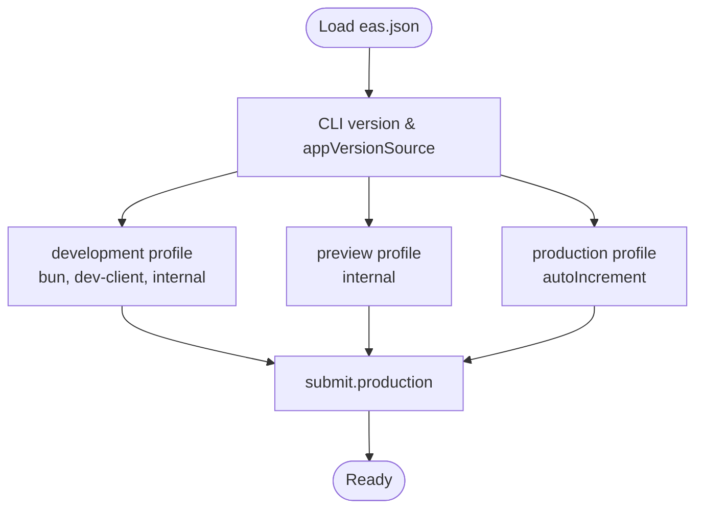

**Diagram sources**
- [eas.json:1-23](file://eas.json#L1-L23)

**Section sources**
- [eas.json:1-23](file://eas.json#L1-L23)

### Metro Bundler Configuration (metro.config.js)
- Extends Expo’s default config.
- Registers react-native-svg-transformer to handle SVG files.
- Removes svg from assetExts and adds svg to sourceExts to enable importing SVG as React components.
- Enables unstable_enablePackageExports for improved package resolution.
- Integrates with NativeWind, specifying global CSS input and inlineRem scaling.

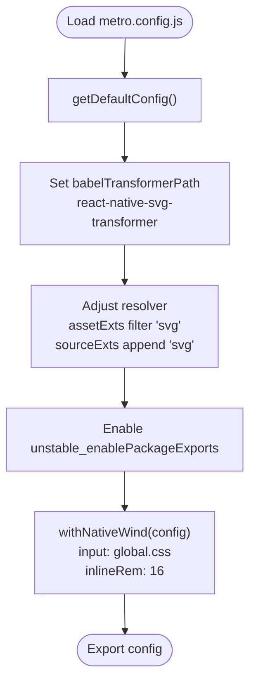

**Diagram sources**
- [metro.config.js:1-19](file://metro.config.js#L1-L19)

**Section sources**
- [metro.config.js:1-19](file://metro.config.js#L1-L19)

### Babel Transpilation (babel.config.js)
- Uses babel-preset-expo with jsxImportSource set to nativewind for JSX runtime targeting React Native.
- Includes nativewind/babel for Tailwind JIT on the JS side.
- Caching enabled via api.cache(true).

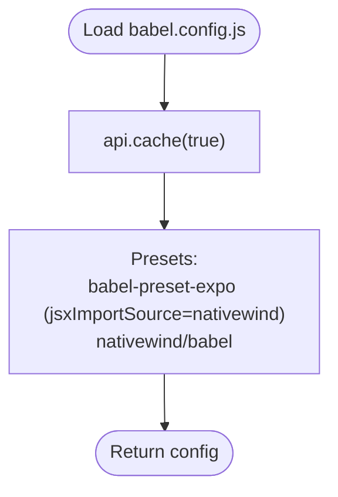

**Diagram sources**
- [babel.config.js:1-11](file://babel.config.js#L1-L11)

**Section sources**
- [babel.config.js:1-11](file://babel.config.js#L1-L11)

### TypeScript Configuration (tsconfig.json)
- Extends "expo/tsconfig.base".
- Enforces strict compiler options and additional checks (noUnusedLocals, noUnusedParameters, strictFunctionTypes, etc.).
- Adds types for Bun and sets lib to ESNext.
- Defines path alias @/* mapped to project root.
- Overrides compiler options for test files and UI feature files to reduce strictness during development.
- Includes TS types for .expo, expo-env.d.ts, and nativewind-env.d.ts.

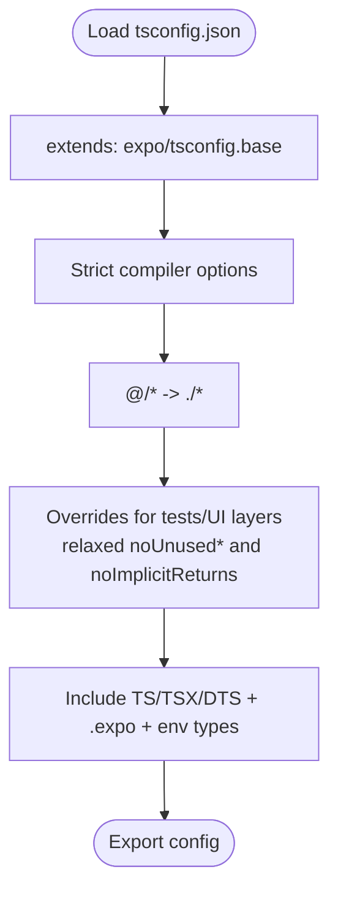

**Diagram sources**
- [tsconfig.json:1-68](file://tsconfig.json#L1-L68)

**Section sources**
- [tsconfig.json:1-68](file://tsconfig.json#L1-L68)

### Development Build and Direct Device Deployment
- Development server and client: npx expo start launches the dev server and Dev Client.
- Direct device deployment: npx expo run:android builds and installs a development APK with all native modules included (e.g., llama.rn, MMKV, etc.).

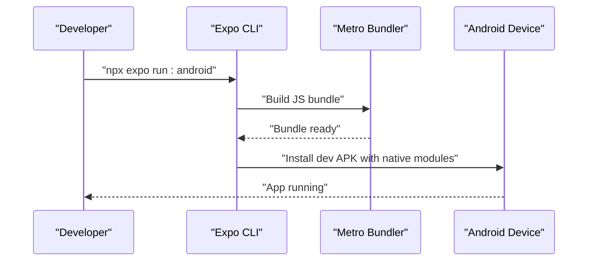

**Diagram sources**
- [package.json:8-8](file://package.json#L8-L8)
- [README.md:41-47](file://README.md#L41-L47)

**Section sources**
- [package.json:8-8](file://package.json#L8-L8)
- [README.md:41-47](file://README.md#L41-L47)

### Production Build Strategies and Distribution Preparation
- EAS Build profiles:
  - development: internal distribution with dev-client.
  - preview: internal distribution.
  - production: auto-increment version.
- Distribution preparation:
  - Internal distribution via EAS builds.
  - Production builds leverage auto-increment versioning.
- Submission:
  - submit.production is configured for production submissions.

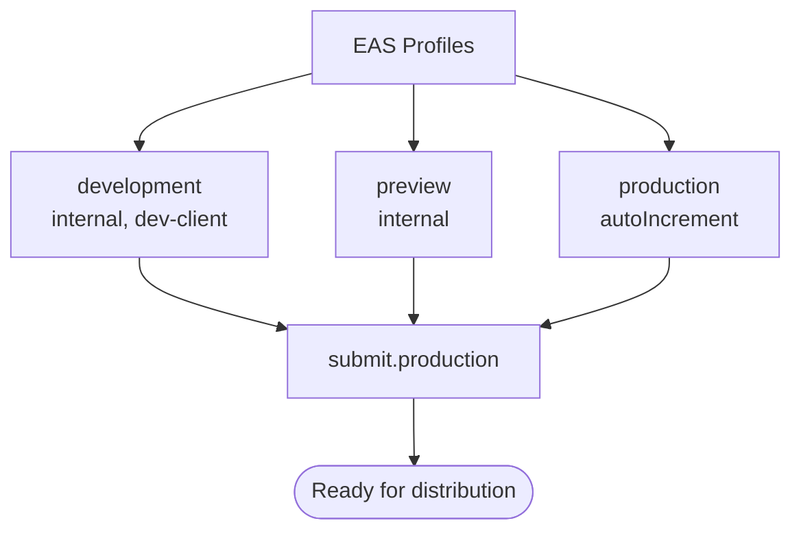

**Diagram sources**
- [eas.json:6-21](file://eas.json#L6-L21)

**Section sources**
- [eas.json:6-21](file://eas.json#L6-L21)

### Platform-Specific Build Requirements (Android)
- Android SDK/NDK/CMake:
  - Android SDK 34+ (compileSdkVersion).
  - NDK 26+ (native C++ compilation).
  - CMake 3.22+.
  - C++20 support enabled via forceCxx20 in llama.rn plugin configuration.
- ProGuard rules:
  - Automatically applied via expo-build-properties plugin in app.json for llama.rn and Apache Commons classes.
- Permissions and entitlements:
  - Android permissions declared in app.json under android.permissions.
  - llama.rn plugin enables entitlements and OpenCL/Hexagon support.

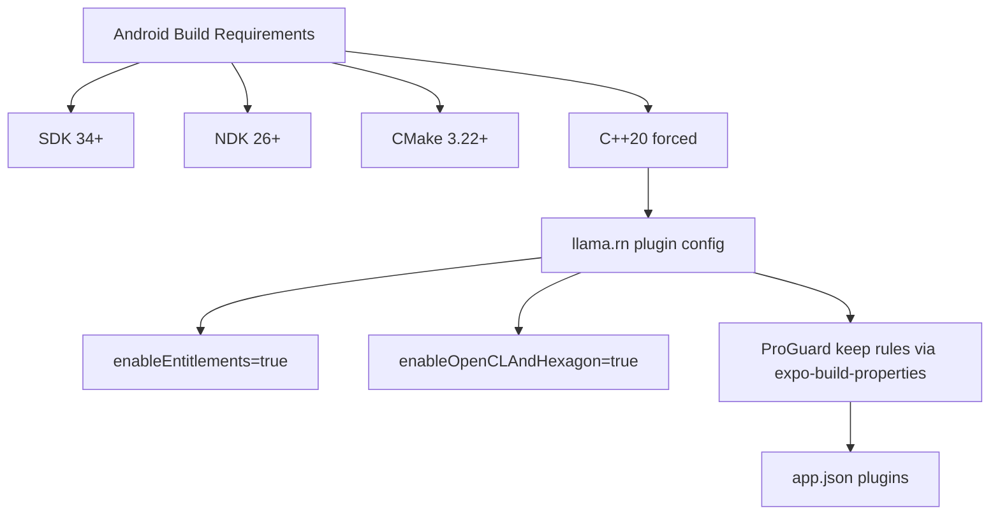

**Diagram sources**
- [README.md:51-68](file://README.md#L51-L68)
- [app.json:47-62](file://app.json#L47-L62)

**Section sources**
- [README.md:51-68](file://README.md#L51-L68)
- [app.json:47-62](file://app.json#L47-L62)

### Optimization Strategies for Bundle Size and Runtime Performance
- Asset and SVG handling:
  - Metro config removes svg from assetExts and adds it to sourceExts, enabling SVG as React components via react-native-svg-transformer.
  - NativeWind integration with global CSS input and inlineRem improves styling performance.
- TypeScript strictness:
  - Strict compiler options improve correctness; overrides for tests and UI layers ease development iteration.
- Native modules:
  - llama.rn and whisper.rn are marked as trusted dependencies to streamline installation and linking.
- Runtime adaptation:
  - README documents automatic device profiling, KV cache quantization, and OOM fallback strategies for performance and stability.

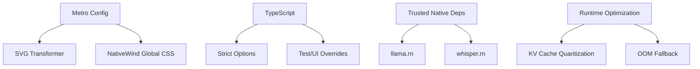

**Diagram sources**
- [metro.config.js:6-18](file://metro.config.js#L6-L18)
- [tsconfig.json:4-27](file://tsconfig.json#L4-L27)
- [package.json:122-125](file://package.json#L122-L125)
- [README.md:86-104](file://README.md#L86-L104)

**Section sources**
- [metro.config.js:6-18](file://metro.config.js#L6-L18)
- [tsconfig.json:4-27](file://tsconfig.json#L4-L27)
- [package.json:122-125](file://package.json#L122-L125)
- [README.md:86-104](file://README.md#L86-L104)

### Debugging Techniques for Build Issues and Native Module Problems
- SVG import issues:
  - Ensure svg is removed from assetExts and added to sourceExts in Metro config.
  - Verify react-native-svg-transformer is registered.
- NativeWind/Tailwind:
  - Confirm nativewind-env.d.ts is present and global CSS input is configured.
  - Check inlineRem settings if rem scaling appears incorrect.
- TypeScript diagnostics:
  - Use strict compiler options to catch issues early; rely on overrides for tests/UI layers.
- Native module linking:
  - llama.rn and whisper.rn are trusted dependencies; ensure proper installation and linking.
  - Android initialization timing: tests validate optional chaining patterns for RNWhisper to prevent null pointer issues.
- Android build logs:
  - Review CMake/NDK versions and prefab logs in the Android build intermediates to confirm toolchain alignment.

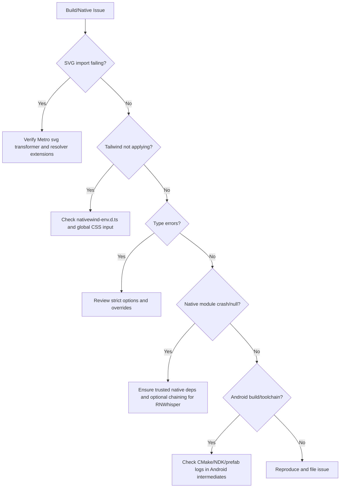

**Diagram sources**
- [metro.config.js:6-18](file://metro.config.js#L6-L18)
- [nativewind-env.d.ts:1-2](file://nativewind-env.d.ts#L1-L2)
- [tsconfig.json:4-27](file://tsconfig.json#L4-L27)
- [package.json:122-125](file://package.json#L122-L125)
- [README.md:41-47](file://README.md#L41-L47)

**Section sources**
- [metro.config.js:6-18](file://metro.config.js#L6-L18)
- [nativewind-env.d.ts:1-2](file://nativewind-env.d.ts#L1-L2)
- [tsconfig.json:4-27](file://tsconfig.json#L4-L27)
- [package.json:122-125](file://package.json#L122-L125)
- [README.md:41-47](file://README.md#L41-L47)

## Dependency Analysis
The build system exhibits low coupling between configuration files, with clear separation of concerns:
- app.json drives platform configuration and plugin selection.
- eas.json orchestrates EAS build profiles and submission.
- metro.config.js depends on Expo defaults and NativeWind; it is decoupled from TypeScript and Babel.
- babel.config.js depends on Expo preset and NativeWind; it is decoupled from Metro and TS.
- tsconfig.json depends on Expo base and provides type safety; it is decoupled from Metro and Babel.
- package.json ties scripts and dependencies together, marking trusted native modules.

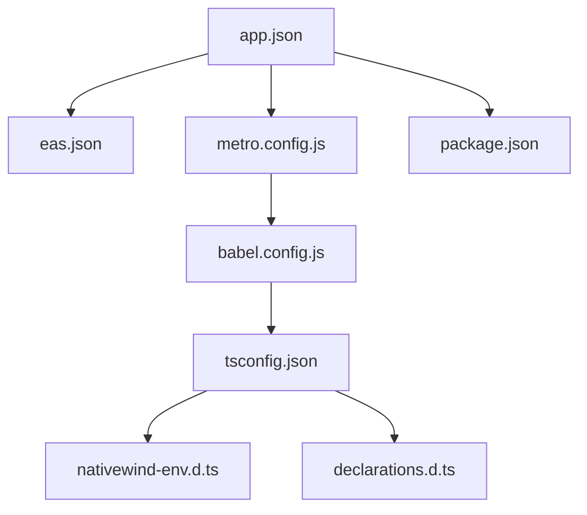

**Diagram sources**
- [app.json:1-82](file://app.json#L1-L82)
- [eas.json:1-23](file://eas.json#L1-L23)
- [metro.config.js:1-19](file://metro.config.js#L1-L19)
- [babel.config.js:1-11](file://babel.config.js#L1-L11)
- [tsconfig.json:1-68](file://tsconfig.json#L1-L68)
- [nativewind-env.d.ts:1-2](file://nativewind-env.d.ts#L1-L2)
- [declarations.d.ts:1-6](file://declarations.d.ts#L1-L6)
- [package.json:1-128](file://package.json#L1-L128)

**Section sources**
- [app.json:1-82](file://app.json#L1-L82)
- [eas.json:1-23](file://eas.json#L1-L23)
- [metro.config.js:1-19](file://metro.config.js#L1-L19)
- [babel.config.js:1-11](file://babel.config.js#L1-L11)
- [tsconfig.json:1-68](file://tsconfig.json#L1-L68)
- [nativewind-env.d.ts:1-2](file://nativewind-env.d.ts#L1-L2)
- [declarations.d.ts:1-6](file://declarations.d.ts#L1-L6)
- [package.json:1-128](file://package.json#L1-L128)

## Performance Considerations
- Prefer development client builds for rapid iteration; use production builds for release distribution.
- Keep Metro and Babel configurations minimal to reduce transform time.
- Use NativeWind with global CSS and inlineRem to avoid excessive CSS generation.
- Leverage TypeScript strictness to catch performance-impacting bugs early.
- For Android, ensure CMake/NDK versions align with React Native expectations to avoid rebuild loops.

## Troubleshooting Guide
- Metro SVG import failures:
  - Confirm svg is removed from assetExts and added to sourceExts.
  - Ensure react-native-svg-transformer is registered.
- NativeWind not applied:
  - Verify nativewind-env.d.ts presence and global CSS input path.
- TypeScript errors:
  - Review strict options and overrides for tests/UI layers.
- Native module crashes:
  - Ensure llama.rn and whisper.rn are installed and linked.
  - Validate optional chaining patterns for RNWhisper on Android.
- Android toolchain mismatches:
  - Check CMake/NDK versions and prefab logs in Android intermediates.

**Section sources**
- [metro.config.js:6-18](file://metro.config.js#L6-L18)
- [nativewind-env.d.ts:1-2](file://nativewind-env.d.ts#L1-L2)
- [tsconfig.json:4-27](file://tsconfig.json#L4-L27)
- [package.json:122-125](file://package.json#L122-L125)
- [README.md:41-47](file://README.md#L41-L47)

## Conclusion
My Shadow’s build and deployment pipeline leverages Expo tooling, EAS Build, Metro, Babel, and TypeScript with targeted configurations for platform-specific needs. The setup integrates native modules (llama.rn, whisper.rn) via app.json plugins, optimizes asset processing and bundling, and provides clear development and production workflows. Following the guidelines in this document ensures reliable builds, efficient development iterations, and smooth distribution.

## Appendices
- Development commands:
  - Start dev server: npx expo start
  - Run on Android: npx expo run:android
- Trusted native dependencies:
  - llama.rn and whisper.rn are marked as trusted in package.json.

**Section sources**
- [package.json:8-8](file://package.json#L8-L8)
- [package.json:122-125](file://package.json#L122-L125)