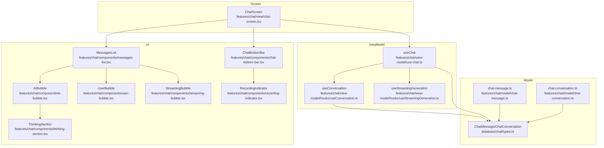
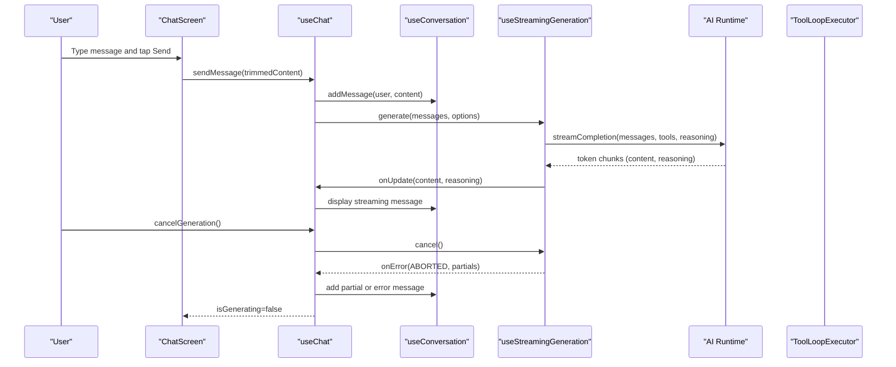
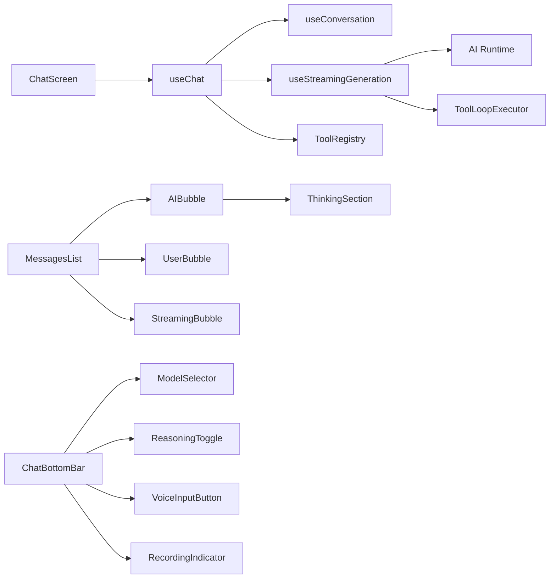

# Chat Interface

<cite>
**Referenced Files in This Document**
- [chat-screen.tsx](file://features/chat/view/chat-screen.tsx)
- [use-chat.ts](file://features/chat/view-model/use-chat.ts)
- [useConversation.ts](file://features/chat/view-model/hooks/useConversation.ts)
- [useStreamingGeneration.ts](file://features/chat/view-model/hooks/useStreamingGeneration.ts)
- [messages-list.tsx](file://features/chat/components/messages-list.tsx)
- [ai-bubble.tsx](file://features/chat/components/ai-bubble.tsx)
- [user-bubble.tsx](file://features/chat/components/user-bubble.tsx)
- [streaming-bubble.tsx](file://features/chat/components/streaming-bubble.tsx)
- [thinking-section.tsx](file://features/chat/components/thinking-section.tsx)
- [chat-bottom-bar.tsx](file://features/chat/components/chat-bottom-bar.tsx)
- [recording-indicator.tsx](file://features/chat/components/recording-indicator.tsx)
- [types.ts](file://database/chat/types.ts)
- [chat-conversation.ts](file://features/chat/model/chat-conversation.ts)
- [chat-message.ts](file://features/chat/model/chat-message.ts)
</cite>

## Table of Contents
1. [Introduction](#introduction)
2. [Project Structure](#project-structure)
3. [Core Components](#core-components)
4. [Architecture Overview](#architecture-overview)
5. [Detailed Component Analysis](#detailed-component-analysis)
6. [Dependency Analysis](#dependency-analysis)
7. [Performance Considerations](#performance-considerations)
8. [Troubleshooting Guide](#troubleshooting-guide)
9. [Conclusion](#conclusion)

## Introduction
This document describes the My Shadow chat interface, focusing on the main chat screen architecture, component composition, conversation state management, and real-time streaming experience. It explains how user input flows through the AI inference pipeline to produce AI responses, including progressive rendering, reasoning visibility, error handling, and retry mechanisms. Accessibility, responsive design, and cross-platform UI consistency are addressed alongside the underlying data models and component responsibilities.

## Project Structure
The chat feature is organized around a ViewModel that orchestrates state and side effects, a set of UI components for rendering messages and input, and a small typed model layer for conversations and messages. The main screen wires the ViewModel to the UI and handles lifecycle events such as focus and navigation.

**Diagram sources**
- [chat-screen.tsx:14-147](file://features/chat/view/chat-screen.tsx#L14-L147)
- [use-chat.ts:22-370](file://features/chat/view-model/use-chat.ts#L22-L370)
- [useConversation.ts:11-235](file://features/chat/view-model/hooks/useConversation.ts#L11-L235)
- [useStreamingGeneration.ts:39-164](file://features/chat/view-model/hooks/useStreamingGeneration.ts#L39-L164)
- [messages-list.tsx:29-160](file://features/chat/components/messages-list.tsx#L29-L160)
- [ai-bubble.tsx:20-118](file://features/chat/components/ai-bubble.tsx#L20-L118)
- [user-bubble.tsx:20-67](file://features/chat/components/user-bubble.tsx#L20-L67)
- [streaming-bubble.tsx:18-25](file://features/chat/components/streaming-bubble.tsx#L18-L25)
- [thinking-section.tsx:21-115](file://features/chat/components/thinking-section.tsx#L21-L115)
- [chat-bottom-bar.tsx:45-220](file://features/chat/components/chat-bottom-bar.tsx#L45-L220)
- [recording-indicator.tsx:43-91](file://features/chat/components/recording-indicator.tsx#L43-L91)
- [types.ts:5-30](file://database/chat/types.ts#L5-L30)
- [chat-message.ts:5-37](file://features/chat/model/chat-message.ts#L5-L37)
- [chat-conversation.ts:12-44](file://features/chat/model/chat-conversation.ts#L12-L44)

**Section sources**
- [chat-screen.tsx:14-147](file://features/chat/view/chat-screen.tsx#L14-L147)
- [use-chat.ts:22-370](file://features/chat/view-model/use-chat.ts#L22-L370)

## Core Components
- ChatScreen: Orchestrates the chat UI, initializes conversation state on focus, and renders the message list and bottom bar.
- useChat ViewModel: Centralizes message sending, streaming generation, cancellation, retry, model selection, and reasoning toggling.
- useConversation: Manages conversation creation, persistence, message addition, and error propagation on user messages.
- useStreamingGeneration: Implements real-time streaming with incremental updates, tool loop integration, and cancellation.
- MessagesList: Renders the conversation list, handles scroll-to-bottom behavior during streaming, and switches between AI, user, and streaming bubbles.
- AIBubble/UserBubble/StreamingBubble: Render AI responses, user messages, and streaming content with progressive text and optional reasoning.
- ThinkingSection: Optional reasoning panel with expand/collapse behavior.
- ChatBottomBar: Input area with text input, send/cancel controls, model selector, reasoning toggle, voice input integration, and recording indicator.
- RecordingIndicator: Animated recording dot for voice input feedback.
- Model layer: ChatMessage and ChatConversation types plus helpers for creation and title generation.

**Section sources**
- [chat-screen.tsx:14-147](file://features/chat/view/chat-screen.tsx#L14-L147)
- [use-chat.ts:22-370](file://features/chat/view-model/use-chat.ts#L22-L370)
- [useConversation.ts:11-235](file://features/chat/view-model/hooks/useConversation.ts#L11-L235)
- [useStreamingGeneration.ts:39-164](file://features/chat/view-model/hooks/useStreamingGeneration.ts#L39-L164)
- [messages-list.tsx:29-160](file://features/chat/components/messages-list.tsx#L29-L160)
- [ai-bubble.tsx:20-118](file://features/chat/components/ai-bubble.tsx#L20-L118)
- [user-bubble.tsx:20-67](file://features/chat/components/user-bubble.tsx#L20-L67)
- [streaming-bubble.tsx:18-25](file://features/chat/components/streaming-bubble.tsx#L18-L25)
- [thinking-section.tsx:21-115](file://features/chat/components/thinking-section.tsx#L21-L115)
- [chat-bottom-bar.tsx:45-220](file://features/chat/components/chat-bottom-bar.tsx#L45-L220)
- [recording-indicator.tsx:43-91](file://features/chat/components/recording-indicator.tsx#L43-L91)
- [types.ts:5-30](file://database/chat/types.ts#L5-L30)
- [chat-message.ts:5-37](file://features/chat/model/chat-message.ts#L5-L37)
- [chat-conversation.ts:12-44](file://features/chat/model/chat-conversation.ts#L12-L44)

## Architecture Overview
The chat architecture follows a unidirectional data flow:
- ChatScreen observes ViewModel state and passes props to UI components.
- useChat coordinates user actions (send/retry/cancel), delegates inference to useStreamingGeneration, and persists results via useConversation.
- useStreamingGeneration streams tokens and reasoning, updating a temporary streaming message until completion or cancellation.
- MessagesList renders either static messages or the current streaming message, switching between AI, user, and streaming views.
- ChatBottomBar provides input controls, model selection, reasoning toggle, and voice input integration.

**Diagram sources**
- [chat-screen.tsx:117-139](file://features/chat/view/chat-screen.tsx#L117-L139)
- [use-chat.ts:101-183](file://features/chat/view-model/use-chat.ts#L101-L183)
- [useConversation.ts:53-120](file://features/chat/view-model/hooks/useConversation.ts#L53-L120)
- [useStreamingGeneration.ts:52-146](file://features/chat/view-model/hooks/useStreamingGeneration.ts#L52-L146)

## Detailed Component Analysis

### ChatScreen
Responsibilities:
- Initialize and reset chat state on focus.
- Load model for a given conversation or auto-load when starting a new one.
- Render TopBar, MessagesList, and ChatBottomBar.
- Pass down input text, send handler, cancel handler, and model-related props.

Key behaviors:
- Detects whether the current route param indicates a new or existing conversation and initializes accordingly.
- Exposes a “new conversation” action to reset state.

Accessibility:
- TopBar actions include accessibility labels for navigation and new conversation.

Responsive design:
- Uses KeyboardAvoidingView to keep input in view.
- Bottom bar adapts to presence of content and model readiness.

**Section sources**
- [chat-screen.tsx:14-147](file://features/chat/view/chat-screen.tsx#L14-L147)

### useChat ViewModel
Responsibilities:
- Validate input and ensure model readiness before sending.
- Create or reuse a conversation and append the user message.
- Coordinate streaming generation with tool loop execution.
- Handle partial content on cancellation or errors by appending markers.
- Provide UI flags: isGenerating, isModelReady, hasContent, selected model info, and error states.
- Support retryLastUserMessage by removing the last assistant message and regenerating.

Error handling:
- Distinguishes ABORTED vs. non-aborted errors and decides whether to inject a partial assistant message.
- Emits structured logs for inference start/end and errors.

Streaming coordination:
- Delegates to useStreamingGeneration for streaming lifecycle and cancellation.

**Section sources**
- [use-chat.ts:22-370](file://features/chat/view-model/use-chat.ts#L22-L370)

### useConversation
Responsibilities:
- Initialize conversation state (id, title, error).
- Create a new conversation with a UUID, title, and optional model id.
- Add messages, auto-generate title from the first user message, and track last model used.
- Update the last user message’s errorCode to surface validation or runtime errors.
- Remove the last assistant message to support retries.
- Retrieve messages and last model used id.

Persistence:
- Mutates a centralized chat state store to persist conversations and messages.

**Section sources**
- [useConversation.ts:11-235](file://features/chat/view-model/hooks/useConversation.ts#L11-L235)

### useStreamingGeneration
Responsibilities:
- Create a temporary streaming message with a fixed timestamp.
- Stream tokens and reasoning from the AI runtime, updating the streaming message incrementally.
- Integrate with ToolLoopExecutor to execute tools and continue generation.
- Support cancellation via AbortController and clear streaming state on completion or error.
- Expose callbacks for onUpdate, onComplete, and onError.

Data structures:
- StreamingMessage extends ChatMessage with _isStreaming flag for UI differentiation.

**Section sources**
- [useStreamingGeneration.ts:39-164](file://features/chat/view-model/hooks/useStreamingGeneration.ts#L39-L164)

### MessagesList
Responsibilities:
- Render conversation messages using a virtualized list.
- Scroll to bottom automatically when new streaming content arrives.
- Switch between AIBubble, UserBubble, and StreamingBubble based on message role and streaming state.
- Show ConversationErrorState when a conversation-level error exists.
- Show EmptyState when no content and model is ready, or a model-ready prompt when no models are available.

Accessibility:
- Provides retry actions on user error bubbles.

**Section sources**
- [messages-list.tsx:29-160](file://features/chat/components/messages-list.tsx#L29-L160)

### AI Bubble
Responsibilities:
- Render AI content progressively using MarkdownStream for completed lines and a live cursor for the current line.
- Optionally render a ThinkingSection for reasoning content.
- Provide footer with model name, timestamp, timings, retry, and copy actions.
- Respect dark/light theme colors.

Edge cases:
- When content is empty but streaming, show a spinner indicator.
- Copy action copies either reasoning or content.

**Section sources**
- [ai-bubble.tsx:20-118](file://features/chat/components/ai-bubble.tsx#L20-L118)

### User Bubble
Responsibilities:
- Render user messages with a distinct background.
- Display inline error indicators and a retry button when the last user message has an error code.
- Show localized timestamp.

**Section sources**
- [user-bubble.tsx:20-67](file://features/chat/components/user-bubble.tsx#L20-L67)

### Streaming Bubble
Responsibilities:
- Thin wrapper around AIBubble to render the current streaming message with isStreaming enabled.

**Section sources**
- [streaming-bubble.tsx:18-25](file://features/chat/components/streaming-bubble.tsx#L18-L25)

### ThinkingSection
Responsibilities:
- Toggle-expand reasoning content with smooth animations.
- Auto-scroll to end when collapsing to show latest reasoning.
- Provide accessibility labels for expand/collapse.

**Section sources**
- [thinking-section.tsx:21-115](file://features/chat/components/thinking-section.tsx#L21-L115)

### ChatBottomBar
Responsibilities:
- Host text input with auto-resize and placeholder hints based on state.
- Show recording status and duration during voice input.
- Render either VoiceInputButton (when input is empty and not generating) or SendButton.
- Provide ModelSelector and optional ReasoningToggle.
- Display model loading state, error, and processing indicator.
- Expose cancel button for ongoing generation.

Voice input integration:
- Integrates with a voice input hook to receive transcripts and trigger send.

**Section sources**
- [chat-bottom-bar.tsx:45-220](file://features/chat/components/chat-bottom-bar.tsx#L45-L220)

### RecordingIndicator
Responsibilities:
- Animated pulsing dot indicating active recording.
- Adjust opacity during cancel preview.

**Section sources**
- [recording-indicator.tsx:43-91](file://features/chat/components/recording-indicator.tsx#L43-L91)

### Conversation Model
Data structures:
- ChatMessage: role, content, optional reasoning, timings, modelId, error code, timestamps, and tool call metadata.
- ChatConversation: id, title, messages array, last model used, last message preview, timestamps.

Creation and helpers:
- createChatMessage: generates a message with UUID and timestamps.
- createChatConversation: creates a new conversation with UUID and timestamps.
- autoGenerateTitle: truncates and sanitizes the first user message for the conversation title.
- createLastMessageSnippet: produces a single-line preview for history lists.

**Section sources**
- [types.ts:5-30](file://database/chat/types.ts#L5-L30)
- [chat-message.ts:5-37](file://features/chat/model/chat-message.ts#L5-L37)
- [chat-conversation.ts:12-44](file://features/chat/model/chat-conversation.ts#L12-L44)

## Dependency Analysis
High-level dependencies:
- ChatScreen depends on useChat and UI components.
- useChat depends on useConversation, useStreamingGeneration, and tool registry.
- useStreamingGeneration depends on AI runtime and ToolLoopExecutor.
- MessagesList depends on bubble components and scroll utilities.
- ChatBottomBar depends on model selector, reasoning toggle, voice input, and recording indicator.

**Diagram sources**
- [chat-screen.tsx:14-147](file://features/chat/view/chat-screen.tsx#L14-L147)
- [use-chat.ts:22-370](file://features/chat/view-model/use-chat.ts#L22-L370)
- [useConversation.ts:11-235](file://features/chat/view-model/hooks/useConversation.ts#L11-L235)
- [useStreamingGeneration.ts:39-164](file://features/chat/view-model/hooks/useStreamingGeneration.ts#L39-L164)
- [messages-list.tsx:29-160](file://features/chat/components/messages-list.tsx#L29-L160)
- [ai-bubble.tsx:20-118](file://features/chat/components/ai-bubble.tsx#L20-L118)
- [user-bubble.tsx:20-67](file://features/chat/components/user-bubble.tsx#L20-L67)
- [streaming-bubble.tsx:18-25](file://features/chat/components/streaming-bubble.tsx#L18-L25)
- [thinking-section.tsx:21-115](file://features/chat/components/thinking-section.tsx#L21-L115)
- [chat-bottom-bar.tsx:45-220](file://features/chat/components/chat-bottom-bar.tsx#L45-L220)
- [recording-indicator.tsx:43-91](file://features/chat/components/recording-indicator.tsx#L43-L91)

## Performance Considerations
- Streaming rendering: Incremental updates minimize layout thrash; the UI only re-renders the changed parts of the message.
- Virtualized list: MessagesList uses a performant list component to render large histories efficiently.
- Scroll anchoring: During streaming, the list scrolls to the latest item to keep the user engaged without manual scrolling.
- Tool loop concurrency: ToolLoopExecutor limits concurrency and caches results to reduce repeated work.
- Abort early: Cancellation stops network and computation, preventing wasted resources.

## Troubleshooting Guide
Common scenarios:
- Generation cancelled mid-stream: A partial assistant message is injected with a cancellation marker; the user can retry.
- Generation error with partial content: A partial assistant message is injected with an error marker; the user can retry.
- No model loaded: Input is disabled; the bottom bar shows a model-ready prompt and links to model downloads.
- Validation error on user message: The user bubble displays an inline error with a retry button.
- Retry last user message: Removes the last assistant message and regenerates it.

Where to look:
- Error handling and partial injection: [use-chat.ts:34-83](file://features/chat/view-model/use-chat.ts#L34-L83)
- Retry mechanism: [use-chat.ts:185-245](file://features/chat/view-model/use-chat.ts#L185-L245)
- Conversation error propagation: [useConversation.ts:122-151](file://features/chat/view-model/hooks/useConversation.ts#L122-L151)
- Streaming cancellation and error paths: [useStreamingGeneration.ts:93-118](file://features/chat/view-model/hooks/useStreamingGeneration.ts#L93-L118)

**Section sources**
- [use-chat.ts:34-83](file://features/chat/view-model/use-chat.ts#L34-L83)
- [use-chat.ts:185-245](file://features/chat/view-model/use-chat.ts#L185-L245)
- [useConversation.ts:122-151](file://features/chat/view-model/hooks/useConversation.ts#L122-L151)
- [useStreamingGeneration.ts:93-118](file://features/chat/view-model/hooks/useStreamingGeneration.ts#L93-L118)

## Conclusion
The chat interface combines a reactive ViewModel, a streaming generation engine, and modular UI components to deliver a responsive, accessible, and real-time messaging experience. The architecture cleanly separates concerns: state orchestration in useChat, persistence in useConversation, streaming in useStreamingGeneration, and presentation in dedicated bubble components. The result is a robust system that supports progressive content display, reasoning visibility, error handling, and cross-platform consistency.