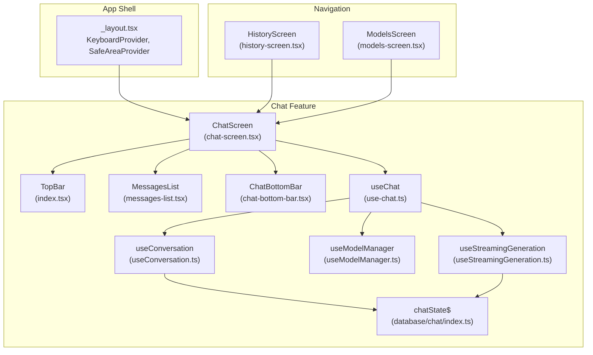
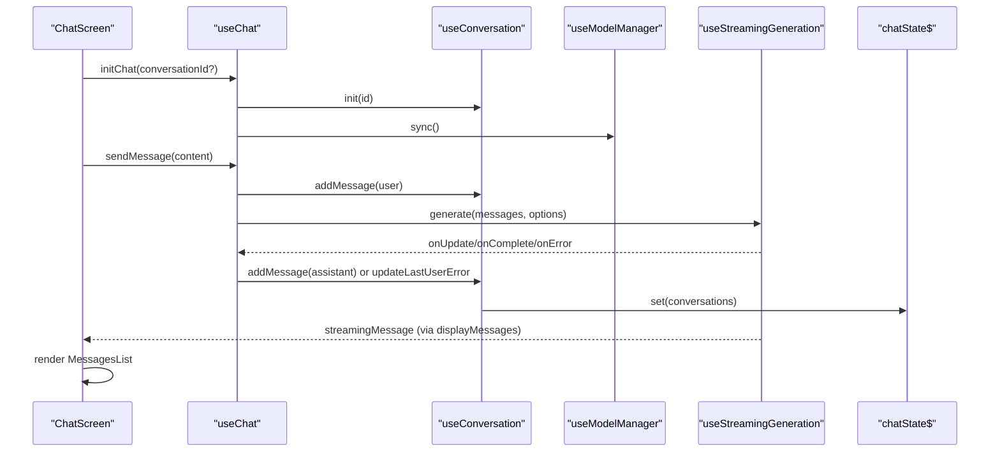
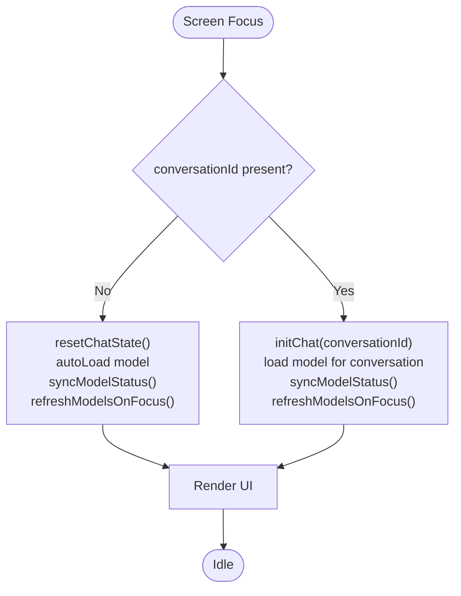
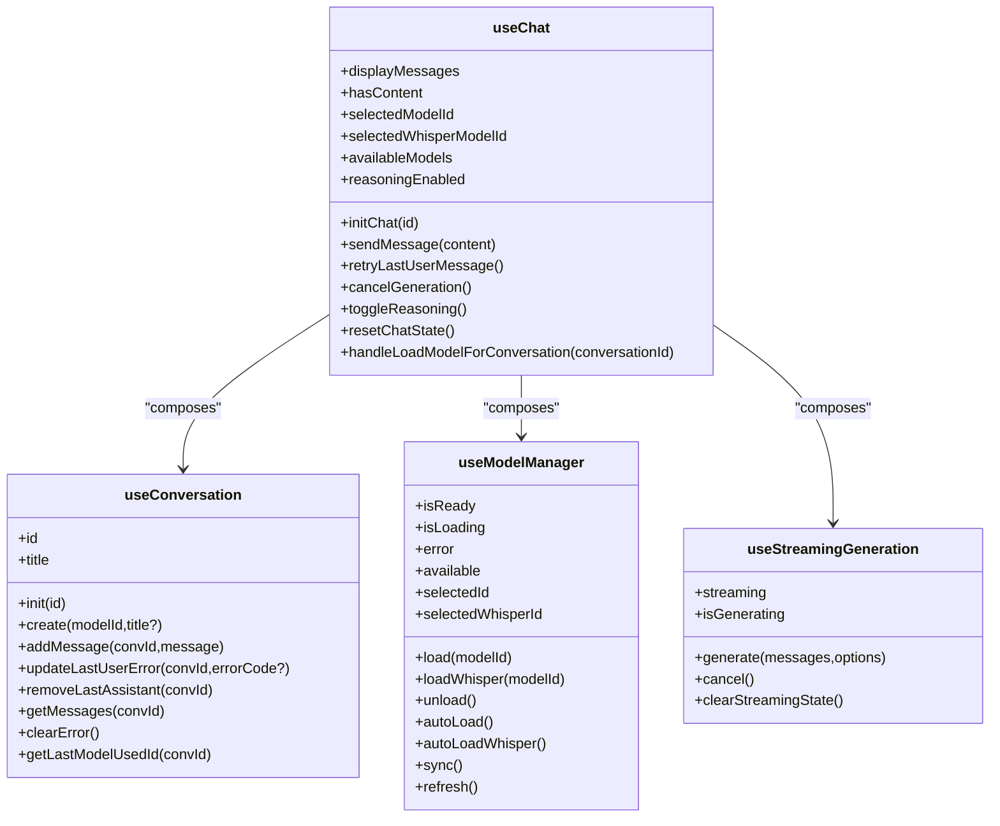
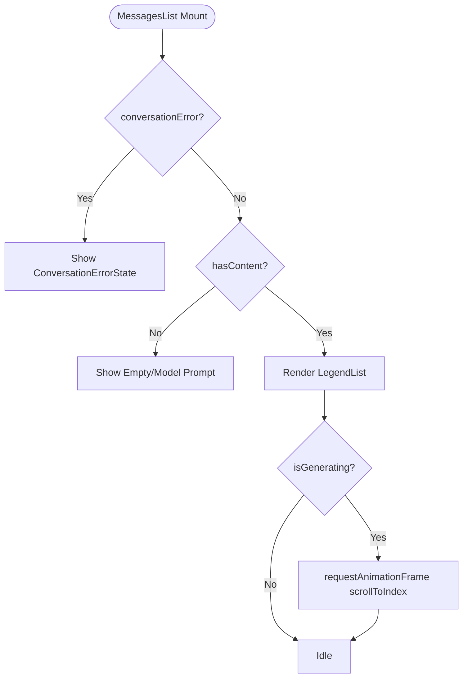
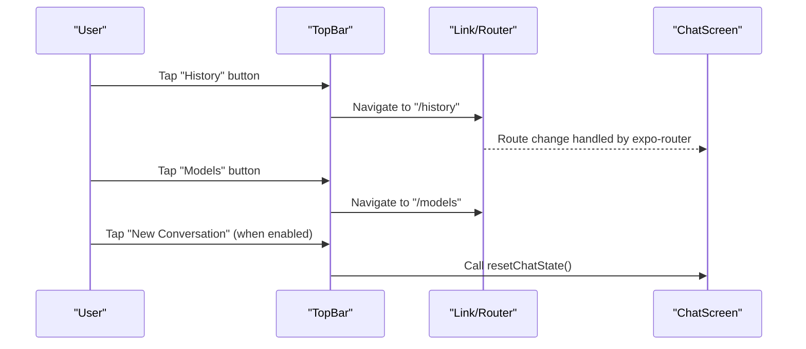
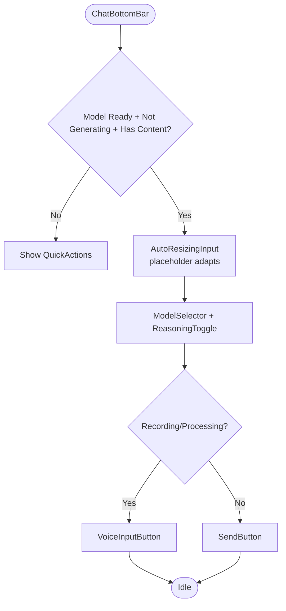
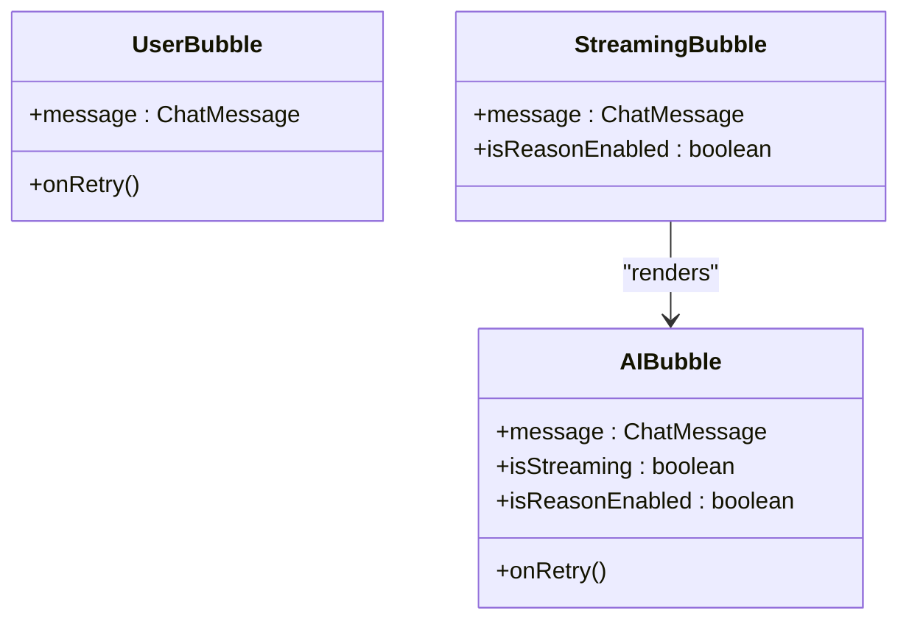
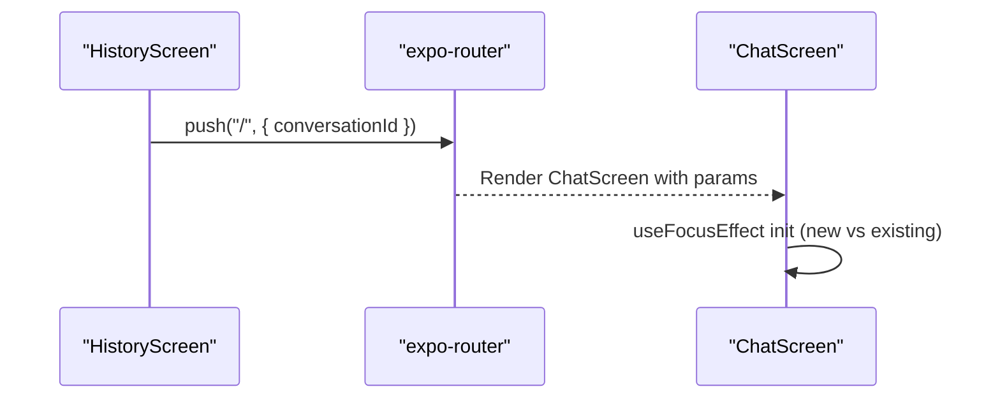
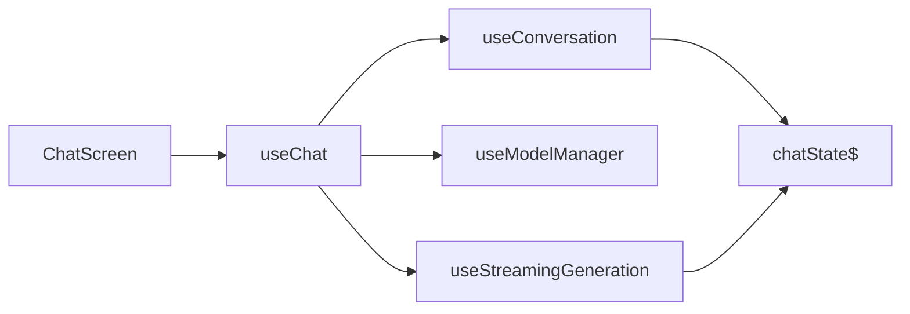

# Chat Screen Architecture

<cite>
**Referenced Files in This Document**
- [chat-screen.tsx](file://features/chat/view/chat-screen.tsx)
- [use-chat.ts](file://features/chat/view-model/use-chat.ts)
- [messages-list.tsx](file://features/chat/components/messages-list.tsx)
- [index.tsx](file://components/top-bar/index.tsx)
- [_layout.tsx](file://app/_layout.tsx)
- [useConversation.ts](file://features/chat/view-model/hooks/useConversation.ts)
- [useModelManager.ts](file://features/chat/view-model/hooks/useModelManager.ts)
- [useStreamingGeneration.ts](file://features/chat/view-model/hooks/useStreamingGeneration.ts)
- [chat/index.ts](file://database/chat/index.ts)
- [chat-bottom-bar.tsx](file://features/chat/components/chat-bottom-bar.tsx)
- [ai-bubble.tsx](file://features/chat/components/ai-bubble.tsx)
- [user-bubble.tsx](file://features/chat/components/user-bubble.tsx)
- [streaming-bubble.tsx](file://features/chat/components/streaming-bubble.tsx)
- [history-screen.tsx](file://features/history/view/history-screen.tsx)
- [models-screen.tsx](file://features/model-management/view/models-screen.tsx)
</cite>

## Table of Contents
1. [Introduction](#introduction)
2. [Project Structure](#project-structure)
3. [Core Components](#core-components)
4. [Architecture Overview](#architecture-overview)
5. [Detailed Component Analysis](#detailed-component-analysis)
6. [Dependency Analysis](#dependency-analysis)
7. [Performance Considerations](#performance-considerations)
8. [Troubleshooting Guide](#troubleshooting-guide)
9. [Conclusion](#conclusion)

## Introduction
This document explains the chat screen architecture and layout system. It covers the main ChatScreen component structure, the observer pattern implementation via @legendapp/state, keyboard avoidance configuration, responsive layout design, and integration with navigation and external components. It also documents the MessagesList component, focus effect management for conversation initialization, reactive state handling via the useChat hook, and platform-specific adaptations.

## Project Structure
The chat screen is organized around a view (ChatScreen) that orchestrates:
- A screen container with keyboard avoidance
- A TopBar with navigation links
- A MessagesList for conversation display
- A ChatBottomBar for input and controls
- Reactive state managed by useChat and underlying hooks

**Diagram sources**
- [_layout.tsx:12-50](file://app/_layout.tsx#L12-L50)
- [chat-screen.tsx:14-147](file://features/chat/view/chat-screen.tsx#L14-L147)
- [index.tsx:30-224](file://components/top-bar/index.tsx#L30-L224)
- [messages-list.tsx:29-160](file://features/chat/components/messages-list.tsx#L29-L160)
- [chat-bottom-bar.tsx:45-220](file://features/chat/components/chat-bottom-bar.tsx#L45-L220)
- [use-chat.ts:22-370](file://features/chat/view-model/use-chat.ts#L22-L370)
- [useConversation.ts:11-235](file://features/chat/view-model/hooks/useConversation.ts#L11-L235)
- [useModelManager.ts:14-216](file://features/chat/view-model/hooks/useModelManager.ts#L14-L216)
- [useStreamingGeneration.ts:39-164](file://features/chat/view-model/hooks/useStreamingGeneration.ts#L39-L164)
- [chat/index.ts:14-30](file://database/chat/index.ts#L14-L30)
- [history-screen.tsx:23-152](file://features/history/view/history-screen.tsx#L23-L152)
- [models-screen.tsx:8-77](file://features/model-management/view/models-screen.tsx#L8-L77)

**Section sources**
- [_layout.tsx:12-50](file://app/_layout.tsx#L12-L50)
- [chat-screen.tsx:14-147](file://features/chat/view/chat-screen.tsx#L14-L147)

## Core Components
- ChatScreen: Orchestrates the screen lifecycle, keyboard avoidance, TopBar integration, MessagesList, and ChatBottomBar. It initializes conversation state on focus and wires actions to useChat.
- useChat: Central reactive state manager composing useConversation, useModelManager, and useStreamingGeneration. Exposes computed values and action methods for messaging, model selection, and streaming.
- MessagesList: Renders conversation messages, handles scrolling, and displays empty/error states.
- TopBar: Provides navigation actions and accessibility labels for history and models.
- ChatBottomBar: Hosts input, model selector, reasoning toggle, voice input, and send/cancel controls.
- chatState$: Observable state persisted via MMKV for conversations, last model IDs, and reasoning flag.

**Section sources**
- [chat-screen.tsx:14-147](file://features/chat/view/chat-screen.tsx#L14-L147)
- [use-chat.ts:22-370](file://features/chat/view-model/use-chat.ts#L22-L370)
- [messages-list.tsx:29-160](file://features/chat/components/messages-list.tsx#L29-L160)
- [index.tsx:30-224](file://components/top-bar/index.tsx#L30-L224)
- [chat-bottom-bar.tsx:45-220](file://features/chat/components/chat-bottom-bar.tsx#L45-L220)
- [chat/index.ts:14-30](file://database/chat/index.ts#L14-L30)

## Architecture Overview
The chat screen follows a unidirectional reactive flow:
- UI triggers actions via ChatScreen and ChatBottomBar
- useChat coordinates model loading, conversation mutation, and streaming generation
- useConversation updates chatState$ immutably
- useStreamingGeneration streams tokens and emits completion/error callbacks
- MessagesList observes chatState$ via @legendapp/state and renders messages reactively

**Diagram sources**
- [chat-screen.tsx:85-91](file://features/chat/view/chat-screen.tsx#L85-L91)
- [use-chat.ts:101-183](file://features/chat/view-model/use-chat.ts#L101-L183)
- [useConversation.ts:53-120](file://features/chat/view-model/hooks/useConversation.ts#L53-L120)
- [useStreamingGeneration.ts:52-146](file://features/chat/view-model/hooks/useStreamingGeneration.ts#L52-L146)
- [chat/index.ts:14-30](file://database/chat/index.ts#L14-L30)

## Detailed Component Analysis

### ChatScreen: Layout, Keyboard Avoidance, and Focus Effects
- Screen container: Uses KeyboardAvoidingView from react-native-keyboard-controller with behavior padding and vertical offset for safe keyboard overlap avoidance.
- Gap spacing: Flex layout with gap configured at the container level.
- Background: Full-screen view with background class applied.
- TopBar integration: Displays conversation title and navigation actions:
  - Left action navigates to history with accessibility label.
  - Right action navigates to models and conditionally shows a “new conversation” button when content exists.
- MessagesList: Receives reactive displayMessages and rendering flags.
- ChatBottomBar: Wires input, send, cancel, model selection, and reasoning toggle.
- Focus effect: On focus, determines whether to initialize a new or existing conversation, loads model context, and refreshes model availability.

**Diagram sources**
- [chat-screen.tsx:24-53](file://features/chat/view/chat-screen.tsx#L24-L53)
- [use-chat.ts:256-285](file://features/chat/view-model/use-chat.ts#L256-L285)

**Section sources**
- [chat-screen.tsx:59-142](file://features/chat/view/chat-screen.tsx#L59-L142)
- [chat-screen.tsx:24-53](file://features/chat/view/chat-screen.tsx#L24-L53)
- [use-chat.ts:256-285](file://features/chat/view-model/use-chat.ts#L256-L285)

### useChat: Reactive State Composition and Message Flow
- Composes:
  - useConversation: manages conversation lifecycle and mutations
  - useModelManager: handles model readiness, loading, unloading, and availability
  - useStreamingGeneration: drives streaming inference with tool loop support
- Exposes:
  - Computed: displayMessages, hasContent, selected model IDs, reasoning flag
  - Actions: sendMessage, retryLastUserMessage, cancelGeneration, toggleReasoning, resetChatState, handleLoadModelForConversation
- Error handling:
  - Distinguishes ABORTED vs. partial-content errors and updates conversation state accordingly
- Tool integration:
  - Registers web search tool and executes tool calls during generation

**Diagram sources**
- [use-chat.ts:22-370](file://features/chat/view-model/use-chat.ts#L22-L370)
- [useConversation.ts:11-235](file://features/chat/view-model/hooks/useConversation.ts#L11-L235)
- [useModelManager.ts:14-216](file://features/chat/view-model/hooks/useModelManager.ts#L14-L216)
- [useStreamingGeneration.ts:39-164](file://features/chat/view-model/hooks/useStreamingGeneration.ts#L39-L164)

**Section sources**
- [use-chat.ts:22-370](file://features/chat/view-model/use-chat.ts#L22-L370)

### MessagesList: Conversation Display and Scrolling
- Observes chat.displayMessages and rendering flags
- Renders:
  - ConversationErrorState when a conversation error is present
  - Empty state when no messages and model is ready
  - LegendList with dynamic item rendering:
    - StreamingBubble for in-progress assistant messages
    - UserBubble for user messages with error indicators
    - AIBubble for assistant messages with reasoning and timing metadata
- Auto-scrolls to bottom when new streaming content arrives
- Shows a “scroll to bottom” button when scrolled up

**Diagram sources**
- [messages-list.tsx:35-54](file://features/chat/components/messages-list.tsx#L35-L54)
- [messages-list.tsx:74-118](file://features/chat/components/messages-list.tsx#L74-L118)
- [messages-list.tsx:120-160](file://features/chat/components/messages-list.tsx#L120-L160)

**Section sources**
- [messages-list.tsx:29-160](file://features/chat/components/messages-list.tsx#L29-L160)

### TopBar Integration and Navigation
- Left action navigates to history with accessibility label for assistive technologies.
- Right action includes:
  - Link to models screen
  - Conditional “new conversation” button that resets chat state
- Accessibility: Buttons include meaningful labels for screen readers.

**Diagram sources**
- [chat-screen.tsx:69-111](file://features/chat/view/chat-screen.tsx#L69-L111)
- [index.tsx:114-171](file://components/top-bar/index.tsx#L114-L171)

**Section sources**
- [chat-screen.tsx:69-111](file://features/chat/view/chat-screen.tsx#L69-L111)
- [index.tsx:30-224](file://components/top-bar/index.tsx#L30-L224)

### ChatBottomBar: Input, Controls, and Model Selection
- Input: AutoResizingInput with partial transcript display during voice recording
- Controls:
  - SendButton: enabled when model is ready and input is non-empty
  - Cancel: cancels ongoing generation
  - ModelSelector: chooses LLM and Whisper models
  - ReasoningToggle: toggles reasoning mode
- VoiceInputButton: optional voice input flow integrated via useVoiceInput
- Accessibility: Input has an accessibility label

**Diagram sources**
- [chat-bottom-bar.tsx:110-218](file://features/chat/components/chat-bottom-bar.tsx#L110-L218)

**Section sources**
- [chat-bottom-bar.tsx:45-220](file://features/chat/components/chat-bottom-bar.tsx#L45-L220)

### Message Rendering Components
- AIBubble: Renders assistant content with MarkdownStream, supports reasoning and streaming
- UserBubble: Renders user content with error badges and retry actions
- StreamingBubble: Thin wrapper rendering AIBubble in streaming mode

**Diagram sources**
- [ai-bubble.tsx:20-118](file://features/chat/components/ai-bubble.tsx#L20-L118)
- [user-bubble.tsx:20-67](file://features/chat/components/user-bubble.tsx#L20-L67)
- [streaming-bubble.tsx:18-25](file://features/chat/components/streaming-bubble.tsx#L18-L25)

**Section sources**
- [ai-bubble.tsx:20-118](file://features/chat/components/ai-bubble.tsx#L20-L118)
- [user-bubble.tsx:20-67](file://features/chat/components/user-bubble.tsx#L20-L67)
- [streaming-bubble.tsx:18-25](file://features/chat/components/streaming-bubble.tsx#L18-L25)

### Navigation Integration
- HistoryScreen: Links to ChatScreen with conversationId parameter; provides conversation list and actions.
- ModelsScreen: Provides model management and returns to ChatScreen.

**Diagram sources**
- [history-screen.tsx:35-40](file://features/history/view/history-screen.tsx#L35-L40)
- [chat-screen.tsx:20-53](file://features/chat/view/chat-screen.tsx#L20-L53)

**Section sources**
- [history-screen.tsx:23-152](file://features/history/view/history-screen.tsx#L23-L152)
- [models-screen.tsx:8-77](file://features/model-management/view/models-screen.tsx#L8-L77)

## Dependency Analysis
- ChatScreen depends on:
  - useChat for reactive state and actions
  - TopBar for navigation
  - MessagesList for display
  - ChatBottomBar for input
- useChat composes:
  - useConversation (mutates chatState$)
  - useModelManager (model lifecycle)
  - useStreamingGeneration (streaming pipeline)
- chatState$ is the single source of truth for conversations and preferences

**Diagram sources**
- [chat-screen.tsx:14-147](file://features/chat/view/chat-screen.tsx#L14-L147)
- [use-chat.ts:22-370](file://features/chat/view-model/use-chat.ts#L22-L370)
- [useConversation.ts:11-235](file://features/chat/view-model/hooks/useConversation.ts#L11-L235)
- [useModelManager.ts:14-216](file://features/chat/view-model/hooks/useModelManager.ts#L14-L216)
- [useStreamingGeneration.ts:39-164](file://features/chat/view-model/hooks/useStreamingGeneration.ts#L39-L164)
- [chat/index.ts:14-30](file://database/chat/index.ts#L14-L30)

**Section sources**
- [chat-screen.tsx:14-147](file://features/chat/view/chat-screen.tsx#L14-L147)
- [use-chat.ts:22-370](file://features/chat/view-model/use-chat.ts#L22-L370)

## Performance Considerations
- Streaming rendering: useStreamingGeneration updates UI incrementally, minimizing layout thrash.
- Memoization: useChat returns a memoized object to prevent unnecessary re-renders.
- Efficient list rendering: MessagesList uses LegendList with keyExtractor and throttled scroll events.
- Keyboard handling: KeyboardAvoidingView reduces layout shifts by reserving space for the keyboard.
- Model lifecycle: useModelManager avoids redundant loads and synchronizes readiness state.

[No sources needed since this section provides general guidance]

## Troubleshooting Guide
- Conversation not loading:
  - Verify conversationId param and existence in chatState$
  - Check initChat and handleLoadModelForConversation flows
- Model not ready:
  - Confirm autoLoad/autoLoadWhisper and sync status
  - Review modelError and available models
- Generation stuck:
  - Cancel generation and retry; inspect error handling paths
- Accessibility:
  - Ensure accessibility labels on navigation buttons and input field

**Section sources**
- [chat-screen.tsx:24-53](file://features/chat/view/chat-screen.tsx#L24-L53)
- [use-chat.ts:34-83](file://features/chat/view-model/use-chat.ts#L34-L83)
- [useModelManager.ts:97-126](file://features/chat/view-model/hooks/useModelManager.ts#L97-L126)
- [chat-bottom-bar.tsx:132-136](file://features/chat/components/chat-bottom-bar.tsx#L132-L136)

## Conclusion
The chat screen architecture leverages a reactive state composition centered on useChat, integrates keyboard-aware layouts, and provides robust navigation and accessibility. The modular design of MessagesList, TopBar, and ChatBottomBar enables maintainable enhancements while preserving responsiveness and usability across platforms.