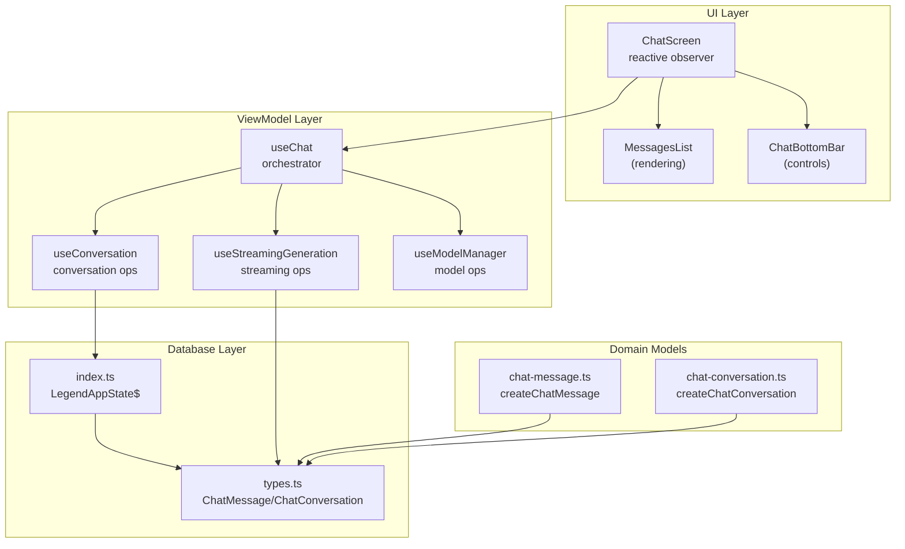
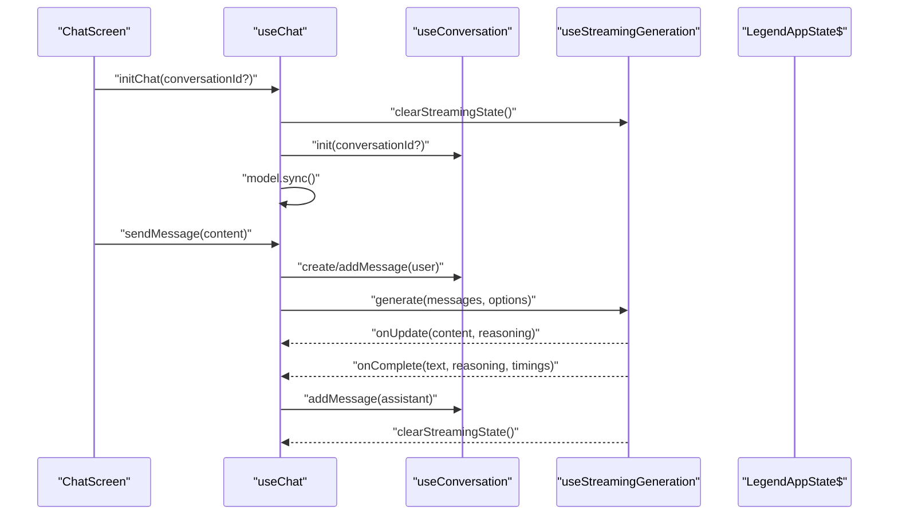
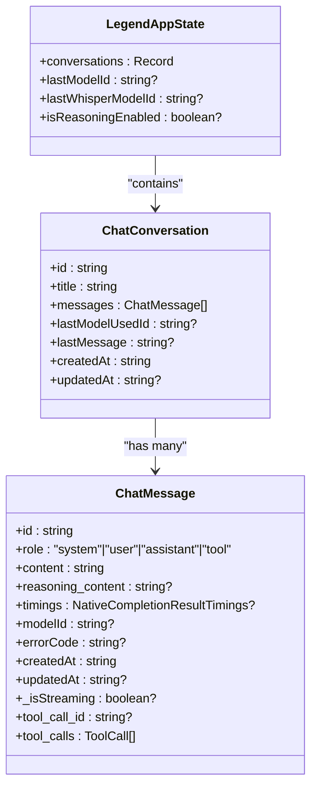
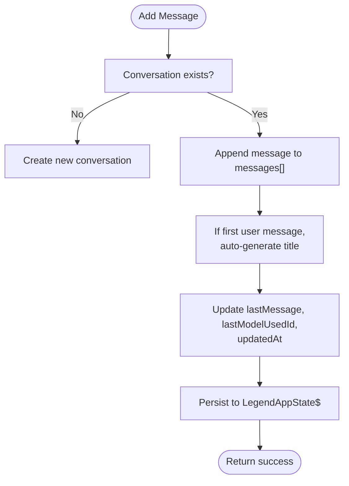
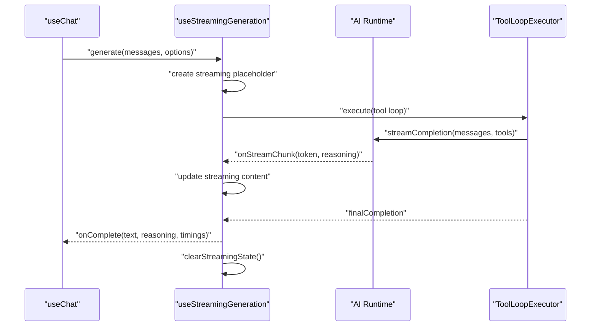
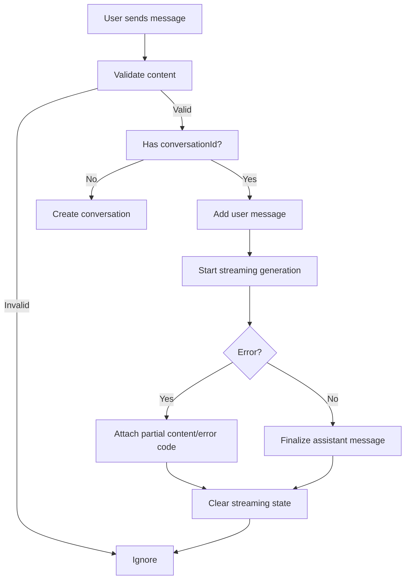
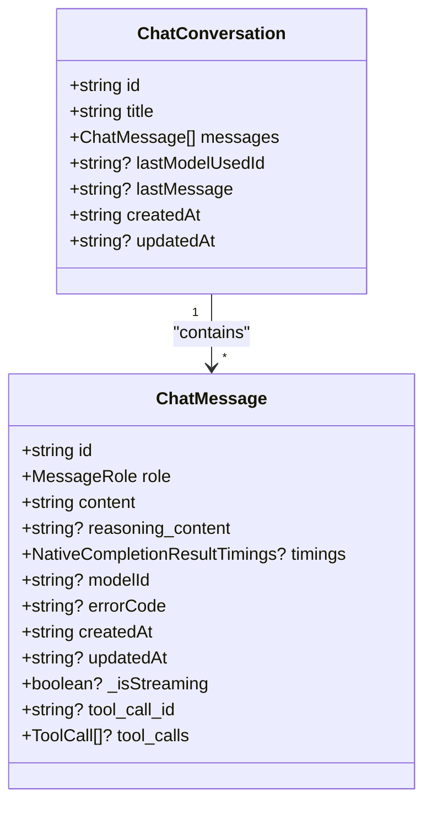
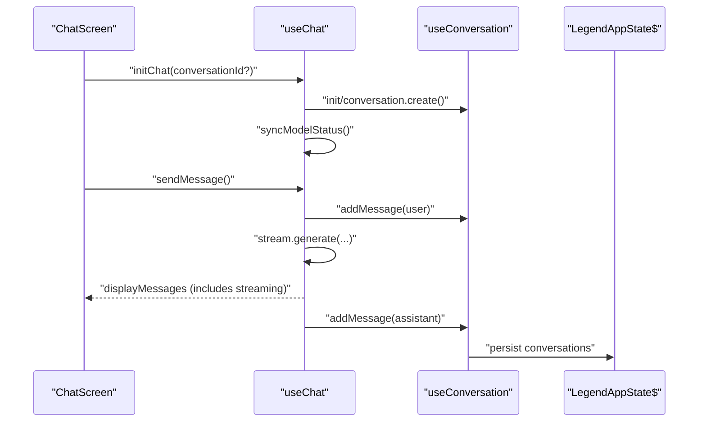
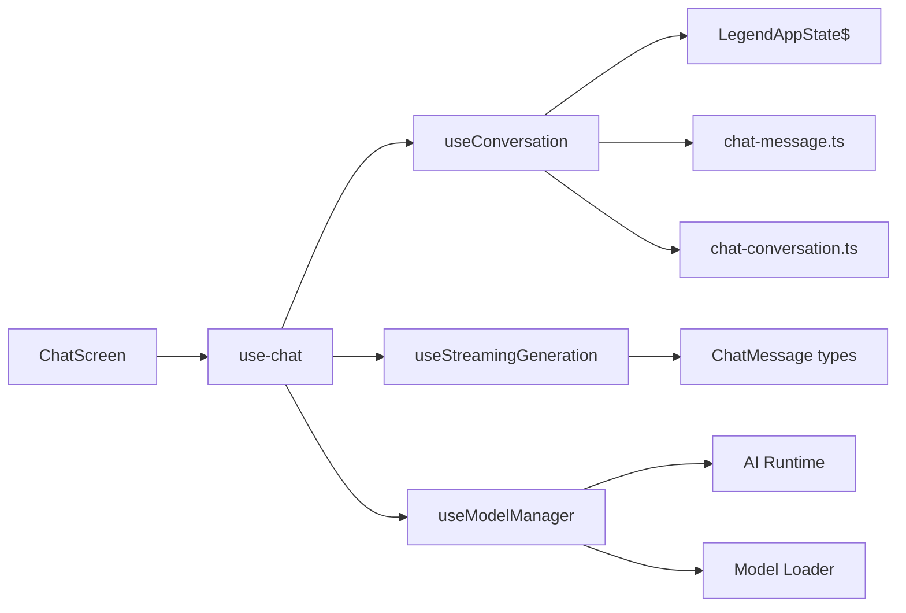

# Conversation State Management

<cite>
**Referenced Files in This Document**
- [use-chat.ts](file://features/chat/view-model/use-chat.ts)
- [useConversation.ts](file://features/chat/view-model/hooks/useConversation.ts)
- [useStreamingGeneration.ts](file://features/chat/view-model/hooks/useStreamingGeneration.ts)
- [useModelManager.ts](file://features/chat/view-model/hooks/useModelManager.ts)
- [chat-conversation.ts](file://features/chat/model/chat-conversation.ts)
- [chat-message.ts](file://features/chat/model/chat-message.ts)
- [types.ts](file://database/chat/types.ts)
- [index.ts](file://database/chat/index.ts)
- [chat-screen.tsx](file://features/chat/view/chat-screen.tsx)
- [use-history.ts](file://features/history/view-model/use-history.ts)
- [app-error.ts](file://shared/utils/app-error.ts)
</cite>

## Table of Contents
1. [Introduction](#introduction)
2. [Project Structure](#project-structure)
3. [Core Components](#core-components)
4. [Architecture Overview](#architecture-overview)
5. [Detailed Component Analysis](#detailed-component-analysis)
6. [Dependency Analysis](#dependency-analysis)
7. [Performance Considerations](#performance-considerations)
8. [Troubleshooting Guide](#troubleshooting-guide)
9. [Conclusion](#conclusion)

## Introduction
This document explains the conversation state management and data flow for the chat feature. It covers the use-chat ViewModel architecture, reactive state with LegendAppState, observable patterns, and state synchronization. It documents the ChatConversation and ChatMessage models, the conversation lifecycle, database integration for persistence, state synchronization between UI and backend services, error handling strategies, performance considerations for large histories, and reactive programming patterns used throughout the system.

## Project Structure
The chat state management spans several layers:
- Database layer: persistent state for conversations and preferences
- Models: lightweight factories for conversation and message creation
- View-models: orchestrate state transitions, integrate services, and expose reactive bindings
- UI screens: subscribe to reactive state and render lists and controls

**Diagram sources**
- [chat-screen.tsx:14-147](file://features/chat/view/chat-screen.tsx#L14-L147)
- [use-chat.ts:22-370](file://features/chat/view-model/use-chat.ts#L22-L370)
- [useConversation.ts:11-235](file://features/chat/view-model/hooks/useConversation.ts#L11-L235)
- [useStreamingGeneration.ts:39-164](file://features/chat/view-model/hooks/useStreamingGeneration.ts#L39-L164)
- [useModelManager.ts:14-216](file://features/chat/view-model/hooks/useModelManager.ts#L14-L216)
- [chat-message.ts:5-37](file://features/chat/model/chat-message.ts#L5-L37)
- [chat-conversation.ts:12-44](file://features/chat/model/chat-conversation.ts#L12-L44)
- [types.ts:5-30](file://database/chat/types.ts#L5-L30)
- [index.ts:14-30](file://database/chat/index.ts#L14-L30)

**Section sources**
- [chat-screen.tsx:14-147](file://features/chat/view/chat-screen.tsx#L14-L147)
- [use-chat.ts:22-370](file://features/chat/view-model/use-chat.ts#L22-L370)
- [index.ts:14-30](file://database/chat/index.ts#L14-L30)

## Core Components
- LegendAppState$ (database/chat/index.ts): Central reactive state holding conversations, last model IDs, and reasoning flag. Persisted via MMKV with automatic synchronization.
- useConversation (database operations): Initializes, creates, adds messages, updates titles, manages errors, and retrieves messages reactively.
- useStreamingGeneration (streaming): Manages streaming assistant messages, cancellation, and tool loop integration.
- useModelManager (model lifecycle): Loads/unloads models, auto-loads last used models, and synchronizes with runtime.
- useChat (orchestrator): Coordinates messaging, retries, error handling, and exposes a normalized UI surface.
- Models: chat-conversation.ts and chat-message.ts provide creation helpers for conversation metadata and message structure.

Key reactive patterns:
- useValue and observer subscribe UI to LegendAppState$ changes.
- useMemo memoizes derived UI state from reactive sources.
- useCallback ensures stable references for event handlers.

**Section sources**
- [index.ts:14-30](file://database/chat/index.ts#L14-L30)
- [useConversation.ts:11-235](file://features/chat/view-model/hooks/useConversation.ts#L11-L235)
- [useStreamingGeneration.ts:39-164](file://features/chat/view-model/hooks/useStreamingGeneration.ts#L39-L164)
- [useModelManager.ts:14-216](file://features/chat/view-model/hooks/useModelManager.ts#L14-L216)
- [use-chat.ts:22-370](file://features/chat/view-model/use-chat.ts#L22-L370)
- [chat-conversation.ts:12-44](file://features/chat/model/chat-conversation.ts#L12-L44)
- [chat-message.ts:5-37](file://features/chat/model/chat-message.ts#L5-L37)

## Architecture Overview
The system uses a layered reactive architecture:
- UI subscribes to reactive state via observer and useValue.
- useChat orchestrates user actions, delegates to useConversation and useStreamingGeneration, and coordinates model loading.
- LegendAppState$ persists and synchronizes state across sessions.

**Diagram sources**
- [chat-screen.tsx:24-53](file://features/chat/view/chat-screen.tsx#L24-L53)
- [use-chat.ts:85-183](file://features/chat/view-model/use-chat.ts#L85-L183)
- [useConversation.ts:16-51](file://features/chat/view-model/hooks/useConversation.ts#L16-L51)
- [useStreamingGeneration.ts:52-146](file://features/chat/view-model/hooks/useStreamingGeneration.ts#L52-L146)
- [index.ts:14-30](file://database/chat/index.ts#L14-L30)

## Detailed Component Analysis

### LegendAppState$ and Persistence
- Structure: holds conversations map, last model IDs, reasoning flag.
- Persistence: synced with MMKV, retry on sync failure, named store for chat conversations.
- Reactive: exported as Observable and consumed by UI via useValue.

**Diagram sources**
- [index.ts:7-12](file://database/chat/index.ts#L7-L12)
- [types.ts:5-30](file://database/chat/types.ts#L5-L30)

**Section sources**
- [index.ts:14-30](file://database/chat/index.ts#L14-L30)
- [types.ts:5-30](file://database/chat/types.ts#L5-L30)

### useConversation: Reactive Conversation Operations
Responsibilities:
- Initialization: fallback to a default conversation when none is provided.
- Creation: generates a new conversation with UUID, title, empty messages, and timestamps.
- Adding messages: updates messages, auto-generates title on first user message, tracks last model used, and timestamps.
- Error propagation: attaches errorCode to the last user message.
- Retrieval: returns messages for a given conversation ID.
- Cleanup helpers: removes last assistant message for retry flows.

**Diagram sources**
- [useConversation.ts:53-120](file://features/chat/view-model/hooks/useConversation.ts#L53-L120)
- [chat-conversation.ts:12-23](file://features/chat/model/chat-conversation.ts#L12-L23)

**Section sources**
- [useConversation.ts:16-120](file://features/chat/view-model/hooks/useConversation.ts#L16-L120)
- [chat-conversation.ts:12-23](file://features/chat/model/chat-conversation.ts#L12-L23)

### useStreamingGeneration: Streaming Assistant Messages
Responsibilities:
- Creates a streaming placeholder message with a fixed timestamp.
- Streams tokens and reasoning chunks, updating the streaming message in real time.
- Integrates tool loop execution with configurable timeouts and concurrency.
- Completes by converting the streaming message into a finalized assistant message and invoking callbacks.
- Supports cancellation via AbortController.

**Diagram sources**
- [use-chat.ts:101-183](file://features/chat/view-model/use-chat.ts#L101-L183)
- [useStreamingGeneration.ts:52-146](file://features/chat/view-model/hooks/useStreamingGeneration.ts#L52-L146)
- [useStreamingGeneration.ts:166-274](file://features/chat/view-model/hooks/useStreamingGeneration.ts#L166-L274)

**Section sources**
- [useStreamingGeneration.ts:39-164](file://features/chat/view-model/hooks/useStreamingGeneration.ts#L39-L164)
- [use-chat.ts:101-183](file://features/chat/view-model/use-chat.ts#L101-L183)

### useModelManager: Model Lifecycle and Synchronization
Responsibilities:
- Load/unload models and track readiness.
- Auto-load last used model or Whisper model.
- Sync with runtime to reflect current model selection and availability.
- Expose selected model IDs and available models.

**Section sources**
- [useModelManager.ts:14-216](file://features/chat/view-model/hooks/useModelManager.ts#L14-L216)

### useChat: Orchestrator ViewModel
Responsibilities:
- Validates input and ensures model readiness.
- Initializes chat session, loads appropriate model for conversation, and clears streaming state.
- Sends user messages, triggers streaming generation, and handles partial results on errors.
- Provides retry, cancel, and reset capabilities.
- Exposes reactive UI surface including display messages, model status, and reasoning toggle.

**Diagram sources**
- [use-chat.ts:101-183](file://features/chat/view-model/use-chat.ts#L101-L183)
- [use-chat.ts:34-83](file://features/chat/view-model/use-chat.ts#L34-L83)

**Section sources**
- [use-chat.ts:22-370](file://features/chat/view-model/use-chat.ts#L22-L370)

### Models: ChatConversation and ChatMessage
- ChatConversation: UUID, title, messages array, last model used, timestamps, and optional last message preview.
- ChatMessage: UUID, role, content, optional reasoning, timings, modelId, error code, timestamps, streaming flag, and tool-related fields.

**Diagram sources**
- [types.ts:5-30](file://database/chat/types.ts#L5-L30)

**Section sources**
- [chat-conversation.ts:12-44](file://features/chat/model/chat-conversation.ts#L12-L44)
- [chat-message.ts:5-37](file://features/chat/model/chat-message.ts#L5-L37)
- [types.ts:5-30](file://database/chat/types.ts#L5-L30)

### UI Integration and State Synchronization
- ChatScreen initializes and resets state on focus, loads models per conversation, and renders messages and bottom bar.
- Uses observer to subscribe to reactive state and reacts to changes in conversations, streaming, and model status.
- MessagesList receives the reactive displayMessages computed by useChat, including a temporary streaming bubble when generating.

**Diagram sources**
- [chat-screen.tsx:24-53](file://features/chat/view/chat-screen.tsx#L24-L53)
- [use-chat.ts:85-183](file://features/chat/view-model/use-chat.ts#L85-L183)
- [useConversation.ts:53-120](file://features/chat/view-model/hooks/useConversation.ts#L53-L120)
- [index.ts:14-30](file://database/chat/index.ts#L14-L30)

**Section sources**
- [chat-screen.tsx:14-147](file://features/chat/view/chat-screen.tsx#L14-L147)
- [use-chat.ts:287-297](file://features/chat/view-model/use-chat.ts#L287-L297)

## Dependency Analysis
- useChat depends on useConversation, useStreamingGeneration, and useModelManager.
- useConversation writes to LegendAppState$ and reads from it.
- useStreamingGeneration integrates with AI runtime and tool loop executor.
- useModelManager interacts with model loader and runtime.
- UI components depend on reactive bindings from useChat and useValue.

**Diagram sources**
- [use-chat.ts:22-110](file://features/chat/view-model/use-chat.ts#L22-L110)
- [useConversation.ts:11-51](file://features/chat/view-model/hooks/useConversation.ts#L11-L51)
- [useStreamingGeneration.ts:39-164](file://features/chat/view-model/hooks/useStreamingGeneration.ts#L39-L164)
- [useModelManager.ts:14-216](file://features/chat/view-model/hooks/useModelManager.ts#L14-L216)
- [chat-message.ts:5-37](file://features/chat/model/chat-message.ts#L5-L37)
- [chat-conversation.ts:12-23](file://features/chat/model/chat-conversation.ts#L12-L23)
- [chat-screen.tsx:14-147](file://features/chat/view/chat-screen.tsx#L14-L147)

**Section sources**
- [use-chat.ts:22-110](file://features/chat/view-model/use-chat.ts#L22-L110)
- [useConversation.ts:11-51](file://features/chat/view-model/hooks/useConversation.ts#L11-L51)
- [useStreamingGeneration.ts:39-164](file://features/chat/view-model/hooks/useStreamingGeneration.ts#L39-L164)
- [useModelManager.ts:14-216](file://features/chat/view-model/hooks/useModelManager.ts#L14-L216)
- [chat-screen.tsx:14-147](file://features/chat/view/chat-screen.tsx#L14-L147)

## Performance Considerations
- Streaming rendering: The UI displays a temporary streaming message while generating, avoiding full re-renders until completion.
- Minimal state updates: useConversation updates only necessary fields (messages, title, timestamps) and uses immutable updates to preserve referential equality where possible.
- Memoization: useChat memoizes displayMessages and UI surface to prevent unnecessary re-renders.
- Large histories: Prefer pagination or trimming strategies at the UI level; avoid rendering the entire history in a single list when possible.
- Memory management: unload models when not in use via useModelManager; cancel generation to free resources promptly.
- Persistence overhead: Persisting to MMKV is efficient; avoid frequent writes by batching updates where feasible.

[No sources needed since this section provides general guidance]

## Troubleshooting Guide
Common scenarios and strategies:
- Network/model loading failures: useModelManager surfaces errors; display a toast and allow retry or unload/load operations.
- Generation errors: useChat’s handleGenerationError attaches partial content or error markers to the last assistant message; supports retryLastUserMessage.
- Conversation not found: useConversation falls back to creating a new conversation; ensure conversationId is valid before init.
- History corruption: use-history validates existence before deletion/rename and updates timestamps; ensure consistent writes to LegendAppState$.

Error types and handling:
- Standardized error codes and result types are defined for consistent handling across services and view models.

**Section sources**
- [use-chat.ts:34-83](file://features/chat/view-model/use-chat.ts#L34-L83)
- [useModelManager.ts:32-95](file://features/chat/view-model/hooks/useModelManager.ts#L32-L95)
- [useConversation.ts:53-120](file://features/chat/view-model/hooks/useConversation.ts#L53-L120)
- [use-history.ts:20-83](file://features/history/view-model/use-history.ts#L20-L83)
- [app-error.ts:8-94](file://shared/utils/app-error.ts#L8-L94)

## Conclusion
The chat state management system leverages a reactive architecture centered on LegendAppState$, with clear separation of concerns across useConversation, useStreamingGeneration, useModelManager, and useChat. The ChatConversation and ChatMessage models define a robust structure for metadata, content, and tooling. Persistence is handled transparently via MMKV, and UI components subscribe to reactive state for seamless synchronization. Error handling is centralized, and performance is optimized through streaming, memoization, and careful resource management.