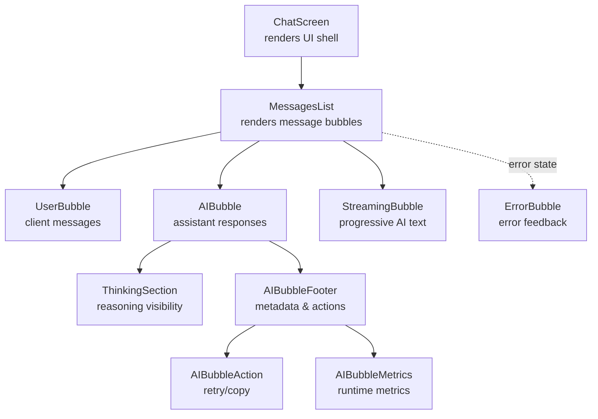
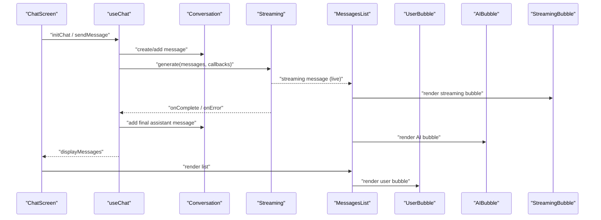
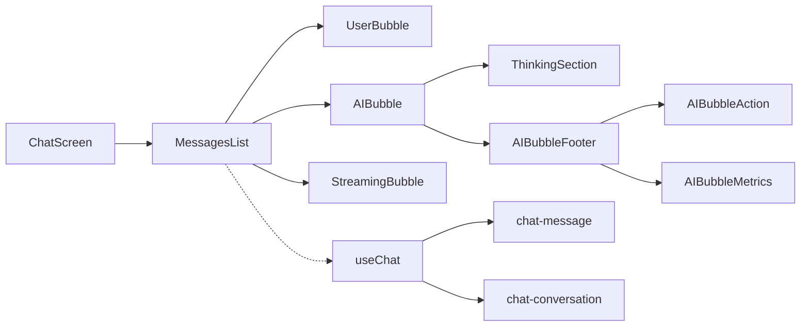

# Message Components and Display

<cite>
**Referenced Files in This Document**
- [chat-screen.tsx](file://features/chat/view/chat-screen.tsx)
- [messages-list.tsx](file://features/chat/components/messages-list.tsx)
- [ai-bubble.tsx](file://features/chat/components/ai-bubble.tsx)
- [user-bubble.tsx](file://features/chat/components/user-bubble.tsx)
- [streaming-bubble.tsx](file://features/chat/components/streaming-bubble.tsx)
- [error-bubble.tsx](file://features/chat/components/error-bubble.tsx)
- [thinking-section.tsx](file://features/chat/components/thinking-section.tsx)
- [streaming-text.tsx](file://features/chat/components/streaming-text.tsx)
- [ai-bubble-footer.tsx](file://features/chat/components/ai-bubble-footer.tsx)
- [ai-bubble-action.tsx](file://features/chat/components/ai-bubble-action.tsx)
- [ai-bubble-metrics.tsx](file://features/chat/components/ai-bubble-metrics.tsx)
- [use-chat.ts](file://features/chat/view-model/use-chat.ts)
- [chat-conversation.ts](file://features/chat/model/chat-conversation.ts)
- [chat-message.ts](file://features/chat/model/chat-message.ts)
</cite>

## Table of Contents
1. [Introduction](#introduction)
2. [Project Structure](#project-structure)
3. [Core Components](#core-components)
4. [Architecture Overview](#architecture-overview)
5. [Detailed Component Analysis](#detailed-component-analysis)
6. [Dependency Analysis](#dependency-analysis)
7. [Performance Considerations](#performance-considerations)
8. [Troubleshooting Guide](#troubleshooting-guide)
9. [Conclusion](#conclusion)
10. [Appendices](#appendices)

## Introduction
This document explains the message display system used in the chat interface. It focuses on how assistant responses, user messages, streaming updates, and error states are rendered, styled, and integrated into the conversation flow. It also covers the bubble positioning system, message threading, styling architecture with Tailwind classes, responsive design considerations, accessibility features, component composition patterns, prop interfaces, and performance optimizations for large conversations.

## Project Structure
The chat UI is composed of a screen that renders a list of messages, which are individual “bubble” components. The view-model orchestrates message creation, streaming, and error handling, while the list component decides which bubble to render based on message metadata.

**Diagram sources**
- [chat-screen.tsx:59-142](file://features/chat/view/chat-screen.tsx#L59-L142)
- [messages-list.tsx:120-159](file://features/chat/components/messages-list.tsx#L120-L159)
- [user-bubble.tsx:20-58](file://features/chat/components/user-bubble.tsx#L20-L58)
- [ai-bubble.tsx:20-118](file://features/chat/components/ai-bubble.tsx#L20-L118)
- [streaming-bubble.tsx:18-25](file://features/chat/components/streaming-bubble.tsx#L18-L25)
- [thinking-section.tsx:21-114](file://features/chat/components/thinking-section.tsx#L21-L114)
- [ai-bubble-footer.tsx:24-61](file://features/chat/components/ai-bubble-footer.tsx#L24-L61)
- [ai-bubble-action.tsx:7-29](file://features/chat/components/ai-bubble-action.tsx#L7-L29)
- [ai-bubble-metrics.tsx:19-162](file://features/chat/components/ai-bubble-metrics.tsx#L19-L162)
- [error-bubble.tsx:17-49](file://features/chat/components/error-bubble.tsx#L17-L49)

**Section sources**
- [chat-screen.tsx:14-147](file://features/chat/view/chat-screen.tsx#L14-L147)
- [messages-list.tsx:29-160](file://features/chat/components/messages-list.tsx#L29-L160)

## Core Components
- MessagesList: Renders the conversation list, handles scroll behavior, and selects the appropriate bubble for each message. It integrates streaming state into the display list.
- UserBubble: Renders client messages with optional inline error indicators and retry actions.
- AIBubble: Renders assistant responses, supports markdown rendering, reasoning visibility, and streaming-specific presentation.
- StreamingBubble: Thin wrapper around AIBubble to render live assistant content during generation.
- ErrorBubble: Dedicated component for error notifications with a retry action.
- ThinkingSection: Optional reasoning panel with expand/collapse animation and placeholder states.
- StreamingText: Low-level streaming text renderer with typing animation and bottom-alignment for fixed-height containers.
- AIBubbleFooter, AIBubbleAction, AIBubbleMetrics: Subcomponents that provide metadata, actions, and runtime metrics.

**Section sources**
- [messages-list.tsx:29-160](file://features/chat/components/messages-list.tsx#L29-L160)
- [user-bubble.tsx:20-68](file://features/chat/components/user-bubble.tsx#L20-L68)
- [ai-bubble.tsx:20-119](file://features/chat/components/ai-bubble.tsx#L20-L119)
- [streaming-bubble.tsx:18-26](file://features/chat/components/streaming-bubble.tsx#L18-L26)
- [error-bubble.tsx:17-50](file://features/chat/components/error-bubble.tsx#L17-L50)
- [thinking-section.tsx:21-116](file://features/chat/components/thinking-section.tsx#L21-L116)
- [streaming-text.tsx:28-114](file://features/chat/components/streaming-text.tsx#L28-L114)
- [ai-bubble-footer.tsx:24-70](file://features/chat/components/ai-bubble-footer.tsx#L24-L70)
- [ai-bubble-action.tsx:7-31](file://features/chat/components/ai-bubble-action.tsx#L7-L31)
- [ai-bubble-metrics.tsx:19-163](file://features/chat/components/ai-bubble-metrics.tsx#L19-L163)

## Architecture Overview
The chat flow is orchestrated by the view-model hook, which manages conversation state, model loading, streaming generation, and error handling. The screen passes the computed displayMessages to the list, which conditionally renders user, AI, or streaming bubbles.

**Diagram sources**
- [chat-screen.tsx:14-147](file://features/chat/view/chat-screen.tsx#L14-L147)
- [use-chat.ts:101-183](file://features/chat/view-model/use-chat.ts#L101-L183)
- [messages-list.tsx:120-159](file://features/chat/components/messages-list.tsx#L120-L159)
- [streaming-bubble.tsx:18-25](file://features/chat/components/streaming-bubble.tsx#L18-L25)
- [user-bubble.tsx:20-58](file://features/chat/components/user-bubble.tsx#L20-L58)
- [ai-bubble.tsx:20-118](file://features/chat/components/ai-bubble.tsx#L20-L118)

## Detailed Component Analysis

### AI Bubble Component
Purpose: Render assistant messages with markdown support, optional reasoning panel, timestamps, and actions.

Key behaviors:
- Parses content into completed and current lines when streaming to animate the last line.
- Uses theme-aware text colors and muted colors derived from user preferences.
- Integrates ThinkingSection when reasoning is present or enabled during streaming.
- Renders footer with model name, timestamp, metrics, and action buttons.

Prop interface:
- message: ChatMessage
- isStreaming?: boolean
- isReasonEnabled?: boolean
- onRetry?: () => void

Rendering logic highlights:
- When streaming and no content yet, shows a spinner/indicator.
- When streaming, displays completed markdown and a caret indicator for the in-progress line.
- When finalized, renders full markdown with copy-to-clipboard capability.

Accessibility:
- Footer uses an accordion for metadata, enabling keyboard navigation.
- Copy action is exposed via a button with accessible icons.

Styling architecture:
- Tailwind classes define padding, max-width, rounded corners, and color roles.
- Theme colors adapt to light/dark mode via user preferences.

Performance:
- Memoized parsing of streaming content avoids unnecessary re-renders.
- Markdown rendering is optimized for incremental updates.

**Section sources**
- [ai-bubble.tsx:20-119](file://features/chat/components/ai-bubble.tsx#L20-L119)
- [ai-bubble-footer.tsx:24-70](file://features/chat/components/ai-bubble-footer.tsx#L24-L70)
- [ai-bubble-action.tsx:7-31](file://features/chat/components/ai-bubble-action.tsx#L7-L31)
- [ai-bubble-metrics.tsx:19-163](file://features/chat/components/ai-bubble-metrics.tsx#L19-L163)
- [thinking-section.tsx:21-116](file://features/chat/components/thinking-section.tsx#L21-L116)

### User Bubble Component
Purpose: Render client messages with optional inline error state and retry action.

Key behaviors:
- Displays user content in a rounded bubble with primary color scheme.
- Shows an error banner below the message when errorCode is present, with localized labels.
- Provides a retry button bound to the parent’s retry callback.
- Shows a timestamp in a muted color.

Prop interface:
- message: ChatMessage
- onRetry?: () => void

Styling architecture:
- Uses primary background with primary foreground text.
- Error banner uses destructive palette with bordered styling.

Accessibility:
- Retry button is accessible with explicit label.
- Text is selectable for copying.

**Section sources**
- [user-bubble.tsx:20-68](file://features/chat/components/user-bubble.tsx#L20-L68)

### Streaming Bubble Component
Purpose: Render assistant messages in real-time during generation.

Key behaviors:
- Thin wrapper around AIBubble that sets isStreaming flag.
- Delegates all rendering to AIBubble, inheriting markdown, reasoning, and footer behaviors.

Prop interface:
- message: ChatMessage
- isReasonEnabled?: boolean

Integration:
- MessagesList injects a special streaming message into displayMessages while generation is ongoing.

**Section sources**
- [streaming-bubble.tsx:18-26](file://features/chat/components/streaming-bubble.tsx#L18-L26)
- [messages-list.tsx:127-131](file://features/chat/components/messages-list.tsx#L127-L131)

### Error Bubble Component
Purpose: Display error notifications as standalone bubbles with a retry action.

Key behaviors:
- Shows an icon, title, and message in a destructive-themed container.
- Includes a retry button with accessible label and icon.

Prop interface:
- message: string
- onRetry: () => void

Styling architecture:
- Destructive background with subtle borders and rounded corners.
- Self-contained layout with horizontal spacing.

**Section sources**
- [error-bubble.tsx:17-50](file://features/chat/components/error-bubble.tsx#L17-L50)

### Thinking Section Component
Purpose: Optional reasoning panel that can be toggled to show assistant reasoning.

Key behaviors:
- Expands/collapses with animated chevron rotation.
- Auto-scrolls to end when collapsing to keep latest content visible.
- Shows a pulsing placeholder when streaming but no reasoning text yet.

Prop interface:
- reasoning_content: string
- isStreaming?: boolean

Accessibility:
- Toggle button has explicit aria-labels for expanded/collapsed states.

**Section sources**
- [thinking-section.tsx:21-116](file://features/chat/components/thinking-section.tsx#L21-L116)

### Streaming Text Component
Purpose: Low-level streaming text renderer with typing animation and fixed-height bottom-alignment.

Key behaviors:
- Detects append-only changes and simulates typing by revealing characters at a configurable speed.
- Supports numberOfLines to constrain height and align content to the bottom.
- Clears timers on unmount and when text changes unexpectedly.

Prop interface:
- text: string
- className?: string
- selectable?: boolean
- numberOfLines?: number
- typingSpeed?: number

Use cases:
- Can be used inside bubbles for fine-grained control over text rendering.

**Section sources**
- [streaming-text.tsx:28-114](file://features/chat/components/streaming-text.tsx#L28-L114)

### Bubble Positioning, Threading, and Conversation Flow
Positioning:
- User messages are right-aligned in a self-end container.
- Assistant messages are left-aligned in a self-start container.
- Max widths are constrained to prevent overflow.

Threading:
- Messages are ordered chronologically.
- The view-model adds user messages first, then streams or completes assistant replies.
- Error states can be injected as assistant messages with special suffixes.

Conversation flow visualization:
- MessagesList uses a virtualized list to render efficiently.
- Scroll behavior automatically scrolls to the bottom when new content arrives during generation.
- A floating “scroll to bottom” button appears when the user scrolls up.

**Section sources**
- [messages-list.tsx:120-159](file://features/chat/components/messages-list.tsx#L120-L159)
- [chat-screen.tsx:59-142](file://features/chat/view/chat-screen.tsx#L59-L142)

### Styling Architecture and Responsive Design
Styling architecture:
- Tailwind classes define spacing, colors, borders, shadows, and responsive constraints.
- Color roles use semantic names (primary, destructive, muted) with opacity variants for subtle accents.
- Max widths and padding are applied to maintain readability and avoid horizontal scrolling.

Responsive considerations:
- Flexible containers with padding and constrained widths adapt to various screen sizes.
- Fixed-height reasoning preview uses bottom-alignment to preserve content visibility.

Accessibility:
- Buttons and interactive elements expose accessibility labels.
- Text is selectable for copying.
- Accordions and tooltips provide keyboard-friendly navigation.

**Section sources**
- [user-bubble.tsx:26-58](file://features/chat/components/user-bubble.tsx#L26-L58)
- [ai-bubble.tsx:62-117](file://features/chat/components/ai-bubble.tsx#L62-L117)
- [thinking-section.tsx:56-114](file://features/chat/components/thinking-section.tsx#L56-L114)
- [ai-bubble-footer.tsx:34-61](file://features/chat/components/ai-bubble-footer.tsx#L34-L61)

### Component Composition Patterns and Prop Interfaces
Composition patterns:
- MessagesList composes UserBubble, AIBubble, and StreamingBubble based on message metadata.
- AIBubble composes ThinkingSection, AIBubbleFooter, and AIBubbleAction.
- AIBubbleFooter composes AIBubbleMetrics and AIBubbleAction.

Prop interfaces:
- MessagesList: receives displayMessages, generation state, and callbacks.
- UserBubble: receives message and onRetry.
- AIBubble: receives message, isStreaming, isReasonEnabled, onRetry.
- StreamingBubble: receives message and isReasonEnabled.
- ErrorBubble: receives message string and onRetry.
- ThinkingSection: receives reasoning_content and isStreaming.
- AIBubbleFooter: receives model info, timings, and actions.
- AIBubbleAction: receives onRetry and onCopy.
- AIBubbleMetrics: receives runtime timings.

**Section sources**
- [messages-list.tsx:15-27](file://features/chat/components/messages-list.tsx#L15-L27)
- [user-bubble.tsx:8-11](file://features/chat/components/user-bubble.tsx#L8-L11)
- [ai-bubble.tsx:13-18](file://features/chat/components/ai-bubble.tsx#L13-L18)
- [streaming-bubble.tsx:13-16](file://features/chat/components/streaming-bubble.tsx#L13-L16)
- [error-bubble.tsx:12-15](file://features/chat/components/error-bubble.tsx#L12-L15)
- [thinking-section.tsx:16-19](file://features/chat/components/thinking-section.tsx#L16-L19)
- [ai-bubble-footer.tsx:16-22](file://features/chat/components/ai-bubble-footer.tsx#L16-L22)
- [ai-bubble-action.tsx:6](file://features/chat/components/ai-bubble-action.tsx#L6)
- [ai-bubble-metrics.tsx:15-17](file://features/chat/components/ai-bubble-metrics.tsx#L15-L17)

### Integration with Chat Flow
- The view-model creates messages and manages streaming lifecycle.
- MessagesList merges the current streaming message into the display list when generating.
- Error handling converts partial generations into error bubbles with contextual suffixes.

**Section sources**
- [use-chat.ts:101-183](file://features/chat/view-model/use-chat.ts#L101-L183)
- [messages-list.tsx:127-144](file://features/chat/components/messages-list.tsx#L127-L144)
- [chat-conversation.ts:12-44](file://features/chat/model/chat-conversation.ts#L12-L44)
- [chat-message.ts:4-38](file://features/chat/model/chat-message.ts#L4-L38)

## Dependency Analysis

**Diagram sources**
- [messages-list.tsx:3-8](file://features/chat/components/messages-list.tsx#L3-L8)
- [ai-bubble.tsx:1-11](file://features/chat/components/ai-bubble.tsx#L1-L11)
- [thinking-section.tsx:1-14](file://features/chat/components/thinking-section.tsx#L1-L14)
- [ai-bubble-footer.tsx:1-12](file://features/chat/components/ai-bubble-footer.tsx#L1-L12)
- [ai-bubble-action.tsx:1-4](file://features/chat/components/ai-bubble-action.tsx#L1-L4)
- [ai-bubble-metrics.tsx:1-11](file://features/chat/components/ai-bubble-metrics.tsx#L1-L11)
- [chat-screen.tsx:4-12](file://features/chat/view/chat-screen.tsx#L4-L12)
- [use-chat.ts:1-11](file://features/chat/view-model/use-chat.ts#L1-L11)
- [chat-message.ts:1-2](file://features/chat/model/chat-message.ts#L1-L2)
- [chat-conversation.ts:1-2](file://features/chat/model/chat-conversation.ts#L1-L2)

**Section sources**
- [messages-list.tsx:1-160](file://features/chat/components/messages-list.tsx#L1-L160)
- [use-chat.ts:1-371](file://features/chat/view-model/use-chat.ts#L1-L371)

## Performance Considerations
- Efficient rendering:
  - MessagesList uses a virtualized list to render only visible items.
  - Streaming content is updated incrementally to minimize reflows.
- Scrolling:
  - Automatic scroll-to-end during generation prevents manual intervention.
  - Scroll-to-bottom button reduces user effort when scrolled up.
- Memory and cleanup:
  - StreamingText clears intervals on unmount and text changes.
  - AIBubble memoizes content parsing to avoid redundant computations.
- Large conversations:
  - Prefer truncating previews and avoiding deep nested DOM structures.
  - Keep markdown rendering optimized and avoid excessive re-renders by passing stable props.

[No sources needed since this section provides general guidance]

## Troubleshooting Guide
Common issues and resolutions:
- No model loaded:
  - UserBubble shows an error banner with a retry action. Ensure model selection or auto-load is triggered.
- Generation interrupted:
  - The view-model may inject a partial assistant message with a cancellation suffix. Users can retry.
- Generation error with partial content:
  - The view-model injects an assistant error message with an error suffix. Users can retry.
- Scroll position:
  - If the list does not scroll to bottom, verify that the scroll-to-index logic runs after the last message update.

**Section sources**
- [user-bubble.tsx:20-58](file://features/chat/components/user-bubble.tsx#L20-L58)
- [use-chat.ts:34-83](file://features/chat/view-model/use-chat.ts#L34-L83)
- [messages-list.tsx:35-54](file://features/chat/components/messages-list.tsx#L35-L54)

## Conclusion
The message display system combines modular bubble components with a robust view-model to deliver a responsive, accessible, and efficient chat experience. Assistant responses benefit from markdown rendering, reasoning visibility, and runtime metrics. User messages include inline error handling and retry actions. Streaming updates are smoothly rendered with minimal overhead, and the overall design leverages Tailwind classes and semantic color roles for consistent styling across platforms.

[No sources needed since this section summarizes without analyzing specific files]

## Appendices

### Accessibility Checklist
- Buttons and toggles expose accessibility labels.
- Text is selectable for copying.
- Accordions and tooltips support keyboard navigation.
- Sufficient color contrast for light/dark themes.
- Focus management during scroll and expansion.

[No sources needed since this section provides general guidance]