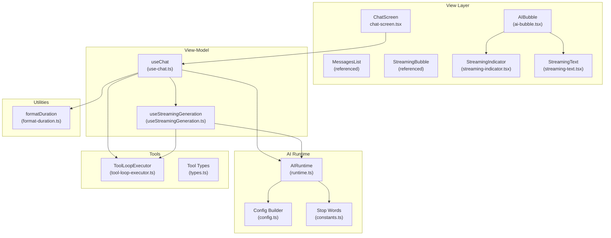
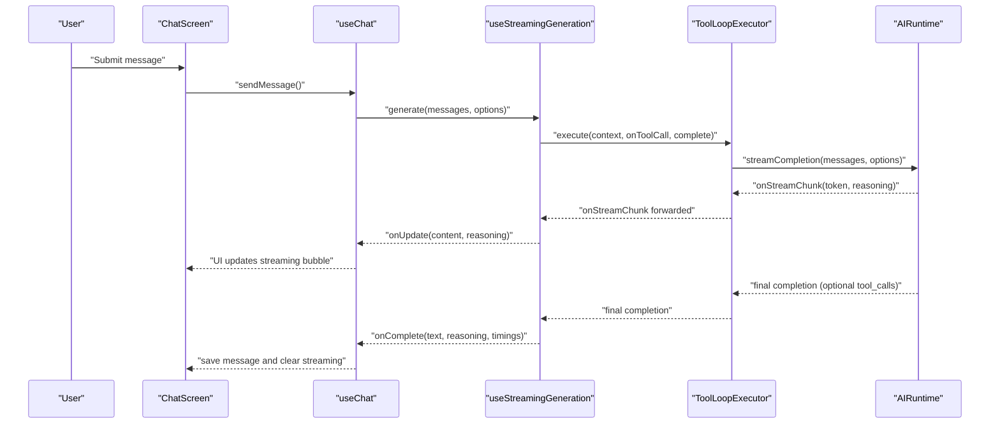
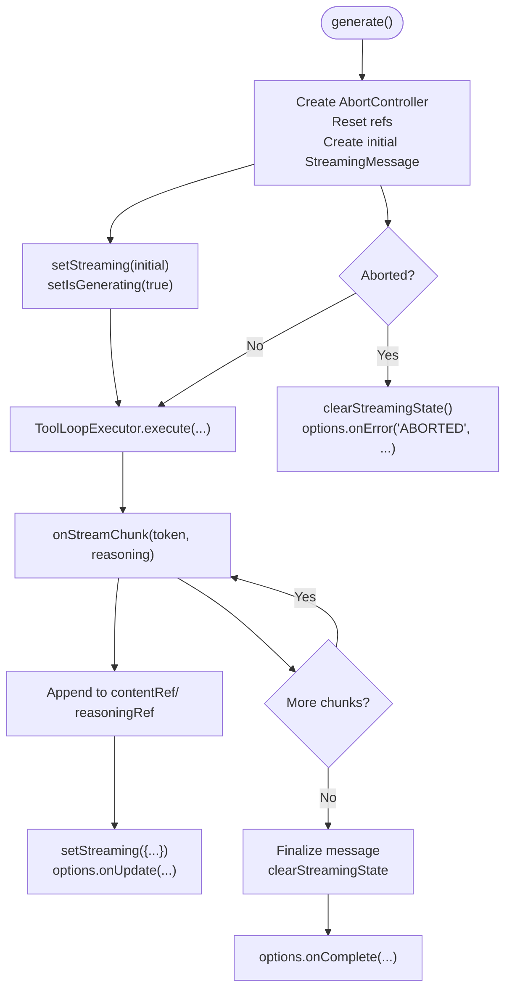
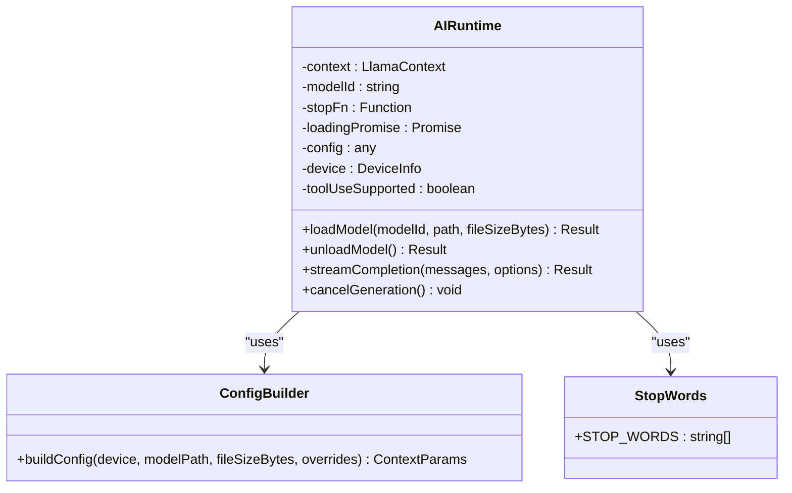
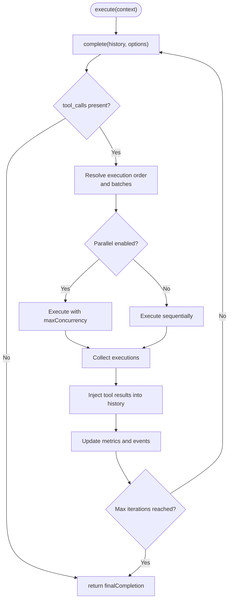
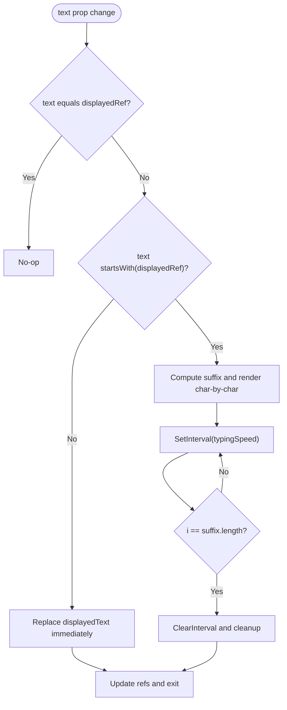
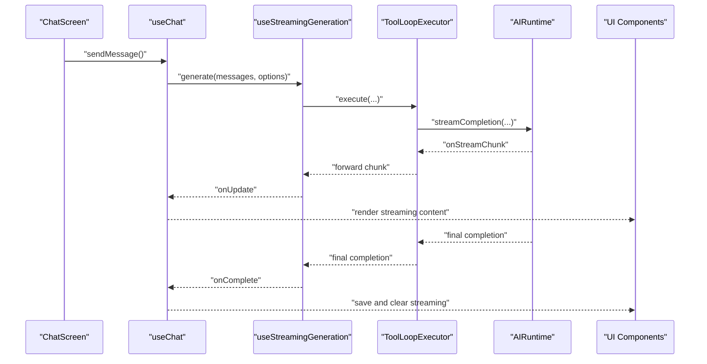
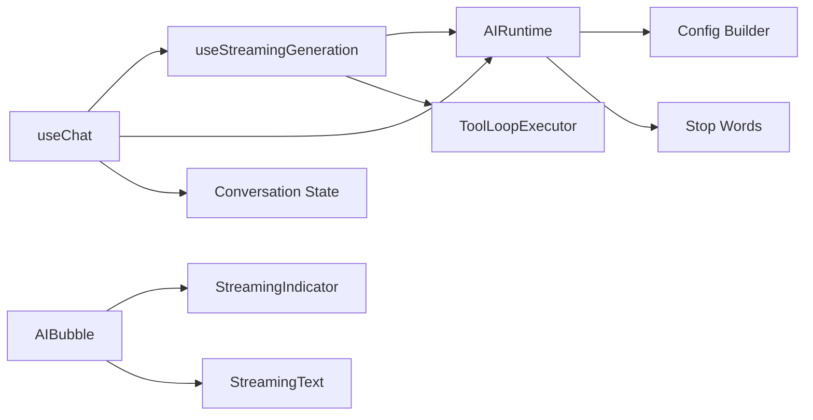

# Streaming and Real-time Features

<cite>
**Referenced Files in This Document**
- [useStreamingGeneration.ts](file://features/chat/view-model/hooks/useStreamingGeneration.ts)
- [runtime.ts](file://shared/ai/text-generation/runtime.ts)
- [types.ts](file://shared/ai/text-generation/types.ts)
- [tool-loop-executor.ts](file://shared/ai/tools/tool-loop-executor.ts)
- [use-chat.ts](file://features/chat/view-model/use-chat.ts)
- [chat-screen.tsx](file://features/chat/view/chat-screen.tsx)
- [streaming-indicator.tsx](file://features/chat/components/streaming-indicator.tsx)
- [streaming-text.tsx](file://features/chat/components/streaming-text.tsx)
- [format-duration.ts](file://features/chat/utils/format-duration.ts)
- [ai-bubble.tsx](file://features/chat/components/ai-bubble.tsx)
- [constants.ts](file://shared/ai/text-generation/constants.ts)
- [config.ts](file://shared/ai/text-generation/config.ts)
</cite>

## Table of Contents
1. [Introduction](#introduction)
2. [Project Structure](#project-structure)
3. [Core Components](#core-components)
4. [Architecture Overview](#architecture-overview)
5. [Detailed Component Analysis](#detailed-component-analysis)
6. [Dependency Analysis](#dependency-analysis)
7. [Performance Considerations](#performance-considerations)
8. [Troubleshooting Guide](#troubleshooting-guide)
9. [Conclusion](#conclusion)

## Introduction
This document explains the streaming generation and real-time text display features. It covers how AI responses are streamed, progressively rendered, and controlled; how visual indicators communicate processing states; how text is rendered character-by-character; how durations are formatted; and how the entire flow integrates with the AI runtime system. It also documents cancellation, lifecycle management, performance optimizations, throttling strategies, error handling, partial content recovery, and graceful degradation.

## Project Structure
The streaming system spans view-model hooks, AI runtime, tool orchestration, UI components, and utilities:
- View-model hooks manage generation lifecycle and UI state.
- The AI runtime handles model loading, warm-up, inference, and streaming.
- Tool orchestration supports tool calls with retries, caching, and parallelism.
- UI components render streaming content and indicators.
- Utilities format timing and support duration display.

**Diagram sources**
- [chat-screen.tsx:14-148](file://features/chat/view/chat-screen.tsx#L14-L148)
- [use-chat.ts:22-371](file://features/chat/view-model/use-chat.ts#L22-L371)
- [useStreamingGeneration.ts:39-164](file://features/chat/view-model/hooks/useStreamingGeneration.ts#L39-L164)
- [runtime.ts:16-489](file://shared/ai/text-generation/runtime.ts#L16-L489)
- [tool-loop-executor.ts:199-459](file://shared/ai/tools/tool-loop-executor.ts#L199-L459)
- [ai-bubble.tsx:20-119](file://features/chat/components/ai-bubble.tsx#L20-L119)
- [streaming-indicator.tsx:4-13](file://features/chat/components/streaming-indicator.tsx#L4-L13)
- [streaming-text.tsx:28-114](file://features/chat/components/streaming-text.tsx#L28-L114)
- [format-duration.ts:11-16](file://features/chat/utils/format-duration.ts#L11-L16)
- [config.ts:4-32](file://shared/ai/text-generation/config.ts#L4-L32)
- [constants.ts:1-8](file://shared/ai/text-generation/constants.ts#L1-L8)

**Section sources**
- [chat-screen.tsx:14-148](file://features/chat/view/chat-screen.tsx#L14-L148)
- [use-chat.ts:22-371](file://features/chat/view-model/use-chat.ts#L22-L371)
- [useStreamingGeneration.ts:39-164](file://features/chat/view-model/hooks/useStreamingGeneration.ts#L39-L164)
- [runtime.ts:16-489](file://shared/ai/text-generation/runtime.ts#L16-L489)
- [tool-loop-executor.ts:199-459](file://shared/ai/tools/tool-loop-executor.ts#L199-L459)
- [ai-bubble.tsx:20-119](file://features/chat/components/ai-bubble.tsx#L20-L119)
- [streaming-indicator.tsx:4-13](file://features/chat/components/streaming-indicator.tsx#L4-L13)
- [streaming-text.tsx:28-114](file://features/chat/components/streaming-text.tsx#L28-L114)
- [format-duration.ts:11-16](file://features/chat/utils/format-duration.ts#L11-L16)
- [config.ts:4-32](file://shared/ai/text-generation/config.ts#L4-L32)
- [constants.ts:1-8](file://shared/ai/text-generation/constants.ts#L1-L8)

## Core Components
- useStreamingGeneration: Manages streaming state, cancellation, and orchestrates generation with tool loops and runtime streaming.
- AIRuntime: Handles model loading/warm-up, inference, streaming chunks, tool-call extraction, and cancellation.
- ToolLoopExecutor: Executes model completion, detects tool calls, executes tools (with caching, timeouts, retries), injects results, and repeats until no tool calls remain.
- useChat: Integrates UI actions (send/retry/cancel), manages conversation updates, and wires callbacks to the streaming hook.
- StreamingIndicator: Minimal animated dots indicating AI processing.
- StreamingText: Character-by-character rendering with typing simulation and optional line-limiting behavior.
- formatDuration: Formats elapsed time in M:SS.
- AIBubble: Renders assistant messages, integrates streaming indicator and thinking reasoning, and displays timings.

**Section sources**
- [useStreamingGeneration.ts:39-164](file://features/chat/view-model/hooks/useStreamingGeneration.ts#L39-L164)
- [runtime.ts:16-489](file://shared/ai/text-generation/runtime.ts#L16-L489)
- [tool-loop-executor.ts:199-459](file://shared/ai/tools/tool-loop-executor.ts#L199-L459)
- [use-chat.ts:22-371](file://features/chat/view-model/use-chat.ts#L22-L371)
- [streaming-indicator.tsx:4-13](file://features/chat/components/streaming-indicator.tsx#L4-L13)
- [streaming-text.tsx:28-114](file://features/chat/components/streaming-text.tsx#L28-L114)
- [format-duration.ts:11-16](file://features/chat/utils/format-duration.ts#L11-L16)
- [ai-bubble.tsx:20-119](file://features/chat/components/ai-bubble.tsx#L20-L119)

## Architecture Overview
The real-time generation flow:
- User sends a message via ChatScreen and useChat.
- useChat validates, prepares messages, and invokes useStreamingGeneration.generate.
- useStreamingGeneration creates a streaming message, sets state, and delegates to ToolLoopExecutor.
- ToolLoopExecutor calls AIRuntime.streamCompletion, which streams tokens and reasoning.
- On each chunk, the UI updates progressively via callbacks.
- Tool calls are extracted and executed (with caching and retries), injecting results back into the conversation.
- Final completion is saved to the conversation and UI cleared.

**Diagram sources**
- [use-chat.ts:101-183](file://features/chat/view-model/use-chat.ts#L101-L183)
- [useStreamingGeneration.ts:52-146](file://features/chat/view-model/hooks/useStreamingGeneration.ts#L52-L146)
- [tool-loop-executor.ts:232-459](file://shared/ai/tools/tool-loop-executor.ts#L232-L459)
- [runtime.ts:256-477](file://shared/ai/text-generation/runtime.ts#L256-L477)

## Detailed Component Analysis

### useStreamingGeneration Hook
Responsibilities:
- Manage streaming state and isGenerating flag.
- Create a streaming message with a fixed timestamp and UUID.
- Wire AbortController for cancellation.
- Delegate to ToolLoopExecutor to run generation with tool-call support.
- Update content and reasoning progressively via refs and setStreaming.
- Invoke callbacks on update, completion, and error.
- Normalize tool call IDs and deduplicate tool-call detections.

Key behaviors:
- Progressive rendering: contentRef and reasoningRef accumulate chunks; setStreaming updates the UI.
- Cancellation: abortRef triggers early termination; clearStreamingState resets state.
- Error handling: logs and forwards partial content/reasoning to onError.

**Diagram sources**
- [useStreamingGeneration.ts:52-146](file://features/chat/view-model/hooks/useStreamingGeneration.ts#L52-L146)
- [useStreamingGeneration.ts:166-275](file://features/chat/view-model/hooks/useStreamingGeneration.ts#L166-L275)

**Section sources**
- [useStreamingGeneration.ts:39-164](file://features/chat/view-model/hooks/useStreamingGeneration.ts#L39-L164)
- [useStreamingGeneration.ts:166-275](file://features/chat/view-model/hooks/useStreamingGeneration.ts#L166-L275)

### AIRuntime Streaming and Inference
Responsibilities:
- Load/unload models with device-aware configuration.
- Warm-up model to prime inference.
- Stream completions, extract tool calls, and normalize IDs.
- Measure first-token and total inference durations.
- Support cancellation via stop function.
- Recover from likely out-of-memory conditions by reducing context size and retrying once.

Key behaviors:
- Token streaming: on each token, emits reasoning and text chunks.
- Tool-call detection: deduplicates and normalizes tool call IDs.
- Abort handling: respects AbortSignal and returns ABORTED.
- Error handling: wraps errors and retries on likely OOM.

**Diagram sources**
- [runtime.ts:16-489](file://shared/ai/text-generation/runtime.ts#L16-L489)
- [config.ts:4-32](file://shared/ai/text-generation/config.ts#L4-L32)
- [constants.ts:1-8](file://shared/ai/text-generation/constants.ts#L1-L8)

**Section sources**
- [runtime.ts:256-477](file://shared/ai/text-generation/runtime.ts#L256-L477)
- [runtime.ts:479-484](file://shared/ai/text-generation/runtime.ts#L479-L484)
- [config.ts:4-32](file://shared/ai/text-generation/config.ts#L4-L32)
- [constants.ts:1-8](file://shared/ai/text-generation/constants.ts#L1-L8)

### ToolLoopExecutor
Responsibilities:
- Execute model completion and detect tool calls.
- Execute tools with configurable timeouts, retries, and caching.
- Inject tool results back into the message history.
- Support parallel execution with concurrency limits and dependency ordering.
- Emit metrics and events for observability.

Key behaviors:
- Iterative loop: completion -> tool calls -> inject results -> repeat.
- Parallel execution: resolves dependencies and batches for concurrency.
- Caching: LRU cache with TTL for identical tool calls.
- Error strategy: fail-fast vs continue-on-error with retryable detection.

**Diagram sources**
- [tool-loop-executor.ts:232-459](file://shared/ai/tools/tool-loop-executor.ts#L232-L459)
- [tool-loop-executor.ts:464-520](file://shared/ai/tools/tool-loop-executor.ts#L464-L520)
- [tool-loop-executor.ts:748-774](file://shared/ai/tools/tool-loop-executor.ts#L748-L774)

**Section sources**
- [tool-loop-executor.ts:199-459](file://shared/ai/tools/tool-loop-executor.ts#L199-L459)
- [tool-loop-executor.ts:748-774](file://shared/ai/tools/tool-loop-executor.ts#L748-L774)

### Streaming Indicator Component
Responsibilities:
- Provide a minimal visual indicator of AI processing using three animated dots.

Behavior:
- Uses Tailwind classes and animated pulse styles.
- Dots have staggered opacity and synchronized animation.

**Section sources**
- [streaming-indicator.tsx:4-13](file://features/chat/components/streaming-indicator.tsx#L4-L13)

### Streaming Text Component
Responsibilities:
- Render text progressively with a typing-like effect.
- Optimize for long-running updates by appending only the suffix when possible.
- Optionally constrain height and align to bottom to avoid ScrollView auto-scroll issues.

Behavior:
- Detects whether incoming text is an extension of displayed text.
- If yes, renders character-by-character at a configurable rate.
- If not, replaces immediately.
- Clears timers on unmount and when text changes.

**Diagram sources**
- [streaming-text.tsx:39-81](file://features/chat/components/streaming-text.tsx#L39-L81)

**Section sources**
- [streaming-text.tsx:28-114](file://features/chat/components/streaming-text.tsx#L28-L114)

### Duration Formatting Utility
Responsibilities:
- Format durations in seconds to "M:SS" with zero-padded seconds.

Behavior:
- Computes minutes and seconds, returns formatted string.

**Section sources**
- [format-duration.ts:11-16](file://features/chat/utils/format-duration.ts#L11-L16)

### Integration with AI Runtime and Model Loading
Responsibilities:
- useChat coordinates UI actions and integrates with useStreamingGeneration and AIRuntime.
- Loads and unloads models, resolves current model ID, and manages conversation state.
- Handles partial content on errors and cancellation.

Behavior:
- sendMessage validates input, adds user message, and triggers generation.
- onError routes partial content to a temporary assistant message or updates user error.
- cancelGeneration calls stream.cancel.

**Section sources**
- [use-chat.ts:101-183](file://features/chat/view-model/use-chat.ts#L101-L183)
- [use-chat.ts:34-83](file://features/chat/view-model/use-chat.ts#L34-L83)
- [use-chat.ts:247-249](file://features/chat/view-model/use-chat.ts#L247-L249)

### Real-time Generation Flow
End-to-end flow from user input to streamed response:
- ChatScreen captures input and delegates to useChat.
- useChat prepares messages and calls useStreamingGeneration.generate.
- useStreamingGeneration initializes streaming state and delegates to ToolLoopExecutor.
- ToolLoopExecutor calls AIRuntime.streamCompletion and forwards onStreamChunk.
- UI components (AIBubble, StreamingIndicator, StreamingText) render incremental updates.
- Tool calls are executed and results injected; loop repeats until completion.
- Final message is saved and UI state cleared.

**Diagram sources**
- [chat-screen.tsx:114-139](file://features/chat/view/chat-screen.tsx#L114-L139)
- [use-chat.ts:101-183](file://features/chat/view-model/use-chat.ts#L101-L183)
- [useStreamingGeneration.ts:52-146](file://features/chat/view-model/hooks/useStreamingGeneration.ts#L52-L146)
- [tool-loop-executor.ts:232-459](file://shared/ai/tools/tool-loop-executor.ts#L232-L459)
- [runtime.ts:256-477](file://shared/ai/text-generation/runtime.ts#L256-L477)

## Dependency Analysis
- useStreamingGeneration depends on:
  - AIRuntime for streaming and inference.
  - ToolLoopExecutor for tool-call orchestration.
  - Callbacks for onUpdate/onComplete/onError.
- useChat depends on:
  - useStreamingGeneration for lifecycle control.
  - AIRuntime for model readiness and current model info.
  - Conversation state for persistence and retrieval.
- UI components depend on:
  - Streaming state from useStreamingGeneration.
  - AIBubble composes StreamingIndicator and StreamingText.
- AIRuntime depends on:
  - Device configuration and stop words.
  - Tool types for tool-call injection.

**Diagram sources**
- [useStreamingGeneration.ts:3-9](file://features/chat/view-model/hooks/useStreamingGeneration.ts#L3-L9)
- [runtime.ts:16-489](file://shared/ai/text-generation/runtime.ts#L16-L489)
- [tool-loop-executor.ts:199-459](file://shared/ai/tools/tool-loop-executor.ts#L199-L459)
- [use-chat.ts:22-371](file://features/chat/view-model/use-chat.ts#L22-L371)
- [ai-bubble.tsx:3-11](file://features/chat/components/ai-bubble.tsx#L3-L11)
- [config.ts:4-32](file://shared/ai/text-generation/config.ts#L4-L32)
- [constants.ts:1-8](file://shared/ai/text-generation/constants.ts#L1-L8)

**Section sources**
- [useStreamingGeneration.ts:3-9](file://features/chat/view-model/hooks/useStreamingGeneration.ts#L3-L9)
- [runtime.ts:16-489](file://shared/ai/text-generation/runtime.ts#L16-L489)
- [tool-loop-executor.ts:199-459](file://shared/ai/tools/tool-loop-executor.ts#L199-L459)
- [use-chat.ts:22-371](file://features/chat/view-model/use-chat.ts#L22-L371)
- [ai-bubble.tsx:3-11](file://features/chat/components/ai-bubble.tsx#L3-L11)
- [config.ts:4-32](file://shared/ai/text-generation/config.ts#L4-L32)
- [constants.ts:1-8](file://shared/ai/text-generation/constants.ts#L1-L8)

## Performance Considerations
- Streaming rendering:
  - useStreamingGeneration accumulates content and reasoning in refs and updates state minimally to reduce re-renders.
  - ToolLoopExecutor forwards onStreamChunk to avoid buffering entire outputs.
- Throttling and pacing:
  - StreamingText uses a configurable typingSpeed to throttle character rendering.
  - Line-limited mode avoids expensive ScrollView auto-scroll by constraining height and aligning content to the bottom.
- Memory management:
  - ToolLoopExecutor caches tool results with LRU and TTL to avoid repeated network calls.
  - AIRuntime reduces n_ctx on OOM and retries once to recover gracefully.
- UI stability:
  - AIBubble separates completed and current content to minimize DOM/text updates.
  - StreamingIndicator uses simple animated dots to avoid heavy animations.

[No sources needed since this section provides general guidance]

## Troubleshooting Guide
Common scenarios and handling:
- Aborted generation:
  - useStreamingGeneration detects AbortSignal and calls onError with partial content/reasoning.
  - useChat persists partial content with a marker and clears streaming state.
- Generation errors:
  - useStreamingGeneration forwards error codes; useChat either updates the last user error or saves a partial assistant message with an error marker.
- Empty responses:
  - AIRuntime returns EMPTY when no text or reasoning is produced; handled upstream.
- Tool-call failures:
  - ToolLoopExecutor retries retryable errors and continues based on error strategy.
- Out-of-memory:
  - AIRuntime detects likely OOM and retries with reduced context size once.

**Section sources**
- [useStreamingGeneration.ts:93-118](file://features/chat/view-model/hooks/useStreamingGeneration.ts#L93-L118)
- [use-chat.ts:34-83](file://features/chat/view-model/use-chat.ts#L34-L83)
- [runtime.ts:444-477](file://shared/ai/text-generation/runtime.ts#L444-L477)
- [tool-loop-executor.ts:712-723](file://shared/ai/tools/tool-loop-executor.ts#L712-L723)

## Conclusion
The streaming system combines a robust hook for lifecycle control, a powerful runtime for model loading and inference, and a tool orchestration engine for dynamic tool use. UI components deliver smooth, real-time feedback with minimal overhead. The design emphasizes cancellation, partial content recovery, and graceful degradation, ensuring a responsive and resilient user experience across devices and conditions.