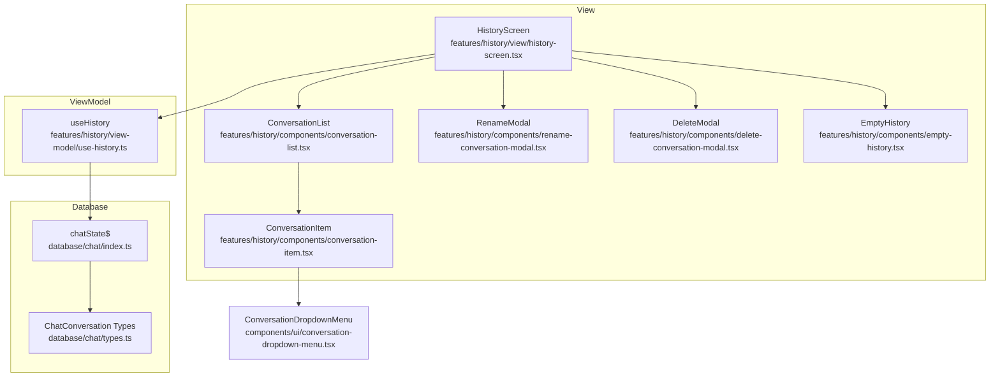
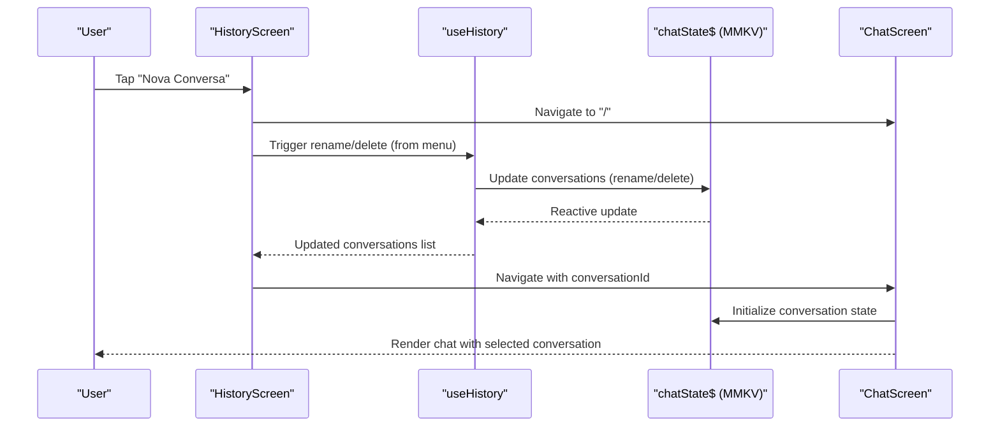
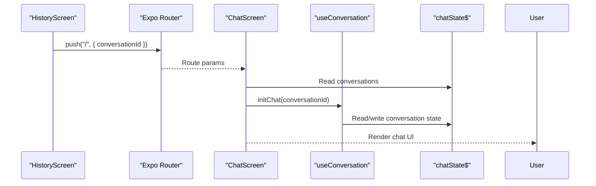
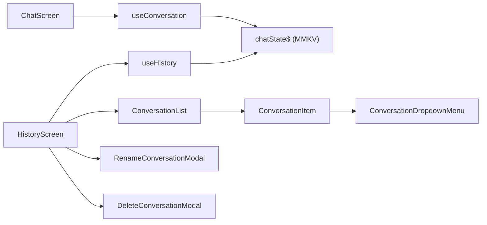

# Conversation History

<cite>
**Referenced Files in This Document**
- [history-screen.tsx](file://features/history/view/history-screen.tsx)
- [use-history.ts](file://features/history/view-model/use-history.ts)
- [conversation-list.tsx](file://features/history/components/conversation-list.tsx)
- [conversation-item.tsx](file://features/history/components/conversation-item.tsx)
- [conversation-dropdown-menu.tsx](file://components/ui/conversation-dropdown-menu.tsx)
- [delete-conversation-modal.tsx](file://features/history/components/delete-conversation-modal.tsx)
- [rename-conversation-modal.tsx](file://features/history/components/rename-conversation-modal.tsx)
- [empty-history.tsx](file://features/history/components/empty-history.tsx)
- [index.ts](file://database/chat/index.ts)
- [types.ts](file://database/chat/types.ts)
- [chat-conversation.ts](file://features/chat/model/chat-conversation.ts)
- [useConversation.ts](file://features/chat/view-model/hooks/useConversation.ts)
- [chat-screen.tsx](file://features/chat/view/chat-screen.tsx)
</cite>

## Table of Contents
1. [Introduction](#introduction)
2. [Project Structure](#project-structure)
3. [Core Components](#core-components)
4. [Architecture Overview](#architecture-overview)
5. [Detailed Component Analysis](#detailed-component-analysis)
6. [Dependency Analysis](#dependency-analysis)
7. [Performance Considerations](#performance-considerations)
8. [Troubleshooting Guide](#troubleshooting-guide)
9. [Conclusion](#conclusion)

## Introduction
This document explains the conversation history system in My Shadow, focusing on how chat conversations are persisted, retrieved, filtered, and manipulated. It covers the history screen interface, the history ViewModel, the conversation list component, database integration with MMKV, the conversation lifecycle (creation, editing, deletion), menu actions, and integration with the main chat interface for seamless switching between conversations.

## Project Structure
The conversation history feature is organized into three layers:
- View: the history screen and UI components
- ViewModel: state management and operations for conversations
- Database: persistent storage using MMKV via Legend State

**Diagram sources**
- [history-screen.tsx:1-153](file://features/history/view/history-screen.tsx#L1-L153)
- [use-history.ts:1-94](file://features/history/view-model/use-history.ts#L1-L94)
- [conversation-list.tsx:1-37](file://features/history/components/conversation-list.tsx#L1-L37)
- [conversation-item.tsx:1-84](file://features/history/components/conversation-item.tsx#L1-L84)
- [conversation-dropdown-menu.tsx:1-52](file://components/ui/conversation-dropdown-menu.tsx#L1-L52)
- [delete-conversation-modal.tsx:1-57](file://features/history/components/delete-conversation-modal.tsx#L1-L57)
- [rename-conversation-modal.tsx:1-63](file://features/history/components/rename-conversation-modal.tsx#L1-L63)
- [empty-history.tsx:1-35](file://features/history/components/empty-history.tsx#L1-L35)
- [index.ts:1-31](file://database/chat/index.ts#L1-L31)
- [types.ts:1-31](file://database/chat/types.ts#L1-L31)

**Section sources**
- [history-screen.tsx:1-153](file://features/history/view/history-screen.tsx#L1-L153)
- [use-history.ts:1-94](file://features/history/view-model/use-history.ts#L1-L94)
- [conversation-list.tsx:1-37](file://features/history/components/conversation-list.tsx#L1-L37)
- [conversation-item.tsx:1-84](file://features/history/components/conversation-item.tsx#L1-L84)
- [conversation-dropdown-menu.tsx:1-52](file://components/ui/conversation-dropdown-menu.tsx#L1-L52)
- [delete-conversation-modal.tsx:1-57](file://features/history/components/delete-conversation-modal.tsx#L1-L57)
- [rename-conversation-modal.tsx:1-63](file://features/history/components/rename-conversation-modal.tsx#L1-L63)
- [empty-history.tsx:1-35](file://features/history/components/empty-history.tsx#L1-L35)
- [index.ts:1-31](file://database/chat/index.ts#L1-L31)
- [types.ts:1-31](file://database/chat/types.ts#L1-L31)

## Core Components
- HistoryScreen: Renders the history UI, handles navigation to the chat screen, and manages action modals for rename and delete.
- ConversationList: Displays a scrollable list of conversations using a flat list.
- ConversationItem: Renders each conversation row with title, preview, relative timestamp, and a dropdown menu.
- ConversationDropdownMenu: Per-item menu for rename and delete actions.
- RenameConversationModal and DeleteConversationModal: Modals for confirming rename and delete operations.
- useHistory ViewModel: Reactive access to conversations, sorting, rename, and delete operations.
- Database chatState$: Persistent storage for conversations using MMKV via Legend State.

Key responsibilities:
- UI rendering and user interactions
- Reactive state updates and sorting
- Persistence and synchronization
- Navigation between history and chat screens

**Section sources**
- [history-screen.tsx:1-153](file://features/history/view/history-screen.tsx#L1-L153)
- [use-history.ts:1-94](file://features/history/view-model/use-history.ts#L1-L94)
- [conversation-list.tsx:1-37](file://features/history/components/conversation-list.tsx#L1-L37)
- [conversation-item.tsx:1-84](file://features/history/components/conversation-item.tsx#L1-L84)
- [conversation-dropdown-menu.tsx:1-52](file://components/ui/conversation-dropdown-menu.tsx#L1-L52)
- [delete-conversation-modal.tsx:1-57](file://features/history/components/delete-conversation-modal.tsx#L1-L57)
- [rename-conversation-modal.tsx:1-63](file://features/history/components/rename-conversation-modal.tsx#L1-L63)
- [index.ts:1-31](file://database/chat/index.ts#L1-L31)
- [types.ts:1-31](file://database/chat/types.ts#L1-L31)

## Architecture Overview
The history system follows a unidirectional data flow:
- View components render UI and trigger actions.
- The useHistory ViewModel reads and writes to the reactive chatState$.
- chatState$ persists data to MMKV using the @legendapp/state persist plugin.
- The main chat screen integrates with history by navigating to a selected conversation and initializing state accordingly.

**Diagram sources**
- [history-screen.tsx:35-40](file://features/history/view/history-screen.tsx#L35-L40)
- [use-history.ts:20-40](file://features/history/view-model/use-history.ts#L20-L40)
- [index.ts:14-28](file://database/chat/index.ts#L14-L28)
- [chat-screen.tsx:24-53](file://features/chat/view/chat-screen.tsx#L24-L53)

## Detailed Component Analysis

### History Screen
Responsibilities:
- Renders the top bar with a "New Chat" action.
- Shows an empty state when no conversations exist.
- Displays the conversation list and handles press events to navigate to the chat screen.
- Manages per-item rename and delete modals.

Behavior highlights:
- Navigation uses Expo Router to pass conversationId to the chat route.
- Uses per-item dropdown menus instead of a global modal to reduce state complexity.

**Section sources**
- [history-screen.tsx:1-153](file://features/history/view/history-screen.tsx#L1-L153)

### Conversation List Component
Responsibilities:
- Wraps a FlatList to render a paginated-like virtualized list of conversations.
- Extracts keys by conversation id and delegates rendering to ConversationItem.

Performance note:
- FlatList provides efficient rendering for long lists.

**Section sources**
- [conversation-list.tsx:1-37](file://features/history/components/conversation-list.tsx#L1-L37)

### Conversation Item Component
Responsibilities:
- Displays conversation title, last message preview, and relative timestamp.
- Integrates with ConversationDropdownMenu for per-item actions.
- Accessibility attributes include label and hint for screen readers.

Relative timestamp logic:
- Calculates time differences and formats human-readable labels based on Portuguese patterns.

**Section sources**
- [conversation-item.tsx:1-84](file://features/history/components/conversation-item.tsx#L1-L84)

### Conversation Dropdown Menu
Responsibilities:
- Presents a menu with "Rename" and "Delete" options.
- Invokes parent callbacks to trigger rename or delete operations.

Integration:
- Used inside ConversationItem to avoid global menu state.

**Section sources**
- [conversation-dropdown-menu.tsx:1-52](file://components/ui/conversation-dropdown-menu.tsx#L1-L52)

### Rename and Delete Modals
Responsibilities:
- RenameConversationModal: Edits the conversation title and confirms changes.
- DeleteConversationModal: Confirms deletion with a destructive action.

User experience:
- Both modals provide clear titles and confirm/cancel actions.

**Section sources**
- [rename-conversation-modal.tsx:1-63](file://features/history/components/rename-conversation-modal.tsx#L1-L63)
- [delete-conversation-modal.tsx:1-57](file://features/history/components/delete-conversation-modal.tsx#L1-L57)

### Empty History State
Responsibilities:
- Displays a friendly message and a button to start a new conversation.
- Navigates to the chat screen when the user taps the button.

**Section sources**
- [empty-history.tsx:1-35](file://features/history/components/empty-history.tsx#L1-L35)

### History ViewModel (useHistory)
Responsibilities:
- Exposes a reactive, sorted list of conversations (newest first).
- Implements rename and delete operations with validation and feedback.
- Uses toast notifications for success/error messages.

Sorting logic:
- Sorts by updatedAt descending, falling back to createdAt.

Rename operation:
- Validates non-empty title, updates title and updatedAt, and triggers a new object reference to ensure reactive updates.

Delete operation:
- Removes the conversation from the record and provides feedback.

**Section sources**
- [use-history.ts:1-94](file://features/history/view-model/use-history.ts#L1-L94)

### Database Integration (MMKV via Legend State)
Responsibilities:
- chatState$ holds conversations as a Record keyed by id.
- Persisted to MMKV with a named store and automatic sync.
- Types define ChatConversation and ChatMessage structures.

Persistence characteristics:
- Encrypted local storage via MMKV plugin.
- Reactive updates propagate to views automatically.

**Section sources**
- [index.ts:1-31](file://database/chat/index.ts#L1-L31)
- [types.ts:1-31](file://database/chat/types.ts#L1-L31)

### Conversation Lifecycle
Creation:
- New conversations are created via useConversation.create and stored in chatState$.
- Initial title may be auto-generated from the first user message.

Editing:
- Rename updates title and updatedAt in place, preserving message history.
- Updates are persisted reactively to MMKV.

Deletion:
- Remove by id from the conversations record.
- No cascading deletes for messages; messages remain in storage but are unreachable via the conversation list.

Navigation:
- HistoryScreen passes conversationId to the chat route.
- ChatScreen initializes state for the selected conversation or resets for a new one.

**Section sources**
- [useConversation.ts:34-51](file://features/chat/view-model/hooks/useConversation.ts#L34-L51)
- [chat-conversation.ts:12-23](file://features/chat/model/chat-conversation.ts#L12-L23)
- [history-screen.tsx:35-40](file://features/history/view/history-screen.tsx#L35-L40)
- [chat-screen.tsx:24-53](file://features/chat/view/chat-screen.tsx#L24-L53)

### Conversation Metadata Management
Metadata fields:
- id, title, messages, lastModelUsedId, lastMessage, createdAt, updatedAt.

Computed preview:
- createLastMessageSnippet generates a safe, single-line snippet for display in the history list.

Auto-generation:
- autoGenerateTitle truncates and sanitizes the first user message for initial titles.

**Section sources**
- [types.ts:22-30](file://database/chat/types.ts#L22-L30)
- [chat-conversation.ts:30-44](file://features/chat/model/chat-conversation.ts#L30-L44)

### Integration Between History and Chat Interfaces
- HistoryScreen navigates to "/" with conversationId to load a specific conversation.
- ChatScreen reads the conversationId, validates existence, and initializes chat state.
- When no conversationId is present, ChatScreen resets to a new conversation state.

**Diagram sources**
- [history-screen.tsx:35-40](file://features/history/view/history-screen.tsx#L35-L40)
- [chat-screen.tsx:24-53](file://features/chat/view/chat-screen.tsx#L24-L53)
- [useConversation.ts:16-32](file://features/chat/view-model/hooks/useConversation.ts#L16-L32)

## Dependency Analysis
High-level dependencies:
- HistoryScreen depends on useHistory and UI components.
- useHistory depends on chatState$ for data access and persistence.
- chatState$ depends on MMKV plugin for persistence.
- ChatScreen depends on useConversation for initialization and state management.
- ConversationItem depends on ConversationDropdownMenu for actions.

**Diagram sources**
- [history-screen.tsx:1-153](file://features/history/view/history-screen.tsx#L1-L153)
- [use-history.ts:1-94](file://features/history/view-model/use-history.ts#L1-L94)
- [conversation-list.tsx:1-37](file://features/history/components/conversation-list.tsx#L1-L37)
- [conversation-item.tsx:1-84](file://features/history/components/conversation-item.tsx#L1-L84)
- [conversation-dropdown-menu.tsx:1-52](file://components/ui/conversation-dropdown-menu.tsx#L1-L52)
- [delete-conversation-modal.tsx:1-57](file://features/history/components/delete-conversation-modal.tsx#L1-L57)
- [rename-conversation-modal.tsx:1-63](file://features/history/components/rename-conversation-modal.tsx#L1-L63)
- [chat-screen.tsx:1-148](file://features/chat/view/chat-screen.tsx#L1-L148)
- [useConversation.ts:1-235](file://features/chat/view-model/hooks/useConversation.ts#L1-L235)
- [index.ts:1-31](file://database/chat/index.ts#L1-L31)

**Section sources**
- [history-screen.tsx:1-153](file://features/history/view/history-screen.tsx#L1-L153)
- [use-history.ts:1-94](file://features/history/view-model/use-history.ts#L1-L94)
- [conversation-list.tsx:1-37](file://features/history/components/conversation-list.tsx#L1-L37)
- [conversation-item.tsx:1-84](file://features/history/components/conversation-item.tsx#L1-L84)
- [conversation-dropdown-menu.tsx:1-52](file://components/ui/conversation-dropdown-menu.tsx#L1-L52)
- [delete-conversation-modal.tsx:1-57](file://features/history/components/delete-conversation-modal.tsx#L1-L57)
- [rename-conversation-modal.tsx:1-63](file://features/history/components/rename-conversation-modal.tsx#L1-L63)
- [chat-screen.tsx:1-148](file://features/chat/view/chat-screen.tsx#L1-L148)
- [useConversation.ts:1-235](file://features/chat/view-model/hooks/useConversation.ts#L1-L235)
- [index.ts:1-31](file://database/chat/index.ts#L1-L31)

## Performance Considerations
- Sorting cost: useHistory sorts conversations on each render; for very large histories, consider precomputing indices or limiting the list size.
- Virtualization: ConversationList uses FlatList, which helps with rendering performance for long lists.
- Reactive updates: Legend State updates are efficient, but frequent mutations can still impact performance; batch updates when possible.
- Memory optimization: Keep message arrays trimmed; consider pruning old messages for very large histories.
- Lazy loading: Not applicable here since all conversations are kept in memory for fast UI updates; consider pagination or server-side filtering if histories grow extremely large.

[No sources needed since this section provides general guidance]

## Troubleshooting Guide
Common issues and resolutions:
- Conversation not found during rename/delete: The ViewModel checks existence and shows an error toast; verify the conversation id passed to the action.
- Empty history: Ensure conversations are created via useConversation.create and persisted to chatState$.
- Navigation problems: Confirm that HistoryScreen passes conversationId and that ChatScreen validates existence before initialization.
- Persistence failures: MMKV plugin handles persistence; if corrupted, clearing app data may help.

**Section sources**
- [use-history.ts:20-40](file://features/history/view-model/use-history.ts#L20-L40)
- [useConversation.ts:34-51](file://features/chat/view-model/hooks/useConversation.ts#L34-L51)
- [history-screen.tsx:35-40](file://features/history/view/history-screen.tsx#L35-L40)
- [chat-screen.tsx:37-44](file://features/chat/view/chat-screen.tsx#L37-L44)

## Conclusion
The conversation history system combines a reactive ViewModel with MMKV-backed persistence to deliver a responsive and privacy-conscious experience. The history screen provides a clean interface for browsing, renaming, and deleting conversations, while the main chat screen integrates seamlessly by passing conversation identifiers. With virtualized lists and reactive updates, the system scales well for moderate histories, and future enhancements can include pagination or server-side filtering for very large datasets.