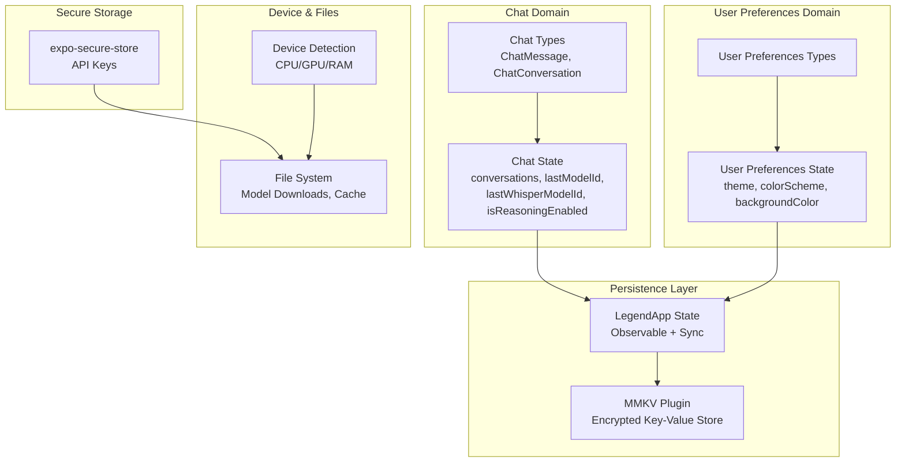
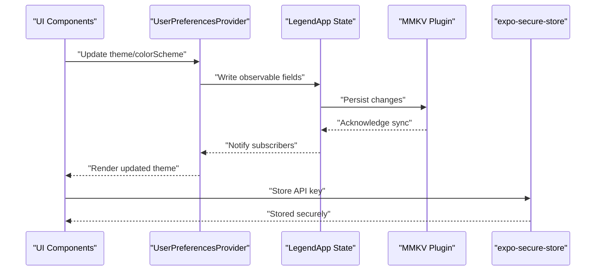
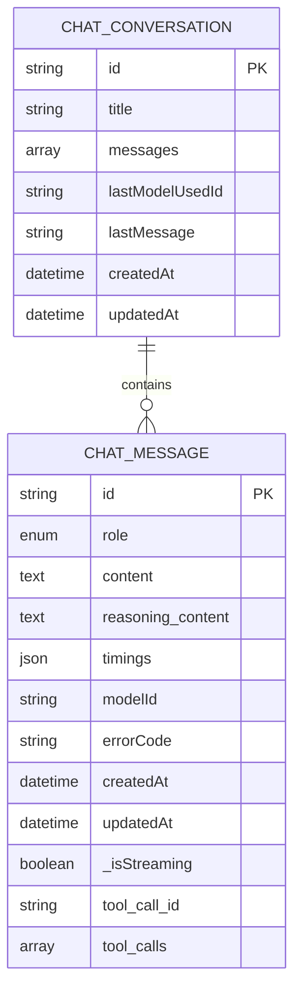
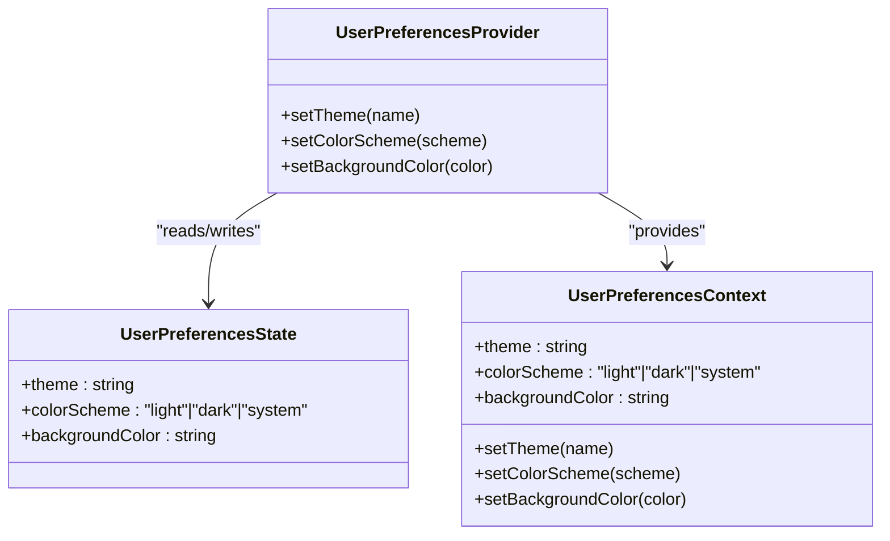
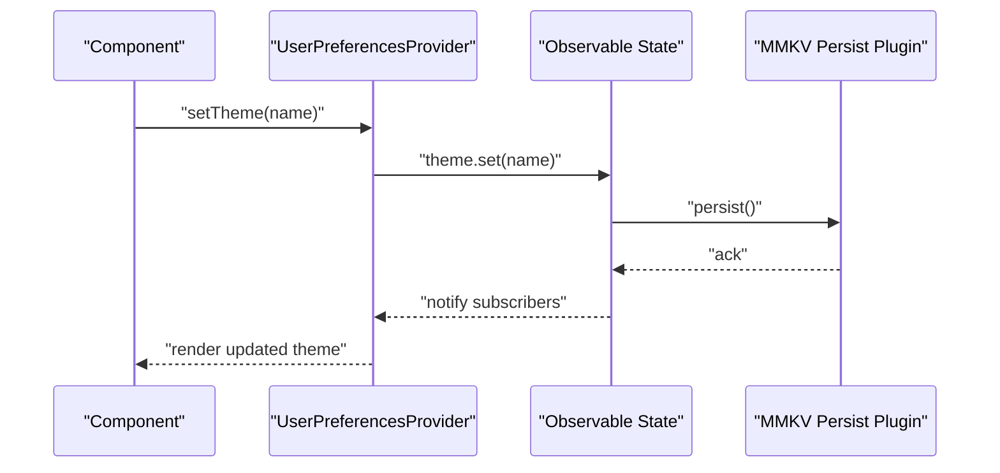
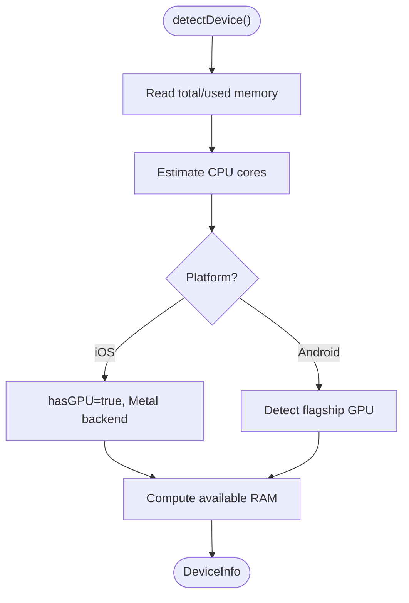
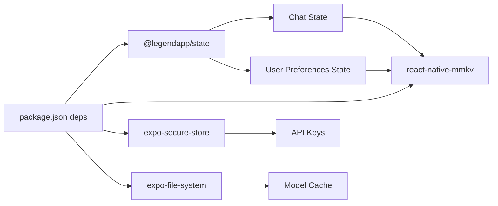

# Data Persistence

<cite>
**Referenced Files in This Document**
- [package.json](file://package.json)
- [README.md](file://README.md)
- [QODER.md](file://QODER.md)
- [database/chat/index.ts](file://database/chat/index.ts)
- [database/chat/types.ts](file://database/chat/types.ts)
- [database/user-preferences/state.ts](file://database/user-preferences/state.ts)
- [database/user-preferences/types.ts](file://database/user-preferences/types.ts)
- [context/user-preferences/provider.tsx](file://context/user-preferences/provider.tsx)
- [context/user-preferences/context.tsx](file://context/user-preferences/context.tsx)
- [shared/device.ts](file://shared/device.ts)
- [shared/ai/manager.ts](file://shared/ai/manager.ts)
</cite>

## Table of Contents
1. [Introduction](#introduction)
2. [Project Structure](#project-structure)
3. [Core Components](#core-components)
4. [Architecture Overview](#architecture-overview)
5. [Detailed Component Analysis](#detailed-component-analysis)
6. [Dependency Analysis](#dependency-analysis)
7. [Performance Considerations](#performance-considerations)
8. [Troubleshooting Guide](#troubleshooting-guide)
9. [Conclusion](#conclusion)
10. [Appendices](#appendices)

## Introduction
This document explains the data persistence architecture for My Shadow’s encrypted local storage system. It focuses on:
- Database architecture using react-native-mmkv for high-performance, encrypted key-value storage via @legendapp/state observables
- Chat database schema for conversations and messages
- User preferences database for settings and application state
- Encryption and secure credential handling
- Data access patterns and repository abstraction layer
- Backup and restore mechanisms, migrations, and storage optimization
- Device capability detection and platform differences
- Data integrity checks, corruption recovery, and performance optimization for large datasets
- Privacy implications of local-only storage

## Project Structure
The data persistence layer is organized around:
- A chat domain with observable state persisted to MMKV
- A user preferences domain with observable state persisted to MMKV
- A device capability detection module informing storage and performance decisions
- Secure credential storage via expo-secure-store (API keys)
- File system usage for model downloads and cache management

**Diagram sources**
- [database/chat/index.ts:1-31](file://database/chat/index.ts#L1-L31)
- [database/chat/types.ts:1-31](file://database/chat/types.ts#L1-L31)
- [database/user-preferences/state.ts:1-22](file://database/user-preferences/state.ts#L1-L22)
- [database/user-preferences/types.ts:1-8](file://database/user-preferences/types.ts#L1-L8)
- [shared/device.ts:1-172](file://shared/device.ts#L1-L172)
- [shared/ai/manager.ts:153-202](file://shared/ai/manager.ts#L153-L202)

**Section sources**
- [package.json:19-102](file://package.json#L19-L102)
- [README.md:170-190](file://README.md#L170-L190)
- [QODER.md:5-8](file://QODER.md#L5-L8)

## Core Components
- Chat state observable persisted to MMKV with automatic synchronization and retry on sync failures
- User preferences observable persisted to MMKV with automatic synchronization and retry on sync failures
- Device capability detection module for informed storage and performance tuning
- Secure credential storage for API keys using expo-secure-store
- File system usage for model downloads and cache management

Key implementation references:
- Chat state initialization and persistence configuration
- User preferences state initialization and persistence configuration
- Theme and color scheme handling via observable state
- Device capability detection and logging
- Model download progress and cache updates

**Section sources**
- [database/chat/index.ts:1-31](file://database/chat/index.ts#L1-L31)
- [database/chat/types.ts:1-31](file://database/chat/types.ts#L1-L31)
- [database/user-preferences/state.ts:1-22](file://database/user-preferences/state.ts#L1-L22)
- [database/user-preferences/types.ts:1-8](file://database/user-preferences/types.ts#L1-L8)
- [context/user-preferences/provider.tsx:1-157](file://context/user-preferences/provider.tsx#L1-L157)
- [context/user-preferences/context.tsx:1-22](file://context/user-preferences/context.tsx#L1-L22)
- [shared/device.ts:1-172](file://shared/device.ts#L1-L172)
- [shared/ai/manager.ts:153-202](file://shared/ai/manager.ts#L153-L202)

## Architecture Overview
The persistence architecture centers on @legendapp/state observables with an MMKV persistence plugin. Both chat and user preferences are stored as separate named stores. Secure credentials are isolated in expo-secure-store. Device detection informs performance-sensitive operations, while file system APIs manage model downloads and caches.

**Diagram sources**
- [context/user-preferences/provider.tsx:19-157](file://context/user-preferences/provider.tsx#L19-L157)
- [database/user-preferences/state.ts:6-19](file://database/user-preferences/state.ts#L6-L19)
- [package.json:71-71](file://package.json#L71-L71)

## Detailed Component Analysis

### Chat Database Schema and Persistence
The chat domain defines:
- Conversation storage keyed by conversation ID
- Message arrays within each conversation
- Metadata fields for timing, model association, tool calls, and error codes
- Global settings for last model IDs and reasoning flag

Persistence:
- Observable state synchronized to MMKV with a dedicated store name
- Automatic retry on sync failures to improve resilience

**Diagram sources**
- [database/chat/types.ts:22-30](file://database/chat/types.ts#L22-L30)
- [database/chat/types.ts:5-20](file://database/chat/types.ts#L5-L20)

**Section sources**
- [database/chat/index.ts:7-28](file://database/chat/index.ts#L7-L28)
- [database/chat/types.ts:1-31](file://database/chat/types.ts#L1-L31)

### User Preferences Database and Repository Abstraction
The user preferences domain stores theme, color scheme, and background color. It is exposed via a React context provider that reads from and writes to the observable state, which persists to MMKV.

**Diagram sources**
- [database/user-preferences/state.ts:6-19](file://database/user-preferences/state.ts#L6-L19)
- [database/user-preferences/types.ts:3-7](file://database/user-preferences/types.ts#L3-L7)
- [context/user-preferences/provider.tsx:19-157](file://context/user-preferences/provider.tsx#L19-L157)
- [context/user-preferences/context.tsx:4-21](file://context/user-preferences/context.tsx#L4-L21)

**Section sources**
- [database/user-preferences/state.ts:1-22](file://database/user-preferences/state.ts#L1-L22)
- [database/user-preferences/types.ts:1-8](file://database/user-preferences/types.ts#L1-L8)
- [context/user-preferences/provider.tsx:1-157](file://context/user-preferences/provider.tsx#L1-L157)
- [context/user-preferences/context.tsx:1-22](file://context/user-preferences/context.tsx#L1-L22)

### Encryption Implementation and Secure Credential Handling
- Encrypted local storage: react-native-mmkv is configured as the persistence plugin for @legendapp/state observables, providing encrypted key-value storage
- Secure credential storage: expo-secure-store is used for storing sensitive API keys
- Local-only storage: model downloads and caches leverage expo-file-system APIs

References:
- MMKV plugin configuration in chat and user preferences observables
- Secure store dependency declaration
- File system usage for model downloads and cache updates

**Section sources**
- [database/chat/index.ts:22-26](file://database/chat/index.ts#L22-L26)
- [database/user-preferences/state.ts:13-17](file://database/user-preferences/state.ts#L13-L17)
- [package.json:90-90](file://package.json#L90-L90)
- [package.json:71-71](file://package.json#L71-L71)
- [package.json:64-64](file://package.json#L64-L64)
- [shared/ai/manager.ts:153-202](file://shared/ai/manager.ts#L153-L202)

### Data Access Patterns and Repository Abstraction
- Observable state with @legendapp/state provides reactive, centralized state management
- Persist plugin ensures automatic serialization/deserialization to/from MMKV
- Retry-on-sync-failure improves resilience against transient storage issues
- Provider pattern exposes setters to update preferences and persist changes atomically

**Diagram sources**
- [context/user-preferences/provider.tsx:65-79](file://context/user-preferences/provider.tsx#L65-L79)
- [database/user-preferences/state.ts:6-19](file://database/user-preferences/state.ts#L6-L19)

**Section sources**
- [context/user-preferences/provider.tsx:1-157](file://context/user-preferences/provider.tsx#L1-L157)
- [database/user-preferences/state.ts:1-22](file://database/user-preferences/state.ts#L1-L22)

### Backup and Restore Mechanisms
- MMKV supports built-in backup and restore capabilities through its underlying storage mechanism. While not explicitly configured in the current code, the observables are set up to persist automatically to MMKV stores. Applications can leverage MMKV’s backup/restore APIs to export/import key-value pairs for a given store name.
- For user preferences and chat data, the store names are defined in the persistence configuration. Backups should target these store names to ensure completeness.

Operational guidance:
- Identify store names used for persistence
- Use MMKV’s backup/restore APIs to export/import key-value pairs
- Validate restored data integrity by reading observable state after restore

**Section sources**
- [database/chat/index.ts:23-23](file://database/chat/index.ts#L23-L23)
- [database/user-preferences/state.ts:14-14](file://database/user-preferences/state.ts#L14-L14)

### Data Migration Strategies
- Schema evolution: When evolving the chat or user preferences schema, introduce version fields and migration functions that transform older records to newer shapes during load
- Graceful degradation: If a field is missing, provide sensible defaults to avoid breaking changes
- Atomic writes: Persist changes using observable state to minimize partial writes

[No sources needed since this section provides general guidance]

### Storage Optimization Techniques
- Prefer compact data structures for messages and metadata
- Avoid storing redundant copies of large payloads
- Use incremental updates and selective persistence for large histories
- Monitor available RAM and adjust concurrency for model downloads and caching

**Section sources**
- [shared/device.ts:122-171](file://shared/device.ts#L122-L171)
- [shared/ai/manager.ts:194-202](file://shared/ai/manager.ts#L194-L202)

### Device Capability Detection and Platform Variations
The device detection module estimates CPU cores, available RAM, and GPU backend to inform performance-sensitive operations. This influences decisions such as model download concurrency and cache sizing.

**Diagram sources**
- [shared/device.ts:122-171](file://shared/device.ts#L122-L171)

**Section sources**
- [shared/device.ts:1-172](file://shared/device.ts#L1-L172)

### Data Integrity Checks and Corruption Recovery
- Retry-on-sync-failure: The observables are configured to retry synchronization, reducing the chance of transient failures causing inconsistent state
- Store-level validation: After restore or on startup, validate critical fields and prune malformed entries
- Crash recovery: Since state is persisted atomically via the plugin, the last persisted snapshot should be consistent

**Section sources**
- [database/chat/index.ts:25-25](file://database/chat/index.ts#L25-L25)
- [database/user-preferences/state.ts:16-16](file://database/user-preferences/state.ts#L16-L16)

## Dependency Analysis
The persistence stack relies on:
- @legendapp/state for observable state management
- react-native-mmkv for encrypted key-value storage
- expo-secure-store for secure credential storage
- expo-file-system for model downloads and cache management

**Diagram sources**
- [package.json:19-102](file://package.json#L19-L102)
- [database/chat/index.ts:1-31](file://database/chat/index.ts#L1-L31)
- [database/user-preferences/state.ts:1-22](file://database/user-preferences/state.ts#L1-L22)

**Section sources**
- [package.json:19-102](file://package.json#L19-L102)
- [README.md:170-190](file://README.md#L170-L190)
- [QODER.md:5-8](file://QODER.md#L5-L8)

## Performance Considerations
- Use observable state to batch updates and minimize redundant writes
- Persist only necessary fields; avoid serializing large intermediate artifacts
- On Android, consider GPU-backed acceleration for model operations; on iOS, rely on Metal
- Monitor available RAM and throttle model download/concurrency to prevent OOM

[No sources needed since this section provides general guidance]

## Troubleshooting Guide
Common issues and resolutions:
- Sync failures: The observables are configured to retry synchronization; monitor logs for persistent failures and validate store names
- Corrupted state: After restore, validate critical fields and prune invalid entries
- Secure store errors: Ensure proper initialization and platform support for expo-secure-store
- File system errors: Validate URIs and permissions for model downloads and cache operations

**Section sources**
- [database/chat/index.ts:25-25](file://database/chat/index.ts#L25-L25)
- [database/user-preferences/state.ts:16-16](file://database/user-preferences/state.ts#L16-L16)
- [shared/ai/manager.ts:153-202](file://shared/ai/manager.ts#L153-L202)

## Conclusion
My Shadow’s data persistence leverages @legendapp/state with react-native-mmkv for encrypted, high-performance key-value storage. The chat and user preferences domains are cleanly separated and persisted automatically. Secure credentials are isolated via expo-secure-store, and file system APIs manage model downloads and caches. Device detection informs performance-sensitive decisions, while retry-on-sync-failure and atomic persistence improve reliability. Backup/restore, migrations, and integrity checks should target the defined store names and validated fields to ensure robust operation across platforms.

[No sources needed since this section summarizes without analyzing specific files]

## Appendices
- Store names for persistence:
  - Chat conversations store name
  - User preferences store name

**Section sources**
- [database/chat/index.ts:23-23](file://database/chat/index.ts#L23-L23)
- [database/user-preferences/state.ts:14-14](file://database/user-preferences/state.ts#L14-L14)