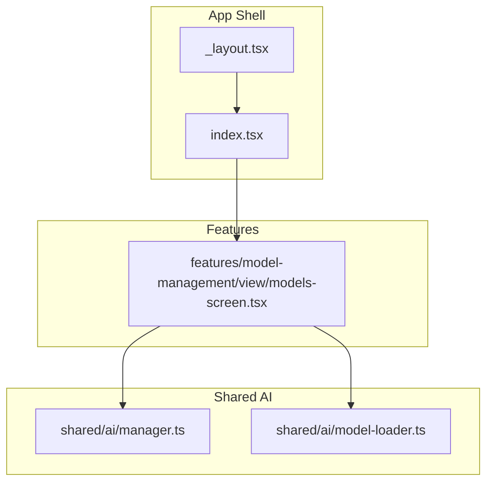
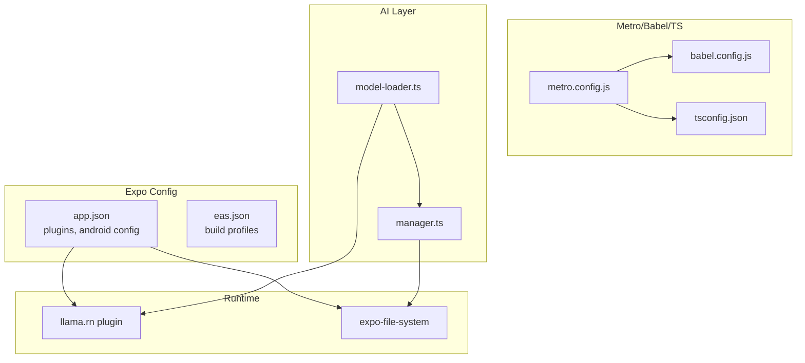
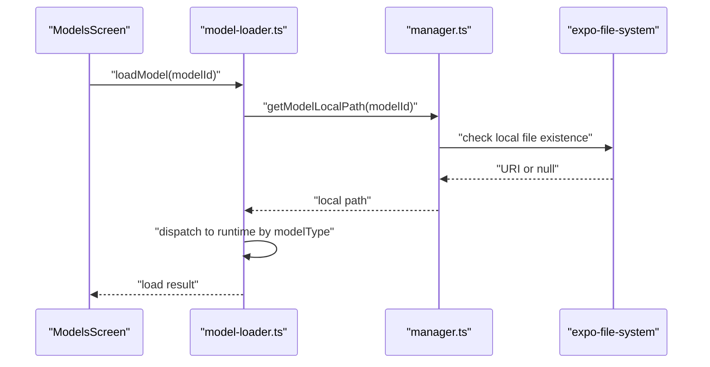
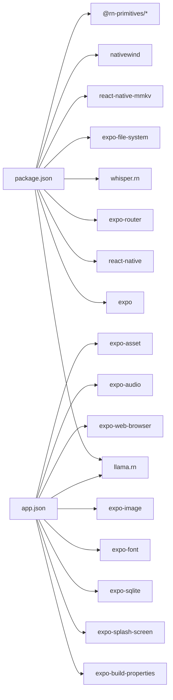

# Getting Started

<cite>
**Referenced Files in This Document**
- [README.md](file://README.md)
- [package.json](file://package.json)
- [app.json](file://app.json)
- [eas.json](file://eas.json)
- [metro.config.js](file://metro.config.js)
- [babel.config.js](file://babel.config.js)
- [bunfig.toml](file://bunfig.toml)
- [tsconfig.json](file://tsconfig.json)
- [_layout.tsx](file://app/_layout.tsx)
- [index.tsx](file://app/index.tsx)
- [models-screen.tsx](file://features/model-management/view/models-screen.tsx)
- [manager.ts](file://shared/ai/manager.ts)
- [model-loader.ts](file://shared/ai/model-loader.ts)
</cite>

## Table of Contents
1. [Introduction](#introduction)
2. [Project Structure](#project-structure)
3. [Core Components](#core-components)
4. [Architecture Overview](#architecture-overview)
5. [Detailed Component Analysis](#detailed-component-analysis)
6. [Dependency Analysis](#dependency-analysis)
7. [Performance Considerations](#performance-considerations)
8. [Troubleshooting Guide](#troubleshooting-guide)
9. [Conclusion](#conclusion)
10. [Appendices](#appendices)

## Introduction
This guide helps you set up a complete development environment for My Shadow, a local-first, privacy-preserving reflection journal built with React Native, Expo, and local AI inference. It covers prerequisites, installation, the critical llama.rn native artifact download step, development workflow using Expo, Android-specific build commands, and verification steps. It also outlines development and production build processes using EAS Build and provides troubleshooting advice.

## Project Structure
My Shadow follows an Expo Router-based file-based navigation structure with feature-focused directories. The app initializes providers and routing in the root layout, exposes a chat screen as the main tab, and organizes model management screens under a dedicated feature module.

**Diagram sources**
- [_layout.tsx:12-50](file://app/_layout.tsx#L12-L50)
- [index.tsx:1-6](file://app/index.tsx#L1-L6)
- [models-screen.tsx:1-78](file://features/model-management/view/models-screen.tsx#L1-L78)
- [manager.ts:1-422](file://shared/ai/manager.ts#L1-L422)
- [model-loader.ts:1-172](file://shared/ai/model-loader.ts#L1-L172)

**Section sources**
- [_layout.tsx:12-50](file://app/_layout.tsx#L12-L50)
- [index.tsx:1-6](file://app/index.tsx#L1-L6)
- [models-screen.tsx:1-78](file://features/model-management/view/models-screen.tsx#L1-L78)

## Core Components
- Expo configuration defines app metadata, plugins, and EAS project ID.
- Metro configuration integrates SVG transformer and NativeWind.
- Babel configuration enables JSX import source for NativeWind.
- TypeScript configuration extends Expo’s base and enables strictness.
- EAS configuration defines development, preview, and production build profiles.

Key setup steps:
- Install dependencies using your preferred package manager.
- Download llama.rn native artifacts.
- Start the development server with Expo.
- Run on Android using the Expo CLI shortcut.
- Configure EAS for internal distribution and production builds.

**Section sources**
- [README.md:5-48](file://README.md#L5-L48)
- [package.json:5-18](file://package.json#L5-L18)
- [app.json:1-82](file://app.json#L1-L82)
- [eas.json:1-23](file://eas.json#L1-L23)
- [metro.config.js:1-19](file://metro.config.js#L1-L19)
- [babel.config.js:1-11](file://babel.config.js#L1-L11)
- [tsconfig.json:1-68](file://tsconfig.json#L1-L68)

## Architecture Overview
The app uses Expo Router for navigation and integrates several native modules via plugins. llama.rn is configured in app.json with flags for C++20 support, OpenCL/Hexagon enablement, and entitlements. The model lifecycle is managed by shared AI modules that coordinate downloads, local storage, and runtime loading/unloading.

**Diagram sources**
- [app.json:29-68](file://app.json#L29-L68)
- [eas.json:6-18](file://eas.json#L6-L18)
- [metro.config.js:1-19](file://metro.config.js#L1-L19)
- [babel.config.js:1-11](file://babel.config.js#L1-L11)
- [tsconfig.json:1-68](file://tsconfig.json#L1-L68)
- [model-loader.ts:1-172](file://shared/ai/model-loader.ts#L1-L172)
- [manager.ts:1-422](file://shared/ai/manager.ts#L1-L422)

## Detailed Component Analysis

### Development Environment Setup
- Prerequisites:
  - Node.js 18+ or Bun (recommended for testing).
  - Android development environment (target SDK aligned with plugin requirements).
  - iOS environment (optional for now).
  - 8 GB+ RAM recommended for model download and compilation.
- Install dependencies:
  - Use your package manager to install dependencies.
- Download llama.rn native artifacts:
  - Run the provided script to fetch native binaries after dependencies are installed.
- Start the app:
  - Use the Expo CLI to start the dev server.
  - Choose a client: development build, Android emulator, iOS simulator, or Expo Go.

**Section sources**
- [README.md:7-40](file://README.md#L7-L40)
- [package.json:5-18](file://package.json#L5-L18)

### Android Build Workflow
- Run on Android:
  - Use the Expo CLI shortcut to build and launch a development APK with native modules included.
- Android build requirements:
  - Android SDK 34+, NDK 26+, CMake 3.22+, and C++20 enabled via plugin configuration.
- ProGuard rules:
  - Automatic rules are applied via the build properties plugin for llama.rn and commons classes.

**Section sources**
- [README.md:41-68](file://README.md#L41-L68)
- [app.json:47-62](file://app.json#L47-L62)

### EAS Build Configuration
- Profiles:
  - Development: internal distribution with a development client.
  - Preview: internal distribution.
  - Production: auto-incremented versioning.
- Project ID:
  - EAS project identifier is configured in app.json extra.eas.projectId.

**Section sources**
- [eas.json:6-18](file://eas.json#L6-L18)
- [app.json:74-79](file://app.json#L74-L79)

### Model Management and Runtime Loading
- Model lifecycle:
  - Models are stored under a models directory in the document directory.
  - Downloads are resumable and tracked per model ID.
  - Cache invalidation and TTL reduce repeated filesystem scans.
- Loading:
  - Unified loader dispatches to the appropriate runtime based on model type.
  - Selected model IDs are persisted in chat state per model type.
- Storage and Cleanup:
  - Removal unloads models from runtimes when possible and deletes files with both supported extensions.

**Diagram sources**
- [models-screen.tsx:21-33](file://features/model-management/view/models-screen.tsx#L21-L33)
- [model-loader.ts:11-63](file://shared/ai/model-loader.ts#L11-L63)
- [manager.ts:320-344](file://shared/ai/manager.ts#L320-L344)

**Section sources**
- [models-screen.tsx:1-78](file://features/model-management/view/models-screen.tsx#L1-L78)
- [model-loader.ts:1-172](file://shared/ai/model-loader.ts#L1-L172)
- [manager.ts:1-422](file://shared/ai/manager.ts#L1-L422)

### Configuration and Toolchain
- Metro:
  - Integrates SVG transformer and enables package exports for modern RN tooling.
- Babel:
  - Uses babel-preset-expo with JSX import source for NativeWind.
- TypeScript:
  - Strict compiler options and bundler module resolution.
- Bun:
  - Test configuration includes coverage, timeout, and preload setup.

**Section sources**
- [metro.config.js:1-19](file://metro.config.js#L1-L19)
- [babel.config.js:1-11](file://babel.config.js#L1-L11)
- [tsconfig.json:1-68](file://tsconfig.json#L1-L68)
- [bunfig.toml:1-8](file://bunfig.toml#L1-L8)

## Dependency Analysis
- Core runtime and UI:
  - Expo, React Native, Expo Router, and UI primitives define the cross-platform shell.
- AI and audio:
  - llama.rn for local GGUF inference and whisper.rn for speech-to-text.
- Storage and persistence:
  - expo-file-system for model storage, react-native-mmkv for encrypted key-value storage.
- Build-time plugins:
  - llama.rn plugin with flags for C++20, OpenCL/Hexagon, and entitlements.
  - expo-build-properties for ProGuard rules.
  - Other plugins for splash, SQLite, fonts, images, web browser, file system, audio, and assets.

**Diagram sources**
- [package.json:19-102](file://package.json#L19-L102)
- [app.json:29-68](file://app.json#L29-L68)

**Section sources**
- [package.json:19-102](file://package.json#L19-L102)
- [app.json:29-68](file://app.json#L29-L68)

## Performance Considerations
- Device-aware runtime optimization:
  - The app adapts to available RAM, CPU cores, and GPU capabilities at model load time.
  - Three-tier device support adjusts context size, KV cache quantization, and GPU offload.
- Memory monitoring and OOM fallback:
  - Automatic retry with halved context on out-of-memory conditions.
- mmap loading:
  - Reduces cold-start memory on budget devices.
- Recommendations:
  - Prefer 8 GB+ RAM for efficient model downloads and inference.
  - Keep device storage free to minimize I/O contention during downloads.

**Section sources**
- [README.md:86-118](file://README.md#L86-L118)

## Troubleshooting Guide
- Dependency installation failures:
  - Ensure Node.js 18+ or Bun is installed and your package manager lockfile matches the project’s expectations.
- llama.rn native artifacts missing:
  - Run the native artifact download script after installing dependencies.
- Android build issues:
  - Verify Android SDK 34+, NDK 26+, CMake 3.22+, and C++20 support via plugin configuration.
  - Confirm ProGuard rules are applied via the build properties plugin.
- Model download problems:
  - Check connectivity and available storage. Use resumable downloads and monitor progress.
  - Cancel in-flight downloads if needed and retry.
- EAS build failures:
  - Confirm EAS CLI version and project ID in app.json.
  - Use development builds for internal distribution and verify device provisioning.

**Section sources**
- [README.md:14-68](file://README.md#L14-L68)
- [app.json:47-62](file://app.json#L47-L62)
- [eas.json:2-5](file://eas.json#L2-L5)
- [manager.ts:59-192](file://shared/ai/manager.ts#L59-L192)

## Conclusion
You now have a complete roadmap to set up My Shadow locally, integrate llama.rn, and develop iteratively with Expo. Use the provided scripts and configurations to streamline dependency installation, model downloads, and Android development builds. For production, configure EAS Build profiles and leverage the app’s runtime optimizations for varied device tiers.

## Appendices

### Step-by-Step Verification Checklist
- Prerequisites verified:
  - Node.js 18+ or Bun installed.
  - Android development environment configured.
  - 8 GB+ RAM available.
- Dependencies installed:
  - Dependencies resolved without errors.
- llama.rn artifacts downloaded:
  - Native artifacts present after running the download script.
- Development server started:
  - Expo CLI reports successful start and offers client options.
- Android run successful:
  - Development APK launches with native modules included.
- Model lifecycle functional:
  - Models appear in the model catalog, can be downloaded, loaded, and unloaded.
- EAS build ready:
  - Development and production profiles configured; EAS CLI version acceptable.

**Section sources**
- [README.md:14-48](file://README.md#L14-L48)
- [models-screen.tsx:21-33](file://features/model-management/view/models-screen.tsx#L21-L33)
- [manager.ts:253-304](file://shared/ai/manager.ts#L253-L304)
- [eas.json:2-5](file://eas.json#L2-L5)