# Model Management

<cite>
**Referenced Files in This Document**
- [use-models.ts](file://features/model-management/view-model/use-models.ts)
- [types.ts](file://features/model-management/view-model/types.ts)
- [model-catalog.tsx](file://features/model-management/components/model-catalog.tsx)
- [model-item.tsx](file://features/model-management/components/model-item.tsx)
- [models-screen.tsx](file://features/model-management/view/models-screen.tsx)
- [manager.ts](file://shared/ai/manager.ts)
- [model-loader.ts](file://shared/ai/model-loader.ts)
- [catalog.ts](file://shared/ai/text-generation/catalog.ts)
- [runtime.ts](file://shared/ai/text-generation/runtime.ts)
- [stt-catalog.ts](file://shared/ai/stt/catalog.ts)
- [stt-runtime.ts](file://shared/ai/stt/runtime.ts)
- [model-types.ts](file://shared/ai/types/model.ts)
- [model-loader-types.ts](file://shared/ai/types/model-loader.ts)
- [errors.ts](file://shared/ai/model-management/errors.ts)
- [useModelManager.ts](file://features/chat/view-model/hooks/useModelManager.ts)
</cite>

## Table of Contents
1. [Introduction](#introduction)
2. [Project Structure](#project-structure)
3. [Core Components](#core-components)
4. [Architecture Overview](#architecture-overview)
5. [Detailed Component Analysis](#detailed-component-analysis)
6. [Dependency Analysis](#dependency-analysis)
7. [Performance Considerations](#performance-considerations)
8. [Troubleshooting Guide](#troubleshooting-guide)
9. [Conclusion](#conclusion)

## Introduction
This document explains the My Shadow AI model management system. It covers how users discover and manage GGUF and binary models, how downloads are performed with progress tracking, how models are loaded into llama.rn and whisper.rn runtimes, and how the system integrates with the AI runtime for seamless switching and updates. It also documents model status tracking, filtering, and the lifecycle from discovery to active usage.

## Project Structure
The model management feature is organized into three layers:
- View-model: orchestrates catalog loading, filtering, download actions, and status computation
- Components: renders the model catalog and individual model rows with actions
- Shared AI: handles downloads, storage, model availability, and runtime integration

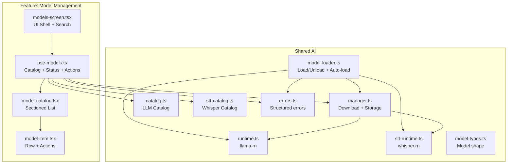

**Diagram sources**
- [models-screen.tsx:1-78](file://features/model-management/view/models-screen.tsx#L1-L78)
- [use-models.ts:1-208](file://features/model-management/view-model/use-models.ts#L1-L208)
- [model-catalog.tsx:1-96](file://features/model-management/components/model-catalog.tsx#L1-L96)
- [model-item.tsx:1-143](file://features/model-management/components/model-item.tsx#L1-L143)
- [manager.ts:1-422](file://shared/ai/manager.ts#L1-L422)
- [model-loader.ts:1-172](file://shared/ai/model-loader.ts#L1-L172)
- [catalog.ts:1-330](file://shared/ai/text-generation/catalog.ts#L1-L330)
- [stt-catalog.ts:1-41](file://shared/ai/stt/catalog.ts#L1-L41)
- [runtime.ts:1-489](file://shared/ai/text-generation/runtime.ts#L1-L489)
- [stt-runtime.ts:1-99](file://shared/ai/stt/runtime.ts#L1-L99)
- [model-types.ts:1-24](file://shared/ai/types/model.ts#L1-L24)
- [errors.ts:1-184](file://shared/ai/model-management/errors.ts#L1-L184)

**Section sources**
- [models-screen.tsx:1-78](file://features/model-management/view/models-screen.tsx#L1-L78)
- [use-models.ts:1-208](file://features/model-management/view-model/use-models.ts#L1-L208)
- [model-catalog.tsx:1-96](file://features/model-management/components/model-catalog.tsx#L1-L96)
- [model-item.tsx:1-143](file://features/model-management/components/model-item.tsx#L1-L143)
- [manager.ts:1-422](file://shared/ai/manager.ts#L1-L422)
- [model-loader.ts:1-172](file://shared/ai/model-loader.ts#L1-L172)
- [catalog.ts:1-330](file://shared/ai/text-generation/catalog.ts#L1-L330)
- [stt-catalog.ts:1-41](file://shared/ai/stt/catalog.ts#L1-L41)
- [runtime.ts:1-489](file://shared/ai/text-generation/runtime.ts#L1-L489)
- [stt-runtime.ts:1-99](file://shared/ai/stt/runtime.ts#L1-L99)
- [model-types.ts:1-24](file://shared/ai/types/model.ts#L1-L24)
- [errors.ts:1-184](file://shared/ai/model-management/errors.ts#L1-L184)

## Core Components
- Model catalog and status:
  - Builds a unified catalog combining LLM and Whisper models
  - Filters by search query
  - Computes per-model status (not-downloaded, downloading, downloaded, failed)
- Model item rendering:
  - Displays name, description, file size, estimated RAM, tags, and reasoning support
  - Renders action buttons based on status (Download, Remove, Retry)
- Download orchestration:
  - Deduplicates concurrent downloads
  - Streams progress via callbacks
  - Updates caches and persists models
- Runtime integration:
  - Loads/unloads GGUF models into llama.rn and binary models into whisper.rn
  - Persists last-used model IDs and auto-reloads on startup
- Error handling:
  - Structured error codes and user-friendly messages

**Section sources**
- [use-models.ts:16-208](file://features/model-management/view-model/use-models.ts#L16-L208)
- [types.ts:1-12](file://features/model-management/view-model/types.ts#L1-L12)
- [model-catalog.tsx:16-96](file://features/model-management/components/model-catalog.tsx#L16-L96)
- [model-item.tsx:15-143](file://features/model-management/components/model-item.tsx#L15-L143)
- [manager.ts:59-192](file://shared/ai/manager.ts#L59-L192)
- [model-loader.ts:11-172](file://shared/ai/model-loader.ts#L11-L172)
- [errors.ts:1-184](file://shared/ai/model-management/errors.ts#L1-L184)

## Architecture Overview
The system separates concerns across UI, state, storage, and runtimes. The view-model aggregates catalogs and manages download state. The manager coordinates filesystem operations and caches. The model loader dispatches to appropriate runtimes and persists selections. The runtimes encapsulate llama.rn and whisper.rn.

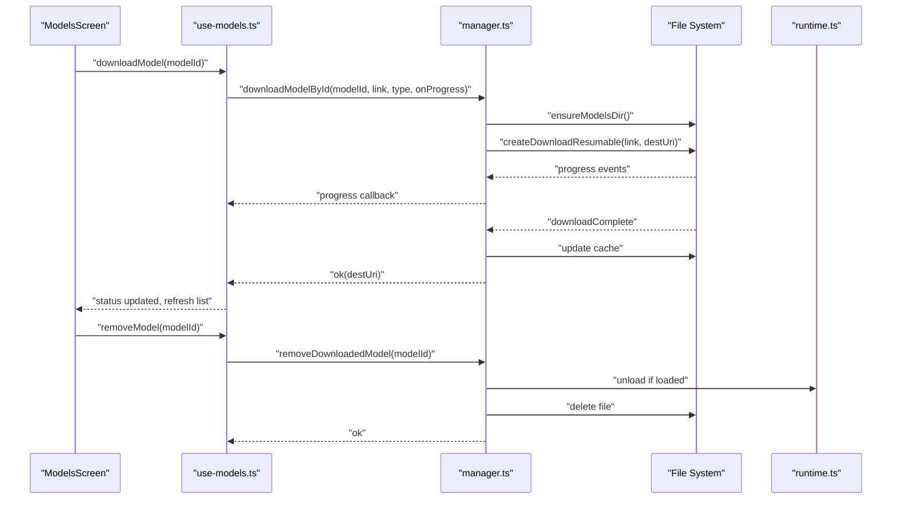

**Diagram sources**
- [models-screen.tsx:21-40](file://features/model-management/view/models-screen.tsx#L21-L40)
- [use-models.ts:97-130](file://features/model-management/view-model/use-models.ts#L97-L130)
- [manager.ts:59-192](file://shared/ai/manager.ts#L59-L192)
- [runtime.ts:159-186](file://shared/ai/text-generation/runtime.ts#L159-L186)

## Detailed Component Analysis

### Model Catalog Interface
- Unified catalog composition:
  - LLM models from the text-generation catalog
  - Whisper models from the STT catalog
  - Combined into a single list with category headers
- Filtering:
  - Case-insensitive search across display name, description, and file size string
- Rendering:
  - Sectioned FlatList with headers for LLM and Whisper categories
  - Delegates each item to ModelItem

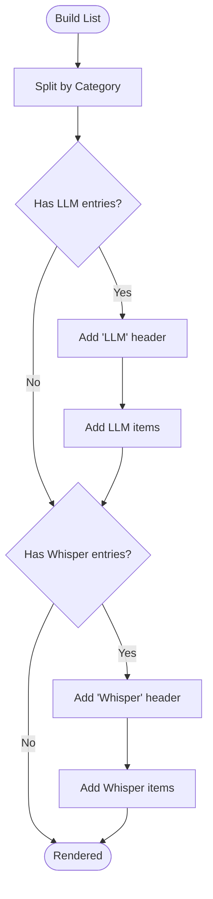

**Diagram sources**
- [model-catalog.tsx:20-42](file://features/model-management/components/model-catalog.tsx#L20-L42)

**Section sources**
- [model-catalog.tsx:16-96](file://features/model-management/components/model-catalog.tsx#L16-L96)
- [catalog.ts:317-330](file://shared/ai/text-generation/catalog.ts#L317-L330)
- [stt-catalog.ts:38-41](file://shared/ai/stt/catalog.ts#L38-L41)

### Model Selection and Status Computation
- Status derivation:
  - If currently downloading the matching modelId → downloading with progress
  - Else if already downloaded → downloaded (100%)
  - Else → not-downloaded
- Search and filtering:
  - Maintains a memoized filtered catalog based on query
- Error propagation:
  - Errors surfaced to the screen for user feedback

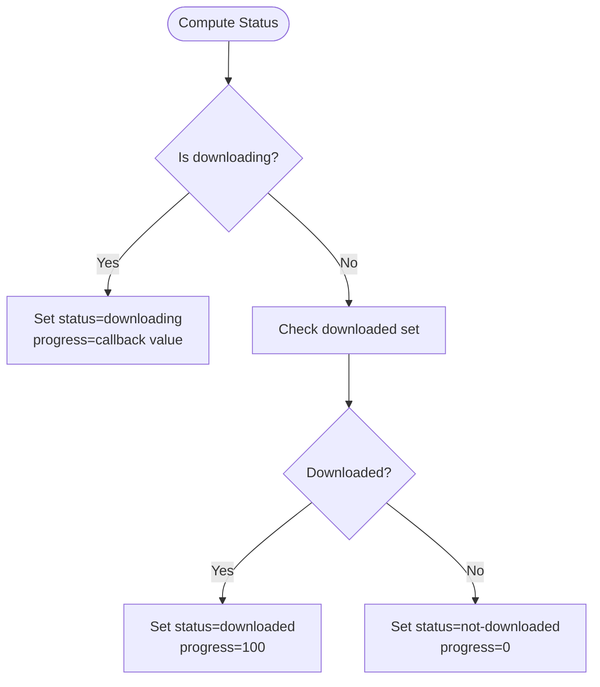

**Diagram sources**
- [use-models.ts:147-175](file://features/model-management/view-model/use-models.ts#L147-L175)

**Section sources**
- [use-models.ts:147-175](file://features/model-management/view-model/use-models.ts#L147-L175)
- [types.ts:1-12](file://features/model-management/view-model/types.ts#L1-L12)

### Model Item Component
- Displays:
  - Name and bytes tag for LLMs
  - Description
  - Size badge (~MB)
  - RAM estimate badge (~MB)
  - Tags and reasoning badge when applicable
- Actions:
  - Download button (when not downloaded and not low-RAM)
  - Remove button (when downloaded)
  - Retry button (when failed)
  - Progress percentage (when downloading)
  - Low-RAM warning indicator when estimated RAM exceeds device capacity

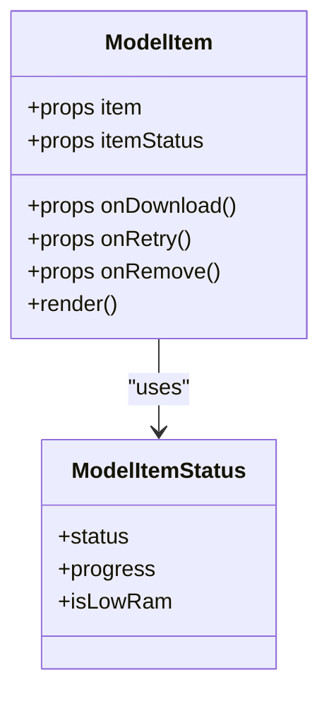

**Diagram sources**
- [model-item.tsx:15-143](file://features/model-management/components/model-item.tsx#L15-L143)
- [types.ts:1-12](file://features/model-management/view-model/types.ts#L1-L12)

**Section sources**
- [model-item.tsx:15-143](file://features/model-management/components/model-item.tsx#L15-L143)

### Download Workflow: Progress Tracking, Network Handling, Storage
- Deduplication:
  - Prevents multiple concurrent downloads for the same modelId
- Resumable download:
  - Uses a resumable downloader with progress callbacks
  - Emits percentage progress to the caller
- Cancellation:
  - Supports cancellation, pausing the resumable, and deleting partial files
- Storage:
  - Ensures models directory exists
  - Stores files under modelId with appropriate extension (.gguf or .bin)
  - Maintains a short-lived in-memory cache keyed by modelId
- Cleanup:
  - Deletes partial files on errors or cancellations
  - Invalidates cache on changes

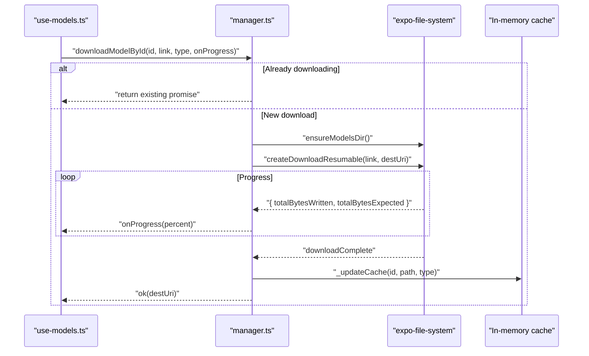

**Diagram sources**
- [manager.ts:59-192](file://shared/ai/manager.ts#L59-L192)
- [use-models.ts:110-117](file://features/model-management/view-model/use-models.ts#L110-L117)

**Section sources**
- [manager.ts:59-192](file://shared/ai/manager.ts#L59-L192)
- [manager.ts:194-213](file://shared/ai/manager.ts#L194-L213)
- [manager.ts:253-304](file://shared/ai/manager.ts#L253-L304)

### Model Loader Integration with llama.rn and whisper.rn
- Dispatch by model type:
  - GGUF → llama.rn runtime
  - BIN → whisper.rn runtime
- Persistence:
  - Saves last used model IDs to chat state for auto-loading
- Auto-load:
  - Restores previous model on startup if still present
- Unload:
  - Releases runtime contexts and clears persisted IDs

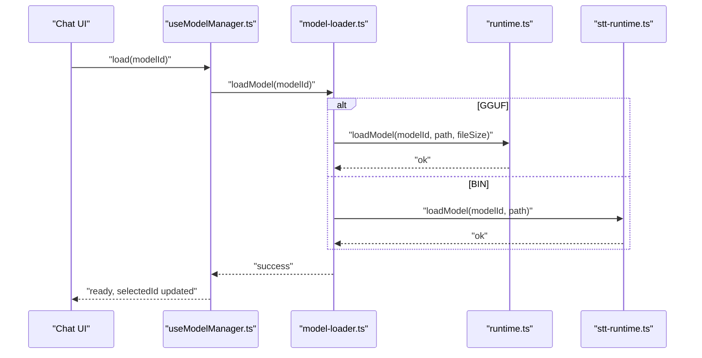

**Diagram sources**
- [useModelManager.ts:32-51](file://features/chat/view-model/hooks/useModelManager.ts#L32-L51)
- [model-loader.ts:11-63](file://shared/ai/model-loader.ts#L11-L63)
- [runtime.ts:34-106](file://shared/ai/text-generation/runtime.ts#L34-L106)
- [stt-runtime.ts:20-54](file://shared/ai/stt/runtime.ts#L20-L54)

**Section sources**
- [model-loader.ts:11-172](file://shared/ai/model-loader.ts#L11-L172)
- [runtime.ts:34-106](file://shared/ai/text-generation/runtime.ts#L34-L106)
- [stt-runtime.ts:20-54](file://shared/ai/stt/runtime.ts#L20-L54)

### Model Lifecycle: Discovery → Download → Active Usage
- Discovery:
  - Build unified catalog from LLM and Whisper catalogs
  - Compute per-model status and availability
- Download:
  - Deduplicate, track progress, persist files, update cache
- Activation:
  - Load into appropriate runtime (llama.rn or whisper.rn)
  - Persist selection for auto-load
- Removal:
  - Unload if loaded, delete file, update cache and UI

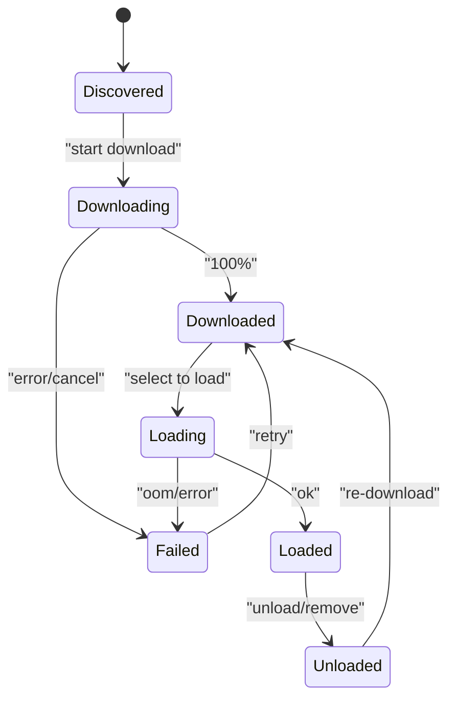

[No sources needed since this diagram shows conceptual workflow, not actual code structure]

### Model Budget Calculation and Device-Adaptive Selection
- RAM budgeting:
  - The llama.rn runtime enforces a device RAM threshold during load
  - It computes required RAM from file size and compares against device capacity
- User guidance:
  - ModelItem displays estimated RAM and can surface a low-RAM warning
- Practical implication:
  - Users can choose smaller models when RAM is constrained

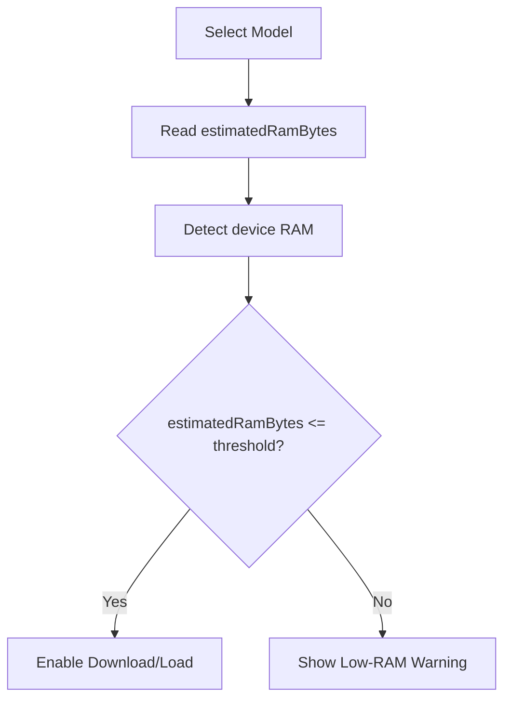

**Diagram sources**
- [runtime.ts:64-76](file://shared/ai/text-generation/runtime.ts#L64-L76)
- [model-item.tsx:120-127](file://features/model-management/components/model-item.tsx#L120-L127)

**Section sources**
- [runtime.ts:64-76](file://shared/ai/text-generation/runtime.ts#L64-L76)
- [model-item.tsx:120-127](file://features/model-management/components/model-item.tsx#L120-L127)

### Integrity Verification, Caching, and Cleanup
- Integrity:
  - No explicit checksum or hash verification is implemented in the manager
- Caching:
  - Short-lived in-memory cache for downloaded models (10 seconds TTL)
  - Cache invalidated on download/remove and after cancellation
- Cleanup:
  - Partial files deleted on errors or cancellations
  - Cache entries pruned when files disappear

**Section sources**
- [manager.ts:13-19](file://shared/ai/manager.ts#L13-L19)
- [manager.ts:194-213](file://shared/ai/manager.ts#L194-L213)
- [manager.ts:349-421](file://shared/ai/manager.ts#L349-L421)

### Integration with AI Runtime for Seamless Switching and Updates
- Auto-load:
  - On app start, attempts to reload the last-used model if present
- Sync:
  - Validates current runtime state against downloaded models and updates UI accordingly
- Switching:
  - Unload current model, load new model, persist selection, and refresh availability

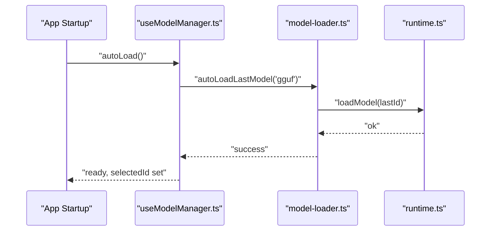

**Diagram sources**
- [useModelManager.ts:97-126](file://features/chat/view-model/hooks/useModelManager.ts#L97-L126)
- [model-loader.ts:123-137](file://shared/ai/model-loader.ts#L123-L137)
- [runtime.ts:34-106](file://shared/ai/text-generation/runtime.ts#L34-L106)

**Section sources**
- [useModelManager.ts:97-126](file://features/chat/view-model/hooks/useModelManager.ts#L97-L126)
- [model-loader.ts:123-137](file://shared/ai/model-loader.ts#L123-L137)

## Dependency Analysis
- UI depends on:
  - use-models for state and actions
  - manager for downloads and storage
  - catalogs for model metadata
- Manager depends on:
  - expo-file-system for IO
  - runtimes for loading
- Model loader depends on:
  - manager for local paths
  - runtimes for load/unload
- Runtimes depend on:
  - llama.rn and whisper.rn native bindings

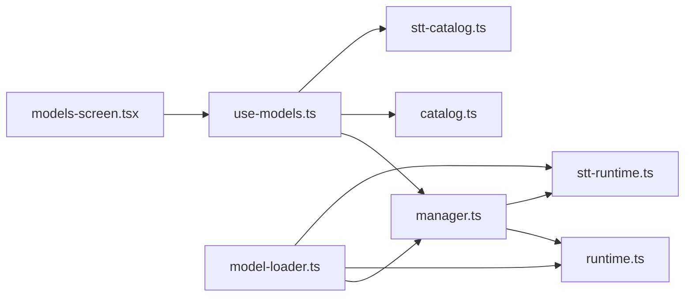

**Diagram sources**
- [models-screen.tsx:1-78](file://features/model-management/view/models-screen.tsx#L1-L78)
- [use-models.ts:1-208](file://features/model-management/view-model/use-models.ts#L1-L208)
- [manager.ts:1-422](file://shared/ai/manager.ts#L1-L422)
- [model-loader.ts:1-172](file://shared/ai/model-loader.ts#L1-L172)
- [runtime.ts:1-489](file://shared/ai/text-generation/runtime.ts#L1-L489)
- [stt-runtime.ts:1-99](file://shared/ai/stt/runtime.ts#L1-L99)

**Section sources**
- [use-models.ts:1-208](file://features/model-management/view-model/use-models.ts#L1-L208)
- [manager.ts:1-422](file://shared/ai/manager.ts#L1-L422)
- [model-loader.ts:1-172](file://shared/ai/model-loader.ts#L1-L172)

## Performance Considerations
- Download deduplication prevents redundant network usage
- Short-lived cache reduces filesystem scans
- Resumable downloads improve reliability over flaky networks
- llama.rn warmup and GPU layer configuration impact initial latency
- Tool-use detection enables efficient tool invocation when supported

[No sources needed since this section provides general guidance]

## Troubleshooting Guide
Common issues and their likely causes:
- Download fails or stalls:
  - Network connectivity problems; retry or check connection
  - Insufficient storage; free space and retry
- Load fails with insufficient memory:
  - Device RAM below recommended threshold; choose a smaller model
- Model disappears after removal:
  - File deleted but runtime still loaded; unload and refresh
- Operation in progress errors:
  - Attempted overlapping operations; wait for completion or cancel

Resolution steps:
- Retry download from the model item’s retry button
- Remove and re-download the model if corruption suspected
- Unload current model before removing
- Use structured errors to surface actionable messages to users

**Section sources**
- [errors.ts:74-127](file://shared/ai/model-management/errors.ts#L74-L127)
- [errors.ts:166-183](file://shared/ai/model-management/errors.ts#L166-L183)
- [manager.ts:218-240](file://shared/ai/manager.ts#L218-L240)
- [model-item.tsx:105-119](file://features/model-management/components/model-item.tsx#L105-L119)

## Conclusion
The model management system provides a cohesive experience for discovering, downloading, and loading GGUF and binary models. It integrates tightly with llama.rn and whisper.rn, offers robust progress tracking and caching, and supports seamless switching and auto-loading. The UI clearly communicates status and resource requirements, enabling informed decisions aligned with device capabilities.