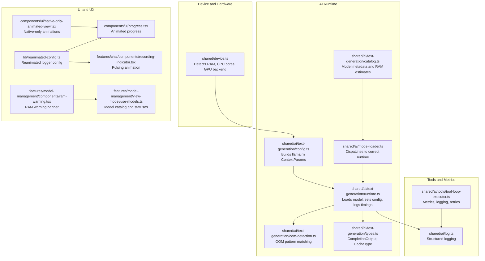
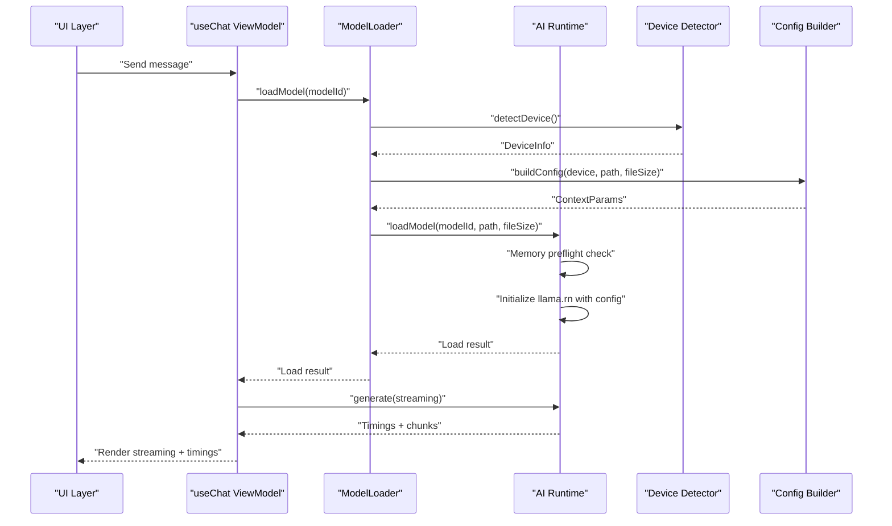
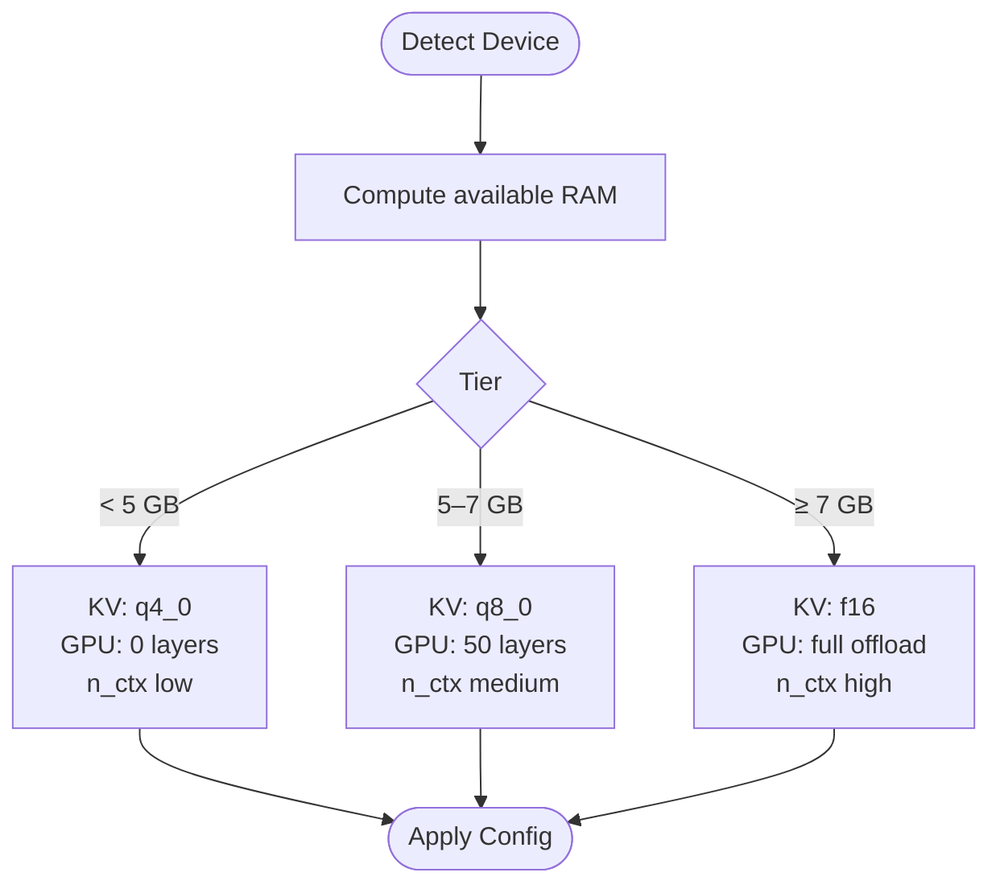
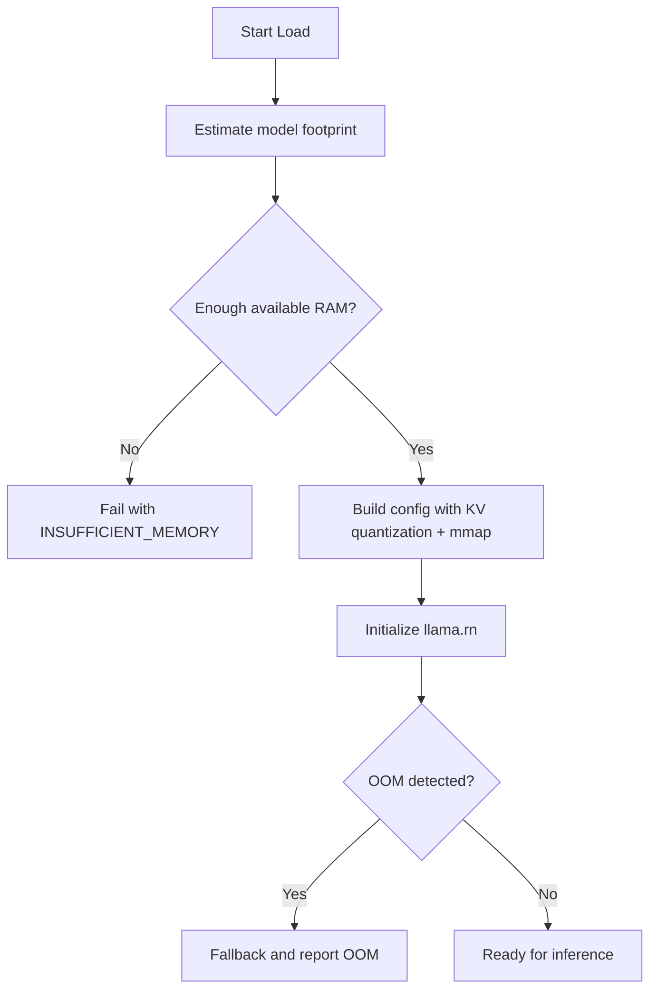
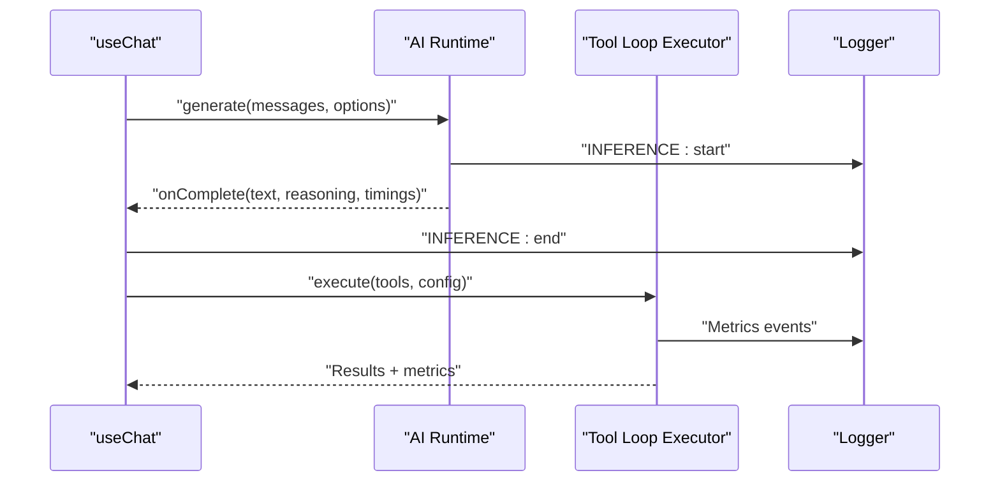
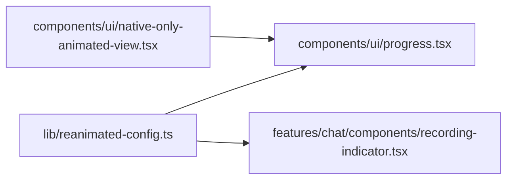
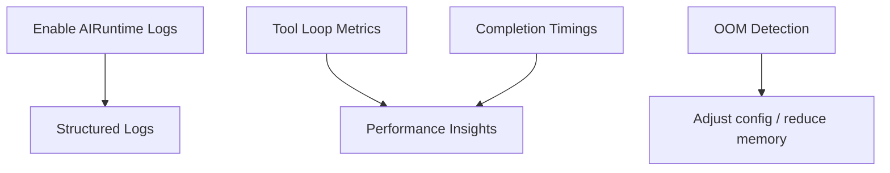
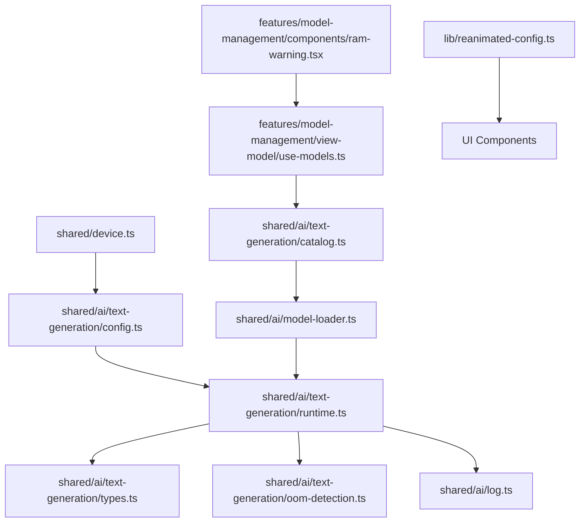

# Performance Optimization

<cite>
**Referenced Files in This Document**
- [README.md](file://README.md)
- [shared/device.ts](file://shared/device.ts)
- [shared/ai/text-generation/config.ts](file://shared/ai/text-generation/config.ts)
- [shared/ai/text-generation/runtime.ts](file://shared/ai/text-generation/runtime.ts)
- [shared/ai/text-generation/oom-detection.ts](file://shared/ai/text-generation/oom-detection.ts)
- [shared/ai/text-generation/types.ts](file://shared/ai/text-generation/types.ts)
- [shared/ai/text-generation/catalog.ts](file://shared/ai/text-generation/catalog.ts)
- [shared/ai/model-loader.ts](file://shared/ai/model-loader.ts)
- [features/chat/view-model/use-chat.ts](file://features/chat/view-model/use-chat.ts)
- [features/model-management/view-model/use-models.ts](file://features/model-management/view-model/use-models.ts)
- [features/model-management/components/ram-warning.tsx](file://features/model-management/components/ram-warning.tsx)
- [lib/reanimated-config.ts](file://lib/reanimated-config.ts)
- [components/ui/native-only-animated-view.tsx](file://components/ui/native-only-animated-view.tsx)
- [components/ui/progress.tsx](file://components/ui/progress.tsx)
- [features/chat/components/recording-indicator.tsx](file://features/chat/components/recording-indicator.tsx)
- [shared/ai/tools/tool-loop-executor.ts](file://shared/ai/tools/tool-loop-executor.ts)
- [shared/ai/log.ts](file://shared/ai/log.ts)
</cite>

## Table of Contents
1. [Introduction](#introduction)
2. [Project Structure](#project-structure)
3. [Core Components](#core-components)
4. [Architecture Overview](#architecture-overview)
5. [Detailed Component Analysis](#detailed-component-analysis)
6. [Dependency Analysis](#dependency-analysis)
7. [Performance Considerations](#performance-considerations)
8. [Troubleshooting Guide](#troubleshooting-guide)
9. [Conclusion](#conclusion)

## Introduction
This document explains how My Shadow optimizes runtime efficiency and resource management for on-device AI inference. It covers the automatic device optimization system that adapts llama.rn configuration based on available RAM, CPU cores, and GPU capabilities; the three-tier device support model; memory optimization techniques such as KV cache quantization and automatic OOM fallback; performance monitoring via metrics and adaptive configuration; UI animation configuration for smoothness; profiling techniques; device category strategies; and trade-offs among performance, memory usage, context size, and layer offloading.

## Project Structure
The performance-critical parts of the codebase are organized by responsibility:
- Device capability detection and tier mapping
- Runtime configuration generation for llama.rn
- Model loading orchestration and memory safety checks
- Streaming chat and inference telemetry
- UI animation configuration and components
- Tool loop execution metrics and observability
- RAM warnings and model catalog metadata

**Diagram sources**
- [shared/device.ts:122-171](file://shared/device.ts#L122-L171)
- [shared/ai/text-generation/config.ts:4-31](file://shared/ai/text-generation/config.ts#L4-L31)
- [shared/ai/text-generation/runtime.ts:47-124](file://shared/ai/text-generation/runtime.ts#L47-L124)
- [shared/ai/text-generation/oom-detection.ts:1-37](file://shared/ai/text-generation/oom-detection.ts#L1-L37)
- [shared/ai/text-generation/types.ts:1-22](file://shared/ai/text-generation/types.ts#L1-L22)
- [shared/ai/text-generation/catalog.ts:1-330](file://shared/ai/text-generation/catalog.ts#L1-L330)
- [shared/ai/model-loader.ts:11-63](file://shared/ai/model-loader.ts#L11-L63)
- [lib/reanimated-config.ts:1-9](file://lib/reanimated-config.ts#L1-L9)
- [components/ui/native-only-animated-view.tsx:1-23](file://components/ui/native-only-animated-view.tsx#L1-L23)
- [components/ui/progress.tsx:1-64](file://components/ui/progress.tsx#L1-L64)
- [features/chat/components/recording-indicator.tsx:1-48](file://features/chat/components/recording-indicator.tsx#L1-L48)
- [features/model-management/components/ram-warning.tsx:1-31](file://features/model-management/components/ram-warning.tsx#L1-L31)
- [features/model-management/view-model/use-models.ts:1-208](file://features/model-management/view-model/use-models.ts#L1-L208)
- [shared/ai/tools/tool-loop-executor.ts:1-1013](file://shared/ai/tools/tool-loop-executor.ts#L1-L1013)
- [shared/ai/log.ts:1-36](file://shared/ai/log.ts#L1-L36)

**Section sources**
- [README.md:124-149](file://README.md#L124-L149)
- [shared/device.ts:122-171](file://shared/device.ts#L122-L171)
- [shared/ai/text-generation/config.ts:4-31](file://shared/ai/text-generation/config.ts#L4-L31)
- [shared/ai/text-generation/runtime.ts:47-124](file://shared/ai/text-generation/runtime.ts#L47-L124)
- [shared/ai/text-generation/oom-detection.ts:1-37](file://shared/ai/text-generation/oom-detection.ts#L1-L37)
- [shared/ai/text-generation/types.ts:1-22](file://shared/ai/text-generation/types.ts#L1-L22)
- [shared/ai/text-generation/catalog.ts:1-330](file://shared/ai/text-generation/catalog.ts#L1-L330)
- [shared/ai/model-loader.ts:11-63](file://shared/ai/model-loader.ts#L11-L63)
- [lib/reanimated-config.ts:1-9](file://lib/reanimated-config.ts#L1-L9)
- [components/ui/native-only-animated-view.tsx:1-23](file://components/ui/native-only-animated-view.tsx#L1-L23)
- [components/ui/progress.tsx:1-64](file://components/ui/progress.tsx#L1-L64)
- [features/chat/components/recording-indicator.tsx:1-48](file://features/chat/components/recording-indicator.tsx#L1-L48)
- [features/model-management/components/ram-warning.tsx:1-31](file://features/model-management/components/ram-warning.tsx#L1-L31)
- [features/model-management/view-model/use-models.ts:1-208](file://features/model-management/view-model/use-models.ts#L1-L208)
- [shared/ai/tools/tool-loop-executor.ts:1-1013](file://shared/ai/tools/tool-loop-executor.ts#L1-L1013)
- [shared/ai/log.ts:1-36](file://shared/ai/log.ts#L1-L36)

## Core Components
- Device detection: Estimates total and available RAM, CPU cores, and GPU backend to inform runtime configuration.
- Configuration builder: Produces llama.rn ContextParams tuned by device tier and model size.
- Model loader: Validates storage presence, dispatches to the correct runtime, and records timing.
- Inference orchestration: Streams completions, captures timings, and handles errors.
- Memory safety: OOM detection patterns and early memory checks prevent crashes.
- UI animations: Reanimated configuration and platform-aware components for smooth transitions.
- Tools execution: Metrics-driven tool loop with logging, retries, and observability.
- RAM warnings: User-facing guidance when device RAM is insufficient for a model.

**Section sources**
- [shared/device.ts:122-171](file://shared/device.ts#L122-L171)
- [shared/ai/text-generation/config.ts:4-31](file://shared/ai/text-generation/config.ts#L4-L31)
- [shared/ai/model-loader.ts:11-63](file://shared/ai/model-loader.ts#L11-L63)
- [features/chat/view-model/use-chat.ts:101-183](file://features/chat/view-model/use-chat.ts#L101-L183)
- [shared/ai/text-generation/oom-detection.ts:1-37](file://shared/ai/text-generation/oom-detection.ts#L1-L37)
- [lib/reanimated-config.ts:1-9](file://lib/reanimated-config.ts#L1-L9)
- [shared/ai/tools/tool-loop-executor.ts:1-1013](file://shared/ai/tools/tool-loop-executor.ts#L1-L1013)
- [features/model-management/components/ram-warning.tsx:15-31](file://features/model-management/components/ram-warning.tsx#L15-L31)

## Architecture Overview
The system automatically adapts llama.rn configuration to device capabilities and model characteristics. It performs memory preflight checks, applies KV cache quantization, enables GPU acceleration when available, and uses mmap for efficient model loading. Inference is streamed with timing capture and robust error handling, including OOM detection. UI animations are optimized via Reanimated configuration and platform-aware components.

**Diagram sources**
- [features/chat/view-model/use-chat.ts:101-183](file://features/chat/view-model/use-chat.ts#L101-L183)
- [shared/ai/model-loader.ts:11-63](file://shared/ai/model-loader.ts#L11-L63)
- [shared/device.ts:122-171](file://shared/device.ts#L122-L171)
- [shared/ai/text-generation/config.ts:4-31](file://shared/ai/text-generation/config.ts#L4-L31)
- [shared/ai/text-generation/runtime.ts:47-124](file://shared/ai/text-generation/runtime.ts#L47-L124)

## Detailed Component Analysis

### Automatic Device Optimization and Three-Tier Support
My Shadow detects device capabilities and selects an appropriate configuration tier:
- Budget: < 5 GB RAM, KV cache quantized to reduce memory usage, CPU-only.
- Mid-Range: 5–7 GB RAM, KV cache at q8_0, moderate GPU layers.
- Premium: ≥ 7 GB RAM, KV cache at f16, full GPU offload.

**Diagram sources**
- [shared/device.ts:122-171](file://shared/device.ts#L122-L171)
- [shared/ai/text-generation/config.ts:10-31](file://shared/ai/text-generation/config.ts#L10-L31)
- [README.md:133-139](file://README.md#L133-L139)

**Section sources**
- [shared/device.ts:122-171](file://shared/device.ts#L122-L171)
- [shared/ai/text-generation/config.ts:10-31](file://shared/ai/text-generation/config.ts#L10-L31)
- [README.md:133-139](file://README.md#L133-L139)

### Memory Optimization Techniques
- KV cache quantization: Selects q4_0 for budget, q8_0 for mid-range, f16 for premium.
- mmap model loading: Enabled to improve I/O efficiency and reduce peak memory.
- Automatic OOM fallback: Detects OOM-like errors and surfaces actionable diagnostics.
- Early memory preflight: Compares model footprint against available RAM before loading.

**Diagram sources**
- [shared/ai/text-generation/runtime.ts:59-76](file://shared/ai/text-generation/runtime.ts#L59-L76)
- [shared/ai/text-generation/config.ts:23-26](file://shared/ai/text-generation/config.ts#L23-L26)
- [shared/ai/text-generation/oom-detection.ts:1-37](file://shared/ai/text-generation/oom-detection.ts#L1-L37)

**Section sources**
- [shared/ai/text-generation/runtime.ts:59-76](file://shared/ai/text-generation/runtime.ts#L59-L76)
- [shared/ai/text-generation/config.ts:23-26](file://shared/ai/text-generation/config.ts#L23-L26)
- [shared/ai/text-generation/oom-detection.ts:1-37](file://shared/ai/text-generation/oom-detection.ts#L1-L37)

### Performance Monitoring and Adaptive Adjustments
- Structured logging: Tags and metadata for loads, inferences, and errors.
- Timings capture: CompletionOutput exposes native timings for latency analysis.
- Tool loop metrics: Iteration counts, cache hits/misses, retries, and parallel executions.
- Telemetry hooks: Inference start/end logs and error tagging for diagnosis.

**Diagram sources**
- [features/chat/view-model/use-chat.ts:123-172](file://features/chat/view-model/use-chat.ts#L123-L172)
- [shared/ai/text-generation/types.ts:4-9](file://shared/ai/text-generation/types.ts#L4-L9)
- [shared/ai/tools/tool-loop-executor.ts:945-1004](file://shared/ai/tools/tool-loop-executor.ts#L945-L1004)
- [shared/ai/log.ts:7-36](file://shared/ai/log.ts#L7-L36)

**Section sources**
- [features/chat/view-model/use-chat.ts:123-172](file://features/chat/view-model/use-chat.ts#L123-L172)
- [shared/ai/text-generation/types.ts:4-9](file://shared/ai/text-generation/types.ts#L4-L9)
- [shared/ai/tools/tool-loop-executor.ts:945-1004](file://shared/ai/tools/tool-loop-executor.ts#L945-L1004)
- [shared/ai/log.ts:7-36](file://shared/ai/log.ts#L7-L36)

### Reanimated Configuration for Smooth UI Animations
- Reanimated logger configuration disables strict mode to avoid false positives during development while keeping it enabled for leak detection in debug sessions.
- Platform-aware animated views ensure native-only animations on non-native platforms.
- Progress indicators and recording visuals use Reanimated for smooth, efficient animations.

**Diagram sources**
- [lib/reanimated-config.ts:1-9](file://lib/reanimated-config.ts#L1-L9)
- [components/ui/progress.tsx:34-64](file://components/ui/progress.tsx#L34-L64)
- [features/chat/components/recording-indicator.tsx:1-48](file://features/chat/components/recording-indicator.tsx#L1-L48)
- [components/ui/native-only-animated-view.tsx:1-23](file://components/ui/native-only-animated-view.tsx#L1-L23)

**Section sources**
- [lib/reanimated-config.ts:1-9](file://lib/reanimated-config.ts#L1-L9)
- [components/ui/progress.tsx:34-64](file://components/ui/progress.tsx#L34-L64)
- [features/chat/components/recording-indicator.tsx:1-48](file://features/chat/components/recording-indicator.tsx#L1-L48)
- [components/ui/native-only-animated-view.tsx:1-23](file://components/ui/native-only-animated-view.tsx#L1-L23)

### Profiling Tools and Bottleneck Identification
- Logging controls: Conditional logging for AIRuntime enables verbose diagnostics in development or when enabled via environment.
- Metrics collection: Tool loop executor gathers comprehensive metrics for tool execution performance.
- Inference timings: CompletionOutput timings help identify latency hotspots in generation.
- OOM detection: Pattern-based detection of out-of-memory conditions aids in diagnosing memory pressure.

**Diagram sources**
- [shared/ai/log.ts:1-36](file://shared/ai/log.ts#L1-L36)
- [shared/ai/tools/tool-loop-executor.ts:945-1004](file://shared/ai/tools/tool-loop-executor.ts#L945-L1004)
- [shared/ai/text-generation/types.ts:4-9](file://shared/ai/text-generation/types.ts#L4-L9)
- [shared/ai/text-generation/oom-detection.ts:1-37](file://shared/ai/text-generation/oom-detection.ts#L1-L37)

**Section sources**
- [shared/ai/log.ts:1-36](file://shared/ai/log.ts#L1-L36)
- [shared/ai/tools/tool-loop-executor.ts:945-1004](file://shared/ai/tools/tool-loop-executor.ts#L945-L1004)
- [shared/ai/text-generation/types.ts:4-9](file://shared/ai/text-generation/types.ts#L4-L9)
- [shared/ai/text-generation/oom-detection.ts:1-37](file://shared/ai/text-generation/oom-detection.ts#L1-L37)

### Optimization Strategies by Device Category
- Budget devices (< 5 GB RAM):
  - Use q4_0 KV cache.
  - Keep n_ctx small.
  - Disable GPU layers; rely on CPU.
  - Prefer smaller models from the catalog.
- Mid-range devices (5–7 GB RAM):
  - Use q8_0 KV cache.
  - Moderate n_ctx and batch sizes.
  - Enable partial GPU offload when available.
- Premium devices (≥ 7 GB RAM):
  - Use f16 KV cache.
  - Larger n_ctx and batches.
  - Full GPU offload for best throughput.

**Section sources**
- [shared/ai/text-generation/config.ts:10-31](file://shared/ai/text-generation/config.ts#L10-L31)
- [shared/ai/text-generation/catalog.ts:1-330](file://shared/ai/text-generation/catalog.ts#L1-L330)
- [README.md:133-139](file://README.md#L133-L139)

### Battery Life, Thermal Management, and Background Processing
- Reduce concurrency and batch sizes on budget devices to lower power draw.
- Prefer CPU-only execution on low-power devices to minimize thermal load.
- Avoid background model loading; defer until foreground to preserve battery.
- Use platform-aware animation components to avoid unnecessary work on web.

[No sources needed since this section provides general guidance]

### Trade-offs Between Performance and Memory Usage
- Context size (n_ctx): Larger contexts improve long-term coherence but increase memory and compute cost.
- KV cache quantization: Lower precision reduces memory but may slightly impact quality.
- Batch and micro-batch sizes: Larger batches improve throughput but raise peak memory.
- Layer offloading: Full GPU offload accelerates inference but requires sufficient VRAM and may increase thermal output.

**Section sources**
- [shared/ai/text-generation/config.ts:18-29](file://shared/ai/text-generation/config.ts#L18-L29)
- [shared/ai/text-generation/runtime.ts:92-102](file://shared/ai/text-generation/runtime.ts#L92-L102)

## Dependency Analysis
The following diagram shows key dependencies among performance-critical modules.

**Diagram sources**
- [shared/device.ts:122-171](file://shared/device.ts#L122-L171)
- [shared/ai/text-generation/config.ts:4-31](file://shared/ai/text-generation/config.ts#L4-L31)
- [shared/ai/text-generation/runtime.ts:47-124](file://shared/ai/text-generation/runtime.ts#L47-L124)
- [shared/ai/text-generation/catalog.ts:1-330](file://shared/ai/text-generation/catalog.ts#L1-L330)
- [shared/ai/model-loader.ts:11-63](file://shared/ai/model-loader.ts#L11-L63)
- [shared/ai/text-generation/types.ts:1-22](file://shared/ai/text-generation/types.ts#L1-L22)
- [shared/ai/text-generation/oom-detection.ts:1-37](file://shared/ai/text-generation/oom-detection.ts#L1-L37)
- [shared/ai/log.ts:1-36](file://shared/ai/log.ts#L1-L36)
- [features/model-management/view-model/use-models.ts:1-208](file://features/model-management/view-model/use-models.ts#L1-L208)
- [features/model-management/components/ram-warning.tsx:1-31](file://features/model-management/components/ram-warning.tsx#L1-L31)
- [lib/reanimated-config.ts:1-9](file://lib/reanimated-config.ts#L1-L9)

**Section sources**
- [shared/device.ts:122-171](file://shared/device.ts#L122-L171)
- [shared/ai/text-generation/config.ts:4-31](file://shared/ai/text-generation/config.ts#L4-L31)
- [shared/ai/text-generation/runtime.ts:47-124](file://shared/ai/text-generation/runtime.ts#L47-L124)
- [shared/ai/text-generation/catalog.ts:1-330](file://shared/ai/text-generation/catalog.ts#L1-L330)
- [shared/ai/model-loader.ts:11-63](file://shared/ai/model-loader.ts#L11-L63)
- [shared/ai/text-generation/types.ts:1-22](file://shared/ai/text-generation/types.ts#L1-L22)
- [shared/ai/text-generation/oom-detection.ts:1-37](file://shared/ai/text-generation/oom-detection.ts#L1-L37)
- [shared/ai/log.ts:1-36](file://shared/ai/log.ts#L1-L36)
- [features/model-management/view-model/use-models.ts:1-208](file://features/model-management/view-model/use-models.ts#L1-L208)
- [features/model-management/components/ram-warning.tsx:1-31](file://features/model-management/components/ram-warning.tsx#L1-L31)
- [lib/reanimated-config.ts:1-9](file://lib/reanimated-config.ts#L1-L9)

## Performance Considerations
- Use platform-aware animated components to avoid unnecessary work on web.
- Prefer smaller models and lower n_ctx on budget devices to maintain responsiveness.
- Monitor completion timings and tool loop metrics to identify regressions.
- Enable logging selectively to avoid overhead in production builds.

[No sources needed since this section provides general guidance]

## Troubleshooting Guide
- Insufficient memory errors: Triggered when model footprint exceeds available RAM; reduce model size or device tier configuration.
- OOM detection: Pattern-based detection helps diagnose allocation failures; adjust KV cache precision and batch sizes.
- Logging: Use structured logs to trace load and inference lifecycles; enable debug logs during development.
- Tool loop failures: Review metrics for retries, cache misses, and errors; tune timeouts and concurrency.

**Section sources**
- [shared/ai/text-generation/runtime.ts:59-76](file://shared/ai/text-generation/runtime.ts#L59-L76)
- [shared/ai/text-generation/oom-detection.ts:1-37](file://shared/ai/text-generation/oom-detection.ts#L1-L37)
- [shared/ai/log.ts:1-36](file://shared/ai/log.ts#L1-L36)
- [shared/ai/tools/tool-loop-executor.ts:945-1004](file://shared/ai/tools/tool-loop-executor.ts#L945-L1004)

## Conclusion
My Shadow’s performance system combines device-aware configuration, memory-safe loading, and observability to deliver responsive on-device AI experiences across a wide range of hardware. By quantizing KV caches, enabling mmap, detecting OOM conditions, and tuning inference parameters per device tier, the app balances speed, quality, and stability. UI animations are optimized via Reanimated configuration, and comprehensive metrics and logging support ongoing performance tuning and troubleshooting.