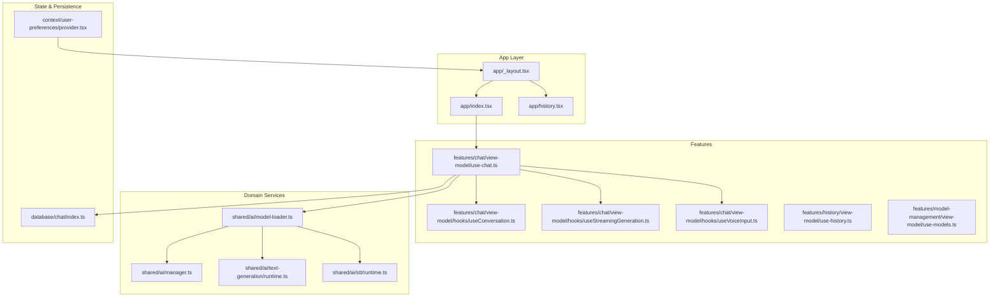
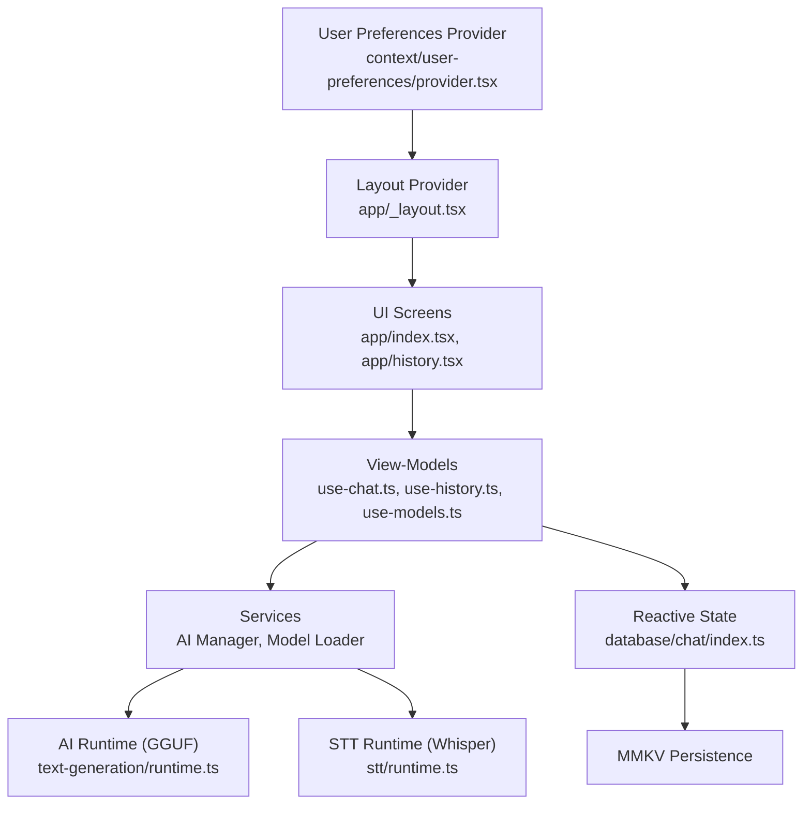
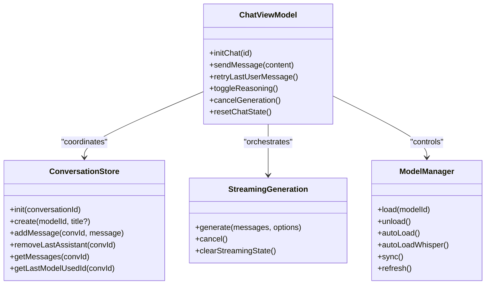
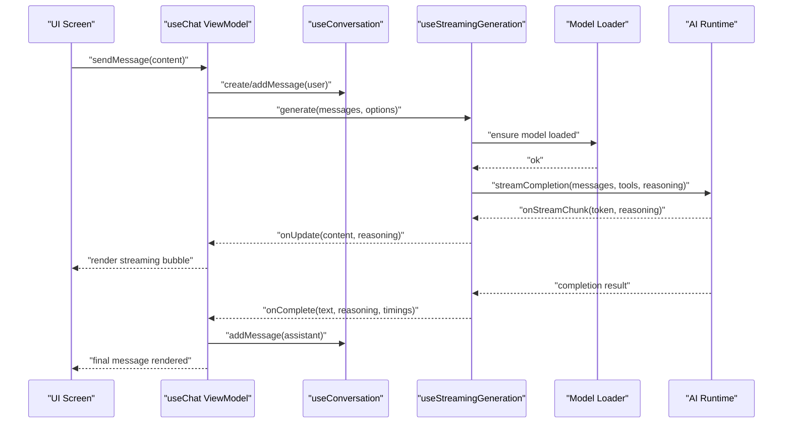
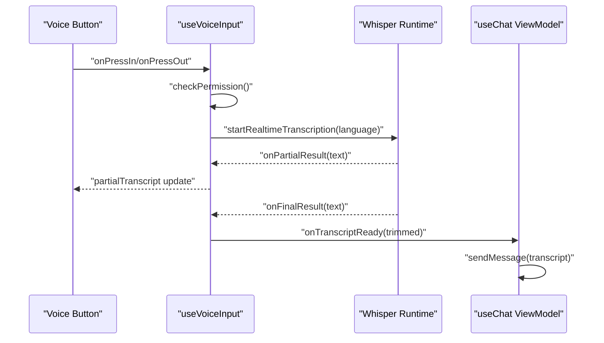
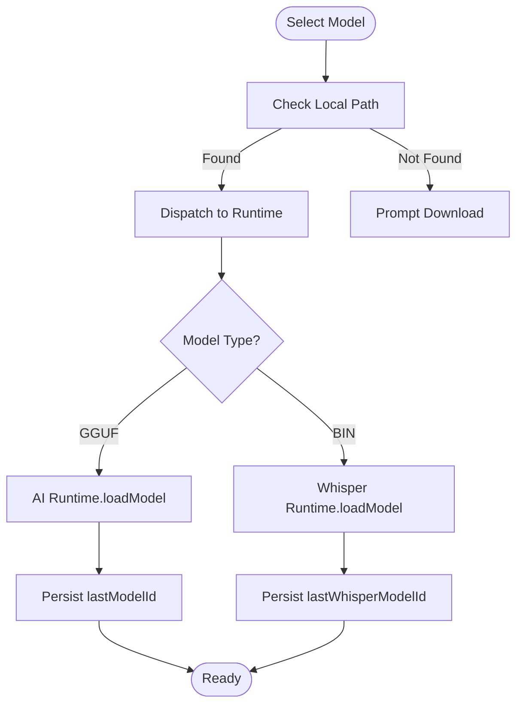
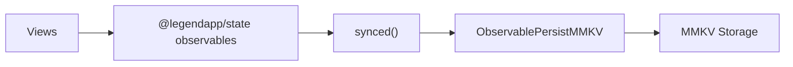
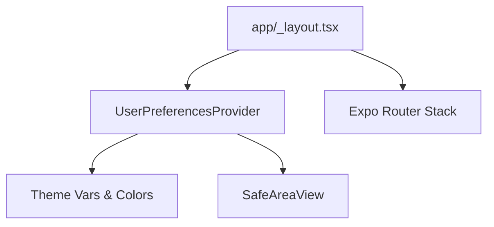
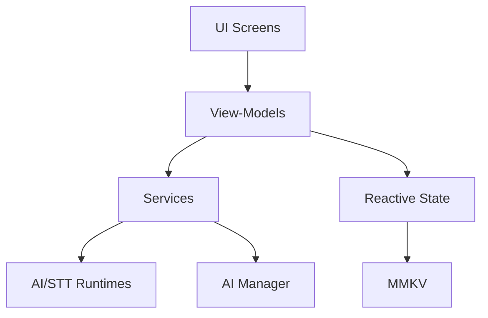

# Architecture Overview

<cite>
**Referenced Files in This Document**
- [README.md](file://README.md)
- [_layout.tsx](file://app/_layout.tsx)
- [provider.tsx](file://context/user-preferences/provider.tsx)
- [manager.ts](file://shared/ai/manager.ts)
- [model-loader.ts](file://shared/ai/model-loader.ts)
- [runtime.ts](file://shared/ai/text-generation/runtime.ts)
- [runtime.ts](file://shared/ai/stt/runtime.ts)
- [use-chat.ts](file://features/chat/view-model/use-chat.ts)
- [use-conversation.ts](file://features/chat/view-model/hooks/useConversation.ts)
- [use-streaming-generation.ts](file://features/chat/view-model/hooks/useStreamingGeneration.ts)
- [use-voice-input.ts](file://features/chat/view-model/hooks/useVoiceInput.ts)
- [index.ts](file://database/chat/index.ts)
- [index.tsx](file://app/index.tsx)
- [history.tsx](file://app/history.tsx)
</cite>

## Table of Contents
1. [Introduction](#introduction)
2. [Project Structure](#project-structure)
3. [Core Components](#core-components)
4. [Architecture Overview](#architecture-overview)
5. [Detailed Component Analysis](#detailed-component-analysis)
6. [Dependency Analysis](#dependency-analysis)
7. [Performance Considerations](#performance-considerations)
8. [Troubleshooting Guide](#troubleshooting-guide)
9. [Conclusion](#conclusion)

## Introduction
This document presents the My Shadow architecture overview, focusing on how the system orchestrates a React Native/Expo mobile foundation with local AI inference and speech-to-text processing. It explains the MVVM-style view-models, feature-driven modularity, reactive state management, and the data flow from user input to model responses, including persistent conversation history. Design patterns such as observer-based reactive state, factory-like runtime initialization, and repository-style model management are highlighted.

## Project Structure
The application follows a feature-driven modular architecture with clear separation between UI, view-models, domain services, and persistence:
- app/: Entry screens and routing
- features/chat/: Chat feature with view-models, models, and components
- features/history/: History feature with view-models and components
- features/model-management/: Model catalog and selection UI
- shared/ai/: AI runtime abstractions for text generation and speech-to-text
- database/: Reactive state for chat and preferences backed by MMKV
- context/: Application-wide providers for user preferences and theming
- components/: Reusable UI primitives and molecules

**Diagram sources**
- [_layout.tsx:12-50](file://app/_layout.tsx#L12-L50)
- [index.tsx:1-6](file://app/index.tsx#L1-L6)
- [history.tsx:1-6](file://app/history.tsx#L1-L6)
- [use-chat.ts:22-371](file://features/chat/view-model/use-chat.ts#L22-L371)
- [use-conversation.ts:11-236](file://features/chat/view-model/hooks/useConversation.ts#L11-L236)
- [use-streaming-generation.ts:39-275](file://features/chat/view-model/hooks/useStreamingGeneration.ts#L39-L275)
- [use-voice-input.ts:59-358](file://features/chat/view-model/hooks/useVoiceInput.ts#L59-L358)
- [manager.ts:59-320](file://shared/ai/manager.ts#L59-L320)
- [model-loader.ts:11-172](file://shared/ai/model-loader.ts#L11-L172)
- [runtime.ts:14-489](file://shared/ai/text-generation/runtime.ts#L14-L489)
- [runtime.ts:5-99](file://shared/ai/stt/runtime.ts#L5-L99)
- [index.ts:14-31](file://database/chat/index.ts#L14-L31)
- [provider.tsx:19-157](file://context/user-preferences/provider.tsx#L19-L157)

**Section sources**
- [_layout.tsx:12-50](file://app/_layout.tsx#L12-L50)
- [index.tsx:1-6](file://app/index.tsx#L1-L6)
- [history.tsx:1-6](file://app/history.tsx#L1-L6)
- [use-chat.ts:22-371](file://features/chat/view-model/use-chat.ts#L22-L371)
- [manager.ts:59-320](file://shared/ai/manager.ts#L59-L320)
- [model-loader.ts:11-172](file://shared/ai/model-loader.ts#L11-L172)
- [runtime.ts:14-489](file://shared/ai/text-generation/runtime.ts#L14-L489)
- [runtime.ts:5-99](file://shared/ai/stt/runtime.ts#L5-L99)
- [index.ts:14-31](file://database/chat/index.ts#L14-L31)
- [provider.tsx:19-157](file://context/user-preferences/provider.tsx#L19-L157)

## Core Components
- React Native/Expo mobile foundation: Provides cross-platform UI, navigation, gesture handling, keyboard, safe areas, and portal host for overlays.
- AI Manager: Centralized orchestration for model discovery, download, caching, and removal with progress callbacks and cancellation.
- Model Loader: Unified dispatcher for loading/unloading LLM and Whisper models, persists last-used model IDs, and exposes availability.
- AI Runtime (llama.rn): Singleton runtime for GGUF-based text generation with streaming, tool-call support, warm-up, and OOM fallback.
- STT Runtime (whisper.rn): Singleton runtime for binary Whisper models enabling real-time speech-to-text.
- Reactive State (LegendApp State + MMKV): Persistent chat state for conversations, last model IDs, and reasoning flag.
- View-Models: Feature-specific hooks implementing MVVM logic—orchestrating UI actions, coordinating services, and updating reactive state.
- Context Providers: User preferences provider supplies theme and color scheme to the app shell.

Key responsibilities:
- MVVM: View-models encapsulate presentation logic and state transitions; views bind to observable state.
- Feature-driven modularity: Each feature (chat, history, models) maintains its own view-models and components.
- Reactive state: Observer pattern drives UI updates without manual subscriptions.
- Separation of concerns: Business logic resides in view-models and services; UI components remain declarative.

**Section sources**
- [README.md:1-207](file://README.md#L1-L207)
- [manager.ts:59-320](file://shared/ai/manager.ts#L59-L320)
- [model-loader.ts:11-172](file://shared/ai/model-loader.ts#L11-L172)
- [runtime.ts:14-489](file://shared/ai/text-generation/runtime.ts#L14-L489)
- [runtime.ts:5-99](file://shared/ai/stt/runtime.ts#L5-L99)
- [index.ts:14-31](file://database/chat/index.ts#L14-L31)
- [use-chat.ts:22-371](file://features/chat/view-model/use-chat.ts#L22-L371)
- [provider.tsx:19-157](file://context/user-preferences/provider.tsx#L19-L157)

## Architecture Overview
High-level architecture:
- UI layer: Expo Router routes map to feature screens; providers wrap the app shell.
- View-model layer: Feature hooks coordinate services and reactive state.
- Domain services: AI Manager and Model Loader abstract model lifecycle; AI/STT runtimes handle inference.
- Persistence: Reactive chat state synchronized to MMKV for offline-first behavior.

**Diagram sources**
- [index.tsx:1-6](file://app/index.tsx#L1-L6)
- [history.tsx:1-6](file://app/history.tsx#L1-L6)
- [use-chat.ts:22-371](file://features/chat/view-model/use-chat.ts#L22-L371)
- [manager.ts:59-320](file://shared/ai/manager.ts#L59-L320)
- [model-loader.ts:11-172](file://shared/ai/model-loader.ts#L11-L172)
- [runtime.ts:14-489](file://shared/ai/text-generation/runtime.ts#L14-L489)
- [runtime.ts:5-99](file://shared/ai/stt/runtime.ts#L5-L99)
- [index.ts:14-31](file://database/chat/index.ts#L14-L31)
- [_layout.tsx:12-50](file://app/_layout.tsx#L12-L50)
- [provider.tsx:19-157](file://context/user-preferences/provider.tsx#L19-L157)

## Detailed Component Analysis

### MVVM Pattern Implementation
- View: Feature screens render UI and bind to observable state.
- ViewModel: Hooks encapsulate business logic, orchestrate services, and manage UI state.
- Model: Reactive state stores conversations and preferences; services handle AI lifecycles.

**Diagram sources**
- [use-chat.ts:22-371](file://features/chat/view-model/use-chat.ts#L22-L371)
- [use-conversation.ts:11-236](file://features/chat/view-model/hooks/useConversation.ts#L11-L236)
- [use-streaming-generation.ts:39-275](file://features/chat/view-model/hooks/useStreamingGeneration.ts#L39-L275)
- [use-model-manager.ts:14-217](file://features/chat/view-model/hooks/useModelManager.ts#L14-L217)

**Section sources**
- [use-chat.ts:22-371](file://features/chat/view-model/use-chat.ts#L22-L371)
- [use-conversation.ts:11-236](file://features/chat/view-model/hooks/useConversation.ts#L11-L236)
- [use-streaming-generation.ts:39-275](file://features/chat/view-model/hooks/useStreamingGeneration.ts#L39-L275)
- [use-model-manager.ts:14-217](file://features/chat/view-model/hooks/useModelManager.ts#L14-L217)

### Data Flow: From User Input to Model Responses
End-to-end flow for text generation:
1. User sends a message via the chat screen.
2. View-model validates input, creates a user message, and starts streaming generation.
3. Streaming hook invokes the AI runtime with tool-enabled configuration and streams tokens.
4. Assistant message is finalized and appended to the conversation.
5. Conversation history persists reactively to MMKV.

**Diagram sources**
- [use-chat.ts:101-183](file://features/chat/view-model/use-chat.ts#L101-L183)
- [use-conversation.ts:53-120](file://features/chat/view-model/hooks/useConversation.ts#L53-L120)
- [use-streaming-generation.ts:52-146](file://features/chat/view-model/hooks/useStreamingGeneration.ts#L52-L146)
- [model-loader.ts:11-63](file://shared/ai/model-loader.ts#L11-L63)
- [runtime.ts:256-477](file://shared/ai/text-generation/runtime.ts#L256-L477)

**Section sources**
- [use-chat.ts:101-183](file://features/chat/view-model/use-chat.ts#L101-L183)
- [use-streaming-generation.ts:52-146](file://features/chat/view-model/hooks/useStreamingGeneration.ts#L52-L146)
- [runtime.ts:256-477](file://shared/ai/text-generation/runtime.ts#L256-L477)

### Speech-to-Text Flow (Voice Input)
Voice input integrates with the STT runtime:
- Permission checks and audio mode setup.
- Real-time transcription with partial and final results.
- On final result, transcript is emitted to the chat view-model for immediate processing.

**Diagram sources**
- [use-voice-input.ts:185-247](file://features/chat/view-model/hooks/useVoiceInput.ts#L185-L247)
- [runtime.ts:20-54](file://shared/ai/stt/runtime.ts#L20-L54)
- [use-chat.ts:101-183](file://features/chat/view-model/use-chat.ts#L101-L183)

**Section sources**
- [use-voice-input.ts:185-247](file://features/chat/view-model/hooks/useVoiceInput.ts#L185-L247)
- [runtime.ts:20-54](file://shared/ai/stt/runtime.ts#L20-L54)
- [use-chat.ts:101-183](file://features/chat/view-model/use-chat.ts#L101-L183)

### Model Lifecycle and Auto-Load
Unified model loader dispatches to the correct runtime and persists last-used model IDs:
- Load/unload by model ID.
- Auto-load last model on app focus or chat init.
- Availability listing merges LLM and Whisper catalogs.

**Diagram sources**
- [model-loader.ts:11-63](file://shared/ai/model-loader.ts#L11-L63)
- [manager.ts:320-344](file://shared/ai/manager.ts#L320-L344)
- [runtime.ts:34-45](file://shared/ai/text-generation/runtime.ts#L34-L45)
- [runtime.ts:20-54](file://shared/ai/stt/runtime.ts#L20-L54)

**Section sources**
- [model-loader.ts:11-63](file://shared/ai/model-loader.ts#L11-L63)
- [manager.ts:320-344](file://shared/ai/manager.ts#L320-L344)
- [runtime.ts:34-45](file://shared/ai/text-generation/runtime.ts#L34-L45)
- [runtime.ts:20-54](file://shared/ai/stt/runtime.ts#L20-L54)

### Reactive State Management and Persistence
- Reactive store: Chat state holds conversations, last model IDs, and reasoning flag.
- Persistence: Synced observable persisted via MMKV for offline-first behavior.
- UI binding: Views subscribe to reactive values; updates propagate automatically.

**Diagram sources**
- [index.ts:14-31](file://database/chat/index.ts#L14-L31)

**Section sources**
- [index.ts:14-31](file://database/chat/index.ts#L14-L31)

### Context Providers and Theming
- UserPreferencesProvider: Supplies theme, color scheme, and background color to the app shell; integrates with system appearance and LegendApp state.
- Layout provider: Wraps the app with gesture handling, keyboard controller, safe area, portal host, and toasts.

**Diagram sources**
- [_layout.tsx:12-50](file://app/_layout.tsx#L12-L50)
- [provider.tsx:19-157](file://context/user-preferences/provider.tsx#L19-L157)

**Section sources**
- [_layout.tsx:12-50](file://app/_layout.tsx#L12-L50)
- [provider.tsx:19-157](file://context/user-preferences/provider.tsx#L19-L157)

## Dependency Analysis
- UI depends on view-models; view-models depend on services and reactive state.
- Services depend on runtimes and managers; runtimes depend on native modules (llama.rn, whisper.rn).
- Persistence is decoupled via LegendApp state plugins.

**Diagram sources**
- [use-chat.ts:22-371](file://features/chat/view-model/use-chat.ts#L22-L371)
- [manager.ts:59-320](file://shared/ai/manager.ts#L59-L320)
- [model-loader.ts:11-172](file://shared/ai/model-loader.ts#L11-L172)
- [runtime.ts:14-489](file://shared/ai/text-generation/runtime.ts#L14-L489)
- [runtime.ts:5-99](file://shared/ai/stt/runtime.ts#L5-L99)
- [index.ts:14-31](file://database/chat/index.ts#L14-L31)

**Section sources**
- [use-chat.ts:22-371](file://features/chat/view-model/use-chat.ts#L22-L371)
- [manager.ts:59-320](file://shared/ai/manager.ts#L59-L320)
- [model-loader.ts:11-172](file://shared/ai/model-loader.ts#L11-L172)
- [runtime.ts:14-489](file://shared/ai/text-generation/runtime.ts#L14-L489)
- [runtime.ts:5-99](file://shared/ai/stt/runtime.ts#L5-L99)
- [index.ts:14-31](file://database/chat/index.ts#L14-L31)

## Performance Considerations
- Adaptive device optimization: Runtime config generation and tiered device profiles reduce memory pressure and improve throughput.
- Streaming inference: Incremental rendering improves perceived latency and UX.
- OOM fallback: Automatic context halving on memory pressure.
- Warm-up: Pre-warming the model reduces first-token latency.
- Local-first design: All data stays on device with encrypted storage, minimizing network overhead.

[No sources needed since this section provides general guidance]

## Troubleshooting Guide
Common issues and recovery paths:
- Model load failures: Inspect memory requirements against device profile; verify model path existence; use auto-load last model on focus.
- Generation errors: Cancel ongoing generation, inspect partial content, and retry; check tool-call support for the selected model.
- STT runtime readiness: Ensure a Whisper model is loaded before transcription; handle NOT_READY errors gracefully.
- Conversation persistence: Verify reactive state sync and MMKV persistence; clear partial files if corrupted.

**Section sources**
- [runtime.ts:444-477](file://shared/ai/text-generation/runtime.ts#L444-L477)
- [runtime.ts:88-99](file://shared/ai/stt/runtime.ts#L88-L99)
- [use-streaming-generation.ts:93-118](file://features/chat/view-model/hooks/useStreamingGeneration.ts#L93-L118)
- [manager.ts:349-421](file://shared/ai/manager.ts#L349-L421)

## Conclusion
My Shadow’s architecture combines a robust MVVM-style view-model layer with feature-driven modularity, reactive state, and local AI runtimes. The AI Manager and Model Loader unify model lifecycle operations, while the AI and STT runtimes provide streaming, tool-call, and speech-to-text capabilities. Reactive state ensures seamless persistence and UI updates, delivering a responsive, privacy-preserving, and offline-first experience.