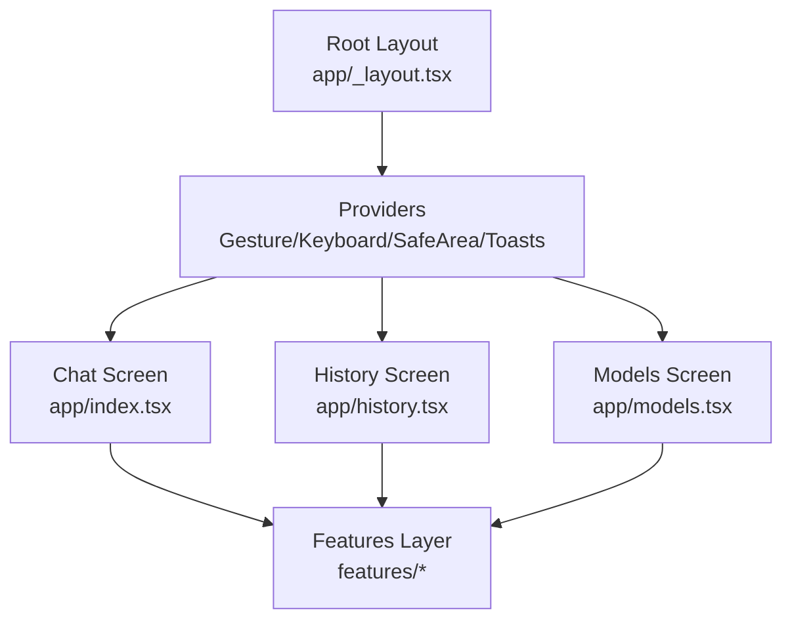
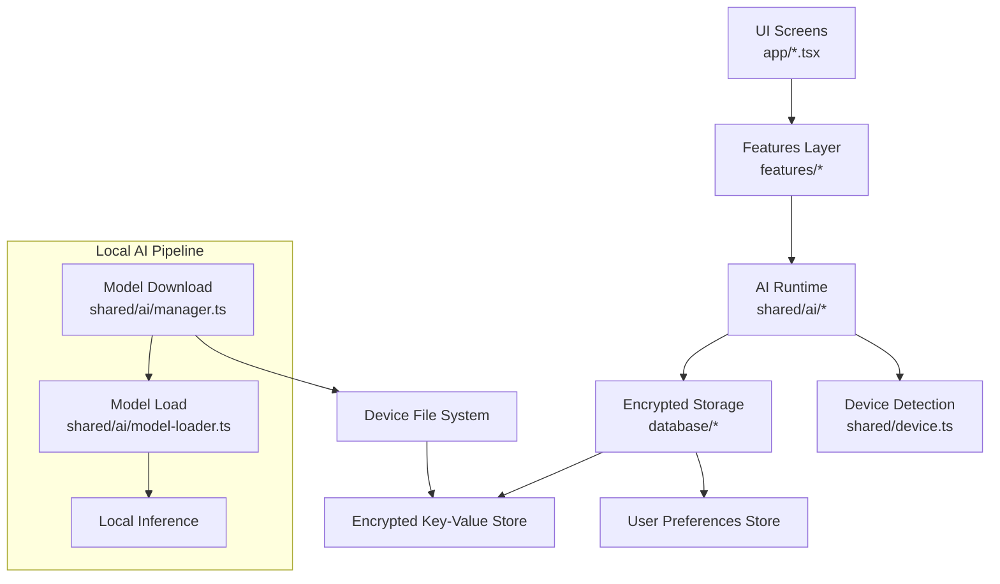
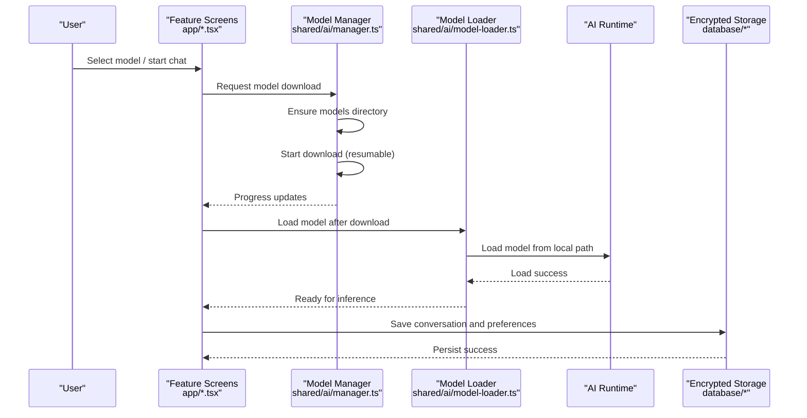
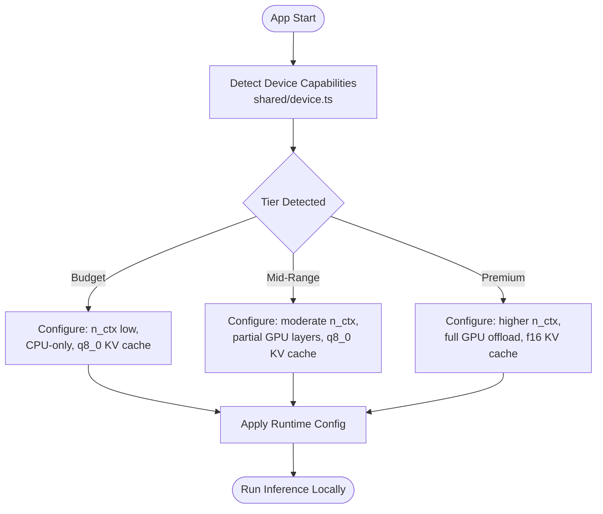
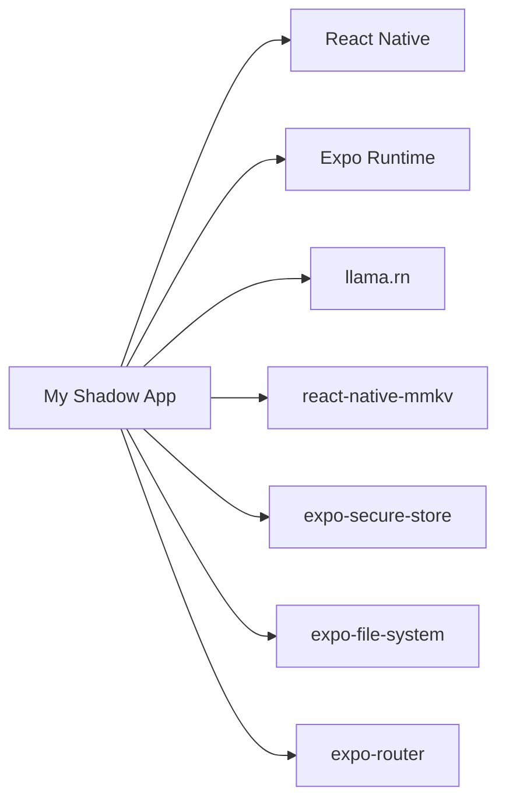

# Introduction and Purpose

<cite>
**Referenced Files in This Document**
- [README.md](file://README.md)
- [package.json](file://package.json)
- [app/_layout.tsx](file://app/_layout.tsx)
- [app/index.tsx](file://app/index.tsx)
- [shared/device.ts](file://shared/device.ts)
- [shared/ai/model-loader.ts](file://shared/ai/model-loader.ts)
- [shared/ai/manager.ts](file://shared/ai/manager.ts)
- [database/chat/index.ts](file://database/chat/index.ts)
- [database/user-preferences/state.ts](file://database/user-preferences/state.ts)
</cite>

## Table of Contents
1. [Introduction](#introduction)
2. [Project Structure](#project-structure)
3. [Core Components](#core-components)
4. [Architecture Overview](#architecture-overview)
5. [Detailed Component Analysis](#detailed-component-analysis)
6. [Dependency Analysis](#dependency-analysis)
7. [Performance Considerations](#performance-considerations)
8. [Troubleshooting Guide](#troubleshooting-guide)
9. [Conclusion](#conclusion)

## Introduction
My Shadow is a privacy-preserving, local-first AI chat application designed for users who want complete control over their data. Built with React Native and Expo, it runs entirely on your device, ensuring that conversations, models, and personal insights never leave your phone or tablet. There is no cloud sync, no external API calls, and no data transmission beyond your device.

At its core, My Shadow enables secure, private AI interactions by keeping everything local. It downloads and stores models on-device, loads them directly from your device’s storage, and performs all inference locally. This approach eliminates privacy risks associated with sending sensitive information to third-party servers, while still delivering responsive, capable AI experiences tailored to your hardware.

Why My Shadow exists:
- Privacy-first by design: All data stays on your device with encrypted storage.
- Local-only processing: No cloud sync or external API calls during normal operation.
- Complete data locality: Conversations, preferences, and models remain under your control.
- Practical performance: Automatic runtime optimization adapts to your device’s capabilities for smooth, reliable operation.

Target audience:
- Privacy-conscious individuals who refuse to compromise on data sovereignty.
- Developers exploring local AI solutions and edge computing on mobile platforms.
- Anyone seeking a secure, offline-capable AI chat experience without sacrificing usability.

Unique value proposition:
- Encrypted local storage for chats and preferences.
- Offline-first architecture with on-device model management.
- Complete data locality with no cloud dependencies.

Vision:
My Shadow envisions a future where powerful AI is accessible, private, and portable—without surrendering personal data. By combining a robust local runtime, transparent optimization, and strong encryption, it empowers users to reflect, reason, and interact with AI confidently, anywhere, anytime.

## Project Structure
The application follows a modular, feature-based structure with clear separation between UI, AI runtime, persistence, and user preferences. The root layout wires providers for gestures, keyboard handling, safe areas, and toast notifications, while feature screens expose the primary views for chat, history, and model management.

**Diagram sources**
- [app/_layout.tsx:12-50](file://app/_layout.tsx#L12-L50)
- [app/index.tsx:1-6](file://app/index.tsx#L1-L6)
- [app/history.tsx:1-6](file://app/history.tsx#L1-L6)
- [app/models.tsx:1-6](file://app/models.tsx#L1-L6)

**Section sources**
- [app/_layout.tsx:12-50](file://app/_layout.tsx#L12-L50)
- [app/index.tsx:1-6](file://app/index.tsx#L1-L6)
- [app/history.tsx:1-6](file://app/history.tsx#L1-L6)
- [app/models.tsx:1-6](file://app/models.tsx#L1-L6)

## Core Components
- Privacy-first runtime: The AI runtime loads models from local storage and performs inference without external calls. It selects appropriate model sizes and runtime configurations based on device capabilities.
- Encrypted local storage: Conversations and user preferences are persisted using encrypted key-value storage to keep data private and secure.
- Device-aware optimization: The system detects device capabilities and automatically configures runtime parameters for best performance and stability.
- Offline-first design: All model downloads, selections, and operations occur locally, enabling full functionality without network connectivity.

These components collectively deliver a seamless, secure, and private AI chat experience that respects user autonomy and data rights.

**Section sources**
- [README.md:3](file://README.md#L3)
- [shared/device.ts:122-171](file://shared/device.ts#L122-L171)
- [shared/ai/model-loader.ts:11-63](file://shared/ai/model-loader.ts#L11-L63)
- [database/chat/index.ts:14-30](file://database/chat/index.ts#L14-L30)
- [database/user-preferences/state.ts:6-19](file://database/user-preferences/state.ts#L6-L19)

## Architecture Overview
The architecture emphasizes local-first processing and encrypted persistence. The UI renders feature screens, which interact with the AI runtime and model manager. Models are downloaded and stored locally, then loaded directly from device storage. Conversations and preferences are persisted using encrypted storage plugins.

**Diagram sources**
- [app/index.tsx:1-6](file://app/index.tsx#L1-L6)
- [shared/ai/manager.ts:59-85](file://shared/ai/manager.ts#L59-L85)
- [shared/ai/model-loader.ts:11-63](file://shared/ai/model-loader.ts#L11-L63)
- [shared/device.ts:122-171](file://shared/device.ts#L122-L171)
- [database/chat/index.ts:14-30](file://database/chat/index.ts#L14-L30)
- [database/user-preferences/state.ts:6-19](file://database/user-preferences/state.ts#L6-L19)

## Detailed Component Analysis

### Privacy-Preserving Data Flow
This sequence illustrates how data remains on-device from model selection to conversation persistence.

**Diagram sources**
- [shared/ai/manager.ts:59-85](file://shared/ai/manager.ts#L59-L85)
- [shared/ai/model-loader.ts:11-63](file://shared/ai/model-loader.ts#L11-L63)
- [database/chat/index.ts:14-30](file://database/chat/index.ts#L14-L30)
- [database/user-preferences/state.ts:6-19](file://database/user-preferences/state.ts#L6-L19)

### Device-Aware Optimization
My Shadow detects device capabilities and applies runtime optimizations automatically. This ensures stable performance across a wide range of hardware without manual configuration.

**Diagram sources**
- [shared/device.ts:122-171](file://shared/device.ts#L122-L171)

**Section sources**
- [shared/device.ts:122-171](file://shared/device.ts#L122-L171)
- [README.md:86-118](file://README.md#L86-L118)

## Dependency Analysis
Key dependencies supporting the privacy-first approach:
- llama.rn: Local GGUF model inference engine for on-device AI.
- react-native-mmkv: Encrypted key-value storage for chats and preferences.
- expo-secure-store: Secure credential storage for sensitive keys.
- expo-file-system: Controlled access to device file system for model downloads and persistence.
- expo-router: File-based routing for navigation between feature screens.

**Diagram sources**
- [package.json:78](file://package.json#L78)
- [package.json:90](file://package.json#L90)
- [package.json:71](file://package.json#L71)
- [package.json:64](file://package.json#L64)
- [package.json:70](file://package.json#L70)
- [package.json:77](file://package.json#L77)
- [package.json:70](file://package.json#L70)

**Section sources**
- [package.json:19-102](file://package.json#L19-L102)

## Performance Considerations
- Automatic runtime adaptation: The system detects available RAM, CPU cores, and GPU capabilities to configure optimal settings per device tier.
- Memory-conscious design: Uses KV cache quantization and adaptive context sizing to reduce memory pressure and prevent out-of-memory failures.
- Resumable downloads: Model downloads are resumable and cached to minimize redundant transfers and improve reliability.
- Encrypted persistence: Data is stored securely using encrypted key-value storage to protect privacy without impacting usability.

[No sources needed since this section provides general guidance]

## Troubleshooting Guide
Common issues and resolutions:
- Model download failures: Verify network connectivity and retry. Downloads are resumable and progress updates are emitted.
- Out-of-memory errors: Reduce model size or adjust runtime settings; the system includes automatic fallbacks to lower context sizes.
- Storage permission problems: Ensure the app has access to the device file system for model and conversation storage.

**Section sources**
- [shared/ai/manager.ts:59-85](file://shared/ai/manager.ts#L59-L85)
- [README.md:100-104](file://README.md#L100-L104)

## Conclusion
My Shadow delivers a privacy-first, local AI chat experience that puts users in control of their data. By leveraging encrypted storage, on-device model management, and automatic runtime optimization, it provides a secure, offline-capable solution for private reflection and analysis. Whether you are a privacy advocate, a developer exploring local AI, or someone who simply wants a secure chat companion, My Shadow offers a practical path to powerful, private AI interactions—right on your device.