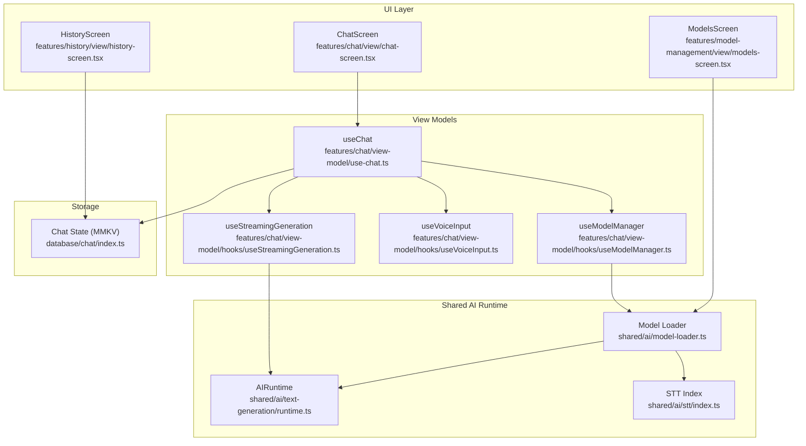
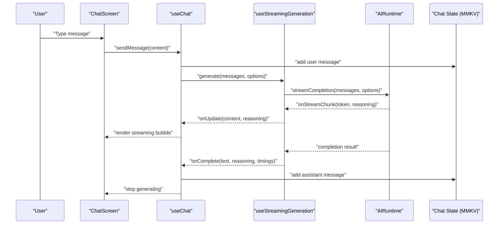
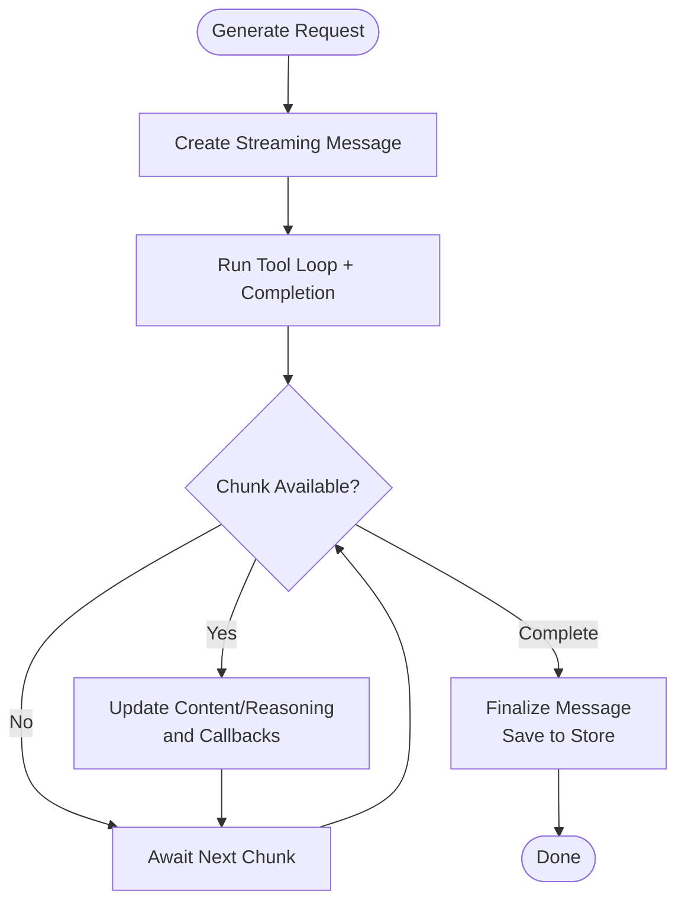
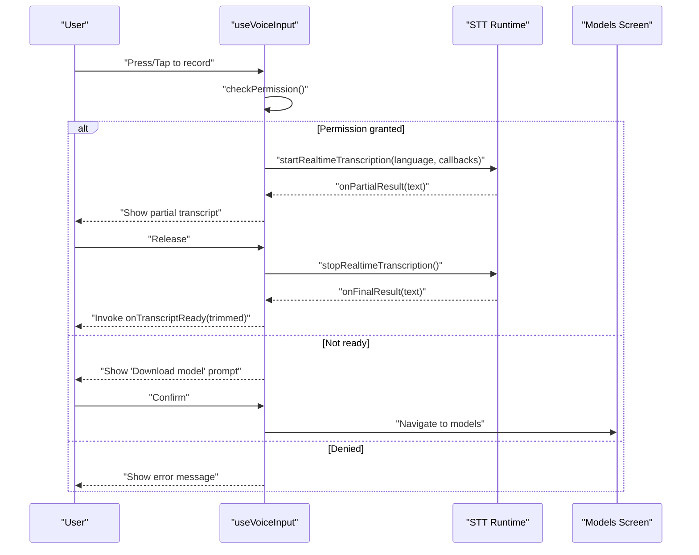
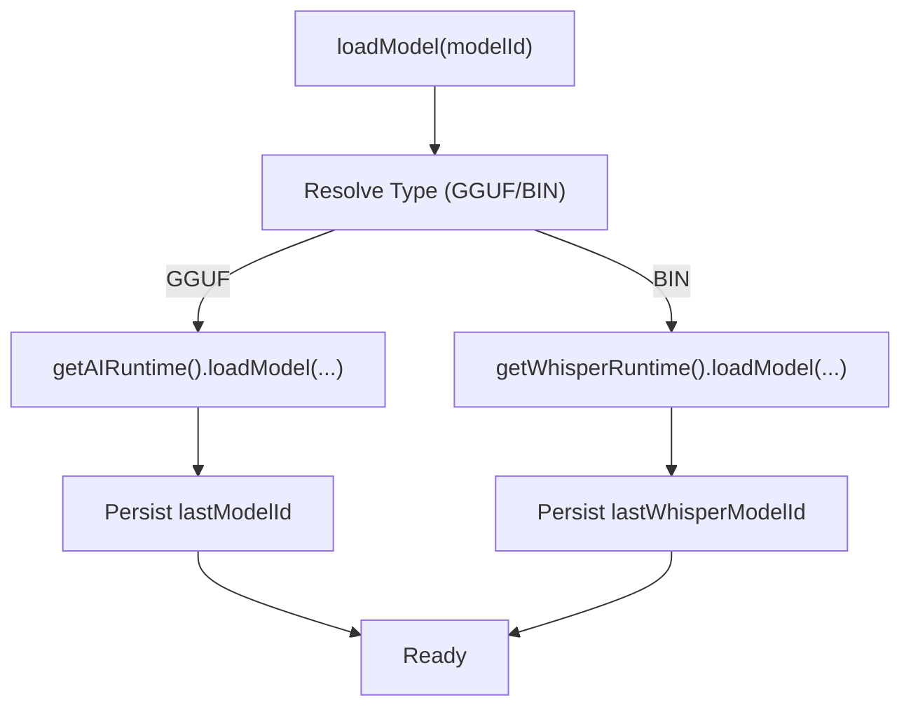
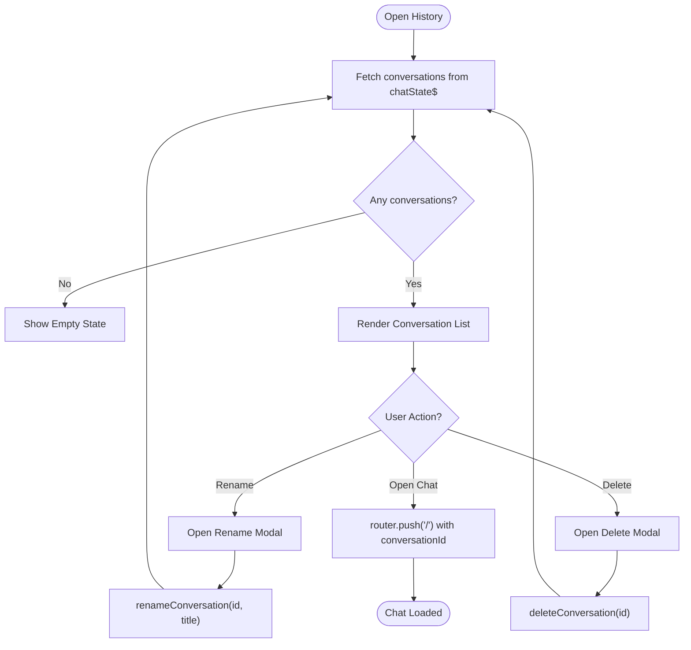
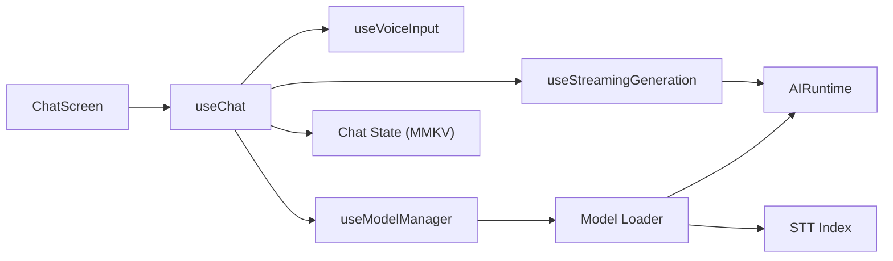

# Key Features and Benefits

<cite>
**Referenced Files in This Document**
- [README.md](file://README.md)
- [app/index.tsx](file://app/index.tsx)
- [features/chat/view/chat-screen.tsx](file://features/chat/view/chat-screen.tsx)
- [features/chat/view-model/use-chat.ts](file://features/chat/view-model/use-chat.ts)
- [features/chat/view-model/hooks/useStreamingGeneration.ts](file://features/chat/view-model/hooks/useStreamingGeneration.ts)
- [features/chat/view-model/hooks/useVoiceInput.ts](file://features/chat/view-model/hooks/useVoiceInput.ts)
- [features/chat/view-model/hooks/useModelManager.ts](file://features/chat/view-model/hooks/useModelManager.ts)
- [features/model-management/view/models-screen.tsx](file://features/model-management/view/models-screen.tsx)
- [features/history/view/history-screen.tsx](file://features/history/view/history-screen.tsx)
- [shared/ai/stt/index.ts](file://shared/ai/stt/index.ts)
- [shared/ai/text-generation/runtime.ts](file://shared/ai/text-generation/runtime.ts)
- [shared/ai/model-loader.ts](file://shared/ai/model-loader.ts)
- [database/chat/index.ts](file://database/chat/index.ts)
- [database/chat/types.ts](file://database/chat/types.ts)
- [shared/device.ts](file://shared/device.ts)
</cite>

## Table of Contents
1. [Introduction](#introduction)
2. [Project Structure](#project-structure)
3. [Core Components](#core-components)
4. [Architecture Overview](#architecture-overview)
5. [Detailed Component Analysis](#detailed-component-analysis)
6. [Dependency Analysis](#dependency-analysis)
7. [Performance Considerations](#performance-considerations)
8. [Troubleshooting Guide](#troubleshooting-guide)
9. [Conclusion](#conclusion)

## Introduction
My Shadow is a local-first, privacy-preserving reflection journal that performs all AI inference and speech processing on-device. It emphasizes complete data locality, offline capability, encrypted local storage, device-only processing, and no cloud sync. Users retain full control over personal data while benefiting from responsive local AI chat with streaming responses, real-time speech-to-text transcription using Whisper models, flexible model management, and persistent conversation history stored securely on-device.

## Project Structure
The application follows a modular, feature-based structure with clear separation between UI, view models, shared AI runtime, and encrypted storage:
- Entry point routes to the chat screen, which orchestrates the chat experience.
- Chat screen integrates messaging UI, bottom bar controls, and model selector.
- View models encapsulate reactive state and orchestrate AI generation, voice input, and model lifecycle.
- Shared AI modules provide GGUF model inference and Whisper STT with runtime abstraction.
- Encrypted storage persists conversations and preferences locally.

**Diagram sources**
- [features/chat/view/chat-screen.tsx:14-147](file://features/chat/view/chat-screen.tsx#L14-L147)
- [features/chat/view-model/use-chat.ts:22-370](file://features/chat/view-model/use-chat.ts#L22-L370)
- [features/chat/view-model/hooks/useStreamingGeneration.ts:39-164](file://features/chat/view-model/hooks/useStreamingGeneration.ts#L39-L164)
- [features/chat/view-model/hooks/useVoiceInput.ts:59-357](file://features/chat/view-model/hooks/useVoiceInput.ts#L59-L357)
- [features/chat/view-model/hooks/useModelManager.ts:14-216](file://features/chat/view-model/hooks/useModelManager.ts#L14-L216)
- [shared/ai/text-generation/runtime.ts:16-488](file://shared/ai/text-generation/runtime.ts#L16-L488)
- [shared/ai/model-loader.ts:11-171](file://shared/ai/model-loader.ts#L11-L171)
- [shared/ai/stt/index.ts:1-20](file://shared/ai/stt/index.ts#L1-L20)
- [database/chat/index.ts:14-30](file://database/chat/index.ts#L14-L30)

**Section sources**
- [app/index.tsx:1-6](file://app/index.tsx#L1-L6)
- [features/chat/view/chat-screen.tsx:14-147](file://features/chat/view/chat-screen.tsx#L14-L147)
- [features/model-management/view/models-screen.tsx:8-77](file://features/model-management/view/models-screen.tsx#L8-L77)
- [features/history/view/history-screen.tsx:23-148](file://features/history/view/history-screen.tsx#L23-L148)
- [database/chat/index.ts:14-30](file://database/chat/index.ts#L14-L30)

## Core Components
This section highlights the key features and their benefits, grounded in the codebase.

- Local AI chat with streaming responses
  - Real-time streaming tokens update the UI incrementally, enabling immediate feedback during generation.
  - Tool loop integration supports reasoning and tool use when supported by the model.
  - Benefits: low-latency, responsive interactions; transparent reasoning display; extensible tooling.

- Speech-to-text voice input using Whisper models
  - Real-time transcription with partial and final results, duration tracking, and cancellation preview.
  - Permission handling and graceful error messaging; optional Whisper model auto-load.
  - Benefits: hands-free input; immediate partial feedback; robust error handling and accessibility cues.

- Model management and selection
  - Unified catalog of GGUF and Whisper models; auto-load last-used model; manual load/unload; availability refresh.
  - Benefits: flexible model choice; seamless transitions; reduced friction for switching models.

- Conversation history with encrypted storage
  - Persistent conversations stored via MMKV with encryption; supports renaming, deletion, and navigation.
  - Benefits: continuity across sessions; secure retention; user control over data lifecycle.

- Privacy-focused architecture
  - All processing occurs on-device; no cloud sync; encrypted local storage; device-only inference.
  - Benefits: complete data locality; offline-first operation; no external data exposure.

**Section sources**
- [features/chat/view-model/hooks/useStreamingGeneration.ts:52-146](file://features/chat/view-model/hooks/useStreamingGeneration.ts#L52-L146)
- [features/chat/view-model/use-chat.ts:101-183](file://features/chat/view-model/use-chat.ts#L101-L183)
- [features/chat/view-model/hooks/useVoiceInput.ts:185-247](file://features/chat/view-model/hooks/useVoiceInput.ts#L185-L247)
- [features/chat/view-model/hooks/useModelManager.ts:32-150](file://features/chat/view-model/hooks/useModelManager.ts#L32-L150)
- [features/model-management/view/models-screen.tsx:21-40](file://features/model-management/view/models-screen.tsx#L21-L40)
- [features/history/view/history-screen.tsx:35-80](file://features/history/view/history-screen.tsx#L35-L80)
- [database/chat/index.ts:14-30](file://database/chat/index.ts#L14-L30)
- [README.md:1-207](file://README.md#L1-L207)

## Architecture Overview
The system is designed around a reactive state layer, a shared AI runtime abstraction, and encrypted persistence. The chat screen delegates to a view model that coordinates model lifecycle, streaming generation, and voice input. The runtime encapsulates device detection, model configuration, and inference execution.

**Diagram sources**
- [features/chat/view/chat-screen.tsx:117-139](file://features/chat/view/chat-screen.tsx#L117-L139)
- [features/chat/view-model/use-chat.ts:101-183](file://features/chat/view-model/use-chat.ts#L101-L183)
- [features/chat/view-model/hooks/useStreamingGeneration.ts:52-146](file://features/chat/view-model/hooks/useStreamingGeneration.ts#L52-L146)
- [shared/ai/text-generation/runtime.ts:256-477](file://shared/ai/text-generation/runtime.ts#L256-L477)
- [database/chat/index.ts:14-30](file://database/chat/index.ts#L14-L30)

**Section sources**
- [features/chat/view/chat-screen.tsx:14-147](file://features/chat/view/chat-screen.tsx#L14-L147)
- [features/chat/view-model/use-chat.ts:22-370](file://features/chat/view-model/use-chat.ts#L22-L370)
- [shared/ai/text-generation/runtime.ts:16-488](file://shared/ai/text-generation/runtime.ts#L16-L488)
- [database/chat/index.ts:14-30](file://database/chat/index.ts#L14-L30)

## Detailed Component Analysis

### Local AI Chat with Streaming Responses
- Reactive streaming updates:
  - The streaming hook maintains a transient “streaming” message and exposes isGenerating state.
  - Each token or reasoning chunk updates the UI immediately via callbacks.
- Tool loop and reasoning:
  - The generation pipeline integrates tool execution and reasoning toggles, updating UI progressively.
- Practical benefits:
  - Users receive near-instant feedback during generation.
  - Reasoning visibility helps understand internal thought processes.
  - Tool use enables dynamic actions without leaving the app.

**Diagram sources**
- [features/chat/view-model/hooks/useStreamingGeneration.ts:52-146](file://features/chat/view-model/hooks/useStreamingGeneration.ts#L52-L146)
- [features/chat/view-model/use-chat.ts:128-172](file://features/chat/view-model/use-chat.ts#L128-L172)

**Section sources**
- [features/chat/view-model/hooks/useStreamingGeneration.ts:39-164](file://features/chat/view-model/hooks/useStreamingGeneration.ts#L39-L164)
- [features/chat/view-model/use-chat.ts:101-183](file://features/chat/view-model/use-chat.ts#L101-L183)

### Speech-to-Text Voice Input Using Whisper Models
- Real-time transcription:
  - Starts recording with permission checks, tracks duration, and emits partial and final transcripts.
  - Handles errors gracefully with user-visible messages and resets to idle state.
- Model readiness:
  - If no Whisper model is present, prompts the user to download one.
- Practical benefits:
  - Hands-free input improves accessibility and speed.
  - Immediate partial results reduce uncertainty.
  - Clear error messaging and settings shortcuts improve usability.

**Diagram sources**
- [features/chat/view-model/hooks/useVoiceInput.ts:185-247](file://features/chat/view-model/hooks/useVoiceInput.ts#L185-L247)
- [features/chat/view-model/hooks/useVoiceInput.ts:253-269](file://features/chat/view-model/hooks/useVoiceInput.ts#L253-L269)
- [features/model-management/view/models-screen.tsx:21-40](file://features/model-management/view/models-screen.tsx#L21-L40)
- [shared/ai/stt/index.ts:3-5](file://shared/ai/stt/index.ts#L3-L5)

**Section sources**
- [features/chat/view-model/hooks/useVoiceInput.ts:59-357](file://features/chat/view-model/hooks/useVoiceInput.ts#L59-L357)
- [features/model-management/view/models-screen.tsx:8-77](file://features/model-management/view/models-screen.tsx#L8-L77)
- [shared/ai/stt/index.ts:1-20](file://shared/ai/stt/index.ts#L1-L20)

### Model Management and Selection
- Unified model loader:
  - Loads/unloads GGUF and Whisper models via a single interface, persists last-used model IDs, and refreshes availability.
- Auto-load and sync:
  - Automatically loads the last-used model on focus; syncs state if models are removed externally.
- Practical benefits:
  - Simplifies model lifecycle management.
  - Reduces friction by remembering user preferences.
  - Keeps UI in sync with installed models.

**Diagram sources**
- [shared/ai/model-loader.ts:11-63](file://shared/ai/model-loader.ts#L11-L63)
- [shared/ai/model-loader.ts:123-137](file://shared/ai/model-loader.ts#L123-L137)
- [shared/ai/model-loader.ts:139-171](file://shared/ai/model-loader.ts#L139-L171)

**Section sources**
- [features/chat/view-model/hooks/useModelManager.ts:14-216](file://features/chat/view-model/hooks/useModelManager.ts#L14-L216)
- [shared/ai/model-loader.ts:11-171](file://shared/ai/model-loader.ts#L11-L171)

### Conversation History with Encrypted Storage
- Encrypted persistence:
  - Conversations are persisted using MMKV with encryption, ensuring secure local storage.
- History screen:
  - Lists conversations, supports rename and delete actions, and navigates to selected chats.
- Practical benefits:
  - Users maintain a secure archive of past conversations.
  - Operations like rename and delete give fine-grained control over data.

**Diagram sources**
- [features/history/view/history-screen.tsx:23-148](file://features/history/view/history-screen.tsx#L23-L148)
- [database/chat/index.ts:14-30](file://database/chat/index.ts#L14-L30)

**Section sources**
- [features/history/view/history-screen.tsx:23-148](file://features/history/view/history-screen.tsx#L23-L148)
- [database/chat/index.ts:14-30](file://database/chat/index.ts#L14-L30)

### Privacy-Focused Architecture
- Device-only processing:
  - All inference and STT run locally; no network calls.
- Encrypted storage:
  - MMKV-backed persistence ensures data confidentiality.
- No cloud sync:
  - The app is designed to operate offline with no cloud synchronization.
- Practical benefits:
  - Users keep full control of their data.
  - Operation remains functional without internet connectivity.
  - Strong privacy posture prevents external data exposure.

**Section sources**
- [README.md:1-207](file://README.md#L1-L207)
- [database/chat/index.ts:22-26](file://database/chat/index.ts#L22-L26)

## Dependency Analysis
The following diagram shows how the UI, view models, and shared AI runtime depend on each other and on storage.

**Diagram sources**
- [features/chat/view/chat-screen.tsx:14-147](file://features/chat/view/chat-screen.tsx#L14-L147)
- [features/chat/view-model/use-chat.ts:22-370](file://features/chat/view-model/use-chat.ts#L22-L370)
- [features/chat/view-model/hooks/useStreamingGeneration.ts:39-164](file://features/chat/view-model/hooks/useStreamingGeneration.ts#L39-L164)
- [features/chat/view-model/hooks/useVoiceInput.ts:59-357](file://features/chat/view-model/hooks/useVoiceInput.ts#L59-L357)
- [features/chat/view-model/hooks/useModelManager.ts:14-216](file://features/chat/view-model/hooks/useModelManager.ts#L14-L216)
- [shared/ai/text-generation/runtime.ts:16-488](file://shared/ai/text-generation/runtime.ts#L16-L488)
- [shared/ai/model-loader.ts:11-171](file://shared/ai/model-loader.ts#L11-L171)
- [shared/ai/stt/index.ts:1-20](file://shared/ai/stt/index.ts#L1-L20)
- [database/chat/index.ts:14-30](file://database/chat/index.ts#L14-L30)

**Section sources**
- [features/chat/view/chat-screen.tsx:14-147](file://features/chat/view/chat-screen.tsx#L14-L147)
- [features/chat/view-model/use-chat.ts:22-370](file://features/chat/view-model/use-chat.ts#L22-L370)
- [shared/ai/text-generation/runtime.ts:16-488](file://shared/ai/text-generation/runtime.ts#L16-L488)
- [shared/ai/model-loader.ts:11-171](file://shared/ai/model-loader.ts#L11-L171)
- [database/chat/index.ts:14-30](file://database/chat/index.ts#L14-L30)

## Performance Considerations
- Adaptive device optimization:
  - Device detection determines CPU cores, available RAM, and GPU backend; runtime config adjusts accordingly.
- Memory-conscious design:
  - KV cache quantization, context-size adaptation, and OOM fallback reduce crashes and improve stability.
- Practical benefits:
  - Smooth performance across budget, mid-range, and premium devices.
  - Reduced cold-start memory usage on constrained devices.

**Section sources**
- [shared/device.ts:122-171](file://shared/device.ts#L122-L171)
- [README.md:86-118](file://README.md#L86-L118)

## Troubleshooting Guide
- Streaming generation errors:
  - The generation hook distinguishes between aborted and failed generations, reporting partial content when available.
- Voice input issues:
  - Permission denied, not ready (no model), out-of-memory, and unknown errors are surfaced with actionable messages and settings shortcuts.
- Model loading problems:
  - Model loader reports missing models or unsupported types; auto-load falls back to previous selections when available.

**Section sources**
- [features/chat/view-model/hooks/useStreamingGeneration.ts:39-164](file://features/chat/view-model/hooks/useStreamingGeneration.ts#L39-L164)
- [features/chat/view-model/hooks/useVoiceInput.ts:40-131](file://features/chat/view-model/hooks/useVoiceInput.ts#L40-L131)
- [shared/ai/model-loader.ts:11-63](file://shared/ai/model-loader.ts#L11-L63)

## Conclusion
My Shadow delivers a privacy-first, local-first experience with responsive AI chat, real-time voice input, flexible model management, and secure, encrypted storage. Its architecture ensures complete data locality, offline capability, and device-only processing, while reactive state management and runtime optimizations provide a smooth, accessible user experience across diverse devices.