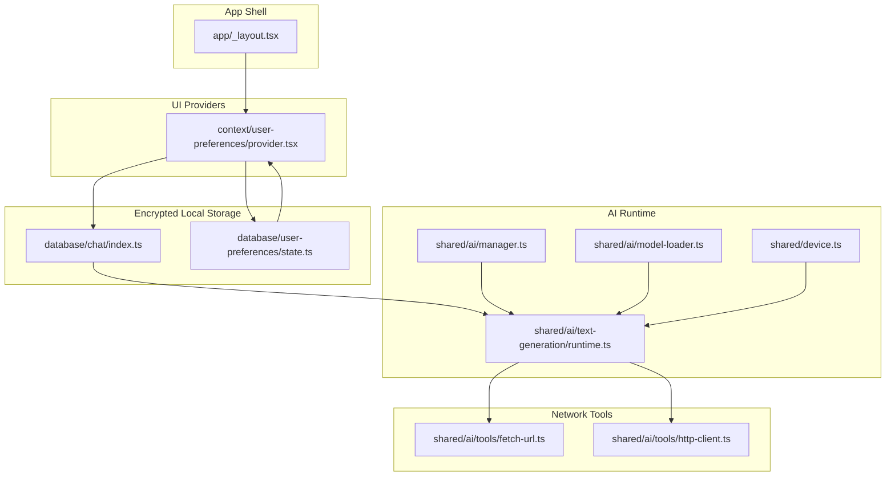
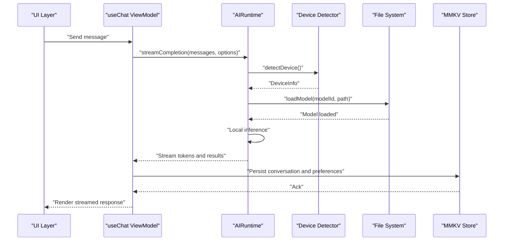
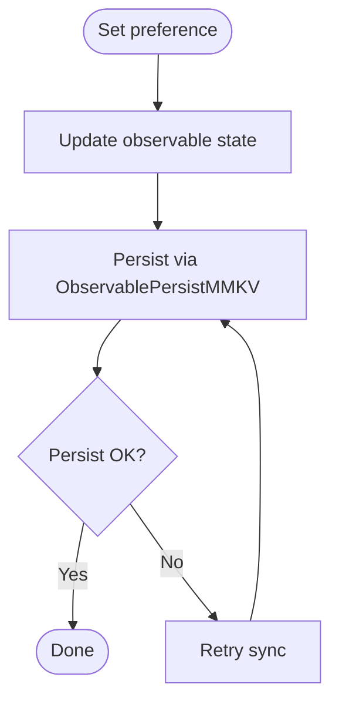
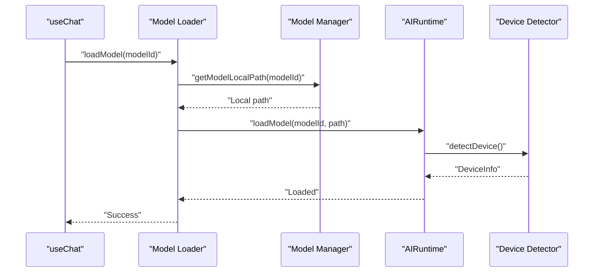
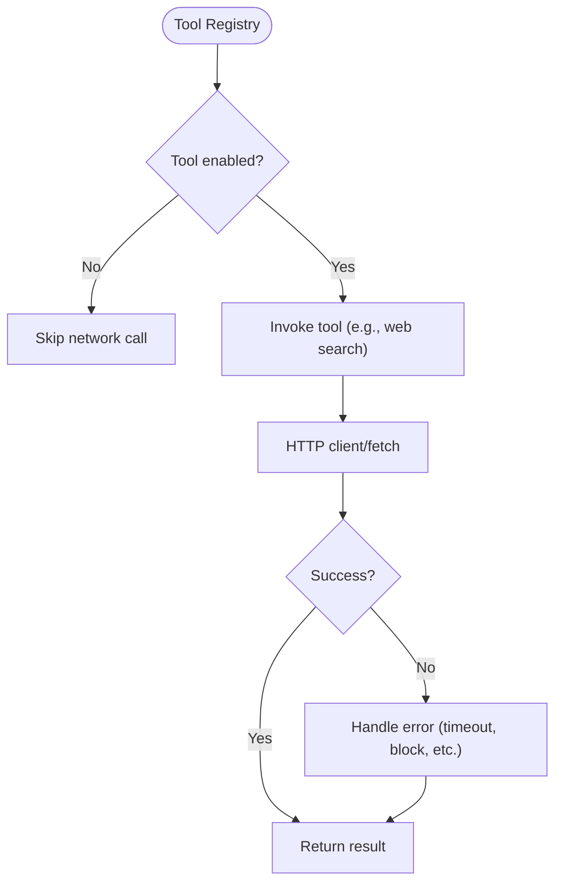
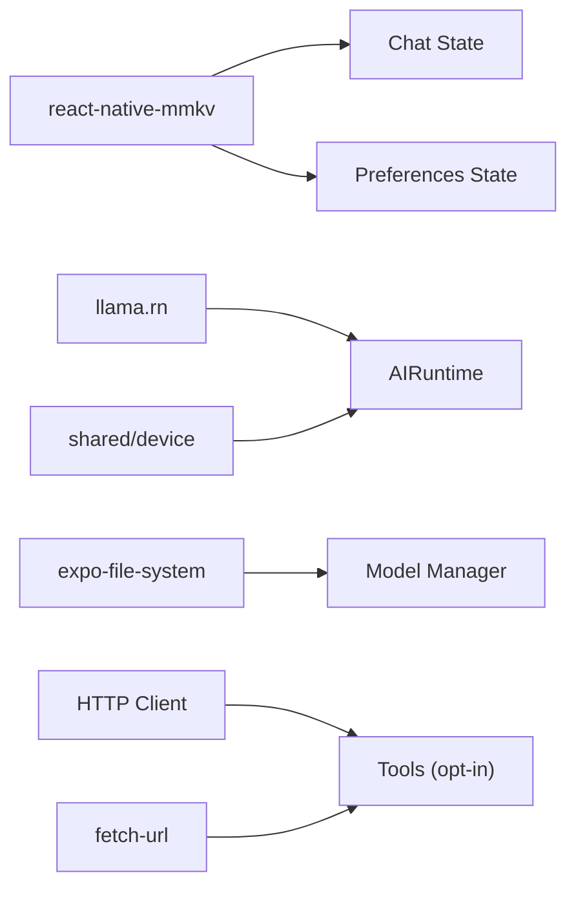

# Privacy and Security Model

<cite>
**Referenced Files in This Document**
- [README.md](file://README.md)
- [package.json](file://package.json)
- [app/_layout.tsx](file://app/_layout.tsx)
- [database/chat/index.ts](file://database/chat/index.ts)
- [database/chat/types.ts](file://database/chat/types.ts)
- [database/user-preferences/state.ts](file://database/user-preferences/state.ts)
- [database/user-preferences/types.ts](file://database/user-preferences/types.ts)
- [context/user-preferences/provider.tsx](file://context/user-preferences/provider.tsx)
- [shared/ai/manager.ts](file://shared/ai/manager.ts)
- [shared/ai/model-loader.ts](file://shared/ai/model-loader.ts)
- [shared/ai/text-generation/runtime.ts](file://shared/ai/text-generation/runtime.ts)
- [shared/ai/tools/fetch-url.ts](file://shared/ai/tools/fetch-url.ts)
- [shared/ai/tools/http-client.ts](file://shared/ai/tools/http-client.ts)
- [shared/device.ts](file://shared/device.ts)
- [features/chat/view-model/use-chat.ts](file://features/chat/view-model/use-chat.ts)
</cite>

## Table of Contents
1. [Introduction](#introduction)
2. [Project Structure](#project-structure)
3. [Core Components](#core-components)
4. [Architecture Overview](#architecture-overview)
5. [Detailed Component Analysis](#detailed-component-analysis)
6. [Dependency Analysis](#dependency-analysis)
7. [Performance Considerations](#performance-considerations)
8. [Troubleshooting Guide](#troubleshooting-guide)
9. [Conclusion](#conclusion)

## Introduction
This document explains My Shadow’s privacy and security model with a focus on privacy-first design and local-only processing. It details how the application keeps all AI inference and data processing on-device, how encrypted local storage is implemented using MMKV, and how the system enforces privacy guarantees such as no data collection, no cloud sync, complete data locality, and user control over personal information. It also covers security measures including encrypted storage, local-only processing, minimal data retention, and prevention of data leakage through network requests or external sharing.

## Project Structure
My Shadow is a React Native application using Expo. The privacy and security model is implemented across several layers:
- UI and app shell: application layout and providers
- Data persistence: observable state synchronized to MMKV for encrypted local storage
- AI runtime: local GGUF model inference with no cloud calls
- Network tools: optional, constrained usage for web search when explicitly enabled by tools
- Device detection: runtime adaptation without external telemetry

**Diagram sources**
- [app/_layout.tsx:12-50](file://app/_layout.tsx#L12-L50)
- [context/user-preferences/provider.tsx:19-157](file://context/user-preferences/provider.tsx#L19-L157)
- [database/chat/index.ts:14-31](file://database/chat/index.ts#L14-L31)
- [database/user-preferences/state.ts:6-22](file://database/user-preferences/state.ts#L6-L22)
- [shared/ai/manager.ts:59-85](file://shared/ai/manager.ts#L59-L85)
- [shared/ai/model-loader.ts:11-63](file://shared/ai/model-loader.ts#L11-L63)
- [shared/ai/text-generation/runtime.ts:16-489](file://shared/ai/text-generation/runtime.ts#L16-L489)
- [shared/ai/tools/fetch-url.ts:41-329](file://shared/ai/tools/fetch-url.ts#L41-L329)
- [shared/ai/tools/http-client.ts:66-110](file://shared/ai/tools/http-client.ts#L66-L110)
- [shared/device.ts:122-171](file://shared/device.ts#L122-L171)

**Section sources**
- [README.md:1-207](file://README.md#L1-L207)
- [package.json:1-128](file://package.json#L1-L128)
- [app/_layout.tsx:12-50](file://app/_layout.tsx#L12-L50)

## Core Components
- Encrypted local storage with MMKV:
  - Conversation history persisted via observable state synchronized to MMKV
  - User preferences persisted via observable state synchronized to MMKV
- Local-only AI inference:
  - GGUF models are downloaded and loaded locally
  - Inference runs inside the app without cloud calls
- Optional network tools:
  - Web search is implemented as a tool that can be invoked during generation
  - Network usage is constrained and only happens when explicitly requested by tools
- Device-aware runtime:
  - Device capabilities are detected locally to configure inference
  - No external telemetry or cloud reporting

**Section sources**
- [database/chat/index.ts:14-31](file://database/chat/index.ts#L14-L31)
- [database/user-preferences/state.ts:6-22](file://database/user-preferences/state.ts#L6-L22)
- [shared/ai/manager.ts:59-85](file://shared/ai/manager.ts#L59-L85)
- [shared/ai/text-generation/runtime.ts:16-489](file://shared/ai/text-generation/runtime.ts#L16-L489)
- [shared/ai/tools/fetch-url.ts:41-329](file://shared/ai/tools/fetch-url.ts#L41-L329)
- [shared/device.ts:122-171](file://shared/device.ts#L122-L171)

## Architecture Overview
The privacy and security architecture centers on keeping all data and computation on-device. The runtime loads models from local storage, performs inference locally, and persists conversation history and preferences to encrypted local storage. Optional network operations are encapsulated behind tool invocation and are not performed by default.

**Diagram sources**
- [features/chat/view-model/use-chat.ts:101-183](file://features/chat/view-model/use-chat.ts#L101-L183)
- [shared/ai/text-generation/runtime.ts:256-477](file://shared/ai/text-generation/runtime.ts#L256-L477)
- [shared/device.ts:122-171](file://shared/device.ts#L122-L171)
- [shared/ai/manager.ts:59-85](file://shared/ai/manager.ts#L59-L85)
- [database/chat/index.ts:14-31](file://database/chat/index.ts#L14-L31)
- [database/user-preferences/state.ts:6-22](file://database/user-preferences/state.ts#L6-L22)

## Detailed Component Analysis

### Encrypted Local Storage with MMKV
- Conversation history:
  - Stored in an observable state synchronized to MMKV
  - Uses a dedicated store name for chat conversations
  - Automatically retries synchronization on failure
- User preferences:
  - Stored in an observable state synchronized to MMKV
  - Includes theme, color scheme, and background color
- Provider integration:
  - Preferences provider updates observable state, which is persisted to MMKV
  - Theme and color scheme changes are saved immediately

**Diagram sources**
- [context/user-preferences/provider.tsx:38-99](file://context/user-preferences/provider.tsx#L38-L99)
- [database/chat/index.ts:22-27](file://database/chat/index.ts#L22-L27)
- [database/user-preferences/state.ts:13-18](file://database/user-preferences/state.ts#L13-L18)

**Section sources**
- [database/chat/index.ts:14-31](file://database/chat/index.ts#L14-L31)
- [database/chat/types.ts:5-31](file://database/chat/types.ts#L5-L31)
- [database/user-preferences/state.ts:6-22](file://database/user-preferences/state.ts#L6-L22)
- [database/user-preferences/types.ts:3-8](file://database/user-preferences/types.ts#L3-L8)
- [context/user-preferences/provider.tsx:19-157](file://context/user-preferences/provider.tsx#L19-L157)

### Local-Only AI Inference
- Model lifecycle:
  - Models are downloaded to local storage and loaded into memory
  - Loading validates device memory capacity and configures runtime accordingly
  - Unloading releases resources and clears state
- Streaming generation:
  - Inference runs locally and streams tokens to the UI
  - Optional reasoning support is handled internally
- Device adaptation:
  - Device capabilities are detected locally to optimize runtime configuration
  - No cloud calls are involved in device detection or model loading

**Diagram sources**
- [features/chat/view-model/use-chat.ts:262-285](file://features/chat/view-model/use-chat.ts#L262-L285)
- [shared/ai/model-loader.ts:11-63](file://shared/ai/model-loader.ts#L11-L63)
- [shared/ai/manager.ts:320-344](file://shared/ai/manager.ts#L320-L344)
- [shared/ai/text-generation/runtime.ts:34-157](file://shared/ai/text-generation/runtime.ts#L34-L157)
- [shared/device.ts:122-171](file://shared/device.ts#L122-L171)

**Section sources**
- [shared/ai/manager.ts:59-85](file://shared/ai/manager.ts#L59-L85)
- [shared/ai/model-loader.ts:11-63](file://shared/ai/model-loader.ts#L11-L63)
- [shared/ai/text-generation/runtime.ts:16-489](file://shared/ai/text-generation/runtime.ts#L16-L489)
- [shared/device.ts:122-171](file://shared/device.ts#L122-L171)

### Optional Network Tools and Data Leakage Prevention
- Web search tool:
  - Implemented as a tool that can be invoked during generation
  - Uses constrained HTTP client and fetch utilities with timeouts and retry logic
  - Network usage is opt-in and only occurs when tools are enabled
- No cloud sync or external API calls:
  - The application’s purpose and dependencies confirm no cloud sync or external API calls
  - Network tools are isolated and not part of default operation

**Diagram sources**
- [features/chat/view-model/use-chat.ts:94-99](file://features/chat/view-model/use-chat.ts#L94-L99)
- [shared/ai/tools/http-client.ts:66-110](file://shared/ai/tools/http-client.ts#L66-L110)
- [shared/ai/tools/fetch-url.ts:41-329](file://shared/ai/tools/fetch-url.ts#L41-L329)

**Section sources**
- [README.md:3-4](file://README.md#L3-L4)
- [package.json:69-71](file://package.json#L69-L71)
- [features/chat/view-model/use-chat.ts:14-15](file://features/chat/view-model/use-chat.ts#L14-L15)
- [shared/ai/tools/http-client.ts:66-110](file://shared/ai/tools/http-client.ts#L66-L110)
- [shared/ai/tools/fetch-url.ts:41-329](file://shared/ai/tools/fetch-url.ts#L41-L329)

### Privacy Guarantees and Security Measures
- No data collection:
  - The application’s purpose explicitly states no data collection
- No cloud sync:
  - All data remains on device; no cloud sync or external API calls
- Complete data locality:
  - Models, conversation history, and preferences are stored locally
- User control:
  - Users manage models, themes, and preferences locally
- Encrypted storage:
  - MMKV is used for encrypted key-value storage
- Local-only processing:
  - Inference runs entirely on-device without network calls
- Minimal data retention:
  - Only conversation history and preferences are persisted; no logs or telemetry are sent

**Section sources**
- [README.md:3-4](file://README.md#L3-L4)
- [database/chat/index.ts:22-27](file://database/chat/index.ts#L22-L27)
- [database/user-preferences/state.ts:13-18](file://database/user-preferences/state.ts#L13-L18)
- [package.json:90-90](file://package.json#L90-L90)

### Compliance and User Rights Protection
- Privacy-by-design:
  - Encrypted local storage and local-only processing are core design choices
- Transparency:
  - Logging is internal and not transmitted; device detection and runtime info are for local optimization
- User rights:
  - Users retain control over their data; preferences and conversation history are stored locally and can be managed by the user

**Section sources**
- [shared/ai/text-generation/runtime.ts:162-169](file://shared/ai/text-generation/runtime.ts#L162-L169)
- [shared/device.ts:162-168](file://shared/device.ts#L162-L168)

### Common Privacy Concerns and Mitigations
- Concern: Could the app leak conversations or preferences?
  - Mitigation: All data is persisted locally using encrypted MMKV; no cloud sync or external API calls
- Concern: Could the app collect usage data?
  - Mitigation: Logging is internal and not transmitted; device detection and runtime info are for local optimization
- Concern: Could network tools send data externally?
  - Mitigation: Network tools are opt-in and isolated; default operation does not perform network calls
- Concern: Could models be uploaded or synced?
  - Mitigation: Models are downloaded locally and remain on-device; no cloud upload or sync

**Section sources**
- [README.md:3-4](file://README.md#L3-L4)
- [shared/ai/tools/fetch-url.ts:41-329](file://shared/ai/tools/fetch-url.ts#L41-L329)
- [shared/ai/manager.ts:59-85](file://shared/ai/manager.ts#L59-L85)

## Dependency Analysis
The privacy and security model relies on a small set of core dependencies:
- MMKV for encrypted local storage
- llama.rn for local GGUF model inference
- Optional network utilities for tools (not used by default)

**Diagram sources**
- [package.json:90-90](file://package.json#L90-L90)
- [package.json:78-78](file://package.json#L78-L78)
- [database/chat/index.ts:22-27](file://database/chat/index.ts#L22-L27)
- [database/user-preferences/state.ts:13-18](file://database/user-preferences/state.ts#L13-L18)
- [shared/ai/text-generation/runtime.ts:6-12](file://shared/ai/text-generation/runtime.ts#L6-L12)
- [shared/ai/manager.ts:3-4](file://shared/ai/manager.ts#L3-L4)
- [shared/ai/tools/http-client.ts:66-110](file://shared/ai/tools/http-client.ts#L66-L110)
- [shared/ai/tools/fetch-url.ts:41-329](file://shared/ai/tools/fetch-url.ts#L41-L329)

**Section sources**
- [package.json:1-128](file://package.json#L1-L128)
- [database/chat/index.ts:14-31](file://database/chat/index.ts#L14-L31)
- [database/user-preferences/state.ts:6-22](file://database/user-preferences/state.ts#L6-L22)
- [shared/ai/text-generation/runtime.ts:16-489](file://shared/ai/text-generation/runtime.ts#L16-L489)
- [shared/ai/manager.ts:59-85](file://shared/ai/manager.ts#L59-L85)
- [shared/ai/tools/http-client.ts:66-110](file://shared/ai/tools/http-client.ts#L66-L110)
- [shared/ai/tools/fetch-url.ts:41-329](file://shared/ai/tools/fetch-url.ts#L41-L329)

## Performance Considerations
- Local inference avoids network latency and improves responsiveness
- Encrypted storage with MMKV provides efficient, secure persistence
- Optional network tools are designed with timeouts and retry logic to minimize impact

[No sources needed since this section provides general guidance]

## Troubleshooting Guide
- If models fail to load:
  - Verify sufficient device memory and available RAM
  - Check model availability and local path resolution
- If streaming stops unexpectedly:
  - Confirm that generation was not canceled
  - Review tool call handling and error codes
- If preferences or conversations do not persist:
  - Ensure MMKV persistence is functioning and store names are correct

**Section sources**
- [shared/ai/text-generation/runtime.ts:444-477](file://shared/ai/text-generation/runtime.ts#L444-L477)
- [shared/ai/model-loader.ts:65-112](file://shared/ai/model-loader.ts#L65-L112)
- [shared/ai/manager.ts:320-344](file://shared/ai/manager.ts#L320-L344)
- [context/user-preferences/provider.tsx:38-99](file://context/user-preferences/provider.tsx#L38-L99)

## Conclusion
My Shadow’s privacy and security model is built on a privacy-first foundation: encrypted local storage, local-only AI inference, and minimal data retention. The system prevents data leakage by design—no cloud sync, no external API calls, and optional network tools that are opt-in and isolated. Users maintain full control over their data, including models, conversation history, and preferences, which remain on-device at all times.