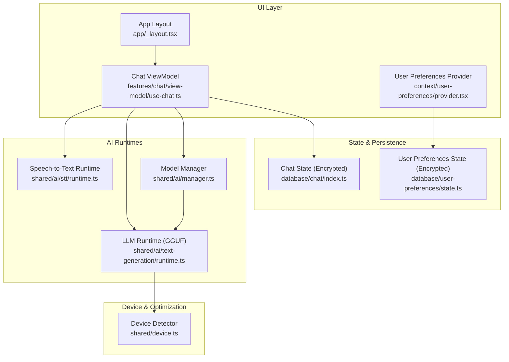
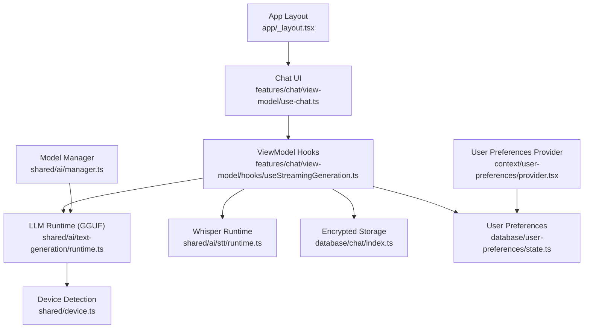
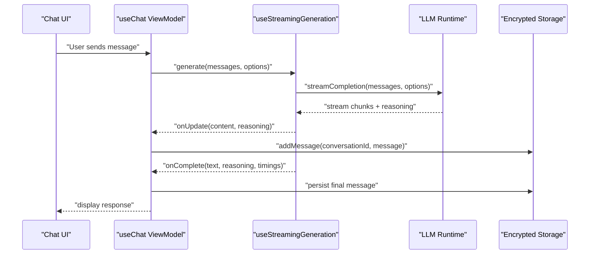
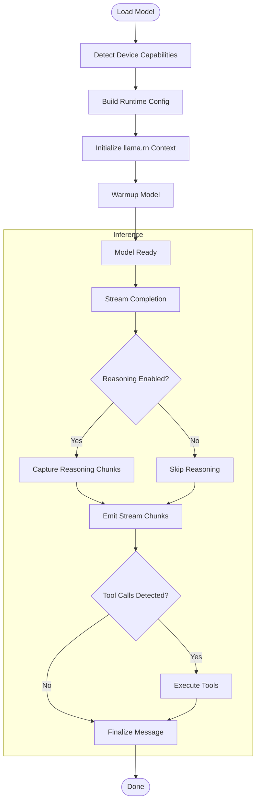
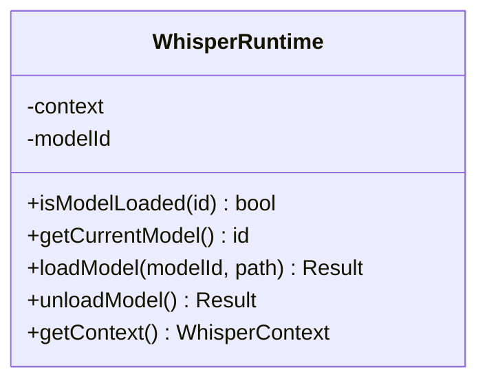
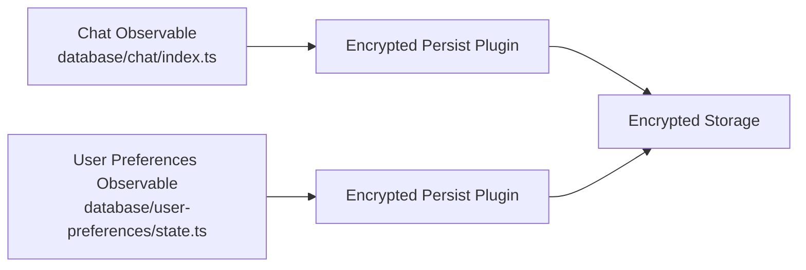
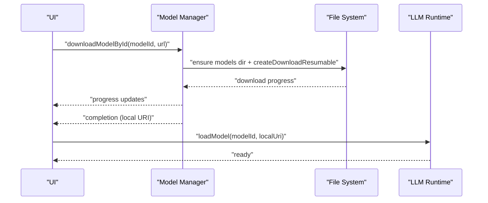
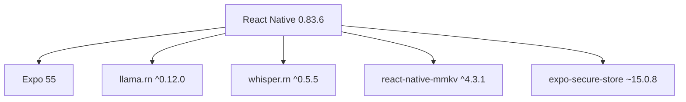

# Project Overview

<cite>
**Referenced Files in This Document**
- [README.md](file://README.md)
- [package.json](file://package.json)
- [app/_layout.tsx](file://app/_layout.tsx)
- [context/user-preferences/provider.tsx](file://context/user-preferences/provider.tsx)
- [database/chat/index.ts](file://database/chat/index.ts)
- [database/user-preferences/state.ts](file://database/user-preferences/state.ts)
- [features/chat/view-model/use-chat.ts](file://features/chat/view-model/use-chat.ts)
- [features/chat/view-model/hooks/useStreamingGeneration.ts](file://features/chat/view-model/hooks/useStreamingGeneration.ts)
- [shared/ai/manager.ts](file://shared/ai/manager.ts)
- [shared/ai/text-generation/runtime.ts](file://shared/ai/text-generation/runtime.ts)
- [shared/ai/stt/runtime.ts](file://shared/ai/stt/runtime.ts)
- [shared/device.ts](file://shared/device.ts)
</cite>

## Table of Contents
1. [Introduction](#introduction)
2. [Project Structure](#project-structure)
3. [Core Components](#core-components)
4. [Architecture Overview](#architecture-overview)
5. [Detailed Component Analysis](#detailed-component-analysis)
6. [Dependency Analysis](#dependency-analysis)
7. [Performance Considerations](#performance-considerations)
8. [Troubleshooting Guide](#troubleshooting-guide)
9. [Conclusion](#conclusion)

## Introduction
My Shadow is a privacy-preserving, local-first reflection journal built with React Native and Expo. Its mission is to bring powerful, on-device AI interactions to users who value control over their data. The application processes all content locally, stores data in encrypted form on-device, and avoids any cloud sync or external API calls. It unifies local LLM inference and vector embeddings using GGUF models, while speech-to-text is handled by whisper.rn for voice input. The system emphasizes offline-first operation, device-only processing, and transparent runtime optimization tailored to each device’s capabilities.

Key value propositions:
- Offline-first architecture: All operations run without network connectivity.
- Device-only processing: No cloud uploads or external APIs; data stays on-device.
- Encrypted storage: Conversations and preferences are persisted securely using encrypted key-value storage.
- Unified LLM inference with vector embeddings: Uses llama.rn for both text generation and embeddings.
- Privacy guarantees: No telemetry or analytics; no cloud sync; no external data sharing.

Target audience:
- Privacy-conscious individuals who want a personal AI companion that respects their data locality and confidentiality.

Primary use cases:
- Private journaling and reflective conversations with reasoning support.
- Voice-enabled interactions using on-device speech recognition.
- Local model management and tool-assisted reasoning with web search capability.

**Section sources**
- [README.md:1-207](file://README.md#L1-L207)

## Project Structure
At a high level, the app is organized around:
- UI shell and routing: App layout and navigation are defined in the root layout.
- Feature modules: Chat, History, and Model Management encapsulate user-facing functionality.
- Shared AI runtime: Text generation and speech-to-text runtimes underpin all AI features.
- State and persistence: Reactive state management with encrypted storage for chats and user preferences.
- Device detection and optimization: Automatic runtime configuration based on device capabilities.

**Diagram sources**
- [app/_layout.tsx:12-50](file://app/_layout.tsx#L12-L50)
- [features/chat/view-model/use-chat.ts:22-371](file://features/chat/view-model/use-chat.ts#L22-L371)
- [shared/ai/text-generation/runtime.ts:16-489](file://shared/ai/text-generation/runtime.ts#L16-L489)
- [shared/ai/stt/runtime.ts:5-99](file://shared/ai/stt/runtime.ts#L5-L99)
- [shared/ai/manager.ts:11-422](file://shared/ai/manager.ts#L11-L422)
- [shared/device.ts:122-172](file://shared/device.ts#L122-L172)
- [database/chat/index.ts:14-31](file://database/chat/index.ts#L14-L31)
- [database/user-preferences/state.ts:6-22](file://database/user-preferences/state.ts#L6-L22)
- [context/user-preferences/provider.tsx:19-157](file://context/user-preferences/provider.tsx#L19-L157)

**Section sources**
- [app/_layout.tsx:12-50](file://app/_layout.tsx#L12-L50)
- [context/user-preferences/provider.tsx:19-157](file://context/user-preferences/provider.tsx#L19-L157)
- [database/chat/index.ts:14-31](file://database/chat/index.ts#L14-L31)
- [database/user-preferences/state.ts:6-22](file://database/user-preferences/state.ts#L6-L22)

## Core Components
- Local-first chat experience: The chat feature orchestrates message lifecycle, streaming generation, tool use, and error handling, all coordinated through a reactive state system.
- Encrypted local storage: Conversations and user preferences are persisted using encrypted key-value storage to guarantee data privacy.
- Unified LLM runtime: llama.rn powers both text generation and embeddings, enabling reasoning and tool-assisted responses.
- Speech-to-text runtime: whisper.rn manages voice input and transcription with on-device processing.
- Device-aware optimization: The runtime adapts to device capabilities (RAM, CPU cores, GPU backend) to ensure reliable performance.

Practical examples demonstrating privacy guarantees and local-only processing:
- Model lifecycle: Models are downloaded and stored locally, then loaded into llama.rn for inference. All model files remain on-device; there is no upload or cloud sync.
- Conversation persistence: Chat histories are saved to encrypted storage; no external backup or synchronization occurs.
- Voice input: Audio is processed locally by whisper.rn; no audio data leaves the device.
- Reasoning and tools: The system can optionally enable reasoning and tool use (e.g., web search) entirely on-device, with results never transmitted beyond the device.

**Section sources**
- [README.md:70-118](file://README.md#L70-L118)
- [shared/ai/manager.ts:59-192](file://shared/ai/manager.ts#L59-L192)
- [shared/ai/text-generation/runtime.ts:34-157](file://shared/ai/text-generation/runtime.ts#L34-L157)
- [shared/ai/stt/runtime.ts:20-54](file://shared/ai/stt/runtime.ts#L20-L54)
- [database/chat/index.ts:22-28](file://database/chat/index.ts#L22-L28)
- [database/user-preferences/state.ts:13-17](file://database/user-preferences/state.ts#L13-L17)

## Architecture Overview
The architecture centers on a reactive state layer that coordinates UI, AI runtimes, and storage. The llama.rn runtime performs local GGUF model inference and embeddings, while whisper.rn handles speech-to-text. Device detection and runtime configuration ensure optimal performance per device.

**Diagram sources**
- [features/chat/view-model/use-chat.ts:22-371](file://features/chat/view-model/use-chat.ts#L22-L371)
- [features/chat/view-model/hooks/useStreamingGeneration.ts:39-164](file://features/chat/view-model/hooks/useStreamingGeneration.ts#L39-L164)
- [shared/ai/text-generation/runtime.ts:16-489](file://shared/ai/text-generation/runtime.ts#L16-L489)
- [shared/ai/stt/runtime.ts:5-99](file://shared/ai/stt/runtime.ts#L5-L99)
- [shared/ai/manager.ts:11-422](file://shared/ai/manager.ts#L11-L422)
- [shared/device.ts:122-172](file://shared/device.ts#L122-L172)
- [database/chat/index.ts:14-31](file://database/chat/index.ts#L14-L31)
- [database/user-preferences/state.ts:6-22](file://database/user-preferences/state.ts#L6-L22)
- [app/_layout.tsx:12-50](file://app/_layout.tsx#L12-L50)
- [context/user-preferences/provider.tsx:19-157](file://context/user-preferences/provider.tsx#L19-L157)

## Detailed Component Analysis

### Local-first chat orchestration
The chat view-model integrates conversation lifecycle, model selection, streaming generation, and error handling. It coordinates with the LLM runtime to perform on-device inference, optionally enabling reasoning and tool use, and persists messages to encrypted storage.

**Diagram sources**
- [features/chat/view-model/use-chat.ts:101-183](file://features/chat/view-model/use-chat.ts#L101-L183)
- [features/chat/view-model/hooks/useStreamingGeneration.ts:52-146](file://features/chat/view-model/hooks/useStreamingGeneration.ts#L52-L146)
- [shared/ai/text-generation/runtime.ts:256-477](file://shared/ai/text-generation/runtime.ts#L256-L477)
- [database/chat/index.ts:14-31](file://database/chat/index.ts#L14-L31)

**Section sources**
- [features/chat/view-model/use-chat.ts:22-371](file://features/chat/view-model/use-chat.ts#L22-L371)
- [features/chat/view-model/hooks/useStreamingGeneration.ts:39-164](file://features/chat/view-model/hooks/useStreamingGeneration.ts#L39-L164)

### Unified LLM inference with GGUF models
The LLM runtime initializes llama.rn with device-aware configuration, loads GGUF models, and streams completions. It supports reasoning, tool use, and automatic OOM fallback by reducing context size.

**Diagram sources**
- [shared/ai/text-generation/runtime.ts:34-157](file://shared/ai/text-generation/runtime.ts#L34-L157)
- [shared/ai/text-generation/runtime.ts:256-477](file://shared/ai/text-generation/runtime.ts#L256-L477)
- [shared/device.ts:122-172](file://shared/device.ts#L122-L172)

**Section sources**
- [shared/ai/text-generation/runtime.ts:16-489](file://shared/ai/text-generation/runtime.ts#L16-L489)
- [shared/device.ts:122-172](file://shared/device.ts#L122-L172)

### Speech-to-text with whisper.rn
The whisper runtime loads and manages on-device speech models, exposing a simple interface to load/unload models and retrieve the active context.

**Diagram sources**
- [shared/ai/stt/runtime.ts:5-99](file://shared/ai/stt/runtime.ts#L5-L99)

**Section sources**
- [shared/ai/stt/runtime.ts:20-54](file://shared/ai/stt/runtime.ts#L20-L54)

### Reactive state management and encrypted storage
The chat state and user preferences are reactive observables persisted to encrypted storage. The chat state tracks conversations, last used models, and reasoning toggles. User preferences manage theme and color scheme.

**Diagram sources**
- [database/chat/index.ts:14-31](file://database/chat/index.ts#L14-L31)
- [database/user-preferences/state.ts:6-22](file://database/user-preferences/state.ts#L6-L22)

**Section sources**
- [database/chat/index.ts:22-28](file://database/chat/index.ts#L22-L28)
- [database/user-preferences/state.ts:13-17](file://database/user-preferences/state.ts#L13-L17)

### Model lifecycle and device-aware optimization
The model manager handles downloading, caching, and removing GGUF models. The runtime detects device capabilities and builds optimized configurations, including GPU offload and KV cache settings.

**Diagram sources**
- [shared/ai/manager.ts:59-192](file://shared/ai/manager.ts#L59-L192)
- [shared/ai/text-generation/runtime.ts:34-157](file://shared/ai/text-generation/runtime.ts#L34-L157)

**Section sources**
- [shared/ai/manager.ts:11-422](file://shared/ai/manager.ts#L11-L422)
- [shared/device.ts:122-172](file://shared/device.ts#L122-L172)

## Dependency Analysis
The project relies on React Native and Expo for cross-platform runtime, with llama.rn and whisper.rn powering local AI capabilities. Encrypted storage is provided by react-native-mmkv and secure credential storage by expo-secure-store. The UI layer is built with RN primitives and Tailwind via nativewind.

**Diagram sources**
- [package.json:19-102](file://package.json#L19-L102)

**Section sources**
- [package.json:19-102](file://package.json#L19-L102)

## Performance Considerations
- Automatic device adaptation: The runtime detects available RAM, CPU cores, and GPU backend to configure optimal settings for budget, mid-range, and premium devices.
- Memory-conscious design: KV cache quantization, adaptive context sizing, and mmap loading reduce memory pressure and improve reliability.
- Graceful degradation: When memory pressure is detected, the system can automatically halve context size and retry inference.
- Transparent optimization: Users do not need to configure settings manually; the system adapts automatically, with advanced overrides available when needed.

[No sources needed since this section provides general guidance]

## Troubleshooting Guide
Common scenarios and guidance:
- Model load failures: Verify sufficient available RAM and try a smaller model variant. The runtime logs detailed diagnostics during load and inference.
- Inference errors: If an OOM error is suspected, the runtime attempts an automatic retry with a reduced context size. If still failing, reduce model size or close background apps.
- Download interruptions: Downloads are resumable and deduplicated. Canceling a download cleans up partial files and resets progress.
- Storage issues: Encrypted storage is managed by the reactive state layer. If encountering corruption symptoms, clear partial downloads and reload models.

**Section sources**
- [shared/ai/text-generation/runtime.ts:451-477](file://shared/ai/text-generation/runtime.ts#L451-L477)
- [shared/ai/manager.ts:218-240](file://shared/ai/manager.ts#L218-L240)
- [shared/ai/manager.ts:349-422](file://shared/ai/manager.ts#L349-L422)

## Conclusion
My Shadow delivers a privacy-first, local-only AI experience on mobile. By combining llama.rn for unified GGUF inference and embeddings, whisper.rn for on-device speech processing, and encrypted storage for sensitive data, it enables meaningful, confidential interactions right on the device. The reactive state system and device-aware runtime ensure a smooth, reliable experience across a wide range of hardware, reinforcing the project’s mission to put users in control of their AI journey.

[No sources needed since this section summarizes without analyzing specific files]