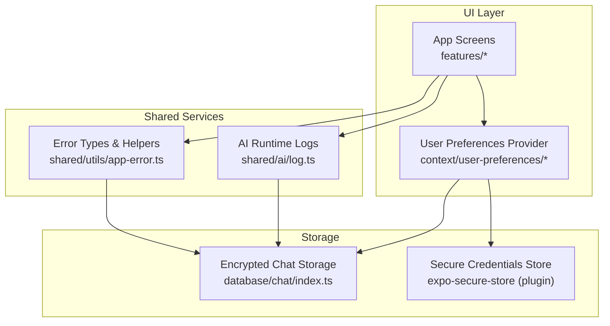
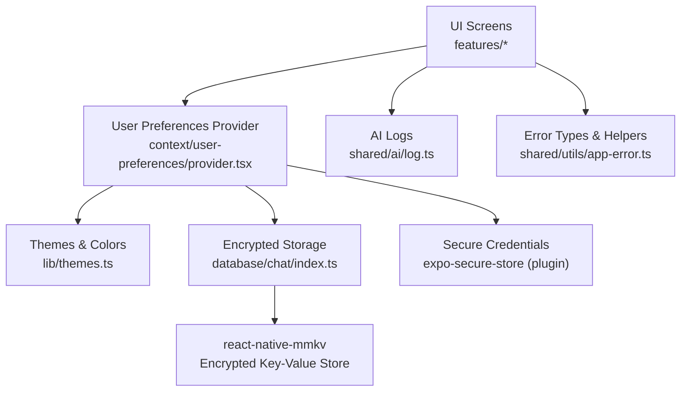
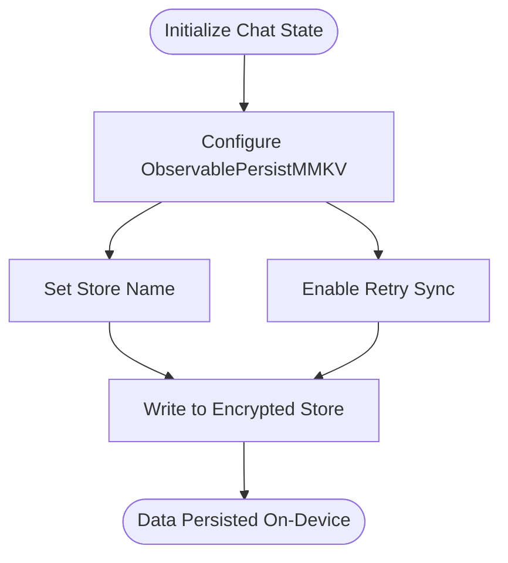
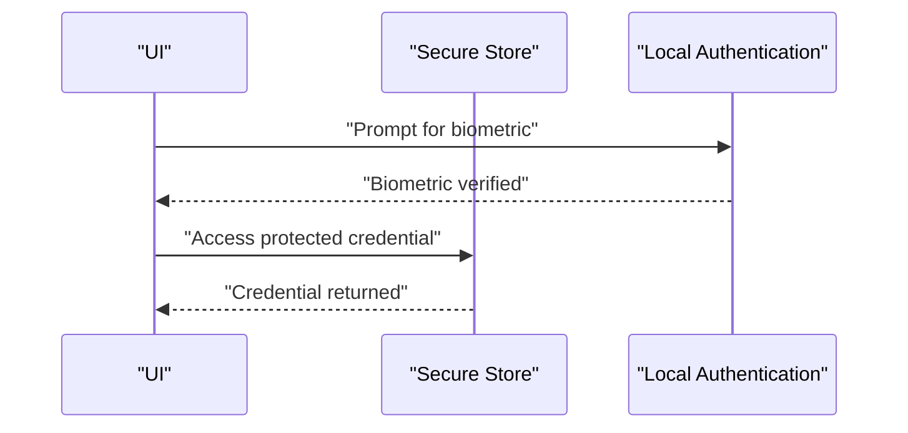
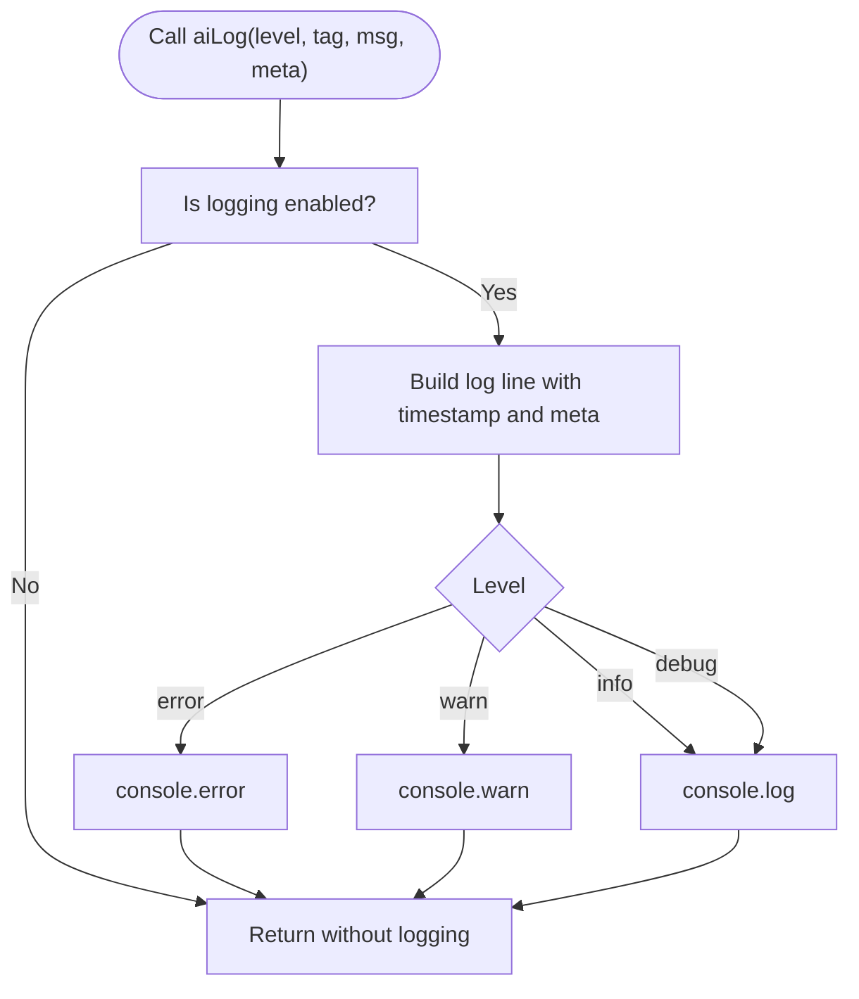
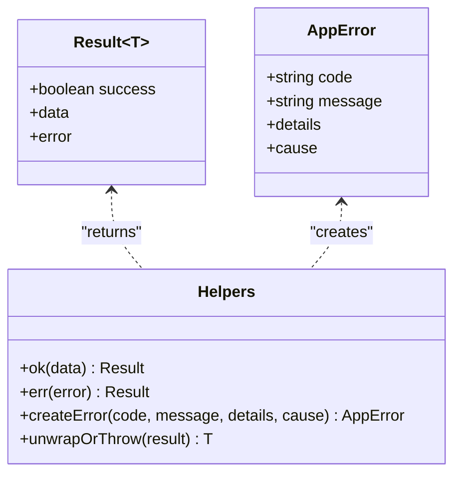
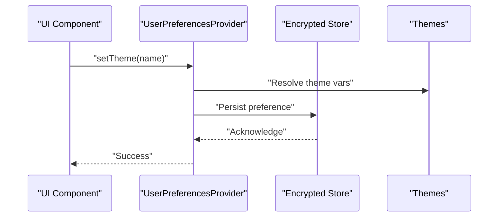
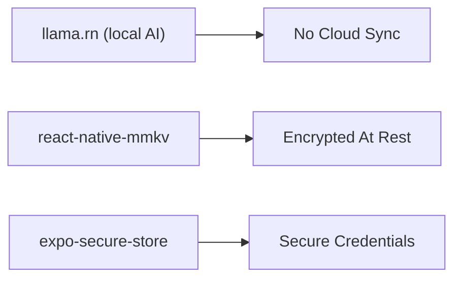

# Security & Privacy

<cite>
**Referenced Files in This Document**
- [README.md](file://README.md)
- [package.json](file://package.json)
- [app.json](file://app.json)
- [shared/ai/log.ts](file://shared/ai/log.ts)
- [shared/utils/app-error.ts](file://shared/utils/app-error.ts)
- [database/chat/index.ts](file://database/chat/index.ts)
- [context/user-preferences/provider.tsx](file://context/user-preferences/provider.tsx)
- [context/user-preferences/context.tsx](file://context/user-preferences/context.tsx)
- [context/user-preferences/types.ts](file://context/user-preferences/types.ts)
- [lib/themes.ts](file://lib/themes.ts)
</cite>

## Table of Contents
1. [Introduction](#introduction)
2. [Project Structure](#project-structure)
3. [Core Components](#core-components)
4. [Architecture Overview](#architecture-overview)
5. [Detailed Component Analysis](#detailed-component-analysis)
6. [Dependency Analysis](#dependency-analysis)
7. [Performance Considerations](#performance-considerations)
8. [Troubleshooting Guide](#troubleshooting-guide)
9. [Conclusion](#conclusion)
10. [Appendices](#appendices)

## Introduction
This document explains My Shadow’s privacy-first architecture and the security controls that keep all AI inference and data on-device. It documents encrypted storage, privacy-by-design principles, logging and telemetry behavior, error handling and crash reporting, secure credential management, transparency and user control, and security best practices for mobile development. It also outlines threat modeling considerations and regulatory compliance approaches for international deployment.

## Project Structure
The application follows a modular, privacy-focused structure:
- UI and screens under app/ and features/ implement privacy-conscious UX.
- Shared AI runtime and device detection live under shared/ to encapsulate local-only processing.
- Encrypted persistence is implemented via react-native-mmkv with LegendAppState persistence.
- Secure credentials are stored via expo-secure-store through the Expo ecosystem.
- Logging and error handling are centralized to avoid accidental data exposure.

**Diagram sources**
- [app.json:29-69](file://app.json#L29-L69)
- [shared/ai/log.ts:1-36](file://shared/ai/log.ts#L1-L36)
- [shared/utils/app-error.ts:1-95](file://shared/utils/app-error.ts#L1-L95)
- [database/chat/index.ts:1-30](file://database/chat/index.ts#L1-L30)
- [context/user-preferences/provider.tsx:1-157](file://context/user-preferences/provider.tsx#L1-L157)

**Section sources**
- [README.md:1-207](file://README.md#L1-L207)
- [app.json:1-82](file://app.json#L1-L82)
- [package.json:19-102](file://package.json#L19-L102)

## Core Components
- Local-only AI processing: All inference and embedding generation occur on-device using llama.rn and Whisper modules. There are no external API calls or cloud sync.
- Encrypted storage: Conversations and user preferences are persisted using react-native-mmkv with LegendAppState persistence, ensuring encryption at rest.
- Secure credentials: Sensitive credentials are stored via expo-secure-store through the Expo plugin configuration.
- Privacy-by-design: Logging is opt-in via developer mode or environment variable; error handling avoids leaking PII; UI components expose user-controlled preferences.
- Transparency: The project README emphasizes “no cloud sync or external API calls,” aligning with transparent privacy practices.

**Section sources**
- [README.md:3](file://README.md#L3)
- [README.md:178-180](file://README.md#L178-L180)
- [app.json:45](file://app.json#L45)
- [database/chat/index.ts:22-26](file://database/chat/index.ts#L22-L26)
- [shared/ai/log.ts:1-36](file://shared/ai/log.ts#L1-L36)
- [shared/utils/app-error.ts:8-31](file://shared/utils/app-error.ts#L8-L31)

## Architecture Overview
The privacy architecture centers on keeping all data on-device and encrypting it at rest. The UI interacts with providers and view models that rely on shared AI services and persistent stores configured for encryption.

**Diagram sources**
- [context/user-preferences/provider.tsx:19-157](file://context/user-preferences/provider.tsx#L19-L157)
- [lib/themes.ts:1-42](file://lib/themes.ts#L1-L42)
- [database/chat/index.ts:14-28](file://database/chat/index.ts#L14-L28)
- [shared/ai/log.ts:7-24](file://shared/ai/log.ts#L7-L24)
- [shared/utils/app-error.ts:26-51](file://shared/utils/app-error.ts#L26-L51)
- [app.json:45](file://app.json#L45)

## Detailed Component Analysis

### Encrypted Storage: react-native-mmkv with LegendAppState
- Persistence mechanism: The chat state is persisted using ObservablePersistMMKV with a named store, enabling seamless encryption-at-rest.
- Retry synchronization: The persisted store retries synchronization to reduce risk of partial writes.
- Scope: Stores conversations, last model identifiers, and reasoning toggles—none of which leave the device.

**Diagram sources**
- [database/chat/index.ts:14-28](file://database/chat/index.ts#L14-L28)

**Section sources**
- [database/chat/index.ts:1-30](file://database/chat/index.ts#L1-L30)
- [README.md:3](file://README.md#L3)

### Secure Credential Management: expo-secure-store
- Plugin configuration: The Expo app.json includes the expo-secure-store plugin, enabling secure storage of sensitive keys and tokens.
- Biometric integration: The project lists expo-local-authentication among dependencies, supporting biometric authentication flows to protect access to secure data.

**Diagram sources**
- [app.json:45](file://app.json#L45)
- [package.json:69](file://package.json#L69)
- [README.md:178-180](file://README.md#L178-L180)

**Section sources**
- [app.json:45](file://app.json#L45)
- [package.json:69](file://package.json#L69)
- [README.md:178-180](file://README.md#L178-L180)

### Logging and Telemetry: Privacy-Conscious Diagnostics
- Conditional logging: AI logs are enabled only in development or when a specific environment flag is set, preventing unintended telemetry in production.
- Log levels: Separate helpers for debug, info, warn, and error facilitate controlled verbosity.
- Meta data: Optional metadata is serialized; avoid including PII in messages.

**Diagram sources**
- [shared/ai/log.ts:1-36](file://shared/ai/log.ts#L1-L36)

**Section sources**
- [shared/ai/log.ts:1-36](file://shared/ai/log.ts#L1-L36)

### Error Handling and Crash Reporting: Privacy-Focused Failure Paths
- Standardized error types: A unified AppErrorCode enumeration and AppError interface ensure consistent error signaling without leaking internal details.
- Result pattern: Functions return Result<T> unions to separate success and failure paths cleanly.
- Utilities: Helper functions for ok, err, createError, and unwrapOrThrow streamline error propagation and safe unwrapping.

**Diagram sources**
- [shared/utils/app-error.ts:26-66](file://shared/utils/app-error.ts#L26-L66)

**Section sources**
- [shared/utils/app-error.ts:8-31](file://shared/utils/app-error.ts#L8-L31)
- [shared/utils/app-error.ts:33-51](file://shared/utils/app-error.ts#L33-L51)
- [shared/utils/app-error.ts:56-66](file://shared/utils/app-error.ts#L56-L66)
- [shared/utils/app-error.ts:89-95](file://shared/utils/app-error.ts#L89-L95)

### Privacy-by-Design Principles in UI and Preferences
- User preferences provider centralizes theme, color scheme, and background color settings, exposing setters that write to encrypted storage.
- Theme system defines a single source of truth for colors, minimizing inconsistency and reducing risk of accidental data exposure.
- Focus-aware bars adjust system bar styles based on theme, maintaining a cohesive and privacy-friendly UI.

**Diagram sources**
- [context/user-preferences/provider.tsx:19-157](file://context/user-preferences/provider.tsx#L19-L157)
- [context/user-preferences/context.tsx:4-21](file://context/user-preferences/context.tsx#L4-L21)
- [context/user-preferences/types.ts:7-14](file://context/user-preferences/types.ts#L7-L14)
- [lib/themes.ts:1-42](file://lib/themes.ts#L1-L42)

**Section sources**
- [context/user-preferences/provider.tsx:19-157](file://context/user-preferences/provider.tsx#L19-L157)
- [context/user-preferences/context.tsx:4-21](file://context/user-preferences/context.tsx#L4-L21)
- [context/user-preferences/types.ts:7-14](file://context/user-preferences/types.ts#L7-L14)
- [lib/themes.ts:1-42](file://lib/themes.ts#L1-L42)

### Transparency and User Control
- Explicit privacy statement: The README clearly states that all data remains on device and there is no cloud sync or external API calls.
- User preferences: Users can control theme, color scheme, and background color, giving them agency over their experience and reducing unnecessary data collection.

**Section sources**
- [README.md:3](file://README.md#L3)
- [context/user-preferences/provider.tsx:38-99](file://context/user-preferences/provider.tsx#L38-L99)

## Dependency Analysis
The security posture relies on three pillars:
- Local-only AI runtime (llama.rn) ensures no cloud transmission.
- react-native-mmkv for encrypted storage.
- expo-secure-store for secure credentials.

**Diagram sources**
- [README.md:3](file://README.md#L3)
- [README.md:178-180](file://README.md#L178-L180)
- [app.json:45](file://app.json#L45)

**Section sources**
- [README.md:3](file://README.md#L3)
- [README.md:178-180](file://README.md#L178-L180)
- [app.json:45](file://app.json#L45)

## Performance Considerations
- On-device inference is optimized per device tier, reducing crashes and improving throughput without compromising privacy.
- KV cache quantization and adaptive context sizing mitigate memory pressure, lowering failure rates and improving reliability.

**Section sources**
- [README.md:98-104](file://README.md#L98-L104)
- [README.md:133-140](file://README.md#L133-L140)

## Troubleshooting Guide
- Logging diagnostics: Use aiLog helpers with appropriate levels; ensure logging is disabled in production unless explicitly needed.
- Error handling: Prefer Result<T> patterns and AppError types to avoid throwing raw exceptions that could leak information.
- Storage resilience: The encrypted store retries synchronization; if persistence fails, verify store initialization and permissions.

**Section sources**
- [shared/ai/log.ts:7-33](file://shared/ai/log.ts#L7-L33)
- [shared/utils/app-error.ts:26-51](file://shared/utils/app-error.ts#L26-L51)
- [database/chat/index.ts:22-26](file://database/chat/index.ts#L22-L26)

## Conclusion
My Shadow’s architecture enforces privacy by design: all AI inference and data remain on-device, conversations and preferences are encrypted at rest, and secure credentials are protected via platform-backed secure stores. Logging and error handling are privacy-conscious, and the UI exposes user controls for transparency. These practices form a strong foundation for secure, private operation and support international deployment with minimal risk of data leakage.

## Appendices

### Security Best Practices for Mobile Apps
- Minimize data collection and retention; prefer ephemeral or on-device-only designs.
- Encrypt all sensitive data at rest and in transit; enforce secure storage APIs.
- Sanitize logs and telemetry; avoid including PII or sensitive fields.
- Use standardized error types and result patterns to prevent information disclosure.
- Implement least privilege for permissions and plugins.
- Regularly audit dependencies and update to patched versions.

### Threat Modeling Considerations
- Adversaries may attempt to extract model binaries or conversation data from device backups or logs.
- Mitigation: Keep models and data encrypted; disable logging in production; restrict backup scopes.
- Biometric bypass attempts: Ensure biometric prompts are enforced before accessing secure data.

### Regulatory Compliance and Privacy Impact Assessments
- Data minimization: Only collect what is necessary for core functionality.
- Consent and transparency: Provide clear statements and user controls (as in the README and preferences).
- International deployment: Align with regional regulations by defaulting to local-only processing and encrypted storage.