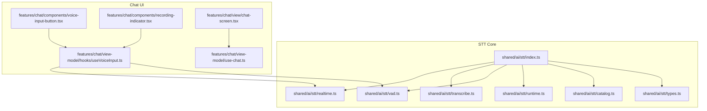
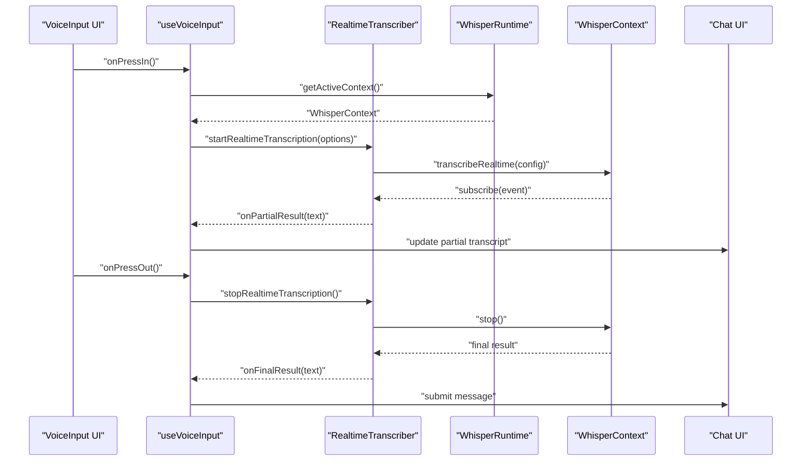
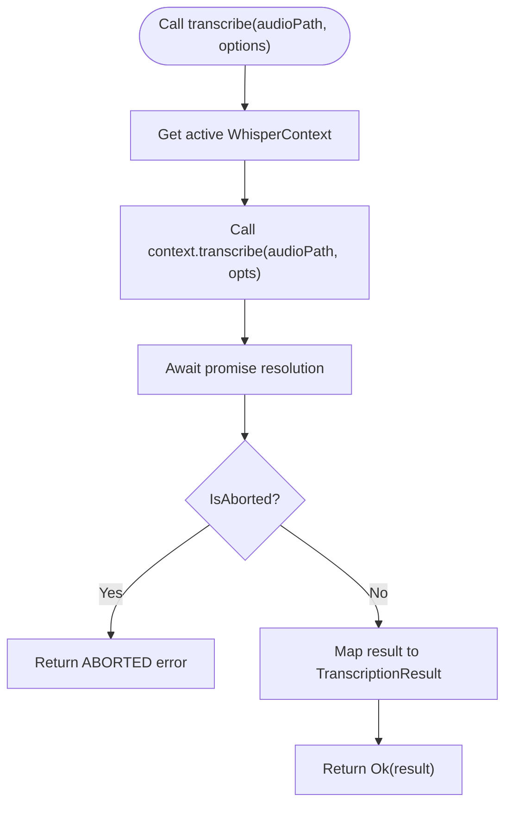
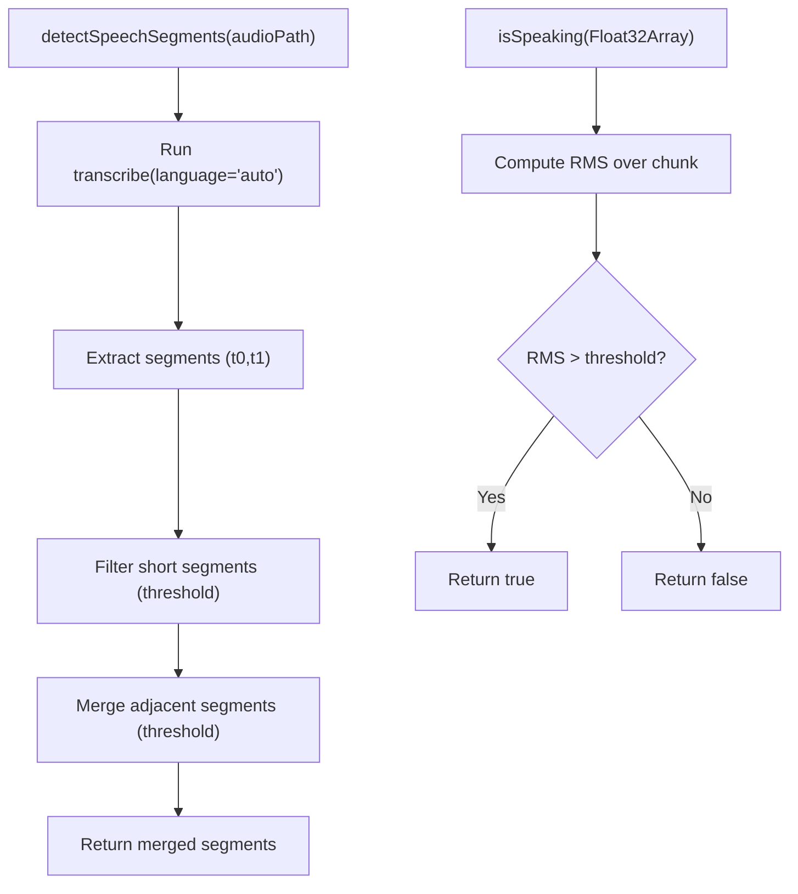
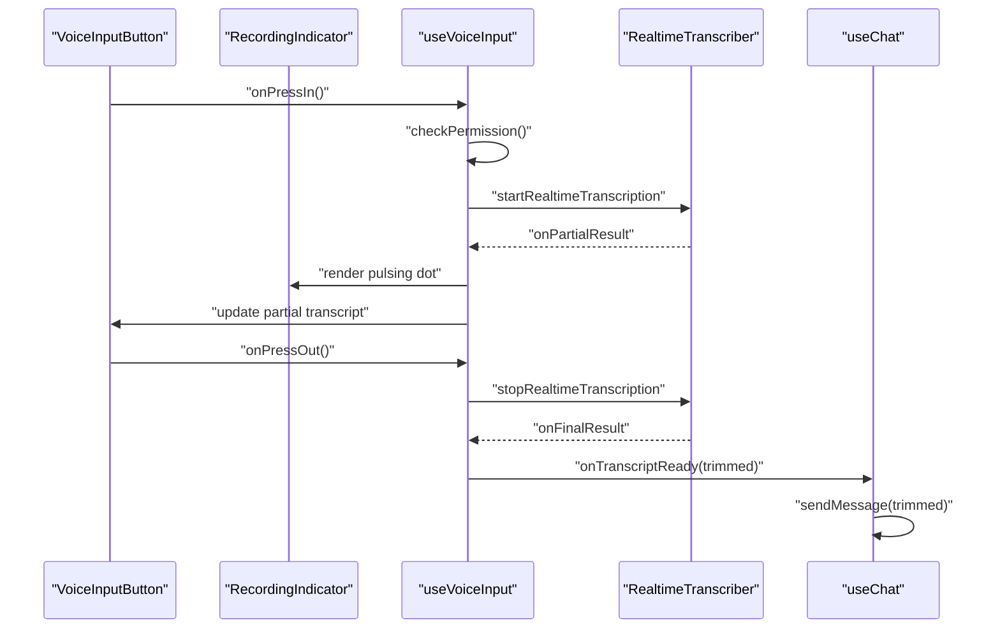
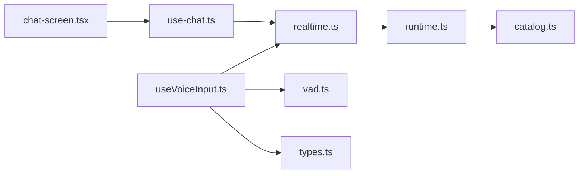

# Real-time Transcription Pipeline

<cite>
**Referenced Files in This Document**
- [index.ts](file://shared/ai/stt/index.ts)
- [realtime.ts](file://shared/ai/stt/realtime.ts)
- [transcribe.ts](file://shared/ai/stt/transcribe.ts)
- [vad.ts](file://shared/ai/stt/vad.ts)
- [types.ts](file://shared/ai/stt/types.ts)
- [runtime.ts](file://shared/ai/stt/runtime.ts)
- [catalog.ts](file://shared/ai/stt/catalog.ts)
- [useVoiceInput.ts](file://features/chat/view-model/hooks/useVoiceInput.ts)
- [voice-input-button.tsx](file://features/chat/components/voice-input-button.tsx)
- [recording-indicator.tsx](file://features/chat/components/recording-indicator.tsx)
- [chat-screen.tsx](file://features/chat/view/chat-screen.tsx)
- [use-chat.ts](file://features/chat/view-model/use-chat.ts)
- [realtime.property.test.ts](file://tests/unit/shared/ai/stt/realtime.property.test.ts)
- [realtime.test.ts](file://tests/unit/shared/ai/stt/realtime.test.ts)
</cite>

## Table of Contents
1. [Introduction](#introduction)
2. [Project Structure](#project-structure)
3. [Core Components](#core-components)
4. [Architecture Overview](#architecture-overview)
5. [Detailed Component Analysis](#detailed-component-analysis)
6. [Dependency Analysis](#dependency-analysis)
7. [Performance Considerations](#performance-considerations)
8. [Troubleshooting Guide](#troubleshooting-guide)
9. [Conclusion](#conclusion)

## Introduction
This document explains the real-time transcription pipeline that captures microphone audio, streams it to a local Whisper model, and delivers immediate text output into the chat flow. It covers:
- Audio chunking and buffering behavior
- Transcription workflow from input to text
- Streaming behavior and latency characteristics
- Integration with the chat system
- Error handling and retries
- Performance optimization strategies
- Quality metrics and accuracy techniques
- Troubleshooting for delays, accuracy, and performance

## Project Structure
The STT subsystem is organized around a small set of modules that expose a unified API for loading models, transcribing audio, detecting speech segments, and performing real-time transcription. The chat UI integrates these APIs to provide voice input and display live transcripts.



**Diagram sources**
- [index.ts:1-20](file://shared/ai/stt/index.ts#L1-L20)
- [realtime.ts:1-145](file://shared/ai/stt/realtime.ts#L1-L145)
- [transcribe.ts:1-69](file://shared/ai/stt/transcribe.ts#L1-L69)
- [vad.ts:1-107](file://shared/ai/stt/vad.ts#L1-L107)
- [types.ts:1-29](file://shared/ai/stt/types.ts#L1-L29)
- [runtime.ts:1-99](file://shared/ai/stt/runtime.ts#L1-L99)
- [catalog.ts:1-41](file://shared/ai/stt/catalog.ts#L1-L41)
- [useVoiceInput.ts:1-358](file://features/chat/view-model/hooks/useVoiceInput.ts#L1-L358)
- [voice-input-button.tsx:1-47](file://features/chat/components/voice-input-button.tsx#L1-L47)
- [recording-indicator.tsx:1-92](file://features/chat/components/recording-indicator.tsx#L1-L92)
- [chat-screen.tsx:1-148](file://features/chat/view/chat-screen.tsx#L1-L148)
- [use-chat.ts:1-371](file://features/chat/view-model/use-chat.ts#L1-L371)

**Section sources**
- [index.ts:1-20](file://shared/ai/stt/index.ts#L1-L20)
- [realtime.ts:1-145](file://shared/ai/stt/realtime.ts#L1-L145)
- [transcribe.ts:1-69](file://shared/ai/stt/transcribe.ts#L1-L69)
- [vad.ts:1-107](file://shared/ai/stt/vad.ts#L1-L107)
- [types.ts:1-29](file://shared/ai/stt/types.ts#L1-L29)
- [runtime.ts:1-99](file://shared/ai/stt/runtime.ts#L1-L99)
- [catalog.ts:1-41](file://shared/ai/stt/catalog.ts#L1-L41)
- [useVoiceInput.ts:1-358](file://features/chat/view-model/hooks/useVoiceInput.ts#L1-L358)
- [voice-input-button.tsx:1-47](file://features/chat/components/voice-input-button.tsx#L1-L47)
- [recording-indicator.tsx:1-92](file://features/chat/components/recording-indicator.tsx#L1-L92)
- [chat-screen.tsx:1-148](file://features/chat/view/chat-screen.tsx#L1-L148)
- [use-chat.ts:1-371](file://features/chat/view-model/use-chat.ts#L1-L371)

## Core Components
- RealtimeTranscriber: Manages a real-time transcription session, emitting partial and final results and handling lifecycle events.
- Transcribe: Provides non-streaming transcription for recorded audio files.
- VAD utilities: Speech segment detection and energy-based speaking detection.
- Runtime and Catalog: Model loading/unloading and model metadata.
- Types: Shared data structures for results and models.
- Chat integration: Voice input hook and UI components that wire microphone capture, real-time transcription, and chat message submission.

Key responsibilities:
- Realtime transcription: start/stop sessions, partial vs final results, error propagation.
- Non-streaming transcription: file-based transcription with optional progress callbacks.
- Speech detection: post-processing of Whisper timestamps and energy-based detection.
- Model lifecycle: load/unload models and expose active context.
- Chat integration: manage UI state, permissions, and dispatch transcribed text to the chat.

**Section sources**
- [realtime.ts:20-145](file://shared/ai/stt/realtime.ts#L20-L145)
- [transcribe.ts:15-69](file://shared/ai/stt/transcribe.ts#L15-L69)
- [vad.ts:48-107](file://shared/ai/stt/vad.ts#L48-L107)
- [runtime.ts:5-99](file://shared/ai/stt/runtime.ts#L5-L99)
- [catalog.ts:3-41](file://shared/ai/stt/catalog.ts#L3-L41)
- [types.ts:3-29](file://shared/ai/stt/types.ts#L3-L29)
- [useVoiceInput.ts:59-358](file://features/chat/view-model/hooks/useVoiceInput.ts#L59-L358)

## Architecture Overview
The pipeline connects the microphone to the Whisper runtime, delivering text to the chat UI in near real-time. The UI manages permissions, recording state, and error messaging, while the STT module encapsulates model context and transcription logic.



**Diagram sources**
- [useVoiceInput.ts:185-247](file://features/chat/view-model/hooks/useVoiceInput.ts#L185-L247)
- [realtime.ts:24-99](file://shared/ai/stt/realtime.ts#L24-L99)
- [runtime.ts:88-99](file://shared/ai/stt/runtime.ts#L88-L99)

## Detailed Component Analysis

### Real-time Transcription Engine
The RealtimeTranscriber encapsulates the lifecycle of a real-time session:
- Validates active model/context
- Chooses between transcribeRealtime and transcribe fallback
- Emits partial results while capturing and final results when capturing stops
- Handles errors and cleans up state

```mermaid
classDiagram
class RealtimeTranscriber {
-boolean isActive
-Function stopFn
+start(options) Result<void>
+stop() Result<void>
+active() boolean
-cleanup() void
}
class WhisperRuntime {
-WhisperContext context
-string modelId
+loadModel(id, path) Result<{id}>
+unloadModel() Result<void>
+isModelLoaded(id?) boolean
+getContext() WhisperContext
}
RealtimeTranscriber --> WhisperRuntime : "uses"
```

**Diagram sources**
- [realtime.ts:20-135](file://shared/ai/stt/realtime.ts#L20-L135)
- [runtime.ts:5-79](file://shared/ai/stt/runtime.ts#L5-L79)

**Section sources**
- [realtime.ts:20-145](file://shared/ai/stt/realtime.ts#L20-L145)
- [runtime.ts:5-99](file://shared/ai/stt/runtime.ts#L5-L99)

### Non-streaming Transcription
Non-realtime transcription supports progress callbacks and cancellation via AbortSignal. It maps Whisper results to a normalized structure with segments in milliseconds.



**Diagram sources**
- [transcribe.ts:15-69](file://shared/ai/stt/transcribe.ts#L15-L69)

**Section sources**
- [transcribe.ts:15-69](file://shared/ai/stt/transcribe.ts#L15-L69)

### Voice Activity Detection (VAD)
Two VAD modes are provided:
- Whisper-based segment detection: returns filtered and merged speech segments from timestamps.
- Energy-based detection: simple RMS threshold on audio chunks for real-time “speaking” decisions.



**Diagram sources**
- [vad.ts:48-107](file://shared/ai/stt/vad.ts#L48-L107)

**Section sources**
- [vad.ts:48-107](file://shared/ai/stt/vad.ts#L48-L107)

### Model Management and Catalog
The runtime loads/unloads models and exposes the active context. The catalog enumerates available models with metadata.

```mermaid
classDiagram
class WhisperRuntime {
-WhisperContext context
-string modelId
+loadModel(id, path) Result<{id}>
+unloadModel() Result<void>
+isModelLoaded(id?) boolean
+getCurrentModel() {id}|null
+getContext() WhisperContext
}
class Catalog {
+WHISPER_CATALOG : WhisperModel[]
+findWhisperModelById(id) WhisperModel|undefined
}
Catalog --> WhisperRuntime : "provides model metadata"
```

**Diagram sources**
- [runtime.ts:5-99](file://shared/ai/stt/runtime.ts#L5-L99)
- [catalog.ts:3-41](file://shared/ai/stt/catalog.ts#L3-L41)

**Section sources**
- [runtime.ts:5-99](file://shared/ai/stt/runtime.ts#L5-L99)
- [catalog.ts:3-41](file://shared/ai/stt/catalog.ts#L3-L41)

### Chat Integration
The voice input hook coordinates:
- Permissions and error messaging
- Recording state and duration
- Real-time partial/final results
- Submission of final transcript to the chat



**Diagram sources**
- [voice-input-button.tsx:22-47](file://features/chat/components/voice-input-button.tsx#L22-L47)
- [recording-indicator.tsx:43-92](file://features/chat/components/recording-indicator.tsx#L43-L92)
- [useVoiceInput.ts:185-291](file://features/chat/view-model/hooks/useVoiceInput.ts#L185-L291)
- [use-chat.ts:101-183](file://features/chat/view-model/use-chat.ts#L101-L183)

**Section sources**
- [useVoiceInput.ts:59-358](file://features/chat/view-model/hooks/useVoiceInput.ts#L59-L358)
- [voice-input-button.tsx:1-47](file://features/chat/components/voice-input-button.tsx#L1-L47)
- [recording-indicator.tsx:1-92](file://features/chat/components/recording-indicator.tsx#L1-L92)
- [use-chat.ts:101-183](file://features/chat/view-model/use-chat.ts#L101-L183)

## Dependency Analysis
- RealtimeTranscriber depends on WhisperRuntime for context availability and on the underlying WhisperContext for transcription.
- useVoiceInput orchestrates UI state and delegates to RealtimeTranscriber and VAD utilities.
- Chat UI consumes final transcripts and sends messages.



**Diagram sources**
- [useVoiceInput.ts:59-358](file://features/chat/view-model/hooks/useVoiceInput.ts#L59-L358)
- [realtime.ts:1-145](file://shared/ai/stt/realtime.ts#L1-L145)
- [runtime.ts:1-99](file://shared/ai/stt/runtime.ts#L1-L99)
- [catalog.ts:1-41](file://shared/ai/stt/catalog.ts#L1-L41)
- [types.ts:1-29](file://shared/ai/stt/types.ts#L1-L29)
- [chat-screen.tsx:1-148](file://features/chat/view/chat-screen.tsx#L1-L148)
- [use-chat.ts:1-371](file://features/chat/view-model/use-chat.ts#L1-L371)

**Section sources**
- [useVoiceInput.ts:59-358](file://features/chat/view-model/hooks/useVoiceInput.ts#L59-L358)
- [realtime.ts:1-145](file://shared/ai/stt/realtime.ts#L1-L145)
- [runtime.ts:1-99](file://shared/ai/stt/runtime.ts#L1-L99)
- [catalog.ts:1-41](file://shared/ai/stt/catalog.ts#L1-L41)
- [types.ts:1-29](file://shared/ai/stt/types.ts#L1-L29)
- [chat-screen.tsx:1-148](file://features/chat/view/chat-screen.tsx#L1-L148)
- [use-chat.ts:1-371](file://features/chat/view-model/use-chat.ts#L1-L371)

## Performance Considerations
- Latency and streaming behavior:
  - Real-time transcription emits partial results while capturing and a final result when capturing stops. The implementation uses a polling interval in tests, indicating periodic updates every 500 ms.
  - Optimize by selecting appropriate Whisper models and ensuring the device can sustain decoding throughput.
- Chunking and buffering:
  - The real-time engine configures buffer sizes and minimum capture durations. These parameters influence responsiveness and accuracy trade-offs.
- Memory management:
  - Load/unload models appropriately to avoid out-of-memory conditions. Prefer smaller models on constrained devices.
- CPU/GPU utilization:
  - Offload heavy work to GPU/CPU efficiently. On mobile, prefer optimized quantized models and avoid unnecessary conversions.
- Batch processing:
  - Non-streaming transcription can leverage progress callbacks to provide feedback without batching per se.

Recommendations:
- Choose a model from the catalog suited to device RAM and performance.
- Monitor memory warnings and unload models when idle.
- Keep UI responsive by avoiding long-running synchronous operations in the transcription callbacks.

**Section sources**
- [realtime.ts:40-44](file://shared/ai/stt/realtime.ts#L40-L44)
- [realtime.property.test.ts:51-139](file://tests/unit/shared/ai/stt/realtime.property.test.ts#L51-L139)
- [catalog.ts:3-41](file://shared/ai/stt/catalog.ts#L3-L41)
- [runtime.ts:56-74](file://shared/ai/stt/runtime.ts#L56-L74)

## Troubleshooting Guide
Common issues and resolutions:
- No model loaded:
  - Symptom: NOT_READY errors when starting transcription.
  - Action: Ensure a model is loaded via the model manager before starting real-time transcription.
- Permission denied:
  - Symptom: Permission-related errors when starting recording.
  - Action: Prompt users to enable microphone access and guide them to system settings.
- Out of memory:
  - Symptom: OOM errors causing premature stop.
  - Action: Unload unused models, choose smaller models, and monitor memory usage.
- Unknown errors:
  - Symptom: General failures during start/stop.
  - Action: Log error codes and messages; retry after resetting state.
- Accuracy issues:
  - Use language hints and higher-capability models for better accuracy.
  - Post-process segments via VAD utilities to refine boundaries.
- Delays and latency:
  - Reduce model size, ensure device performance, and avoid background tasks competing for CPU/GPU.
- Offline fallbacks:
  - Rely on locally loaded models; avoid network-dependent initialization paths.

Operational tips:
- Use the provided error handling to surface actionable messages to users.
- Leverage VAD utilities to improve segmentation and reduce noise.

**Section sources**
- [useVoiceInput.ts:101-131](file://features/chat/view-model/hooks/useVoiceInput.ts#L101-L131)
- [useVoiceInput.ts:137-179](file://features/chat/view-model/hooks/useVoiceInput.ts#L137-L179)
- [realtime.ts:84-98](file://shared/ai/stt/realtime.ts#L84-L98)
- [transcribe.ts:56-68](file://shared/ai/stt/transcribe.ts#L56-L68)
- [vad.ts:48-107](file://shared/ai/stt/vad.ts#L48-L107)

## Conclusion
The real-time transcription pipeline integrates microphone capture, local Whisper inference, and chat UX to deliver a responsive voice-to-text experience. By understanding the real-time engine’s lifecycle, VAD utilities, and model management, developers can optimize latency, accuracy, and reliability across diverse devices. The chat integration ensures seamless handoff from voice input to conversation flow, with robust error handling and user feedback.