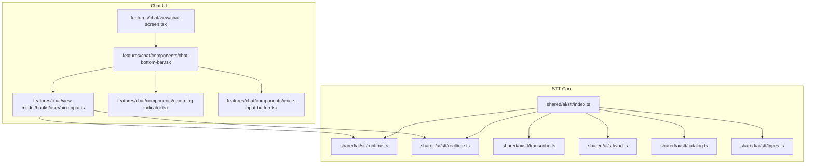
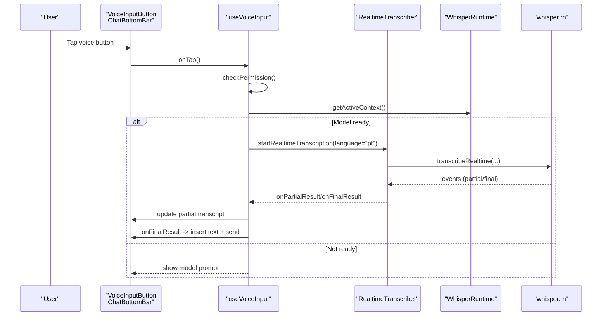
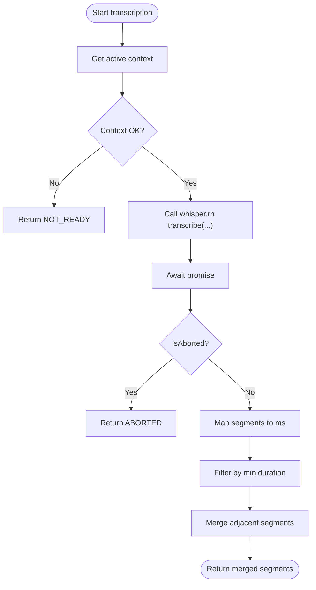
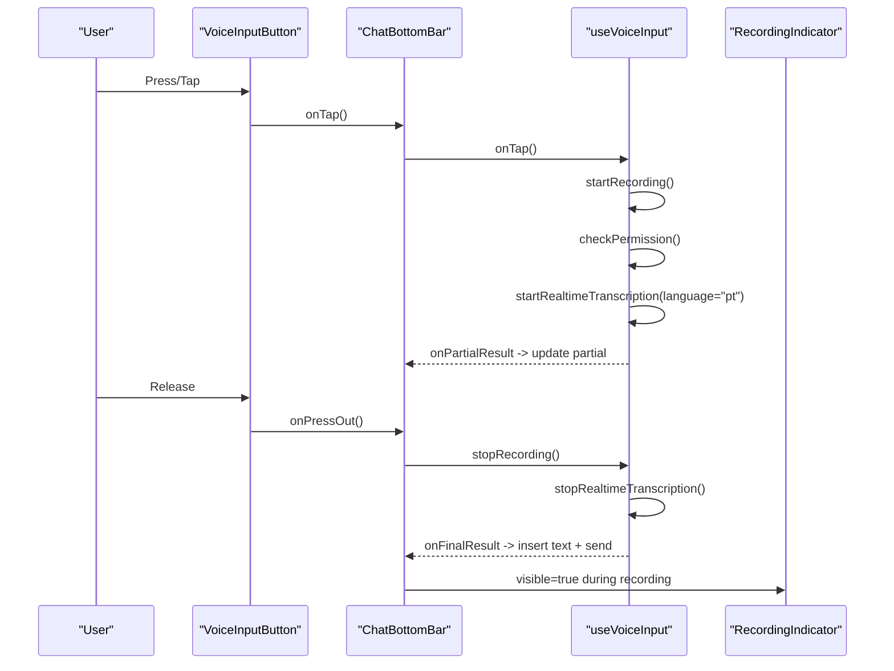
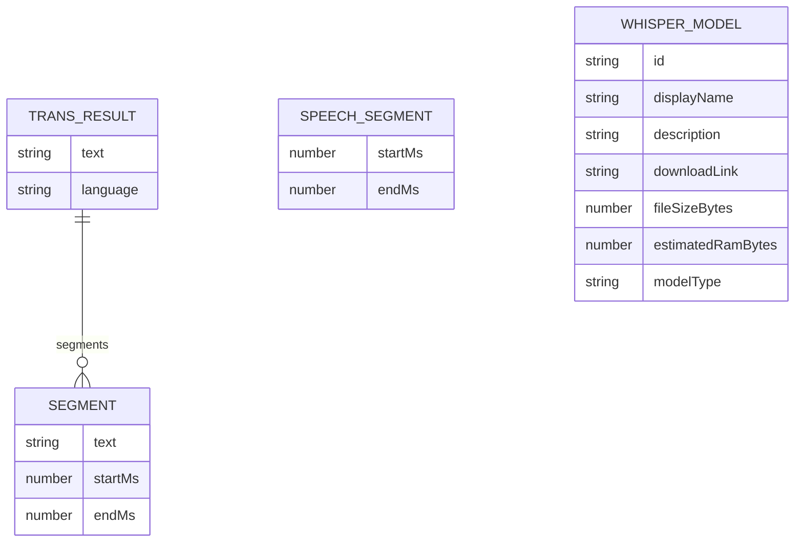
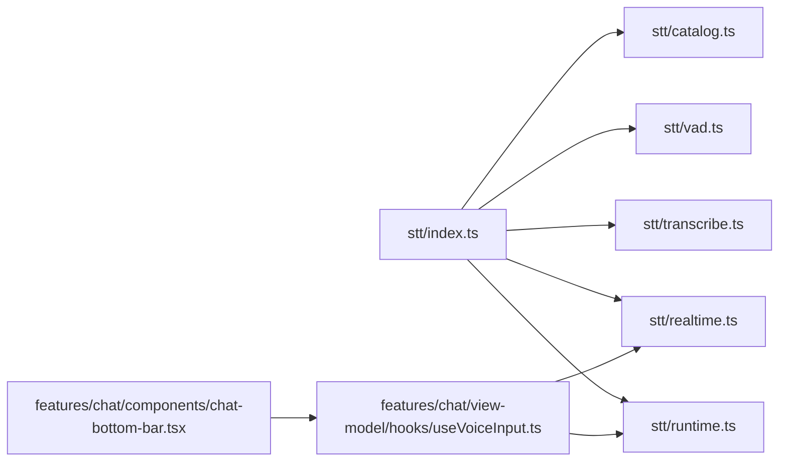

# Speech Processing System

<cite>
**Referenced Files in This Document**
- [index.ts](file://shared/ai/stt/index.ts)
- [vad.ts](file://shared/ai/stt/vad.ts)
- [realtime.ts](file://shared/ai/stt/realtime.ts)
- [runtime.ts](file://shared/ai/stt/runtime.ts)
- [transcribe.ts](file://shared/ai/stt/transcribe.ts)
- [catalog.ts](file://shared/ai/stt/catalog.ts)
- [types.ts](file://shared/ai/stt/types.ts)
- [useVoiceInput.ts](file://features/chat/view-model/hooks/useVoiceInput.ts)
- [chat-bottom-bar.tsx](file://features/chat/components/chat-bottom-bar.tsx)
- [recording-indicator.tsx](file://features/chat/components/recording-indicator.tsx)
- [voice-input-button.tsx](file://features/chat/components/voice-input-button.tsx)
- [chat-screen.tsx](file://features/chat/view/chat-screen.tsx)
- [device.ts](file://shared/device.ts)
- [realtime.test.ts](file://tests/unit/shared/ai/stt/realtime.test.ts)
- [transcribe.test.ts](file://tests/unit/shared/ai/stt/transcribe.test.ts)
- [vad.test.ts](file://tests/unit/shared/ai/stt/vad.test.ts)
</cite>

## Table of Contents
1. [Introduction](#introduction)
2. [Project Structure](#project-structure)
3. [Core Components](#core-components)
4. [Architecture Overview](#architecture-overview)
5. [Detailed Component Analysis](#detailed-component-analysis)
6. [Dependency Analysis](#dependency-analysis)
7. [Performance Considerations](#performance-considerations)
8. [Troubleshooting Guide](#troubleshooting-guide)
9. [Privacy and Security](#privacy-and-security)
10. [Conclusion](#conclusion)

## Introduction
This document explains My Shadow’s voice-enabled chat capabilities with a focus on speech processing. It covers real-time speech-to-text using whisper.rn, Portuguese Brazilian language support, voice activity detection (VAD), the end-to-end voice input workflow, the real-time transcription pipeline, user feedback mechanisms, and integration with the chat UI. It also documents configuration options, troubleshooting steps, performance optimization, and privacy considerations for local-only processing.

## Project Structure
The speech processing system is organized around a small set of focused modules under shared/ai/stt, with UI integration in features/chat. The key areas are:
- STT orchestration and exports
- Runtime management for whisper.rn contexts
- Real-time transcription engine
- File-based transcription and VAD helpers
- Model catalog for Portuguese Brazilian models
- Chat UI hooks and components for voice input



**Diagram sources**
- [index.ts:1-20](file://shared/ai/stt/index.ts#L1-L20)
- [runtime.ts:1-99](file://shared/ai/stt/runtime.ts#L1-L99)
- [realtime.ts:1-145](file://shared/ai/stt/realtime.ts#L1-L145)
- [transcribe.ts:1-69](file://shared/ai/stt/transcribe.ts#L1-L69)
- [vad.ts:1-107](file://shared/ai/stt/vad.ts#L1-L107)
- [catalog.ts:1-41](file://shared/ai/stt/catalog.ts#L1-L41)
- [types.ts:1-29](file://shared/ai/stt/types.ts#L1-L29)
- [useVoiceInput.ts:1-358](file://features/chat/view-model/hooks/useVoiceInput.ts#L1-L358)
- [chat-bottom-bar.tsx:1-221](file://features/chat/components/chat-bottom-bar.tsx#L1-L221)
- [recording-indicator.tsx:1-92](file://features/chat/components/recording-indicator.tsx#L1-L92)
- [voice-input-button.tsx:1-47](file://features/chat/components/voice-input-button.tsx#L1-L47)
- [chat-screen.tsx:1-148](file://features/chat/view/chat-screen.tsx#L1-L148)

**Section sources**
- [index.ts:1-20](file://shared/ai/stt/index.ts#L1-L20)
- [runtime.ts:1-99](file://shared/ai/stt/runtime.ts#L1-L99)
- [realtime.ts:1-145](file://shared/ai/stt/realtime.ts#L1-L145)
- [transcribe.ts:1-69](file://shared/ai/stt/transcribe.ts#L1-L69)
- [vad.ts:1-107](file://shared/ai/stt/vad.ts#L1-L107)
- [catalog.ts:1-41](file://shared/ai/stt/catalog.ts#L1-L41)
- [types.ts:1-29](file://shared/ai/stt/types.ts#L1-L29)
- [useVoiceInput.ts:1-358](file://features/chat/view-model/hooks/useVoiceInput.ts#L1-L358)
- [chat-bottom-bar.tsx:1-221](file://features/chat/components/chat-bottom-bar.tsx#L1-L221)
- [recording-indicator.tsx:1-92](file://features/chat/components/recording-indicator.tsx#L1-L92)
- [voice-input-button.tsx:1-47](file://features/chat/components/voice-input-button.tsx#L1-L47)
- [chat-screen.tsx:1-148](file://features/chat/view/chat-screen.tsx#L1-L148)

## Core Components
- STT exports: Provides public APIs for model discovery, runtime access, transcription, real-time transcription, and VAD.
- Runtime: Manages a singleton whisper.rn context, loading/unloading models, and exposing the active context.
- Real-time transcription: Encapsulates start/stop lifecycle, event subscription, and partial/final result handling.
- Transcription (file-based): Handles batch transcription with optional progress and abort signals.
- VAD: Extracts speech segments from audio files using Whisper timestamps and performs lightweight real-time energy-based detection.
- Catalog: Defines Portuguese Brazilian models with metadata for download and memory estimates.
- Types: Defines core data structures for segments, results, and model descriptors.
- Chat integration: Orchestrates permissions, recording lifecycle, UI feedback, and seamless transition to text input.

**Section sources**
- [index.ts:1-20](file://shared/ai/stt/index.ts#L1-L20)
- [runtime.ts:1-99](file://shared/ai/stt/runtime.ts#L1-L99)
- [realtime.ts:1-145](file://shared/ai/stt/realtime.ts#L1-L145)
- [transcribe.ts:1-69](file://shared/ai/stt/transcribe.ts#L1-L69)
- [vad.ts:1-107](file://shared/ai/stt/vad.ts#L1-L107)
- [catalog.ts:1-41](file://shared/ai/stt/catalog.ts#L1-L41)
- [types.ts:1-29](file://shared/ai/stt/types.ts#L1-L29)
- [useVoiceInput.ts:1-358](file://features/chat/view-model/hooks/useVoiceInput.ts#L1-L358)

## Architecture Overview
The system integrates UI gestures with whisper.rn-powered speech recognition. The flow:
- User presses the voice input button.
- Permissions are checked and audio mode configured.
- Real-time transcription starts with a language hint for Portuguese.
- Partial results stream to the UI; final result triggers text insertion and sends the message.
- Recording state updates with duration and visual indicators.



**Diagram sources**
- [useVoiceInput.ts:137-247](file://features/chat/view-model/hooks/useVoiceInput.ts#L137-L247)
- [realtime.ts:24-98](file://shared/ai/stt/realtime.ts#L24-L98)
- [runtime.ts:88-98](file://shared/ai/stt/runtime.ts#L88-L98)

## Detailed Component Analysis

### Real-time Transcription Engine
The engine encapsulates the lifecycle of a real-time session:
- Guard checks if a session is already active.
- Resolves the active whisper.rn context; returns NOT_READY if none.
- Attempts transcribeRealtime; falls back to transcribe if unavailable.
- Subscribes to events, dispatching partial results while capturing and final results when capturing ends.
- Ensures cleanup on stop or error.

```mermaid
classDiagram
class RealtimeTranscriber {
-boolean isActive
-Function stopFn
+start(options) Result<void>
+stop() Result<void>
+active() boolean
-cleanup() void
}
class WhisperRuntime {
-WhisperContext context
-string modelId
+loadModel(id, path) Result<{id}>
+unloadModel() Result<void>
+getContext() WhisperContext
+isModelLoaded(id?) boolean
}
RealtimeTranscriber --> WhisperRuntime : "uses context"
```

**Diagram sources**
- [realtime.ts:20-135](file://shared/ai/stt/realtime.ts#L20-L135)
- [runtime.ts:5-79](file://shared/ai/stt/runtime.ts#L5-L79)

**Section sources**
- [realtime.ts:1-145](file://shared/ai/stt/realtime.ts#L1-L145)
- [runtime.ts:1-99](file://shared/ai/stt/runtime.ts#L1-L99)

### File-based Transcription and VAD
- File-based transcription supports language hints, progress callbacks, and abort signals. It maps whisper.rn segment timestamps to millisecond-aligned segments.
- VAD extracts speech segments from audio files using Whisper timestamps, filtering short gaps and merging adjacent segments. It also provides a lightweight real-time energy-based detector for audio chunks.



**Diagram sources**
- [transcribe.ts:15-55](file://shared/ai/stt/transcribe.ts#L15-L55)
- [vad.ts:48-91](file://shared/ai/stt/vad.ts#L48-L91)

**Section sources**
- [transcribe.ts:1-69](file://shared/ai/stt/transcribe.ts#L1-L69)
- [vad.ts:1-107](file://shared/ai/stt/vad.ts#L1-L107)

### Portuguese Brazilian Model Selection
The catalog defines three Portuguese Brazilian models with distinct sizes and RAM estimates. Selecting the appropriate model balances accuracy and device capability.

- Whisper Tiny (pt-BR)
- Whisper Base (pt-BR)
- Whisper Small (pt-BR)

These models are intended for local-only processing and are surfaced in the chat UI for selection alongside LLM models.

**Section sources**
- [catalog.ts:1-41](file://shared/ai/stt/catalog.ts#L1-L41)

### Voice Input Workflow and UI Feedback
The voice input hook coordinates:
- Permission checks and audio mode configuration.
- Starting and stopping real-time transcription with a Portuguese language hint.
- Managing UI state: recording, processing, partial transcripts, duration, and error messaging.
- Integrating with the chat bottom bar to replace text input with live transcripts and show recording indicators.



**Diagram sources**
- [useVoiceInput.ts:185-269](file://features/chat/view-model/hooks/useVoiceInput.ts#L185-L269)
- [chat-bottom-bar.tsx:71-91](file://features/chat/components/chat-bottom-bar.tsx#L71-L91)
- [recording-indicator.tsx:43-76](file://features/chat/components/recording-indicator.tsx#L43-L76)

**Section sources**
- [useVoiceInput.ts:1-358](file://features/chat/view-model/hooks/useVoiceInput.ts#L1-L358)
- [chat-bottom-bar.tsx:1-221](file://features/chat/components/chat-bottom-bar.tsx#L1-L221)
- [recording-indicator.tsx:1-92](file://features/chat/components/recording-indicator.tsx#L1-L92)
- [voice-input-button.tsx:1-47](file://features/chat/components/voice-input-button.tsx#L1-L47)

### Data Models
Core types define the shape of transcription results and segments.



**Diagram sources**
- [types.ts:3-28](file://shared/ai/stt/types.ts#L3-L28)

**Section sources**
- [types.ts:1-29](file://shared/ai/stt/types.ts#L1-L29)

## Dependency Analysis
- Public exports in index.ts aggregate the STT surface area, enabling clean imports across the app.
- The chat UI depends on useVoiceInput, which depends on realtime.ts and runtime.ts.
- VAD and transcribe depend on runtime.ts for the active whisper.rn context.
- The catalog provides model metadata used by the chat UI for model selection.



**Diagram sources**
- [index.ts:1-20](file://shared/ai/stt/index.ts#L1-L20)
- [runtime.ts:1-99](file://shared/ai/stt/runtime.ts#L1-L99)
- [realtime.ts:1-145](file://shared/ai/stt/realtime.ts#L1-L145)
- [transcribe.ts:1-69](file://shared/ai/stt/transcribe.ts#L1-L69)
- [vad.ts:1-107](file://shared/ai/stt/vad.ts#L1-L107)
- [catalog.ts:1-41](file://shared/ai/stt/catalog.ts#L1-L41)
- [useVoiceInput.ts:1-358](file://features/chat/view-model/hooks/useVoiceInput.ts#L1-L358)
- [chat-bottom-bar.tsx:1-221](file://features/chat/components/chat-bottom-bar.tsx#L1-L221)

**Section sources**
- [index.ts:1-20](file://shared/ai/stt/index.ts#L1-L20)
- [useVoiceInput.ts:1-358](file://features/chat/view-model/hooks/useVoiceInput.ts#L1-L358)

## Performance Considerations
- Model selection: Choose a smaller Portuguese model for constrained devices; larger models improve accuracy at higher RAM costs.
- Device capabilities: Use device.ts to estimate CPU cores and GPU backend to inform model and concurrency decisions.
- Real-time thresholds: Adjust silence thresholds and audio chunk sizes to balance responsiveness and accuracy.
- Memory management: Unload models when not in use via runtime.ts to free RAM.

[No sources needed since this section provides general guidance]

## Troubleshooting Guide
Common issues and resolutions:
- Microphone permission denied: The hook surfaces a user-facing message and opens system settings. Verify device settings and try again.
- No model loaded: The UI shows a prompt to download a Portuguese model. Load a model from the model catalog before recording.
- Out of memory: Reduce model size or close other memory-intensive tasks; unload the model if needed.
- Real-time session already active: Ensure previous sessions are stopped before starting a new one.
- Transcription aborted: Confirm the session was not interrupted; retry after ensuring sufficient resources.

**Section sources**
- [useVoiceInput.ts:40-55](file://features/chat/view-model/hooks/useVoiceInput.ts#L40-L55)
- [useVoiceInput.ts:137-179](file://features/chat/view-model/hooks/useVoiceInput.ts#L137-L179)
- [realtime.ts:24-98](file://shared/ai/stt/realtime.ts#L24-L98)
- [transcribe.ts:39-41](file://shared/ai/stt/transcribe.ts#L39-L41)

## Privacy and Security
- Local-only processing: All speech processing occurs on-device via whisper.rn, minimizing data exposure.
- Encrypted storage: Audio files are stored locally; ensure device-level encryption is enabled per platform policies.
- Minimal telemetry: The system avoids sending audio or transcripts outside the device unless explicitly configured otherwise.

[No sources needed since this section provides general guidance]

## Conclusion
My Shadow’s speech processing system integrates whisper.rn for robust, local-only real-time transcription with Portuguese Brazilian language support. The modular architecture separates concerns between runtime management, transcription, VAD, and UI integration. The chat UI provides immediate feedback and a smooth transition from voice input to text-based conversation, with clear error handling and performance-conscious model selection.