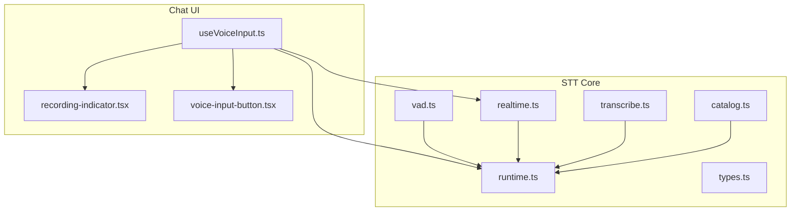
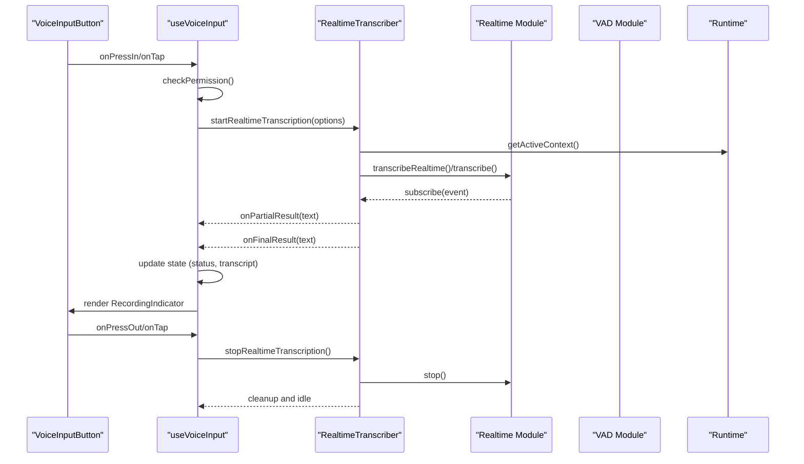
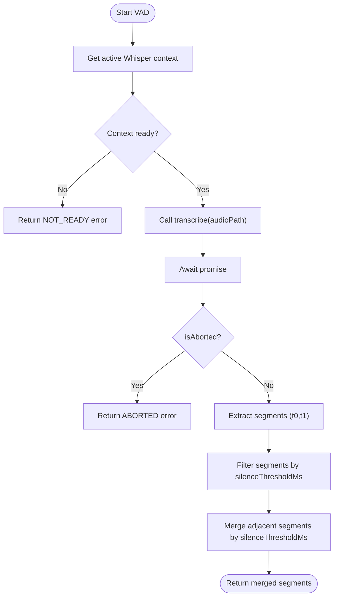
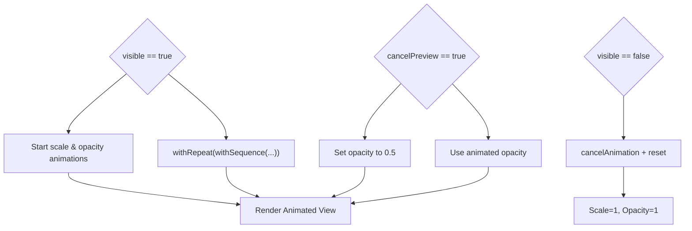
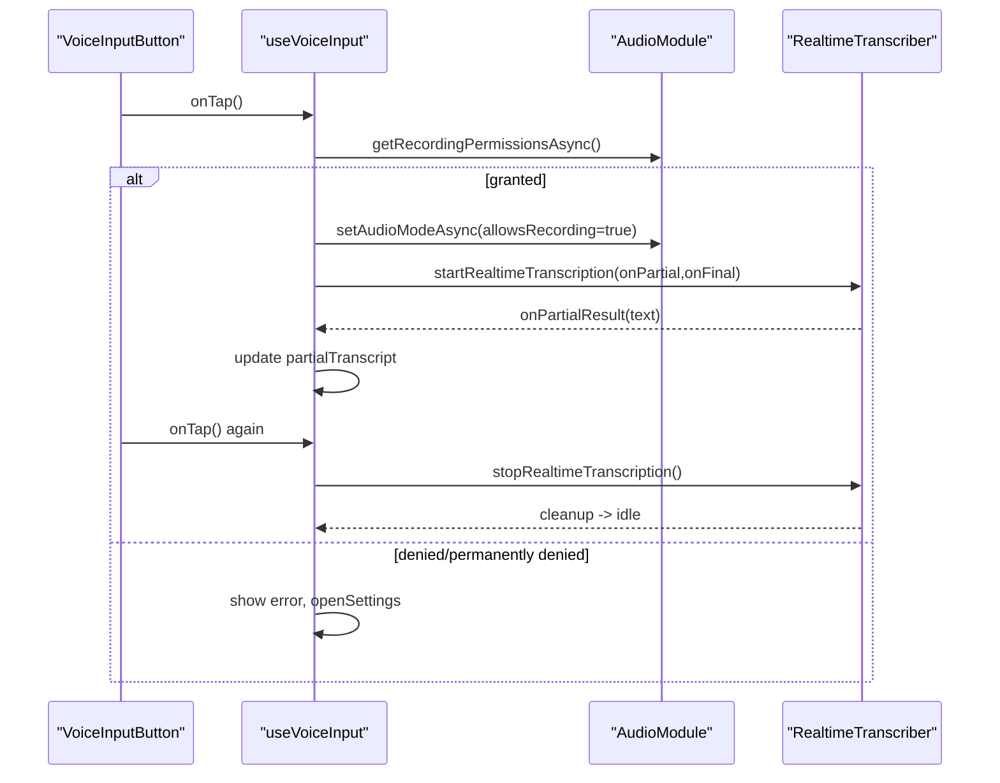
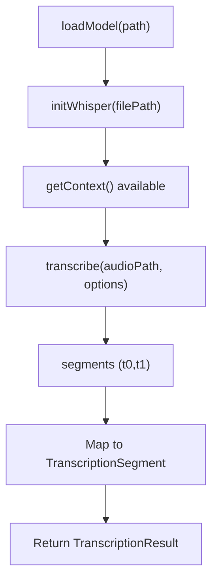
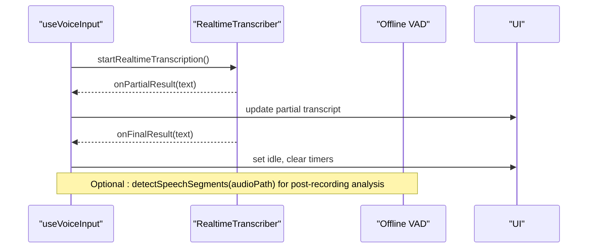
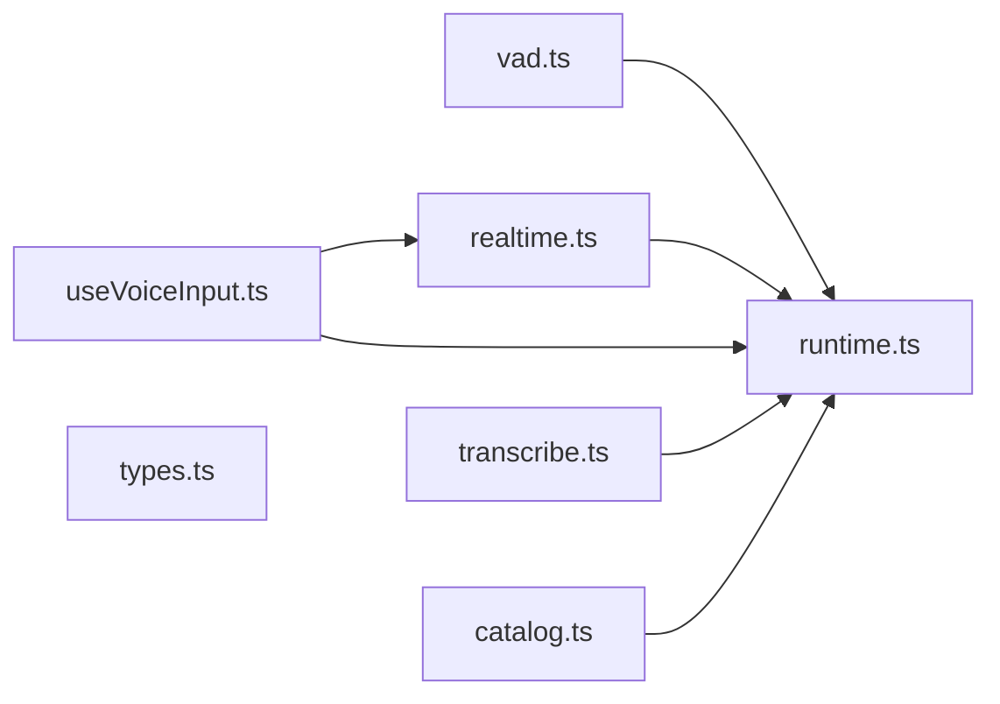

# Voice Activity Detection (VAD)

<cite>
**Referenced Files in This Document**
- [vad.ts](file://shared/ai/stt/vad.ts)
- [realtime.ts](file://shared/ai/stt/realtime.ts)
- [runtime.ts](file://shared/ai/stt/runtime.ts)
- [transcribe.ts](file://shared/ai/stt/transcribe.ts)
- [types.ts](file://shared/ai/stt/types.ts)
- [catalog.ts](file://shared/ai/stt/catalog.ts)
- [useVoiceInput.ts](file://features/chat/view-model/hooks/useVoiceInput.ts)
- [recording-indicator.tsx](file://features/chat/components/recording-indicator.tsx)
- [voice-input-button.tsx](file://features/chat/components/voice-input-button.tsx)
- [use-chat.ts](file://features/chat/view-model/use-chat.ts)
- [vad.test.ts](file://tests/unit/shared/ai/stt/vad.test.ts)
- [vad.property.test.ts](file://tests/unit/shared/ai/stt/vad.property.test.ts)
</cite>

## Table of Contents
1. [Introduction](#introduction)
2. [Project Structure](#project-structure)
3. [Core Components](#core-components)
4. [Architecture Overview](#architecture-overview)
5. [Detailed Component Analysis](#detailed-component-analysis)
6. [Dependency Analysis](#dependency-analysis)
7. [Performance Considerations](#performance-considerations)
8. [Troubleshooting Guide](#troubleshooting-guide)
9. [Conclusion](#conclusion)
10. [Appendices](#appendices)

## Introduction
This document explains the Voice Activity Detection (VAD) system that intelligently detects speech boundaries and optimizes recording efficiency. It covers:
- VAD algorithm implementation for offline audio segmentation and online energy-based speech detection
- Recording indicator visuals and UI integration
- Voice input hook lifecycle, permissions, and state management
- Audio preprocessing pipeline and integration with real-time transcription
- Configuration options for sensitivity, duration limits, and power optimization
- Common issues and mitigations

## Project Structure
The VAD system spans several modules:
- STT core: VAD detection, real-time transcription, runtime management, and types
- Chat UI: voice input hook, recording indicator, and voice input button
- Tests: property and unit tests validating behavior and edge cases

**Diagram sources**
- [vad.ts:1-107](file://shared/ai/stt/vad.ts#L1-L107)
- [realtime.ts:1-145](file://shared/ai/stt/realtime.ts#L1-L145)
- [runtime.ts:1-99](file://shared/ai/stt/runtime.ts#L1-L99)
- [transcribe.ts:1-69](file://shared/ai/stt/transcribe.ts#L1-L69)
- [types.ts:1-29](file://shared/ai/stt/types.ts#L1-L29)
- [catalog.ts:1-41](file://shared/ai/stt/catalog.ts#L1-L41)
- [useVoiceInput.ts:1-358](file://features/chat/view-model/hooks/useVoiceInput.ts#L1-L358)
- [recording-indicator.tsx:1-92](file://features/chat/components/recording-indicator.tsx#L1-L92)
- [voice-input-button.tsx:1-47](file://features/chat/components/voice-input-button.tsx#L1-L47)

**Section sources**
- [vad.ts:1-107](file://shared/ai/stt/vad.ts#L1-L107)
- [realtime.ts:1-145](file://shared/ai/stt/realtime.ts#L1-L145)
- [runtime.ts:1-99](file://shared/ai/stt/runtime.ts#L1-L99)
- [transcribe.ts:1-69](file://shared/ai/stt/transcribe.ts#L1-L69)
- [types.ts:1-29](file://shared/ai/stt/types.ts#L1-L29)
- [catalog.ts:1-41](file://shared/ai/stt/catalog.ts#L1-L41)
- [useVoiceInput.ts:1-358](file://features/chat/view-model/hooks/useVoiceInput.ts#L1-L358)
- [recording-indicator.tsx:1-92](file://features/chat/components/recording-indicator.tsx#L1-L92)
- [voice-input-button.tsx:1-47](file://features/chat/components/voice-input-button.tsx#L1-L47)

## Core Components
- VAD module: Provides offline speech segment detection and online energy-based speech detection
- Realtime transcription: Manages live audio capture and streaming transcription events
- Runtime: Initializes and manages the Whisper context and model lifecycle
- Voice input hook: Orchestrates recording lifecycle, permissions, UI state, and error handling
- Recording indicator: Visual feedback during recording with animated states
- Types and catalog: Shared types and model metadata for Whisper models

Key responsibilities:
- Offline VAD: Filters and merges Whisper-generated segments based on silence thresholds
- Online VAD: Energy-based detection for immediate speech presence checks
- Real-time transcription: Streams partial and final results, manages lifecycle
- UI integration: Exposes status, partial transcripts, and gesture handlers

**Section sources**
- [vad.ts:48-106](file://shared/ai/stt/vad.ts#L48-L106)
- [realtime.ts:20-141](file://shared/ai/stt/realtime.ts#L20-L141)
- [runtime.ts:5-98](file://shared/ai/stt/runtime.ts#L5-L98)
- [useVoiceInput.ts:59-357](file://features/chat/view-model/hooks/useVoiceInput.ts#L59-L357)
- [recording-indicator.tsx:43-91](file://features/chat/components/recording-indicator.tsx#L43-L91)

## Architecture Overview
The VAD system integrates offline and online detection with real-time transcription and UI feedback.

**Diagram sources**
- [useVoiceInput.ts:185-270](file://features/chat/view-model/hooks/useVoiceInput.ts#L185-L270)
- [realtime.ts:24-81](file://shared/ai/stt/realtime.ts#L24-L81)
- [runtime.ts:88-98](file://shared/ai/stt/runtime.ts#L88-L98)
- [recording-indicator.tsx:43-91](file://features/chat/components/recording-indicator.tsx#L43-L91)

## Detailed Component Analysis

### VAD Algorithm Implementation
Offline VAD:
- Uses Whisper’s built-in segment timestamps (t0/t1 in milliseconds)
- Filters segments shorter than a configurable silence threshold
- Merges adjacent segments separated by less than the threshold

Online VAD:
- Computes RMS energy per audio chunk
- Compares against a fixed energy threshold to decide speech presence

**Diagram sources**
- [vad.ts:48-91](file://shared/ai/stt/vad.ts#L48-L91)

**Section sources**
- [vad.ts:5-42](file://shared/ai/stt/vad.ts#L5-L42)
- [vad.ts:48-91](file://shared/ai/stt/vad.ts#L48-L91)
- [vad.ts:93-106](file://shared/ai/stt/vad.ts#L93-L106)

### Recording Indicator System
The recording indicator provides animated visual feedback:
- Continuous pulsing animation using shared values and sequences
- Opacity and scaling transitions for a breathing effect
- Cancel preview mode reduces opacity to signal cancellation intent
- Controlled visibility and cleanup on unmount

**Diagram sources**
- [recording-indicator.tsx:50-82](file://features/chat/components/recording-indicator.tsx#L50-L82)

**Section sources**
- [recording-indicator.tsx:1-92](file://features/chat/components/recording-indicator.tsx#L1-L92)

### Voice Input Hook Lifecycle and Permissions
The voice input hook manages the recording lifecycle:
- Permission checks and requests via expo-audio
- Starts/stops real-time transcription with callbacks for partial and final results
- Tracks recording duration and error states
- Integrates with accessibility announcements and UI updates

**Diagram sources**
- [useVoiceInput.ts:137-179](file://features/chat/view-model/hooks/useVoiceInput.ts#L137-L179)
- [useVoiceInput.ts:185-270](file://features/chat/view-model/hooks/useVoiceInput.ts#L185-L270)
- [voice-input-button.tsx:22-46](file://features/chat/components/voice-input-button.tsx#L22-L46)

**Section sources**
- [useVoiceInput.ts:1-358](file://features/chat/view-model/hooks/useVoiceInput.ts#L1-L358)
- [voice-input-button.tsx:1-47](file://features/chat/components/voice-input-button.tsx#L1-L47)

### Audio Preprocessing Pipeline
Preprocessing for transcription:
- Model loading and runtime management
- Transcription options including language selection and progress callbacks
- Segment conversion from Whisper timestamps to internal types

**Diagram sources**
- [runtime.ts:20-78](file://shared/ai/stt/runtime.ts#L20-L78)
- [transcribe.ts:15-55](file://shared/ai/stt/transcribe.ts#L15-L55)
- [types.ts:3-28](file://shared/ai/stt/types.ts#L3-L28)

**Section sources**
- [runtime.ts:1-99](file://shared/ai/stt/runtime.ts#L1-L99)
- [transcribe.ts:1-69](file://shared/ai/stt/transcribe.ts#L1-L69)
- [types.ts:1-29](file://shared/ai/stt/types.ts#L1-L29)

### Integration Between VAD and Real-Time Transcription
Integration points:
- Offline VAD uses Whisper’s segment timestamps to detect speech boundaries
- Online VAD (energy-based) can be used for immediate speech presence checks during recording
- Real-time transcription streams partial results; final result triggers UI idle state

**Diagram sources**
- [useVoiceInput.ts:207-228](file://features/chat/view-model/hooks/useVoiceInput.ts#L207-L228)
- [realtime.ts:66-81](file://shared/ai/stt/realtime.ts#L66-L81)
- [vad.ts:48-91](file://shared/ai/stt/vad.ts#L48-L91)

**Section sources**
- [useVoiceInput.ts:1-358](file://features/chat/view-model/hooks/useVoiceInput.ts#L1-L358)
- [realtime.ts:1-145](file://shared/ai/stt/realtime.ts#L1-L145)
- [vad.ts:1-107](file://shared/ai/stt/vad.ts#L1-L107)

## Dependency Analysis
- VAD depends on runtime for an active Whisper context
- Realtime transcription depends on runtime for context initialization
- Voice input hook orchestrates permissions, runtime, and UI
- Types define shared data structures for segments and results
- Catalog provides model metadata for Whisper models

**Diagram sources**
- [vad.ts:1-107](file://shared/ai/stt/vad.ts#L1-L107)
- [realtime.ts:1-145](file://shared/ai/stt/realtime.ts#L1-L145)
- [runtime.ts:1-99](file://shared/ai/stt/runtime.ts#L1-L99)
- [transcribe.ts:1-69](file://shared/ai/stt/transcribe.ts#L1-L69)
- [types.ts:1-29](file://shared/ai/stt/types.ts#L1-L29)
- [catalog.ts:1-41](file://shared/ai/stt/catalog.ts#L1-L41)
- [useVoiceInput.ts:1-358](file://features/chat/view-model/hooks/useVoiceInput.ts#L1-L358)

**Section sources**
- [vad.ts:1-107](file://shared/ai/stt/vad.ts#L1-L107)
- [realtime.ts:1-145](file://shared/ai/stt/realtime.ts#L1-L145)
- [runtime.ts:1-99](file://shared/ai/stt/runtime.ts#L1-L99)
- [transcribe.ts:1-69](file://shared/ai/stt/transcribe.ts#L1-L69)
- [types.ts:1-29](file://shared/ai/stt/types.ts#L1-L29)
- [catalog.ts:1-41](file://shared/ai/stt/catalog.ts#L1-L41)
- [useVoiceInput.ts:1-358](file://features/chat/view-model/hooks/useVoiceInput.ts#L1-L358)

## Performance Considerations
- Offline VAD cost: Depends on Whisper inference; use appropriate model size from catalog
- Online VAD cost: Minimal CPU overhead for RMS energy computation
- Real-time transcription: Tune realtimeAudioSec and realtimeAudioMinSec to balance responsiveness and latency
- Memory: Model loading/unloading impacts memory footprint; unload when not in use
- Power: Reduce audio sampling rate or disable non-essential features on low-end devices

[No sources needed since this section provides general guidance]

## Troubleshooting Guide
Common issues and mitigations:
- False positives (background noise):
  - Increase silenceThresholdMs to filter out short non-speech segments
  - Consider enabling noise reduction in upstream audio capture
- Microphone permission problems:
  - Use the built-in permission flow; guide users to Settings if permanently denied
  - Provide clear error messaging and a way to open system settings
- Background noise interference:
  - Adjust energy threshold in online VAD if using it for immediate detection
  - Prefer longer silence thresholds for robustness in noisy environments
- Out-of-memory errors:
  - Unload models when not needed; prefer smaller models from catalog
  - Monitor available RAM and reduce context sizes accordingly

**Section sources**
- [useVoiceInput.ts:101-131](file://features/chat/view-model/hooks/useVoiceInput.ts#L101-L131)
- [useVoiceInput.ts:137-179](file://features/chat/view-model/hooks/useVoiceInput.ts#L137-L179)
- [vad.ts:57-57](file://shared/ai/stt/vad.ts#L57-L57)
- [vad.ts:93-106](file://shared/ai/stt/vad.ts#L93-L106)
- [catalog.ts:3-41](file://shared/ai/stt/catalog.ts#L3-L41)

## Conclusion
The VAD system combines offline Whisper-based segmentation with online energy-based detection to deliver responsive and efficient voice input. The voice input hook coordinates permissions, lifecycle, and UI feedback, while the recording indicator provides clear visual cues. With configurable thresholds and model choices, the system balances accuracy, performance, and power consumption across devices.

[No sources needed since this section summarizes without analyzing specific files]

## Appendices

### Configuration Options
- Offline VAD
  - silenceThresholdMs: Minimum duration (ms) to keep a segment; default applied if not provided
- Online VAD
  - ENERGY_THRESHOLD: Fixed RMS threshold for speech presence detection
- Real-time transcription
  - language: Target language for transcription
  - realtimeAudioSec: Window size for real-time audio chunks
  - realtimeAudioMinSec: Minimum real-time audio window
- Model selection
  - Choose from catalog models tailored for Portuguese (Brazilian Portuguese variants)

**Section sources**
- [vad.ts:5-7](file://shared/ai/stt/vad.ts#L5-L7)
- [vad.ts:57-57](file://shared/ai/stt/vad.ts#L57-L57)
- [vad.ts:93-106](file://shared/ai/stt/vad.ts#L93-L106)
- [realtime.ts:40-46](file://shared/ai/stt/realtime.ts#L40-L46)
- [catalog.ts:3-41](file://shared/ai/stt/catalog.ts#L3-L41)

### Testing Coverage
- Unit tests validate offline VAD behavior for silent audio and energy-based detection
- Property tests verify filtering and merging logic under varied inputs and thresholds

**Section sources**
- [vad.test.ts:1-287](file://tests/unit/shared/ai/stt/vad.test.ts#L1-L287)
- [vad.property.test.ts:1-171](file://tests/unit/shared/ai/stt/vad.property.test.ts#L1-L171)