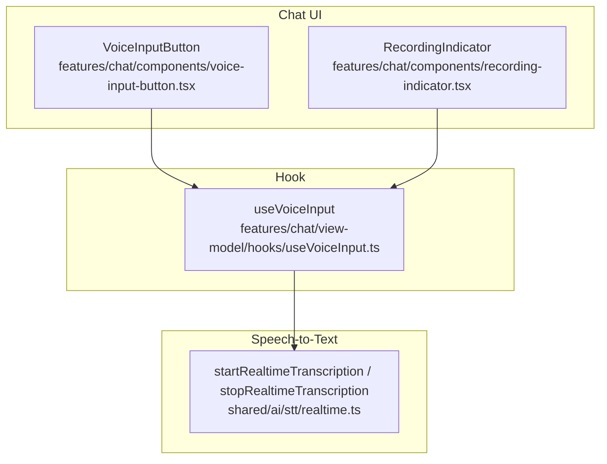
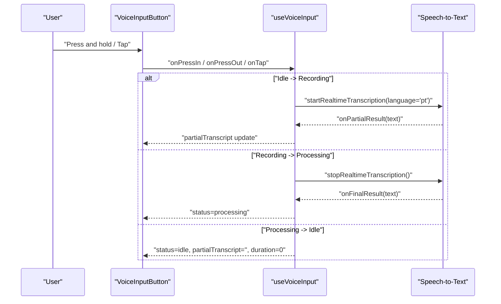
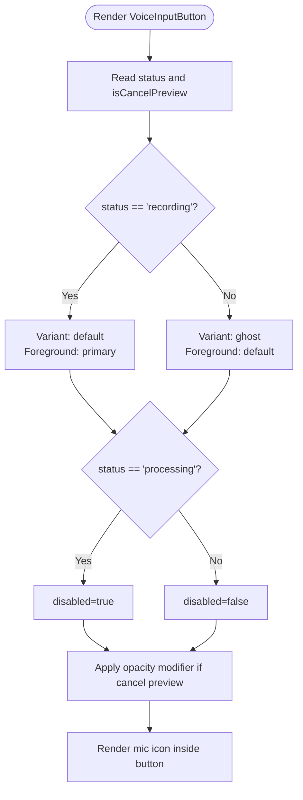
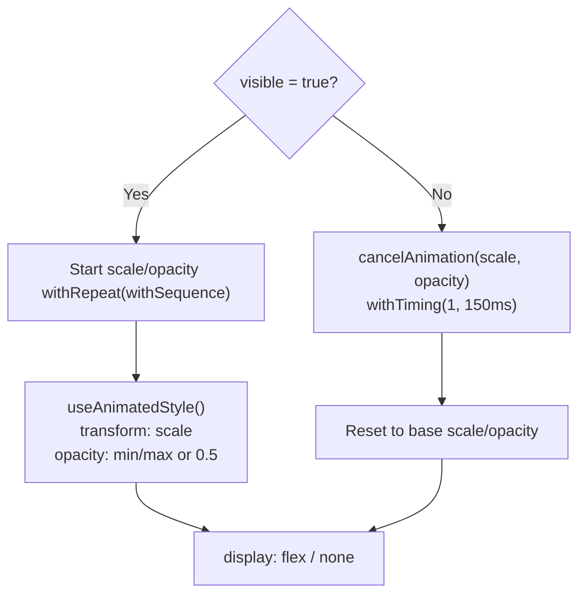
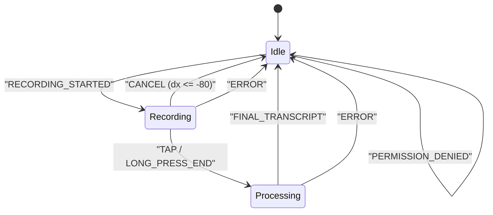
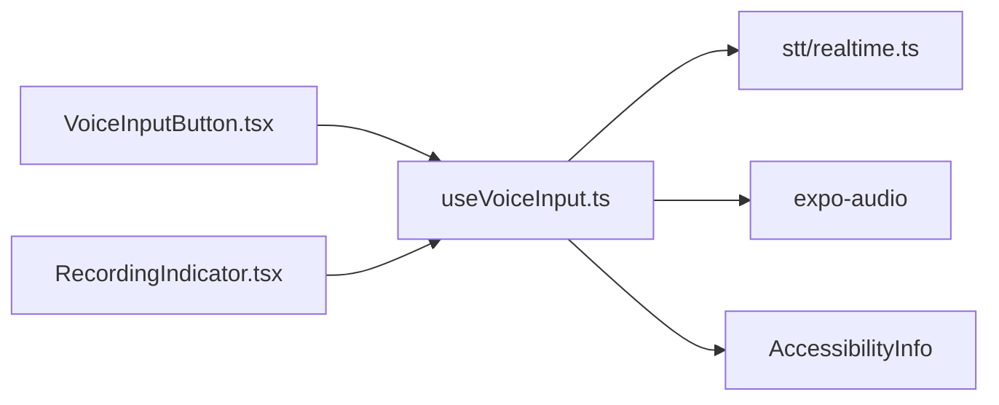

# Voice Input UI Components

<cite>
**Referenced Files in This Document**
- [voice-input-button.tsx](file://features/chat/components/voice-input-button.tsx)
- [recording-indicator.tsx](file://features/chat/components/recording-indicator.tsx)
- [useVoiceInput.ts](file://features/chat/view-model/hooks/useVoiceInput.ts)
- [useVoiceInput.test.ts](file://tests/unit/features/chat/hooks/useVoiceInput.test.ts)
- [useVoiceInput.property.test.ts](file://tests/unit/features/chat/hooks/useVoiceInput.property.test.ts)
- [useVoiceInput.accessibility.test.ts](file://tests/unit/features/chat/hooks/useVoiceInput.accessibility.test.ts)
</cite>

## Table of Contents
1. [Introduction](#introduction)
2. [Project Structure](#project-structure)
3. [Core Components](#core-components)
4. [Architecture Overview](#architecture-overview)
5. [Detailed Component Analysis](#detailed-component-analysis)
6. [Dependency Analysis](#dependency-analysis)
7. [Performance Considerations](#performance-considerations)
8. [Troubleshooting Guide](#troubleshooting-guide)
9. [Conclusion](#conclusion)
10. [Appendices](#appendices)

## Introduction
This document describes the voice input user interface components that power seamless voice-enabled chat interactions. It covers the voice input button, the recording indicator, and the voice input hook that orchestrates state, user interactions, and integration with the underlying speech-to-text system. The documentation explains visual states, interaction patterns, accessibility features, lifecycle management, responsive design considerations, integration with the chat interface, customization options, and common UI/UX pitfalls.

## Project Structure
The voice input UI is composed of:
- A presentational button component that renders the microphone icon and adapts its appearance based on the current voice input status.
- An animated recording indicator that pulses while capturing audio.
- A stateful hook that manages permissions, recording lifecycle, error handling, and accessibility announcements.

**Diagram sources**
- [voice-input-button.tsx:1-47](file://features/chat/components/voice-input-button.tsx#L1-L47)
- [recording-indicator.tsx:1-92](file://features/chat/components/recording-indicator.tsx#L1-L92)
- [useVoiceInput.ts:1-358](file://features/chat/view-model/hooks/useVoiceInput.ts#L1-L358)

**Section sources**
- [voice-input-button.tsx:1-47](file://features/chat/components/voice-input-button.tsx#L1-L47)
- [recording-indicator.tsx:1-92](file://features/chat/components/recording-indicator.tsx#L1-L92)
- [useVoiceInput.ts:1-358](file://features/chat/view-model/hooks/useVoiceInput.ts#L1-L358)

## Core Components
- VoiceInputButton: Renders a mic icon inside a circular button, switches variants based on recording state, disables itself during processing, and adjusts opacity during cancel preview. It reads the current status and cancel preview state from the hook and invokes the provided handler.
- RecordingIndicator: Displays a small pulsing dot using react-native-reanimated when visible, with scale and opacity animations. It respects a cancel preview mode that dims the indicator and hides it when not visible.
- useVoiceInput: Manages the voice input state machine, permission checks, recording lifecycle, error handling, and accessibility announcements. It exposes handlers for press-in, press-out, and tap gestures, plus actions for settings and model download prompts.

**Section sources**
- [voice-input-button.tsx:12-46](file://features/chat/components/voice-input-button.tsx#L12-L46)
- [recording-indicator.tsx:24-91](file://features/chat/components/recording-indicator.tsx#L24-L91)
- [useVoiceInput.ts:12-38](file://features/chat/view-model/hooks/useVoiceInput.ts#L12-L38)

## Architecture Overview
The voice input system follows a unidirectional data flow:
- The UI components render based on the hook’s observable state.
- Gesture handlers trigger state transitions in the hook.
- The hook coordinates with the speech-to-text module to start/stop transcription and updates the UI accordingly.
- Accessibility announcements are triggered on key state transitions.

**Diagram sources**
- [useVoiceInput.ts:185-247](file://features/chat/view-model/hooks/useVoiceInput.ts#L185-L247)
- [useVoiceInput.ts:253-269](file://features/chat/view-model/hooks/useVoiceInput.ts#L253-L269)
- [voice-input-button.tsx:22-46](file://features/chat/components/voice-input-button.tsx#L22-L46)

## Detailed Component Analysis

### VoiceInputButton
- Purpose: Presentational button that reflects voice input status and supports cancel preview.
- Visual states:
  - Idle: Ghost variant, normal foreground color.
  - Recording: Default variant, primary foreground color.
  - Processing: Disabled state, preventing further interactions.
- Interaction patterns:
  - Disabled during processing to avoid concurrent operations.
  - Adjusts opacity during cancel preview to visually signal potential cancellation.
- Accessibility:
  - Uses an accessibility label appropriate to the current status.
- Integration:
  - Receives status, cancel preview flag, and handler from the hook.

**Diagram sources**
- [voice-input-button.tsx:22-46](file://features/chat/components/voice-input-button.tsx#L22-L46)

**Section sources**
- [voice-input-button.tsx:6-10](file://features/chat/components/voice-input-button.tsx#L6-L10)
- [voice-input-button.tsx:22-46](file://features/chat/components/voice-input-button.tsx#L22-L46)

### RecordingIndicator
- Purpose: Provides real-time visual feedback during recording with a pulsing animation.
- Animation:
  - Continuous scale and opacity pulsing controlled by shared values and repeated sequences.
  - On visibility change, starts or cancels animations and resets to base values.
- Cancel preview:
  - Reduces opacity when cancel preview is active.
- Accessibility:
  - Declares no role to avoid redundant announcements.

**Diagram sources**
- [recording-indicator.tsx:43-91](file://features/chat/components/recording-indicator.tsx#L43-L91)

**Section sources**
- [recording-indicator.tsx:33-37](file://features/chat/components/recording-indicator.tsx#L33-L37)
- [recording-indicator.tsx:47-82](file://features/chat/components/recording-indicator.tsx#L47-L82)

### useVoiceInput Hook
- State machine:
  - Statuses: idle, recording, processing.
  - Events: RECORDING_STARTED, TAP, LONG_PRESS_END, FINAL_TRANSCRIPT, ERROR, CANCEL, PARTIAL_TRANSCRIPT.
- Lifecycle:
  - Initialization: Idle with clean state.
  - Active recording: Starts permission check, sets audio mode, begins transcription, increments duration.
  - Processing: Stops transcription, transitions to processing, awaits final result.
  - Completion: On final result, transitions to idle, clears timers, announces completion, and forwards non-empty transcripts.
- Permissions:
  - Checks and requests recording permissions; handles permanent denial; surfaces error messages and settings action.
- Errors:
  - Handles multiple error codes; resets to idle and displays messages with automatic clearing.
- Accessibility:
  - Announces “Recording started”, “Recording completed”, and “Recording cancelled” on transitions.
- Handlers:
  - onPressIn: startRecording.
  - onPressOut: stopRecording.
  - onTap: toggles recording based on current status.

**Diagram sources**
- [useVoiceInput.ts:59-357](file://features/chat/view-model/hooks/useVoiceInput.ts#L59-L357)

**Section sources**
- [useVoiceInput.ts:12-38](file://features/chat/view-model/hooks/useVoiceInput.ts#L12-L38)
- [useVoiceInput.ts:59-357](file://features/chat/view-model/hooks/useVoiceInput.ts#L59-L357)

## Dependency Analysis
- VoiceInputButton depends on:
  - VoiceInputStatus type.
  - Button and Icon UI primitives.
- RecordingIndicator depends on:
  - react-native-reanimated for animations.
- useVoiceInput depends on:
  - @legendapp/state for observable state.
  - expo-audio for permissions and audio mode.
  - shared/ai/stt/realtime for speech-to-text operations.
  - AccessibilityInfo for announcements.

**Diagram sources**
- [voice-input-button.tsx:1-4](file://features/chat/components/voice-input-button.tsx#L1-L4)
- [recording-indicator.tsx:10-18](file://features/chat/components/recording-indicator.tsx#L10-L18)
- [useVoiceInput.ts:1-11](file://features/chat/view-model/hooks/useVoiceInput.ts#L1-L11)

**Section sources**
- [voice-input-button.tsx:1-4](file://features/chat/components/voice-input-button.tsx#L1-L4)
- [recording-indicator.tsx:10-18](file://features/chat/components/recording-indicator.tsx#L10-L18)
- [useVoiceInput.ts:1-11](file://features/chat/view-model/hooks/useVoiceInput.ts#L1-L11)

## Performance Considerations
- Animation performance:
  - Use shared values and repeated sequences for smooth pulsing; cancel animations when hidden to free resources.
- State updates:
  - Observable state minimizes re-renders; keep partial transcript updates lightweight.
- Timers:
  - Duration timer is cleared on state changes and unmount to prevent leaks.
- Memory:
  - Error handling transitions to idle promptly to reset buffers and avoid accumulation.

[No sources needed since this section provides general guidance]

## Troubleshooting Guide
- Button not responding:
  - Ensure the button is not disabled during processing. Verify handlers are wired to the hook’s onPressIn/onPressOut/onTap.
- Indicator not pulsing:
  - Confirm the component is mounted with visible=true and that animations are not canceled prematurely.
- Transcripts not submitted:
  - Empty or whitespace-only transcripts are intentionally ignored; ensure the final result contains meaningful text.
- Permission denied:
  - Provide a clear error message and offer a settings action to resolve the issue.
- Accessibility announcements missing:
  - Verify transitions to idle after successful recording and cancellation flags.

**Section sources**
- [useVoiceInput.ts:101-131](file://features/chat/view-model/hooks/useVoiceInput.ts#L101-L131)
- [useVoiceInput.ts:275-291](file://features/chat/view-model/hooks/useVoiceInput.ts#L275-L291)
- [useVoiceInput.accessibility.test.ts:30-42](file://tests/unit/features/chat/hooks/useVoiceInput.accessibility.test.ts#L30-L42)

## Conclusion
The voice input UI integrates a concise button, a subtle animated indicator, and a robust hook that manages permissions, recording lifecycle, error handling, and accessibility. Together they deliver a responsive, accessible, and predictable voice-enabled chat experience with clear visual and auditory feedback.

[No sources needed since this section summarizes without analyzing specific files]

## Appendices

### Accessibility Implementation
- Screen reader support:
  - Dynamic accessibility labels reflect current status.
  - Announcements for recording start, completion, and cancellation improve orientation for assistive technologies.
- Keyboard navigation:
  - Buttons are focusable and actionable; ensure focus styles align with the theme.
- Assistive technology compatibility:
  - Avoid redundant roles on animated indicators; rely on announcements for status changes.

**Section sources**
- [voice-input-button.tsx:6-10](file://features/chat/components/voice-input-button.tsx#L6-L10)
- [useVoiceInput.ts:222-222](file://features/chat/view-model/hooks/useVoiceInput.ts#L222-L222)
- [useVoiceInput.ts:262-262](file://features/chat/view-model/hooks/useVoiceInput.ts#L262-L262)
- [useVoiceInput.accessibility.test.ts:30-42](file://tests/unit/features/chat/hooks/useVoiceInput.accessibility.test.ts#L30-L42)

### Responsive Design Considerations
- Button sizing:
  - The button uses an icon size suitable for mobile touch targets; maintain consistent padding and hit area.
- Indicator placement:
  - Position the indicator near the voice button to reduce cognitive load and improve discoverability.
- Orientation:
  - Keep the button and indicator within the bottom bar or toolbar; ensure sufficient spacing on landscape layouts.

[No sources needed since this section provides general guidance]

### Integration Patterns with Chat Interface
- Layout:
  - Place the voice button adjacent to the send button in the chat bottom bar; stack the recording indicator inline or overlayed.
- UX flow:
  - On permission denied, show a prompt with a settings action; on model not ready, show a download prompt and route to model management.
- Feedback:
  - Display partial transcripts during recording; hide the button during processing to prevent double submissions.

**Section sources**
- [useVoiceInput.ts:107-111](file://features/chat/view-model/hooks/useVoiceInput.ts#L107-L111)
- [useVoiceInput.ts:301-310](file://features/chat/view-model/hooks/useVoiceInput.ts#L301-L310)

### Customization Options
- Styling:
  - Override button variant and icon colors via className; adjust indicator size and colors through Tailwind classes.
- Behavior:
  - Modify pulse animation durations and scales; adjust thresholds for cancel preview.
- Brand integration:
  - Replace the mic icon with a branded icon; localize accessibility labels and error messages.

**Section sources**
- [voice-input-button.tsx:31-44](file://features/chat/components/voice-input-button.tsx#L31-L44)
- [recording-indicator.tsx:33-37](file://features/chat/components/recording-indicator.tsx#L33-L37)

### Common UI/UX Issues and Fixes
- Button responsiveness:
  - Ensure handlers are attached to the correct events and that the button is enabled except during processing.
- Visual feedback timing:
  - Start animations immediately upon visibility changes; cancel them promptly when hidden.
- User confusion during transitions:
  - Provide clear announcements for start, completion, and cancellation; avoid ambiguous intermediate states.

**Section sources**
- [useVoiceInput.ts:275-291](file://features/chat/view-model/hooks/useVoiceInput.ts#L275-L291)
- [useVoiceInput.ts:115-128](file://features/chat/view-model/hooks/useVoiceInput.ts#L115-L128)
- [useVoiceInput.accessibility.test.ts:30-42](file://tests/unit/features/chat/hooks/useVoiceInput.accessibility.test.ts#L30-L42)