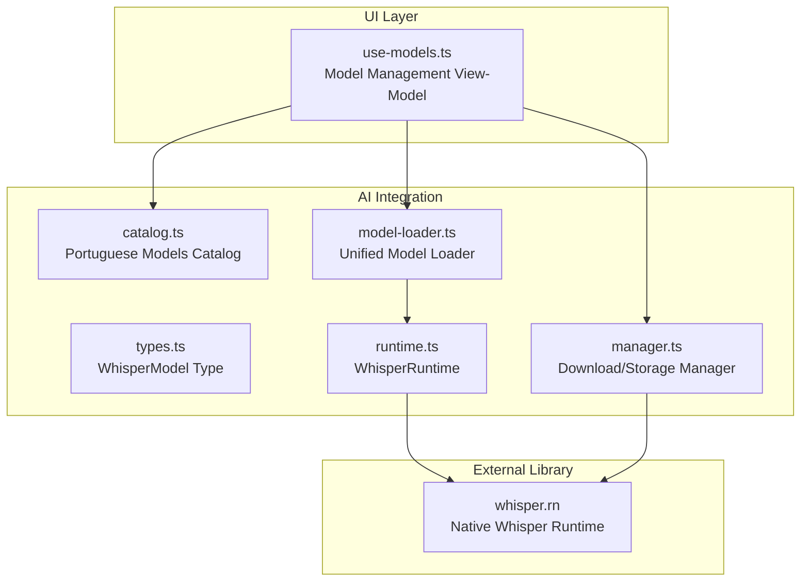
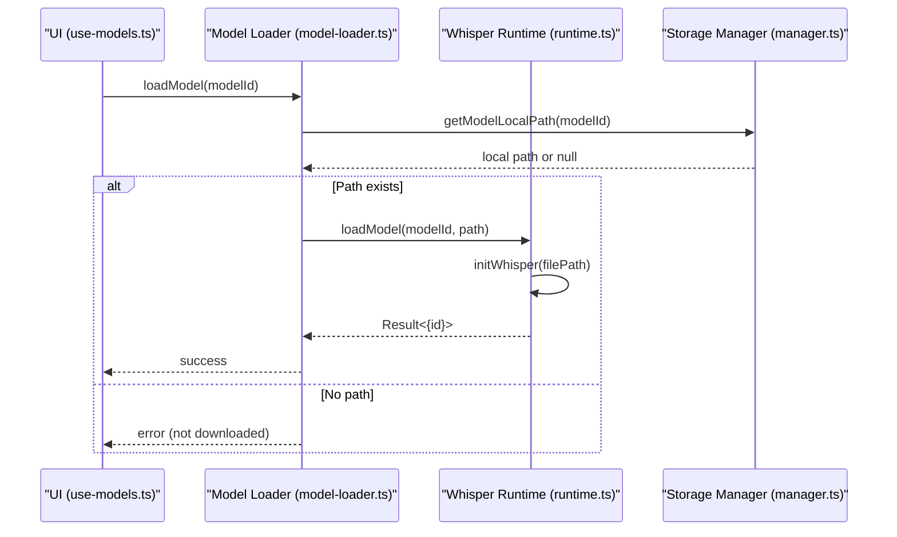
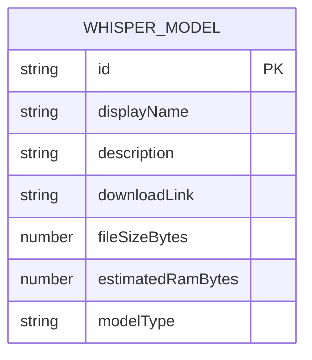
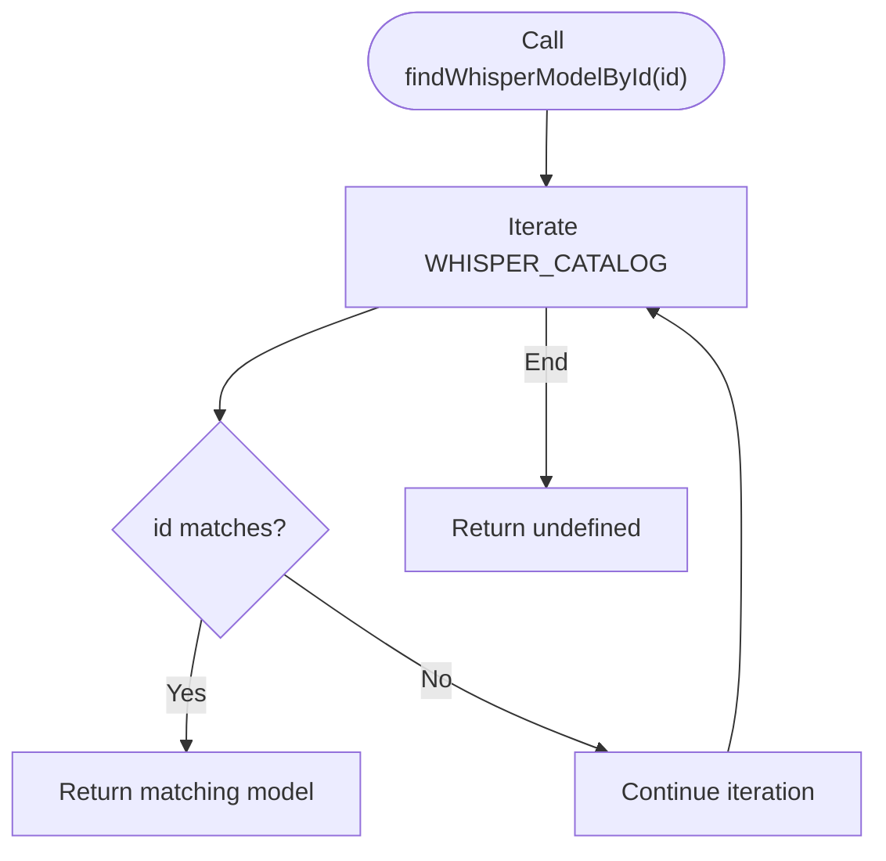
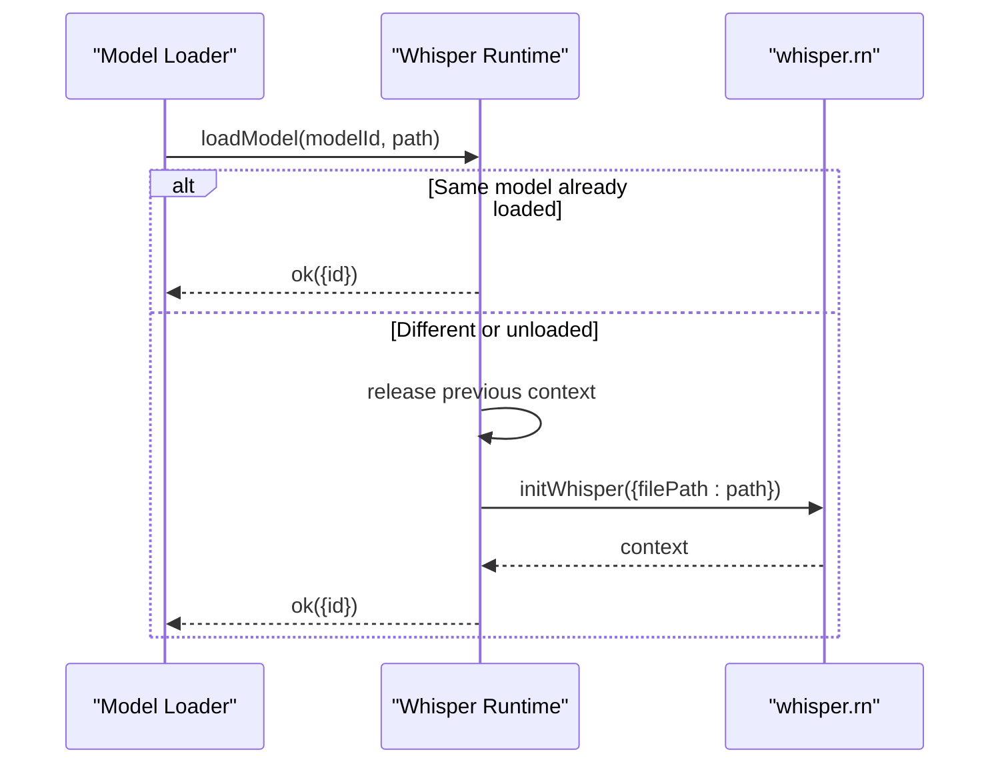
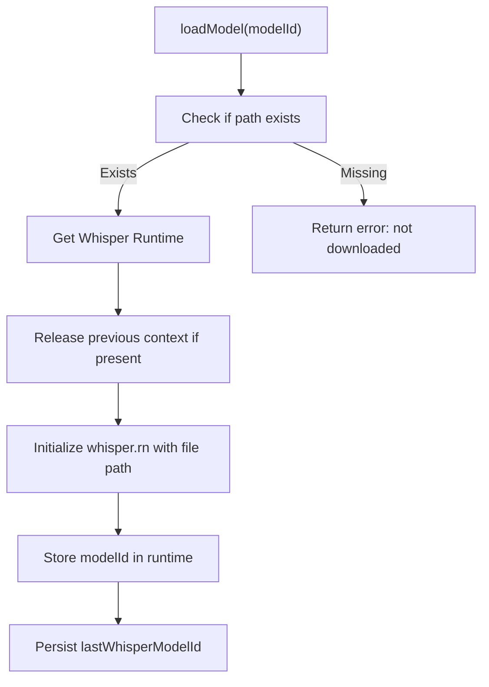
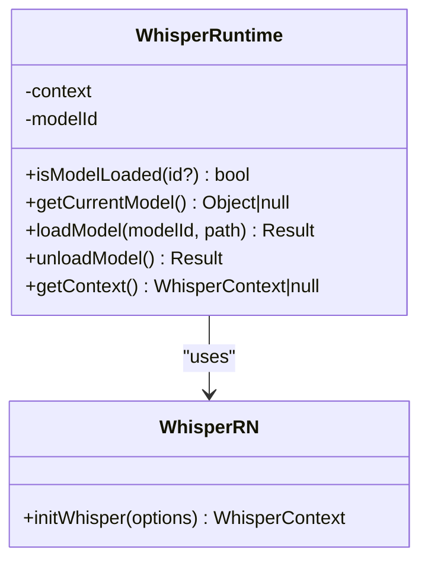
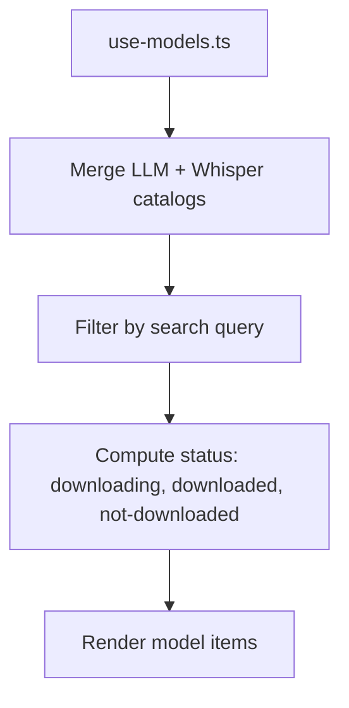
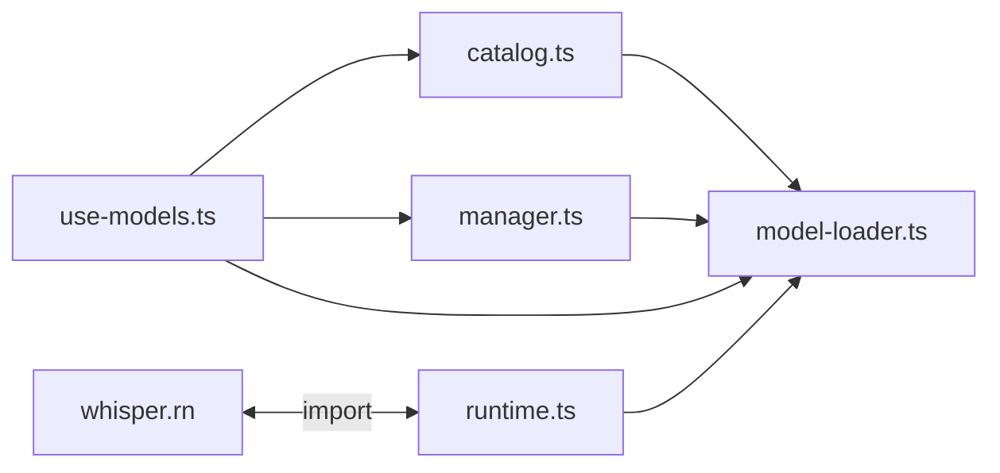

# Whisper Model Integration

<cite>
**Referenced Files in This Document**
- [catalog.ts](file://shared/ai/stt/catalog.ts)
- [types.ts](file://shared/ai/stt/types.ts)
- [runtime.ts](file://shared/ai/stt/runtime.ts)
- [model-loader.ts](file://shared/ai/model-loader.ts)
- [manager.ts](file://shared/ai/manager.ts)
- [use-models.ts](file://features/model-management/view-model/use-models.ts)
- [package.json](file://package.json)
- [catalog.test.ts](file://tests/unit/shared/ai/stt/catalog.test.ts)
- [transcribe.test.ts](file://tests/unit/shared/ai/stt/transcribe.test.ts)
- [realtime.test.ts](file://tests/unit/shared/ai/stt/realtime.test.ts)
</cite>

## Table of Contents
1. [Introduction](#introduction)
2. [Project Structure](#project-structure)
3. [Core Components](#core-components)
4. [Architecture Overview](#architecture-overview)
5. [Detailed Component Analysis](#detailed-component-analysis)
6. [Dependency Analysis](#dependency-analysis)
7. [Performance Considerations](#performance-considerations)
8. [Troubleshooting Guide](#troubleshooting-guide)
9. [Conclusion](#conclusion)

## Introduction
This document describes the Whisper model integration system in My Shadow, focusing on the Portuguese Brazilian language model catalog and runtime integration with the whisper.rn library. It covers model characteristics, discovery and selection, loading mechanisms, initialization sequences, memory management, and the model catalog API. It also documents integration specifics such as model format requirements, quantization levels, and hardware acceleration support, along with troubleshooting guidance for common issues.

## Project Structure
The Whisper integration spans several modules:
- STT catalog and types define the Portuguese Brazilian models and their metadata.
- Runtime encapsulates the whisper.rn integration and lifecycle management.
- Model loader orchestrates model discovery, dispatching to the correct runtime, and persistence of selection.
- Manager handles downloads, storage, and removal of models.
- UI view-model integrates the catalog into the model management screen.

**Diagram sources**
- [use-models.ts:1-208](file://features/model-management/view-model/use-models.ts#L1-L208)
- [catalog.ts:1-41](file://shared/ai/stt/catalog.ts#L1-L41)
- [types.ts:1-29](file://shared/ai/stt/types.ts#L1-L29)
- [runtime.ts:1-99](file://shared/ai/stt/runtime.ts#L1-L99)
- [model-loader.ts:1-172](file://shared/ai/model-loader.ts#L1-L172)
- [manager.ts:1-422](file://shared/ai/manager.ts#L1-L422)
- [package.json:101](file://package.json#L101)

**Section sources**
- [catalog.ts:1-41](file://shared/ai/stt/catalog.ts#L1-L41)
- [types.ts:1-29](file://shared/ai/stt/types.ts#L1-L29)
- [runtime.ts:1-99](file://shared/ai/stt/runtime.ts#L1-L99)
- [model-loader.ts:1-172](file://shared/ai/model-loader.ts#L1-L172)
- [manager.ts:1-422](file://shared/ai/manager.ts#L1-L422)
- [use-models.ts:1-208](file://features/model-management/view-model/use-models.ts#L1-L208)
- [package.json:101](file://package.json#L101)

## Core Components
- Portuguese Brazilian model catalog: Defines three variants (tiny, base, small) with metadata including file sizes, RAM estimates, and download links.
- Model types: Defines the WhisperModel interface used across the system.
- Whisper runtime: Encapsulates model loading/unloading via whisper.rn and exposes current model state.
- Unified model loader: Routes model operations to the appropriate runtime based on model type and persists selection.
- Storage manager: Handles downloads, caching, and local file management for models.

**Section sources**
- [catalog.ts:3-36](file://shared/ai/stt/catalog.ts#L3-L36)
- [types.ts:14-22](file://shared/ai/stt/types.ts#L14-L22)
- [runtime.ts:5-79](file://shared/ai/stt/runtime.ts#L5-L79)
- [model-loader.ts:11-63](file://shared/ai/model-loader.ts#L11-L63)
- [manager.ts:42-46](file://shared/ai/manager.ts#L42-L46)

## Architecture Overview
The system follows a layered design:
- UI layer queries the catalog and manages user actions (download, remove, select).
- Model loader resolves the model identity and dispatches to the correct runtime.
- Runtime initializes whisper.rn contexts and manages lifecycle.
- Manager handles filesystem operations and caching.

**Diagram sources**
- [use-models.ts:97-130](file://features/model-management/view-model/use-models.ts#L97-L130)
- [model-loader.ts:11-63](file://shared/ai/model-loader.ts#L11-L63)
- [runtime.ts:20-54](file://shared/ai/stt/runtime.ts#L20-L54)
- [manager.ts:320-344](file://shared/ai/manager.ts#L320-L344)

## Detailed Component Analysis

### Portuguese Brazilian Model Catalog
The catalog defines three models tailored for Brazilian Portuguese:
- whisper-tiny-pt: smallest footprint, suitable for low-RAM devices.
- whisper-base-pt: balanced speed and accuracy.
- whisper-small-pt: higher accuracy, larger memory requirements.

Each entry includes:
- Identifier and display name
- Description
- Download link
- File size in bytes
- Estimated RAM usage in bytes
- Model type as "bin"

**Diagram sources**
- [types.ts:14-22](file://shared/ai/stt/types.ts#L14-L22)
- [catalog.ts:3-36](file://shared/ai/stt/catalog.ts#L3-L36)

**Section sources**
- [catalog.ts:3-36](file://shared/ai/stt/catalog.ts#L3-L36)
- [types.ts:14-22](file://shared/ai/stt/types.ts#L14-L22)

### Model Discovery and Selection API
- findWhisperModelById: Searches the catalog by identifier and returns the matching model or undefined.
- Catalog immutability: Exported as readonly to prevent accidental mutations.

**Diagram sources**
- [catalog.ts:38-40](file://shared/ai/stt/catalog.ts#L38-L40)

**Section sources**
- [catalog.ts:38-40](file://shared/ai/stt/catalog.ts#L38-L40)
- [catalog.test.ts:62-75](file://tests/unit/shared/ai/stt/catalog.test.ts#L62-L75)

### Model Loading Mechanism and Initialization
- Unified loader routes to whisper runtime when modelType is "bin".
- Runtime ensures single model context, releasing previous contexts before initializing a new one.
- Initialization uses whisper.rn initWhisper with the local file path.

**Diagram sources**
- [model-loader.ts:28-38](file://shared/ai/model-loader.ts#L28-L38)
- [runtime.ts:20-54](file://shared/ai/stt/runtime.ts#L20-L54)

**Section sources**
- [model-loader.ts:28-38](file://shared/ai/model-loader.ts#L28-L38)
- [runtime.ts:20-54](file://shared/ai/stt/runtime.ts#L20-L54)

### Memory Management Strategies
- Estimated RAM usage: Each model entry specifies an estimated RAM footprint to help users choose appropriate models.
- Runtime lifecycle: Explicitly releases the previous context before loading a new model to free memory.
- Auto-load last model: Persists the last selected Whisper model and attempts to reload it automatically.

**Diagram sources**
- [model-loader.ts:11-63](file://shared/ai/model-loader.ts#L11-L63)
- [runtime.ts:29-38](file://shared/ai/stt/runtime.ts#L29-L38)
- [manager.ts:320-344](file://shared/ai/manager.ts#L320-L344)

**Section sources**
- [catalog.ts:10-11](file://shared/ai/stt/catalog.ts#L10-L11)
- [catalog.ts:21-22](file://shared/ai/stt/catalog.ts#L21-L22)
- [catalog.ts:32-33](file://shared/ai/stt/catalog.ts#L32-L33)
- [runtime.ts:29-38](file://shared/ai/stt/runtime.ts#L29-L38)
- [model-loader.ts:55-62](file://shared/ai/model-loader.ts#L55-L62)

### Integration with whisper.rn Library
- Model format: Models are stored as binary files (.bin) and loaded via whisper.rn initWhisper.
- Quantization: Models referenced in the catalog are GGML/BIN format; quantization levels are determined by the upstream model files.
- Hardware acceleration: The integration relies on whisper.rn constants and platform-specific capabilities. Tests verify safe fallbacks when native constants are not immediately available.

**Diagram sources**
- [runtime.ts:5-79](file://shared/ai/stt/runtime.ts#L5-L79)
- [package.json:101](file://package.json#L101)

**Section sources**
- [runtime.ts:3](file://shared/ai/stt/runtime.ts#L3)
- [package.json:101](file://package.json#L101)
- [transcribe.test.ts:15-25](file://tests/unit/shared/ai/stt/transcribe.test.ts#L15-L25)
- [realtime.test.ts:15-25](file://tests/unit/shared/ai/stt/realtime.test.ts#L15-L25)

### Model Catalog API and Metadata Structure
- Model metadata: id, displayName, description, downloadLink, fileSizeBytes, estimatedRamBytes, modelType.
- Catalog functions: WHISPER_CATALOG array and findWhisperModelById lookup.
- UI integration: The view-model merges LLM and Whisper catalogs, filters by search, and computes per-model status.

**Diagram sources**
- [use-models.ts:31-90](file://features/model-management/view-model/use-models.ts#L31-L90)
- [catalog.ts:3-36](file://shared/ai/stt/catalog.ts#L3-L36)

**Section sources**
- [types.ts:14-22](file://shared/ai/stt/types.ts#L14-L22)
- [catalog.ts:3-36](file://shared/ai/stt/catalog.ts#L3-L36)
- [use-models.ts:31-90](file://features/model-management/view-model/use-models.ts#L31-L90)

## Dependency Analysis
- External dependency: whisper.rn is declared in package.json and imported in runtime.ts.
- Internal dependencies: model-loader depends on catalog, manager, and runtime; manager depends on expo-file-system for storage; UI view-model depends on catalog and manager.

**Diagram sources**
- [package.json:101](file://package.json#L101)
- [runtime.ts:3](file://shared/ai/stt/runtime.ts#L3)
- [model-loader.ts:4](file://shared/ai/model-loader.ts#L4)
- [manager.ts:3](file://shared/ai/manager.ts#L3)
- [use-models.ts:6](file://features/model-management/view-model/use-models.ts#L6)

**Section sources**
- [package.json:101](file://package.json#L101)
- [runtime.ts:3](file://shared/ai/stt/runtime.ts#L3)
- [model-loader.ts:4](file://shared/ai/model-loader.ts#L4)
- [manager.ts:3](file://shared/ai/manager.ts#L3)
- [use-models.ts:6](file://features/model-management/view-model/use-models.ts#L6)

## Performance Considerations
- Model selection: Choose whisper-tiny-pt for constrained devices; whisper-small-pt for higher accuracy at the cost of memory.
- Download progress: The manager tracks progress and caches results to minimize filesystem scans.
- Concurrency: Active downloads are deduplicated and tracked to avoid redundant work.
- Memory: Releasing previous contexts before loading a new model prevents memory leaks.

[No sources needed since this section provides general guidance]

## Troubleshooting Guide
Common issues and resolutions:
- Model not found: Occurs when the requested model ID does not exist in either LLM or Whisper catalogs. Verify the ID against the catalogs.
- Not downloaded: The loader requires a local path; ensure the model was downloaded using the model management UI.
- Unsupported model type: Only "bin" models are supported by the Whisper runtime; "gguf" models are handled by the LLM runtime.
- Load error: The runtime wraps initialization errors; check the underlying whisper.rn error message for details.
- Unload error: If unloading fails, the runtime logs the error and returns a failure result.
- Download failures: Network issues or invalid URIs cause download errors; verify connectivity and model links.
- Partial files: The manager cleans up partial files on cancellation or error.
- Auto-load failures: If no last model is persisted, auto-loading returns an error indicating no prior model.

**Section sources**
- [model-loader.ts:16-17](file://shared/ai/model-loader.ts#L16-L17)
- [model-loader.ts:18-19](file://shared/ai/model-loader.ts#L18-L19)
- [model-loader.ts:36-38](file://shared/ai/model-loader.ts#L36-L38)
- [runtime.ts:40-52](file://shared/ai/stt/runtime.ts#L40-L52)
- [manager.ts:174-191](file://shared/ai/manager.ts#L174-L191)
- [manager.ts:218-240](file://shared/ai/manager.ts#L218-L240)
- [model-loader.ts:132-134](file://shared/ai/model-loader.ts#L132-L134)

## Conclusion
The Whisper integration in My Shadow provides a robust, modular system for managing Portuguese Brazilian models. The catalog offers three variants with clear performance and memory trade-offs. The unified loader and runtime ensure reliable initialization and lifecycle management, while the storage manager handles downloads and persistence. The system is designed for reliability with explicit error handling and memory management, and the UI enables easy discovery and selection of models.