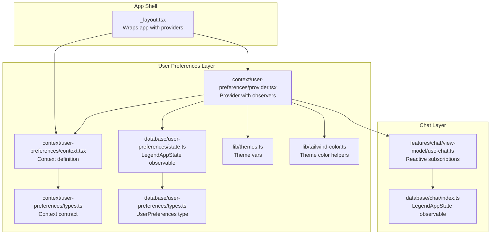
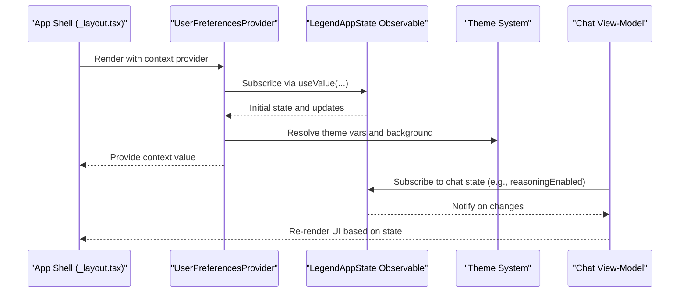
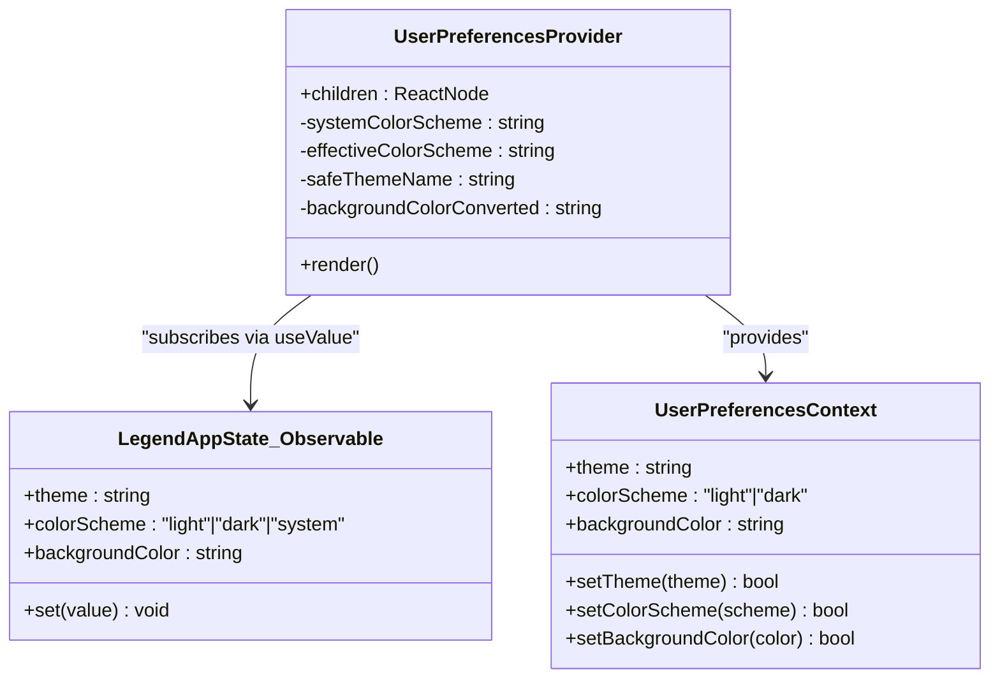
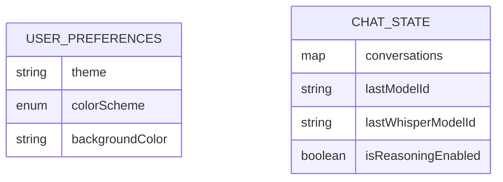
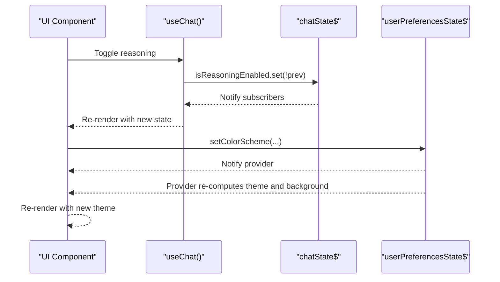
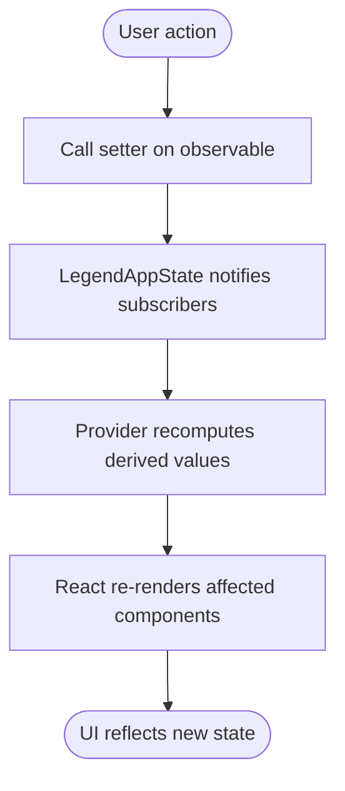
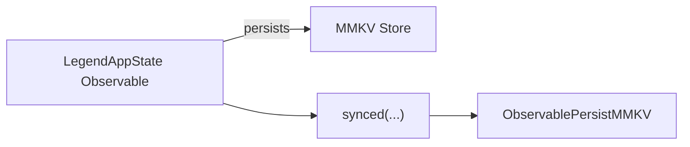
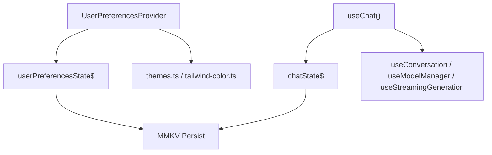

# State Management

<cite>
**Referenced Files in This Document**
- [_layout.tsx](file://app/_layout.tsx)
- [context.tsx](file://context/user-preferences/context.tsx)
- [provider.tsx](file://context/user-preferences/provider.tsx)
- [types.ts](file://context/user-preferences/types.ts)
- [state.ts](file://database/user-preferences/state.ts)
- [types.ts](file://database/user-preferences/types.ts)
- [state.ts](file://database/chat/index.ts)
- [use-chat.ts](file://features/chat/view-model/use-chat.ts)
- [themes.ts](file://lib/themes.ts)
- [tailwind-color.ts](file://lib/tailwind-color.ts)
- [useVoiceInput.ts](file://features/chat/view-model/hooks/useVoiceInput.ts)
- [useVoiceInput.test.ts](file://tests/unit/features/chat/hooks/useVoiceInput.test.ts)
</cite>

## Table of Contents
1. [Introduction](#introduction)
2. [Project Structure](#project-structure)
3. [Core Components](#core-components)
4. [Architecture Overview](#architecture-overview)
5. [Detailed Component Analysis](#detailed-component-analysis)
6. [Dependency Analysis](#dependency-analysis)
7. [Performance Considerations](#performance-considerations)
8. [Troubleshooting Guide](#troubleshooting-guide)
9. [Conclusion](#conclusion)
10. [Appendices](#appendices)

## Introduction
This document explains the reactive state management architecture used in My Shadow. It focuses on the LegendAppState integration via the @legendapp/state library, the observer pattern implementation, and the user preferences context system that centralizes UI and behavioral state across the application. It also documents preference types and state structure, the state provider architecture enabling cross-component communication, reactive patterns that drive automatic UI updates, persistence using MMKV, best practices, performance considerations, debugging techniques, and testing strategies for state management.

## Project Structure
The state management spans three layers:
- Centralized reactive state: LegendAppState observables persisted with MMKV
- Provider and context: React context exposing a small, typed API surface
- Consumers: Views and view-models that subscribe to state and react to changes

**Diagram sources**
- [_layout.tsx:12-50](file://app/_layout.tsx#L12-L50)
- [context.tsx:1-22](file://context/user-preferences/context.tsx#L1-L22)
- [provider.tsx:1-157](file://context/user-preferences/provider.tsx#L1-L157)
- [types.ts:1-15](file://context/user-preferences/types.ts#L1-L15)
- [state.ts:1-22](file://database/user-preferences/state.ts#L1-L22)
- [types.ts:1-8](file://database/user-preferences/types.ts#L1-L8)
- [state.ts:1-30](file://database/chat/index.ts#L1-L30)
- [use-chat.ts:1-371](file://features/chat/view-model/use-chat.ts#L1-L371)
- [themes.ts:1-141](file://lib/themes.ts#L1-L141)
- [tailwind-color.ts:1-250](file://lib/tailwind-color.ts#L1-L250)

**Section sources**
- [_layout.tsx:12-50](file://app/_layout.tsx#L12-L50)
- [context.tsx:1-22](file://context/user-preferences/context.tsx#L1-L22)
- [provider.tsx:1-157](file://context/user-preferences/provider.tsx#L1-L157)
- [types.ts:1-15](file://context/user-preferences/types.ts#L1-L15)
- [state.ts:1-22](file://database/user-preferences/state.ts#L1-L22)
- [types.ts:1-8](file://database/user-preferences/types.ts#L1-L8)
- [state.ts:1-30](file://database/chat/index.ts#L1-L30)
- [use-chat.ts:1-371](file://features/chat/view-model/use-chat.ts#L1-L371)
- [themes.ts:1-141](file://lib/themes.ts#L1-L141)
- [tailwind-color.ts:1-250](file://lib/tailwind-color.ts#L1-L250)

## Core Components
- LegendAppState observables: Reactive stores for user preferences and chat state, persisted with MMKV and synchronized across sessions.
- UserPreferencesProvider: React component that subscribes to the observable, computes derived values (theme, color scheme, background), and exposes a small context API.
- useUserPreferences hook: Typed accessor to the context, enforcing provider usage.
- Theme system: Centralized theme variables and helpers to resolve colors safely.
- Chat view-model: Consumes reactive state to drive UI and behavior, including reasoning toggling and model selection.

**Section sources**
- [state.ts:1-22](file://database/user-preferences/state.ts#L1-L22)
- [provider.tsx:1-157](file://context/user-preferences/provider.tsx#L1-L157)
- [context.tsx:1-22](file://context/user-preferences/context.tsx#L1-L22)
- [types.ts:1-15](file://context/user-preferences/types.ts#L1-L15)
- [themes.ts:1-141](file://lib/themes.ts#L1-L141)
- [tailwind-color.ts:1-250](file://lib/tailwind-color.ts#L1-L250)
- [state.ts:1-30](file://database/chat/index.ts#L1-L30)
- [use-chat.ts:1-371](file://features/chat/view-model/use-chat.ts#L1-L371)

## Architecture Overview
The architecture follows a layered reactive pattern:
- Observables define state and automatically notify subscribers when values change.
- Providers subscribe to observables and derive UI-relevant values.
- Consumers use hooks or direct subscriptions to render UI and react to changes.
- Persistence ensures state survives app restarts and is synchronized across devices if configured.

**Diagram sources**
- [_layout.tsx:12-50](file://app/_layout.tsx#L12-L50)
- [provider.tsx:27-153](file://context/user-preferences/provider.tsx#L27-L153)
- [state.ts:6-19](file://database/user-preferences/state.ts#L6-L19)
- [state.ts:14-28](file://database/chat/index.ts#L14-L28)
- [themes.ts:135-141](file://lib/themes.ts#L135-L141)
- [use-chat.ts:26-371](file://features/chat/view-model/use-chat.ts#L26-L371)

## Detailed Component Analysis

### User Preferences Context System
The user preferences context encapsulates:
- State: theme, colorScheme, backgroundColor
- Actions: setTheme, setColorScheme, setBackgroundColor
- Derived values: effective color scheme, theme vars, computed background color

**Diagram sources**
- [context.tsx:7-14](file://context/user-preferences/context.tsx#L7-L14)
- [provider.tsx:19-153](file://context/user-preferences/provider.tsx#L19-L153)
- [state.ts:6-19](file://database/user-preferences/state.ts#L6-L19)
- [types.ts:1-15](file://context/user-preferences/types.ts#L1-L15)

Key behaviors:
- Effective color scheme resolution accounts for "system" mode and device appearance.
- Background color conversion resolves CSS variables to HSL strings using theme helpers.
- Persisted state updates propagate to UI automatically via reactive subscriptions.

**Section sources**
- [provider.tsx:27-153](file://context/user-preferences/provider.tsx#L27-L153)
- [context.tsx:1-22](file://context/user-preferences/context.tsx#L1-L22)
- [types.ts:1-15](file://context/user-preferences/types.ts#L1-L15)
- [state.ts:1-22](file://database/user-preferences/state.ts#L1-L22)
- [themes.ts:135-141](file://lib/themes.ts#L135-L141)
- [tailwind-color.ts:101-154](file://lib/tailwind-color.ts#L101-L154)

### Preference Types and State Structure
- UserPreferences: theme, colorScheme, backgroundColor
- Chat state: conversations, lastModelId, lastWhisperModelId, isReasoningEnabled
- Both are LegendAppState observables with persisted storage via MMKV

**Diagram sources**
- [types.ts:3-7](file://database/user-preferences/types.ts#L3-L7)
- [state.ts:8-12](file://database/user-preferences/state.ts#L8-L12)
- [state.ts:7-12](file://database/chat/index.ts#L7-L12)

**Section sources**
- [types.ts:1-8](file://database/user-preferences/types.ts#L1-L8)
- [state.ts:1-22](file://database/user-preferences/state.ts#L1-L22)
- [state.ts:1-30](file://database/chat/index.ts#L1-L30)

### State Provider Architecture and Cross-Component Communication
- The provider subscribes to the observable and derives values for rendering and actions.
- Consumers access state via hooks or direct subscriptions, enabling decoupled, reactive updates.
- Example: chat view-model reads reasoningEnabled reactively and toggles it by updating the observable.

**Diagram sources**
- [use-chat.ts:251-254](file://features/chat/view-model/use-chat.ts#L251-L254)
- [state.ts:14-28](file://database/chat/index.ts#L14-L28)
- [provider.tsx:38-99](file://context/user-preferences/provider.tsx#L38-L99)
- [state.ts:6-19](file://database/user-preferences/state.ts#L6-L19)

**Section sources**
- [provider.tsx:1-157](file://context/user-preferences/provider.tsx#L1-L157)
- [use-chat.ts:251-254](file://features/chat/view-model/use-chat.ts#L251-L254)
- [state.ts:1-30](file://database/chat/index.ts#L1-L30)
- [state.ts:1-22](file://database/user-preferences/state.ts#L1-L22)

### Reactive Patterns and Automatic UI Updates
- useValue subscribes to observables and triggers re-renders when values change.
- useMemo and useCallback optimize derived computations and action handlers.
- Direct observable writes (e.g., set) propagate to all subscribers.

**Diagram sources**
- [provider.tsx:27-133](file://context/user-preferences/provider.tsx#L27-L133)
- [use-chat.ts:251-254](file://features/chat/view-model/use-chat.ts#L251-L254)

**Section sources**
- [provider.tsx:27-133](file://context/user-preferences/provider.tsx#L27-L133)
- [use-chat.ts:251-254](file://features/chat/view-model/use-chat.ts#L251-L254)

### Persistent Storage with MMKV
- Observables are wrapped with synced and configured with ObservablePersistMMKV.
- Persistence keys are explicit ("userPreferences", "chat_conversations").
- retrySync enables robust recovery after failures.

**Diagram sources**
- [state.ts:13-17](file://database/user-preferences/state.ts#L13-L17)
- [state.ts:22-26](file://database/chat/index.ts#L22-L26)

**Section sources**
- [state.ts:1-22](file://database/user-preferences/state.ts#L1-L22)
- [state.ts:1-30](file://database/chat/index.ts#L1-L30)

### Relationship Between Preferences and Application Behavior
- Theme and color scheme changes immediately affect UI colors and bars.
- Reasoning toggle influences inference behavior in the chat view-model.
- Background color setting allows dynamic theming of containers and surfaces.

**Section sources**
- [provider.tsx:101-153](file://context/user-preferences/provider.tsx#L101-L153)
- [use-chat.ts:128-172](file://features/chat/view-model/use-chat.ts#L128-L172)

## Dependency Analysis
- Provider depends on:
  - LegendAppState observable for user preferences
  - Theme system for color resolution
  - React Native APIs for color scheme and safe area
- View-models depend on:
  - LegendAppState observables for chat state
  - Hooks for model and streaming orchestration
- Persistence is isolated behind the observable layer.

**Diagram sources**
- [provider.tsx:1-157](file://context/user-preferences/provider.tsx#L1-L157)
- [state.ts:1-22](file://database/user-preferences/state.ts#L1-L22)
- [state.ts:1-30](file://database/chat/index.ts#L1-L30)
- [use-chat.ts:1-371](file://features/chat/view-model/use-chat.ts#L1-L371)
- [themes.ts:1-141](file://lib/themes.ts#L1-L141)
- [tailwind-color.ts:1-250](file://lib/tailwind-color.ts#L1-L250)

**Section sources**
- [provider.tsx:1-157](file://context/user-preferences/provider.tsx#L1-L157)
- [state.ts:1-22](file://database/user-preferences/state.ts#L1-L22)
- [state.ts:1-30](file://database/chat/index.ts#L1-L30)
- [use-chat.ts:1-371](file://features/chat/view-model/use-chat.ts#L1-L371)
- [themes.ts:1-141](file://lib/themes.ts#L1-L141)
- [tailwind-color.ts:1-250](file://lib/tailwind-color.ts#L1-L250)

## Performance Considerations
- Prefer granular subscriptions: subscribe only to fields needed by a component to minimize re-renders.
- Memoize derived values and callbacks to avoid unnecessary recalculations.
- Batch observable updates when possible to reduce notification thrash.
- For large state objects, consider splitting observables to limit propagation scope.
- Use retrySync for persistence to improve resilience during transient failures.

## Troubleshooting Guide
Common issues and resolutions:
- Context misuse: Ensure useUserPreferences is called within UserPreferencesProvider; otherwise, an error is thrown.
- Theme mismatch: Verify theme name exists in themes and that color variables resolve via theme helpers.
- Persistence failures: Check MMKV plugin configuration and logs for write/read errors.
- Excessive re-renders: Confirm useValue subscriptions are scoped and memoized callbacks are used for setters.
- Debugging reactive state:
  - Log observable writes and reads around UI updates.
  - Temporarily disable persistence to isolate sync issues.
  - Inspect effective color scheme derivation for "system" mode.

**Section sources**
- [context.tsx:13-21](file://context/user-preferences/context.tsx#L13-L21)
- [provider.tsx:31-34](file://context/user-preferences/provider.tsx#L31-L34)
- [state.ts:13-17](file://database/user-preferences/state.ts#L13-L17)
- [tailwind-color.ts:139-154](file://lib/tailwind-color.ts#L139-L154)

## Conclusion
My Shadow’s state management leverages LegendAppState for reactive, persistent state with a clean separation of concerns. The user preferences context system provides a centralized, typed API for UI and behavior, while the provider layer transforms observable state into UI-ready values. Reactive subscriptions power automatic UI updates, and MMKV-backed persistence ensures continuity. Following the outlined best practices and debugging techniques will help maintain performance and reliability as the application evolves.

## Appendices

### Testing Strategies for State Management
- Unit tests for pure reducers and state machines (e.g., voice input state machine) to validate logic without React or async overhead.
- Snapshot and integration tests to verify that observable updates propagate to UI components.
- Mock persistence to simulate failure scenarios and verify retrySync behavior.
- Property-based tests for theme and color resolution helpers to ensure robust fallbacks.

**Section sources**
- [useVoiceInput.test.ts:1-43](file://tests/unit/features/chat/hooks/useVoiceInput.test.ts#L1-L43)