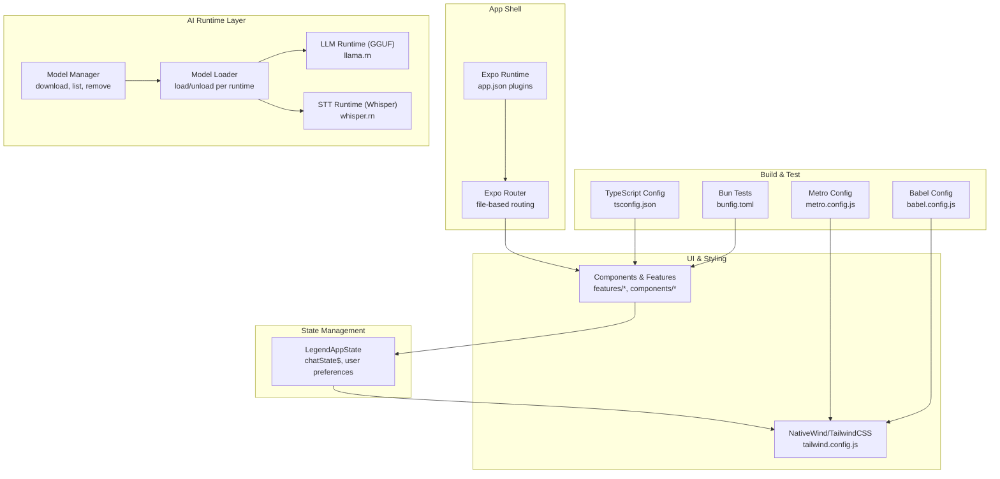
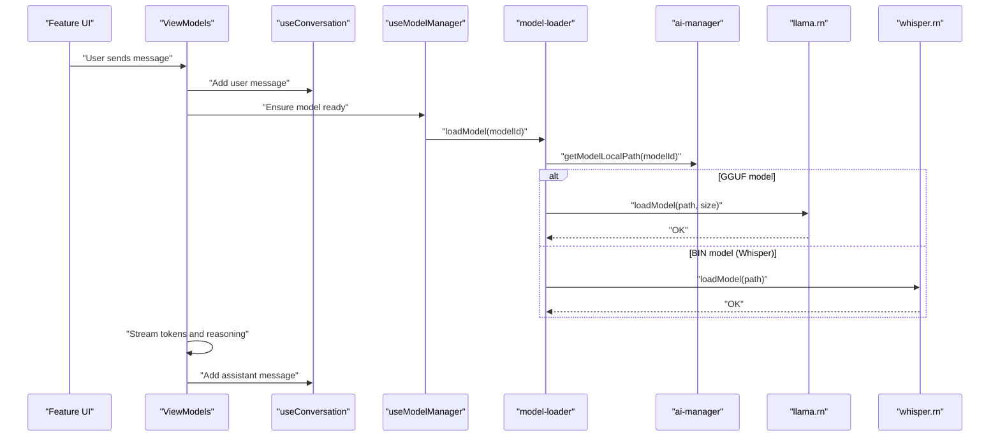
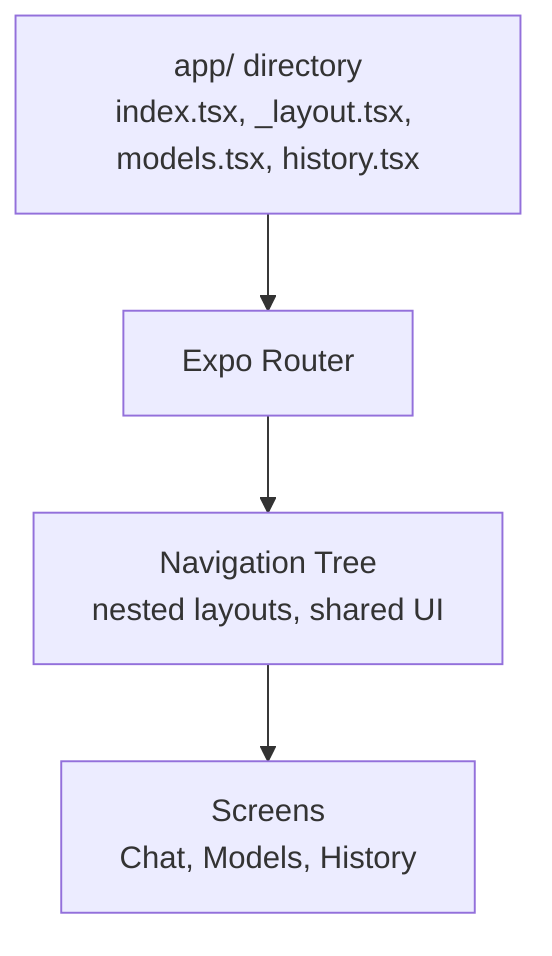
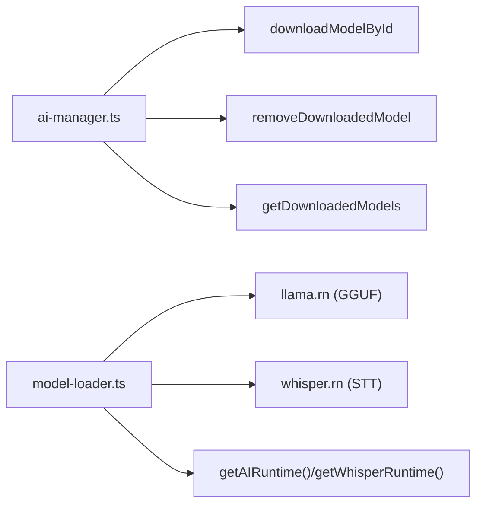
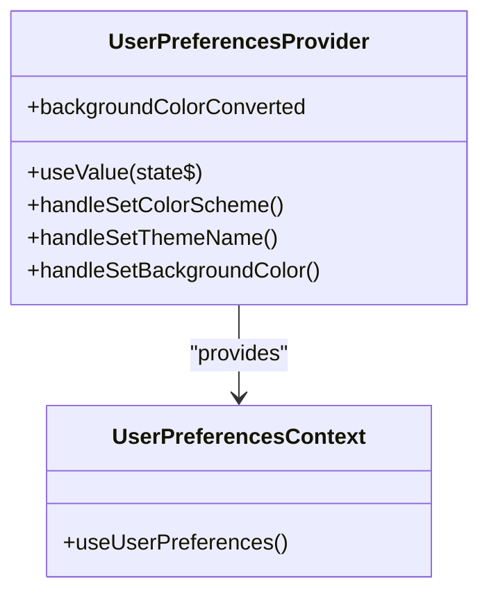
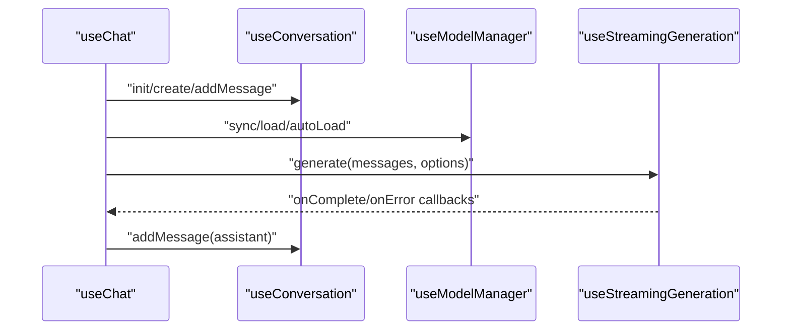
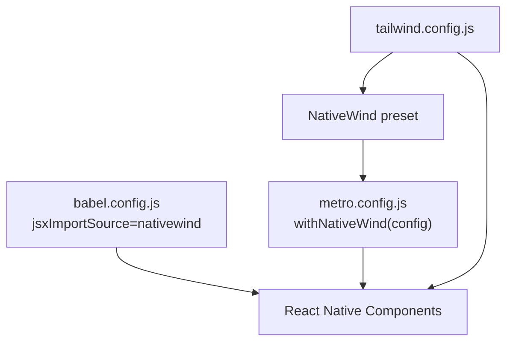
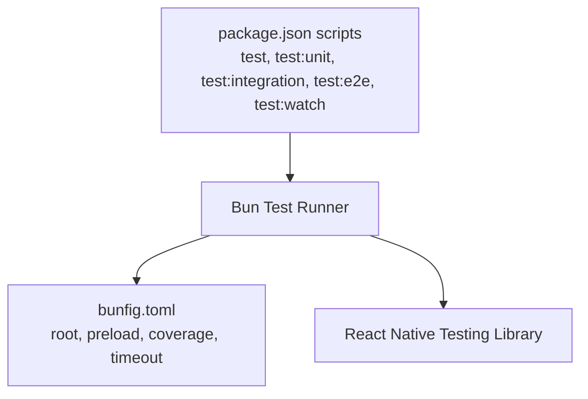
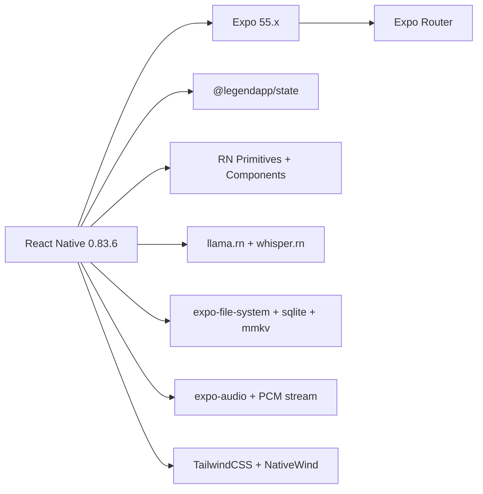

# Technology Stack & Dependencies

<cite>
**Referenced Files in This Document**
- [package.json](file://package.json)
- [app.json](file://app.json)
- [babel.config.js](file://babel.config.js)
- [metro.config.js](file://metro.config.js)
- [tsconfig.json](file://tsconfig.json)
- [tailwind.config.js](file://tailwind.config.js)
- [eas.json](file://eas.json)
- [bunfig.toml](file://bunfig.toml)
- [shared/ai/manager.ts](file://shared/ai/manager.ts)
- [shared/ai/model-loader.ts](file://shared/ai/model-loader.ts)
- [context/user-preferences/provider.tsx](file://context/user-preferences/provider.tsx)
- [context/user-preferences/context.tsx](file://context/user-preferences/context.tsx)
- [features/chat/view-model/use-chat.ts](file://features/chat/view-model/use-chat.ts)
- [features/chat/view-model/hooks/useConversation.ts](file://features/chat/view-model/hooks/useConversation.ts)
- [features/chat/view-model/hooks/useModelManager.ts](file://features/chat/view-model/hooks/useModelManager.ts)
- [features/chat/view-model/hooks/useStreamingGeneration.ts](file://features/chat/view-model/hooks/useStreamingGeneration.ts)
</cite>

## Table of Contents
1. [Introduction](#introduction)
2. [Project Structure](#project-structure)
3. [Core Components](#core-components)
4. [Architecture Overview](#architecture-overview)
5. [Detailed Component Analysis](#detailed-component-analysis)
6. [Dependency Analysis](#dependency-analysis)
7. [Performance Considerations](#performance-considerations)
8. [Troubleshooting Guide](#troubleshooting-guide)
9. [Conclusion](#conclusion)
10. [Appendices](#appendices)

## Introduction
This document describes the technology stack and core dependencies that power My Shadow, focusing on the React Native 0.83.6 + Expo ecosystem, file-based routing via Expo Router, AI runtime integrations for local GGUF inference and speech-to-text, reactive state management with LegendAppState, styling with TailwindCSS and NativeWind, testing with Bun and React Native Testing Library, and build configuration files. It also outlines platform-specific integrations, version compatibility considerations, and the rationale for technology choices aligned with a privacy-first architecture.

## Project Structure
The project follows a feature-based structure with clear separation of concerns:
- Application entry and routing via Expo Router
- AI runtime orchestration for GGUF and Whisper models
- Reactive state management using LegendAppState
- Styling with TailwindCSS and NativeWind
- Testing with Bun and React Native Testing Library
- Build and bundling configurations for Metro and TypeScript

**Diagram sources**
- [app.json:29-69](file://app.json#L29-L69)
- [shared/ai/manager.ts:11-422](file://shared/ai/manager.ts#L11-L422)
- [shared/ai/model-loader.ts:1-172](file://shared/ai/model-loader.ts#L1-L172)
- [tailwind.config.js:1-79](file://tailwind.config.js#L1-L79)
- [metro.config.js:1-19](file://metro.config.js#L1-L19)
- [babel.config.js:1-11](file://babel.config.js#L1-L11)
- [tsconfig.json:1-68](file://tsconfig.json#L1-L68)
- [bunfig.toml:1-8](file://bunfig.toml#L1-L8)

**Section sources**
- [package.json:1-128](file://package.json#L1-L128)
- [app.json:1-82](file://app.json#L1-L82)
- [tsconfig.json:1-68](file://tsconfig.json#L1-L68)
- [metro.config.js:1-19](file://metro.config.js#L1-L19)
- [babel.config.js:1-11](file://babel.config.js#L1-L11)
- [tailwind.config.js:1-79](file://tailwind.config.js#L1-L79)
- [eas.json:1-23](file://eas.json#L1-L23)
- [bunfig.toml:1-8](file://bunfig.toml#L1-L8)

## Core Components
- React Native 0.83.6 and Expo 55.x provide the cross-platform runtime and toolchain.
- Expo Router enables file-system-based routing and typed routes.
- AI runtimes:
  - llama.rn for local GGUF model inference
  - whisper.rn for local speech-to-text processing
- State management:
  - LegendAppState for reactive programming patterns
  - User preferences and chat state persisted in memory with reactive bindings
- Styling:
  - TailwindCSS with NativeWind for responsive UI
- Build and test:
  - Metro bundler with SVG transformer and NativeWind integration
  - Babel with JSXImportSource pointing to nativewind
  - TypeScript strictness and path aliases
  - Bun for fast unit/integration/e2e tests

**Section sources**
- [package.json:19-102](file://package.json#L19-L102)
- [app.json:29-73](file://app.json#L29-L73)
- [shared/ai/manager.ts:1-422](file://shared/ai/manager.ts#L1-L422)
- [shared/ai/model-loader.ts:1-172](file://shared/ai/model-loader.ts#L1-L172)
- [context/user-preferences/provider.tsx:1-157](file://context/user-preferences/provider.tsx#L1-L157)
- [tailwind.config.js:1-79](file://tailwind.config.js#L1-L79)
- [metro.config.js:1-19](file://metro.config.js#L1-L19)
- [babel.config.js:1-11](file://babel.config.js#L1-L11)
- [tsconfig.json:1-68](file://tsconfig.json#L1-L68)
- [bunfig.toml:1-8](file://bunfig.toml#L1-L8)

## Architecture Overview
The application architecture centers around:
- Routing and navigation via Expo Router’s file-system conventions
- AI orchestration abstracted by a manager and loader that coordinate llama.rn and whisper.rn lifecycles
- Reactive state via LegendAppState for chat conversations, user preferences, and model selection
- Styling pipeline powered by TailwindCSS and NativeWind, integrated into Metro and Babel
- Testing orchestrated by Bun with RNTL for React Native components

**Diagram sources**
- [features/chat/view-model/use-chat.ts:101-183](file://features/chat/view-model/use-chat.ts#L101-L183)
- [features/chat/view-model/hooks/useConversation.ts:53-120](file://features/chat/view-model/hooks/useConversation.ts#L53-L120)
- [features/chat/view-model/hooks/useModelManager.ts:32-51](file://features/chat/view-model/hooks/useModelManager.ts#L32-L51)
- [shared/ai/model-loader.ts:11-63](file://shared/ai/model-loader.ts#L11-L63)
- [shared/ai/manager.ts:320-344](file://shared/ai/manager.ts#L320-L344)

## Detailed Component Analysis

### React Native + Expo Ecosystem
- Entry point and routing:
  - The main entry is configured to use Expo Router, enabling file-system routing.
  - Plugins in app.json include expo-router, splash screen, SQLite, secure store, fonts, images, audio, file system, and llama.rn with entitlements and build properties.
- Typed routes and experiments:
  - Typed routes and React Compiler are enabled in app.json experiments.

**Section sources**
- [package.json:3-4](file://package.json#L3-L4)
- [app.json:29-73](file://app.json#L29-L73)

### Expo Router: File-Based Routing and Navigation
- File-system routing:
  - Pages under app/ define routes and nested layouts.
  - The router is configured via app.json plugins and typed routes experiment.
- Navigation primitives:
  - React Navigation packages are present for bottom tabs and elements, complementing file-based routing.

**Diagram sources**
- [app.json:29-30](file://app.json#L29-L30)
- [app.json:70-72](file://app.json#L70-L72)

**Section sources**
- [app.json:29-30](file://app.json#L29-L30)
- [app.json:70-72](file://app.json#L70-L72)

### AI Runtime Dependencies: llama.rn and whisper.rn
- llama.rn:
  - Local GGUF model inference runtime integrated via app.json plugin with entitlements and build properties.
  - Model lifecycle managed by ai-manager and model-loader.
- whisper.rn:
  - Local speech-to-text runtime integrated similarly.
  - Model loading and unloading coordinated with ai-manager and model-loader.

**Diagram sources**
- [shared/ai/manager.ts:59-85](file://shared/ai/manager.ts#L59-L85)
- [shared/ai/manager.ts:349-421](file://shared/ai/manager.ts#L349-L421)
- [shared/ai/model-loader.ts:11-63](file://shared/ai/model-loader.ts#L11-L63)

**Section sources**
- [app.json:47-68](file://app.json#L47-L68)
- [shared/ai/manager.ts:1-422](file://shared/ai/manager.ts#L1-L422)
- [shared/ai/model-loader.ts:1-172](file://shared/ai/model-loader.ts#L1-L172)

### State Management with LegendAppState
- Reactive patterns:
  - chatState$ and user-preferences state$ drive UI updates reactively.
  - useValue binds reactive state to components.
- Theme and preferences:
  - Provider computes effective color scheme and theme, applies background color, and exposes setters.

**Diagram sources**
- [context/user-preferences/provider.tsx:27-134](file://context/user-preferences/provider.tsx#L27-L134)
- [context/user-preferences/context.tsx:1-22](file://context/user-preferences/context.tsx#L1-L22)

**Section sources**
- [context/user-preferences/provider.tsx:1-157](file://context/user-preferences/provider.tsx#L1-L157)
- [context/user-preferences/context.tsx:1-22](file://context/user-preferences/context.tsx#L1-L22)

### Chat State Machine and ViewModel Composition
- Conversation lifecycle:
  - useConversation manages creation, message addition, error tagging, and last-assistant removal.
- Model management:
  - useModelManager handles readiness, loading/unloading, auto-load, and availability refresh.
- Streaming generation:
  - useStreamingGeneration orchestrates token streaming, reasoning chunks, tool loop execution, and cancellation.
- Chat orchestration:
  - useChat wires together conversation, model, and streaming to produce final assistant messages.

**Diagram sources**
- [features/chat/view-model/use-chat.ts:85-183](file://features/chat/view-model/use-chat.ts#L85-L183)
- [features/chat/view-model/hooks/useConversation.ts:16-120](file://features/chat/view-model/hooks/useConversation.ts#L16-L120)
- [features/chat/view-model/hooks/useModelManager.ts:22-170](file://features/chat/view-model/hooks/useModelManager.ts#L22-L170)
- [features/chat/view-model/hooks/useStreamingGeneration.ts:52-146](file://features/chat/view-model/hooks/useStreamingGeneration.ts#L52-L146)

**Section sources**
- [features/chat/view-model/use-chat.ts:1-371](file://features/chat/view-model/use-chat.ts#L1-L371)
- [features/chat/view-model/hooks/useConversation.ts:1-236](file://features/chat/view-model/hooks/useConversation.ts#L1-L236)
- [features/chat/view-model/hooks/useModelManager.ts:1-217](file://features/chat/view-model/hooks/useModelManager.ts#L1-L217)
- [features/chat/view-model/hooks/useStreamingGeneration.ts:1-275](file://features/chat/view-model/hooks/useStreamingGeneration.ts#L1-L275)

### Styling System: TailwindCSS + NativeWind
- Tailwind configuration:
  - Dark mode via class strategy, content globs for app, components, features, and context.
  - Preset from nativewind and animations plugin.
- Metro integration:
  - withNativeWind wrapper applied to default Expo config with global CSS input and inlineRem.
- Babel integration:
  - babel-preset-expo with jsxImportSource set to nativewind.

**Diagram sources**
- [tailwind.config.js:1-79](file://tailwind.config.js#L1-L79)
- [metro.config.js:15-18](file://metro.config.js#L15-L18)
- [babel.config.js:6-7](file://babel.config.js#L6-L7)

**Section sources**
- [tailwind.config.js:1-79](file://tailwind.config.js#L1-L79)
- [metro.config.js:1-19](file://metro.config.js#L1-L19)
- [babel.config.js:1-11](file://babel.config.js#L1-L11)

### Testing Infrastructure: Bun + React Native Testing Library
- Test runner:
  - Bun scripts for unit, integration, and e2e tests with watch mode.
  - Bun configuration sets root, preload setup, coverage, timeout, bail, and coverage directory.
- Test setup:
  - tests/setup.ts is preloaded for all tests.

**Diagram sources**
- [package.json:13-17](file://package.json#L13-L17)
- [bunfig.toml:1-8](file://bunfig.toml#L1-L8)

**Section sources**
- [package.json:13-17](file://package.json#L13-L17)
- [bunfig.toml:1-8](file://bunfig.toml#L1-L8)

### Build Configuration Files
- Metro:
  - Extends Expo defaults, registers SVG transformer, enables package exports, and integrates with NativeWind.
- Babel:
  - Uses babel-preset-expo with nativewind JSXImportSource.
- TypeScript:
  - Extends Expo base, strict compiler options, path aliases, bundler module resolution, JSON module resolution, and type roots.

**Section sources**
- [metro.config.js:1-19](file://metro.config.js#L1-L19)
- [babel.config.js:1-11](file://babel.config.js#L1-L11)
- [tsconfig.json:1-68](file://tsconfig.json#L1-L68)

## Dependency Analysis
- Core runtime:
  - React 19.2.0, React Native 0.83.6, Expo 55.x
- Navigation and UI:
  - React Navigation packages and RN primitives for UI controls
- AI runtimes:
  - llama.rn for GGUF, whisper.rn for STT
- State management:
  - @legendapp/state and @legendapp/list for reactive state
- Styling:
  - nativewind, tailwindcss, clsx, class-variance-authority
- Audio and media:
  - @fugood/react-native-audio-pcm-stream, expo-audio, react-native-svg
- Storage and persistence:
  - expo-file-system, expo-sqlite, react-native-mmkv
- Platform integrations:
  - expo-secure-store, expo-constants, expo-haptics, expo-web-browser, expo-linking
- Build and dev:
  - TypeScript, ESLint, React Native Builder Bob, SVG transformer

**Diagram sources**
- [package.json:19-102](file://package.json#L19-L102)
- [app.json:29-69](file://app.json#L29-L69)

**Section sources**
- [package.json:19-102](file://package.json#L19-L102)
- [app.json:29-69](file://app.json#L29-L69)

## Performance Considerations
- Streaming generation:
  - Token streaming with incremental UI updates reduces perceived latency.
  - Abort controller ensures prompt cancellation and cleanup.
- Model lifecycle:
  - Short-lived cache for downloaded models and deduplicated downloads prevent redundant work.
  - Auto-load last model speeds startup after app relaunch.
- Build pipeline:
  - Metro with SVG transformer and NativeWind improves bundling performance.
  - Babel with nativewind JSXImportSource optimizes transform overhead.
- Memory and CPU:
  - llama.rn and whisper.rn are native modules; ensure device capability checks and avoid excessive concurrency.

[No sources needed since this section provides general guidance]

## Troubleshooting Guide
- Model loading failures:
  - Verify model path exists locally and runtime reports success; check logs for detailed errors.
- Download interruptions:
  - Use cancelDownload to abort in-flight downloads and clean partial files.
- Streaming errors:
  - Inspect onError callbacks and partial content/reasoning to recover gracefully.
- Test failures:
  - Use Bun test scripts and ensure tests/setup.ts is executed; review coverage and timeouts.

**Section sources**
- [shared/ai/manager.ts:218-240](file://shared/ai/manager.ts#L218-L240)
- [shared/ai/model-loader.ts:40-57](file://shared/ai/model-loader.ts#L40-L57)
- [features/chat/view-model/hooks/useStreamingGeneration.ts:105-118](file://features/chat/view-model/hooks/useStreamingGeneration.ts#L105-L118)
- [bunfig.toml:1-8](file://bunfig.toml#L1-L8)

## Conclusion
My Shadow leverages a modern, privacy-focused stack built on React Native 0.83.6 and Expo 55.x with file-based routing via Expo Router. AI capabilities are powered by local runtimes (llama.rn and whisper.rn), orchestrated by a robust manager and loader. Reactive state management with LegendAppState simplifies UI synchronization, while TailwindCSS and NativeWind deliver responsive styling. The build and test toolchain uses Metro, Babel, TypeScript, and Bun for efficient development and quality assurance.

[No sources needed since this section summarizes without analyzing specific files]

## Appendices

### Version Compatibility Matrix
- React Native: 0.83.6
- Expo: 55.x
- Expo Router: ~55.0.14
- llama.rn: ^0.12.0-rc.9
- whisper.rn: ^0.5.5
- TailwindCSS: ^3.4.19
- NativeWind: ^4.2.3
- Bun: 1.0.0 (as per EAS build config)
- TypeScript: ~5.9.3

**Section sources**
- [package.json:81-83](file://package.json#L81-L83)
- [package.json:69-70](file://package.json#L69-L70)
- [package.json:78-101](file://package.json#L78-L101)
- [tailwind.config.js:1-79](file://tailwind.config.js#L1-L79)
- [metro.config.js:1-19](file://metro.config.js#L1-L19)
- [eas.json:8-8](file://eas.json#L8-L8)
- [tsconfig.json:115-115](file://tsconfig.json#L115-L115)

### Upgrade Considerations
- Align React Native and Expo versions to maintain compatibility with plugins and runtimes.
- Validate llama.rn and whisper.rn compatibility with new RN versions and native build properties.
- Review Metro and Babel presets for breaking changes; ensure nativewind integration remains intact.
- Update TypeScript strictness and path aliases carefully to avoid build regressions.
- Re-test AI model loading and streaming flows after upgrades.

[No sources needed since this section provides general guidance]