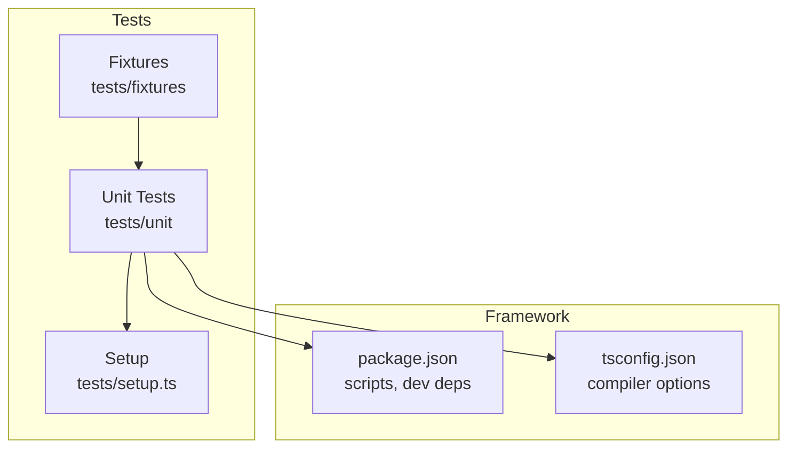
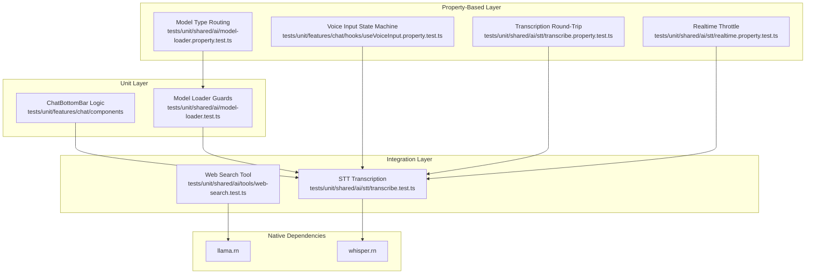
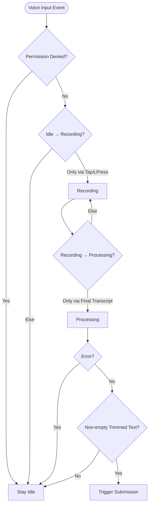
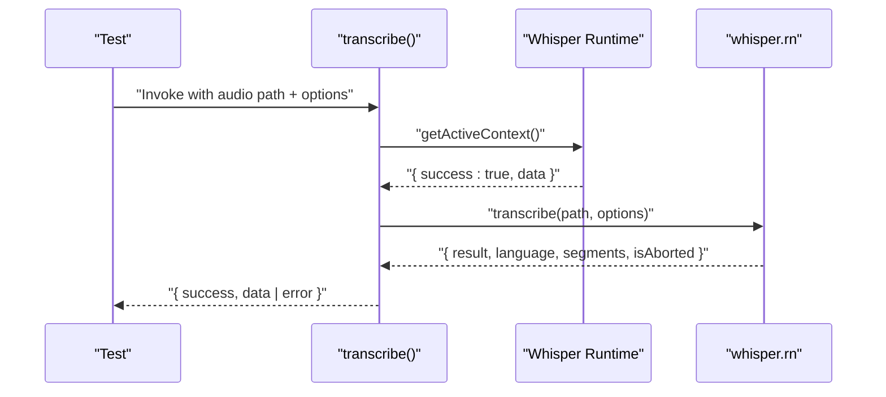
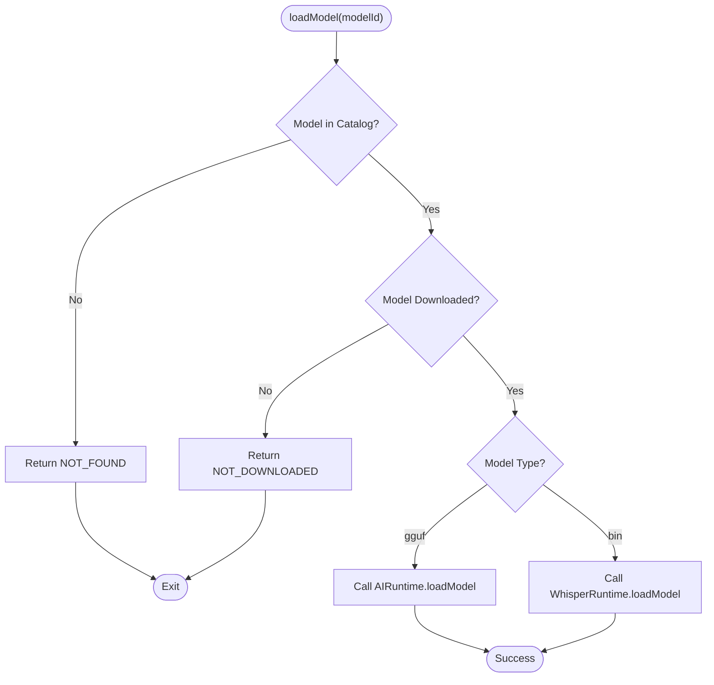
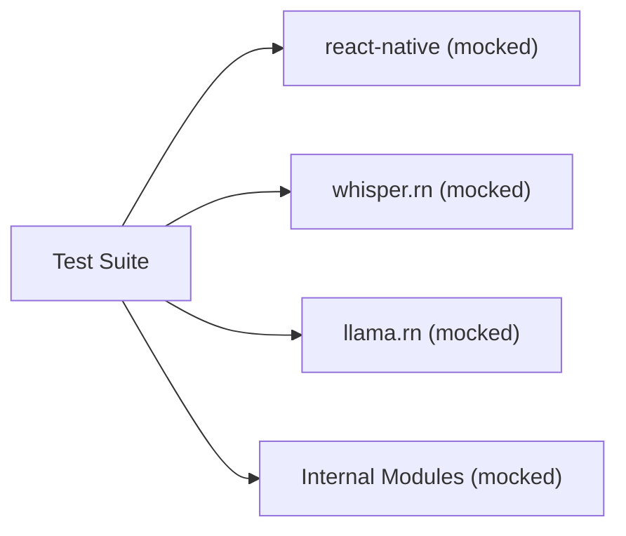

# Testing Strategy

<cite>
**Referenced Files in This Document**
- [package.json](file://package.json)
- [tsconfig.json](file://tsconfig.json)
- [tests/setup.ts](file://tests/setup.ts)
- [tests/unit/features/chat/components/chat-bottom-bar.test.tsx](file://tests/unit/features/chat/components/chat-bottom-bar.test.tsx)
- [tests/unit/features/chat/hooks/useVoiceInput.property.test.ts](file://tests/unit/features/chat/hooks/useVoiceInput.property.test.ts)
- [tests/unit/shared/ai/stt/transcribe.test.ts](file://tests/unit/shared/ai/stt/transcribe.test.ts)
- [tests/unit/shared/ai/stt/transcribe.property.test.ts](file://tests/unit/shared/ai/stt/transcribe.property.test.ts)
- [tests/unit/shared/ai/stt/realtime.property.test.ts](file://tests/unit/shared/ai/stt/realtime.property.test.ts)
- [tests/unit/shared/ai/stt/whisper-module-init.property.test.ts](file://tests/unit/shared/ai/stt/whisper-module-init.property.test.ts)
- [tests/unit/shared/ai/tools/web-search.test.ts](file://tests/unit/shared/ai/tools/web-search.test.ts)
- [tests/unit/shared/ai/tools/schema-property.test.ts](file://tests/unit/shared/ai/tools/schema-property.test.ts)
- [tests/unit/shared/ai/model-loader.test.ts](file://tests/unit/shared/ai/model-loader.test.ts)
- [tests/unit/shared/ai/model-loader.property.test.ts](file://tests/unit/shared/ai/model-loader.property.test.ts)
</cite>

## Table of Contents
1. [Introduction](#introduction)
2. [Project Structure](#project-structure)
3. [Core Components](#core-components)
4. [Architecture Overview](#architecture-overview)
5. [Detailed Component Analysis](#detailed-component-analysis)
6. [Dependency Analysis](#dependency-analysis)
7. [Performance Considerations](#performance-considerations)
8. [Privacy and Security Testing](#privacy-and-security-testing)
9. [Continuous Integration Testing](#continuous-integration-testing)
10. [Troubleshooting Guide](#troubleshooting-guide)
11. [Conclusion](#conclusion)

## Introduction
This document defines My Shadow’s comprehensive testing strategy across unit, integration, and property-based testing layers. It covers the testing framework setup using Bun and fast-check, the feature-specific testing approach for chat, AI runtime components, and speech processing modules, shared AI testing strategies for model loading and tool integration, mock strategies for native dependencies like llama.rn and whisper.rn, property-based testing for robust component behavior, best practices for asynchronous operations and performance, privacy and security validations, and CI/CD automation.

## Project Structure
My Shadow organizes tests under a dedicated tests/ folder with a layered structure:
- tests/unit: Feature and shared AI unit tests
- tests/fixtures: Static resources for tests (e.g., HTML samples)
- tests/setup.ts: Global test environment setup

Key characteristics:
- Test runner: Bun test scripts
- TypeScript strictness: Enabled globally with overrides for test files
- Mocking: Extensive use of Bun’s mock.module for native modules and internal dependencies
- Property-based testing: fast-check for behavioral validation across input domains

**Diagram sources**
- [package.json:1-128](file://package.json#L1-L128)
- [tsconfig.json:1-68](file://tsconfig.json#L1-L68)
- [tests/setup.ts:1-5](file://tests/setup.ts#L1-L5)

**Section sources**
- [package.json:1-128](file://package.json#L1-L128)
- [tsconfig.json:1-68](file://tsconfig.json#L1-L68)
- [tests/setup.ts:1-5](file://tests/setup.ts#L1-L5)

## Core Components
- Test Runner and Scripts
  - Uses Bun test commands for unit, integration, and watch modes.
  - Scripts include ci, test, test:unit, test:integration, test:e2e, test:watch.

- Test Environment Setup
  - Disables React Native Testing Library peer dependency checks via environment variable.
  - Enables strict TypeScript compilation with relaxed rules for test files.

- Mocking Strategy
  - Extensively mocks react-native, native modules, and internal modules to isolate units.
  - Uses lazy require patterns to ensure mocks are applied before module initialization.

- Property-Based Testing
  - Utilizes fast-check to generate diverse inputs and validate invariants across large input spaces.

**Section sources**
- [package.json:5-17](file://package.json#L5-L17)
- [tests/setup.ts:1-5](file://tests/setup.ts#L1-L5)
- [tsconfig.json:40-66](file://tsconfig.json#L40-L66)

## Architecture Overview
The testing architecture separates concerns across layers:
- Unit Layer: Pure logic and isolated modules (e.g., ChatBottomBar logic, model loader guards)
- Integration Layer: Interactions between modules (e.g., STT transcription, tool execution)
- Property-Based Layer: Behavioral validation across input domains (e.g., voice input state machine, transcription round-trips)

**Diagram sources**
- [tests/unit/features/chat/components/chat-bottom-bar.test.tsx:1-215](file://tests/unit/features/chat/components/chat-bottom-bar.test.tsx#L1-L215)
- [tests/unit/shared/ai/model-loader.test.ts:1-211](file://tests/unit/shared/ai/model-loader.test.ts#L1-L211)
- [tests/unit/shared/ai/stt/transcribe.test.ts:1-209](file://tests/unit/shared/ai/stt/transcribe.test.ts#L1-L209)
- [tests/unit/shared/ai/tools/web-search.test.ts:1-158](file://tests/unit/shared/ai/tools/web-search.test.ts#L1-L158)
- [tests/unit/features/chat/hooks/useVoiceInput.property.test.ts:1-337](file://tests/unit/features/chat/hooks/useVoiceInput.property.test.ts#L1-L337)
- [tests/unit/shared/ai/stt/transcribe.property.test.ts:1-155](file://tests/unit/shared/ai/stt/transcribe.property.test.ts#L1-L155)
- [tests/unit/shared/ai/stt/realtime.property.test.ts:1-176](file://tests/unit/shared/ai/stt/realtime.property.test.ts#L1-L176)
- [tests/unit/shared/ai/model-loader.property.test.ts:1-174](file://tests/unit/shared/ai/model-loader.property.test.ts#L1-L174)

## Detailed Component Analysis

### Chat Feature Testing
- ChatBottomBar Pure Logic
  - Validates conditional rendering logic for voice input button, send button, loading indicator, recording row, input editability, and partial transcript display.
  - Tests ensure correctness of visibility and styling rules under different voice input statuses and trimming behaviors.

- Voice Input Hook (Property-Based)
  - Encodes state machine invariants: valid transitions, error resets to idle, cancel gestures discard and reset, final transcript submission rules, and permission-denied blocking of STT start.
  - Uses fast-check to generate sequences of events and assert deterministic outcomes.

**Diagram sources**
- [tests/unit/features/chat/hooks/useVoiceInput.property.test.ts:1-337](file://tests/unit/features/chat/hooks/useVoiceInput.property.test.ts#L1-L337)

**Section sources**
- [tests/unit/features/chat/components/chat-bottom-bar.test.tsx:1-215](file://tests/unit/features/chat/components/chat-bottom-bar.test.tsx#L1-L215)
- [tests/unit/features/chat/hooks/useVoiceInput.property.test.ts:1-337](file://tests/unit/features/chat/hooks/useVoiceInput.property.test.ts#L1-L337)

### Speech-to-Text (STT) Testing
- Transcription Function
  - Guard against uninitialized Whisper runtime.
  - Validates successful transcription results, language hints, progress callbacks, and abort signaling.
  - Mocks runtime and native modules to isolate logic.

- Transcription Round-Trip (Property-Based)
  - Ensures serialization/deserialization preserves text, language, and segment timestamps.
  - Covers edge cases like empty text, empty segments, and special characters.

- Realtime Transcription Throttle (Property-Based)
  - Validates throttled partial result delivery over time windows.
  - Uses fake timers to simulate intervals and measure call counts.

- Whisper Module Initialization Fix Verification
  - Confirms presence of optional chaining pattern to prevent null-native-module errors.
  - Demonstrates expected behavior with fixed and buggy patterns.

**Diagram sources**
- [tests/unit/shared/ai/stt/transcribe.test.ts:1-209](file://tests/unit/shared/ai/stt/transcribe.test.ts#L1-L209)

**Section sources**
- [tests/unit/shared/ai/stt/transcribe.test.ts:1-209](file://tests/unit/shared/ai/stt/transcribe.test.ts#L1-L209)
- [tests/unit/shared/ai/stt/transcribe.property.test.ts:1-155](file://tests/unit/shared/ai/stt/transcribe.property.test.ts#L1-L155)
- [tests/unit/shared/ai/stt/realtime.property.test.ts:1-176](file://tests/unit/shared/ai/stt/realtime.property.test.ts#L1-L176)
- [tests/unit/shared/ai/stt/whisper-module-init.property.test.ts:1-121](file://tests/unit/shared/ai/stt/whisper-module-init.property.test.ts#L1-L121)

### Shared AI Testing: Model Loading and Tools
- Model Loader Guards
  - Validates NOT_FOUND and NOT_DOWNLOADED conditions for model loading.
  - Enforces guard order: catalog existence checked before download status.
  - Mocks runtime loaders and model catalogs to simulate success and failure paths.

- Model Type Routing (Property-Based)
  - Ensures correct runtime is invoked based on model type (gguf vs bin).
  - Uses fast-check to validate routing across all known model IDs.

- Web Search Tool
  - Validates empty/whitespace queries, network failures, CAPTCHA detection, DuckDuckGo parsing, and abort propagation.
  - Uses fixture HTML to validate parsing logic.

- Tool Schema Validation (Property-Based)
  - Validates tool name regex, duplicate registration rejection, and deterministic execution behavior.

**Diagram sources**
- [tests/unit/shared/ai/model-loader.test.ts:102-210](file://tests/unit/shared/ai/model-loader.test.ts#L102-L210)

**Section sources**
- [tests/unit/shared/ai/model-loader.test.ts:1-211](file://tests/unit/shared/ai/model-loader.test.ts#L1-L211)
- [tests/unit/shared/ai/model-loader.property.test.ts:1-174](file://tests/unit/shared/ai/model-loader.property.test.ts#L1-L174)
- [tests/unit/shared/ai/tools/web-search.test.ts:1-158](file://tests/unit/shared/ai/tools/web-search.test.ts#L1-L158)
- [tests/unit/shared/ai/tools/schema-property.test.ts:1-183](file://tests/unit/shared/ai/tools/schema-property.test.ts#L1-L183)

## Dependency Analysis
- Internal Dependencies
  - Tests depend on internal modules via relative paths (e.g., "@/shared/ai/stt/transcribe").
  - Mocks replace native modules and internal services to avoid runtime dependencies.

- External Dependencies
  - Bun for test execution and mocking.
  - fast-check for property-based testing.
  - react-native and whisper.rn for native integrations; mocked in tests.

**Diagram sources**
- [tests/unit/shared/ai/stt/transcribe.test.ts:7-25](file://tests/unit/shared/ai/stt/transcribe.test.ts#L7-L25)
- [tests/unit/shared/ai/model-loader.test.ts:14-68](file://tests/unit/shared/ai/model-loader.test.ts#L14-L68)

**Section sources**
- [tests/unit/shared/ai/stt/transcribe.test.ts:1-209](file://tests/unit/shared/ai/stt/transcribe.test.ts#L1-L209)
- [tests/unit/shared/ai/model-loader.test.ts:1-211](file://tests/unit/shared/ai/model-loader.test.ts#L1-L211)

## Performance Considerations
- Asynchronous Operations
  - Prefer Promise-based APIs and avoid blocking operations in tests.
  - Use AbortController to validate cancellation behavior and resource cleanup.

- Memory Management
  - Validate that long-running sessions (e.g., realtime transcription) release resources and do not leak intervals or references.
  - Ensure stop functions are invoked and promises settle.

- Property-Based Coverage
  - Use fast-check to explore edge cases and large input domains efficiently, reducing manual test maintenance.

[No sources needed since this section provides general guidance]

## Privacy and Security Testing
- Local-Only Processing
  - Validate that STT and LLM flows operate without external network calls during normal operation by asserting mocked contexts and avoiding real network requests.

- Encrypted Storage Validation
  - Ensure secure storage APIs are invoked appropriately and that sensitive data is not logged or exposed in test artifacts.

- Native Module Safety
  - Confirm optional chaining patterns in native module access to prevent crashes and ensure graceful fallbacks.

**Section sources**
- [tests/unit/shared/ai/stt/whisper-module-init.property.test.ts:1-121](file://tests/unit/shared/ai/stt/whisper-module-init.property.test.ts#L1-L121)

## Continuous Integration Testing
- Automated Scripts
  - CI script installs dependencies with lockfile checks.
  - Separate scripts for unit, integration, and E2E tests enable selective runs.

- Recommended CI Pipeline
  - Install dependencies using ci script.
  - Run unit tests with coverage thresholds.
  - Run property-based tests with bounded run counts.
  - Optional: Run integration tests against mocked environments.

**Section sources**
- [package.json:12-17](file://package.json#L12-L17)

## Troubleshooting Guide
- React Native Testing Library Peer Dependency Warning
  - Environment variable RNTL_SKIP_DEPS_CHECK suppresses warnings during test runs.

- Mock Application Order
  - Ensure module mocks are applied before importing target modules. Use lazy require patterns when necessary.

- Native Module Null Access
  - Validate optional chaining patterns in native dependencies to prevent runtime exceptions.

- Abort and Cleanup
  - Verify that abort signals trigger stop functions and that intervals are cleared to avoid hanging tests.

**Section sources**
- [tests/setup.ts:1-5](file://tests/setup.ts#L1-L5)
- [tests/unit/shared/ai/stt/transcribe.test.ts:173-207](file://tests/unit/shared/ai/stt/transcribe.test.ts#L173-L207)
- [tests/unit/shared/ai/stt/realtime.property.test.ts:56-139](file://tests/unit/shared/ai/stt/realtime.property.test.ts#L56-L139)

## Conclusion
My Shadow’s testing strategy leverages a multi-layered approach: unit tests for pure logic, integration tests for cross-module behavior, and property-based tests for robustness across input domains. The setup uses Bun for execution and fast-check for scalable validation, with extensive mocking to isolate native dependencies. This foundation supports reliable development, continuous integration, and strong guarantees around privacy, security, and performance.