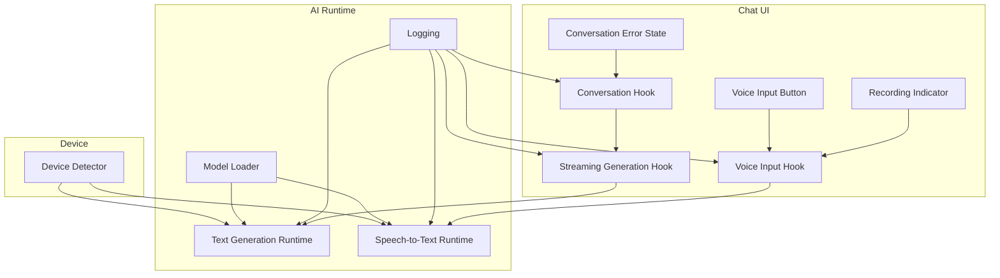
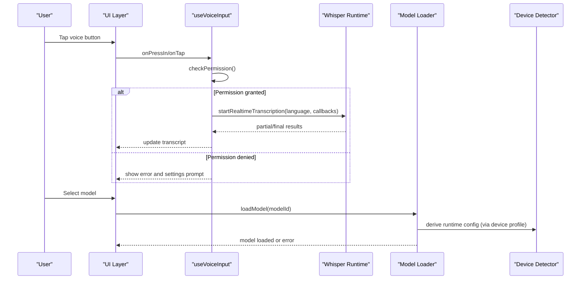
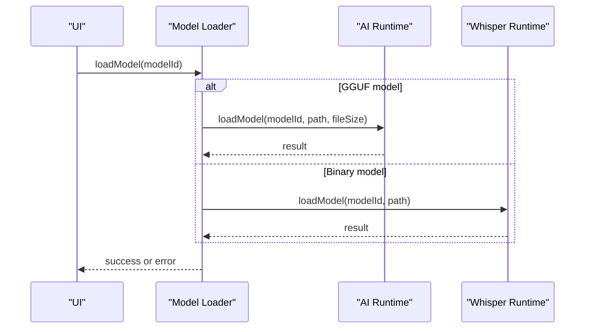
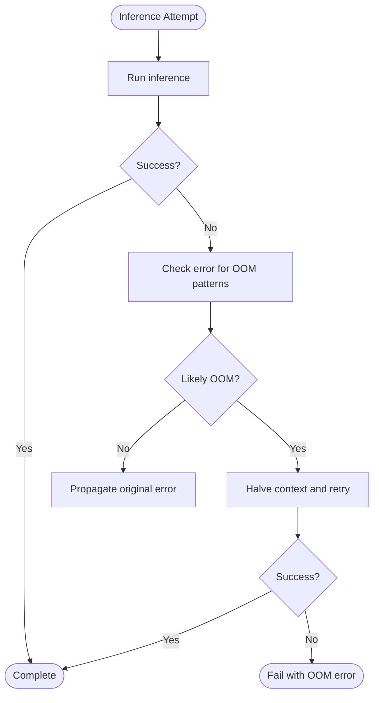
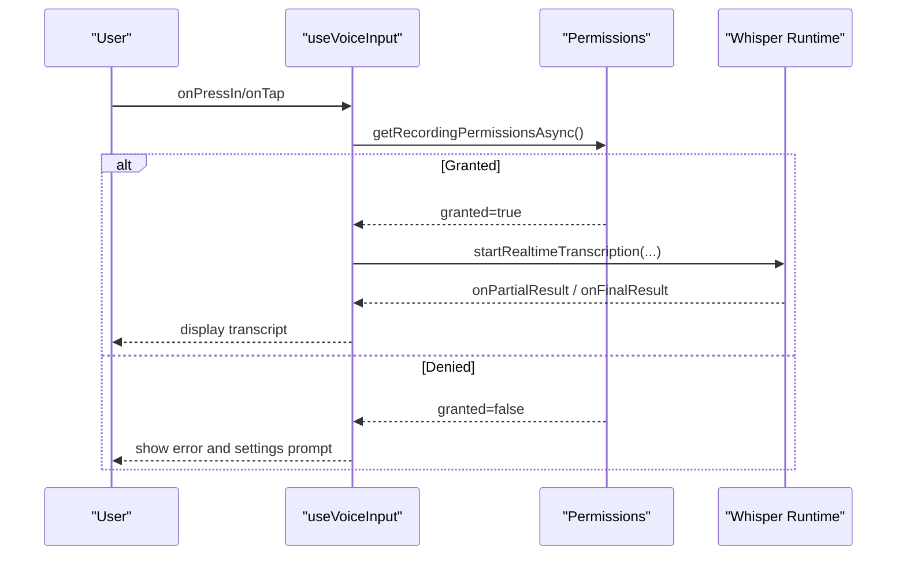
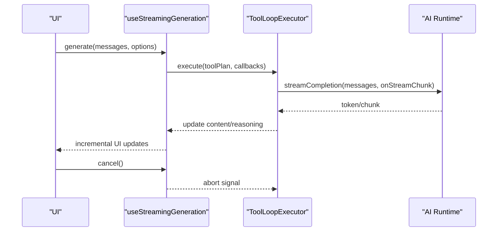
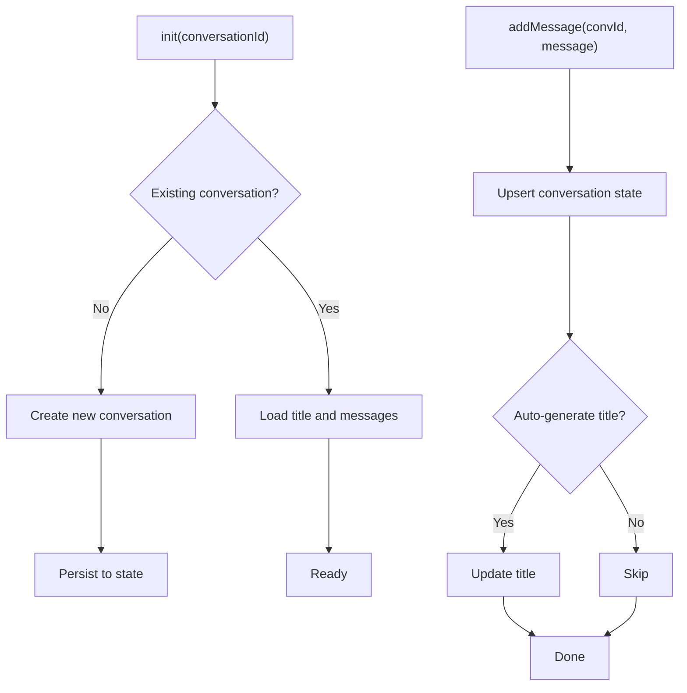
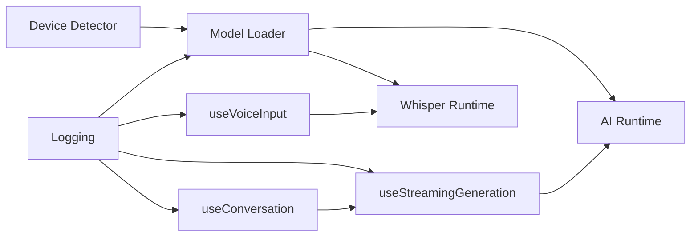
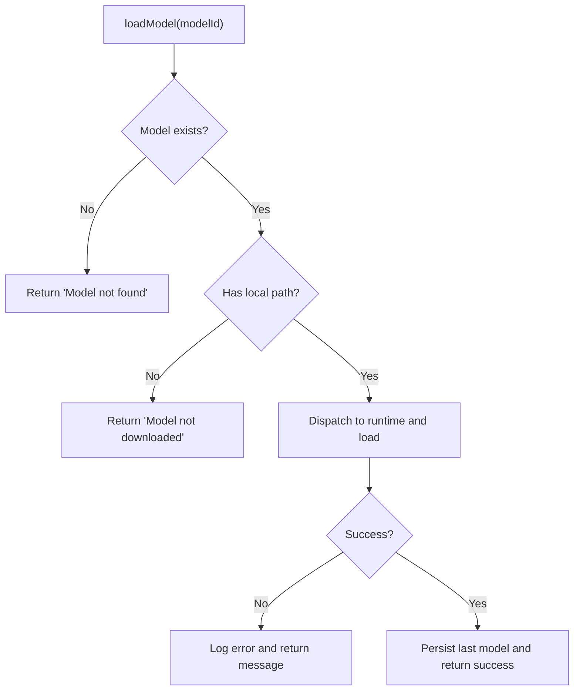
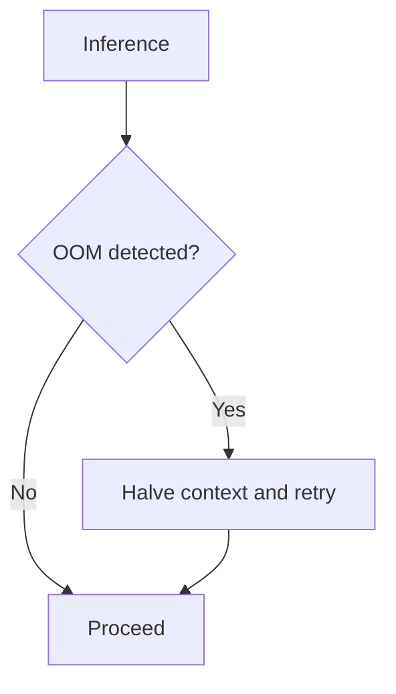

# Troubleshooting & FAQ

<cite>
**Referenced Files in This Document**
- [README.md](file://README.md)
- [shared/ai/log.ts](file://shared/ai/log.ts)
- [shared/ai/model-loader.ts](file://shared/ai/model-loader.ts)
- [shared/ai/text-generation/oom-detection.ts](file://shared/ai/text-generation/oom-detection.ts)
- [shared/device.ts](file://shared/device.ts)
- [shared/ai/stt/index.ts](file://shared/ai/stt/index.ts)
- [shared/ai/stt/runtime.ts](file://shared/ai/stt/runtime.ts)
- [features/chat/view-model/hooks/useVoiceInput.ts](file://features/chat/view-model/hooks/useVoiceInput.ts)
- [features/chat/components/voice-input-button.tsx](file://features/chat/components/voice-input-button.tsx)
- [features/chat/components/recording-indicator.tsx](file://features/chat/components/recording-indicator.tsx)
- [features/chat/view-model/hooks/useConversation.ts](file://features/chat/view-model/hooks/useConversation.ts)
- [features/chat/view-model/hooks/useStreamingGeneration.ts](file://features/chat/view-model/hooks/useStreamingGeneration.ts)
- [features/chat/components/conversation-error-state.tsx](file://features/chat/components/conversation-error-state.tsx)
- [shared/utils/app-error.ts](file://shared/utils/app-error.ts)
- [shared/ai/types/manager.ts](file://shared/ai/types/manager.ts)
</cite>

## Table of Contents
1. [Introduction](#introduction)
2. [Project Structure](#project-structure)
3. [Core Components](#core-components)
4. [Architecture Overview](#architecture-overview)
5. [Detailed Component Analysis](#detailed-component-analysis)
6. [Dependency Analysis](#dependency-analysis)
7. [Performance Considerations](#performance-considerations)
8. [Troubleshooting Guide](#troubleshooting-guide)
9. [FAQ](#faq)
10. [Conclusion](#conclusion)
11. [Appendices](#appendices)

## Introduction
This document provides a comprehensive troubleshooting and FAQ guide for My Shadow. It focuses on resolving common issues such as model loading failures, memory overflow errors, device compatibility, speech processing problems, and chat interface issues. It also explains automatic Out-of-Memory (OOM) detection and fallback mechanisms, outlines debugging techniques, and offers step-by-step resolution paths for frequent scenarios.

## Project Structure
My Shadow organizes functionality around three primary areas:
- AI runtime and model management for text generation and speech-to-text
- Device capability detection and runtime configuration
- Chat UI and streaming generation with error handling and persistence

**Diagram sources**
- [shared/device.ts:122-171](file://shared/device.ts#L122-L171)
- [shared/ai/model-loader.ts:11-63](file://shared/ai/model-loader.ts#L11-L63)
- [shared/ai/stt/runtime.ts:5-79](file://shared/ai/stt/runtime.ts#L5-L79)
- [features/chat/view-model/hooks/useStreamingGeneration.ts:39-164](file://features/chat/view-model/hooks/useStreamingGeneration.ts#L39-L164)
- [features/chat/view-model/hooks/useVoiceInput.ts:59-358](file://features/chat/view-model/hooks/useVoiceInput.ts#L59-L358)
- [features/chat/view-model/hooks/useConversation.ts:11-236](file://features/chat/view-model/hooks/useConversation.ts#L11-L236)
- [features/chat/components/voice-input-button.tsx:22-47](file://features/chat/components/voice-input-button.tsx#L22-L47)
- [features/chat/components/recording-indicator.tsx:43-92](file://features/chat/components/recording-indicator.tsx#L43-L92)
- [features/chat/components/conversation-error-state.tsx:19-58](file://features/chat/components/conversation-error-state.tsx#L19-L58)

**Section sources**
- [README.md:49-118](file://README.md#L49-L118)

## Core Components
- Device detection determines available RAM, CPU cores, and GPU backend to configure runtime behavior.
- Model loader manages GGUF and binary (Whisper) models, persists selection, and logs lifecycle events.
- OOM detection identifies native OOM signals and informs fallback strategies.
- Voice input hook orchestrates permissions, recording lifecycle, and error messaging.
- Streaming generation hook powers real-time assistant responses with tool support and cancellation.
- Conversation hook persists and updates chat state, tracks last model used, and surfaces errors.

**Section sources**
- [shared/device.ts:122-171](file://shared/device.ts#L122-L171)
- [shared/ai/model-loader.ts:11-172](file://shared/ai/model-loader.ts#L11-L172)
- [shared/ai/text-generation/oom-detection.ts:1-37](file://shared/ai/text-generation/oom-detection.ts#L1-L37)
- [features/chat/view-model/hooks/useVoiceInput.ts:59-358](file://features/chat/view-model/hooks/useVoiceInput.ts#L59-L358)
- [features/chat/view-model/hooks/useStreamingGeneration.ts:39-275](file://features/chat/view-model/hooks/useStreamingGeneration.ts#L39-L275)
- [features/chat/view-model/hooks/useConversation.ts:11-236](file://features/chat/view-model/hooks/useConversation.ts#L11-L236)

## Architecture Overview
The system integrates device profiling, model lifecycle, and UI flows. Device detection influences runtime configuration, which in turn affects model loading and inference behavior. Logging is centralized to aid debugging.

**Diagram sources**
- [features/chat/view-model/hooks/useVoiceInput.ts:137-247](file://features/chat/view-model/hooks/useVoiceInput.ts#L137-L247)
- [shared/ai/stt/runtime.ts:20-54](file://shared/ai/stt/runtime.ts#L20-L54)
- [shared/ai/model-loader.ts:11-63](file://shared/ai/model-loader.ts#L11-L63)
- [shared/device.ts:122-171](file://shared/device.ts#L122-L171)

## Detailed Component Analysis

### Model Loading and Unloading
- Unified loader dispatches to the appropriate runtime based on model type (GGUF vs bin).
- Logs start, completion, and error events for diagnostics.
- Persists last used model per type and supports auto-loading the last model.

**Diagram sources**
- [shared/ai/model-loader.ts:11-63](file://shared/ai/model-loader.ts#L11-L63)
- [shared/ai/stt/runtime.ts:20-54](file://shared/ai/stt/runtime.ts#L20-L54)

**Section sources**
- [shared/ai/model-loader.ts:11-172](file://shared/ai/model-loader.ts#L11-L172)
- [shared/ai/types/manager.ts:1-15](file://shared/ai/types/manager.ts#L1-L15)

### Automatic OOM Detection and Fallback
- OOM detection scans error names, messages, and numeric codes for common OOM indicators.
- The runtime adapts to device profiles and can halve context on failure to recover from memory pressure.

**Diagram sources**
- [shared/ai/text-generation/oom-detection.ts:1-37](file://shared/ai/text-generation/oom-detection.ts#L1-L37)
- [README.md:102](file://README.md#L102)

**Section sources**
- [shared/ai/text-generation/oom-detection.ts:1-37](file://shared/ai/text-generation/oom-detection.ts#L1-L37)
- [README.md:102](file://README.md#L102)

### Speech Processing (Microphone, Permissions, Quality)
- Permission checks distinguish between temporary denial and permanent denial.
- Recording lifecycle transitions through idle, recording, and processing states.
- Error messages are mapped to actionable UI prompts.

**Diagram sources**
- [features/chat/view-model/hooks/useVoiceInput.ts:137-247](file://features/chat/view-model/hooks/useVoiceInput.ts#L137-L247)
- [shared/ai/stt/runtime.ts:20-54](file://shared/ai/stt/runtime.ts#L20-L54)

**Section sources**
- [features/chat/view-model/hooks/useVoiceInput.ts:40-55](file://features/chat/view-model/hooks/useVoiceInput.ts#L40-L55)
- [features/chat/view-model/hooks/useVoiceInput.ts:137-179](file://features/chat/view-model/hooks/useVoiceInput.ts#L137-L179)
- [features/chat/view-model/hooks/useVoiceInput.ts:185-247](file://features/chat/view-model/hooks/useVoiceInput.ts#L185-L247)
- [features/chat/view-model/hooks/useVoiceInput.ts:253-269](file://features/chat/view-model/hooks/useVoiceInput.ts#L253-L269)
- [features/chat/components/voice-input-button.tsx:22-47](file://features/chat/components/voice-input-button.tsx#L22-L47)
- [features/chat/components/recording-indicator.tsx:43-92](file://features/chat/components/recording-indicator.tsx#L43-L92)

### Chat Streaming and UI Responsiveness
- Streaming generation maintains a live assistant message and updates content progressively.
- Tool loop executor supports reasoning, retries, and caching to improve reliability.
- Cancellation aborts ongoing generations cleanly.

**Diagram sources**
- [features/chat/view-model/hooks/useStreamingGeneration.ts:52-146](file://features/chat/view-model/hooks/useStreamingGeneration.ts#L52-L146)
- [features/chat/view-model/hooks/useStreamingGeneration.ts:166-275](file://features/chat/view-model/hooks/useStreamingGeneration.ts#L166-L275)

**Section sources**
- [features/chat/view-model/hooks/useStreamingGeneration.ts:39-275](file://features/chat/view-model/hooks/useStreamingGeneration.ts#L39-L275)

### Conversation Persistence and Error States
- Conversation hook initializes, creates, and updates conversations in persistent state.
- Tracks last model used and surfaces user-triggered error codes.
- Error state component provides a clear recovery path to history.

**Diagram sources**
- [features/chat/view-model/hooks/useConversation.ts:16-120](file://features/chat/view-model/hooks/useConversation.ts#L16-L120)

**Section sources**
- [features/chat/view-model/hooks/useConversation.ts:11-236](file://features/chat/view-model/hooks/useConversation.ts#L11-L236)
- [features/chat/components/conversation-error-state.tsx:19-58](file://features/chat/components/conversation-error-state.tsx#L19-L58)

## Dependency Analysis
- Device detection feeds runtime configuration for model loading and inference.
- Model loader depends on catalog and runtime instances to orchestrate model lifecycle.
- Voice input depends on STT runtime and permissions; UI components depend on state hooks.
- Streaming generation depends on AI runtime and tool executor; conversation hook persists state.

**Diagram sources**
- [shared/device.ts:122-171](file://shared/device.ts#L122-L171)
- [shared/ai/model-loader.ts:11-63](file://shared/ai/model-loader.ts#L11-L63)
- [shared/ai/stt/runtime.ts:5-79](file://shared/ai/stt/runtime.ts#L5-L79)
- [features/chat/view-model/hooks/useStreamingGeneration.ts:39-164](file://features/chat/view-model/hooks/useStreamingGeneration.ts#L39-L164)
- [features/chat/view-model/hooks/useVoiceInput.ts:59-358](file://features/chat/view-model/hooks/useVoiceInput.ts#L59-L358)
- [features/chat/view-model/hooks/useConversation.ts:11-236](file://features/chat/view-model/hooks/useConversation.ts#L11-L236)
- [shared/ai/log.ts:7-33](file://shared/ai/log.ts#L7-L33)

**Section sources**
- [shared/device.ts:122-171](file://shared/device.ts#L122-L171)
- [shared/ai/model-loader.ts:11-172](file://shared/ai/model-loader.ts#L11-L172)
- [shared/ai/stt/runtime.ts:5-79](file://shared/ai/stt/runtime.ts#L5-L79)
- [features/chat/view-model/hooks/useStreamingGeneration.ts:39-275](file://features/chat/view-model/hooks/useStreamingGeneration.ts#L39-L275)
- [features/chat/view-model/hooks/useVoiceInput.ts:59-358](file://features/chat/view-model/hooks/useVoiceInput.ts#L59-L358)
- [features/chat/view-model/hooks/useConversation.ts:11-236](file://features/chat/view-model/hooks/useConversation.ts#L11-L236)
- [shared/ai/log.ts:7-33](file://shared/ai/log.ts#L7-L33)

## Performance Considerations
- Device tiers automatically tune context size, KV cache quantization, and GPU offload to balance throughput and stability.
- Memory monitoring and OOM fallback reduce crash rates on constrained devices.
- mmap loading and quantized caches lower cold-start memory usage on budget devices.

**Section sources**
- [README.md:86-104](file://README.md#L86-L104)
- [README.md:133-146](file://README.md#L133-L146)

## Troubleshooting Guide

### Model Loading Failures
Symptoms:
- “Model not found” or “Model not downloaded”
- Persistent “No model loaded” prompts

Resolution steps:
1. Verify model availability in the catalog and ensure it was downloaded.
2. Confirm the correct runtime is being used (GGUF vs bin).
3. Clear persisted last model selection and retry auto-load.
4. Reinstall or redownload the model if corrupted.

**Diagram sources**
- [shared/ai/model-loader.ts:11-63](file://shared/ai/model-loader.ts#L11-L63)

**Section sources**
- [shared/ai/model-loader.ts:11-63](file://shared/ai/model-loader.ts#L11-L63)
- [shared/ai/types/manager.ts:10-15](file://shared/ai/types/manager.ts#L10-L15)

### Memory Overflow Errors (OOM)
Symptoms:
- Crash or immediate failure during inference
- “Out of memory” or allocation-related error messages

Resolution steps:
1. Confirm OOM detection recognizes the error.
2. Allow automatic fallback to halve context and retry.
3. Reduce concurrent tasks or close other memory-intensive apps.
4. Use a smaller model or adjust runtime configuration.

**Diagram sources**
- [shared/ai/text-generation/oom-detection.ts:1-37](file://shared/ai/text-generation/oom-detection.ts#L1-L37)

**Section sources**
- [shared/ai/text-generation/oom-detection.ts:1-37](file://shared/ai/text-generation/oom-detection.ts#L1-L37)
- [README.md:102](file://README.md#L102)

### Device Compatibility Issues
Symptoms:
- Poor performance, frequent crashes, or missing GPU acceleration

Resolution steps:
1. Review device tier and runtime configuration derived from device detection.
2. Ensure OS and GPU backend compatibility (Metal on iOS; Vulkan/OpenCL on Android).
3. Lower context size or disable GPU layers if unstable.

**Section sources**
- [shared/device.ts:122-171](file://shared/device.ts#L122-L171)
- [README.md:141-146](file://README.md#L141-L146)

### Speech Processing Problems
Symptoms:
- Microphone permission denied
- No audio input or garbled transcription
- “Out of memory” during recording

Resolution steps:
1. Grant recording permission; handle permanent denial by directing to system settings.
2. Ensure a Whisper model is loaded; prompt to download if not present.
3. Reduce ambient noise and try shorter recordings.
4. If “Out of memory,” stop recording and free memory.

**Section sources**
- [features/chat/view-model/hooks/useVoiceInput.ts:137-179](file://features/chat/view-model/hooks/useVoiceInput.ts#L137-L179)
- [features/chat/view-model/hooks/useVoiceInput.ts:253-269](file://features/chat/view-model/hooks/useVoiceInput.ts#L253-L269)
- [shared/ai/stt/runtime.ts:20-54](file://shared/ai/stt/runtime.ts#L20-L54)

### Chat Interface Problems
Symptoms:
- Streaming display stalls or never appears
- Conversation fails to load or shows error state
- UI becomes unresponsive during generation

Resolution steps:
1. Cancel generation if stuck; ensure abort controller is respected.
2. Verify conversation exists and is not corrupted; use error state UI to return to history.
3. Reduce message length or tool usage to minimize memory pressure.

**Section sources**
- [features/chat/view-model/hooks/useStreamingGeneration.ts:148-152](file://features/chat/view-model/hooks/useStreamingGeneration.ts#L148-L152)
- [features/chat/components/conversation-error-state.tsx:19-58](file://features/chat/components/conversation-error-state.tsx#L19-L58)

### Step-by-Step Resolution Guides

- Model reinstallation
  - Remove downloaded model from storage
  - Redownload model via catalog
  - Confirm load completes and last model is persisted

- Cache clearing
  - Clear persisted last model selections
  - Restart app to reinitialize runtime configuration

- Configuration resets
  - Reset device profile-derived settings
  - Retry with default runtime configuration

**Section sources**
- [shared/ai/model-loader.ts:65-112](file://shared/ai/model-loader.ts#L65-L112)
- [shared/ai/model-loader.ts:123-137](file://shared/ai/model-loader.ts#L123-L137)

### Debugging Techniques
- Enable AI runtime logs to capture model load/unload and inference events.
- Use error codes to filter and categorize issues.
- Inspect device profile logs to verify runtime configuration.

**Section sources**
- [shared/ai/log.ts:7-33](file://shared/ai/log.ts#L7-L33)
- [shared/utils/app-error.ts:8-24](file://shared/utils/app-error.ts#L8-L24)
- [shared/device.ts:162-168](file://shared/device.ts#L162-L168)

## FAQ

Q: What privacy guarantees does My Shadow provide?
A: All data remains on device with encrypted storage; there is no cloud sync or external API calls.

**Section sources**
- [README.md:3](file://README.md#L3)

Q: Which models are compatible?
A: GGUF models are used for LLM inference; binary Whisper models are used for speech-to-text. Models are selected based on available device RAM.

**Section sources**
- [README.md:70-84](file://README.md#L70-L84)
- [shared/ai/types/manager.ts:1](file://shared/ai/types/manager.ts#L1)

Q: How does the app handle memory pressure?
A: It detects OOM conditions and automatically halves context size to recover. Device tiers adapt KV cache quantization and GPU offload.

**Section sources**
- [README.md:102](file://README.md#L102)
- [README.md:133-139](file://README.md#L133-L139)

Q: Why does my voice input fail?
A: Common causes include missing permissions, no model loaded, or insufficient memory. Check permissions, ensure a Whisper model is loaded, and reduce background activity.

**Section sources**
- [features/chat/view-model/hooks/useVoiceInput.ts:137-179](file://features/chat/view-model/hooks/useVoiceInput.ts#L137-L179)
- [features/chat/view-model/hooks/useVoiceInput.ts:253-269](file://features/chat/view-model/hooks/useVoiceInput.ts#L253-L269)

Q: How do I fix streaming display issues?
A: Cancel the current generation, reduce tool usage or message length, and retry. Ensure device tier settings are appropriate for your hardware.

**Section sources**
- [features/chat/view-model/hooks/useStreamingGeneration.ts:148-152](file://features/chat/view-model/hooks/useStreamingGeneration.ts#L148-L152)

Q: How do I report complex issues?
A: Use the logging system to capture detailed logs, reproduce with minimal steps, and share device profile and error codes with community support channels.

**Section sources**
- [shared/ai/log.ts:7-33](file://shared/ai/log.ts#L7-L33)
- [README.md:201-207](file://README.md#L201-L207)

## Conclusion
This guide consolidates practical troubleshooting steps, device-specific considerations, and debugging techniques for My Shadow. By leveraging automatic OOM detection, device-aware runtime configuration, and robust logging, most issues can be resolved quickly. For persistent problems, follow the step-by-step resolutions and escalate with detailed logs and error codes.

## Appendices

### Device Profiles and Expectations
- Budget (< 5 GB): Reduced KV cache quantization, CPU-only inference
- Mid-Range (5–7 GB): Balanced GPU layers and context size
- Premium (≥ 7 GB): Full GPU offload and higher throughput

**Section sources**
- [README.md:90-97](file://README.md#L90-L97)
- [README.md:133-139](file://README.md#L133-L139)