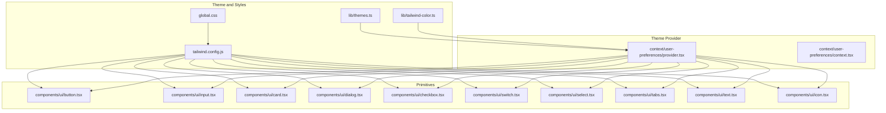
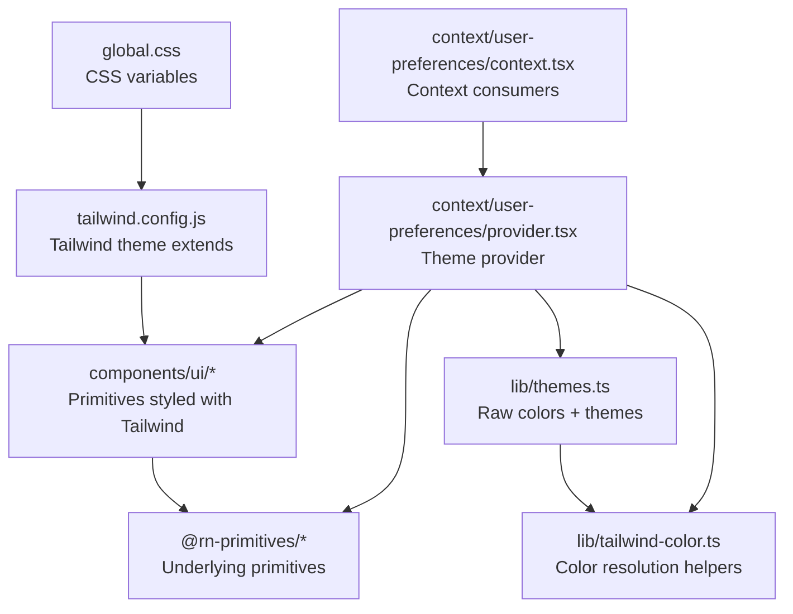
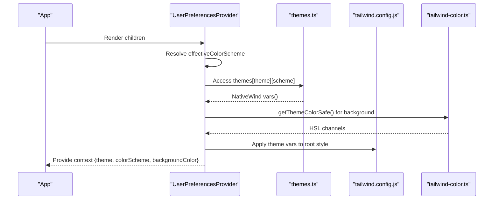
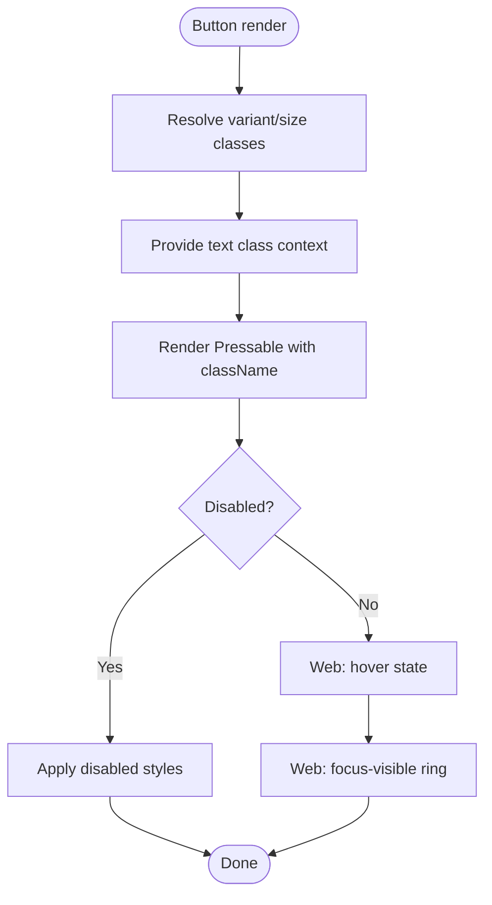
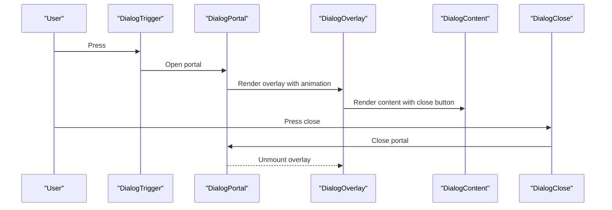
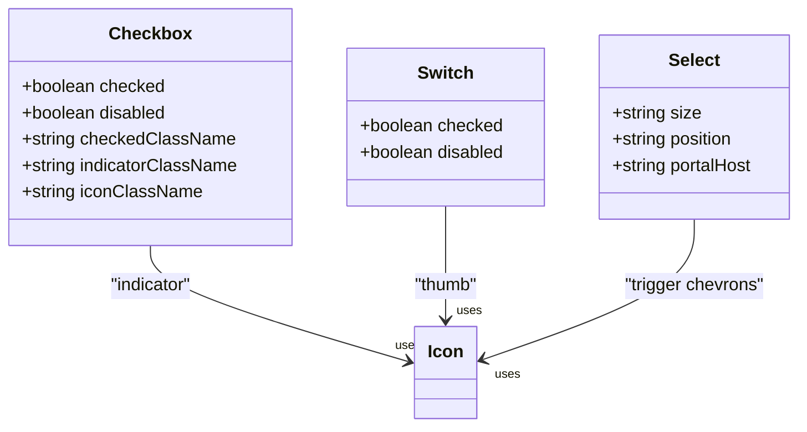
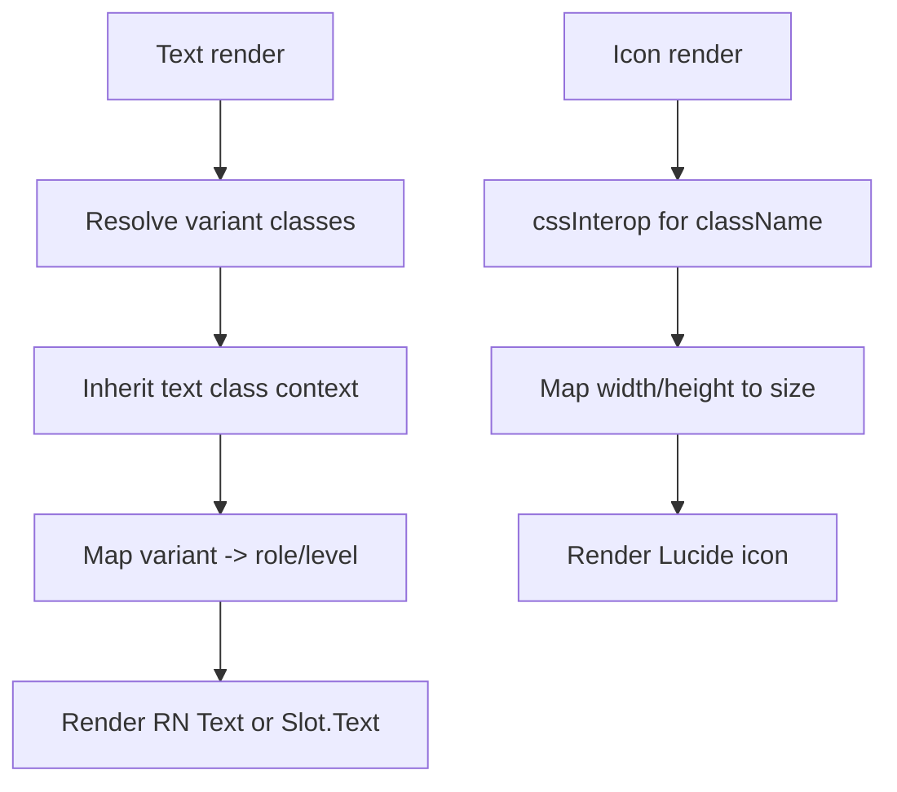
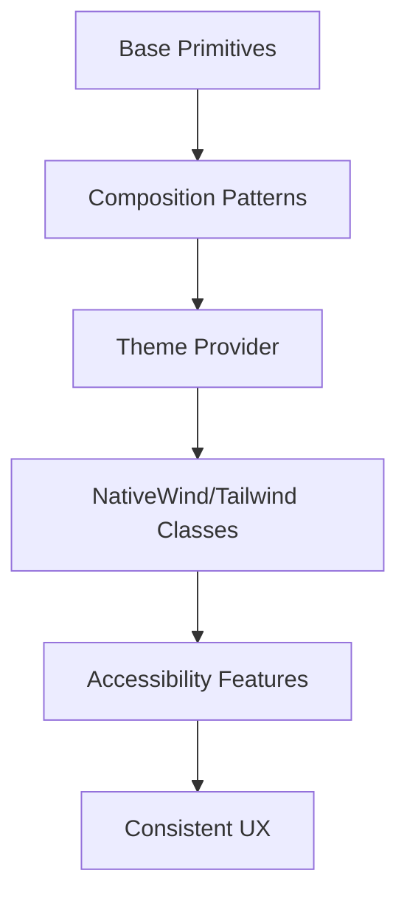
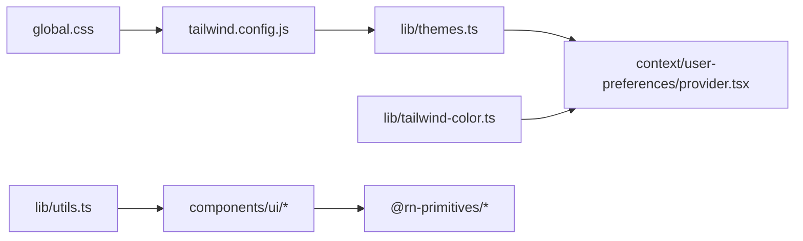

# UI Component System

<cite>
**Referenced Files in This Document**
- [themes.ts](file://lib/themes.ts)
- [tailwind-color.ts](file://lib/tailwind-color.ts)
- [global.css](file://global.css)
- [tailwind.config.js](file://tailwind.config.js)
- [provider.tsx](file://context/user-preferences/provider.tsx)
- [context.tsx](file://context/user-preferences/context.tsx)
- [utils.ts](file://lib/utils.ts)
- [button.tsx](file://components/ui/button.tsx)
- [input.tsx](file://components/ui/input.tsx)
- [card.tsx](file://components/ui/card.tsx)
- [dialog.tsx](file://components/ui/dialog.tsx)
- [checkbox.tsx](file://components/ui/checkbox.tsx)
- [switch.tsx](file://components/ui/switch.tsx)
- [select.tsx](file://components/ui/select.tsx)
- [tabs.tsx](file://components/ui/tabs.tsx)
- [text.tsx](file://components/ui/text.tsx)
- [icon.tsx](file://components/ui/icon.tsx)
</cite>

## Table of Contents
1. [Introduction](#introduction)
2. [Project Structure](#project-structure)
3. [Core Components](#core-components)
4. [Architecture Overview](#architecture-overview)
5. [Detailed Component Analysis](#detailed-component-analysis)
6. [Dependency Analysis](#dependency-analysis)
7. [Performance Considerations](#performance-considerations)
8. [Troubleshooting Guide](#troubleshooting-guide)
9. [Conclusion](#conclusion)
10. [Appendices](#appendices)

## Introduction
This document describes the UI component system for My Shadow’s design system and component library. The system is built on @rn-primitives primitives and integrates NativeWind/Tailwind CSS for styling across React Native environments. It includes a robust theme provider supporting light/dark modes and color customization, a set of primitive components (buttons, inputs, cards, dialogs, forms), and composition patterns that combine primitives into feature-specific UI elements. Accessibility features such as ARIA roles, keyboard navigation, and screen reader support are integrated into components. The styling architecture leverages Tailwind utility classes adapted for React Native via NativeWind, with a centralized theme system and color resolution utilities.

## Project Structure
The UI system is organized around:
- Theme and color system under lib/
- Primitive UI components under components/ui/
- Theme provider and user preferences under context/user-preferences/
- Global styles and Tailwind configuration at the project root

**Diagram sources**
- [themes.ts:1-141](file://lib/themes.ts#L1-L141)
- [tailwind-color.ts:1-250](file://lib/tailwind-color.ts#L1-L250)
- [global.css:1-105](file://global.css#L1-L105)
- [tailwind.config.js:1-79](file://tailwind.config.js#L1-L79)
- [provider.tsx:1-157](file://context/user-preferences/provider.tsx#L1-L157)
- [context.tsx:1-22](file://context/user-preferences/context.tsx#L1-L22)
- [button.tsx:1-107](file://components/ui/button.tsx#L1-L107)
- [input.tsx:1-37](file://components/ui/input.tsx#L1-L37)
- [card.tsx:1-53](file://components/ui/card.tsx#L1-L53)
- [dialog.tsx:1-141](file://components/ui/dialog.tsx#L1-L141)
- [checkbox.tsx:1-48](file://components/ui/checkbox.tsx#L1-L48)
- [switch.tsx:1-37](file://components/ui/switch.tsx#L1-L37)
- [select.tsx:1-241](file://components/ui/select.tsx#L1-L241)
- [tabs.tsx:1-69](file://components/ui/tabs.tsx#L1-L69)
- [text.tsx:1-89](file://components/ui/text.tsx#L1-L89)
- [icon.tsx:1-58](file://components/ui/icon.tsx#L1-L58)

**Section sources**
- [themes.ts:1-141](file://lib/themes.ts#L1-L141)
- [tailwind.config.js:1-79](file://tailwind.config.js#L1-L79)
- [global.css:1-105](file://global.css#L1-L105)
- [provider.tsx:1-157](file://context/user-preferences/provider.tsx#L1-L157)
- [context.tsx:1-22](file://context/user-preferences/context.tsx#L1-L22)

## Core Components
This section documents the primitive components and their variants, states, and customization options.

- Button
  - Variants: default, destructive, outline, secondary, ghost, link
  - Sizes: default, sm, lg, icon
  - States: disabled, hover (web), focus-visible (ring), active
  - Composition: Provides a text class context for child text components
  - Accessibility: role="button"; supports focus-visible rings and ARIA invalid states
  - Customization: className override; variant/size props; platform-specific behavior

- Input
  - States: disabled, editable=false, placeholder, focus-visible (ring), aria-invalid
  - Composition: Inherits background/border/foreground from theme
  - Accessibility: focus-visible ring; placeholder contrast; selection styles (web)
  - Customization: className override; platform-specific focus/placeholder behavior

- Card
  - Sections: Card, CardHeader, CardTitle, CardDescription, CardContent, CardFooter
  - Composition: Provides a text class context for card content
  - Accessibility: CardTitle sets role="heading" and aria-level=3
  - Customization: className override per section

- Dialog
  - Parts: Root, Trigger, Portal, Overlay, Content, Close, Header, Footer, Title, Description
  - States: open/closed; animated overlay/content transitions
  - Accessibility: Close button includes screen-reader-only label; portal host support
  - Customization: portalHost prop; className overrides; platform-specific overlay behavior

- Checkbox
  - States: checked, disabled; focus-visible ring (web)
  - Composition: Indicator with icon; customizable checkedClassName, indicatorClassName, iconClassName
  - Accessibility: Focus-visible ring; hitSlop for touch targets
  - Customization: className overrides; props forwarded to root

- Switch
  - States: checked, disabled; focus-visible ring (web)
  - Composition: Thumb translates to indicate state; dark mode foreground/background adjustments
  - Accessibility: Focus-visible ring; pointer-events handling (web)
  - Customization: className overrides; props forwarded to root

- Select
  - Parts: Root, Trigger, Value, Content, Group, Label, Item, Separator, ScrollUp/Down Buttons (web)
  - States: open/close; selected item; disabled
  - Accessibility: Keyboard navigation; viewport sizing; scroll buttons (web)
  - Customization: size prop (default/sm); position prop (popper); portalHost; className overrides

- Tabs
  - Parts: Root, List, Trigger, Content
  - States: active trigger; disabled triggers
  - Composition: Text class context for triggers; platform-specific layout
  - Accessibility: Focus-visible ring; disabled pointer-events
  - Customization: className overrides; props forwarded to primitives

- Text
  - Variants: default, h1, h2, h3, h4, p, blockquote, code, lead, large, small, muted
  - Accessibility: Role and aria-level mapping for headings; select-text on web
  - Customization: variant prop; asChild; className override

- Icon
  - Purpose: Wrapper for Lucide icons with NativeWind className support via cssInterop
  - Composition: Inherits text class context; applies text-foreground by default
  - Customization: className, size props; as prop for icon component

**Section sources**
- [button.tsx:1-107](file://components/ui/button.tsx#L1-L107)
- [input.tsx:1-37](file://components/ui/input.tsx#L1-L37)
- [card.tsx:1-53](file://components/ui/card.tsx#L1-L53)
- [dialog.tsx:1-141](file://components/ui/dialog.tsx#L1-L141)
- [checkbox.tsx:1-48](file://components/ui/checkbox.tsx#L1-L48)
- [switch.tsx:1-37](file://components/ui/switch.tsx#L1-L37)
- [select.tsx:1-241](file://components/ui/select.tsx#L1-L241)
- [tabs.tsx:1-69](file://components/ui/tabs.tsx#L1-L69)
- [text.tsx:1-89](file://components/ui/text.tsx#L1-L89)
- [icon.tsx:1-58](file://components/ui/icon.tsx#L1-L58)

## Architecture Overview
The UI architecture combines:
- Centralized theme system with raw color tokens and NativeWind vars
- Theme provider resolving effective scheme and background color
- Primitive components consuming theme variables and platform-specific behavior
- Composition patterns using contexts and @rn-primitives primitives

**Diagram sources**
- [themes.ts:1-141](file://lib/themes.ts#L1-L141)
- [tailwind-color.ts:1-250](file://lib/tailwind-color.ts#L1-L250)
- [global.css:1-105](file://global.css#L1-L105)
- [tailwind.config.js:1-79](file://tailwind.config.js#L1-L79)
- [provider.tsx:1-157](file://context/user-preferences/provider.tsx#L1-L157)
- [context.tsx:1-22](file://context/user-preferences/context.tsx#L1-L22)
- [button.tsx:1-107](file://components/ui/button.tsx#L1-L107)
- [input.tsx:1-37](file://components/ui/input.tsx#L1-L37)
- [card.tsx:1-53](file://components/ui/card.tsx#L1-L53)
- [dialog.tsx:1-141](file://components/ui/dialog.tsx#L1-L141)
- [checkbox.tsx:1-48](file://components/ui/checkbox.tsx#L1-L48)
- [switch.tsx:1-37](file://components/ui/switch.tsx#L1-L37)
- [select.tsx:1-241](file://components/ui/select.tsx#L1-L241)
- [tabs.tsx:1-69](file://components/ui/tabs.tsx#L1-L69)
- [text.tsx:1-89](file://components/ui/text.tsx#L1-L89)
- [icon.tsx:1-58](file://components/ui/icon.tsx#L1-L58)

## Detailed Component Analysis

### Theme System and Provider
The theme system defines color tokens and exposes NativeWind-compatible theme variables. The provider resolves the effective color scheme (light/dark/system), applies theme variables to the root view, and computes a background color derived from theme variables.

**Diagram sources**
- [provider.tsx:1-157](file://context/user-preferences/provider.tsx#L1-L157)
- [themes.ts:135-141](file://lib/themes.ts#L135-L141)
- [tailwind.config.js:13-79](file://tailwind.config.js#L13-L79)
- [tailwind-color.ts:118-154](file://lib/tailwind-color.ts#L118-L154)

**Section sources**
- [themes.ts:1-141](file://lib/themes.ts#L1-L141)
- [provider.tsx:1-157](file://context/user-preferences/provider.tsx#L1-L157)
- [tailwind-color.ts:1-250](file://lib/tailwind-color.ts#L1-L250)
- [tailwind.config.js:1-79](file://tailwind.config.js#L1-L79)
- [global.css:1-105](file://global.css#L1-L105)

### Button Component Flow
The Button component composes variant and size classes, provides a text class context, and applies platform-specific focus and hover behaviors.

**Diagram sources**
- [button.tsx:6-54](file://components/ui/button.tsx#L6-L54)
- [button.tsx:93-103](file://components/ui/button.tsx#L93-L103)

**Section sources**
- [button.tsx:1-107](file://components/ui/button.tsx#L1-L107)

### Dialog Interaction Sequence
Dialog composes overlay, content, and close behavior with animations and portal support.

**Diagram sources**
- [dialog.tsx:11-88](file://components/ui/dialog.tsx#L11-L88)

**Section sources**
- [dialog.tsx:1-141](file://components/ui/dialog.tsx#L1-L141)

### Form Controls: Checkbox, Switch, Select
These components demonstrate consistent focus-visible rings, platform-specific behavior, and composition with indicators and icons.

**Diagram sources**
- [checkbox.tsx:9-44](file://components/ui/checkbox.tsx#L9-L44)
- [switch.tsx:5-33](file://components/ui/switch.tsx#L5-L33)
- [select.tsx:39-130](file://components/ui/select.tsx#L39-L130)

**Section sources**
- [checkbox.tsx:1-48](file://components/ui/checkbox.tsx#L1-L48)
- [switch.tsx:1-37](file://components/ui/switch.tsx#L1-L37)
- [select.tsx:1-241](file://components/ui/select.tsx#L1-L241)

### Typography and Icons
Text supports semantic variants with ARIA roles and levels. Icon wraps Lucide components with NativeWind className support.

**Diagram sources**
- [text.tsx:67-86](file://components/ui/text.tsx#L67-L86)
- [icon.tsx:11-55](file://components/ui/icon.tsx#L11-L55)

**Section sources**
- [text.tsx:1-89](file://components/ui/text.tsx#L1-L89)
- [icon.tsx:1-58](file://components/ui/icon.tsx#L1-L58)

### Conceptual Overview
The component system follows a layered approach:
- Base primitives expose props for variants, sizes, and states
- Composition patterns use contexts to propagate text classes and roles
- Theme provider injects NativeWind variables and resolves effective scheme
- Accessibility is embedded via ARIA attributes, focus-visible rings, and semantic roles

[No sources needed since this diagram shows conceptual workflow, not actual code structure]

[No sources needed since this section doesn't analyze specific source files]

## Dependency Analysis
Key dependencies and relationships:
- Tailwind configuration extends CSS variables from global.css and maps them to theme colors
- Primitives depend on @rn-primitives for cross-platform primitives and NativeWind for styling
- Theme provider depends on theme tokens and color resolution utilities
- Utilities like cn merge Tailwind classes safely

**Diagram sources**
- [tailwind.config.js:13-79](file://tailwind.config.js#L13-L79)
- [themes.ts:1-141](file://lib/themes.ts#L1-L141)
- [provider.tsx:1-157](file://context/user-preferences/provider.tsx#L1-L157)
- [utils.ts:1-7](file://lib/utils.ts#L1-L7)
- [tailwind-color.ts:1-250](file://lib/tailwind-color.ts#L1-L250)
- [global.css:1-105](file://global.css#L1-L105)

**Section sources**
- [tailwind.config.js:1-79](file://tailwind.config.js#L1-L79)
- [themes.ts:1-141](file://lib/themes.ts#L1-L141)
- [provider.tsx:1-157](file://context/user-preferences/provider.tsx#L1-L157)
- [utils.ts:1-7](file://lib/utils.ts#L1-L7)
- [tailwind-color.ts:1-250](file://lib/tailwind-color.ts#L1-L250)
- [global.css:1-105](file://global.css#L1-L105)

## Performance Considerations
- Prefer variant and size props over dynamic inline styles to leverage static Tailwind classes
- Use memoization in providers to avoid unnecessary re-renders (already implemented)
- Keep className merging minimal; use cn sparingly
- Avoid excessive nested contexts; reuse existing contexts (e.g., TextClassContext)
- On web, minimize heavy focus-visible rings and hover effects; keep them scoped to interactive elements

[No sources needed since this section provides general guidance]

## Troubleshooting Guide
Common issues and resolutions:
- Theme variables not applied
  - Verify theme provider wraps the app and theme vars are passed to the root view
  - Confirm effectiveColorScheme resolves correctly (system vs explicit)
  - Check that rawColors and themes match the configured theme name
  - See [provider.tsx:135-153](file://context/user-preferences/provider.tsx#L135-L153), [themes.ts:135-141](file://lib/themes.ts#L135-L141)

- Colors not resolving
  - Use getThemeColorSafe/getThemeColorHex to resolve CSS variables to hex/HSL
  - Validate var names match rawColors keys
  - See [tailwind-color.ts:118-154](file://lib/tailwind-color.ts#L118-L154), [tailwind-color.ts:214-249](file://lib/tailwind-color.ts#L214-L249)

- Focus-visible rings not visible
  - Ensure platform-specific focus-visible classes are present
  - Confirm Tailwind utilities are included and not purged
  - See [button.tsx:10](file://components/ui/button.tsx#L10), [input.tsx:22-28](file://components/ui/input.tsx#L22-L28)

- Dialog portal not rendering
  - Verify portalHost is set and FullWindowOverlay is used on iOS
  - Ensure overlay asChild behavior matches platform expectations
  - See [dialog.tsx:19](file://components/ui/dialog.tsx#L19), [dialog.tsx:39](file://components/ui/dialog.tsx#L39)

**Section sources**
- [provider.tsx:135-153](file://context/user-preferences/provider.tsx#L135-L153)
- [themes.ts:135-141](file://lib/themes.ts#L135-L141)
- [tailwind-color.ts:118-154](file://lib/tailwind-color.ts#L118-L154)
- [tailwind-color.ts:214-249](file://lib/tailwind-color.ts#L214-L249)
- [button.tsx:10](file://components/ui/button.tsx#L10)
- [input.tsx:22-28](file://components/ui/input.tsx#L22-L28)
- [dialog.tsx:19](file://components/ui/dialog.tsx#L19)
- [dialog.tsx:39](file://components/ui/dialog.tsx#L39)

## Conclusion
My Shadow’s UI component system integrates @rn-primitives with NativeWind/Tailwind CSS to deliver a consistent, accessible, and extensible design system. The theme provider ensures seamless light/dark mode switching and color customization, while primitive components encapsulate variants, states, and accessibility features. Composition patterns enable building feature-specific UIs from primitives, and the styling architecture scales across platforms with responsive and cross-platform considerations.

[No sources needed since this section summarizes without analyzing specific files]

## Appendices

### Component API Reference Index
- Button: props include className, variant, size; states include disabled, hover (web), focus-visible, active
- Input: props include className, editable; states include disabled, focus-visible, aria-invalid
- Card: sections accept className; CardTitle sets role and aria-level
- Dialog: parts include Root, Trigger, Portal, Overlay, Content, Close, Header, Footer, Title, Description
- Checkbox: props include checkedClassName, indicatorClassName, iconClassName; states include checked, disabled
- Switch: props include checked, disabled; states include focus-visible
- Select: props include size, position, portalHost; parts include Trigger, Content, Item, Label, Separator, ScrollUp/Down Buttons (web)
- Tabs: parts include Root, List, Trigger, Content; states include active, disabled
- Text: props include variant, asChild; variants include h1–h4, p, blockquote, code, lead, large, small, muted
- Icon: props include as (Lucide icon), className, size

**Section sources**
- [button.tsx:91-107](file://components/ui/button.tsx#L91-L107)
- [input.tsx:5-37](file://components/ui/input.tsx#L5-L37)
- [card.tsx:23-50](file://components/ui/card.tsx#L23-L50)
- [dialog.tsx:11-141](file://components/ui/dialog.tsx#L11-L141)
- [checkbox.tsx:9-48](file://components/ui/checkbox.tsx#L9-L48)
- [switch.tsx:5-37](file://components/ui/switch.tsx#L5-L37)
- [select.tsx:14-241](file://components/ui/select.tsx#L14-L241)
- [tabs.tsx:6-69](file://components/ui/tabs.tsx#L6-L69)
- [text.tsx:67-89](file://components/ui/text.tsx#L67-L89)
- [icon.tsx:7-58](file://components/ui/icon.tsx#L7-L58)